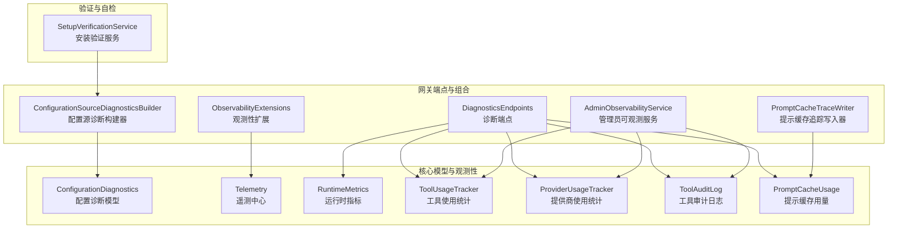
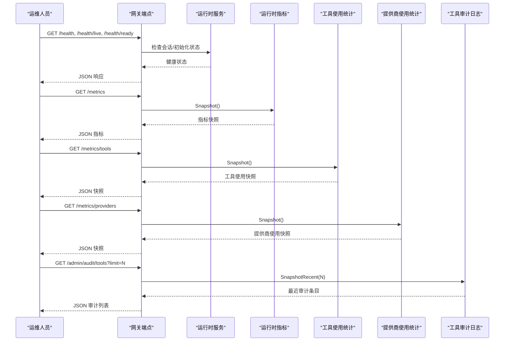
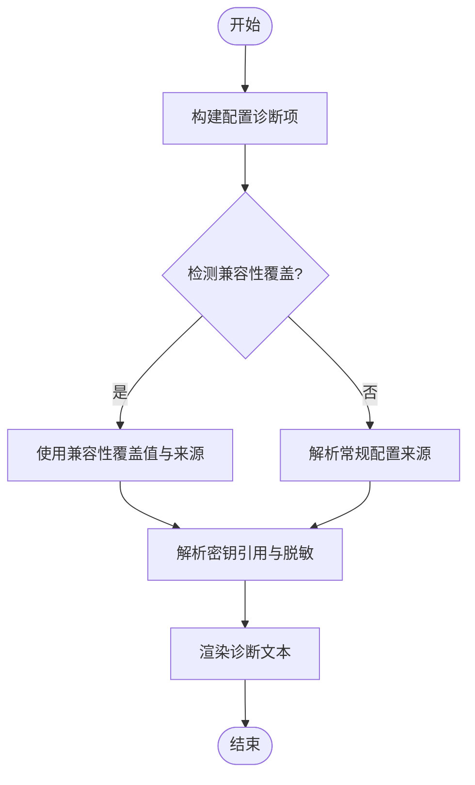
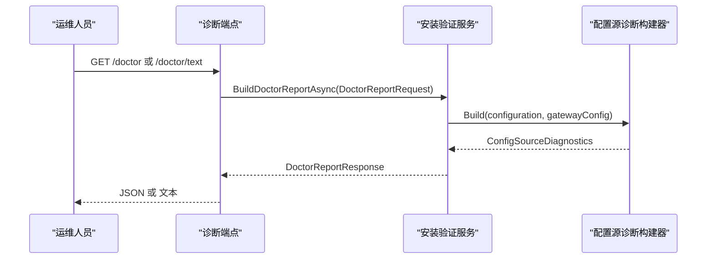
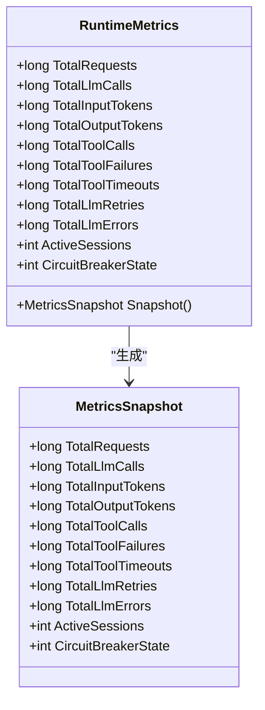
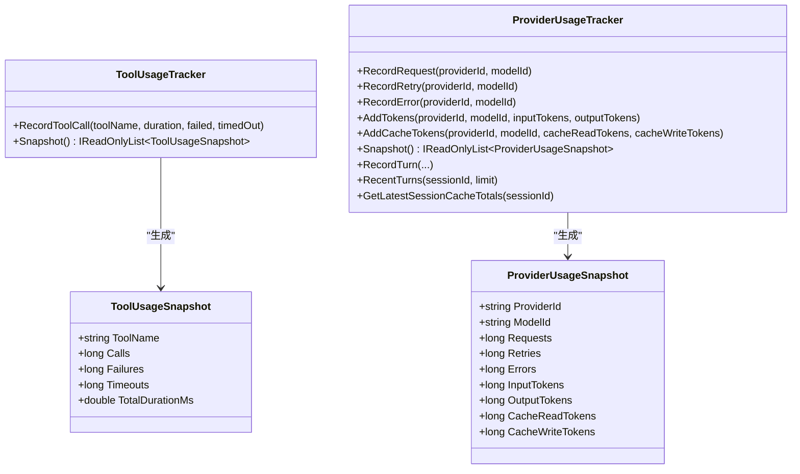
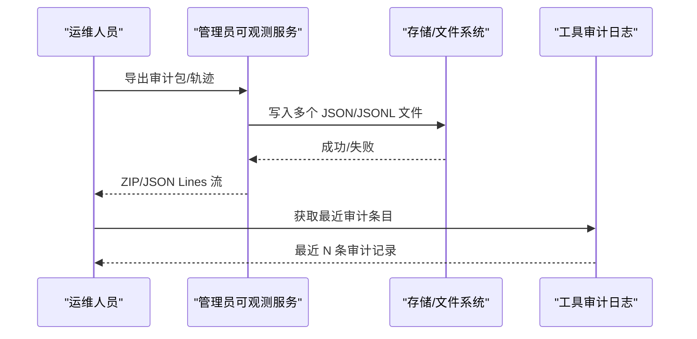
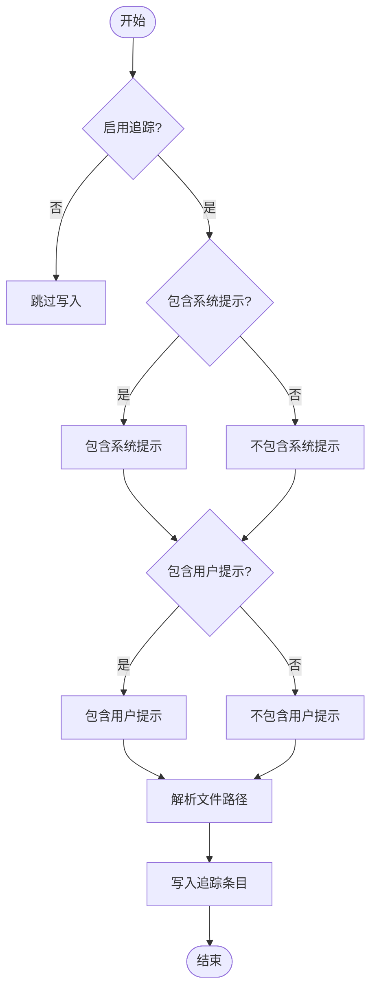
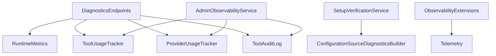

# 诊断配置

<cite>
**本文档引用的文件**
- [ConfigurationDiagnostics.cs](file://src/OpenClaw.Core/Models/ConfigurationDiagnostics.cs)
- [ConfigurationSourceDiagnosticsBuilder.cs](file://src/OpenClaw.Gateway/Bootstrap/ConfigurationSourceDiagnosticsBuilder.cs)
- [DiagnosticsEndpoints.cs](file://src/OpenClaw.Gateway/Endpoints/DiagnosticsEndpoints.cs)
- [Telemetry.cs](file://src/OpenClaw.Core/Observability/Telemetry.cs)
- [RuntimeMetrics.cs](file://src/OpenClaw.Core/Observability/RuntimeMetrics.cs)
- [ToolUsageTracker.cs](file://src/OpenClaw.Core/Observability/ToolUsageTracker.cs)
- [ProviderUsageTracker.cs](file://src/OpenClaw.Core/Observability/ProviderUsageTracker.cs)
- [ToolAuditLog.cs](file://src/OpenClaw.Core/Observability/ToolAuditLog.cs)
- [PromptCacheUsage.cs](file://src/OpenClaw.Core/Observability/PromptCacheUsage.cs)
- [ObservabilityExtensions.cs](file://src/OpenClaw.Gateway/Composition/ObservabilityExtensions.cs)
- [AdminObservabilityService.cs](file://src/OpenClaw.Gateway/AdminObservabilityService.cs)
- [PromptCacheTraceWriter.cs](file://src/OpenClaw.Gateway/PromptCaching/PromptCacheTraceWriter.cs)
- [SetupVerificationService.cs](file://src/OpenClaw.Core/Validation/SetupVerificationService.cs)
</cite>

## 目录
1. [简介](#简介)
2. [项目结构](#项目结构)
3. [核心组件](#核心组件)
4. [架构总览](#架构总览)
5. [详细组件分析](#详细组件分析)
6. [依赖关系分析](#依赖关系分析)
7. [性能考量](#性能考量)
8. [故障排查指南](#故障排查指南)
9. [结论](#结论)
10. [附录](#附录)

## 简介
本文件面向诊断配置系统的使用者与维护者，系统化阐述诊断配置的核心能力与实现方式，包括：
- 提示缓存跟踪：记录与导出提示缓存命中/写入情况，支持可选的消息内容脱敏输出。
- 性能监控：运行时指标采集（请求量、令牌用量、工具调用、会话状态等），并提供健康检查端点。
- 健康检查设置：提供存活探针、就绪探针与自检报告，便于运维与自动化编排。
- 配置诊断：解析配置来源与覆盖关系，识别密钥与兼容性覆盖，生成可读的诊断文本。
- 数据收集与审计：工具执行审计日志、最近事件快照、轨迹导出与治理记录导出，支持匿名化与合规导出。

## 项目结构
诊断配置相关代码主要分布在以下模块：
- 核心模型与观测性：OpenClaw.Core 的 Observability 子目录与 Models 子目录
- 网关端点与组合：OpenClaw.Gateway 的 Endpoints、Bootstrap、Composition、PromptCaching 等子目录
- 验证与自检：OpenClaw.Core 的 Validation 子目录

**图表来源**
- [ConfigurationDiagnostics.cs:1-16](file://src/OpenClaw.Core/Models/ConfigurationDiagnostics.cs#L1-L16)
- [Telemetry.cs:1-54](file://src/OpenClaw.Core/Observability/Telemetry.cs#L1-L54)
- [RuntimeMetrics.cs:1-312](file://src/OpenClaw.Core/Observability/RuntimeMetrics.cs#L1-L312)
- [ToolUsageTracker.cs:1-59](file://src/OpenClaw.Core/Observability/ToolUsageTracker.cs#L1-L59)
- [ProviderUsageTracker.cs:1-176](file://src/OpenClaw.Core/Observability/ProviderUsageTracker.cs#L1-L176)
- [ToolAuditLog.cs:1-125](file://src/OpenClaw.Core/Observability/ToolAuditLog.cs#L1-L125)
- [PromptCacheUsage.cs:1-55](file://src/OpenClaw.Core/Observability/PromptCacheUsage.cs#L1-L55)
- [DiagnosticsEndpoints.cs:1-194](file://src/OpenClaw.Gateway/Endpoints/DiagnosticsEndpoints.cs#L1-L194)
- [ConfigurationSourceDiagnosticsBuilder.cs:1-162](file://src/OpenClaw.Gateway/Bootstrap/ConfigurationSourceDiagnosticsBuilder.cs#L1-L162)
- [ObservabilityExtensions.cs:1-15](file://src/OpenClaw.Gateway/Composition/ObservabilityExtensions.cs#L1-L15)
- [AdminObservabilityService.cs:1-1124](file://src/OpenClaw.Gateway/AdminObservabilityService.cs#L1-L1124)
- [PromptCacheTraceWriter.cs:37-92](file://src/OpenClaw.Gateway/PromptCaching/PromptCacheTraceWriter.cs#L37-L92)
- [SetupVerificationService.cs:353-384](file://src/OpenClaw.Core/Validation/SetupVerificationService.cs#L353-L384)

**章节来源**
- [DiagnosticsEndpoints.cs:1-194](file://src/OpenClaw.Gateway/Endpoints/DiagnosticsEndpoints.cs#L1-L194)
- [ConfigurationSourceDiagnosticsBuilder.cs:1-162](file://src/OpenClaw.Gateway/Bootstrap/ConfigurationSourceDiagnosticsBuilder.cs#L1-L162)
- [Telemetry.cs:1-54](file://src/OpenClaw.Core/Observability/Telemetry.cs#L1-L54)

## 核心组件
- 配置诊断模型：定义配置项诊断条目与诊断集合，用于呈现键、生效值与来源信息。
- 配置源诊断构建器：解析配置来源（环境变量、命令行、内存覆盖等），处理兼容性覆盖与密钥引用，生成可读诊断文本。
- 诊断端点：提供健康检查（存活/就绪/应用状态）、指标快照、工具审计、保留策略状态与自检报告等接口。
- 运行时指标：原子计数器与易失性仪表，暴露活跃会话、电路断路器状态、令牌用量、工具调用失败/超时等。
- 工具使用统计：按工具维度聚合调用次数、失败次数、超时次数与总耗时，支持快照排序。
- 提供商使用统计：按提供商/模型聚合请求、重试、错误与输入/输出令牌用量，支持最近回合记录与会话缓存统计。
- 工具审计日志：JSON Lines 审计记录，记录关键元数据与治理结果，避免记录原始参数与结果以保护隐私。
- 提示缓存用量：从使用详情中提取缓存读取/写入令牌数，并支持合并统计。
- 观测性扩展：注册遥测与控制台日志提供程序，统一观测性入口。
- 管理员可观测服务：构建洞察摘要、时间序列、审计包导出与轨迹导出，支持匿名化与合规导出。
- 提示缓存追踪写入器：根据配置与环境变量决定是否启用缓存追踪，控制消息包含策略，并将追踪条目写入文件。

**章节来源**
- [ConfigurationDiagnostics.cs:1-16](file://src/OpenClaw.Core/Models/ConfigurationDiagnostics.cs#L1-L16)
- [ConfigurationSourceDiagnosticsBuilder.cs:1-162](file://src/OpenClaw.Gateway/Bootstrap/ConfigurationSourceDiagnosticsBuilder.cs#L1-L162)
- [DiagnosticsEndpoints.cs:1-194](file://src/OpenClaw.Gateway/Endpoints/DiagnosticsEndpoints.cs#L1-L194)
- [RuntimeMetrics.cs:1-312](file://src/OpenClaw.Core/Observability/RuntimeMetrics.cs#L1-L312)
- [ToolUsageTracker.cs:1-59](file://src/OpenClaw.Core/Observability/ToolUsageTracker.cs#L1-L59)
- [ProviderUsageTracker.cs:1-176](file://src/OpenClaw.Core/Observability/ProviderUsageTracker.cs#L1-L176)
- [ToolAuditLog.cs:1-125](file://src/OpenClaw.Core/Observability/ToolAuditLog.cs#L1-L125)
- [PromptCacheUsage.cs:1-55](file://src/OpenClaw.Core/Observability/PromptCacheUsage.cs#L1-L55)
- [ObservabilityExtensions.cs:1-15](file://src/OpenClaw.Gateway/Composition/ObservabilityExtensions.cs#L1-L15)
- [AdminObservabilityService.cs:1-1124](file://src/OpenClaw.Gateway/AdminObservabilityService.cs#L1-L1124)
- [PromptCacheTraceWriter.cs:37-92](file://src/OpenClaw.Gateway/PromptCaching/PromptCacheTraceWriter.cs#L37-L92)

## 架构总览
诊断配置系统通过“配置诊断 + 运行时观测 + 端点暴露 + 数据导出”的分层设计，形成闭环的可观测与可诊断能力。

**图表来源**
- [DiagnosticsEndpoints.cs:32-93](file://src/OpenClaw.Gateway/Endpoints/DiagnosticsEndpoints.cs#L32-L93)
- [RuntimeMetrics.cs:189-250](file://src/OpenClaw.Core/Observability/RuntimeMetrics.cs#L189-L250)
- [ToolUsageTracker.cs:28-40](file://src/OpenClaw.Core/Observability/ToolUsageTracker.cs#L28-L40)
- [ProviderUsageTracker.cs:40-45](file://src/OpenClaw.Core/Observability/ProviderUsageTracker.cs#L40-L45)
- [ToolAuditLog.cs:97-108](file://src/OpenClaw.Core/Observability/ToolAuditLog.cs#L97-L108)

## 详细组件分析

### 配置诊断与消息包含策略
- 配置诊断模型：包含标签、键、生效值、来源与是否脱敏标记，用于统一呈现配置项诊断。
- 配置源诊断构建器：
  - 解析配置来源优先级，识别环境变量、命令行、内存覆盖与内置默认。
  - 处理兼容性覆盖（如 MODEL_PROVIDER_MODEL、MODEL_PROVIDER_ENDPOINT、MODEL_PROVIDER_KEY）。
  - 密钥解析与脱敏：识别 secret reference、raw 引用与环境变量引用，必要时标记为脱敏。
  - 渲染诊断文本：将诊断项格式化为“标签: 生效值 (来源)”的列表。
- 消息包含策略（提示缓存追踪）：
  - 受环境变量与配置开关共同控制：当启用或满足条件时，可选择包含系统提示与用户提示。
  - 文件路径解析：优先使用环境变量，其次使用配置指纹路径，最后回退到默认存储路径下的 logs 目录。

**图表来源**
- [ConfigurationSourceDiagnosticsBuilder.cs:13-86](file://src/OpenClaw.Gateway/Bootstrap/ConfigurationSourceDiagnosticsBuilder.cs#L13-L86)
- [ConfigurationDiagnostics.cs:3-15](file://src/OpenClaw.Core/Models/ConfigurationDiagnostics.cs#L3-L15)

**章节来源**
- [ConfigurationDiagnostics.cs:1-16](file://src/OpenClaw.Core/Models/ConfigurationDiagnostics.cs#L1-L16)
- [ConfigurationSourceDiagnosticsBuilder.cs:1-162](file://src/OpenClaw.Gateway/Bootstrap/ConfigurationSourceDiagnosticsBuilder.cs#L1-L162)
- [PromptCacheTraceWriter.cs:65-92](file://src/OpenClaw.Gateway/PromptCaching/PromptCacheTraceWriter.cs#L65-L92)

### 健康检查与自检报告
- 健康检查端点：
  - /health：受操作员认证保护，返回应用状态与运行时间。
  - /health/live：未认证的存活探针，用于负载均衡与容器编排。
  - /health/ready：未认证的就绪探针，检查会话管理器可用性，返回就绪/不可用状态。
- 自检报告端点：
  - /doctor 与 /doctor/text：基于当前配置、运行时状态、策略与提供商烟雾测试构建自检报告，支持文本渲染。
  - 配置源诊断集成：在自检报告中展示生效配置与来源，便于定位配置问题。

**图表来源**
- [DiagnosticsEndpoints.cs:145-191](file://src/OpenClaw.Gateway/Endpoints/DiagnosticsEndpoints.cs#L145-L191)
- [SetupVerificationService.cs:353-384](file://src/OpenClaw.Core/Validation/SetupVerificationService.cs#L353-L384)
- [ConfigurationSourceDiagnosticsBuilder.cs:13-29](file://src/OpenClaw.Gateway/Bootstrap/ConfigurationSourceDiagnosticsBuilder.cs#L13-L29)

**章节来源**
- [DiagnosticsEndpoints.cs:32-66](file://src/OpenClaw.Gateway/Endpoints/DiagnosticsEndpoints.cs#L32-L66)
- [DiagnosticsEndpoints.cs:145-191](file://src/OpenClaw.Gateway/Endpoints/DiagnosticsEndpoints.cs#L145-L191)
- [SetupVerificationService.cs:353-384](file://src/OpenClaw.Core/Validation/SetupVerificationService.cs#L353-L384)

### 运行时指标与性能监控
- 运行时指标：
  - 计数器：请求总量、LLM 调用、令牌用量、工具调用、失败/超时、重试、会话驱逐/拒绝、令牌准入拒绝、浏览器取消重置、插件桥鉴权/重启尝试与失败、进程生命周期、沙箱租约、保留策略运行与删除、运营审计/运行事件写入失败、会话缓存命中/缺失、记忆检索搜索/命中、记忆压缩、提示缓存读写/预热运行/跳过/失败、脉冲运行/跳过/告警/抑制/错误等。
  - 仪表：活跃会话、电路断路器状态、保留进程数、保留策略最近运行时间/时长/成功标志、脉冲最近运行时长。
  - 快照：提供无分配的结构化快照，便于序列化与传输。
- 指标端点：/metrics 返回当前快照；/metrics/providers 与 /metrics/tools 分别返回提供商与工具使用快照。

**图表来源**
- [RuntimeMetrics.cs:10-312](file://src/OpenClaw.Core/Observability/RuntimeMetrics.cs#L10-L312)

**章节来源**
- [RuntimeMetrics.cs:1-312](file://src/OpenClaw.Core/Observability/RuntimeMetrics.cs#L1-L312)
- [DiagnosticsEndpoints.cs:68-93](file://src/OpenClaw.Gateway/Endpoints/DiagnosticsEndpoints.cs#L68-L93)

### 工具使用统计与提供商使用统计
- 工具使用统计：
  - 记录每次工具调用的名称、耗时、失败与超时状态，累积调用次数与总耗时。
  - 快照按调用次数降序排序，便于识别热点工具。
- 提供商使用统计：
  - 按提供商/模型聚合请求、重试、错误与输入/输出令牌用量。
  - 支持最近回合记录队列（限制最大长度），并提供按会话查询最新缓存统计的能力。
  - 提供最近回合查询与会话缓存统计接口，辅助定位缓存命中/写入效果。

**图表来源**
- [ToolUsageTracker.cs:1-59](file://src/OpenClaw.Core/Observability/ToolUsageTracker.cs#L1-L59)
- [ProviderUsageTracker.cs:1-176](file://src/OpenClaw.Core/Observability/ProviderUsageTracker.cs#L1-L176)

**章节来源**
- [ToolUsageTracker.cs:1-59](file://src/OpenClaw.Core/Observability/ToolUsageTracker.cs#L1-L59)
- [ProviderUsageTracker.cs:1-176](file://src/OpenClaw.Core/Observability/ProviderUsageTracker.cs#L1-L176)
- [DiagnosticsEndpoints.cs:78-93](file://src/OpenClaw.Gateway/Endpoints/DiagnosticsEndpoints.cs#L78-L93)

### 工具审计日志与轨迹导出
- 工具审计日志：
  - JSON Lines 追加写入，记录关键元数据与治理结果，避免记录原始参数与结果，仅记录字节数。
  - 维护最近条目的环形缓冲区，支持快照获取。
- 轨迹导出与审计包导出：
  - 管理员可观测服务支持导出审计包（包含操作员审计、运行时事件、审批历史、提供商使用、路由健康、死信队列、会话元数据等）与轨迹 JSON Lines（包含消息、工具调用/结果、证据包、治理记录等）。
  - 支持匿名化与合规导出，自动计算文件条目数量与哈希，便于审计核验。

**图表来源**
- [AdminObservabilityService.cs:229-307](file://src/OpenClaw.Gateway/AdminObservabilityService.cs#L229-L307)
- [AdminObservabilityService.cs:309-380](file://src/OpenClaw.Gateway/AdminObservabilityService.cs#L309-L380)
- [ToolAuditLog.cs:72-108](file://src/OpenClaw.Core/Observability/ToolAuditLog.cs#L72-L108)

**章节来源**
- [ToolAuditLog.cs:1-125](file://src/OpenClaw.Core/Observability/ToolAuditLog.cs#L1-L125)
- [AdminObservabilityService.cs:229-380](file://src/OpenClaw.Gateway/AdminObservabilityService.cs#L229-L380)
- [DiagnosticsEndpoints.cs:95-104](file://src/OpenClaw.Gateway/Endpoints/DiagnosticsEndpoints.cs#L95-L104)

### 提示缓存追踪与用量统计
- 提示缓存用量：
  - 从使用详情中提取缓存读取令牌与写入令牌，支持多键名兼容。
  - 提供合并统计能力，便于跨回合/跨工具聚合。
- 提示缓存追踪写入器：
  - 根据环境变量与配置决定是否启用追踪，控制是否包含系统提示与用户提示。
  - 解析文件路径，优先使用环境变量，其次使用配置指纹路径，最后回退到默认存储路径。
  - 将追踪条目写入 JSON Lines 文件，便于离线分析与问题复现。

**图表来源**
- [PromptCacheTraceWriter.cs:65-92](file://src/OpenClaw.Gateway/PromptCaching/PromptCacheTraceWriter.cs#L65-L92)
- [PromptCacheUsage.cs:20-54](file://src/OpenClaw.Core/Observability/PromptCacheUsage.cs#L20-L54)

**章节来源**
- [PromptCacheTraceWriter.cs:37-92](file://src/OpenClaw.Gateway/PromptCaching/PromptCacheTraceWriter.cs#L37-L92)
- [PromptCacheUsage.cs:1-55](file://src/OpenClaw.Core/Observability/PromptCacheUsage.cs#L1-L55)

## 依赖关系分析
- 端点依赖运行时服务与观测性组件：/metrics、/metrics/providers、/metrics/tools、/admin/audit/tools 等端点均依赖对应观测性组件提供的快照能力。
- 配置诊断与自检：/doctor 与 /doctor/text 依赖配置源诊断构建器与安装验证服务，将配置来源与健康检查整合到报告中。
- 观测性扩展：通过扩展方法注册遥测与日志提供程序，确保指标与日志的一致性输出。

**图表来源**
- [DiagnosticsEndpoints.cs:18-93](file://src/OpenClaw.Gateway/Endpoints/DiagnosticsEndpoints.cs#L18-L93)
- [SetupVerificationService.cs:353-384](file://src/OpenClaw.Core/Validation/SetupVerificationService.cs#L353-L384)
- [AdminObservabilityService.cs:1-115](file://src/OpenClaw.Gateway/AdminObservabilityService.cs#L1-L115)
- [ObservabilityExtensions.cs:7-13](file://src/OpenClaw.Gateway/Composition/ObservabilityExtensions.cs#L7-L13)
- [Telemetry.cs:9-54](file://src/OpenClaw.Core/Observability/Telemetry.cs#L9-L54)

**章节来源**
- [DiagnosticsEndpoints.cs:1-194](file://src/OpenClaw.Gateway/Endpoints/DiagnosticsEndpoints.cs#L1-L194)
- [SetupVerificationService.cs:353-384](file://src/OpenClaw.Core/Validation/SetupVerificationService.cs#L353-L384)
- [AdminObservabilityService.cs:1-115](file://src/OpenClaw.Gateway/AdminObservabilityService.cs#L1-L115)
- [ObservabilityExtensions.cs:1-15](file://src/OpenClaw.Gateway/Composition/ObservabilityExtensions.cs#L1-L15)

## 性能考量
- 原子计数与易失读写：运行时指标采用原子操作与易失读写，保证高并发下的正确性与低开销。
- 结构化快照：指标快照使用结构体避免 AOT 路径上的分配，提升序列化效率。
- 并发安全的数据结构：工具使用统计与提供商使用统计采用并发字典与队列，配合原子操作实现线程安全。
- 日志写入与缓冲：工具审计日志采用每条记录独立打开/关闭文件的方式，减少锁竞争；同时维护最近条目缓冲区，降低频繁 IO 对性能的影响。
- 指标粒度与采样：建议结合业务场景合理设置指标采样频率与保留周期，避免过度指标导致的存储与网络压力。

## 故障排查指南
- 健康检查异常：
  - /health/ready 返回不可用：检查会话管理器初始化状态与内部异常，确认运行时已完全启动。
  - /health/live 无法访问：确认未认证端点已正确映射且防火墙放行。
- 指标缺失或异常：
  - /metrics 返回空或数值异常：确认运行时指标已在端点调用前更新（例如设置活跃会话数与电路断路器状态）。
  - /metrics/tools 为空：确认工具使用统计已记录调用，或检查工具调用链路。
- 配置问题：
  - /doctor 报告配置来源不一致：参考配置源诊断文本，确认环境变量覆盖与密钥引用是否符合预期。
  - API 密钥未生效：检查 secret reference 是否被正确解析，或是否存在兼容性覆盖（MODEL_PROVIDER_KEY）。
- 审计与导出：
  - /admin/audit/tools 无记录：确认审计日志文件路径有效且可写，检查最近缓冲区大小与查询 limit。
  - 导出失败：检查导出范围与保留策略，确认目标存储空间充足，查看导出过程中的警告与错误信息。

**章节来源**
- [DiagnosticsEndpoints.cs:42-66](file://src/OpenClaw.Gateway/Endpoints/DiagnosticsEndpoints.cs#L42-L66)
- [DiagnosticsEndpoints.cs:68-93](file://src/OpenClaw.Gateway/Endpoints/DiagnosticsEndpoints.cs#L68-L93)
- [DiagnosticsEndpoints.cs:95-104](file://src/OpenClaw.Gateway/Endpoints/DiagnosticsEndpoints.cs#L95-L104)
- [ConfigurationSourceDiagnosticsBuilder.cs:51-86](file://src/OpenClaw.Gateway/Bootstrap/ConfigurationSourceDiagnosticsBuilder.cs#L51-L86)
- [ToolAuditLog.cs:51-70](file://src/OpenClaw.Core/Observability/ToolAuditLog.cs#L51-L70)

## 结论
诊断配置系统通过“配置诊断 + 运行时观测 + 健康检查 + 数据导出”的完整闭环，为平台提供了强大的可观测性与可诊断能力。其设计强调：
- 配置透明性：清晰展示配置来源与覆盖关系，便于快速定位配置问题。
- 性能友好：采用原子计数、结构化快照与并发安全的数据结构，兼顾准确性与低开销。
- 合规与隐私：默认不记录敏感参数与结果，支持匿名化导出与合规审计。
- 易用性：提供统一的端点与扩展，便于集成到现有运维体系与自动化编排中。

## 附录
- 诊断工具使用要点：
  - 使用 /health/live 作为容器/负载均衡存活探针，/health/ready 作为就绪探针。
  - 使用 /metrics 获取实时运行指标，结合 /metrics/tools 与 /metrics/providers 定位性能瓶颈。
  - 使用 /admin/audit/tools 查看最近工具调用审计，结合治理结果进行合规审查。
  - 使用 /doctor 与 /doctor/text 获取自检报告，重点关注配置源诊断与提示缓存兼容性。
- 数据分析方法：
  - 指标趋势分析：结合 /metrics 与管理员可观测服务的时间序列接口，观察活跃会话、错误率、令牌用量与工具调用分布。
  - 会话与回合分析：利用提供商使用统计的最近回合记录，定位特定会话的缓存命中/写入效果。
  - 轨迹与审计：导出轨迹与审计包，进行离线复盘与合规审计。
- 问题排查流程：
  - 先检查健康检查端点，确认应用状态与就绪状态。
  - 再检查指标端点，确认关键计数器是否正常增长。
  - 查看配置源诊断与自检报告，定位配置覆盖与兼容性问题。
  - 最后导出审计与轨迹，进行深度分析与合规核验。