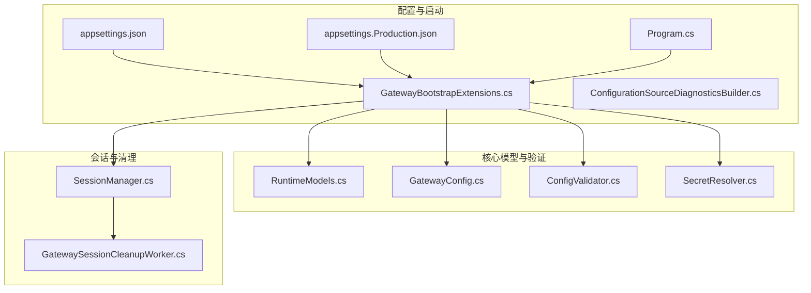
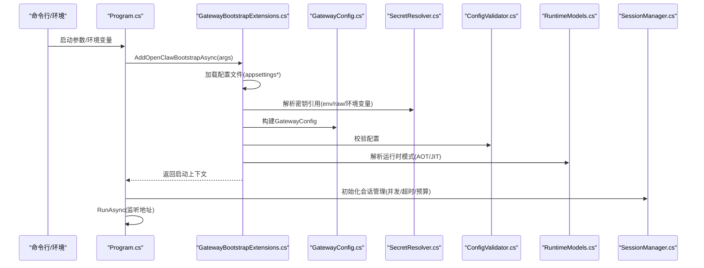
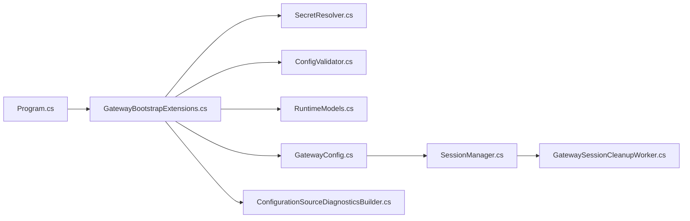

# 运行时配置

<cite>
**本文引用的文件**
- [appsettings.json](file://src/OpenClaw.Gateway/appsettings.json)
- [appsettings.Production.json](file://src/OpenClaw.Gateway/appsettings.Production.json)
- [Program.cs](file://src/OpenClaw.Gateway/Program.cs)
- [GatewayBootstrapExtensions.cs](file://src/OpenClaw.Gateway/Bootstrap/GatewayBootstrapExtensions.cs)
- [ConfigurationSourceDiagnosticsBuilder.cs](file://src/OpenClaw.Gateway/Bootstrap/ConfigurationSourceDiagnosticsBuilder.cs)
- [RuntimeModels.cs](file://src/OpenClaw.Core/Models/RuntimeModels.cs)
- [GatewayConfig.cs](file://src/OpenClaw.Core/Models/GatewayConfig.cs)
- [SessionManager.cs](file://src/OpenClaw.Core/Sessions/SessionManager.cs)
- [GatewaySessionCleanupWorker.cs](file://src/OpenClaw.Gateway/Extensions/GatewaySessionCleanupWorker.cs)
- [AdminSettingsService.cs](file://src/OpenClaw.Gateway/AdminSettingsService.cs)
- [ConfigValidator.cs](file://src/OpenClaw.Core/Validation/ConfigValidator.cs)
- [SecretResolver.cs](file://src/OpenClaw.Core/Security/SecretResolver.cs)
- [OpenClaw-Session-Management.md](file://docs/OpenClaw-Session-Management.md)
- [OpenClaw.NET-PromptCaching-Internal-Doc.md](file://docs/OpenClaw.NET-PromptCaching-Internal-Doc.md)
</cite>

## 目录
1. [简介](#简介)
2. [项目结构](#项目结构)
3. [核心组件](#核心组件)
4. [架构总览](#架构总览)
5. [详细组件分析](#详细组件分析)
6. [依赖关系分析](#依赖关系分析)
7. [性能考量](#性能考量)
8. [故障排除指南](#故障排除指南)
9. [结论](#结论)
10. [附录](#附录)

## 简介
本文件系统化梳理 OpenClaw 运行时配置体系，围绕绑定地址与端口、会话管理、性能参数、运行时模式（AOT/JIT）、并发会话限制、超时与优雅关闭、配置优先级与环境变量映射、配置文件加载顺序等主题展开。文档同时给出最佳实践、性能调优建议、常见配置场景与模板，并提供故障排除清单。

## 项目结构
与运行时配置直接相关的文件主要集中在网关启动与配置加载路径中，以及核心模型与验证模块：
- 配置文件：appsettings.json、appsettings.Production.json
- 启动入口：Program.cs
- 配置加载与校验：GatewayBootstrapExtensions.cs、ConfigurationSourceDiagnosticsBuilder.cs
- 运行时模式与模型：RuntimeModels.cs、GatewayConfig.cs
- 会话管理：SessionManager.cs、GatewaySessionCleanupWorker.cs
- 配置验证与密钥解析：ConfigValidator.cs、SecretResolver.cs
- 文档参考：OpenClaw-Session-Management.md、OpenClaw.NET-PromptCaching-Internal-Doc.md

图表来源
- [Program.cs:1-124](file://src/OpenClaw.Gateway/Program.cs#L1-L124)
- [GatewayBootstrapExtensions.cs:1-135](file://src/OpenClaw.Gateway/Bootstrap/GatewayBootstrapExtensions.cs#L1-L135)
- [ConfigurationSourceDiagnosticsBuilder.cs:121-161](file://src/OpenClaw.Gateway/Bootstrap/ConfigurationSourceDiagnosticsBuilder.cs#L121-L161)
- [RuntimeModels.cs:1-69](file://src/OpenClaw.Core/Models/RuntimeModels.cs#L1-L69)
- [GatewayConfig.cs:1-800](file://src/OpenClaw.Core/Models/GatewayConfig.cs#L1-L800)
- [ConfigValidator.cs:96-114](file://src/OpenClaw.Core/Validation/ConfigValidator.cs#L96-L114)
- [SecretResolver.cs:32-65](file://src/OpenClaw.Core/Security/SecretResolver.cs#L32-L65)
- [SessionManager.cs:1-33](file://src/OpenClaw.Core/Sessions/SessionManager.cs#L1-L33)
- [GatewaySessionCleanupWorker.cs:1-34](file://src/OpenClaw.Gateway/Extensions/GatewaySessionCleanupWorker.cs#L1-L34)

章节来源
- [appsettings.json:1-908](file://src/OpenClaw.Gateway/appsettings.json#L1-L908)
- [appsettings.Production.json:1-65](file://src/OpenClaw.Gateway/appsettings.Production.json#L1-L65)
- [Program.cs:1-124](file://src/OpenClaw.Gateway/Program.cs#L1-L124)
- [GatewayBootstrapExtensions.cs:1-135](file://src/OpenClaw.Gateway/Bootstrap/GatewayBootstrapExtensions.cs#L1-L135)

## 核心组件
- 绑定与监听：BindAddress、Port 决定 HTTP 监听地址与端口；启动时通过 Program.cs 指定监听地址。
- 运行时模式：Runtime.Mode（auto/jit/aot）与 Orchestrator（native/maf）决定运行时构建形态与编排器类型。
- 会话管理：MaxConcurrentSessions、SessionTimeoutMinutes、SessionTokenBudget、SessionRateLimitPerMinute 控制并发、超时与预算。
- 超时与优雅关闭：LLM 超时、工具超时、WebSocket 超时、GracefulShutdownSeconds。
- 安全与鉴权：AuthToken、AllowQueryStringToken、AllowedOrigins、TrustForwardedHeaders、BrowserSessionIdleMinutes 等。
- 性能与缓存：PromptCaching（启用、方言、保留策略、保活）、内存与向量嵌入、压缩阈值等。

章节来源
- [GatewayConfig.cs:1-800](file://src/OpenClaw.Core/Models/GatewayConfig.cs#L1-L800)
- [RuntimeModels.cs:1-69](file://src/OpenClaw.Core/Models/RuntimeModels.cs#L1-L69)
- [Program.cs:95-97](file://src/OpenClaw.Gateway/Program.cs#L95-L97)

## 架构总览
运行时配置从配置文件与环境变量加载，经过启动引导与校验，最终驱动运行时与各子系统的行为。关键流程如下：

图表来源
- [Program.cs:47-97](file://src/OpenClaw.Gateway/Program.cs#L47-L97)
- [GatewayBootstrapExtensions.cs:18-135](file://src/OpenClaw.Gateway/Bootstrap/GatewayBootstrapExtensions.cs#L18-L135)
- [SecretResolver.cs:32-65](file://src/OpenClaw.Core/Security/SecretResolver.cs#L32-L65)
- [ConfigValidator.cs:96-114](file://src/OpenClaw.Core/Validation/ConfigValidator.cs#L96-L114)
- [RuntimeModels.cs:29-59](file://src/OpenClaw.Core/Models/RuntimeModels.cs#L29-L59)
- [SessionManager.cs:29-33](file://src/OpenClaw.Core/Sessions/SessionManager.cs#L29-L33)

## 详细组件分析

### 绑定地址与端口
- 绑定地址与端口来自 GatewayConfig.BindAddress 与 Port，默认开发环境绑定到 127.0.0.1:18789；生产环境默认绑定到 0.0.0.0:18789。
- 启动时由 Program.cs 指定监听地址，若绑定到非回环地址且未配置 AuthToken，将触发安全检查或错误。
- 生产配置中还包含日志级别、工具根目录、并发会话与会话超时等关键参数。

章节来源
- [appsettings.json:3-4](file://src/OpenClaw.Gateway/appsettings.json#L3-L4)
- [appsettings.json:52-53](file://src/OpenClaw.Gateway/appsettings.json#L52-L53)
- [appsettings.Production.json:3-4](file://src/OpenClaw.Gateway/appsettings.Production.json#L3-L4)
- [Program.cs:95-97](file://src/OpenClaw.Gateway/Program.cs#L95-L97)
- [GatewayBootstrapExtensions.cs:34-63](file://src/OpenClaw.Gateway/Bootstrap/GatewayBootstrapExtensions.cs#L34-L63)

### 运行时模式（AOT/JIT）与编排器
- 运行时模式由 Runtime.Mode 控制，支持 auto/jit/aot；编排器由 Orchestrator 控制，支持 native/maf。
- RuntimeModeResolver 根据配置与运行时动态代码能力解析有效模式，若请求 jit 但不支持动态代码则抛错。
- 生产配置中 Orchestrator 默认为 maf，便于在 AOT 构建下获得更好的发布体积与启动性能。

章节来源
- [RuntimeModels.cs:11-27](file://src/OpenClaw.Core/Models/RuntimeModels.cs#L11-L27)
- [RuntimeModels.cs:29-59](file://src/OpenClaw.Core/Models/RuntimeModels.cs#L29-L59)
- [appsettings.json:6-9](file://src/OpenClaw.Gateway/appsettings.json#L6-L9)
- [appsettings.Production.json:1-65](file://src/OpenClaw.Gateway/appsettings.Production.json#L1-L65)

### 会话管理与并发限制
- 并发限制：MaxConcurrentSessions 控制活动会话上限；SessionTimeoutMinutes 控制空闲超时。
- 预算与速率：SessionTokenBudget（令牌总量预算）、SessionRateLimitPerMinute（每分钟消息速率）。
- 会话清理：GatewaySessionCleanupWorker 定期清理过期活动会话与孤立锁；SessionManager 提供准入门、按会话锁、LRU 淘汰与持久化重试。
- 管理界面：AdminSettingsService 记录重启必要变更，指导在线调整。

章节来源
- [GatewayConfig.cs:50-66](file://src/OpenClaw.Core/Models/GatewayConfig.cs#L50-L66)
- [OpenClaw-Session-Management.md:27-80](file://docs/OpenClaw-Session-Management.md#L27-L80)
- [SessionManager.cs:13-33](file://src/OpenClaw.Core/Sessions/SessionManager.cs#L13-L33)
- [GatewaySessionCleanupWorker.cs:7-34](file://src/OpenClaw.Gateway/Extensions/GatewaySessionCleanupWorker.cs#L7-L34)
- [AdminSettingsService.cs:393-401](file://src/OpenClaw.Gateway/AdminSettingsService.cs#L393-L401)

### 超时与优雅关闭
- LLM 超时：Llm.TimeoutSeconds 控制单次调用超时；RetryCount 与 CircuitBreakerThreshold/CooldownSeconds 控制重试与熔断。
- 工具超时：Tooling.ToolTimeoutSeconds 控制工具执行超时。
- WebSocket 超时：WebSocket.ReceiveTimeoutSeconds 控制接收超时。
- 优雅关闭：GracefulShutdownSeconds 控制关闭等待时长，0 表示不等待。

章节来源
- [GatewayConfig.cs:87-119](file://src/OpenClaw.Core/Models/GatewayConfig.cs#L87-L119)
- [GatewayConfig.cs:412-457](file://src/OpenClaw.Core/Models/GatewayConfig.cs#L412-L457)
- [GatewayConfig.cs:386-393](file://src/OpenClaw.Core/Models/GatewayConfig.cs#L386-L393)
- [GatewayConfig.cs:65-66](file://src/OpenClaw.Core/Models/GatewayConfig.cs#L65-L66)

### 性能参数与提示词缓存
- 提示词缓存：PromptCaching.Enabled、Dialect（auto/openai/anthropic/gemini/none）、Retention（none/short/long/auto）、KeepWarmEnabled、KeepWarmIntervalMinutes。
- 方言解析：ResolveDialect 基于 provider 自动推导方言；未显式指定方言时可能触发诊断提示。
- 追踪与诊断：TraceEnabled/TraceFilePath 控制 JSONL 追踪输出；环境变量可强制开启追踪。

章节来源
- [GatewayConfig.cs:150-159](file://src/OpenClaw.Core/Models/GatewayConfig.cs#L150-L159)
- [OpenClaw.NET-PromptCaching-Internal-Doc.md:340-387](file://docs/OpenClaw.NET-PromptCaching-Internal-Doc.md#L340-L387)
- [OpenClaw.NET-PromptCaching-Internal-Doc.md:407-443](file://docs/OpenClaw.NET-PromptCaching-Internal-Doc.md#L407-L443)

### 配置优先级、环境变量映射与加载顺序
- 配置来源与优先级：
  1) appsettings.json（开发默认）
  2) appsettings.Production.json（生产默认）
  3) --config 指定的额外配置文件（可热重载）
  4) 环境变量覆盖（如 MODEL_PROVIDER_KEY、MODEL_PROVIDER_MODEL、OPENCLAW_AUTH_TOKEN 等）
  5) 命令行参数（如 --config）
- 环境变量映射：
  - LLM 密钥/端点/模型：MODEL_PROVIDER_KEY、MODEL_PROVIDER_ENDPOINT、MODEL_PROVIDER_MODEL
  - 认证令牌：OPENCLAW_AUTH_TOKEN
  - 工作区根：OPENCLAW_WORKSPACE
  - 提示词缓存追踪：OPENCLAW_CACHE_TRACE、OPENCLAW_CACHE_TRACE_FILE 等
- 密钥引用：支持 env:、raw: 前缀，SecretResolver 负责解析；生产绑定默认禁止 raw: 引用以降低泄露风险。

章节来源
- [GatewayBootstrapExtensions.cs:173-217](file://src/OpenClaw.Gateway/Bootstrap/GatewayBootstrapExtensions.cs#L173-L217)
- [GatewayBootstrapExtensions.cs:377-389](file://src/OpenClaw.Gateway/Bootstrap/GatewayBootstrapExtensions.cs#L377-L389)
- [SecretResolver.cs:32-65](file://src/OpenClaw.Core/Security/SecretResolver.cs#L32-L65)
- [ConfigurationSourceDiagnosticsBuilder.cs:127-157](file://src/OpenClaw.Gateway/Bootstrap/ConfigurationSourceDiagnosticsBuilder.cs#L127-L157)

### 安全与鉴权
- 非回环绑定安全：当 BindAddress 非回环且未设置 AuthToken 时，启动阶段会强制要求设置 OPENCLAW_AUTH_TOKEN；生产配置默认开启 AllowQueryStringToken=false，提升安全性。
- CORS 与代理：AllowedOrigins、TrustForwardedHeaders、KnownProxies 控制跨域与代理信任。
- 浏览器会话：BrowserSessionIdleMinutes、BrowserRememberDays 控制管理员会话的空闲与记住我行为。

章节来源
- [GatewayBootstrapExtensions.cs:34-63](file://src/OpenClaw.Gateway/Bootstrap/GatewayBootstrapExtensions.cs#L34-L63)
- [appsettings.json:82-102](file://src/OpenClaw.Gateway/appsettings.json#L82-L102)
- [appsettings.Production.json:22-30](file://src/OpenClaw.Gateway/appsettings.Production.json#L22-L30)

## 依赖关系分析
- 配置加载链路：Program.cs -> GatewayBootstrapExtensions.LoadGatewayConfig -> SecretResolver -> ConfigValidator -> RuntimeModeResolver -> SessionManager。
- 配置诊断：ConfigurationSourceDiagnosticsBuilder 将配置来源可视化，便于定位覆盖与冲突。
- 会话清理：GatewaySessionCleanupWorker 与 SessionManager 协同，定期清理过期会话与锁。

图表来源
- [Program.cs:47-97](file://src/OpenClaw.Gateway/Program.cs#L47-L97)
- [GatewayBootstrapExtensions.cs:143-159](file://src/OpenClaw.Gateway/Bootstrap/GatewayBootstrapExtensions.cs#L143-L159)
- [SecretResolver.cs:32-65](file://src/OpenClaw.Core/Security/SecretResolver.cs#L32-L65)
- [ConfigValidator.cs:96-114](file://src/OpenClaw.Core/Validation/ConfigValidator.cs#L96-L114)
- [RuntimeModels.cs:29-59](file://src/OpenClaw.Core/Models/RuntimeModels.cs#L29-L59)
- [GatewayConfig.cs:1-800](file://src/OpenClaw.Core/Models/GatewayConfig.cs#L1-L800)
- [SessionManager.cs:13-33](file://src/OpenClaw.Core/Sessions/SessionManager.cs#L13-L33)
- [GatewaySessionCleanupWorker.cs:7-34](file://src/OpenClaw.Gateway/Extensions/GatewaySessionCleanupWorker.cs#L7-L34)
- [ConfigurationSourceDiagnosticsBuilder.cs:121-161](file://src/OpenClaw.Gateway/Bootstrap/ConfigurationSourceDiagnosticsBuilder.cs#L121-L161)

章节来源
- [GatewayBootstrapExtensions.cs:143-159](file://src/OpenClaw.Gateway/Bootstrap/GatewayBootstrapExtensions.cs#L143-L159)
- [ConfigurationSourceDiagnosticsBuilder.cs:121-161](file://src/OpenClaw.Gateway/Bootstrap/ConfigurationSourceDiagnosticsBuilder.cs#L121-L161)

## 性能考量
- 运行时模式：AOT 更适合发布体积与启动性能；JIT 提供更强的动态能力但需要构建支持。
- 会话并发：合理设置 MaxConcurrentSessions，结合 LRU 淘汰与容量拒绝指标，避免资源耗尽。
- 超时与熔断：LLM 与工具超时、重试与熔断阈值需根据链路延迟与稳定性调优。
- 提示词缓存：启用合适的方言与保留策略，配合保活降低重复计算；通过追踪文件定位低效场景。
- WebSocket 与工具：限制消息大小与速率，避免拥塞；生产环境收紧允许的根路径与工具集。

## 故障排除指南
- 启动失败（非回环绑定未设置令牌）
  - 现象：绑定到非回环地址时报错，要求设置 OPENCLAW_AUTH_TOKEN。
  - 处理：设置环境变量或在配置中提供 AuthToken。
  - 参考：[GatewayBootstrapExtensions.cs:48-63](file://src/OpenClaw.Gateway/Bootstrap/GatewayBootstrapExtensions.cs#L48-L63)
- 配置错误
  - 现象：ConfigValidator 报错，列出具体字段与规则。
  - 处理：根据错误提示修正路径、数值范围或组合关系。
  - 参考：[ConfigValidator.cs:96-114](file://src/OpenClaw.Core/Validation/ConfigValidator.cs#L96-L114)
- 运行时模式不兼容
  - 现象：请求 JIT 但构建不支持动态代码，抛出异常。
  - 处理：改为 AOT 或使用支持 JIT 的构建产物。
  - 参考：[RuntimeModels.cs:36-40](file://src/OpenClaw.Core/Models/RuntimeModels.cs#L36-L40)
- 会话超限与淘汰
  - 现象：并发过高导致容量拒绝与会话淘汰。
  - 处理：提高 MaxConcurrentSessions 或缩短 SessionTimeoutMinutes；关注清理指标。
  - 参考：[OpenClaw-Session-Management.md:69-80](file://docs/OpenClaw-Session-Management.md#L69-L80)
- 提示词缓存未生效
  - 现象：启用缓存但无命中或保活失败。
  - 处理：检查方言解析、系统提示词稳定段落、提供商能力与追踪日志。
  - 参考：[OpenClaw.NET-PromptCaching-Internal-Doc.md:340-387](file://docs/OpenClaw.NET-PromptCaching-Internal-Doc.md#L340-L387)

章节来源
- [GatewayBootstrapExtensions.cs:48-63](file://src/OpenClaw.Gateway/Bootstrap/GatewayBootstrapExtensions.cs#L48-L63)
- [ConfigValidator.cs:96-114](file://src/OpenClaw.Core/Validation/ConfigValidator.cs#L96-L114)
- [RuntimeModels.cs:36-40](file://src/OpenClaw.Core/Models/RuntimeModels.cs#L36-L40)
- [OpenClaw-Session-Management.md:69-80](file://docs/OpenClaw-Session-Management.md#L69-L80)
- [OpenClaw.NET-PromptCaching-Internal-Doc.md:340-387](file://docs/OpenClaw.NET-PromptCaching-Internal-Doc.md#L340-L387)

## 结论
运行时配置体系以 GatewayConfig 为核心，贯穿启动引导、安全校验、运行时模式解析与会话管理。通过明确的优先级与环境变量映射，结合严格的配置校验与诊断输出，系统能够在不同部署形态（开发/生产）与运行模式（AOT/JIT）下稳定运行。建议在生产环境中严格限制非回环绑定、收紧工具与路径策略，并根据业务负载调优并发、超时与缓存策略。

## 附录

### 配置模板与最佳实践
- 开发环境模板（appsettings.json）
  - 绑定地址与端口：127.0.0.1:18789
  - 运行时模式：jit（便于调试）
  - 认证令牌：本地开发可用短令牌或禁用（仅开发）
  - 会话：适度并发与较短超时
  - 提示词缓存：按需启用，方言自动
- 生产环境模板（appsettings.Production.json）
  - 绑定地址：0.0.0.0:18789
  - 认证令牌：必填，避免明文
  - 安全：AllowQueryStringToken=false，KnownProxies/TrustForwardedHeaders 合理配置
  - 会话：MaxConcurrentSessions、SessionTimeoutMinutes、SessionTokenBudget、SessionRateLimitPerMinute
  - WebSocket：MaxMessageBytes、MaxConnections、ReceiveTimeoutSeconds
  - 提示词缓存：KeepWarmEnabled=true，保留策略按提供商方言设置
- 环境变量
  - MODEL_PROVIDER_KEY、MODEL_PROVIDER_ENDPOINT、MODEL_PROVIDER_MODEL
  - OPENCLAW_AUTH_TOKEN、OPENCLAW_WORKSPACE
  - OPENCLAW_CACHE_TRACE、OPENCLAW_CACHE_TRACE_FILE

章节来源
- [appsettings.json:1-908](file://src/OpenClaw.Gateway/appsettings.json#L1-L908)
- [appsettings.Production.json:1-65](file://src/OpenClaw.Gateway/appsettings.Production.json#L1-L65)