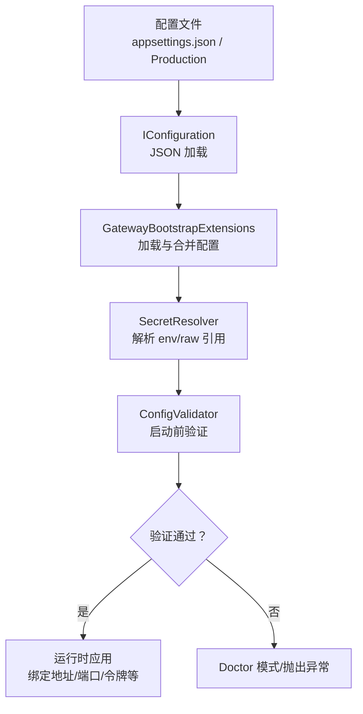
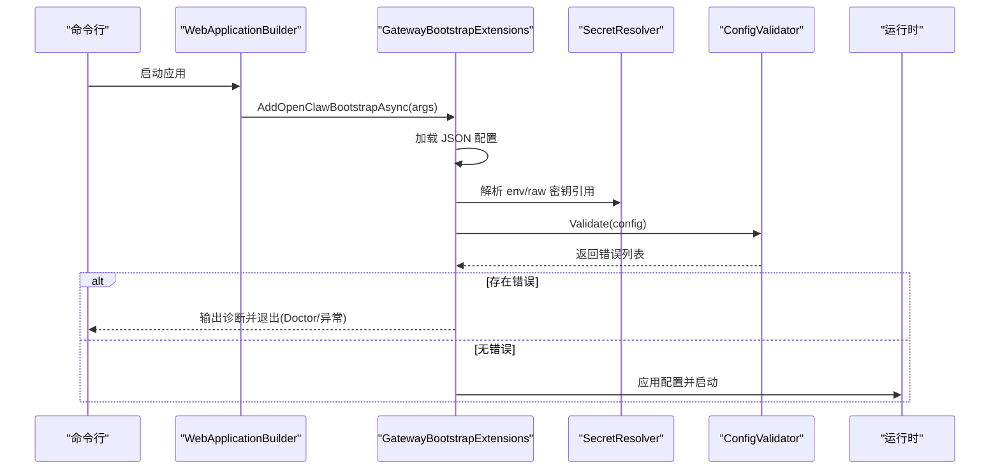
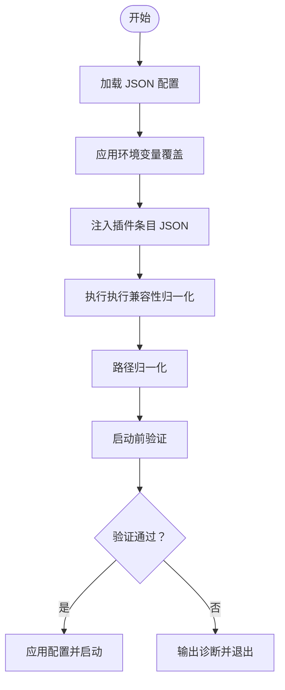
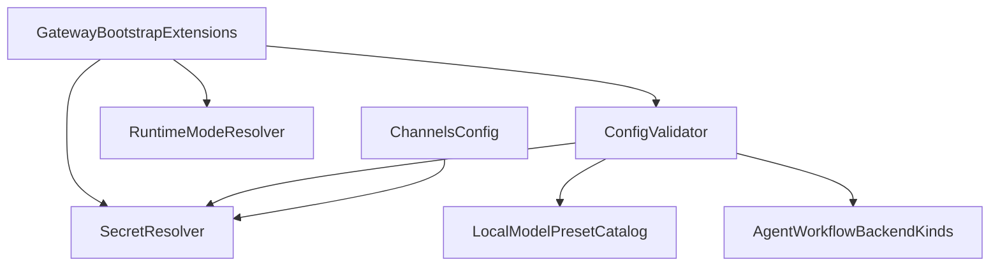

# 配置管理

<cite>
**本文引用的文件**
- [appsettings.json](file://src/OpenClaw.Gateway/appsettings.json)
- [appsettings.Production.json](file://src/OpenClaw.Gateway/appsettings.Production.json)
- [GatewayConfig.cs](file://src/OpenClaw.Core/Models/GatewayConfig.cs)
- [ConfigValidator.cs](file://src/OpenClaw.Core/Validation/ConfigValidator.cs)
- [GatewayBootstrapExtensions.cs](file://src/OpenClaw.Gateway/Bootstrap/GatewayBootstrapExtensions.cs)
- [GatewayConfigFile.cs](file://src/OpenClaw.Core/Setup/GatewayConfigFile.cs)
- [SecretResolver.cs](file://src/OpenClaw.Core/Security/SecretResolver.cs)
- [EndpointHelpers.cs](file://src/OpenClaw.Gateway/Endpoints/EndpointHelpers.cs)
- [UpstreamMigrationCommand.cs](file://src/OpenClaw.Cli/UpstreamMigrationCommand.cs)
- [UpgradeCommands.cs](file://src/OpenClaw.Cli/UpgradeCommands.cs)
- [StartupConsoleCoordinator.cs](file://src/OpenClaw.Gateway/Bootstrap/StartupConsoleCoordinator.cs)
- [SecurityPostureBuilder.cs](file://src/OpenClaw.Gateway/SecurityPostureBuilder.cs)
- [FeishuChannel.cs](file://src/OpenClaw.Channels/FeishuChannel.cs)
- [BootstrapConfigFactory.cs](file://src/OpenClaw.Cli/BootstrapConfigFactory.cs)
</cite>

## 目录
1. [简介](#简介)
2. [项目结构](#项目结构)
3. [核心组件](#核心组件)
4. [架构总览](#架构总览)
5. [详细组件分析](#详细组件分析)
6. [依赖分析](#依赖分析)
7. [性能考虑](#性能考虑)
8. [故障排除指南](#故障排除指南)
9. [结论](#结论)
10. [附录](#附录)

## 简介
本文件面向配置管理系统，系统化阐述配置体系的架构设计、环境变量映射与解析、配置验证机制与错误诊断、配置项分类（运行时模式、插件设置、渠道配置、安全策略等）、配置文件结构与优先级、继承与覆盖关系、以及配置迁移与版本兼容性。文档同时提供配置模板建议、最佳实践与常见场景，并给出故障排除技巧。

## 项目结构
配置系统由“配置模型 + 加载与合并 + 环境变量解析 + 验证 + 运行时应用”五部分组成：
- 配置模型：集中定义在 GatewayConfig 及其子配置类中，覆盖运行时、LLM、内存、工具、沙箱、执行后端、多模态、渠道、插件、技能、工作流、路由、诊断等模块。
- 配置加载与合并：通过 .NET IConfiguration 从 JSON 文件加载，支持命令行 --config 覆盖路径；随后进行环境变量覆盖、插件条目 JSON 注入、执行兼容性归一化等。
- 环境变量映射：统一通过 SecretResolver 解析 env:raw: 前缀，支持默认回退行为；对敏感字段如令牌、密钥、渠道凭据等进行标准化解析。
- 配置验证：启动前执行严格校验，Fail-fast 拒绝非法配置；Doctor 模式输出详细诊断与来源列表。
- 运行时应用：根据验证结果决定是否进入运行阶段，或在 Doctor/健康检查模式下输出状态。

图表来源
- [GatewayBootstrapExtensions.cs:143-159](file://src/OpenClaw.Gateway/Bootstrap/GatewayBootstrapExtensions.cs#L143-L159)
- [SecretResolver.cs:24-54](file://src/OpenClaw.Core/Security/SecretResolver.cs#L24-L54)
- [ConfigValidator.cs:35-405](file://src/OpenClaw.Core/Validation/ConfigValidator.cs#L35-L405)

章节来源
- [appsettings.json:1-908](file://src/OpenClaw.Gateway/appsettings.json#L1-L908)
- [appsettings.Production.json:1-65](file://src/OpenClaw.Gateway/appsettings.Production.json#L1-L65)
- [GatewayBootstrapExtensions.cs:143-159](file://src/OpenClaw.Gateway/Bootstrap/GatewayBootstrapExtensions.cs#L143-L159)

## 核心组件
- 配置模型 GatewayConfig 及子配置类：集中定义所有可配置项的结构、默认值与约束。
- 配置加载与合并：从 JSON 文件读取，注入插件条目 JSON，应用环境变量覆盖，执行兼容性归一化。
- 环境变量与密钥解析：统一 SecretResolver 实现 env:raw: 前缀解析与回退策略。
- 配置验证器：启动前执行全面校验，Fail-fast 并输出来源诊断。
- 运行时应用：根据验证结果决定启动流程，支持 Doctor/健康检查模式。

章节来源
- [GatewayConfig.cs:9-80](file://src/OpenClaw.Core/Models/GatewayConfig.cs#L9-L80)
- [GatewayBootstrapExtensions.cs:143-159](file://src/OpenClaw.Gateway/Bootstrap/GatewayBootstrapExtensions.cs#L143-L159)
- [SecretResolver.cs:14-65](file://src/OpenClaw.Core/Security/SecretResolver.cs#L14-L65)
- [ConfigValidator.cs:14-405](file://src/OpenClaw.Core/Validation/ConfigValidator.cs#L14-L405)

## 架构总览
配置系统采用“声明式配置 + 启动期强校验”的架构。配置文件作为权威来源，结合环境变量与命令行参数进行覆盖；SecretResolver 统一处理敏感信息；ConfigValidator 在启动前完成所有合法性检查；GatewayBootstrapExtensions 将最终配置注入运行时并执行安全加固。

图表来源
- [GatewayBootstrapExtensions.cs:18-135](file://src/OpenClaw.Gateway/Bootstrap/GatewayBootstrapExtensions.cs#L18-L135)
- [SecretResolver.cs:24-54](file://src/OpenClaw.Core/Security/SecretResolver.cs#L24-L54)
- [ConfigValidator.cs:35-405](file://src/OpenClaw.Core/Validation/ConfigValidator.cs#L35-L405)

## 详细组件分析

### 配置模型与数据结构
- GatewayConfig 顶层包含运行时、LLM、内存、安全、WebSocket、工具、沙箱、执行、编码后端、多模态、渠道、插件、技能、工作流、路由、诊断等配置域。
- 各子配置类（如 LlmProviderConfig、MemoryConfig、ToolingConfig、ChannelsConfig、PluginsConfig 等）定义了具体字段、默认值与约束。
- 关键字段示例：
  - 运行时：Runtime.Mode（auto/aot/jit）、Runtime.Orchestrator（native/maf）
  - LLM：Provider、Model、ApiKey、Endpoint、TimeoutSeconds、RetryCount、CircuitBreakerThreshold 等
  - 内存：Provider（file/sqlite/mempalace）、StoragePath、MaxHistoryTurns、Retention 配置
  - 安全：AllowQueryStringToken、AllowedOrigins、TrustForwardedHeaders、StrictPublicBindProfile 等
  - 工具：AutonomyMode、WorkspaceRoot、AllowedReadRoots/AllowedWriteRoots、ToolTimeoutSeconds、ParallelToolExecution、RequireToolApproval 等
  - 渠道：各平台（Telegram、WhatsApp、Teams、Slack、Discord、Signal、Feishu、WeCom、Sms）的启用、鉴权、白名单、请求限制等
  - 插件：Plugins.Enabled、Prefer、Overrides、Allow/Deny 列表、Load.Paths、Entries、Transport.Mode、Native/MCP 动态原生配置等

章节来源
- [GatewayConfig.cs:9-898](file://src/OpenClaw.Core/Models/GatewayConfig.cs#L9-L898)

### 配置加载与合并流程
- 从 appsettings.json 与 appsettings.Production.json 加载 OpenClaw 节点，支持按环境覆盖。
- 支持通过 --config 或 OPENCLAW_CONFIG_PATH 指定额外 JSON 配置文件，实现“外部覆盖”。
- 插件条目 JSON 通过 HydratePluginEntryConfigJson 从 IConfiguration 注入到 Plugins.Entries 中。
- 环境变量覆盖顺序：
  - LLM 相关：MODEL_PROVIDER_KEY、MODEL_PROVIDER_MODEL、MODEL_PROVIDER_ENDPOINT
  - 全局：OPENCLAW_AUTH_TOKEN
- 执行兼容性归一化：当启用 OpenSandbox 时自动补全 Execution.Profiles 与 Execution.Tools 的路由。
- 路径归一化：相对路径展开为绝对路径，支持 ~ 用户目录展开。

图表来源
- [GatewayBootstrapExtensions.cs:143-159](file://src/OpenClaw.Gateway/Bootstrap/GatewayBootstrapExtensions.cs#L143-L159)
- [GatewayBootstrapExtensions.cs:211-252](file://src/OpenClaw.Gateway/Bootstrap/GatewayBootstrapExtensions.cs#L211-L252)
- [GatewayBootstrapExtensions.cs:391-400](file://src/OpenClaw.Gateway/Bootstrap/GatewayBootstrapExtensions.cs#L391-L400)

章节来源
- [GatewayBootstrapExtensions.cs:173-217](file://src/OpenClaw.Gateway/Bootstrap/GatewayBootstrapExtensions.cs#L173-L217)
- [GatewayBootstrapExtensions.cs:264-350](file://src/OpenClaw.Gateway/Bootstrap/GatewayBootstrapExtensions.cs#L264-L350)

### 环境变量映射与密钥解析
- SecretResolver 支持三种引用方式：
  - env:VAR_NAME：从环境变量读取
  - raw:literal：直接使用字面量（不推荐生产）
  - VAR_NAME：默认行为，先尝试环境变量，不存在则回退为字面量
- 对于公开绑定（非 127.0.0.1）场景，系统会拒绝包含 raw: 的密钥引用以降低泄露风险。
- 渠道与安全相关字段广泛使用 SecretResolver，如 Telegram/WhatsApp/Teams/Slack/Discord 的 BotToken、SigningSecret、AppId/AppPassword/TenantId 等。

章节来源
- [SecretResolver.cs:14-65](file://src/OpenClaw.Core/Security/SecretResolver.cs#L14-L65)
- [SecurityPostureBuilder.cs:151-163](file://src/OpenClaw.Gateway/SecurityPostureBuilder.cs#L151-L163)

### 配置验证机制与错误处理
- 启动前执行严格验证，Fail-fast 拒绝非法配置；Doctor 模式输出详细诊断与配置来源渲染。
- 验证范围覆盖：
  - 基础：端口、会话并发与超时、WebSocket 上限
  - LLM：Provider 支持性、模型、温度、超时、重试、断路器阈值与冷却、认证模式、Aperture 特殊校验、PromptCaching
  - 内存：Provider 类型、存储路径、历史轮次、压缩阈值与保留策略
  - 工具：工具超时、根路径集合、URL 安全策略、工作区仅限模式
  - 沙箱：Provider 名称、默认 TTL、工具模式与模板、OpenSandbox 编译开关
  - 编码后端：唯一性、Provider、写入权限、工作区路径、凭证来源互斥
  - 插件桥接：Transport.Mode、MCP 服务器传输类型、命令/URL、超时
  - 渠道：各平台 DM 策略、Webhook 鉴权、签名验证、账户配置、请求大小限制
  - 路由与工作流：路由目标 Profile 存在性、工作流后端基地址与轮询/超时
- Doctor 模式输出配置来源列表，便于定位覆盖链路。

章节来源
- [ConfigValidator.cs:35-405](file://src/OpenClaw.Core/Validation/ConfigValidator.cs#L35-L405)
- [StartupConsoleCoordinator.cs:39-51](file://src/OpenClaw.Gateway/Bootstrap/StartupConsoleCoordinator.cs#L39-L51)

### 运行时模式与插件设置
- 运行时模式：
  - Runtime.Mode：auto/aot/jit，影响编译与运行策略
  - Runtime.Orchestrator：native/maf，决定编排后端
- 插件设置：
  - Plugins.Enabled、Prefer、Overrides、Allow/Deny、Load.Paths、Entries、Transport.Mode（stdio/socket/hybrid）
  - Native/MCP 动态原生插件：WebSearch、WebFetch、GitTools、CodeExec、ImageGen、ImageAnalyze、PdfRead、MinerUPdf、Calendar、Email、Database、InboxZero、HomeAssistant、Mqtt、Notion 等
  - 动态原生 Entries：支持为特定插件注入任意 JSON 配置对象

章节来源
- [GatewayConfig.cs:9-80](file://src/OpenClaw.Core/Models/GatewayConfig.cs#L9-L80)
- [appsettings.json:534-794](file://src/OpenClaw.Gateway/appsettings.json#L534-L794)
- [GatewayBootstrapExtensions.cs:264-281](file://src/OpenClaw.Gateway/Bootstrap/GatewayBootstrapExtensions.cs#L264-L281)

### 渠道配置与安全策略
- 渠道配置：
  - 允许列表语义：Channels.AllowlistSemantics（legacy/strict）
  - 各平台字段：Enabled、DmPolicy、鉴权令牌/密钥、Webhook 路径与公共基础 URL、允许列表、最大请求大小、速率限制、分片策略等
  - WhatsApp 支持 official/bridge/first_party_worker 三种类型，含签名验证、Cloud API 令牌、桥接服务、第一方工作者账户配置
  - Teams 支持 Bot Framework 鉴权、提及要求、回复样式、文本分片策略
- 安全策略：
  - 公开绑定预设：StrictPublicBindProfile 强制更严格的安全与审批默认
  - 允许查询字符串令牌、代理信任、已知代理、浏览器会话空闲与记住天数
  - 公开绑定禁止 unsafe 工具与 raw: 密钥引用，防止误配置

章节来源
- [GatewayConfig.cs:534-787](file://src/OpenClaw.Core/Models/GatewayConfig.cs#L534-L787)
- [appsettings.json:362-532](file://src/OpenClaw.Gateway/appsettings.json#L362-L532)
- [SecurityPostureBuilder.cs:147-168](file://src/OpenClaw.Gateway/SecurityPostureBuilder.cs#L147-L168)

### 配置文件结构、优先级与继承
- 结构：
  - appsettings.json：开发/默认配置，包含运行时、LLM、内存、安全、WebSocket、工具、沙箱、执行、编码后端、多模态、渠道、插件、技能等完整结构
  - appsettings.Production.json：生产覆盖，主要覆盖 LLM、内存、安全、WebSocket、工具、插件、会话上限等
- 优先级：
  - JSON 文件：Production 覆盖默认 JSON
  - 外部 JSON：--config 或 OPENCLAW_CONFIG_PATH 指定的文件进一步覆盖
  - 环境变量：最后阶段覆盖（如 MODEL_PROVIDER_KEY、OPENCLAW_AUTH_TOKEN 等）
- 继承关系：
  - Plugins.Entries 支持为插件注入 JSON 配置，形成“配置继承 + 局部覆盖”
  - 动态原生 Entries 支持在运行时更新并重启（如 FeishuChannel.SetRuntimeConfig/UpdateConfigAsync）

章节来源
- [appsettings.json:1-908](file://src/OpenClaw.Gateway/appsettings.json#L1-L908)
- [appsettings.Production.json:1-65](file://src/OpenClaw.Gateway/appsettings.Production.json#L1-L65)
- [GatewayBootstrapExtensions.cs:173-217](file://src/OpenClaw.Gateway/Bootstrap/GatewayBootstrapExtensions.cs#L173-L217)
- [FeishuChannel.cs:106-123](file://src/OpenClaw.Channels/FeishuChannel.cs#L106-L123)

### 配置验证规则与诊断
- 规则要点：
  - 数值范围：端口、超时、重试、断路器、历史轮次、压缩阈值、WebSocket 上限等
  - 字符串枚举：Provider、DmPolicy、Transport.Mode、工作流后端 Kind、分片模式等
  - 互斥与必填：凭证来源（SecretRef/TokenFilePath/ConnectedAccountId）最多一个；OpenSandbox 编译开关与配置一致性
  - 路径与网络：根路径必须为绝对路径且不可混用通配；CIDR 白名单格式校验；URL 必须为 http(s)
- 诊断输出：
  - Doctor 模式输出“有效配置胜出者”列表，帮助定位覆盖链
  - 健康检查模式通过 /health 探针快速判断启动状态

章节来源
- [ConfigValidator.cs:35-405](file://src/OpenClaw.Core/Validation/ConfigValidator.cs#L35-L405)
- [StartupConsoleCoordinator.cs:39-51](file://src/OpenClaw.Gateway/Bootstrap/StartupConsoleCoordinator.cs#L39-L51)

### 配置模板、最佳实践与常见场景
- 模板建议：
  - 开发环境：使用 appsettings.json 默认配置，必要时通过 --config 指定本地覆盖文件
  - 生产环境：基于 appsettings.Production.json 调整 LLM/内存/安全/工具/插件等关键项
- 最佳实践：
  - 使用 env: 前缀管理密钥，避免将 raw: 写入版本控制
  - 公开绑定时开启 StrictPublicBindProfile，禁用 unsafe 工具与 raw: 密钥引用
  - 合理设置工具根路径与工作区仅限模式，避免越权访问
  - 为高风险工具（shell/write_file）启用 RequireToolApproval 并设置审批超时
  - 为渠道启用签名验证与最小权限白名单
- 常见场景：
  - 本地开发：Runtime.Mode=jit，Plugins.Enabled=true，工具路径放开，安全策略宽松
  - 生产部署：Runtime.Mode=aot/auto，Security.StrictPublicBindProfile=true，禁用 unsafe 工具，启用签名验证
  - 插件桥接：MCP 服务器使用 http 传输并设置合理超时；或使用 stdio 传输并指定命令

章节来源
- [appsettings.json:1-908](file://src/OpenClaw.Gateway/appsettings.json#L1-L908)
- [appsettings.Production.json:1-65](file://src/OpenClaw.Gateway/appsettings.Production.json#L1-L65)
- [SecurityPostureBuilder.cs:147-168](file://src/OpenClaw.Gateway/SecurityPostureBuilder.cs#L147-L168)

### 配置迁移、版本兼容性与升级检查
- 迁移流程：
  - 使用 UpstreamMigrationCommand 生成迁移计划，输出兼容性报告、技能与插件迁移清单
  - 可选择 --apply 应用迁移，导入技能、写入插件评审计划
- 升级检查：
  - UpgradeCommands 评估当前安装对非默认或扩展兼容面的依赖程度，提示风险与后续动作
  - 检查 MCP 插件桥接、自定义插件加载路径、额外技能目录等潜在不兼容项

章节来源
- [UpstreamMigrationCommand.cs:1-133](file://src/OpenClaw.Cli/UpstreamMigrationCommand.cs#L1-L133)
- [UpstreamMigrationCommand.cs:97-119](file://src/OpenClaw.Cli/UpstreamMigrationCommand.cs#L97-L119)
- [UpgradeCommands.cs:333-362](file://src/OpenClaw.Cli/UpgradeCommands.cs#L333-L362)

## 依赖分析
- 组件耦合：
  - GatewayBootstrapExtensions 依赖 ConfigValidator、SecretResolver、PluginAdminSettingsService、RuntimeModeResolver 等
  - ConfigValidator 依赖 SecretResolver、LocalModelPresetCatalog、AgentWorkflowBackendKinds 等
  - 渠道配置依赖 SecretResolver 与 Allowlist 语义
- 外部依赖：
  - .NET IConfiguration 提供配置源与合并能力
  - JSON 序列化上下文（CoreJsonContext/GatewayJsonContext）用于配置反序列化

图表来源
- [GatewayBootstrapExtensions.cs:16-135](file://src/OpenClaw.Gateway/Bootstrap/GatewayBootstrapExtensions.cs#L16-L135)
- [ConfigValidator.cs:1-405](file://src/OpenClaw.Core/Validation/ConfigValidator.cs#L1-L405)

章节来源
- [GatewayBootstrapExtensions.cs:1-135](file://src/OpenClaw.Gateway/Bootstrap/GatewayBootstrapExtensions.cs#L1-L135)
- [ConfigValidator.cs:1-405](file://src/OpenClaw.Core/Validation/ConfigValidator.cs#L1-L405)

## 性能考虑
- 配置验证在启动阶段一次性完成，避免运行期重复校验带来的开销
- 路径与凭证解析仅在启动阶段执行，运行期使用缓存值
- 工具执行超时与并发策略可通过 Tooling.ToolTimeoutSeconds、ParallelToolExecution 等参数调优
- WebSocket 连接与消息大小限制有助于控制资源占用

## 故障排除指南
- 常见错误与定位：
  - 端口/超时/重试/断路器数值非法：检查对应字段范围
  - Provider 不受支持：确认内置 Provider 列表或启用插件桥接
  - 路径非绝对或混用通配：修正 AllowedReadRoots/AllowedWriteRoots
  - 渠道未配置签名密钥却启用验证：为对应平台配置 BotToken/SigningSecret/CloudApiToken 等
  - OpenSandbox 未编译：按提示添加构建标志或改为 None
- Doctor 模式：
  - 使用 --doctor 查看“有效配置胜出者”，快速定位覆盖链
  - 健康检查：使用 --health-check 访问 /health，判断启动状态
- 运行时动态配置：
  - 部分渠道支持运行时更新配置并重启（如 FeishuChannel.UpdateConfigAsync），避免修改配置文件后重启

章节来源
- [ConfigValidator.cs:35-405](file://src/OpenClaw.Core/Validation/ConfigValidator.cs#L35-L405)
- [StartupConsoleCoordinator.cs:39-51](file://src/OpenClaw.Gateway/Bootstrap/StartupConsoleCoordinator.cs#L39-L51)
- [FeishuChannel.cs:106-123](file://src/OpenClaw.Channels/FeishuChannel.cs#L106-L123)

## 结论
配置管理系统通过“声明式模型 + 启动前强校验 + 统一密钥解析 + 多层覆盖与诊断”实现了高可靠性与可维护性。遵循本文的最佳实践与迁移指南，可在不同环境中稳定地部署与演进配置，确保安全性与性能的平衡。

## 附录
- 配置文件示例路径：
  - [appsettings.json:1-908](file://src/OpenClaw.Gateway/appsettings.json#L1-L908)
  - [appsettings.Production.json:1-65](file://src/OpenClaw.Gateway/appsettings.Production.json#L1-L65)
- 配置加载与保存：
  - [GatewayConfigFile.cs:9-44](file://src/OpenClaw.Core/Setup/GatewayConfigFile.cs#L9-L44)
- 运行时配置工厂：
  - [BootstrapConfigFactory.cs:8-36](file://src/OpenClaw.Cli/BootstrapConfigFactory.cs#L8-L36)