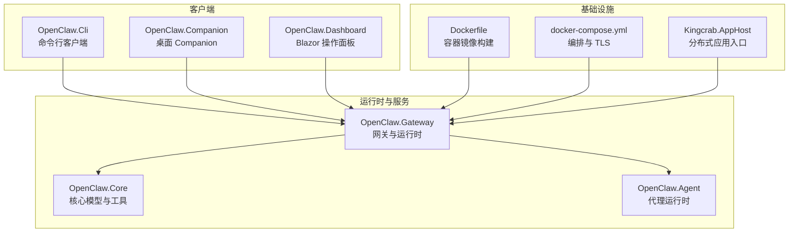
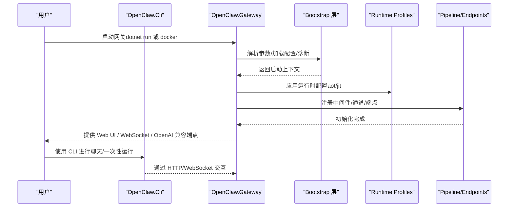
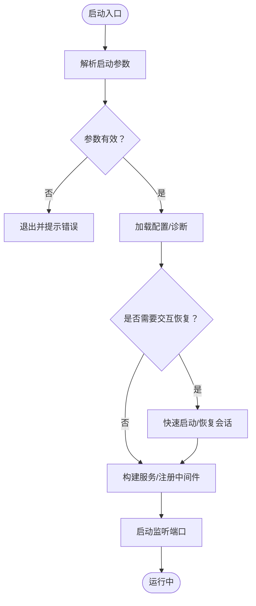
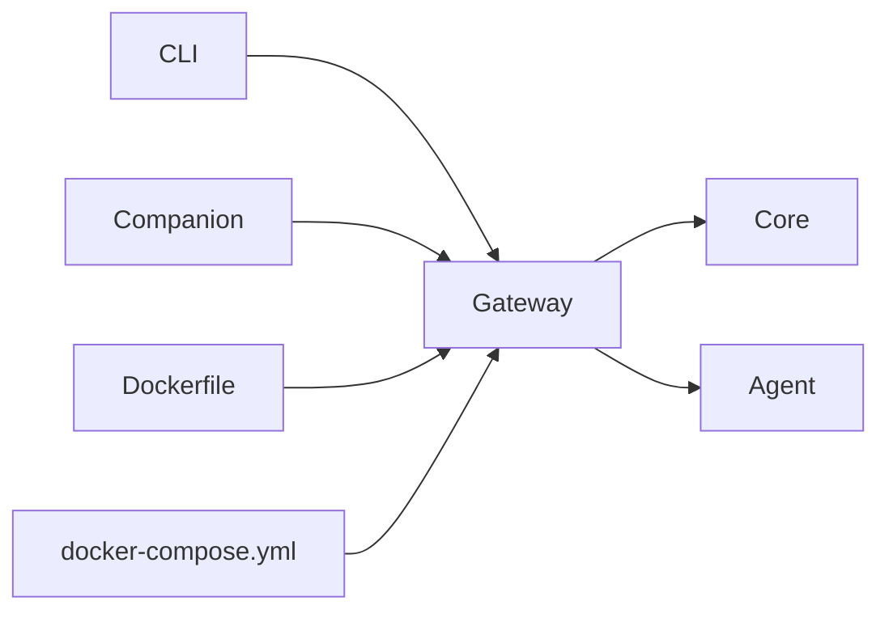
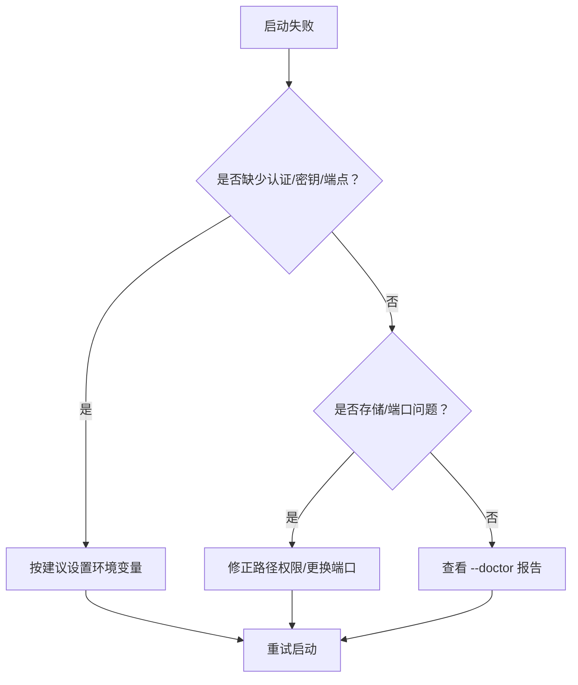

# 快速开始指南

<cite>
**本文引用的文件**
- [QUICKSTART.md](file://QUICKSTART.md)
- [README.md](file://README.md)
- [src/OpenClaw.Gateway/Program.cs](file://src/OpenClaw.Gateway/Program.cs)
- [src/OpenClaw.Cli/Program.cs](file://src/OpenClaw.Cli/Program.cs)
- [src/OpenClaw.Companion/Program.cs](file://src/OpenClaw.Companion/Program.cs)
- [Dockerfile](file://Dockerfile)
- [docker-compose.yml](file://docker-compose.yml)
- [Kingcrab.AppHost/AppHost.cs](file://Kingcrab.AppHost/AppHost.cs)
- [src/OpenClaw.Gateway/Bootstrap/StartupLaunchOptions.cs](file://src/OpenClaw.Gateway/Bootstrap/StartupLaunchOptions.cs)
- [src/OpenClaw.Gateway/Bootstrap/InteractiveStartupRecovery.cs](file://src/OpenClaw.Gateway/Bootstrap/InteractiveStartupRecovery.cs)
- [src/OpenClaw.Gateway/Bootstrap/StartupFailureReporter.cs](file://src/OpenClaw.Gateway/Bootstrap/StartupFailureReporter.cs)
</cite>

## 目录
1. [简介](#简介)
2. [项目结构](#项目结构)
3. [核心组件](#核心组件)
4. [架构总览](#架构总览)
5. [详细组件分析](#详细组件分析)
6. [依赖关系分析](#依赖关系分析)
7. [性能与运行模式](#性能与运行模式)
8. [故障排除指南](#故障排除指南)
9. [结论](#结论)
10. [附录](#附录)

## 简介
本指南面向首次接触 OpenClaw.NET 的用户，提供从零到运行的完整步骤，涵盖环境准备、API 密钥设置、网关启动、以及内置客户端（Web UI、CLI、Companion）的使用方法。文档重点介绍“最短本地路径”：设置必要的环境变量（MODEL_PROVIDER_KEY、OPENCLAW_WORKSPACE、OpenClaw__Runtime__Mode），运行网关，然后使用内置客户端进行交互。

## 项目结构
OpenClaw.NET 采用多项目结构，核心运行时位于 Gateway，同时提供 CLI 和桌面 Companion 客户端，并支持通过 Docker 一键部署。下图展示了关键模块之间的关系与职责划分。

图表来源
- [src/OpenClaw.Gateway/Program.cs:1-124](file://src/OpenClaw.Gateway/Program.cs#L1-L124)
- [src/OpenClaw.Cli/Program.cs:1-800](file://src/OpenClaw.Cli/Program.cs#L1-L800)
- [src/OpenClaw.Companion/Program.cs:1-22](file://src/OpenClaw.Companion/Program.cs#L1-L22)
- [Dockerfile:1-59](file://Dockerfile#L1-L59)
- [docker-compose.yml:1-68](file://docker-compose.yml#L1-L68)
- [Kingcrab.AppHost/AppHost.cs:1-25](file://Kingcrab.AppHost/AppHost.cs#L1-L25)

章节来源
- [README.md: 第145-196行:145-196](file://README.md#L145-L196)
- [README.md: 第198-246行:198-246](file://README.md#L198-L246)

## 核心组件
- 网关（Gateway）：负责 HTTP/WebSocket/管理端点、安全策略、中间件、通道与 MCP 等集成；启动流程分为 Bootstrap/Composition/Profiles/Pipeline 四层。
- CLI：提供 chat、run、live、tui、setup 等子命令，支持流式与非流式对话、外部命令桥接、技能与插件管理等。
- Companion：基于 Avalonia 的桌面应用，用于本地或非回环绑定场景下的聊天与管理。
- Docker 与 Compose：提供容器化部署、内存卷持久化、可选反向代理自动 TLS。

章节来源
- [README.md: 第31-40行:31-40](file://README.md#L31-L40)
- [README.md: 第145-196行:145-196](file://README.md#L145-L196)

## 架构总览
下图展示从启动到运行的关键阶段与组件交互，体现“启动分层 + 运行时组合”的设计思路。

图表来源
- [src/OpenClaw.Gateway/Program.cs:47-97](file://src/OpenClaw.Gateway/Program.cs#L47-L97)
- [src/OpenClaw.Gateway/Bootstrap/StartupLaunchOptions.cs:57-71](file://src/OpenClaw.Gateway/Bootstrap/StartupLaunchOptions.cs#L57-L71)

章节来源
- [README.md: 第145-196行:145-196](file://README.md#L145-L196)

## 详细组件分析

### 环境变量与配置
- 必需环境变量
  - MODEL_PROVIDER_KEY：模型提供商密钥（如 OpenAI、Anthropic 等）
  - OPENCLAW_AUTH_TOKEN：当网关绑定到非回环地址时必需
  - OPENCLAW_WORKSPACE：工作区目录，用于文件工具与技能工作空间
- 运行时模式
  - OpenClaw__Runtime__Mode：可设为 aot、jit 或 auto
- 其他常用
  - OPENCLAW_BASE_URL：CLI 默认访问地址
  - OPENCLAW_CONFIG_PATH：外部配置文件路径

章节来源
- [QUICKSTART.md: 第12-40行:12-40](file://QUICKSTART.md#L12-L40)
- [README.md: 第218-222行:218-222](file://README.md#L218-L222)
- [Dockerfile: 第43-51行:43-51](file://Dockerfile#L43-L51)
- [docker-compose.yml: 第13-28行:13-28](file://docker-compose.yml#L13-L28)

### 最短本地路径（从零到运行）
- 步骤
  1) 设置 MODEL_PROVIDER_KEY（必填）
  2) 可选设置 OPENCLAW_WORKSPACE（推荐）
  3) 可选设置 OpenClaw__Runtime__Mode（aot/jit/auto）
  4) 运行网关（dotnet run --project src/OpenClaw.Gateway -c Release）
  5) 使用内置客户端：
     - 浏览器 UI：http://127.0.0.1:18789/chat
     - CLI 聊天：dotnet run --project src/OpenClaw.Cli -c Release -- chat
     - 一次性运行：dotnet run --project src/OpenClaw.Cli -c Release -- run "<提示>" --file ./README.md
     - 桌面 Companion：dotnet run --project src/OpenClaw.Companion -c Release

章节来源
- [QUICKSTART.md: 第10-86行:10-86](file://QUICKSTART.md#L10-L86)
- [README.md: 第198-246行:198-246](file://README.md#L198-L246)

### 网关启动流程与诊断
- 启动参数解析与校验
  - 支持 --doctor、--health-check、--quickstart、--config 等
  - 交互式快速启动与恢复
- 启动失败报告
  - 自动识别存储权限、端口占用、认证令牌缺失等问题并给出修复建议

图表来源
- [src/OpenClaw.Gateway/Program.cs:14-97](file://src/OpenClaw.Gateway/Program.cs#L14-L97)
- [src/OpenClaw.Gateway/Bootstrap/StartupLaunchOptions.cs:57-88](file://src/OpenClaw.Gateway/Bootstrap/StartupLaunchOptions.cs#L57-L88)
- [src/OpenClaw.Gateway/Bootstrap/InteractiveStartupRecovery.cs:72-150](file://src/OpenClaw.Gateway/Bootstrap/InteractiveStartupRecovery.cs#L72-L150)
- [src/OpenClaw.Gateway/Bootstrap/StartupFailureReporter.cs:20-120](file://src/OpenClaw.Gateway/Bootstrap/StartupFailureReporter.cs#L20-L120)

章节来源
- [src/OpenClaw.Gateway/Program.cs: 第14-97行:14-97](file://src/OpenClaw.Gateway/Program.cs#L14-L97)
- [src/OpenClaw.Gateway/Bootstrap/StartupLaunchOptions.cs: 第57-88行:57-88](file://src/OpenClaw.Gateway/Bootstrap/StartupLaunchOptions.cs#L57-L88)
- [src/OpenClaw.Gateway/Bootstrap/InteractiveStartupRecovery.cs: 第72-150行:72-150](file://src/OpenClaw.Gateway/Bootstrap/InteractiveStartupRecovery.cs#L72-L150)
- [src/OpenClaw.Gateway/Bootstrap/StartupFailureReporter.cs: 第20-120行:20-120](file://src/OpenClaw.Gateway/Bootstrap/StartupFailureReporter.cs#L20-L120)

### 内置客户端使用
- 浏览器 UI
  - 访问 http://127.0.0.1:18789/chat
  - 非回环绑定时需设置 OPENCLAW_AUTH_TOKEN 并在 UI 中输入
- CLI
  - chat：交互式聊天
  - run：<提示> --file <文件>：一次性运行
  - live/tui/insights 等：高级功能
- Companion（桌面）
  - dotnet run --project src/OpenClaw.Companion -c Release
  - 支持“记住”保存令牌（跨浏览器重启）

章节来源
- [QUICKSTART.md: 第61-85行:61-85](file://QUICKSTART.md#L61-L85)
- [README.md: 第247-255行:247-255](file://README.md#L247-L255)
- [src/OpenClaw.Cli/Program.cs: 第85-237行:85-237](file://src/OpenClaw.Cli/Program.cs#L85-L237)

### Docker 部署选项
- 构建镜像
  - 多架构构建：linux/amd64, linux/arm64
  - 支持 --load 或 --push
- 运行容器
  - 挂载内存卷与可选工作区卷
  - 设置 MODEL_PROVIDER_KEY 与 OPENCLAW_AUTH_TOKEN
  - 健康检查：/app/OpenClaw.Gateway --health-check
- 反向代理与自动 TLS
  - docker-compose 包含 Caddy 服务，自动申请证书
  - 可通过 OPENCLAW_DOMAIN 指定域名

章节来源
- [QUICKSTART.md: 第126-176行:126-176](file://QUICKSTART.md#L126-L176)
- [Dockerfile: 第1-59行:1-59](file://Dockerfile#L1-L59)
- [docker-compose.yml: 第1-68行:1-68](file://docker-compose.yml#L1-L68)

## 依赖关系分析
- 组件耦合
  - Gateway 依赖 Core 与 Agent；通过服务注册与运行时配置实现解耦
  - CLI/Companion 通过 HTTP/WebSocket 与 Gateway 通信
  - Dockerfile/Docker Compose 将 Gateway 打包为轻量运行时镜像
- 外部依赖
  - ASP.NET Core（Kestrel）
  - 可选：Node.js（JS/TS 插件桥）
  - 可选：OpenSandbox（沙箱执行）

图表来源
- [src/OpenClaw.Gateway/Program.cs:67-91](file://src/OpenClaw.Gateway/Program.cs#L67-L91)
- [Dockerfile:27-58](file://Dockerfile#L27-L58)
- [docker-compose.yml:4-42](file://docker-compose.yml#L4-L42)

章节来源
- [README.md: 第31-40行:31-40](file://README.md#L31-L40)
- [README.md: 第405-516行:405-516](file://README.md#L405-L516)

## 性能与运行模式
- 运行时模式
  - aot：更小体积、更低内存占用，适合主流部署
  - jit：扩展兼容性，支持动态插件与更多桥接能力
  - auto：根据运行环境自动选择 aot/jit
- 生产建议
  - 使用 --doctor 验证配置
  - 在非回环绑定时启用 OPENCLAW_AUTH_TOKEN
  - 限制工具根目录与 shell 权限
  - 使用反向代理与 TLS

章节来源
- [README.md: 第58-123行:58-123](file://README.md#L58-L123)
- [README.md: 第190-196行:190-196](file://README.md#L190-L196)
- [README.md: 第277-324行:277-324](file://README.md#L277-L324)

## 故障排除指南
- 常见问题与修复
  - 缺少 OPENCLAW_AUTH_TOKEN（非回环绑定）
  - 缺少 MODEL_PROVIDER_KEY 或 MODEL_PROVIDER_ENDPOINT
  - 存储路径权限不足或只读文件系统
  - 端口被占用
- 自动诊断与建议
  - 启动失败时，系统会生成详细报告并提供修复建议
  - 可使用 --doctor 获取诊断信息
  - 可使用 --quickstart 或交互式恢复快速定位问题

图表来源
- [src/OpenClaw.Gateway/Bootstrap/InteractiveStartupRecovery.cs:296-322](file://src/OpenClaw.Gateway/Bootstrap/InteractiveStartupRecovery.cs#L296-L322)
- [src/OpenClaw.Gateway/Bootstrap/StartupFailureReporter.cs:268-282](file://src/OpenClaw.Gateway/Bootstrap/StartupFailureReporter.cs#L268-L282)

章节来源
- [src/OpenClaw.Gateway/Bootstrap/InteractiveStartupRecovery.cs: 第296-322行:296-322](file://src/OpenClaw.Gateway/Bootstrap/InteractiveStartupRecovery.cs#L296-L322)
- [src/OpenClaw.Gateway/Bootstrap/StartupFailureReporter.cs: 第268-282行:268-282](file://src/OpenClaw.Gateway/Bootstrap/StartupFailureReporter.cs#L268-L282)

## 结论
通过本指南，您可以在本地快速搭建并运行 OpenClaw.NET，使用 Web UI、CLI 或桌面 Companion 进行交互。建议在生产环境中配合 --doctor、TLS、反向代理与严格的工具与内存策略，确保安全与稳定。

## 附录
- 下一步学习建议
  - 阅读用户指南与安全指南，了解提供商、工具、技能与通道的配置
  - 探索插件生态兼容矩阵与构建选项
  - 使用 Docker Compose 部署并结合反向代理与自动 TLS

章节来源
- [README.md: 第185-196行:185-196](file://README.md#L185-L196)