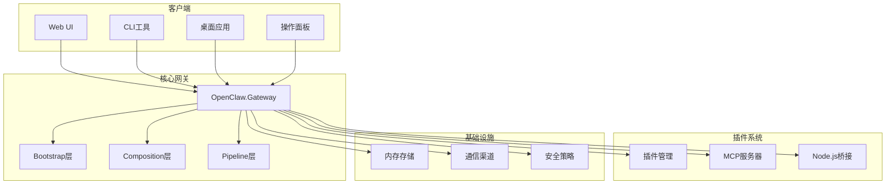
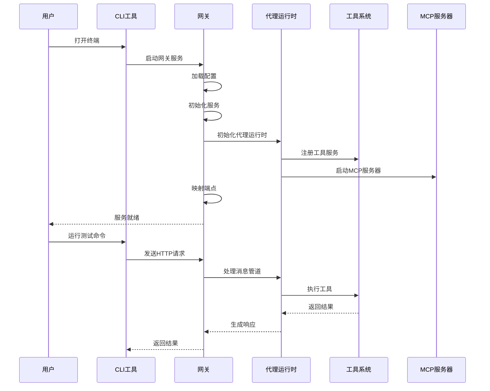
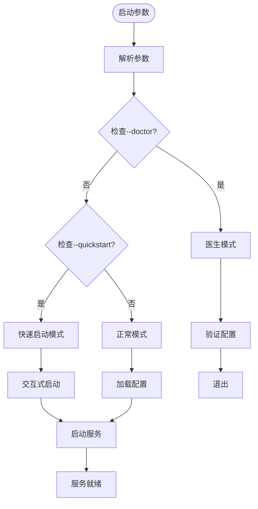
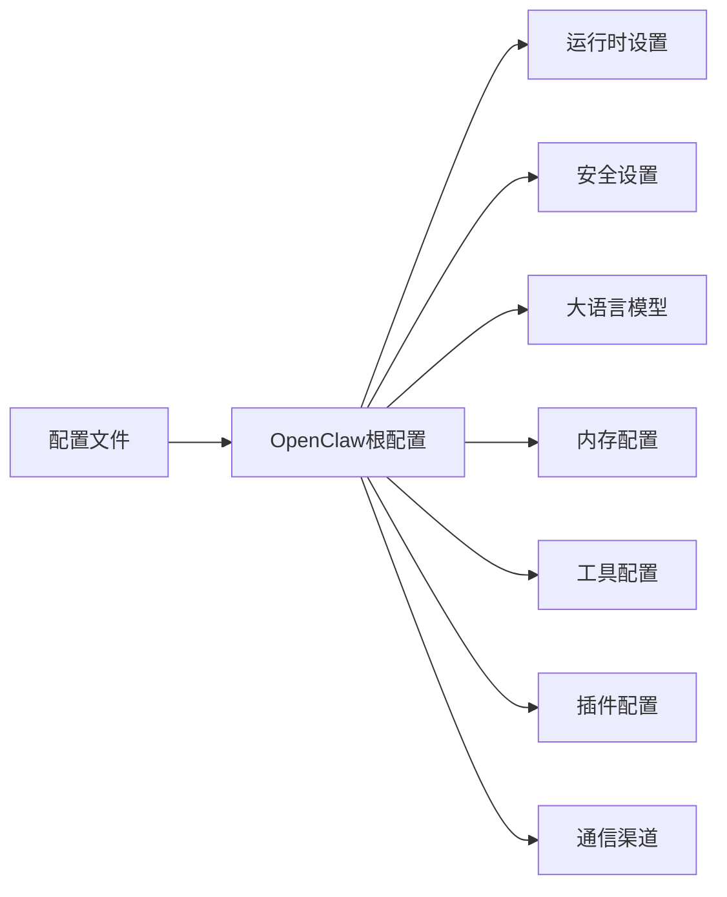
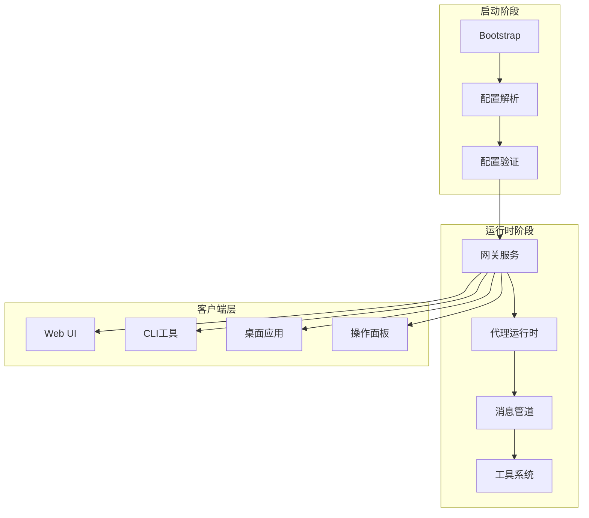

# 快速开始指南

<cite>
**本文档引用的文件**
- [README.md](file://README.md)
- [QUICKSTART.md](file://QUICKSTART.md)
- [docs/QUICKSTART.md](file://docs/QUICKSTART.md)
- [src/OpenClaw.Gateway/Program.cs](file://src/OpenClaw.Gateway/Program.cs)
- [src/OpenClaw.Gateway/appsettings.json](file://src/OpenClaw.Gateway/appsettings.json)
- [src/OpenClaw.Gateway/Properties/launchSettings.json](file://src/OpenClaw.Gateway/Properties/launchSettings.json)
- [src/OpenClaw.Gateway/Bootstrap/StartupLaunchOptions.cs](file://src/OpenClaw.Gateway/Bootstrap/StartupLaunchOptions.cs)
- [src/OpenClaw.Cli/Program.cs](file://src/OpenClaw.Cli/Program.cs)
- [src/OpenClaw.Cli/StartCommand.cs](file://src/OpenClaw.Cli/StartCommand.cs)
- [src/OpenClaw.Cli/SetupCommand.cs](file://src/OpenClaw.Cli/SetupCommand.cs)
- [src/OpenClaw.Companion/Program.cs](file://src/OpenClaw.Companion/Program.cs)
- [Kingcrab.AppHost/appsettings.json](file://Kingcrab.AppHost/appsettings.json)
- [Kingcrab.AppHost/appsettings.Development.json](file://Kingcrab.AppHost/appsettings.Development.json)
</cite>

## 目录
1. [简介](#简介)
2. [项目结构](#项目结构)
3. [核心组件](#核心组件)
4. [架构概览](#架构概览)
5. [详细组件分析](#详细组件分析)
6. [依赖关系分析](#依赖关系分析)
7. [性能考虑](#性能考虑)
8. [故障排除指南](#故障排除指南)
9. [结论](#结论)
10. [附录](#附录)

## 简介

OpenClaw.NET 是一个独立的 .NET 实现的 OpenClaw 代理运行时和网关系统。它专为可部署的 .NET 服务而构建，具有真正的 NativeAOT 友好部署通道，可选的 Microsoft Agent Framework (MAF) 编排，以及与 JavaScript/TypeScript 插件生态系统的实用兼容性。

本快速开始指南旨在帮助新用户在 10 分钟内完成从零到运行的完整部署，包括环境准备、安装依赖、配置 API 密钥、启动网关服务、验证安装结果，并使用内置客户端进行基本测试。

## 项目结构

OpenClaw.NET 采用模块化架构，主要包含以下核心组件：



**图表来源**
- [src/OpenClaw.Gateway/Program.cs:1-124](file://src/OpenClaw.Gateway/Program.cs#L1-L124)
- [README.md:145-188](file://README.md#L145-L188)

**章节来源**
- [README.md:31-56](file://README.md#L31-L56)
- [README.md:145-196](file://README.md#L145-L196)

## 核心组件

### 网关启动器
网关启动器负责应用程序的初始化和生命周期管理，采用分层启动模式：

- **Bootstrap层**: 加载配置、解析运行时模式和编排器，应用验证和加固
- **Composition层**: 注册服务并应用有效的运行时车道（`aot` 用于修剪安全部署或 `jit` 用于扩展兼容性）
- **Pipeline层**: 配置中间件、通道启动、工作者、关闭处理和分组的 HTTP/WebSocket 表面

### 内置客户端
系统提供了多种内置客户端供快速测试和验证：

- **Web UI**: 基于浏览器的聊天界面，地址为 `http://127.0.0.1:18789/chat`
- **CLI工具**: 提供命令行交互式聊天和一次性运行能力
- **桌面应用**: Avalonia 跨平台桌面客户端
- **操作面板**: Blazor WASM 操作员仪表板

### 插件生态系统
支持多种插件类型和执行方式：

- **原生插件**: 通过 Node.js JSON-RPC 桥接运行
- **动态原生插件**: 在进程内加载 .NET 插件
- **MCP服务器**: 支持 Model Context Protocol
- **技能包**: 本地技能包和托管技能

**章节来源**
- [README.md:37-39](file://README.md#L37-L39)
- [README.md:325-342](file://README.md#L325-L342)

## 架构概览

OpenClaw.NET 采用分层架构设计，将启动和运行时组合分离为明确的层次：



**图表来源**
- [src/OpenClaw.Gateway/Program.cs:47-98](file://src/OpenClaw.Gateway/Program.cs#L47-L98)
- [src/OpenClaw.Cli/Program.cs:12-69](file://src/OpenClaw.Cli/Program.cs#L12-L69)

## 详细组件分析

### 环境准备和依赖安装

#### 系统要求
- **.NET 10 SDK**: 必需的运行时环境
- **可选: Node.js 20+**: 用于上游风格的 TS/JS 插件支持

#### 开发环境配置
推荐使用 Visual Studio 或 VS Code 进行开发，配置文件位于：

- **launchSettings.json**: 开发环境配置
- **appsettings.json**: 应用程序设置
- **appsettings.Development.json**: 开发环境特定设置

**章节来源**
- [QUICKSTART.md:5-9](file://QUICKSTART.md#L5-L9)
- [src/OpenClaw.Gateway/Properties/launchSettings.json:1-13](file://src/OpenClaw.Gateway/Properties/launchSettings.json#L1-L13)
- [Kingcrab.AppHost/appsettings.json:1-10](file://Kingcrab.AppHost/appsettings.json#L1-L10)

### API密钥配置

#### 环境变量设置
```bash
# 设置模型提供商API密钥
export MODEL_PROVIDER_KEY="sk-...你的API密钥..."

# 可选: 设置工作空间目录
export OPENCLAW_WORKSPACE="$PWD/workspace"

# 可选: 选择运行时车道
export OpenClaw__Runtime__Mode="jit"  # 或 "aot"
```

#### 认证令牌
网关默认使用 `kingcrab` 作为认证令牌，建议在生产环境中替换为随机强密码：

```bash
export OPENCLAW_AUTH_TOKEN="生成的强随机令牌"
```

**章节来源**
- [QUICKSTART.md:12-40](file://QUICKSTART.md#L12-L40)
- [src/OpenClaw.Gateway/appsettings.json:5-5](file://src/OpenClaw.Gateway/appsettings.json#L5-L5)

### 网关启动流程

#### 标准启动步骤
1. **配置验证**: 使用 `--doctor` 参数验证配置
2. **启动网关**: 运行网关服务
3. **健康检查**: 验证服务状态

#### 启动选项解析
启动参数被解析为 `StartupLaunchOptions` 对象，支持以下选项：



**图表来源**
- [src/OpenClaw.Gateway/Bootstrap/StartupLaunchOptions.cs:57-88](file://src/OpenClaw.Gateway/Bootstrap/StartupLaunchOptions.cs#L57-L88)

**章节来源**
- [src/OpenClaw.Gateway/Program.cs:14-40](file://src/OpenClaw.Gateway/Program.cs#L14-L40)
- [src/OpenClaw.Gateway/Bootstrap/StartupLaunchOptions.cs:1-122](file://src/OpenClaw.Gateway/Bootstrap/StartupLaunchOptions.cs#L1-L122)

### 内置客户端使用

#### Web UI 测试
```bash
# 启动网关后，在浏览器中访问
http://127.0.0.1:18789/chat
```

#### CLI 聊天测试
```bash
# 启动交互式聊天
dotnet run --project src/OpenClaw.Cli -c Release -- chat

# 一次性运行测试
dotnet run --project src/OpenClaw.Cli -c Release -- run "测试消息" --file ./README.md
```

#### 桌面应用测试
```bash
# 启动桌面应用
dotnet run --project src/OpenClaw.Companion -c Release
```

**章节来源**
- [QUICKSTART.md:69-93](file://QUICKSTART.md#L69-L93)
- [docs/QUICKSTART.md:67-93](file://docs/QUICKSTART.md#L67-L93)

### 配置文件管理

#### 外部配置文件
```bash
# 使用外部配置文件启动
dotnet run --project src/OpenClaw.Gateway -c Release -- --config ~/.openclaw/config.json

# 或设置环境变量
export OPENCLAW_CONFIG_PATH="$HOME/.openclaw/config.json"
```

#### 配置文件结构
网关配置包含多个子系统：



**图表来源**
- [src/OpenClaw.Gateway/appsettings.json:1-908](file://src/OpenClaw.Gateway/appsettings.json#L1-L908)

**章节来源**
- [QUICKSTART.md:87-124](file://QUICKSTART.md#L87-L124)
- [src/OpenClaw.Gateway/appsettings.json:1-908](file://src/OpenClaw.Gateway/appsettings.json#L1-L908)

## 依赖关系分析

### 组件耦合度
OpenClaw.NET 采用松耦合设计，各组件间通过清晰的接口交互：



**图表来源**
- [src/OpenClaw.Gateway/Program.cs:47-98](file://src/OpenClaw.Gateway/Program.cs#L47-L98)

### 外部依赖
- **.NET 10**: 核心运行时框架
- **Node.js 20+**: 可选的插件桥接
- **SQLite**: 默认内存存储
- **ASP.NET Core**: Web 服务器框架

**章节来源**
- [README.md:7-9](file://README.md#L7-L9)
- [README.md:41-56](file://README.md#L41-L56)

## 性能考虑

### 运行时模式选择
- **AOT 模式**: 适合生产部署，内存占用低，启动速度快
- **JIT 模式**: 支持更多插件功能，但内存占用较高
- **自动模式**: 根据运行时能力自动选择

### 内存优化
- 默认使用 SQLite 存储会话历史
- 支持内存压缩和保留策略
- 可配置最大历史轮次限制

## 故障排除指南

### 常见启动问题

#### 端口占用问题
```bash
# 检查端口占用
netstat -ano | findstr :18789

# 更改端口配置
export OpenClaw__Port=18790
```

#### 权限问题
```bash
# 检查文件权限
ls -la workspace/

# 设置正确的权限
chmod -R 755 workspace/
```

#### 配置验证
```bash
# 使用医生模式验证配置
dotnet run --project src/OpenClaw.Gateway -c Release -- --doctor
```

### 客户端连接问题

#### Web UI 连接失败
```bash
# 检查网关状态
curl http://127.0.0.1:18789/health

# 检查WebSocket连接
websocat ws://127.0.0.1:18789/ws
```

#### CLI 认证问题
```bash
# 设置正确的认证令牌
export OPENCLAW_AUTH_TOKEN="你的令牌"

# 或在CLI中指定
dotnet run --project src/OpenClaw.Cli -c Release -- --token 你的令牌 chat
```

### 插件相关问题

#### Node.js 桥接问题
```bash
# 检查Node.js版本
node --version

# 检查插件配置
cat ~/.openclaw/config.json | grep -A 10 -B 5 "Plugins"
```

#### 插件加载失败
```bash
# 查看插件诊断信息
dotnet run --project src/OpenClaw.Gateway -c Release -- --doctor | grep -i plugin
```

**章节来源**
- [README.md:517-529](file://README.md#L517-L529)
- [docs/QUICKSTART.md:150-166](file://docs/QUICKSTART.md#L150-L166)

## 结论

OpenClaw.NET 提供了一个功能完整、易于使用的代理系统，支持多种部署模式和客户端类型。通过遵循本快速开始指南，您可以在 10 分钟内完成基本部署并体验核心功能。

关键要点：
- 使用 `--doctor` 进行配置验证
- 选择合适的运行时模式（AOT/JIT）
- 利用内置客户端进行测试
- 配置适当的认证和安全设置
- 使用 Docker 进行生产部署

## 附录

### 快速参考命令

#### 基础部署
```bash
# 设置API密钥
export MODEL_PROVIDER_KEY="sk-...你的API密钥..."

# 启动网关
dotnet run --project src/OpenClaw.Gateway -c Release

# 验证安装
curl http://127.0.0.1:18789/health
```

#### 客户端测试
```bash
# Web UI
http://127.0.0.1:18789/chat

# CLI聊天
dotnet run --project src/OpenClaw.Cli -c Release -- chat

# 桌面应用
dotnet run --project src/OpenClaw.Companion -c Release
```

#### Docker部署
```bash
# 构建镜像
docker build -t openclaw.net .

# 启动容器
docker run -d -p 18789:18789 \
  -e MODEL_PROVIDER_KEY="sk-...你的API密钥..." \
  -e OPENCLAW_AUTH_TOKEN="生成的强随机令牌" \
  openclaw.net
```