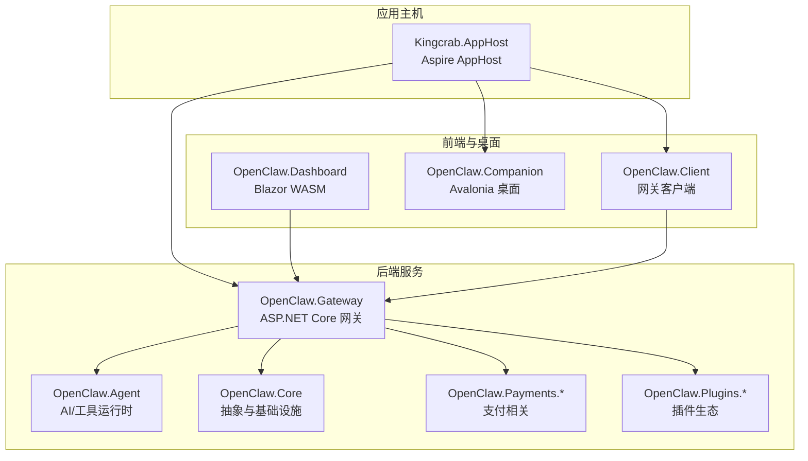
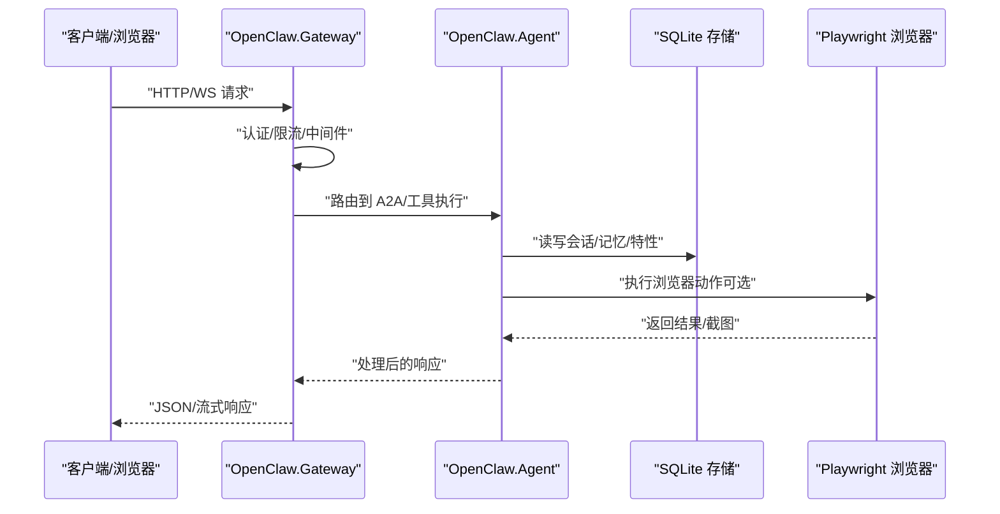
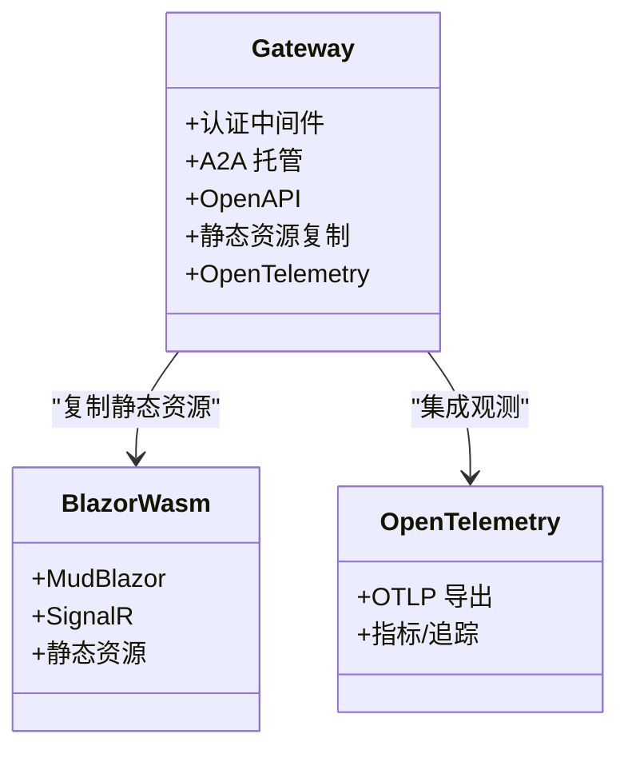
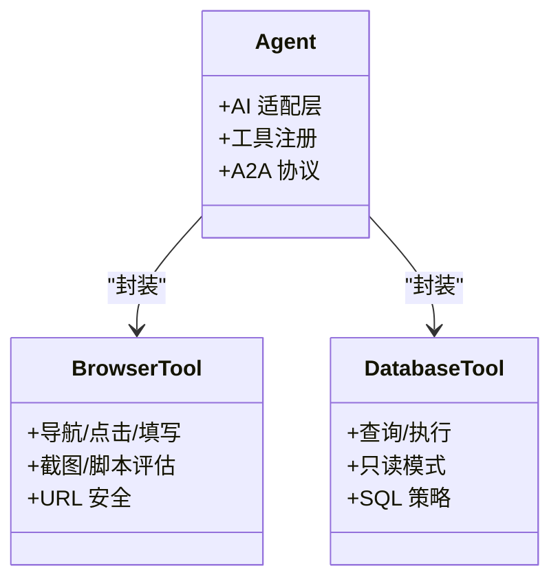
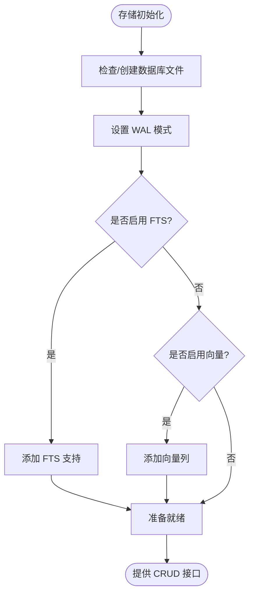
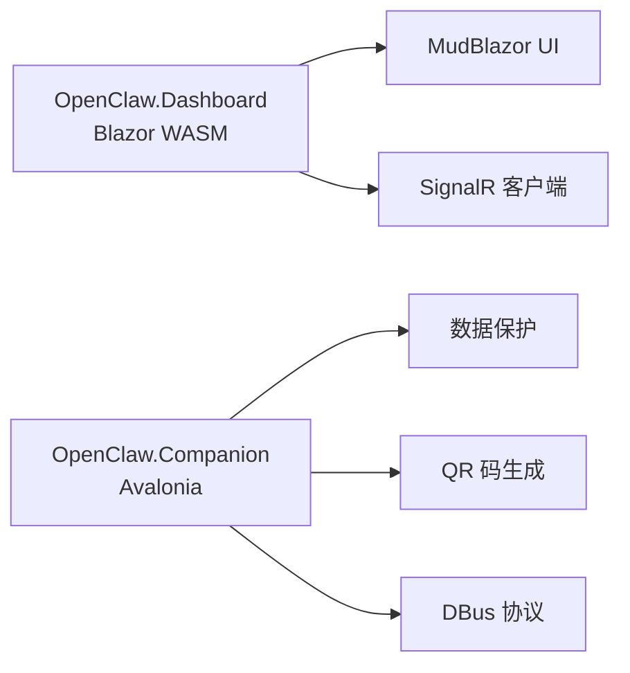
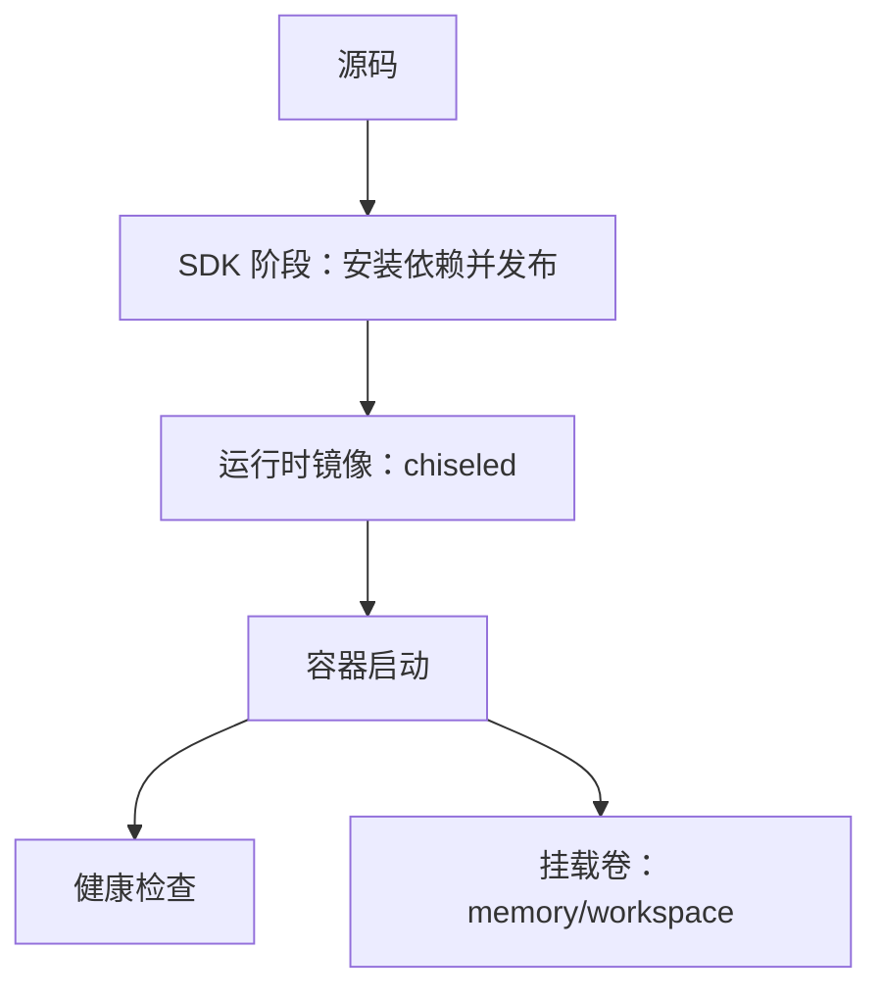
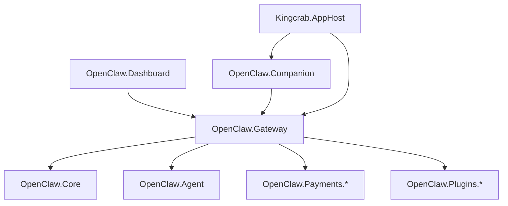

# 技术栈概览

<cite>
**本文档引用的文件**
- [Directory.Build.props](file://Directory.Build.props)
- [OpenClaw.Net.slnx](file://OpenClaw.Net.slnx)
- [Dockerfile](file://Dockerfile)
- [docker-compose.yml](file://docker-compose.yml)
- [OpenClaw.Agent.csproj](file://src/OpenClaw.Agent/OpenClaw.Agent.csproj)
- [OpenClaw.Gateway.csproj](file://src/OpenClaw.Gateway/OpenClaw.Gateway.csproj)
- [OpenClaw.Dashboard.csproj](file://src/OpenClaw.Dashboard/OpenClaw.Dashboard.csproj)
- [OpenClaw.Companion.csproj](file://src/OpenClaw.Companion/OpenClaw.Companion.csproj)
- [Kingcrab.AppHost.csproj](file://Kingcrab.AppHost/Kingcrab.AppHost.csproj)
- [SqliteFeatureStore.cs](file://src/OpenClaw.Core/Features/SqliteFeatureStore.cs)
- [SqliteMemoryStore.cs](file://src/OpenClaw.Core/Memory/SqliteMemoryStore.cs)
- [BrowserTool.cs](file://src/OpenClaw.Agent/Tools/BrowserTool.cs)
- [COMPATIBILITY.md](file://docs/COMPATIBILITY.md)
</cite>

## 目录
1. [引言](#引言)
2. [项目结构](#项目结构)
3. [核心组件](#核心组件)
4. [架构总览](#架构总览)
5. [详细组件分析](#详细组件分析)
6. [依赖关系分析](#依赖关系分析)
7. [性能考虑](#性能考虑)
8. [故障排除指南](#故障排除指南)
9. [结论](#结论)

## 引言
本技术栈概览面向 OpenClaw.NET 项目的开发者与运维人员，系统梳理并解释项目采用的关键技术与框架，涵盖 .NET 生态（.NET 10、ASP.NET Core、Entity Framework 替代方案）、AI/ML（Microsoft.Extensions.AI、OpenAI API 兼容接口）、数据库与存储（SQLite）、前端技术（Blazor WASM、Avalonia）、以及容器化与部署（Docker、docker-compose）。文档同时说明各技术选型原因、在项目中的职责边界、NativeAOT 支持策略、性能考量与开发效率权衡，并给出版本要求与兼容性信息。

## 项目结构
OpenClaw.NET 采用多项目解决方案组织方式，核心模块按职责分层：
- 网关层：OpenClaw.Gateway 提供 HTTP/WS API、A2A 托管、可观测性与静态资源集成
- 核心库：OpenClaw.Core 提供抽象、模型、内存与特性存储等基础能力
- 代理与工具：OpenClaw.Agent 负责 AI 框架适配、工具执行与浏览器自动化
- 前端与桌面：OpenClaw.Dashboard（Blazor WASM）与 OpenClaw.Companion（Avalonia）
- 客户端：OpenClaw.Client 提供网关通信客户端
- 插件与支付：OpenClaw.PluginKit、OpenClaw.Plugins.*、OpenClaw.Payments.*
- 工作主机：Kingcrab.AppHost 使用 Aspire Hosting 组合应用与服务

**图表来源**
- [Kingcrab.AppHost.csproj:17-25](file://Kingcrab.AppHost/Kingcrab.AppHost.csproj#L17-L25)
- [OpenClaw.Gateway.csproj:26-34](file://src/OpenClaw.Gateway/OpenClaw.Gateway.csproj#L26-L34)
- [OpenClaw.Dashboard.csproj:1-15](file://src/OpenClaw.Dashboard/OpenClaw.Dashboard.csproj#L1-L15)
- [OpenClaw.Companion.csproj:1-41](file://src/OpenClaw.Companion/OpenClaw.Companion.csproj#L1-L41)

**章节来源**
- [OpenClaw.Net.slnx:7-31](file://OpenClaw.Net.slnx#L7-L31)
- [Kingcrab.AppHost.csproj:17-25](file://Kingcrab.AppHost/Kingcrab.AppHost.csproj#L17-L25)

## 核心组件
本节概述各技术栈在项目中的角色与价值。

- .NET 10 与 NativeAOT
  - 目标框架与编译优化：项目统一使用 .NET 10，Gateway 通过 NativeAOT 发布以获得更小体积与更快启动；Agent 明确声明 AOT 兼容性以支持插件桥接场景。
  - 性能与安全：启用严格修剪（TrimMode=link），减少运行时体积；对 Playwright 等反射密集库进行显式根标记与警告抑制，平衡 AOT 友好性与功能可用性。
  - 版本要求：.NET SDK 10.0、运行时 10.0；项目属性中包含 LangVersion、Nullable、InvariantGlobalization 等现代 C# 配置。

- ASP.NET Core 网关（OpenClaw.Gateway）
  - 职责：HTTP/WS API、A2A 托管、OpenAPI、JWT 认证、可观测性（OpenTelemetry）、静态资源内嵌（Blazor WASM）。
  - 关键包：Microsoft.Agents.AI.*、ModelContextProtocol.AspNetCore、OpenTelemetry.*、QRCoder 等。
  - 构建策略：发布时裁剪符号、优化二进制大小，针对非 AOT 的 Playwright 包保留警告抑制，确保生产环境稳定。

- AI/ML 与多提供商适配（Microsoft.Extensions.AI）
  - 适配层：通过 Microsoft.Extensions.AI 与 Microsoft.Extensions.AI.OpenAI 提供统一的 LLM 接口，兼容多种后端（Anthropic、Gemini 等）。
  - A2A 集成：Microsoft.Agents.AI 与托管扩展用于 A2A 协议与 UI 开发体验。
  - OpenAI 兼容：提供 OpenAI 兼容接口，便于迁移与多云策略。

- 数据库与存储（SQLite）
  - 特性存储：SqliteFeatureStore 实现自动化、用户画像、学习提案等特性数据的持久化。
  - 内存存储：SqliteMemoryStore 支持会话、笔记与可选向量/FTS 能力，提升检索与语义搜索效果。
  - 连接与事务：使用 Microsoft.Data.Sqlite，开启 WAL、外键与同步模式优化，保证并发与一致性。

- 浏览器自动化（Microsoft.Playwright）
  - 职责：BrowserTool 提供无头浏览器能力，支持导航、点击、填写、截图与脚本评估，满足动态网页抓取与交互。
  - 安全与隔离：内置 URL 安全策略、沙箱配置与取消机制，避免滥用与资源泄漏。
  - AOT 注意：Playwright 不支持 AOT，项目通过构建属性与警告抑制在非 AOT 的运行时启用。

- 前端技术（Blazor WASM 与 Avalonia）
  - Blazor WASM（Dashboard）：基于 MudBlazor，集成 SignalR，构建管理与可视化界面；通过自定义目标在构建后复制静态资源到网关发布目录。
  - Avalonia（Companion）：桌面应用，提供本地网关服务、二维码、数据保护与系统集成能力。

- 容器化与部署（Docker 与 docker-compose）
  - 多阶段构建：SDK 阶段安装 NativeAOT 依赖并发布 Gateway；运行时阶段使用 chiseled 运行时镜像，最小化攻击面。
  - 环境变量：通过环境变量控制绑定地址、端口、内存路径、工具权限与插件开关；健康检查与入口命令明确。
  - 编排：compose 文件暴露 18789 端口，支持可选反向代理（Caddy）与自动 TLS。

**章节来源**
- [Directory.Build.props:1-41](file://Directory.Build.props#L1-L41)
- [OpenClaw.Gateway.csproj:1-143](file://src/OpenClaw.Gateway/OpenClaw.Gateway.csproj#L1-L143)
- [OpenClaw.Agent.csproj:1-31](file://src/OpenClaw.Agent/OpenClaw.Agent.csproj#L1-L31)
- [SqliteFeatureStore.cs:1-441](file://src/OpenClaw.Core/Features/SqliteFeatureStore.cs#L1-L441)
- [SqliteMemoryStore.cs:32-238](file://src/OpenClaw.Core/Memory/SqliteMemoryStore.cs#L32-L238)
- [BrowserTool.cs:1-653](file://src/OpenClaw.Agent/Tools/BrowserTool.cs#L1-L653)
- [Dockerfile:1-59](file://Dockerfile#L1-L59)
- [docker-compose.yml:1-68](file://docker-compose.yml#L1-L68)

## 架构总览
下图展示从客户端到网关、再到代理与工具执行的整体调用链路，以及静态资源与可观测性的集成点。

**图表来源**
- [OpenClaw.Gateway.csproj:52-87](file://src/OpenClaw.Gateway/OpenClaw.Gateway.csproj#L52-L87)
- [BrowserTool.cs:340-448](file://src/OpenClaw.Agent/Tools/BrowserTool.cs#L340-L448)
- [SqliteMemoryStore.cs:150-220](file://src/OpenClaw.Core/Memory/SqliteMemoryStore.cs#L150-L220)

## 详细组件分析

### 组件一：网关（OpenClaw.Gateway）
- 角色定位：统一入口，承载 API、A2A 托管、静态资源与可观测性。
- 关键实现要点：
  - 通过自定义 MSBuild 目标将 Blazor WASM 静态资源复制到网关输出目录，确保生产环境静态文件可用。
  - 针对 Playwright 的非 AOT 特性，设置警告抑制与根程序集标记，保证运行时可用性。
  - 集成 OpenTelemetry、JWT、OpenAPI 等企业级能力。
- 性能与安全：
  - 发布时裁剪符号、优化二进制大小，关闭不必要的运行时支持以减小体积。
  - 通过环境变量控制绑定地址、端口与工具权限，遵循最小权限原则。

**图表来源**
- [OpenClaw.Gateway.csproj:92-141](file://src/OpenClaw.Gateway/OpenClaw.Gateway.csproj#L92-L141)
- [OpenClaw.Gateway.csproj:56-67](file://src/OpenClaw.Gateway/OpenClaw.Gateway.csproj#L56-L67)

**章节来源**
- [OpenClaw.Gateway.csproj:1-143](file://src/OpenClaw.Gateway/OpenClaw.Gateway.csproj#L1-L143)

### 组件二：代理与工具（OpenClaw.Agent）
- 角色定位：AI 框架适配与工具执行，提供浏览器自动化、数据库访问、文件操作等原生能力。
- 关键实现要点：
  - Microsoft.Extensions.AI 与 Microsoft.Extensions.AI.OpenAI 提供统一接口，兼容 Anthropic、Gemini 等。
  - BrowserTool 封装 Playwright，提供导航、点击、填写、截图与脚本评估，内置 URL 安全策略与取消支持。
  - 工具执行路由与沙箱能力，结合安全策略与路径白名单，保障执行安全。
- AOT 支持：项目声明 IsAotCompatible=true，配合运行时警告抑制与根程序集标记，平衡功能与 AOT 友好性。

**图表来源**
- [OpenClaw.Agent.csproj:10-26](file://src/OpenClaw.Agent/OpenClaw.Agent.csproj#L10-L26)
- [BrowserTool.cs:1-653](file://src/OpenClaw.Agent/Tools/BrowserTool.cs#L1-L653)

**章节来源**
- [OpenClaw.Agent.csproj:1-31](file://src/OpenClaw.Agent/OpenClaw.Agent.csproj#L1-L31)
- [BrowserTool.cs:1-653](file://src/OpenClaw.Agent/Tools/BrowserTool.cs#L1-L653)

### 组件三：存储（SQLite）
- 角色定位：提供会话、笔记、自动化、学习提案等数据的持久化能力。
- 关键实现要点：
  - SqliteFeatureStore：集中实现多类特性存储接口，使用共享缓存与 WAL 模式提升并发与可靠性。
  - SqliteMemoryStore：支持会话与笔记持久化，可选启用 FTS 与向量列，增强检索与语义搜索。
  - 连接字符串与初始化：统一连接参数，自动建表与迁移，异常与回退处理完善。
- 性能与可靠性：PRAGMA 设置、外键约束、事务与错误恢复策略，确保数据一致与高可用。

**图表来源**
- [SqliteMemoryStore.cs:54-148](file://src/OpenClaw.Core/Memory/SqliteMemoryStore.cs#L54-L148)
- [SqliteFeatureStore.cs:28-42](file://src/OpenClaw.Core/Features/SqliteFeatureStore.cs#L28-L42)

**章节来源**
- [SqliteFeatureStore.cs:1-441](file://src/OpenClaw.Core/Features/SqliteFeatureStore.cs#L1-L441)
- [SqliteMemoryStore.cs:32-238](file://src/OpenClaw.Core/Memory/SqliteMemoryStore.cs#L32-L238)

### 组件四：前端与桌面（Blazor WASM 与 Avalonia）
- 角色定位：Dashboard 提供管理界面，Companion 提供桌面本地服务。
- 关键实现要点：
  - Dashboard：Blazor WASM + MudBlazor，通过自定义目标在构建后复制静态资源，确保生产环境可用。
  - Companion：Avalonia 桌面应用，集成数据保护、QR 码、DBus 协议与本地网关服务。
- 运行时配置：InvariantGlobalization 在前端项目中关闭，以支持多语言；Dashboard 使用部分修剪（TrimMode=partial）。

**图表来源**
- [OpenClaw.Dashboard.csproj:1-15](file://src/OpenClaw.Dashboard/OpenClaw.Dashboard.csproj#L1-L15)
- [OpenClaw.Companion.csproj:1-41](file://src/OpenClaw.Companion/OpenClaw.Companion.csproj#L1-L41)

**章节来源**
- [OpenClaw.Dashboard.csproj:1-15](file://src/OpenClaw.Dashboard/OpenClaw.Dashboard.csproj#L1-L15)
- [OpenClaw.Companion.csproj:1-41](file://src/OpenClaw.Companion/OpenClaw.Companion.csproj#L1-L41)

### 组件五：容器化与部署（Docker 与 docker-compose）
- 多阶段构建：SDK 阶段安装 clang/zlib 并发布 Gateway；运行时阶段使用 chiseled 运行时镜像，最小化体积与攻击面。
- 环境变量：通过环境变量控制绑定地址、端口、内存路径、工具权限与插件开关；健康检查与入口命令明确。
- 编排：compose 文件暴露 18789 端口，支持可选反向代理（Caddy）与自动 TLS；内存与工作区挂载卷持久化。

**图表来源**
- [Dockerfile:1-59](file://Dockerfile#L1-L59)
- [docker-compose.yml:1-68](file://docker-compose.yml#L1-L68)

**章节来源**
- [Dockerfile:1-59](file://Dockerfile#L1-L59)
- [docker-compose.yml:1-68](file://docker-compose.yml#L1-L68)

## 依赖关系分析
- 项目间依赖：Gateway 对 Core、Agent、Channels、Payments、Plugins 进行组合；Dashboard 通过复制静态资源与网关集成；AppHost 组合 CLI、Companion 与 Gateway。
- 外部依赖：Microsoft.Extensions.AI、Microsoft.Agents.AI、Playwright、OpenTelemetry、MudBlazor、Avalonia 等。
- 运行时模式：COMPATIBILITY.md 明确 AOT/JIT 模式下的桥接能力矩阵，指导插件与工具的兼容性设计。

**图表来源**
- [OpenClaw.Gateway.csproj:26-34](file://src/OpenClaw.Gateway/OpenClaw.Gateway.csproj#L26-L34)
- [Kingcrab.AppHost.csproj:22-25](file://Kingcrab.AppHost/Kingcrab.AppHost.csproj#L22-L25)

**章节来源**
- [COMPATIBILITY.md:1-131](file://docs/COMPATIBILITY.md#L1-L131)

## 性能考虑
- NativeAOT 与裁剪：Gateway 发布时启用符号裁剪与二进制优化，降低内存占用与启动时间；对 Playwright 等反射密集库进行警告抑制与根程序集标记，平衡 AOT 友好性与功能可用性。
- SQLite 优化：WAL 模式、外键与同步设置提升并发与可靠性；可选 FTS 与向量列增强检索能力。
- 前端静态资源：通过构建目标复制 Blazor WASM 资源，避免运行时解析开销，确保生产环境加载稳定。
- 观测性：OpenTelemetry 集成提供指标与追踪，辅助性能监控与问题定位。

[本节为通用性能讨论，不直接分析具体文件]

## 故障排除指南
- 插件兼容性：根据 COMPATIBILITY.md，AOT 模式下仅支持部分桥接表面（如工具注册、服务注册），通道、命令、事件钩子与提供商注册需在 JIT 模式启用。若出现“需要 JIT 模式”的错误，请切换运行时模式或重构插件能力。
- 浏览器工具：当提示“本地 Playwright 执行不可用”时，确认已配置执行后端或沙箱；检查 PLAYWRIGHT_BROWSERS_PATH 与测试隔离环境变量。
- 数据库工具：若提示未注册提供程序或连接失败，检查 DbProviderFactories 注册与连接字符串；确认是否启用了写操作与多语句策略。
- 容器健康检查：compose 中的健康检查命令与 Dockerfile 中的健康检查一致，若容器持续重启，检查环境变量与内存/工作区挂载卷。

**章节来源**
- [COMPATIBILITY.md:31-104](file://docs/COMPATIBILITY.md#L31-L104)
- [BrowserTool.cs:17-21](file://src/OpenClaw.Agent/Tools/BrowserTool.cs#L17-L21)
- [OpenClaw.Agent/Tools/DatabaseTool.cs:70-96](file://src/OpenClaw.Agent/Tools/DatabaseTool.cs#L70-L96)

## 结论
OpenClaw.NET 通过 .NET 10 与 NativeAOT 的现代化编译与发布策略，在保持高性能与低资源占用的同时，兼顾了功能完整性与可维护性。AI/ML 适配层与多提供商接口提供了灵活的推理能力；SQLite 存储与浏览器自动化工具满足多样化的业务需求；Blazor WASM 与 Avalonia 前端技术栈覆盖云端与桌面场景；Docker 与 docker-compose 则为部署与运维提供了标准化路径。整体技术栈在 AOT 友好性、安全性与开发效率之间取得良好平衡，适合构建可演进的智能代理平台。