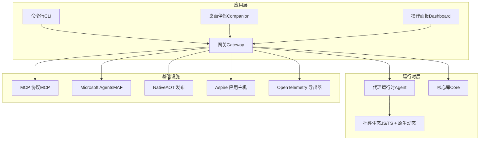
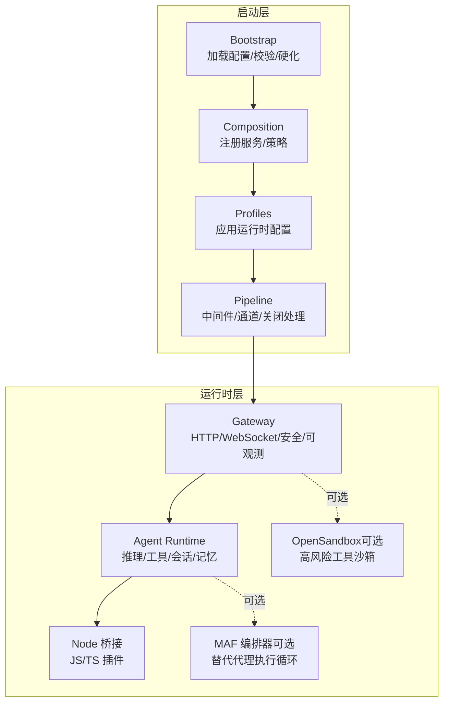
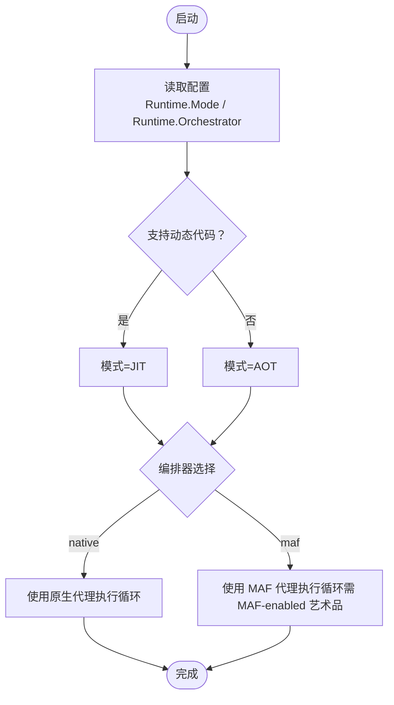
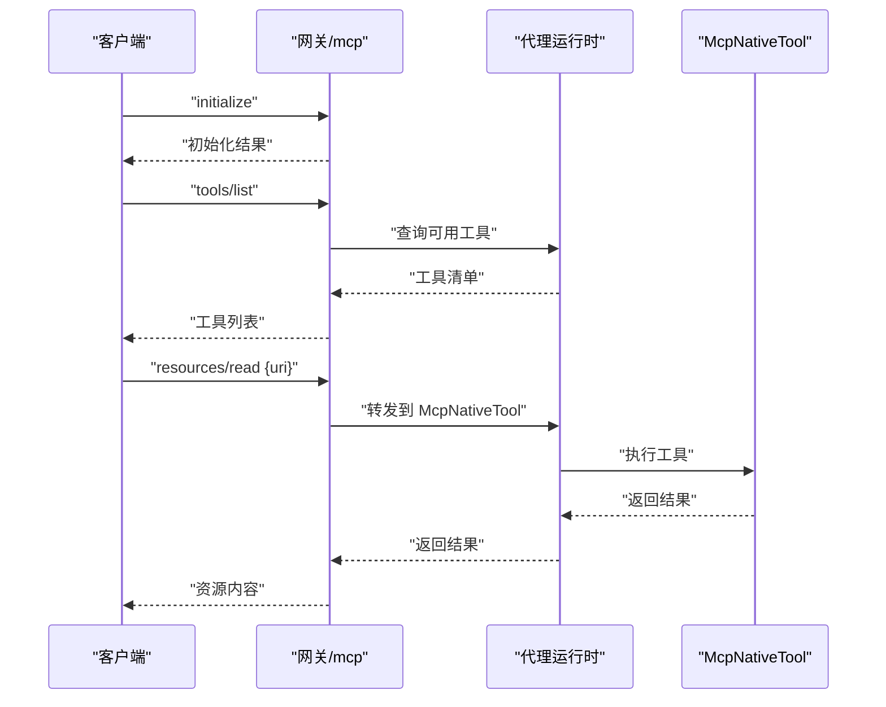
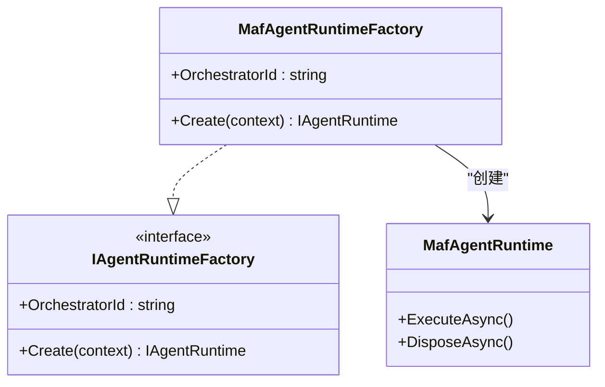
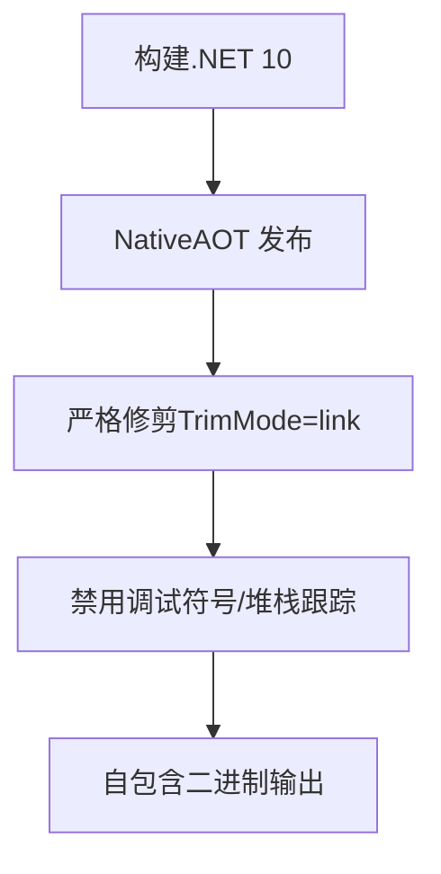
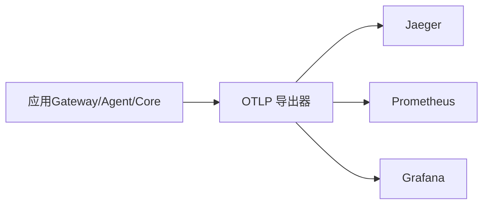
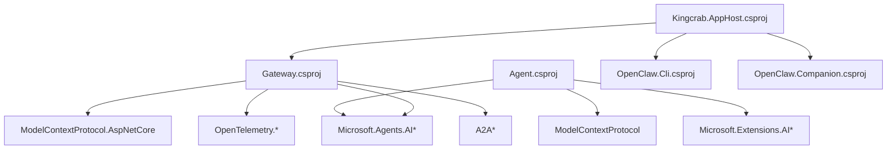

# 技术栈概览

<cite>
**本文档引用的文件**
- [Directory.Build.props](file://Directory.Build.props)
- [OpenClaw.Net.slnx](file://OpenClaw.Net.slnx)
- [README.md](file://README.md)
- [QUICKSTART.md](file://QUICKSTART.md)
- [COMPATIBILITY.md](file://COMPATIBILITY.md)
- [OpenClaw.Gateway.csproj](file://src/OpenClaw.Gateway/OpenClaw.Gateway.csproj)
- [OpenClaw.Agent.csproj](file://src/OpenClaw.Agent/OpenClaw.Agent.csproj)
- [Program.cs](file://src/OpenClaw.Gateway/Program.cs)
- [RuntimeModels.cs](file://src/OpenClaw.Core/Models/RuntimeModels.cs)
- [Extensions.cs](file://Kingcrab.ServiceDefaults/Extensions.cs)
- [GatewayTelemetryExtensions.cs](file://src/OpenClaw.Gateway/Extensions/GatewayTelemetryExtensions.cs)
- [Kingcrab.AppHost.csproj](file://Kingcrab.AppHost/Kingcrab.AppHost.csproj)
- [MafAgentRuntimeFactory.cs](file://src/OpenClaw.Agent/MafAgentRuntimeFactory.cs)
- [McpNativeTool.cs](file://src/OpenClaw.Agent/Tools/McpNativeTool.cs)
- [OpenClawHttpClient.cs](file://src/OpenClaw.Client/OpenClawHttpClient.cs)
- [McpModels.cs](file://src/OpenClaw.Client/McpModels.cs)
</cite>

## 目录
1. [简介](#简介)
2. [项目结构](#项目结构)
3. [核心组件](#核心组件)
4. [架构总览](#架构总览)
5. [详细组件分析](#详细组件分析)
6. [依赖关系分析](#依赖关系分析)
7. [性能考量](#性能考量)
8. [故障排除指南](#故障排除指南)
9. [结论](#结论)

## 简介
本文件为 OpenClaw.NET 技术栈概览，聚焦于以下核心技术选择与架构设计：
- .NET 生态系统：统一语言与运行时，面向生产部署与可观测性。
- NativeAOT 技术：通过严格修剪与发布为自包含二进制，降低内存占用与启动延迟。
- Microsoft Agents（MAF）框架：作为可选的代理编排后端，保持默认原生路径不变。
- Model Context Protocol（MCP）：在网关层提供标准化工具与资源发现、调用能力。

本概览解释各技术组件的作用、相互关系与选择理由，并给出 .NET 版本要求、关键依赖版本信息与第三方库选择依据，帮助开发者快速理解项目的技术架构基础。

## 项目结构
OpenClaw.NET 采用多项目解决方案组织，核心模块包括：
- 网关（Gateway）：HTTP/WebSocket/通道接入、安全策略、可观测性、MCP/A2A 端点映射。
- 代理运行时（Agent）：推理、工具执行、会话与记忆、插件桥接与兼容性控制。
- 核心库（Core）：模型、管道、中间件、策略、存储抽象等通用能力。
- 客户端（Client）：MCP 客户端、HTTP/WebSocket 客户端。
- 工具与技能（Tools/Skills）：内置工具集与技能包加载机制。
- 频道（Channels）：Telegram、Twilio、WhatsApp、邮件等多通道适配。
- 支付（Payments）：支付抽象与实现（Stripe Link 等）。
- 可选集成：OpenSandbox（沙箱执行）、Aspire 应用主机、仪表盘（Blazor WASM）等。

图表来源
- [OpenClaw.Gateway.csproj:1-143](file://src/OpenClaw.Gateway/OpenClaw.Gateway.csproj#L1-L143)
- [OpenClaw.Agent.csproj:1-31](file://src/OpenClaw.Agent/OpenClaw.Agent.csproj#L1-L31)
- [Program.cs:1-124](file://src/OpenClaw.Gateway/Program.cs#L1-L124)

章节来源
- [OpenClaw.Net.slnx:1-43](file://OpenClaw.Net.slnx#L1-L43)
- [README.md:145-197](file://README.md#L145-L197)

## 核心组件
本节概述技术栈中的关键组件及其职责：

- .NET 与构建配置
  - 目标框架：net10.0，启用严格警告、内联建议、不可变全球化等生产级设置。
  - NativeAOT 发布：开启修剪（TrimMode=link），禁用调试符号与堆栈跟踪以减小体积。
  - 项目间可见性：通过 InternalsVisibleTo 控制测试与网关访问内部类型。

- 网关（Gateway）
  - 使用 ASP.NET Core Minimal Hosting，按启动阶段分层装配服务与中间件。
  - 集成 MCP、A2A、MAF、OpenTelemetry、认证与速率限制等能力。
  - 支持可选 OpenSandbox 执行后端。

- 代理运行时（Agent）
  - 提供工具执行、会话管理、记忆交互、插件桥接与兼容性门控。
  - 支持 MCP 工具封装与 JSON 上下文序列化。

- 核心库（Core）
  - 定义运行时模式（aot/jit/auto）与编排器（native/maf）选择逻辑。
  - 提供管道、中间件、策略、存储抽象与诊断能力。

- 客户端（Client）
  - 提供 MCP 客户端接口与模型定义，支持 initialize、tools/list、resources/list 等标准请求。

- 观测性（OpenTelemetry）
  - 统一注入 OTLP 导出器，支持 Jaeger/Prometheus/Grafana 等后端。
  - 网关与服务默认启用 ASP.NET Core、HTTP、运行时指标与自定义计数器。

章节来源
- [Directory.Build.props:1-41](file://Directory.Build.props#L1-L41)
- [OpenClaw.Gateway.csproj:1-143](file://src/OpenClaw.Gateway/OpenClaw.Gateway.csproj#L1-L143)
- [OpenClaw.Agent.csproj:1-31](file://src/OpenClaw.Agent/OpenClaw.Agent.csproj#L1-L31)
- [RuntimeModels.cs:1-69](file://src/OpenClaw.Core/Models/RuntimeModels.cs#L1-L69)
- [Extensions.cs:69-126](file://Kingcrab.ServiceDefaults/Extensions.cs#L69-L126)
- [GatewayTelemetryExtensions.cs:37-52](file://src/OpenClaw.Gateway/Extensions/GatewayTelemetryExtensions.cs#L37-L52)

## 架构总览
OpenClaw.NET 将“启动”与“运行时”解耦为明确的层次：
- 启动层（Bootstrap/Composition/Profiles/Pipeline）：加载配置、解析运行时模式与编排器、注册服务、应用运行时配置。
- 运行时层（Gateway/Agent/Tools/Memory/LLM Provider/Bridge）：处理请求、执行推理、工具调用、记忆交互；JS/TS 插件通过 Node 桥接运行；可选 MAF 编排器替换代理执行循环。

图表来源
- [README.md:145-197](file://README.md#L145-L197)
- [Program.cs:50-96](file://src/OpenClaw.Gateway/Program.cs#L50-L96)

章节来源
- [README.md:145-197](file://README.md#L145-L197)
- [Program.cs:1-124](file://src/OpenClaw.Gateway/Program.cs#L1-L124)

## 详细组件分析

### 运行时模式与编排器选择
- 运行时模式
  - aot：严格修剪、低内存占用，适合大多数生产部署。
  - jit：启用动态代码，支持更广插件兼容面（含 registerChannel/registerCommand/registerProvider/api.on 等）。
  - auto：根据运行时是否支持动态代码自动选择。
- 编排器
  - native：默认编排器，保持现有代理执行循环。
  - maf：可选编排器，仅在 MAF-enabled 艺术品中支持。

图表来源
- [RuntimeModels.cs:29-69](file://src/OpenClaw.Core/Models/RuntimeModels.cs#L29-L69)
- [COMPATIBILITY.md:5-9](file://COMPATIBILITY.md#L5-L9)

章节来源
- [RuntimeModels.cs:1-69](file://src/OpenClaw.Core/Models/RuntimeModels.cs#L1-L69)
- [COMPATIBILITY.md:1-131](file://COMPATIBILITY.md#L1-L131)

### MCP（Model Context Protocol）集成
- 网关层通过 ModelContextProtocol.AspNetCore 注册 /mcp 端点，支持初始化、工具列表、资源列表与读取等标准 MCP 请求。
- 客户端提供 McpClient 封装，支持 initialize、tools/list、resources/list、resources/read 等方法。
- 代理侧提供 McpNativeTool 封装，将 MCP 工具调用桥接到本地 ITool 接口。

图表来源
- [OpenClawHttpClient.cs:262-280](file://src/OpenClaw.Client/OpenClawHttpClient.cs#L262-L280)
- [McpModels.cs:45-97](file://src/OpenClaw.Client/McpModels.cs#L45-L97)
- [McpNativeTool.cs:1-36](file://src/OpenClaw.Agent/Tools/McpNativeTool.cs#L1-L36)

章节来源
- [OpenClaw.Gateway.csproj:58-61](file://src/OpenClaw.Gateway/OpenClaw.Gateway.csproj#L58-L61)
- [OpenClawHttpClient.cs:262-280](file://src/OpenClaw.Client/OpenClawHttpClient.cs#L262-L280)
- [McpModels.cs:45-97](file://src/OpenClaw.Client/McpModels.cs#L45-L97)
- [McpNativeTool.cs:1-36](file://src/OpenClaw.Agent/Tools/McpNativeTool.cs#L1-L36)

### Microsoft Agents（MAF）可选编排器
- MAF 作为可选编排器，通过 MafAgentRuntimeFactory 注入，保持网关与运行时边界清晰。
- 在 MAF-enabled 艺术品中，支持 maf+jit 与 maf+aot 两种组合；未启用 MAF 的情况下选择 maf 将触发明确错误。
- 默认仍为 native 编排器，确保现有行为不受影响。

图表来源
- [MafAgentRuntimeFactory.cs:1-42](file://src/OpenClaw.Agent/MafAgentRuntimeFactory.cs#L1-L42)

章节来源
- [docs/maf-aot-jit-plan.md:1-133](file://docs/maf-aot-jit/maf-aot-jit-plan.md#L1-L133)
- [MafAgentRuntimeFactory.cs:1-42](file://src/OpenClaw.Agent/MafAgentRuntimeFactory.cs#L1-L42)

### NativeAOT 发布与修剪
- 发布配置启用 TrimMode=link、禁用调试符号与堆栈跟踪，优化二进制体积与启动性能。
- 对 Playwright 等深度反射使用的包进行根程序集声明与警告抑制，平衡兼容性与修剪安全性。
- 通过 IsAotCompatible 标记 Agent 项目，确保 AOT 友好。

图表来源
- [Directory.Build.props:10-19](file://Directory.Build.props#L10-L19)
- [OpenClaw.Gateway.csproj:1-21](file://src/OpenClaw.Gateway/OpenClaw.Gateway.csproj#L1-L21)
- [OpenClaw.Agent.csproj:4-4](file://src/OpenClaw.Agent/OpenClaw.Agent.csproj#L4-L4)

章节来源
- [Directory.Build.props:1-41](file://Directory.Build.props#L1-L41)
- [OpenClaw.Gateway.csproj:1-143](file://src/OpenClaw.Gateway/OpenClaw.Gateway.csproj#L1-L143)
- [OpenClaw.Agent.csproj:1-31](file://src/OpenClaw.Agent/OpenClaw.Agent.csproj#L1-L31)

### 观测性与导出器
- 通过 ServiceDefaults 扩展统一注入 OTLP 导出器，支持 Jaeger、Prometheus、Grafana 等后端。
- 网关扩展在 ASP.NET Core、HTTP、运行时与自定义计数器上启用追踪与指标。
- 支持健康检查与存活检查端点，便于容器编排与运维监控。

图表来源
- [Extensions.cs:69-126](file://Kingcrab.ServiceDefaults/Extensions.cs#L69-L126)
- [GatewayTelemetryExtensions.cs:37-52](file://src/OpenClaw.Gateway/Extensions/GatewayTelemetryExtensions.cs#L37-L52)

章节来源
- [Extensions.cs:69-126](file://Kingcrab.ServiceDefaults/Extensions.cs#L69-L126)
- [GatewayTelemetryExtensions.cs:37-52](file://src/OpenClaw.Gateway/Extensions/GatewayTelemetryExtensions.cs#L37-L52)

## 依赖关系分析
- 解决方案与项目组织
  - 通过 OpenClaw.Net.slnx 组织 src 与 tests 下的多个项目，便于统一构建与测试。
  - AppHost 项目用于 Aspire 场景编排，引用 CLI、Companion、Gateway。

- 关键 NuGet 包
  - 网关：Microsoft.Agents.AI、ModelContextProtocol.AspNetCore、OpenTelemetry.*、A2A.* 等。
  - 代理：ModelContextProtocol、Microsoft.Extensions.AI、Microsoft.Agents.AI 等。
  - 核心：Microsoft.Extensions.*（DI、Options、Configuration）等。

图表来源
- [OpenClaw.Gateway.csproj:39-67](file://src/OpenClaw.Gateway/OpenClaw.Gateway.csproj#L39-L67)
- [OpenClaw.Agent.csproj:11-26](file://src/OpenClaw.Agent/OpenClaw.Agent.csproj#L11-L26)
- [Kingcrab.AppHost.csproj:17-25](file://Kingcrab.AppHost/Kingcrab.AppHost.csproj#L17-L25)

章节来源
- [OpenClaw.Gateway.csproj:1-143](file://src/OpenClaw.Gateway/OpenClaw.Gateway.csproj#L1-L143)
- [OpenClaw.Agent.csproj:1-31](file://src/OpenClaw.Agent/OpenClaw.Agent.csproj#L1-L31)
- [Kingcrab.AppHost.csproj:1-28](file://Kingcrab.AppHost/Kingcrab.AppHost.csproj#L1-L28)

## 性能考量
- NativeAOT 发布
  - 通过 TrimMode=link 与禁用调试符号显著减小二进制体积，提升冷启动性能。
  - 严格修剪要求代码与依赖具备 AOT 友好特性，避免反射与动态绑定。
- 运行时模式选择
  - aot：内存占用更低，适合大多数生产场景。
  - jit：支持更广插件兼容面，但内存与启动开销略增。
- 观测性与指标
  - 开启 ASP.NET Core、HTTP、运行时与自定义指标，便于性能分析与容量规划。
- 网络与协议
  - 网关采用 Minimal Hosting 与管道化中间件，结合速率限制与会话限流，保障吞吐与稳定性。

## 故障排除指南
- 启动失败与恢复
  - 网关启动异常时，提供交互式恢复流程与失败报告，支持 doctor 模式与 quickstart 流程。
  - 通过 /doctor 文本报告查看插件加载诊断与兼容性问题。
- 运行时模式与编排器
  - 选择 maf 但未构建 MAF-enabled 艺术品时，启动即失败并提示明确错误。
  - aot 模式下使用 JIT-only 能力（如 registerChannel/registerCommand/registerProvider/api.on）将被拒绝并给出兼容性诊断。
- MCP 与工具
  - MCP 工具参数必须为对象 JSON 根；否则返回错误消息。
  - 资源 URI 必填且有效，读取失败时返回相应错误。

章节来源
- [Program.cs:99-122](file://src/OpenClaw.Gateway/Program.cs#L99-L122)
- [README.md:517-618](file://README.md#L517-L618)
- [COMPATIBILITY.md:31-104](file://COMPATIBILITY.md#L31-L104)
- [McpNativeTool.cs:20-36](file://src/OpenClaw.Agent/Tools/McpNativeTool.cs#L20-L36)

## 结论
OpenClaw.NET 以 .NET 10 为核心，结合 NativeAOT 发布、可选 MAF 编排器与 MCP 协议，形成一套兼顾生产可用性、可观测性与生态兼容性的代理运行时与网关体系。通过明确的运行时模式与编排器选择、严格的兼容性矩阵与诊断报告，项目在保证默认原生路径稳定的同时，为高级用户提供了灵活的扩展与优化空间。