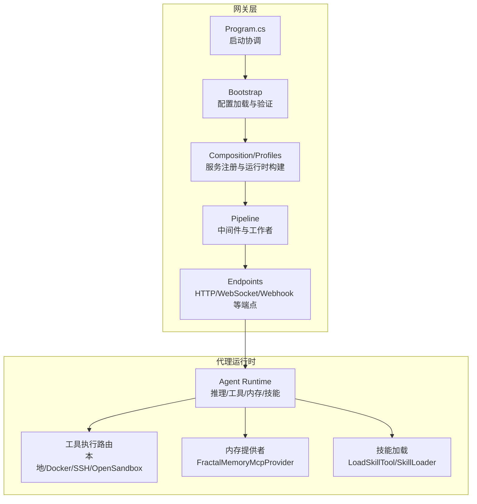
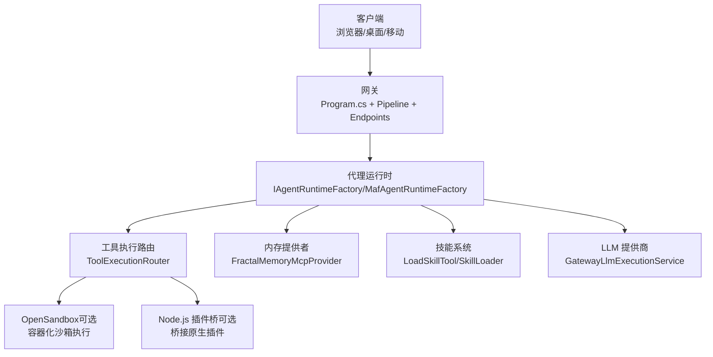
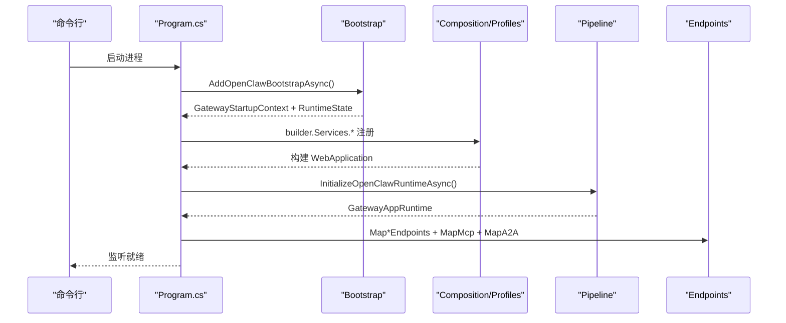
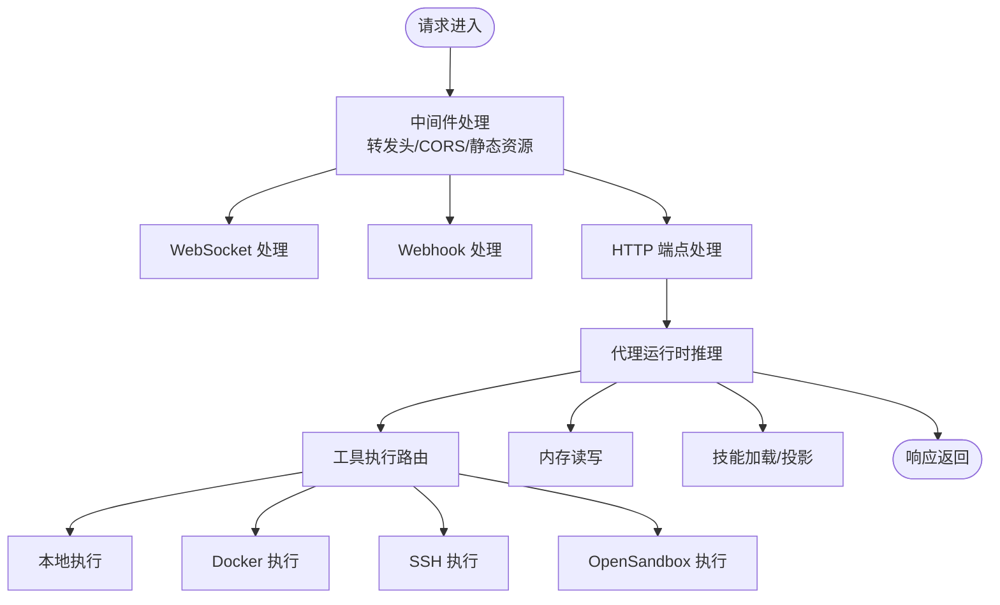
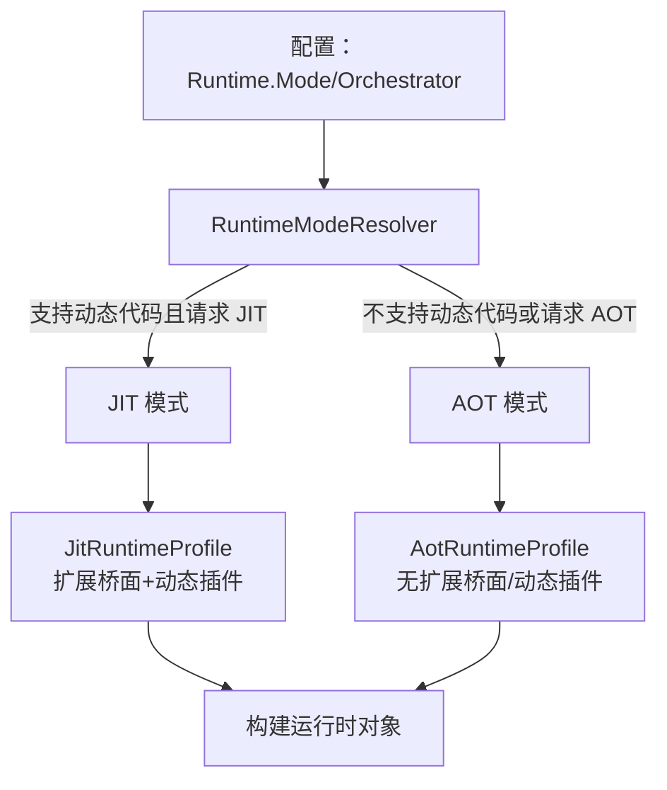
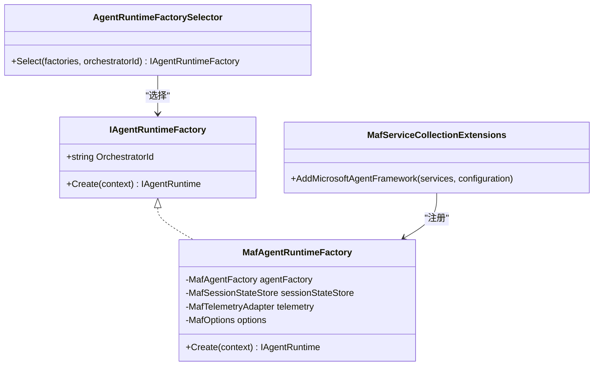
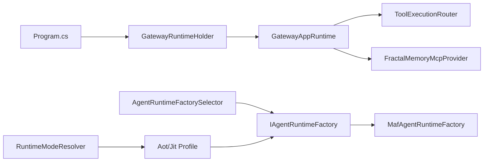

# 架构总览

<cite>
**本文引用的文件**
- [Program.cs](file://src/OpenClaw.Gateway/Program.cs)
- [GatewayBootstrapExtensions.cs](file://src/OpenClaw.Gateway/Bootstrap/GatewayBootstrapExtensions.cs)
- [PipelineExtensions.cs](file://src/OpenClaw.Gateway/Pipeline/PipelineExtensions.cs)
- [IAgentRuntimeFactory.cs](file://src/OpenClaw.Agent/IAgentRuntimeFactory.cs)
- [MafAgentRuntimeFactory.cs](file://src/OpenClaw.Agent/MafAgentRuntimeFactory.cs)
- [RuntimeModels.cs](file://src/OpenClaw.Core/Models/RuntimeModels.cs)
- [AotRuntimeProfile.cs](file://src/OpenClaw.Gateway/Profiles/AotRuntimeProfile.cs)
- [JitRuntimeProfile.cs](file://src/OpenClaw.Gateway/Profiles/JitRuntimeProfile.cs)
- [GatewayRuntimeHolder.cs](file://src/OpenClaw.Gateway/Mcp/GatewayRuntimeHolder.cs)
- [WebSocketEndpoints.cs](file://src/OpenClaw.Gateway/Endpoints/WebSocketEndpoints.cs)
- [WebhookEndpoints.cs](file://src/OpenClaw.Gateway/Endpoints/WebhookEndpoints.cs)
- [ToolExecutionRouter.cs](file://src/OpenClaw.Agent/Execution/ToolExecutionRouter.cs)
- [MafServiceCollectionExtensions.cs](file://src/OpenClaw.Agent/MafServiceCollectionExtensions.cs)
- [MafOptions.cs](file://src/OpenClaw.Agent/MafOptions.cs)
- [openclaw-gateway-startup-layers.md](file://docs/openclaw-gateway-startup-layers.md)
- [architecture-startup-refactor.md](file://docs/architecture-startup-refactor.md)
- [COMPATIBILITY.md](file://docs/CMPATIBILITY.md)
</cite>

## 目录
1. [引言](#引言)
2. [项目结构](#项目结构)
3. [核心组件](#核心组件)
4. [架构总览](#架构总览)
5. [详细组件分析](#详细组件分析)
6. [依赖关系分析](#依赖关系分析)
7. [性能考虑](#性能考虑)
8. [故障排除指南](#故障排除指南)
9. [结论](#结论)

## 引言
本文件面向 OpenClaw.NET 项目的架构总览，聚焦于启动流程的三层设计（Bootstrap/Composition/Pipeline）、运行时流程（网关处理 HTTP/WebSocket/webhook/auth/policy/observability 与代理运行时的推理、工具执行、内存交互、技能加载），以及双运行时模式（AOT/JIT）的设计理念与应用场景。同时阐述 Microsoft Agent Framework（MAF）可选集成与原生运行时的关系，帮助读者快速理解系统的整体设计与关键交互。

## 项目结构
OpenClaw.NET 采用“网关 + 代理运行时”的双运行时架构：
- 网关侧（Gateway）：负责配置加载与验证、服务注册与组合、中间件与端点映射、安全与可观测性等。
- 代理运行时（Agent Runtime）：负责推理、工具执行、内存交互、技能加载与治理策略。

启动流程分为三层：
- Bootstrap：加载配置、绑定 GatewayConfig、应用环境覆盖、解析运行时状态、早期退出（健康检查/医生模式）。
- Composition/Profiles：按运行时模式注册服务、构建运行时对象、保留 Core/Agent 运行时模型为 AOT/JIT 的唯一真相源。
- Pipeline/Endpoints：配置中间件、启动通道与工作者、映射路由与端点、启动监听。

**图示来源**
- [Program.cs:1-124](file://src/OpenClaw.Gateway/Program.cs#L1-L124)
- [GatewayBootstrapExtensions.cs:18-135](file://src/OpenClaw.Gateway/Bootstrap/GatewayBootstrapExtensions.cs#L18-L135)
- [PipelineExtensions.cs:18-86](file://src/OpenClaw.Gateway/Pipeline/PipelineExtensions.cs#L18-L86)

**章节来源**
- [openclaw-gateway-startup-layers.md:1-179](file://docs/openclaw-gateway-startup-layers.md#L1-L179)
- [architecture-startup-refactor.md:1-56](file://docs/architecture-startup-refactor.md#L1-L56)

## 核心组件
- 启动协调器：Program.cs 统筹三层流程，包含健康检查、医生模式、快速启动恢复与异常恢复循环。
- 引导层：GatewayBootstrapExtensions 负责配置加载、校验、运行时状态解析、早期退出与安全加固。
- 运行时构建：IAgentRuntimeFactory 与 MafAgentRuntimeFactory 提供编排器选择与 MAF 可选集成。
- 运行时模式：RuntimeModels 定义 AOT/JIT 模式与 Orchestrator（native/maf）选择。
- 管道与端点：PipelineExtensions 配置中间件、CORS、WebSocket、通道适配器；Endpoints 映射 HTTP/WebSocket/Webhook。
- 工具执行：ToolExecutionRouter 路由工具到本地/Docker/SSH/OpenSandbox 执行后端。
- MAF 集成：MafServiceCollectionExtensions/MafOptions 注册 MAF 运行时工厂与选项。

**章节来源**
- [Program.cs:14-124](file://src/OpenClaw.Gateway/Program.cs#L14-L124)
- [GatewayBootstrapExtensions.cs:18-135](file://src/OpenClaw.Gateway/Bootstrap/GatewayBootstrapExtensions.cs#L18-L135)
- [IAgentRuntimeFactory.cs:10-65](file://src/OpenClaw.Agent/IAgentRuntimeFactory.cs#L10-L65)
- [MafAgentRuntimeFactory.cs:9-166](file://src/OpenClaw.Agent/MafAgentRuntimeFactory.cs#L9-L166)
- [RuntimeModels.cs:5-69](file://src/OpenClaw.Core/Models/RuntimeModels.cs#L5-L69)
- [PipelineExtensions.cs:18-86](file://src/OpenClaw.Gateway/Pipeline/PipelineExtensions.cs#L18-L86)
- [ToolExecutionRouter.cs:7-253](file://src/OpenClaw.Agent/Execution/ToolExecutionRouter.cs#L7-L253)
- [MafServiceCollectionExtensions.cs:9-20](file://src/OpenClaw.Agent/MafServiceCollectionExtensions.cs#L9-L20)
- [MafOptions.cs:3-35](file://src/OpenClaw.Agent/MafOptions.cs#L3-L35)

## 架构总览
本节以系统视角展示客户端、网关、代理运行时、工具、内存、LLM 提供商、Node.js 插件桥之间的关系。

**图示来源**
- [Program.cs:47-96](file://src/OpenClaw.Gateway/Program.cs#L47-L96)
- [ToolExecutionRouter.cs:20-63](file://src/OpenClaw.Agent/Execution/ToolExecutionRouter.cs#L20-L63)
- [MafAgentRuntimeFactory.cs:33-72](file://src/OpenClaw.Agent/MafAgentRuntimeFactory.cs#L33-L72)

## 详细组件分析

### 启动流程三阶段
- Bootstrap（配置加载与验证）
  - 加载配置文件与环境变量覆盖，解析运行时状态（AOT/JIT），执行健康检查与医生模式，进行安全加固（非回环绑定需鉴权令牌）。
- Composition（服务注册与组合）
  - 分组注册核心服务、通道、工具、后端、安全、MCP、A2A、运行时配置文件等；根据运行时模式应用 Profile。
- Pipeline（中间件与端点）
  - 配置转发头、CORS、静态资源、WebSocket、通道适配器启动、工作者启动、就绪报告。

**图示来源**
- [Program.cs:47-96](file://src/OpenClaw.Gateway/Program.cs#L47-L96)
- [GatewayBootstrapExtensions.cs:18-135](file://src/OpenClaw.Gateway/Bootstrap/GatewayBootstrapExtensions.cs#L18-L135)
- [openclaw-gateway-startup-layers.md:25-179](file://docs/openclaw-gateway-startup-layers.md#L25-L179)

**章节来源**
- [Program.cs:47-96](file://src/OpenClaw.Gateway/Program.cs#L47-L96)
- [GatewayBootstrapExtensions.cs:18-135](file://src/OpenClaw.Gateway/Bootstrap/GatewayBootstrapExtensions.cs#L18-L135)
- [openclaw-gateway-startup-layers.md:25-179](file://docs/openclaw-gateway-startup-layers.md#L25-L179)
- [architecture-startup-refactor.md:5-56](file://docs/architecture-startup-refactor.md#L5-L56)

### 运行时流程：网关处理与代理运行时
- 网关处理
  - 中间件：转发头、CORS、静态资源、WebSocket、通道适配器。
  - 端点：HTTP、WebSocket、Webhook、A2A、MCP、管理端点等。
- 代理运行时
  - 推理：通过 IAgentRuntimeFactory/MafAgentRuntimeFactory 创建运行时实例。
  - 工具执行：ToolExecutionRouter 将工具请求路由到本地/容器/SSH/OpenSandbox 后端。
  - 内存交互：通过 FractalMemoryMcpProvider 与内存提供者交互。
  - 技能加载：按需加载技能指令与资源，支持热重载。

**图示来源**
- [PipelineExtensions.cs:18-86](file://src/OpenClaw.Gateway/Pipeline/PipelineExtensions.cs#L18-L86)
- [WebSocketEndpoints.cs:13-37](file://src/OpenClaw.Gateway/Endpoints/WebSocketEndpoints.cs#L13-L37)
- [WebhookEndpoints.cs:14-38](file://src/OpenClaw.Gateway/Endpoints/WebhookEndpoints.cs#L14-L38)
- [ToolExecutionRouter.cs:114-157](file://src/OpenClaw.Agent/Execution/ToolExecutionRouter.cs#L114-L157)

**章节来源**
- [PipelineExtensions.cs:18-86](file://src/OpenClaw.Gateway/Pipeline/PipelineExtensions.cs#L18-L86)
- [WebSocketEndpoints.cs:13-37](file://src/OpenClaw.Gateway/Endpoints/WebSocketEndpoints.cs#L13-L37)
- [WebhookEndpoints.cs:14-38](file://src/OpenClaw.Gateway/Endpoints/WebhookEndpoints.cs#L14-L38)
- [ToolExecutionRouter.cs:114-157](file://src/OpenClaw.Agent/Execution/ToolExecutionRouter.cs#L114-L157)

### 双运行时模式（AOT/JIT）设计理念与场景
- 模式选择
  - auto：在支持动态代码时选择 JIT，在不支持时回退到 AOT。
  - aot：严格低内存兼容路径，适合裁剪/原生部署。
  - jit：扩展兼容路径，支持原生动态插件与更广的工具生态。
- 运行时能力
  - AOT：不支持扩展桥面与原生动态插件。
  - JIT：支持扩展桥面与原生动态插件。
- 配置来源
  - RuntimeConfig.Mode 与 RuntimeConfig.Orchestrator 控制模式与编排器（native/maf）。

**图示来源**
- [RuntimeModels.cs:29-59](file://src/OpenClaw.Core/Models/RuntimeModels.cs#L29-L59)
- [AotRuntimeProfile.cs:7-21](file://src/OpenClaw.Gateway/Profiles/AotRuntimeProfile.cs#L7-L21)
- [JitRuntimeProfile.cs:7-21](file://src/OpenClaw.Gateway/Profiles/JitRuntimeProfile.cs#L7-L21)

**章节来源**
- [RuntimeModels.cs:5-69](file://src/OpenClaw.Core/Models/RuntimeModels.cs#L5-L69)
- [COMPATIBILITY.md:1-9](file://docs/CMPATIBILITY.md#L1-L9)
- [AotRuntimeProfile.cs:7-21](file://src/OpenClaw.Gateway/Profiles/AotRuntimeProfile.cs#L7-L21)
- [JitRuntimeProfile.cs:7-21](file://src/OpenClaw.Gateway/Profiles/JitRuntimeProfile.cs#L7-L21)

### MAF（Microsoft Agent Framework）可选集成与原生运行时
- 集成方式
  - 通过 MafServiceCollectionExtensions 注册 MAF 选项、会话状态存储、代理工厂与运行时工厂。
  - MafAgentRuntimeFactory 基于上下文创建 MAF 运行时，支持委托工具与多配置派生。
- 选择策略
  - AgentRuntimeFactorySelector 根据 OrchestratorId 选择工厂；默认 native，选择 maf 需要包含 MAF 适配器的构建。
- 配置模型
  - 支持 native/maf 编排器与 aot/jit 模式组合，选择 maf 但未构建适配器将快速失败并给出明确提示。

**图示来源**
- [IAgentRuntimeFactory.cs:40-65](file://src/OpenClaw.Agent/IAgentRuntimeFactory.cs#L40-L65)
- [MafAgentRuntimeFactory.cs:9-166](file://src/OpenClaw.Agent/MafAgentRuntimeFactory.cs#L9-L166)
- [MafServiceCollectionExtensions.cs:9-20](file://src/OpenClaw.Agent/MafServiceCollectionExtensions.cs#L9-L20)

**章节来源**
- [MafServiceCollectionExtensions.cs:9-20](file://src/OpenClaw.Agent/MafServiceCollectionExtensions.cs#L9-L20)
- [MafAgentRuntimeFactory.cs:9-166](file://src/OpenClaw.Agent/MafAgentRuntimeFactory.cs#L9-L166)
- [IAgentRuntimeFactory.cs:40-65](file://src/OpenClaw.Agent/IAgentRuntimeFactory.cs#L40-L65)
- [MafOptions.cs:3-35](file://src/OpenClaw.Agent/MafOptions.cs#L3-L35)

## 依赖关系分析
- 网关启动对运行时的依赖
  - Program.cs 在构建完成后调用 InitializeOpenClawRuntimeAsync，生成 GatewayAppRuntime 并通过 GatewayRuntimeHolder 暴露给 MCP/A2A/端点。
- 运行时对工具与内存的依赖
  - ToolExecutionRouter 依赖 GatewayConfig 与执行后端配置，按工具与沙箱策略路由到本地/容器/SSH/OpenSandbox。
  - 内存通过 FractalMemoryMcpProvider 与代理运行时交互。
- 编排器与运行时模式耦合
  - AgentRuntimeFactorySelector 与 RuntimeModeResolver 共同决定运行时实现与能力边界。

**图示来源**
- [Program.cs:83-85](file://src/OpenClaw.Gateway/Program.cs#L83-L85)
- [GatewayRuntimeHolder.cs:10-20](file://src/OpenClaw.Gateway/Mcp/GatewayRuntimeHolder.cs#L10-L20)
- [ToolExecutionRouter.cs:20-63](file://src/OpenClaw.Agent/Execution/ToolExecutionRouter.cs#L20-L63)
- [IAgentRuntimeFactory.cs:47-65](file://src/OpenClaw.Agent/IAgentRuntimeFactory.cs#L47-L65)
- [RuntimeModels.cs:29-59](file://src/OpenClaw.Core/Models/RuntimeModels.cs#L29-L59)

**章节来源**
- [Program.cs:83-85](file://src/OpenClaw.Gateway/Program.cs#L83-L85)
- [GatewayRuntimeHolder.cs:10-20](file://src/OpenClaw.Gateway/Mcp/GatewayRuntimeHolder.cs#L10-L20)
- [ToolExecutionRouter.cs:20-63](file://src/OpenClaw.Agent/Execution/ToolExecutionRouter.cs#L20-L63)
- [IAgentRuntimeFactory.cs:47-65](file://src/OpenClaw.Agent/IAgentRuntimeFactory.cs#L47-L65)
- [RuntimeModels.cs:29-59](file://src/OpenClaw.Core/Models/RuntimeModels.cs#L29-L59)

## 性能考虑
- AOT 模式强调裁剪与低内存占用，适合生产部署与边缘场景。
- JIT 模式提供更广的兼容性与动态能力，适合开发与需要原生动态插件的场景。
- 工具执行后端的选择与回退策略影响延迟与可靠性，应结合业务需求配置默认后端与沙箱策略。
- 中间件与通道启动数量与并发限制需与硬件资源匹配，避免过载。

## 故障排除指南
- 启动失败
  - 使用 --health-check 快速验证监听与鉴权设置。
  - 使用 --doctor 获取诊断输出，定位配置与能力问题。
- 非回环绑定安全
  - 绑定到非回环地址时必须设置 OPENCLAW_AUTH_TOKEN，否则引导层直接拒绝。
- 运行时模式错误
  - 请求 JIT 但当前构建不支持动态代码时抛出异常；请切换到 AOT 或使用 JIT 构建。
- MAF 未启用
  - 选择 maf 编排器但未包含 MAF 适配器构建时，启动即失败并提示明确信息。

**章节来源**
- [GatewayBootstrapExtensions.cs:38-121](file://src/OpenClaw.Gateway/Bootstrap/GatewayBootstrapExtensions.cs#L38-L121)
- [RuntimeModels.cs:36-40](file://src/OpenClaw.Core/Models/RuntimeModels.cs#L36-L40)
- [IAgentRuntimeFactory.cs:60-64](file://src/OpenClaw.Agent/IAgentRuntimeFactory.cs#L60-L64)

## 结论
OpenClaw.NET 通过三层启动流程与双运行时模式，实现了从配置到运行时的清晰分层与灵活部署。网关侧专注于安全、可观测性与端点管理，代理运行时专注推理与工具执行。MAF 可选集成提供了与原生运行时并行的编排器选择，满足不同场景下的功能与性能诉求。配合 AOT/JIT 的能力边界与诊断工具，系统在生产与开发环境中均具备良好的可维护性与可扩展性。