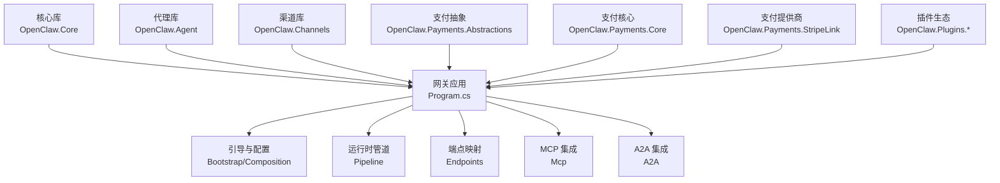
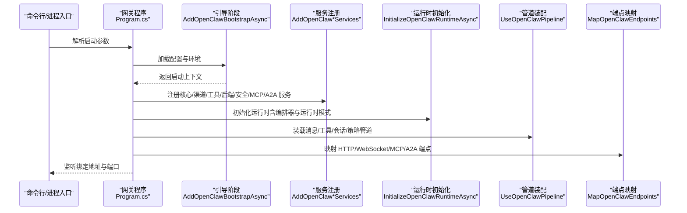
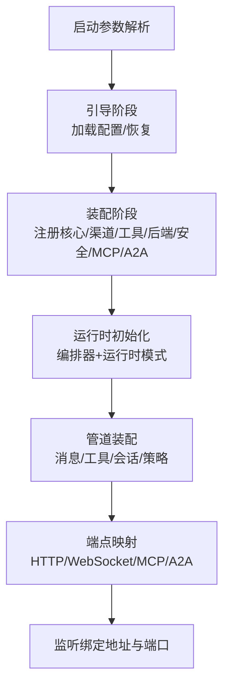
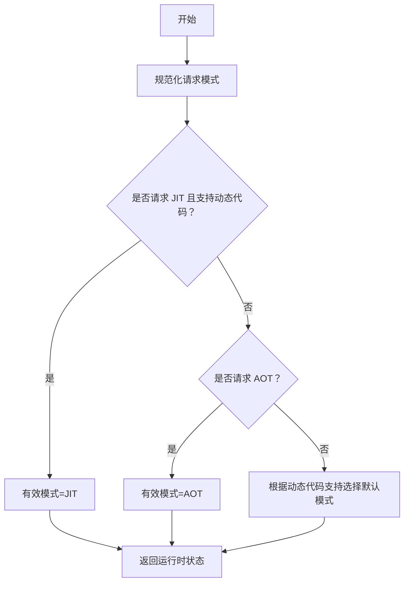
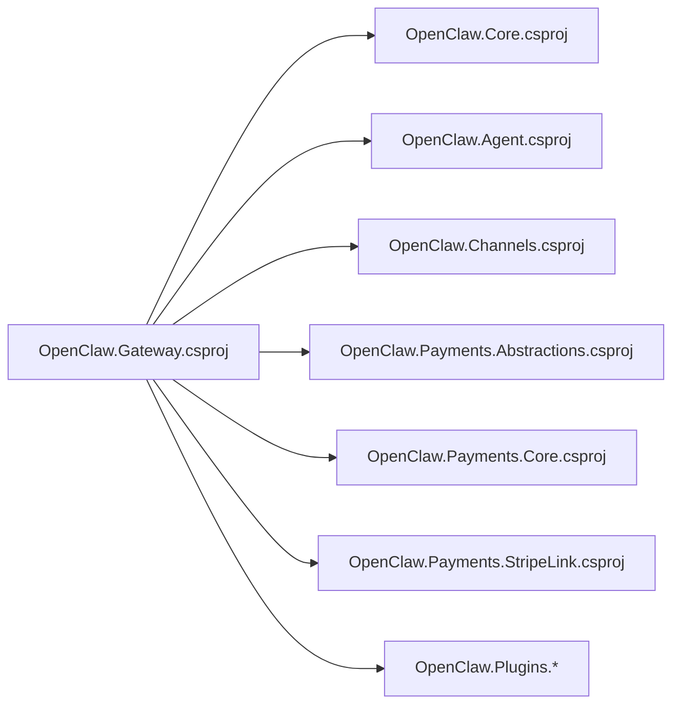
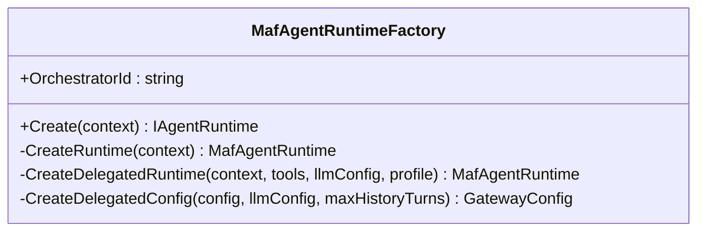
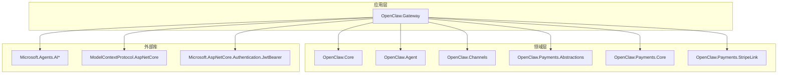

# 架构设计理念

<cite>
**本文引用的文件**
- [Program.cs](file://src/OpenClaw.Gateway/Program.cs)
- [MafAgentRuntimeFactory.cs](file://src/OpenClaw.Agent/MafAgentRuntimeFactory.cs)
- [OpenClaw.Core.csproj](file://src/OpenClaw.Core/OpenClaw.Core.csproj)
- [OpenClaw.Gateway.csproj](file://src/OpenClaw.Gateway/OpenClaw.Gateway.csproj)
- [RuntimeModels.cs](file://src/OpenClaw.Core/Models/RuntimeModels.cs)
</cite>

## 目录
1. [引言](#引言)
2. [项目结构](#项目结构)
3. [核心组件](#核心组件)
4. [架构总览](#架构总览)
5. [详细组件分析](#详细组件分析)
6. [依赖关系分析](#依赖关系分析)
7. [性能考量](#性能考量)
8. [故障排查指南](#故障排查指南)
9. [结论](#结论)
10. [附录](#附录)

## 引言
本文件系统化阐述 OpenClaw.NET 的架构设计理念与实现方式，重点覆盖以下主题：
- 分层架构设计与模块化组织
- 依赖注入与服务组合机制
- 启动流程三阶段（Bootstrap/Composition/Profiles/Pipeline）
- 运行时模型双车道设计（AOT/JIT）与可选编排器（Native/MAF）
- 权衡取舍：性能 vs. 兼容性、安全性 vs. 易用性
- 组件交互与可视化图示，帮助开发者快速理解整体设计

## 项目结构
OpenClaw.NET 采用多项目分层与模块化组织，核心模块包括：
- 核心层（OpenClaw.Core）：抽象、模型、安全、内存与通用能力
- 网关层（OpenClaw.Gateway）：HTTP/WebSocket/MCP/A2A 端点、启动与管道装配
- 代理层（OpenClaw.Agent）：智能体运行时工厂与工具适配
- 渠道层（OpenClaw.Channels）：消息渠道桥接与适配
- 支付与插件生态：支付抽象与插件扩展
- 前端与仪表盘：配套 UI 资产与静态资源集成

**图表来源**
- [Program.cs:14-96](file://src/OpenClaw.Gateway/Program.cs#L14-L96)
- [OpenClaw.Gateway.csproj:26-34](file://src/OpenClaw.Gateway/OpenClaw.Gateway.csproj#L26-L34)

**章节来源**
- [Program.cs:14-96](file://src/OpenClaw.Gateway/Program.cs#L14-L96)
- [OpenClaw.Gateway.csproj:26-34](file://src/OpenClaw.Gateway/OpenClaw.Gateway.csproj#L26-L34)

## 核心组件
- 网关启动与生命周期管理：负责解析启动参数、加载配置、构建服务容器、初始化运行时、挂载中间件与端点，并在启动失败时进行交互式恢复。
- 智能体运行时工厂：根据配置选择原生或委托工具链，结合 MAF 编排器能力，生成可复用的运行时实例。
- 运行时模式解析：统一处理 AOT/JIT 与编排器选择，确保在不同运行环境下做出合理决策。

**章节来源**
- [Program.cs:14-96](file://src/OpenClaw.Gateway/Program.cs#L14-L96)
- [MafAgentRuntimeFactory.cs:9-166](file://src/OpenClaw.Agent/MafAgentRuntimeFactory.cs#L9-L166)
- [RuntimeModels.cs:29-59](file://src/OpenClaw.Core/Models/RuntimeModels.cs#L29-L59)

## 架构总览
OpenClaw.NET 采用“引导—装配—配置—管道”的启动流水线，配合“AOT/JIT 双车道”与“原生/MAF 编排器”两条运行路径，形成高内聚、低耦合、可演进的分层架构。

**图表来源**
- [Program.cs:53-91](file://src/OpenClaw.Gateway/Program.cs#L53-L91)

## 详细组件分析

### 启动流程三阶段
- 引导（Bootstrap）：解析启动参数、加载配置、检测快速启动与交互式恢复，产出启动上下文。
- 装配（Composition）：按模块注册服务，包括核心服务、渠道、工具、后端、安全、MCP、A2A 等。
- 配置与管道（Profiles/Pipeline）：应用运行时配置文件与运行时模式，初始化运行时并装配消息/工具/会话/策略管道，最后映射端点。

**图表来源**
- [Program.cs:53-96](file://src/OpenClaw.Gateway/Program.cs#L53-L96)

**章节来源**
- [Program.cs:53-96](file://src/OpenClaw.Gateway/Program.cs#L53-L96)

### 运行时模型双车道设计（AOT/JIT）
- 运行时模式由配置决定，支持 auto/aot/jit；若请求 JIT 但当前产物不支持动态代码，则抛出异常。
- 在不支持动态代码的环境中，自动回退到 AOT 模式；否则优先 JIT。
- 运行时状态包含请求模式、有效模式与动态代码支持能力，便于诊断与日志输出。

**图表来源**
- [RuntimeModels.cs:29-59](file://src/OpenClaw.Core/Models/RuntimeModels.cs#L29-L59)

**章节来源**
- [RuntimeModels.cs:29-59](file://src/OpenClaw.Core/Models/RuntimeModels.cs#L29-L59)

### 服务注册与组合机制
- 通过扩展方法集中注册各子域服务，确保模块边界清晰、职责单一。
- 项目级引用与打包策略明确各模块的依赖关系与可见性，避免循环依赖与过度耦合。

**图表来源**
- [OpenClaw.Gateway.csproj:26-34](file://src/OpenClaw.Gateway/OpenClaw.Gateway.csproj#L26-L34)
- [OpenClaw.Core.csproj:1-24](file://src/OpenClaw.Core/OpenClaw.Core.csproj#L1-L24)

**章节来源**
- [OpenClaw.Gateway.csproj:26-34](file://src/OpenClaw.Gateway/OpenClaw.Gateway.csproj#L26-L34)
- [OpenClaw.Core.csproj:1-24](file://src/OpenClaw.Core/OpenClaw.Core.csproj#L1-L24)

### 智能体运行时工厂与编排器选择
- 工厂根据配置决定是否启用委托工具链与 MAF 编排器，统一创建运行时实例。
- 支持为委托场景构造专用配置（如历史轮次限制），保证运行时一致性与可测试性。

**图表来源**
- [MafAgentRuntimeFactory.cs:9-166](file://src/OpenClaw.Agent/MafAgentRuntimeFactory.cs#L9-L166)

**章节来源**
- [MafAgentRuntimeFactory.cs:9-166](file://src/OpenClaw.Agent/MafAgentRuntimeFactory.cs#L9-L166)

## 依赖关系分析
- 网关应用对核心库、代理库、渠道库以及支付相关模块存在直接依赖，体现“上层应用聚合底层能力”的分层思想。
- 核心库声明 AOT 友好特性，确保在 AOT 场景下的可用性与可移植性。
- 项目级构建属性控制 AOT 发布优化、裁剪与符号剥离，兼顾体积与运行效率。

**图表来源**
- [OpenClaw.Gateway.csproj:26-68](file://src/OpenClaw.Gateway/OpenClaw.Gateway.csproj#L26-L68)
- [OpenClaw.Core.csproj:1-24](file://src/OpenClaw.Core/OpenClaw.Core.csproj#L1-L24)

**章节来源**
- [OpenClaw.Gateway.csproj:26-68](file://src/OpenClaw.Gateway/OpenClaw.Gateway.csproj#L26-L68)
- [OpenClaw.Core.csproj:1-24](file://src/OpenClaw.Core/OpenClaw.Core.csproj#L1-L24)

## 性能考量
- AOT 发布优化：通过裁剪、去符号、最小化二进制体积，降低部署与启动开销，适合边缘与容器环境。
- JIT 动态代码：在支持动态代码的环境中优先 JIT，以获得更好的运行时性能与灵活性。
- 运行时模式自适应：在不支持动态代码的产物中自动回退至 AOT，避免运行时崩溃。
- 服务注册与管道装配：集中式注册减少重复初始化成本，管道按需装配降低热路径负担。

[本节为通用指导，无需列出具体文件来源]

## 故障排查指南
- 启动失败恢复：在未进入运行态前捕获异常，尝试交互式恢复或记录诊断信息，必要时退出并提示用户。
- 快速启动：支持快速启动流程，若恢复成功则直接进入运行态。
- 运行时模式错误：当请求 JIT 但产物不支持动态代码时，抛出明确异常，提示用户切换到 AOT 或使用兼容构建。

**章节来源**
- [Program.cs:99-122](file://src/OpenClaw.Gateway/Program.cs#L99-L122)
- [RuntimeModels.cs:36-40](file://src/OpenClaw.Core/Models/RuntimeModels.cs#L36-L40)

## 结论
OpenClaw.NET 通过分层架构、模块化组织与依赖注入，实现了高内聚、低耦合的系统设计；借助启动三阶段与双车道运行时模型，兼顾了性能与兼容性；通过服务注册与组合机制，使功能扩展与演进更加可控。该架构在保障安全性的同时，提供了灵活的运行时选择与强大的生态扩展能力。

[本节为总结性内容，无需列出具体文件来源]

## 附录
- 关键实现参考路径
  - 启动与恢复：[Program.cs:14-122](file://src/OpenClaw.Gateway/Program.cs#L14-L122)
  - 运行时模式解析：[RuntimeModels.cs:29-59](file://src/OpenClaw.Core/Models/RuntimeModels.cs#L29-L59)
  - 代理运行时工厂：[MafAgentRuntimeFactory.cs:9-166](file://src/OpenClaw.Agent/MafAgentRuntimeFactory.cs#L9-L166)
  - 项目依赖与发布配置：[OpenClaw.Gateway.csproj:26-71](file://src/OpenClaw.Gateway/OpenClaw.Gateway.csproj#L26-L71)，[OpenClaw.Core.csproj:1-24](file://src/OpenClaw.Core/OpenClaw.Core.csproj#L1-L24)