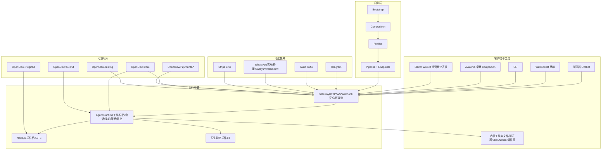
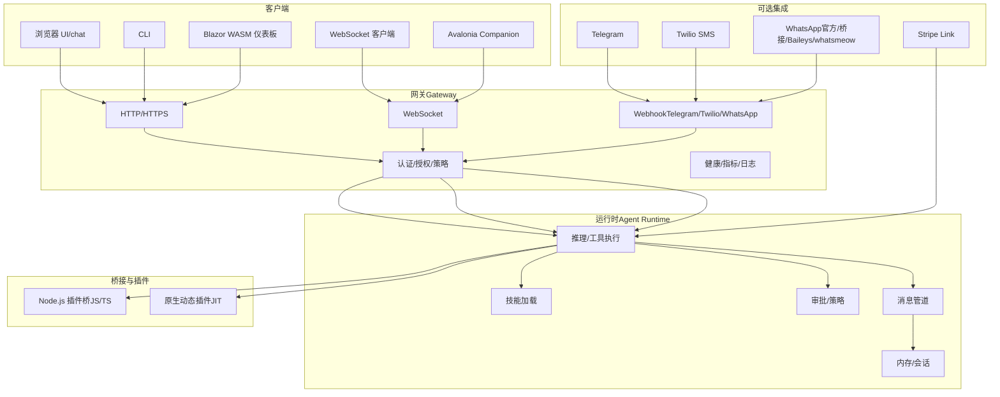
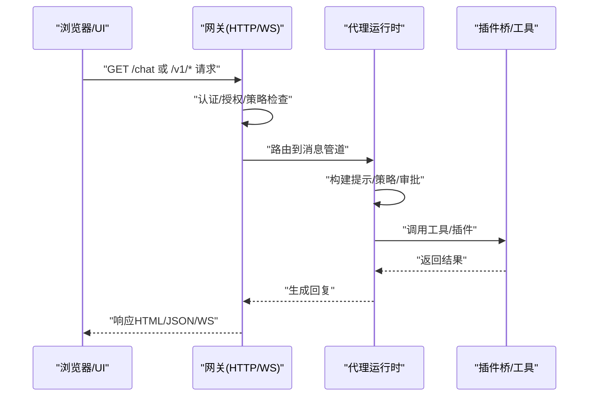
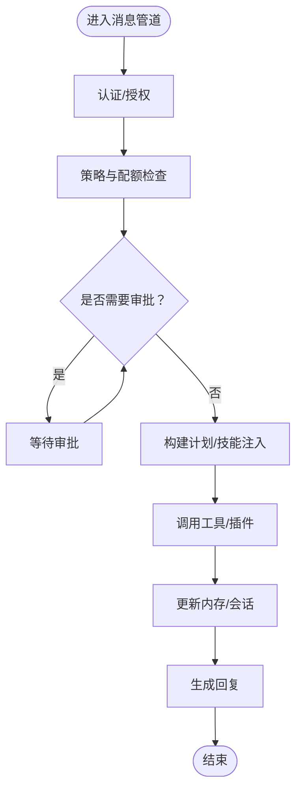
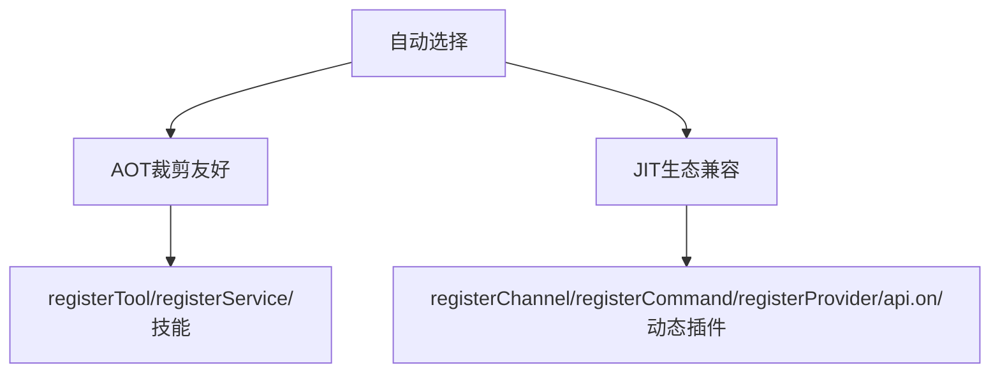
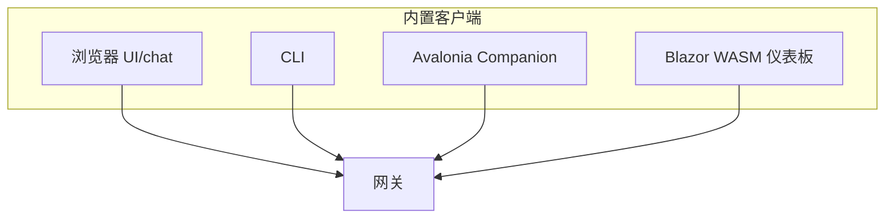
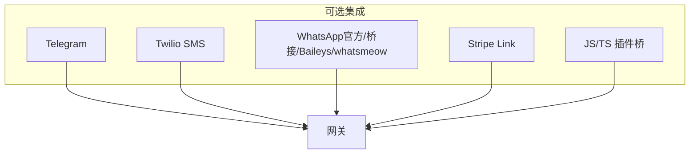
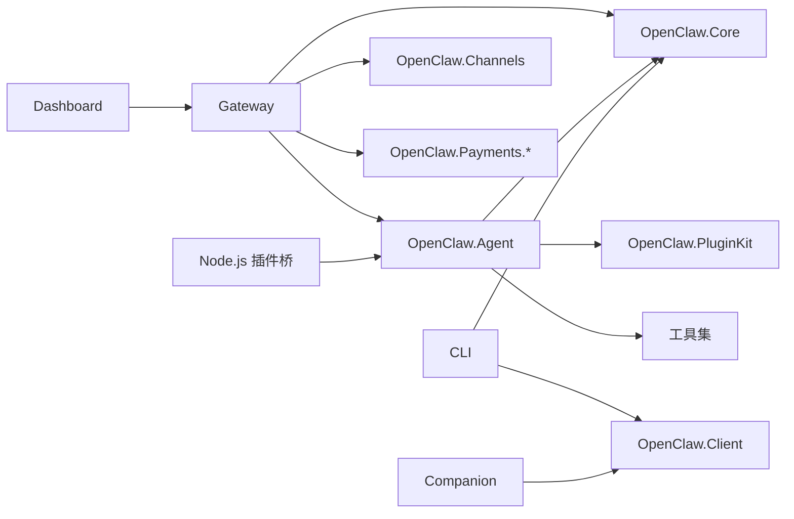

# 核心功能特性

<cite>
**本文引用的文件**
- [README.md](file://README.md)
- [QUICKSTART.md](file://QUICKSTART.md)
- [COMPATIBILITY.md](file://COMPATIBILITY.md)
- [docs/COMPATIBILITY.md](file://docs/COMPATIBILITY.md)
- [docs/USER_GUIDE.md](file://docs/USER_GUIDE.md)
- [docs/WHATSAPP_SETUP.md](file://docs/WHATSAPP_SETUP.md)
- [src/OpenClaw.Gateway/OpenClaw.Gateway.csproj](file://src/OpenClaw.Gateway/OpenClaw.Gateway.csproj)
- [src/OpenClaw.Agent/OpenClaw.Agent.csproj](file://src/OpenClaw.Agent/OpenClaw.Agent.csproj)
- [src/OpenClaw.Core/OpenClaw.Core.csproj](file://src/OpenClaw.Core/OpenClaw.Core.csproj)
- [src/OpenClaw.Cli/OpenClaw.Cli.csproj](file://src/OpenClaw.Cli/OpenClaw.Cli.csproj)
- [src/OpenClaw.Companion/OpenClaw.Companion.csproj](file://src/OpenClaw.Companion/OpenClaw.Companion.csproj)
- [src/OpenClaw.Dashboard/OpenClaw.Dashboard.csproj](file://src/OpenClaw.Dashboard/OpenClaw.Dashboard.csproj)
- [src/OpenClaw.PluginKit/OpenClaw.PluginKit.csproj](file://src/OpenClaw.PluginKit/OpenClaw.PluginKit.csproj)
- [src/OpenClaw.SkillKit/OpenClaw.SkillKit.csproj](file://src/OpenClaw.SkillKit/OpenClaw.SkillKit.csproj)
</cite>

## 目录
1. [简介](#简介)
2. [项目结构](#项目结构)
3. [核心组件](#核心组件)
4. [架构总览](#架构总览)
5. [详细组件分析](#详细组件分析)
6. [依赖关系分析](#依赖关系分析)
7. [性能考量](#性能考量)
8. [故障排查指南](#故障排查指南)
9. [结论](#结论)
10. [附录](#附录)

## 简介
本文件面向 OpenClaw.NET 的核心功能特性，系统化阐述以下能力与价值主张：
- 网关表面：HTTP、WebSocket、浏览器 UI、webhook、OpenAI 兼容端点
- 代理运行时：工具、内存、会话、技能、策略、审批、消息管道执行
- 双运行时模式：trim-safe AOT 与更广兼容性 JIT
- 内置客户端：浏览器 UI、CLI、Avalonia 桌面 companion、Blazor WASM 运营商仪表板
- 可重用库包：OpenClaw.Core、OpenClaw.PluginKit、OpenClaw.SkillKit、OpenClaw.Payments.*、OpenClaw.Testing
- 可选集成：Telegram、Twilio SMS、WhatsApp（含 Baileys 工人）、Stripe Link、JS/TS 插件桥接

这些能力共同构成一个“.NET 原生、兼顾生产部署与生态兼容”的智能体基础设施。

章节来源
- [README.md:31-40](file://README.md#L31-L40)
- [README.md:145-197](file://README.md#L145-L197)

## 项目结构
从功能维度看，代码库采用“分层+模块化”组织方式：
- 启动与组合层：Bootstrap/Composition/Profiles/Pipeline/Endpoints
- 运行时层：Gateway（网关）与 Agent（代理运行时）
- 客户端与工具层：Browser UI、CLI、Avalonia Companion、Dashboard、内置工具集
- 可重用库：OpenClaw.Core、PluginKit、SkillKit、Payments.*、Testing
- 可选集成：Telegram、Twilio、WhatsApp（含 Baileys/whatsmeow）、Stripe Link、JS/TS 插件桥

图示来源
- [README.md:147-188](file://README.md#L147-L188)

章节来源
- [README.md:145-197](file://README.md#L145-L197)

## 核心组件
- 网关表面（Gateway Surfaces）
  - HTTP：健康检查、指标、管理与运营接口、OpenAI 兼容端点
  - WebSocket：实时对话与事件推送
  - 浏览器 UI：内置聊天界面与诊断按钮
  - Webhook：Telegram、Twilio、WhatsApp 等通道入站
  - OpenAI 兼容端点：统一的 v1/* 接口，便于生态迁移
  - 优势：统一入口、安全可控、可观测、易于集成第三方前端
  - 使用场景：快速试用、内网调试、与现有前端或自动化系统对接

- 代理运行时（Agent Runtime）
  - 工具：文件读写、Shell、浏览器、Git、Notion、Home Assistant、MQTT、邮件等
  - 内存：会话历史、分支、保留与归档
  - 会话：多路并发、速率限制、配额控制
  - 技能：SKILL.md 形态的可复用指令包
  - 策略与审批：工具调用审批、白名单/黑名单、监督模式
  - 消息管道：中间件、限流、令牌预算、错误处理
  - 优势：认知循环清晰、可审计、可扩展、可沙箱化
  - 使用场景：复杂任务编排、跨系统自动化、合规与风控

- 双运行时模式（Two Runtime Modes）
  - AOT：裁剪友好、二进制小、内存占用低，适合主流部署
  - JIT：支持 registerChannel/registerCommand/registerProvider/api.on 等动态桥接与原生动态插件
  - 自动选择：根据运行环境自动在 AOT/JIT 间切换
  - 优势：兼顾生产稳定性与生态兼容性
  - 使用场景：生产优先的容器/裸机部署（AOT），需要桥接或动态插件（JIT）

- 内置客户端（Built-in Clients）
  - 浏览器 UI：/chat 聊天与诊断
  - CLI：命令行交互与脚本化
  - Avalonia 桌面 Companion：桌面端体验与通知
  - Blazor WASM 运营商仪表板：运营态监控与管理
  - 优势：开箱即用、无需额外前端工程
  - 使用场景：本地开发、演示、轻量运营

- 可重用库包（Reusable Library Packages）
  - OpenClaw.Core：抽象、模型、验证、安全、内存基元
  - OpenClaw.PluginKit：插件抽象与辅助类型
  - OpenClaw.SkillKit：技能打包、模板渲染、校验与运行规划
  - OpenClaw.Payments.*：支付抽象、策略、敏感数据脱敏、审计
  - OpenClaw.Testing：回归与场景化测试框架
  - 优势：模块化、可复用、降低上层实现成本
  - 使用场景：二次开发、插件生态、支付集成、质量保障

- 可选集成（Optional Integrations）
  - Telegram：机器人 Webhook
  - Twilio SMS：短信收发与签名验证
  - WhatsApp：官方云 API 或 Baileys/whatsmeow 桥接
  - Stripe Link：支付链接
  - JS/TS 插件桥接：通过 Node.js 桥承载生态插件
  - 优势：生态兼容、即插即用、可按需启用
  - 使用场景：多渠道客服、自动化通知、支付闭环

章节来源
- [README.md:31-40](file://README.md#L31-L40)
- [README.md:145-197](file://README.md#L145-L197)
- [docs/USER_GUIDE.md:1-123](file://docs/USER_GUIDE.md#L1-L123)
- [docs/USER_GUIDE.md:265-318](file://docs/USER_GUIDE.md#L265-L318)
- [docs/WHATSAPP_SETUP.md:1-207](file://docs/WHATSAPP_SETUP.md#L1-L207)
- [COMPATIBILITY.md:11-30](file://COMPATIBILITY.md#L11-L30)
- [docs/COMPATIBILITY.md:11-30](file://docs/COMPATIBILITY.md#L11-L30)

## 架构总览
下图展示从客户端到网关、再到代理运行时与工具/插件的总体交互路径，并标注了 AOT/JIT 的能力边界与可选集成位置。

图示来源
- [README.md:147-188](file://README.md#L147-L188)

章节来源
- [README.md:145-197](file://README.md#L145-L197)

## 详细组件分析

### 网关表面（HTTP/WebSocket/Browser UI/Webhook/OpenAI 兼容端点）
- HTTP
  - 提供 /health、/metrics、/doctor、/admin/* 等管理与运营接口
  - OpenAI 兼容端点统一接入，便于替换与迁移
  - 优势：统一入口、便于运维与监控
  - 使用场景：容器编排、反向代理、CI/CD 集成

- WebSocket
  - 支持原始文本与 JSON 封装两种协议
  - 适用于实时对话、事件推送与前端长连接
  - 优势：低延迟、状态保持
  - 使用场景：浏览器 UI、桌面应用、实时告警

- 浏览器 UI（/chat）
  - 内置聊天界面与诊断按钮，支持查询令牌与记住登录
  - 优势：零前端工程、即开即用
  - 使用场景：本地调试、演示、非技术用户

- Webhook
  - Telegram、Twilio SMS、WhatsApp（官方/桥接）等通道入站
  - 支持请求体大小限制与签名验证
  - 优势：无服务器化、事件驱动
  - 使用场景：多渠道客服、自动化通知

- OpenAI 兼容端点
  - v1/* 统一接口，便于生态迁移
  - 优势：降低迁移成本
  - 使用场景：已有前端或 SDK 生态

图示来源
- [README.md:256-276](file://README.md#L256-L276)
- [docs/USER_GUIDE.md:167-246](file://docs/USER_GUIDE.md#L167-L246)

章节来源
- [README.md:256-276](file://README.md#L256-L276)
- [docs/USER_GUIDE.md:167-246](file://docs/USER_GUIDE.md#L167-L246)

### 代理运行时（工具/内存/会话/技能/策略/审批/消息管道）
- 工具
  - 文件读写、Shell、浏览器、Git、Notion、Home Assistant、MQTT、邮件等
  - 支持沙箱执行（可选），默认对高风险工具启用
  - 优势：能力丰富、可审计、可策略化
  - 使用场景：自动化脚本、知识检索、设备控制

- 内存与会话
  - 会话历史、分支、保留与归档；可配置 TTL 与归档路径
  - 优势：长期记忆、可追溯
  - 使用场景：连续对话、任务追踪、合规审计

- 技能
  - SKILL.md 形态的可复用指令包，支持工作区/托管/内置/额外目录
  - 优势：可移植、可版本化
  - 使用场景：角色扮演、流程化任务

- 策略与审批
  - 工具审批、白名单/黑名单、监督模式、请求者匹配
  - 优势：合规可控
  - 使用场景：生产环境、高风险操作

- 消息管道
  - 中间件、限流、令牌预算、错误处理、速率限制
  - 优势：稳定可靠
  - 使用场景：多租户、高并发

图示来源
- [docs/USER_GUIDE.md:298-338](file://docs/USER_GUIDE.md#L298-L338)
- [docs/USER_GUIDE.md:198-215](file://docs/USER_GUIDE.md#L198-L215)

章节来源
- [docs/USER_GUIDE.md:198-338](file://docs/USER_GUIDE.md#L198-L338)

### 双运行时模式（AOT/JIT）
- AOT（trim-safe）
  - 低内存占用、裁剪友好、适合容器/裸机
  - 支持 registerTool/registerService/插件打包技能等主流能力
  - 优势：体积小、启动快、安全
  - 使用场景：生产部署、边缘计算

- JIT（更广兼容）
  - 支持 registerChannel/registerCommand/registerProvider/api.on 与原生动态插件
  - 优势：生态兼容、动态能力
  - 使用场景：需要桥接或动态插件的场景

- 自动选择
  - 根据运行环境自动在 AOT/JIT 间切换
  - 优势：兼顾稳定性与灵活性
  - 使用场景：混合部署、灰度发布

图示来源
- [COMPATIBILITY.md:11-30](file://COMPATIBILITY.md#L11-L30)
- [docs/COMPATIBILITY.md:11-30](file://docs/COMPATIBILITY.md#L11-L30)

章节来源
- [COMPATIBILITY.md:11-30](file://COMPATIBILITY.md#L11-L30)
- [docs/COMPATIBILITY.md:11-30](file://docs/COMPATIBILITY.md#L11-L30)

### 内置客户端（浏览器 UI、CLI、Avalonia 桌面 companion、Blazor WASM 运营商仪表板）
- 浏览器 UI（/chat）
  - 诊断按钮、查询令牌、记住登录
  - 优势：零前端工程
  - 使用场景：本地调试、演示

- CLI
  - 交互式聊天与一次性执行
  - 优势：脚本化、批处理
  - 使用场景：自动化、CI/CD

- Avalonia 桌面 Companion
  - 桌面端体验、通知、设置存储
  - 优势：跨平台、离线可用
  - 使用场景：本地助手、后台服务

- Blazor WASM 运营商仪表板
  - 运营态监控、会话列表、审批队列、健康快照
  - 优势：无需后端服务端渲染
  - 使用场景：运营与支持

图示来源
- [README.md:198-234](file://README.md#L198-L234)
- [docs/USER_GUIDE.md:167-246](file://docs/USER_GUIDE.md#L167-L246)

章节来源
- [README.md:198-234](file://README.md#L198-L234)
- [docs/USER_GUIDE.md:167-246](file://docs/USER_GUIDE.md#L167-L246)

### 可重用库包（OpenClaw.Core、OpenClaw.PluginKit、OpenClaw.SkillKit、OpenClaw.Payments.*、OpenClaw.Testing）
- OpenClaw.Core
  - 抽象、模型、验证、安全、内存基元
  - 优势：基础稳固、可复用
  - 使用场景：二次开发、插件生态

- OpenClaw.PluginKit
  - 插件抽象与辅助类型
  - 优势：降低插件开发门槛
  - 使用场景：生态扩展

- OpenClaw.SkillKit
  - 技能打包、模板渲染、校验与运行规划
  - 优势：标准化技能生命周期
  - 使用场景：技能市场、团队协作

- OpenClaw.Payments.*
  - 支付抽象、策略、敏感数据脱敏、审计
  - 优势：合规与安全
  - 使用场景：支付闭环、订阅管理

- OpenClaw.Testing
  - 回归与场景化测试框架
  - 优势：质量保障
  - 使用场景：持续集成、功能验证

章节来源
- [src/OpenClaw.Core/OpenClaw.Core.csproj:1-24](file://src/OpenClaw.Core/OpenClaw.Core.csproj#L1-L24)
- [src/OpenClaw.PluginKit/OpenClaw.PluginKit.csproj:1-15](file://src/OpenClaw.PluginKit/OpenClaw.PluginKit.csproj#L1-L15)
- [src/OpenClaw.SkillKit/OpenClaw.SkillKit.csproj:1-14](file://src/OpenClaw.SkillKit/OpenClaw.SkillKit.csproj#L1-L14)

### 可选集成（Telegram、Twilio SMS、WhatsApp、Stripe Link、JS/TS 插件桥接）
- Telegram
  - 机器人 Webhook，支持请求体上限与令牌配置
  - 优势：简单易用
  - 使用场景：客服机器人、通知

- Twilio SMS
  - 短信收发、签名验证、允许名单
  - 优势：全球覆盖、安全
  - 使用场景：验证码、告警、通知

- WhatsApp
  - 官方云 API 或 Baileys/whatsmeow 桥接
  - 优势：媒体支持、多账户、会话持久化
  - 使用场景：客户沟通、自动化回执

- Stripe Link
  - 支付链接，与支付审批服务联动
  - 优势：快速收款
  - 使用场景：订阅、账单

- JS/TS 插件桥接
  - 通过 Node.js 桥承载生态插件
  - 优势：生态兼容、即插即用
  - 使用场景：工具扩展、技能生态

图示来源
- [docs/USER_GUIDE.md:265-318](file://docs/USER_GUIDE.md#L265-L318)
- [docs/WHATSAPP_SETUP.md:1-207](file://docs/WHATSAPP_SETUP.md#L1-L207)
- [COMPATIBILITY.md:11-30](file://COMPATIBILITY.md#L11-L30)

章节来源
- [docs/USER_GUIDE.md:265-318](file://docs/USER_GUIDE.md#L265-L318)
- [docs/WHATSAPP_SETUP.md:1-207](file://docs/WHATSAPP_SETUP.md#L1-L207)
- [COMPATIBILITY.md:11-30](file://COMPATIBILITY.md#L11-L30)

## 依赖关系分析
- 组件耦合
  - Gateway 强依赖 Core、Agent、Channels、Payments.* 等模块
  - Agent 依赖 Core、PluginKit、工具集与插件桥
  - Dashboard 以静态资源形式集成到 Gateway
  - CLI/Companion 依赖 Client 与 Core

- 外部依赖
  - AOT/裁剪：Playwright 在 AOT 下需特殊处理
  - 观测：OpenTelemetry
  - 插件桥：Node.js 运行时
  - MAF：可选实验特性

图示来源
- [src/OpenClaw.Gateway/OpenClaw.Gateway.csproj:26-47](file://src/OpenClaw.Gateway/OpenClaw.Gateway.csproj#L26-L47)
- [src/OpenClaw.Agent/OpenClaw.Agent.csproj:10-26](file://src/OpenClaw.Agent/OpenClaw.Agent.csproj#L10-L26)
- [src/OpenClaw.Cli/OpenClaw.Cli.csproj:14-21](file://src/OpenClaw.Cli/OpenClaw.Cli.csproj#L14-L21)
- [src/OpenClaw.Companion/OpenClaw.Companion.csproj:37-40](file://src/OpenClaw.Companion/OpenClaw.Companion.csproj#L37-L40)
- [src/OpenClaw.Dashboard/OpenClaw.Dashboard.csproj:1-15](file://src/OpenClaw.Dashboard/OpenClaw.Dashboard.csproj#L1-L15)

章节来源
- [src/OpenClaw.Gateway/OpenClaw.Gateway.csproj:26-47](file://src/OpenClaw.Gateway/OpenClaw.Gateway.csproj#L26-L47)
- [src/OpenClaw.Agent/OpenClaw.Agent.csproj:10-26](file://src/OpenClaw.Agent/OpenClaw.Agent.csproj#L10-L26)
- [src/OpenClaw.Cli/OpenClaw.Cli.csproj:14-21](file://src/OpenClaw.Cli/OpenClaw.Cli.csproj#L14-L21)
- [src/OpenClaw.Companion/OpenClaw.Companion.csproj:37-40](file://src/OpenClaw.Companion/OpenClaw.Companion.csproj#L37-L40)
- [src/OpenClaw.Dashboard/OpenClaw.Dashboard.csproj:1-15](file://src/OpenClaw.Dashboard/OpenClaw.Dashboard.csproj#L1-L15)

## 性能考量
- AOT 模式
  - 体积小、启动快、内存占用低，适合容器与边缘部署
  - 通过裁剪与优化选项进一步减小二进制尺寸

- JIT 模式
  - 动态能力更强，但内存与启动时间略增
  - 仅在需要桥接或动态插件时启用

- 工具与插件
  - 高风险工具建议启用沙箱执行
  - 通过限流与令牌预算控制资源消耗

- 观测与指标
  - 健康检查、指标端点、日志与分布式追踪
  - 建议结合外部监控系统（Prometheus/Grafana/Jaeger）

章节来源
- [README.md:190-196](file://README.md#L190-L196)
- [README.md:619-637](file://README.md#L619-L637)

## 故障排查指南
- 启动与配置
  - 使用 doctor 检查报告，定位配置问题
  - 非回环绑定需设置强令牌与安全参数

- 插件兼容
  - AOT/JIT 能力差异明确，不支持的桥接表面会失败并给出兼容码
  - TypeScript 插件需 jiti，缺失时报错明确

- 渠道与集成
  - Telegram/Twilio/WhatsApp Webhook 需要正确的签名与请求体上限
  - WhatsApp 官方模式需签名验证与有效密钥

- 工具与审批
  - 监督模式下写能力需审批，可通过 UI/API 审批
  - 速率限制与会话配额异常时检查 /metrics 与 /health

章节来源
- [README.md:405-431](file://README.md#L405-L431)
- [COMPATIBILITY.md:31-40](file://COMPATIBILITY.md#L31-L40)
- [docs/COMPATIBILITY.md:31-40](file://docs/COMPATIBILITY.md#L31-L40)
- [docs/USER_GUIDE.md:289-318](file://docs/USER_GUIDE.md#L289-L318)

## 结论
OpenClaw.NET 以“.NET 原生 + 生产就绪 + 生态兼容”为核心定位，提供从网关表面、代理运行时到可重用库包与可选集成的完整能力谱系。通过 AOT/JIT 双运行时模式，既能满足主流部署的稳定性需求，也能在需要时拥抱更广泛的生态能力。内置客户端与可观测性设计降低了上手与运维成本，适合在企业级场景中作为智能体基础设施平台。

## 附录
- 快速开始与本地体验
  - 环境变量、配置文件、运行模式选择
  - 默认端点与常用命令

- 文档与指南
  - 用户指南、兼容性矩阵、WhatsApp 设置、工具与技能使用

章节来源
- [QUICKSTART.md:1-190](file://QUICKSTART.md#L1-L190)
- [README.md:125-138](file://README.md#L125-L138)
- [docs/USER_GUIDE.md:1-569](file://docs/USER_GUIDE.md#L1-L569)
- [docs/WHATSAPP_SETUP.md:1-207](file://docs/WHATSAPP_SETUP.md#L1-L207)