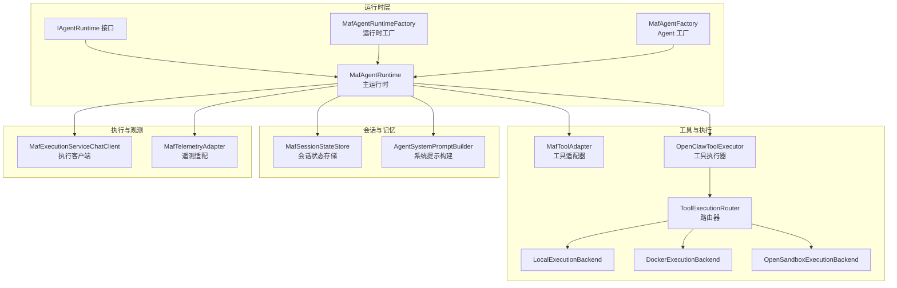
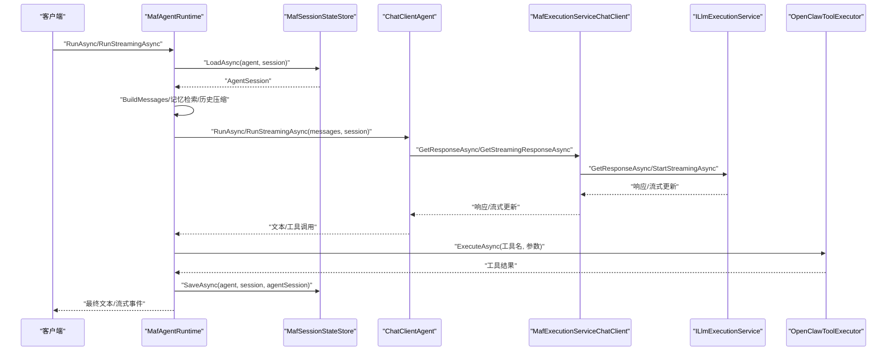
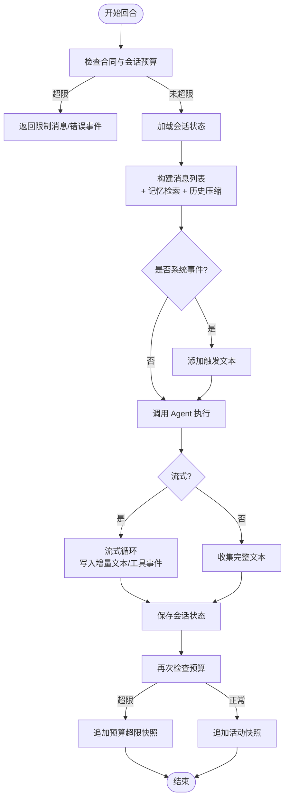
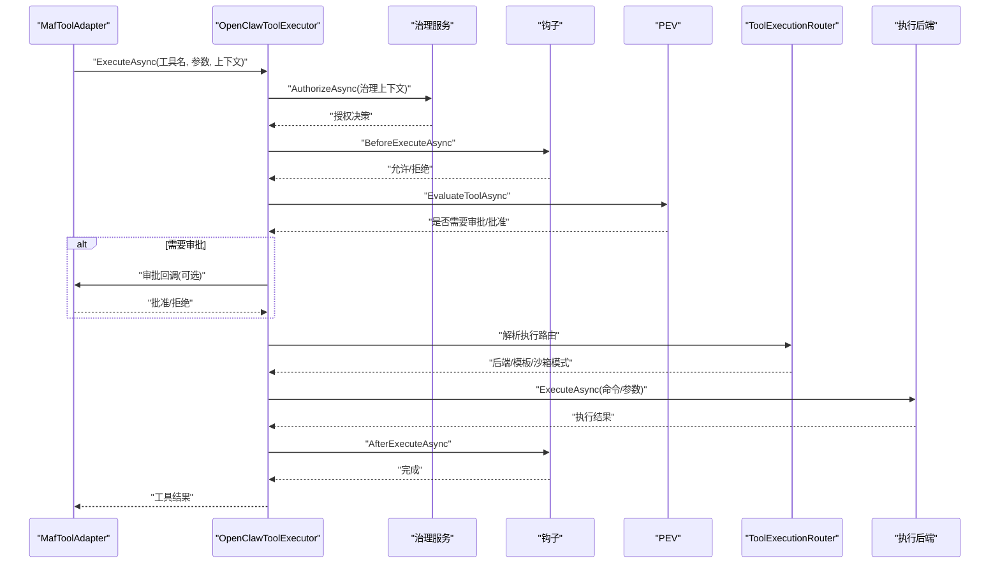
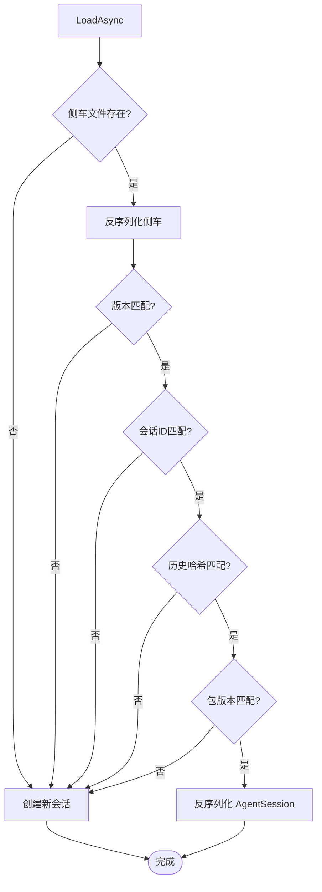
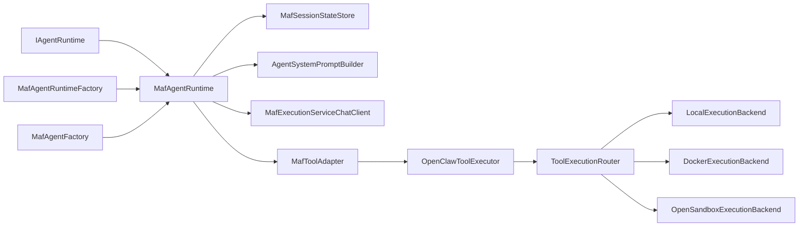
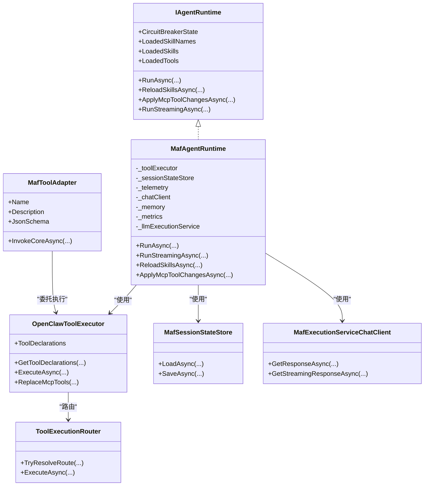

# 代理运行时

<cite>
**本文引用的文件**
- [MafAgentRuntime.cs](file://src/OpenClaw.Agent/MafAgentRuntime.cs)
- [IAgentRuntime.cs](file://src/OpenClaw.Agent/IAgentRuntime.cs)
- [MafAgentRuntimeFactory.cs](file://src/OpenClaw.Agent/MafAgentRuntimeFactory.cs)
- [MafExecutionContext.cs](file://src/OpenClaw.Agent/MafExecutionContext.cs)
- [MafOptions.cs](file://src/OpenClaw.Agent/MafOptions.cs)
- [OpenClawToolExecutor.cs](file://src/OpenClaw.Agent/OpenClawToolExecutor.cs)
- [MafSessionStateStore.cs](file://src/OpenClaw.Agent/MafSessionStateStore.cs)
- [AgentSystemPromptBuilder.cs](file://src/OpenClaw.Agent/AgentSystemPromptBuilder.cs)
- [MafToolAdapter.cs](file://src/OpenClaw.Agent/MafToolAdapter.cs)
- [MafTelemetryAdapter.cs](file://src/OpenClaw.Agent/MafTelemetryAdapter.cs)
- [MafExecutionServiceChatClient.cs](file://src/OpenClaw.Agent/MafExecutionServiceChatClient.cs)
- [MafAgentFactory.cs](file://src/OpenClaw.Agent/MafAgentFactory.cs)
- [ToolExecutionRouter.cs](file://src/OpenClaw.Agent/Execution/ToolExecutionRouter.cs)
- [DockerExecutionBackend.cs](file://src/OpenClaw.Agent/Execution/DockerExecutionBackend.cs)
- [LocalExecutionBackend.cs](file://src/OpenClaw.Agent/Execution/LocalExecutionBackend.cs)
- [OpenSandboxExecutionBackend.cs](file://src/OpenClaw.Agent/Execution/OpenSandboxExecutionBackend.cs)
</cite>

## 目录
1. [简介](#简介)
2. [项目结构](#项目结构)
3. [核心组件](#核心组件)
4. [架构总览](#架构总览)
5. [详细组件分析](#详细组件分析)
6. [依赖关系分析](#依赖关系分析)
7. [性能考量](#性能考量)
8. [故障排除指南](#故障排除指南)
9. [结论](#结论)
10. [附录](#附录)

## 简介
本文件为代理运行时系统的综合技术文档，聚焦于 MafAgentRuntime 的核心架构与运行机制。内容涵盖会话管理、工具执行器、记忆检索与注入、系统提示构建、流式响应处理、生命周期与状态持久化、并发与资源管理、工具调用流程、执行上下文管理、错误处理策略以及性能监控指标，并提供配置项说明、调试技巧与故障排除建议。

## 项目结构
代理运行时位于 OpenClaw.Agent 模块中，围绕 Microsoft Agent Framework（MAF）封装了会话状态、工具声明与执行、LLM 调用桥接、系统提示构建与记忆检索等功能。关键模块包括：
- 运行时入口与接口：IAgentRuntime、MafAgentRuntime
- 工具适配与执行：MafToolAdapter、OpenClawToolExecutor、ToolExecutionRouter 及多种执行后端
- 会话状态：MafSessionStateStore
- 提示构建：AgentSystemPromptBuilder
- 执行客户端与遥测：MafExecutionServiceChatClient、MafTelemetryAdapter
- 运行时工厂：MafAgentFactory、MafAgentRuntimeFactory
- 配置：MafOptions

图表来源
- [MafAgentRuntime.cs:17-1184](file://src/OpenClaw.Agent/MafAgentRuntime.cs#L17-L1184)
- [MafAgentRuntimeFactory.cs:9-166](file://src/OpenClaw.Agent/MafAgentRuntimeFactory.cs#L9-L166)
- [MafAgentFactory.cs:8-37](file://src/OpenClaw.Agent/MafAgentFactory.cs#L8-L37)
- [MafToolAdapter.cs:9-63](file://src/OpenClaw.Agent/MafToolAdapter.cs#L9-L63)
- [OpenClawToolExecutor.cs:30-1059](file://src/OpenClaw.Agent/OpenClawToolExecutor.cs#L30-L1059)
- [ToolExecutionRouter.cs:7-253](file://src/OpenClaw.Agent/Execution/ToolExecutionRouter.cs#L7-L253)
- [LocalExecutionBackend.cs:6-99](file://src/OpenClaw.Agent/Execution/LocalExecutionBackend.cs#L6-L99)
- [DockerExecutionBackend.cs:6-66](file://src/OpenClaw.Agent/Execution/DockerExecutionBackend.cs#L6-L66)
- [OpenSandboxExecutionBackend.cs:7-69](file://src/OpenClaw.Agent/Execution/OpenSandboxExecutionBackend.cs#L7-L69)
- [MafSessionStateStore.cs:12-197](file://src/OpenClaw.Agent/MafSessionStateStore.cs#L12-L197)
- [AgentSystemPromptBuilder.cs:7-150](file://src/OpenClaw.Agent/AgentSystemPromptBuilder.cs#L7-L150)
- [MafExecutionServiceChatClient.cs:10-188](file://src/OpenClaw.Agent/MafExecutionServiceChatClient.cs#L10-L188)
- [MafTelemetryAdapter.cs:7-25](file://src/OpenClaw.Agent/MafTelemetryAdapter.cs#L7-L25)

章节来源
- [MafAgentRuntime.cs:17-1184](file://src/OpenClaw.Agent/MafAgentRuntime.cs#L17-L1184)
- [MafAgentRuntimeFactory.cs:9-166](file://src/OpenClaw.Agent/MafAgentRuntimeFactory.cs#L9-L166)

## 核心组件
- IAgentRuntime：定义运行时对外能力，包括同步/异步运行、技能重载、MCP 工具热替换等。
- MafAgentRuntime：主运行时实现，负责回合编排、消息构建、记忆检索、历史压缩、工具调用、会话状态存取、流式输出、预算与合同检查、日志与遥测。
- OpenClawToolExecutor：统一的工具执行器，负责工具授权、审批、沙箱/路由执行、钩子、审计与度量。
- MafSessionStateStore：会话侧车（sidecar）状态持久化，基于 JSON 文件与哈希校验，支持迁移与回退。
- AgentSystemPromptBuilder：动态构建系统提示，包含工作区提示文件注入、时间与时区信息、运行时环境摘要。
- MafExecutionServiceChatClient：将 MAF 的 ChatClient 与底层 LLM 执行服务对接，记录用量与延迟。
- MafToolAdapter：将 ITool 适配为 AITool，桥接工具执行器与 MAF 的函数调用模型。
- ToolExecutionRouter：根据工具与配置解析执行后端（本地、Docker、OpenSandbox），支持回退与模板。
- MafAgentFactory / MafAgentRuntimeFactory：创建 ChatClientAgent 实例与运行时实例，支持委托运行时与配置派生。

章节来源
- [IAgentRuntime.cs:8-51](file://src/OpenClaw.Agent/IAgentRuntime.cs#L8-L51)
- [MafAgentRuntime.cs:17-1184](file://src/OpenClaw.Agent/MafAgentRuntime.cs#L17-L1184)
- [OpenClawToolExecutor.cs:30-1059](file://src/OpenClaw.Agent/OpenClawToolExecutor.cs#L30-L1059)
- [MafSessionStateStore.cs:12-197](file://src/OpenClaw.Agent/MafSessionStateStore.cs#L12-L197)
- [AgentSystemPromptBuilder.cs:7-150](file://src/OpenClaw.Agent/AgentSystemPromptBuilder.cs#L7-L150)
- [MafExecutionServiceChatClient.cs:10-188](file://src/OpenClaw.Agent/MafExecutionServiceChatClient.cs#L10-L188)
- [MafToolAdapter.cs:9-63](file://src/OpenClaw.Agent/MafToolAdapter.cs#L9-L63)
- [ToolExecutionRouter.cs:7-253](file://src/OpenClaw.Agent/Execution/ToolExecutionRouter.cs#L7-L253)
- [MafAgentFactory.cs:8-37](file://src/OpenClaw.Agent/MafAgentFactory.cs#L8-L37)
- [MafAgentRuntimeFactory.cs:9-166](file://src/OpenClaw.Agent/MafAgentRuntimeFactory.cs#L9-L166)

## 架构总览
下图展示一次典型对话回合从请求到响应的关键路径，包括同步与流式两种模式。

图表来源
- [MafAgentRuntime.cs:203-423](file://src/OpenClaw.Agent/MafAgentRuntime.cs#L203-L423)
- [MafSessionStateStore.cs:36-144](file://src/OpenClaw.Agent/MafSessionStateStore.cs#L36-L144)
- [MafExecutionServiceChatClient.cs:32-125](file://src/OpenClaw.Agent/MafExecutionServiceChatClient.cs#L32-L125)
- [OpenClawToolExecutor.cs:134-630](file://src/OpenClaw.Agent/OpenClawToolExecutor.cs#L134-L630)

## 详细组件分析

### MafAgentRuntime：回合编排与状态管理
- 回合入口：RunAsync（同步）、RunStreamingAsync（流式）
- 历史管理：按阈值压缩或简单修剪；支持基于摘要的历史压缩
- 记忆检索：按用户消息检索相关记忆条目，注入到消息列表
- 系统提示：动态拼接技能索引与阻断路由说明，附加时间与时区、运行时摘要
- 合同与预算：在回合前后检查合同运行时预算与令牌预算，必要时终止并记录快照
- 会话状态：加载/保存 AgentSession，基于历史哈希与版本校验
- 流式处理：通过通道与事件写入器向订阅者推送增量文本、工具事件与完成信号

图表来源
- [MafAgentRuntime.cs:203-423](file://src/OpenClaw.Agent/MafAgentRuntime.cs#L203-L423)
- [MafSessionStateStore.cs:36-144](file://src/OpenClaw.Agent/MafSessionStateStore.cs#L36-L144)

章节来源
- [MafAgentRuntime.cs:203-423](file://src/OpenClaw.Agent/MafAgentRuntime.cs#L203-L423)
- [MafAgentRuntime.cs:625-764](file://src/OpenClaw.Agent/MafAgentRuntime.cs#L625-L764)
- [MafAgentRuntime.cs:996-1014](file://src/OpenClaw.Agent/MafAgentRuntime.cs#L996-L1014)

### OpenClawToolExecutor：工具执行全生命周期
- 工具声明：按会话预设过滤可用工具
- 授权与治理：基于动作描述符与治理策略进行授权决策，支持红acted/替换参数
- 审批与钩子：支持审批回调、前后钩子、PEV（计划-执行-验证）评估
- 执行路由：解析后端（本地/Docker/OpenSandbox），支持回退与模板
- 流式工具：IStreamingTool 支持增量回调
- 度量与审计：记录工具调用次数、失败、超时、耗时、治理结果与审计日志

图表来源
- [OpenClawToolExecutor.cs:134-630](file://src/OpenClaw.Agent/OpenClawToolExecutor.cs#L134-L630)
- [ToolExecutionRouter.cs:65-157](file://src/OpenClaw.Agent/Execution/ToolExecutionRouter.cs#L65-L157)
- [LocalExecutionBackend.cs:27-99](file://src/OpenClaw.Agent/Execution/LocalExecutionBackend.cs#L27-L99)
- [DockerExecutionBackend.cs:19-66](file://src/OpenClaw.Agent/Execution/DockerExecutionBackend.cs#L19-L66)
- [OpenSandboxExecutionBackend.cs:22-69](file://src/OpenClaw.Agent/Execution/OpenSandboxExecutionBackend.cs#L22-L69)

章节来源
- [OpenClawToolExecutor.cs:30-1059](file://src/OpenClaw.Agent/OpenClawToolExecutor.cs#L30-L1059)
- [ToolExecutionRouter.cs:7-253](file://src/OpenClaw.Agent/Execution/ToolExecutionRouter.cs#L7-L253)

### MafSessionStateStore：会话状态持久化
- 存储位置：基于会话 ID 的 SHA256 哈希命名，支持新旧路径兼容
- 加载策略：校验版本、会话 ID、历史哈希与包版本，不匹配则重建
- 保存策略：序列化 AgentSession，写入临时文件再原子移动
- 历史哈希：包含历史、模型覆盖、系统提示覆盖、路由预设与允许工具集

图表来源
- [MafSessionStateStore.cs:36-144](file://src/OpenClaw.Agent/MafSessionStateStore.cs#L36-L144)

章节来源
- [MafSessionStateStore.cs:12-197](file://src/OpenClaw.Agent/MafSessionStateStore.cs#L12-L197)

### AgentSystemPromptBuilder：系统提示构建
- 基础提示：包含操作指令、安全约束、工具使用说明
- 技能索引：仅注入技能元数据索引（按需加载完整技能体）
- 动态后缀：当前时间、时区、运行时环境摘要
- 工作区注入：可选读取 AGENTS.md 与 SOUL.md 并限制长度

章节来源
- [AgentSystemPromptBuilder.cs:20-150](file://src/OpenClaw.Agent/AgentSystemPromptBuilder.cs#L20-L150)
- [MafAgentRuntime.cs:589-620](file://src/OpenClaw.Agent/MafAgentRuntime.cs#L589-L620)

### MafExecutionServiceChatClient：LLM 执行桥接
- 统一调用：封装 ILlmExecutionService 的同步/流式接口
- 用量记录：估算输入/输出 token，合并实际用量，记录缓存命中
- 遥测标记：提供当前 LLM 提供商与模型标签
- 估计构建：结合技能提示长度与消息估算 token

章节来源
- [MafExecutionServiceChatClient.cs:10-188](file://src/OpenClaw.Agent/MafExecutionServiceChatClient.cs#L10-L188)

### MafToolAdapter：工具适配与流式事件
- 将 ITool 包装为 AITool，暴露参数模式
- 在工具执行前后发出 ToolStarted/ToolDelta/ToolCompleted 事件
- 收集 ToolInvocation 并写入回合历史

章节来源
- [MafToolAdapter.cs:9-63](file://src/OpenClaw.Agent/MafToolAdapter.cs#L9-L63)
- [MafExecutionContext.cs:6-46](file://src/OpenClaw.Agent/MafExecutionContext.cs#L6-L46)

### MafAgentFactory / MafAgentRuntimeFactory：运行时与 Agent 创建
- MafAgentFactory：创建 ChatClientAgent，设置名称、描述与工具集合
- MafAgentRuntimeFactory：创建 MafAgentRuntime，支持委托运行时与配置派生，集成代理工具与治理

章节来源
- [MafAgentFactory.cs:8-37](file://src/OpenClaw.Agent/MafAgentFactory.cs#L8-L37)
- [MafAgentRuntimeFactory.cs:9-166](file://src/OpenClaw.Agent/MafAgentRuntimeFactory.cs#L9-L166)

## 依赖关系分析
- 运行时依赖：IAgentRuntime → MafAgentRuntime；MafAgentRuntimeFactory → MafAgentRuntime；MafAgentFactory → ChatClientAgent
- 工具链路：MafToolAdapter → OpenClawToolExecutor → ToolExecutionRouter → 执行后端（Local/Docker/OpenSandbox）
- 会话与记忆：MafAgentRuntime → MafSessionStateStore；系统提示构建 → AgentSystemPromptBuilder
- 观测：MafExecutionServiceChatClient → ILlmExecutionService；MafTelemetryAdapter → ActivitySource

图表来源
- [MafAgentRuntime.cs:17-1184](file://src/OpenClaw.Agent/MafAgentRuntime.cs#L17-L1184)
- [MafAgentRuntimeFactory.cs:9-166](file://src/OpenClaw.Agent/MafAgentRuntimeFactory.cs#L9-L166)
- [MafAgentFactory.cs:8-37](file://src/OpenClaw.Agent/MafAgentFactory.cs#L8-L37)
- [MafToolAdapter.cs:9-63](file://src/OpenClaw.Agent/MafToolAdapter.cs#L9-L63)
- [OpenClawToolExecutor.cs:30-1059](file://src/OpenClaw.Agent/OpenClawToolExecutor.cs#L30-L1059)
- [ToolExecutionRouter.cs:7-253](file://src/OpenClaw.Agent/Execution/ToolExecutionRouter.cs#L7-L253)
- [LocalExecutionBackend.cs:6-99](file://src/OpenClaw.Agent/Execution/LocalExecutionBackend.cs#L6-L99)
- [DockerExecutionBackend.cs:6-66](file://src/OpenClaw.Agent/Execution/DockerExecutionBackend.cs#L6-L66)
- [OpenSandboxExecutionBackend.cs:7-69](file://src/OpenClaw.Agent/Execution/OpenSandboxExecutionBackend.cs#L7-L69)
- [MafSessionStateStore.cs:12-197](file://src/OpenClaw.Agent/MafSessionStateStore.cs#L12-L197)
- [AgentSystemPromptBuilder.cs:7-150](file://src/OpenClaw.Agent/AgentSystemPromptBuilder.cs#L7-L150)
- [MafExecutionServiceChatClient.cs:10-188](file://src/OpenClaw.Agent/MafExecutionServiceChatClient.cs#L10-L188)

## 性能考量
- 历史压缩：当历史超过阈值时，使用摘要模型生成摘要以控制上下文窗口
- 记忆检索：限制最大条数与字符数，避免过度占用上下文
- 流式输出：使用有界通道与单读者/写者确保吞吐与背压
- 工具超时：统一的工具超时控制，避免阻塞回合
- 用量估算：结合消息与技能提示长度估算 token，减少不必要的计算
- 并发控制：回合级锁保护工具与技能快照读取，避免竞态

章节来源
- [MafAgentRuntime.cs:684-764](file://src/OpenClaw.Agent/MafAgentRuntime.cs#L684-L764)
- [MafAgentRuntime.cs:625-682](file://src/OpenClaw.Agent/MafAgentRuntime.cs#L625-L682)
- [OpenClawToolExecutor.cs:134-630](file://src/OpenClaw.Agent/OpenClawToolExecutor.cs#L134-L630)
- [MafExecutionServiceChatClient.cs:134-187](file://src/OpenClaw.Agent/MafExecutionServiceChatClient.cs#L134-L187)

## 故障排除指南
- 合同预算超限：在回合前后检查合同运行时与令牌预算，若超限直接终止并记录快照
- 会话令牌上限：达到会话级令牌预算时返回提示并结束回合
- 模型选择失败：捕获模型选择异常，记录警告并返回友好提示
- 工具超时/失败：记录工具超时与失败计数，输出可操作下一步
- 治理拒绝：当治理策略不允许或参数被替换/红acted 时，记录审计并返回明确原因
- 会话侧车损坏：加载失败或哈希不匹配时自动重建，避免污染历史
- 流式通道异常：在取消或异常时尝试完成通道，确保消费者正确收尾

章节来源
- [MafAgentRuntime.cs:226-337](file://src/OpenClaw.Agent/MafAgentRuntime.cs#L226-L337)
- [OpenClawToolExecutor.cs:483-530](file://src/OpenClaw.Agent/OpenClawToolExecutor.cs#L483-L530)
- [MafSessionStateStore.cs:97-104](file://src/OpenClaw.Agent/MafSessionStateStore.cs#L97-L104)

## 结论
MafAgentRuntime 通过清晰的分层设计与强一致的执行上下文，实现了从会话管理、系统提示构建、记忆检索、工具治理与执行、到 LLM 调用与流式输出的完整闭环。其可扩展的执行后端与严格的预算/合同控制，使其在安全性与可运维性方面具备良好表现。配合完善的度量与遥测，能够支撑生产级部署与持续优化。

## 附录

### 配置选项（MafOptions）
- AgentName / AgentDescription：代理名称与描述
- SessionSidecarPath：会话侧车存储路径（默认 sessions）
- EnableStreaming / EnableStreamingFallback：启用流式与回退策略
- EnableA2A / A2APathPrefix / A2AVersion / A2APublicBaseUrl / A2ASkills：A2A 能力开关与元数据

章节来源
- [MafOptions.cs:3-44](file://src/OpenClaw.Agent/MafOptions.cs#L3-L44)

### 关键类关系图

图表来源
- [IAgentRuntime.cs:8-51](file://src/OpenClaw.Agent/IAgentRuntime.cs#L8-L51)
- [MafAgentRuntime.cs:17-1184](file://src/OpenClaw.Agent/MafAgentRuntime.cs#L17-L1184)
- [OpenClawToolExecutor.cs:30-1059](file://src/OpenClaw.Agent/OpenClawToolExecutor.cs#L30-L1059)
- [MafToolAdapter.cs:9-63](file://src/OpenClaw.Agent/MafToolAdapter.cs#L9-L63)
- [MafSessionStateStore.cs:12-197](file://src/OpenClaw.Agent/MafSessionStateStore.cs#L12-L197)
- [MafExecutionServiceChatClient.cs:10-188](file://src/OpenClaw.Agent/MafExecutionServiceChatClient.cs#L10-L188)
- [ToolExecutionRouter.cs:7-253](file://src/OpenClaw.Agent/Execution/ToolExecutionRouter.cs#L7-L253)