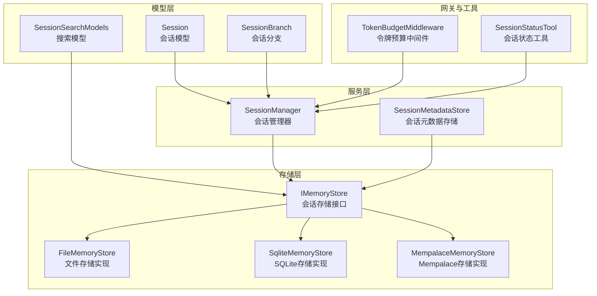
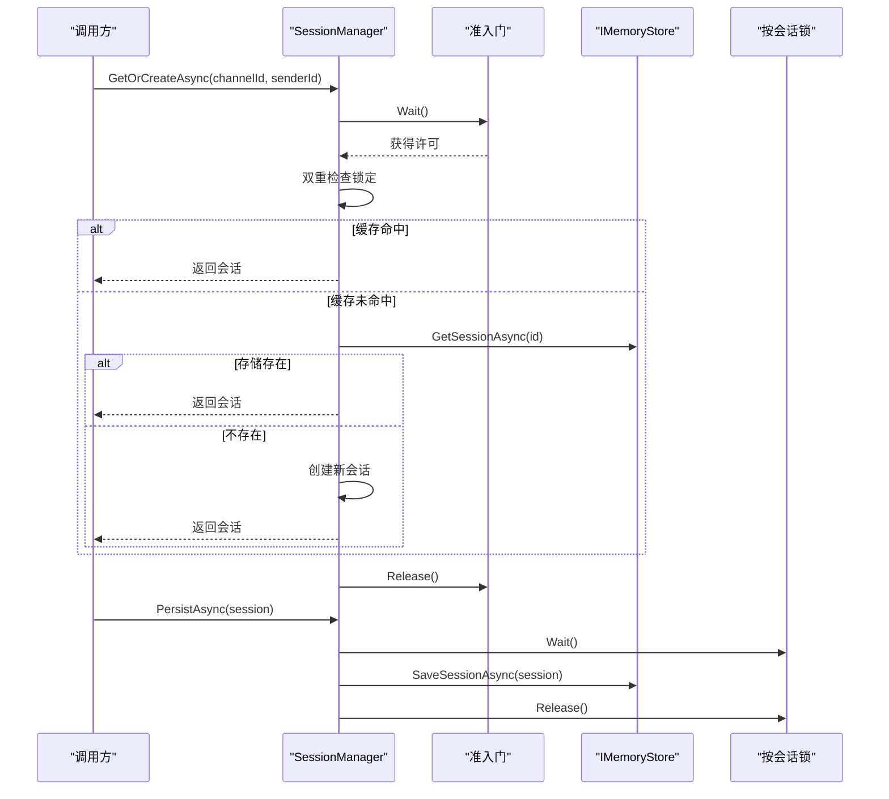
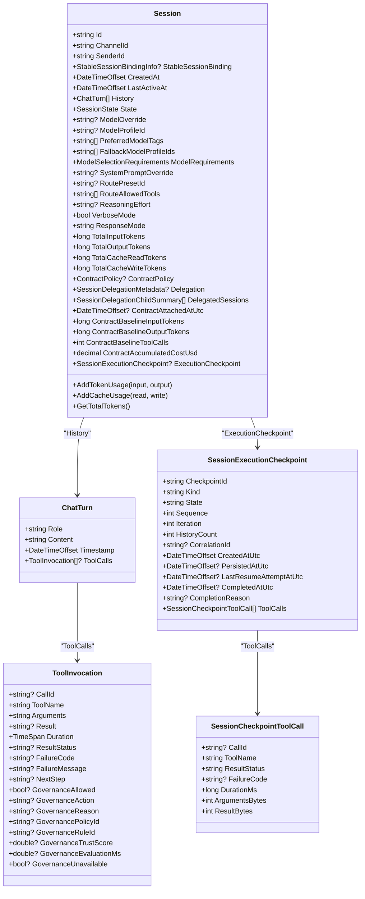
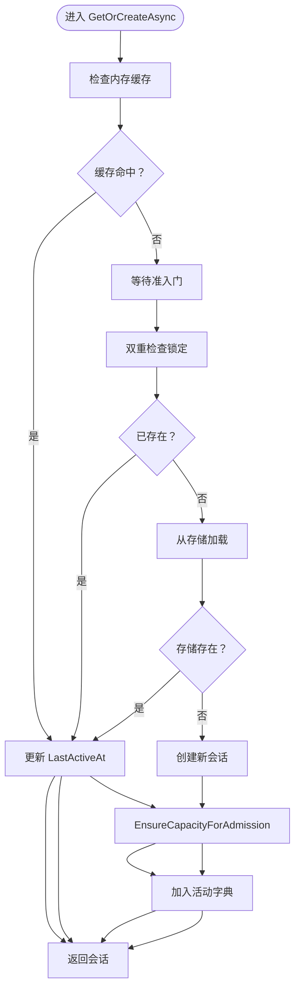
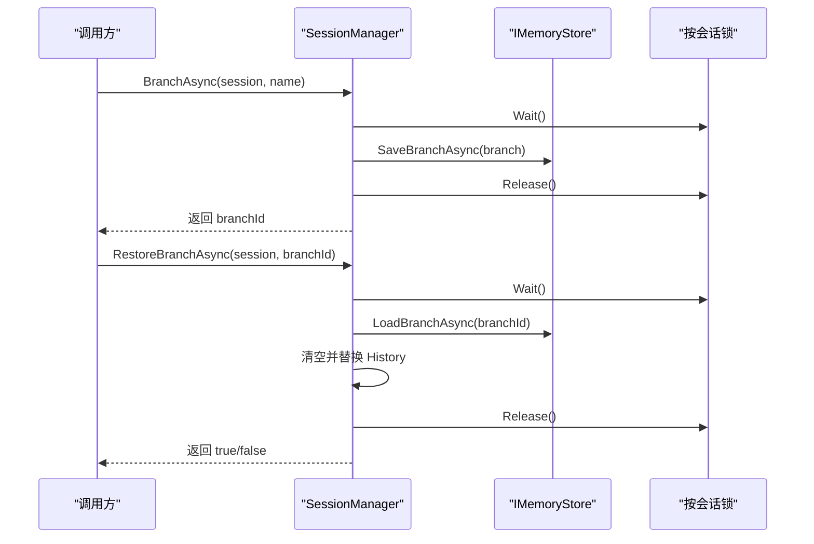
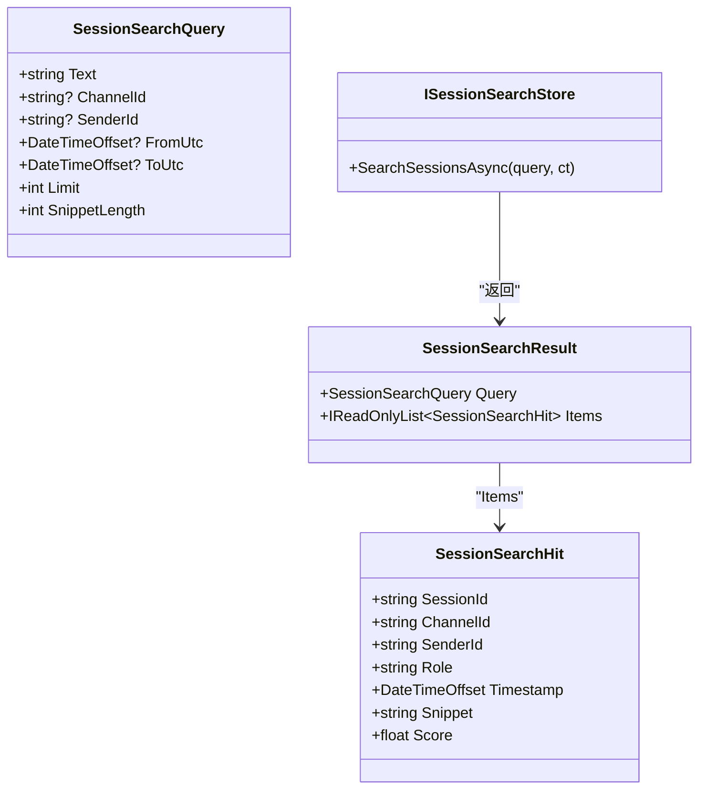
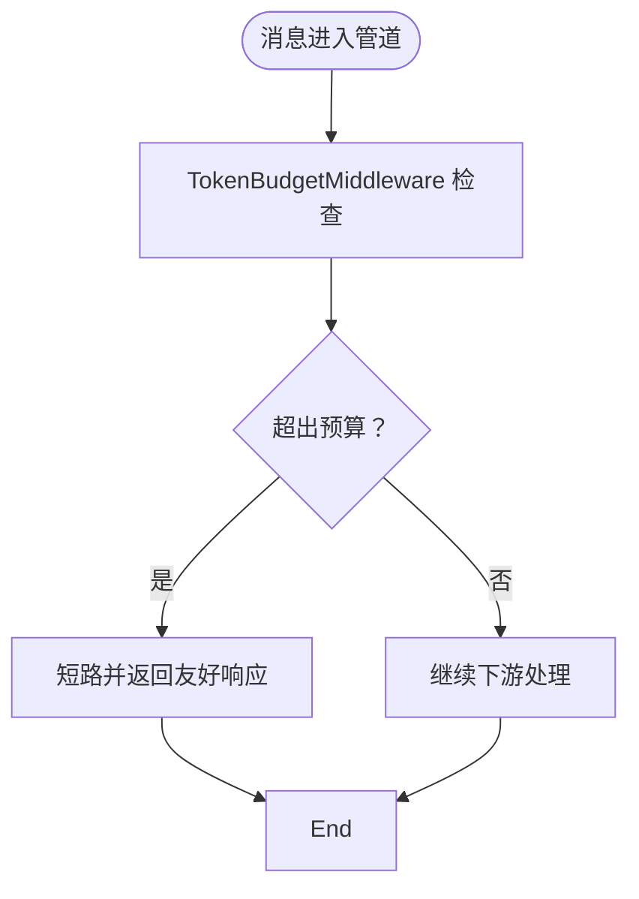
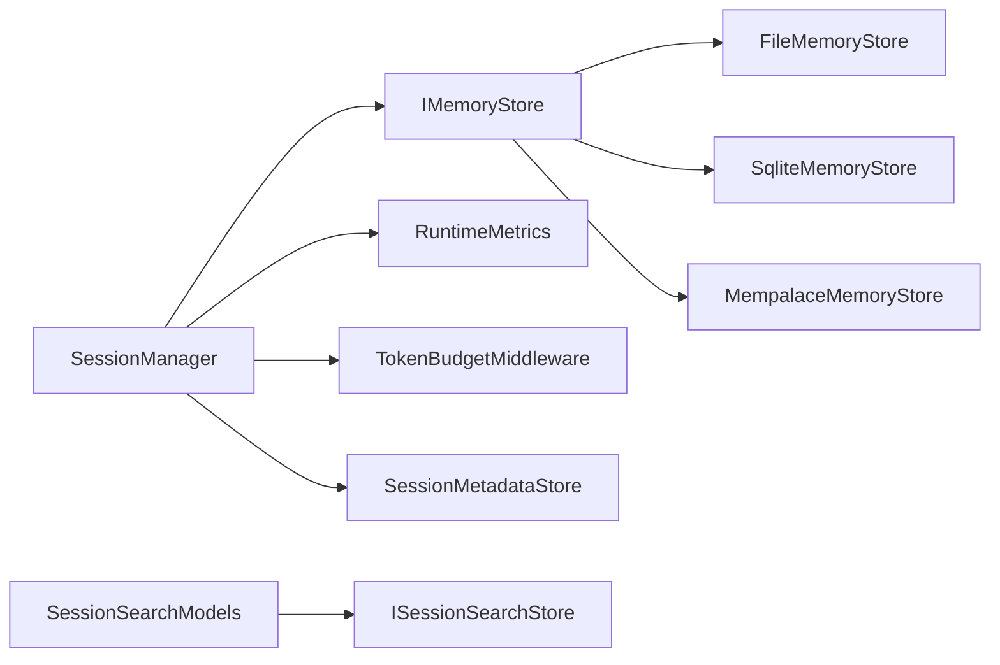

# 会话管理

<cite>
**本文引用的文件**
- [Session.cs](file://src/OpenClaw.Core/Models/Session.cs)
- [SessionBranch.cs](file://src/OpenClaw.Core/Models/SessionBranch.cs)
- [SessionManager.cs](file://src/OpenClaw.Core/Sessions/SessionManager.cs)
- [SessionSearchModels.cs](file://src/OpenClaw.Core/Models/SessionSearchModels.cs)
- [ISessionSearchStore.cs](file://src/OpenClaw.Core/Abstractions/ISessionSearchStore.cs)
- [ISessionMetadataStore.cs](file://src/OpenClaw.Core/Abstractions/ISessionMetadataStore.cs)
- [SessionMetadataStore.cs](file://src/OpenClaw.Gateway/SessionMetadataStore.cs)
- [IMemoryStore.cs](file://src/OpenClaw.Core/Abstractions/IMemoryStore.cs)
- [GatewayConfig.cs](file://src/OpenClaw.Core/Models/GatewayConfig.cs)
- [TokenBudgetMiddleware.cs](file://src/OpenClaw.Core/Middleware/TokenBudgetMiddleware.cs)
- [OpenClaw-Session-Management.md](file://docs/OpenClaw-Session-Management.md)
- [SessionAdminStoreTests.cs](file://src/OpenClaw.Tests/SessionAdminStoreTests.cs)
- [FileMemoryStoreRetentionTests.cs](file://src/OpenClaw.Tests/FileMemoryStoreRetentionTests.cs)
- [MempalaceMemoryStore.cs](file://src/OpenClaw.Plugins.Mempalace/MempalaceMemoryStore.cs)
- [RuntimeMetrics.cs](file://src/OpenClaw.Core/Observability/RuntimeMetrics.cs)
- [SessionStatusTool.cs](file://src/OpenClaw.Agent/Tools/SessionStatusTool.cs)
</cite>

## 目录
1. [简介](#简介)
2. [项目结构](#项目结构)
3. [核心组件](#核心组件)
4. [架构总览](#架构总览)
5. [详细组件分析](#详细组件分析)
6. [依赖关系分析](#依赖关系分析)
7. [性能考量](#性能考量)
8. [故障排除指南](#故障排除指南)
9. [结论](#结论)
10. [附录](#附录)

## 简介
本文件系统化阐述会话管理子系统的设计与实现，覆盖会话生命周期管理、状态持久化、历史记录处理、并发访问控制、会话分支与合并、会话搜索与检索、会话超时与令牌预算控制、会话配置选项与性能优化、以及常见问题排查。目标读者既包括需要快速上手的工程师，也包括希望深入理解实现细节的架构师。

## 项目结构
会话管理相关代码主要分布在以下模块：
- 模型层：会话数据结构、分支、搜索模型与抽象接口
- 服务层：会话管理器（内存权威）、元数据存储
- 存储层：会话与分支的持久化接口与多种实现
- 网关与工具：会话状态展示、搜索工具、令牌预算中间件
- 文档与测试：官方文档、单元测试与回归测试

**图表来源**
- [Session.cs:15-135](file://src/OpenClaw.Core/Models/Session.cs#L15-L135)
- [SessionBranch.cs:8-16](file://src/OpenClaw.Core/Models/SessionBranch.cs#L8-L16)
- [SessionManager.cs:13-624](file://src/OpenClaw.Core/Sessions/SessionManager.cs#L13-L624)
- [SessionSearchModels.cs:3-30](file://src/OpenClaw.Core/Models/SessionSearchModels.cs#L3-L30)
- [ISessionSearchStore.cs:5-8](file://src/OpenClaw.Core/Abstractions/ISessionSearchStore.cs#L5-L8)
- [IMemoryStore.cs:9-23](file://src/OpenClaw.Core/Abstractions/IMemoryStore.cs#L9-L23)
- [SessionMetadataStore.cs:7-135](file://src/OpenClaw.Gateway/SessionMetadataStore.cs#L7-L135)
- [TokenBudgetMiddleware.cs:12-30](file://src/OpenClaw.Core/Middleware/TokenBudgetMiddleware.cs#L12-L30)
- [SessionStatusTool.cs:56-75](file://src/OpenClaw.Agent/Tools/SessionStatusTool.cs#L56-L75)

**章节来源**
- [OpenClaw-Session-Management.md:1-278](file://docs/OpenClaw-Session-Management.md#L1-L278)

## 核心组件
- Session：会话实体，包含标识、渠道/发送者、历史、状态、令牌计数、模型与路由覆盖、委托元数据、执行检查点等字段，采用零分配序列化上下文。
- SessionBranch：会话历史快照，支持命名分支与恢复。
- SessionManager：内存权威，负责会话创建、并发准入、容量控制、过期淘汰、持久化、按会话锁、分支与差异计算。
- IMemoryStore：会话与分支的持久化契约，默认文件/SQLite/Mempalace实现。
- SessionMetadataStore：独立的会话元数据存储（星标、标签、待办等），与会话生命周期解耦。
- TokenBudgetMiddleware：基于会话令牌预算的短路拦截，支持美元成本预算回调。
- SessionSearchModels 与 ISessionSearchStore：会话搜索查询、命中与结果模型，以及搜索接口。

**章节来源**
- [Session.cs:15-135](file://src/OpenClaw.Core/Models/Session.cs#L15-L135)
- [SessionBranch.cs:8-16](file://src/OpenClaw.Core/Models/SessionBranch.cs#L8-L16)
- [SessionManager.cs:13-624](file://src/OpenClaw.Core/Sessions/SessionManager.cs#L13-L624)
- [IMemoryStore.cs:9-23](file://src/OpenClaw.Core/Abstractions/IMemoryStore.cs#L9-L23)
- [SessionMetadataStore.cs:7-135](file://src/OpenClaw.Gateway/SessionMetadataStore.cs#L7-L135)
- [TokenBudgetMiddleware.cs:12-30](file://src/OpenClaw.Core/Middleware/TokenBudgetMiddleware.cs#L12-L30)
- [SessionSearchModels.cs:3-30](file://src/OpenClaw.Core/Models/SessionSearchModels.cs#L3-L30)
- [ISessionSearchStore.cs:5-8](file://src/OpenClaw.Core/Abstractions/ISessionSearchStore.cs#L5-L8)

## 架构总览
会话管理采用“内存权威 + 多后端持久化”的设计：
- 内存缓存：ConcurrentDictionary 作为热缓存，提升读写性能。
- 准入控制：单一准入门（SemaphoreSlim）串行化新会话创建，双重检查锁定避免不必要的串行化。
- 容量控制：两阶段淘汰（过期扫描 + LRU），超限时抛出异常并计数指标。
- 按会话锁：对单会话状态变更（分支/持久化/历史追加）进行串行化，定期清理孤儿锁。
- 搜索与检索：管理列表（分页、过滤）与全文搜索（相关性评分）互补；元数据独立存储。
- 令牌预算：中间件在消息管道早期短路超预算请求，保障资源可控。

**图表来源**
- [SessionManager.cs:45-130](file://src/OpenClaw.Core/Sessions/SessionManager.cs#L45-L130)
- [SessionManager.cs:132-172](file://src/OpenClaw.Core/Sessions/SessionManager.cs#L132-L172)

**章节来源**
- [OpenClaw-Session-Management.md:27-80](file://docs/OpenClaw-Session-Management.md#L27-L80)

## 详细组件分析

### Session 模型与数据结构
- 关键字段
  - 标识与身份：Id、ChannelId、SenderId、StableSessionBinding
  - 时间戳：CreatedAt、LastActiveAt
  - 历史与状态：History、State（Active/Paused/Expired）
  - 模型与路由覆盖：ModelOverride、ModelProfileId、PreferredModelTags、FallbackModelProfileIds、ModelRequirements、SystemPromptOverride、RoutePresetId、RouteAllowedTools、ReasoningEffort、VerboseMode、ResponseMode
  - 令牌与成本：TotalInputTokens、TotalOutputTokens、TotalCacheReadTokens、TotalCacheWriteTokens、ContractPolicy、ContractAttachedAtUtc、ContractBaselineInput/OutputTokens、ContractBaselineToolCalls、ContractAccumulatedCostUsd
  - 委托与执行：Delegation、DelegatedSessions、ExecutionCheckpoint
  - 历史项：ChatTurn（Role、Content、Timestamp、ToolCalls）
  - 工具调用：ToolInvocation（CallId、ToolName、Arguments、Result、Duration、治理字段）
  - 执行检查点：SessionExecutionCheckpoint、SessionCheckpointToolCall
- 设计要点
  - 使用 Interlocked 保证并发累加的线程安全
  - AOT 友好的 JSON 序列化上下文
  - 结构化元数据支持委托场景与治理审计

**图表来源**
- [Session.cs:15-289](file://src/OpenClaw.Core/Models/Session.cs#L15-L289)

**章节来源**
- [Session.cs:15-289](file://src/OpenClaw.Core/Models/Session.cs#L15-L289)

### SessionManager：内存权威与并发控制
- 会话创建与键解析
  - 标准路径：channelId:senderId
  - 显式路径：sessionId（适用于定时任务、Webhook、子 Agent）
  - 准入门（并发度 1）+ 双重检查锁定，避免缓存命中时的串行化
- 容量与淘汰
  - EnsureCapacityForAdmission：两阶段淘汰（过期扫描 → LRU）
  - SweepExpiredActiveSessions：按 LastActiveAt 超时淘汰
  - EvictLeastRecentlyActive：LRU 淘汰（TODO：可用优先队列优化至 O(log n)）
- 持久化
  - 带重试的指数退避（最多 3 次，间隔 100ms、200ms、400ms）
  - 支持 sessionLockHeld 优化，避免重复加锁
- 按会话锁
  - AcquireSessionLockAsync：为单会话提供独占信号量
  - CleanupSessionLocksOnce：清理孤儿锁
- 分支与差异
  - BranchAsync：深拷贝历史，生成分支 ID，持久化
  - RestoreBranchAsync：原子替换历史
  - BuildBranchDiffAsync：共享前缀分析，返回两侧差异摘要

**图表来源**
- [SessionManager.cs:45-130](file://src/OpenClaw.Core/Sessions/SessionManager.cs#L45-L130)

**章节来源**
- [SessionManager.cs:13-624](file://src/OpenClaw.Core/Sessions/SessionManager.cs#L13-L624)
- [OpenClaw-Session-Management.md:27-80](file://docs/OpenClaw-Session-Management.md#L27-L80)

### 会话分支与合并
- 分支
  - BranchAsync：深拷贝 History，生成唯一分支 ID，持久化
  - ListBranchesAsync：列出指定会话的所有分支
- 合并/恢复
  - RestoreBranchAsync：原子替换当前历史
  - BuildBranchDiffAsync：共享前缀分析，返回两侧差异摘要
- 存储契约
  - IMemoryStore.SaveBranchAsync/LoadBranchAsync/ListBranchesAsync/DeleteBranchAsync

**图表来源**
- [SessionManager.cs:176-220](file://src/OpenClaw.Core/Sessions/SessionManager.cs#L176-L220)
- [IMemoryStore.cs:18-23](file://src/OpenClaw.Core/Abstractions/IMemoryStore.cs#L18-L23)

**章节来源**
- [SessionManager.cs:174-250](file://src/OpenClaw.Core/Sessions/SessionManager.cs#L174-L250)
- [SessionBranch.cs:8-16](file://src/OpenClaw.Core/Models/SessionBranch.cs#L8-L16)

### 会话搜索与检索
- 管理列表（ISessionAdminStore）
  - 支持分页、按渠道/发送者/时间范围/状态/星标/标签过滤
  - 元数据过滤需加载全部持久化页面并在内存中匹配（星标/标签独立存储）
- 全文搜索（ISessionSearchStore）
  - SessionSearchQuery：文本、渠道/发送者、时间范围、限制与摘要长度
  - SessionSearchHit：会话 ID、角色、时间戳、片段与评分
  - SessionSearchResult：查询与命中项
- 测试验证
  - FileMemoryStore 与 SqliteMemoryStore 的分页与过滤行为

**图表来源**
- [SessionSearchModels.cs:3-30](file://src/OpenClaw.Core/Models/SessionSearchModels.cs#L3-L30)
- [ISessionSearchStore.cs:5-8](file://src/OpenClaw.Core/Abstractions/ISessionSearchStore.cs#L5-L8)

**章节来源**
- [SessionSearchModels.cs:3-30](file://src/OpenClaw.Core/Models/SessionSearchModels.cs#L3-L30)
- [ISessionSearchStore.cs:5-8](file://src/OpenClaw.Core/Abstractions/ISessionSearchStore.cs#L5-L8)
- [SessionAdminStoreTests.cs:10-89](file://src/OpenClaw.Tests/SessionAdminStoreTests.cs#L10-L89)

### 会话元数据存储
- 独立文件：admin/session-metadata.json
- 支持部分更新：Starred、Tags、ActivePresetId、TodoItems
- 待办事项标准化：去空白、去重、排序、自动生成 ID
- 线程安全：文件级锁，失败日志与异常抛出

**章节来源**
- [SessionMetadataStore.cs:7-135](file://src/OpenClaw.Gateway/SessionMetadataStore.cs#L7-L135)

### 会话超时与令牌预算控制
- 会话超时
  - SessionTimeoutMinutes 控制空闲过期窗口
  - SweepExpiredActiveSessions 扫描淘汰，转换为 Expired 状态并尽力持久化
- 令牌预算
  - TokenBudgetMiddleware：基于会话总令牌（输入+输出）短路拦截
  - 支持 USD 成本预算回调（按通道/发送者）
  - GatewayConfig.SessionTokenBudget、EnableEstimatedTokenAdmissionControl、SessionRateLimitPerMinute

**图表来源**
- [TokenBudgetMiddleware.cs:12-30](file://src/OpenClaw.Core/Middleware/TokenBudgetMiddleware.cs#L12-L30)
- [GatewayConfig.cs:53-63](file://src/OpenClaw.Core/Models/GatewayConfig.cs#L53-L63)

**章节来源**
- [SessionManager.cs:338-359](file://src/OpenClaw.Core/Sessions/SessionManager.cs#L338-L359)
- [TokenBudgetMiddleware.cs:12-30](file://src/OpenClaw.Core/Middleware/TokenBudgetMiddleware.cs#L12-L30)
- [GatewayConfig.cs:53-63](file://src/OpenClaw.Core/Models/GatewayConfig.cs#L53-L63)

### 会话状态展示与历史查询
- SessionStatusTool：汇总会话状态、轮次数、令牌用量、缓存统计、活动时长、模型覆盖等
- sessions_history：获取任意会话（活动或持久化）最近 N 轮历史

**章节来源**
- [SessionStatusTool.cs:56-75](file://src/OpenClaw.Agent/Tools/SessionStatusTool.cs#L56-L75)

## 依赖关系分析
- SessionManager 依赖 IMemoryStore 进行持久化，依赖 RuntimeMetrics 记录淘汰与容量拒绝指标
- IMemoryStore 的多种实现（FileMemoryStore、SqliteMemoryStore、MempalaceMemoryStore）均支持会话与分支的 CRUD
- 会话搜索与管理列表分别对接 ISessionSearchStore 与 ISessionAdminStore，后者依赖 SessionMetadataStore
- TokenBudgetMiddleware 与 GatewayConfig 协同控制令牌预算

**图表来源**
- [SessionManager.cs:19-22](file://src/OpenClaw.Core/Sessions/SessionManager.cs#L19-L22)
- [IMemoryStore.cs:9-23](file://src/OpenClaw.Core/Abstractions/IMemoryStore.cs#L9-L23)
- [MempalaceMemoryStore.cs:15-22](file://src/OpenClaw.Plugins.Mempalace/MempalaceMemoryStore.cs#L15-L22)
- [RuntimeMetrics.cs:99-170](file://src/OpenClaw.Core/Observability/RuntimeMetrics.cs#L99-L170)
- [SessionSearchModels.cs:3-30](file://src/OpenClaw.Core/Models/SessionSearchModels.cs#L3-L30)
- [ISessionSearchStore.cs:5-8](file://src/OpenClaw.Core/Abstractions/ISessionSearchStore.cs#L5-L8)

**章节来源**
- [SessionManager.cs:13-624](file://src/OpenClaw.Core/Sessions/SessionManager.cs#L13-L624)
- [IMemoryStore.cs:9-23](file://src/OpenClaw.Core/Abstractions/IMemoryStore.cs#L9-L23)
- [MempalaceMemoryStore.cs:15-22](file://src/OpenClaw.Plugins.Mempalace/MempalaceMemoryStore.cs#L15-L22)
- [RuntimeMetrics.cs:99-170](file://src/OpenClaw.Core/Observability/RuntimeMetrics.cs#L99-L170)

## 性能考量
- 内存权威与双缓存路径
  - 无锁缓存命中避免串行化，准入门仅在新会话创建时使用
- 指数退避持久化
  - 重试策略降低瞬时存储抖动对吞吐的影响
- 按会话锁
  - 将单会话状态变更串行化，避免竞态；定期清理孤儿锁
- 淘汰策略
  - 两阶段淘汰（过期扫描 + LRU）；TODO 建议使用优先队列优化 LRU 至 O(log n)
- 搜索与过滤
  - 元数据过滤需全量加载并内存匹配，建议在高基数场景谨慎使用
- 令牌预算
  - 早拦截减少无效计算，结合 SessionRateLimitPerMinute 控制消息速率

**章节来源**
- [OpenClaw-Session-Management.md:69-80](file://docs/OpenClaw-Session-Management.md#L69-L80)
- [SessionManager.cs:399-441](file://src/OpenClaw.Core/Sessions/SessionManager.cs#L399-L441)

## 故障排除指南
- 持久化失败
  - 现象：保存会话异常，日志警告重试
  - 处理：检查存储后端可用性与权限；确认指数退避后的最终异常
- 会话容量超限
  - 现象：抛出 InvalidOperationException，指标 IncrementSessionCapacityRejects 增加
  - 处理：增大 MaxConcurrentSessions 或缩短 SessionTimeoutMinutes；检查是否存在大量孤儿会话锁
- 孤儿会话锁
  - 现象：长时间占用信号量导致后续操作阻塞
  - 处理：调用 CleanupSessionLocksOnce 或等待定期清理；检查租约释放逻辑
- 过期会话未及时淘汰
  - 现象：活动会话数量持续增长
  - 处理：确认是否定期调用 SweepExpiredActiveSessions；检查配置 SessionTimeoutMinutes
- 元数据写入失败
  - 现象：设置元数据抛出异常并记录警告
  - 处理：检查 admin/session-metadata.json 文件权限与磁盘空间
- 搜索结果为空或不准确
  - 现象：管理列表或全文搜索返回空集
  - 处理：确认查询条件与时间范围；检查 ISessionSearchStore 实现与索引状态

**章节来源**
- [SessionManager.cs:147-172](file://src/OpenClaw.Core/Sessions/SessionManager.cs#L147-L172)
- [SessionManager.cs:485-530](file://src/OpenClaw.Core/Sessions/SessionManager.cs#L485-L530)
- [SessionMetadataStore.cs:103-112](file://src/OpenClaw.Gateway/SessionMetadataStore.cs#L103-L112)
- [FileMemoryStoreRetentionTests.cs:1-45](file://src/OpenClaw.Tests/FileMemoryStoreRetentionTests.cs#L1-L45)

## 结论
会话管理子系统通过“内存权威 + 多后端持久化 + 并发控制 + 令牌预算 + 分支与搜索”的组合，实现了高可用、可扩展、可观测的会话生命周期管理。在生产环境中，建议合理配置容量与超时参数，启用指标监控，关注 LRU 淘汰与孤儿锁清理，结合令牌预算与速率限制保障系统稳定性。

## 附录

### 会话配置选项
- GatewayConfig 关键项
  - MaxConcurrentSessions：并发内存会话上限（0 为无限制）
  - SessionTimeoutMinutes：空闲过期时间
  - SessionTokenBudget：会话总令牌预算（0 为无限制）
  - EnableEstimatedTokenAdmissionControl：启用预估令牌准入控制
  - SessionRateLimitPerMinute：会话级消息速率限制
  - TokenCostRates / TokenCostRateDetails：USD 成本费率配置

**章节来源**
- [GatewayConfig.cs:50-85](file://src/OpenClaw.Core/Models/GatewayConfig.cs#L50-L85)

### 会话状态与生命周期
- 状态枚举：Active、Paused、Expired
- 生命周期：创建 → 活动 → 过期淘汰 → 最佳努力持久化
- 工具链：sessions_spawn、sessions_send、sessions_yield、session_status、sessions_history、session_search

**章节来源**
- [Session.cs:145-150](file://src/OpenClaw.Core/Models/Session.cs#L145-L150)
- [OpenClaw-Session-Management.md:242-278](file://docs/OpenClaw-Session-Management.md#L242-L278)