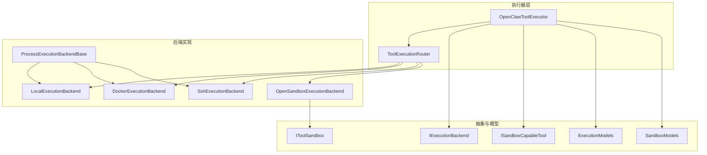
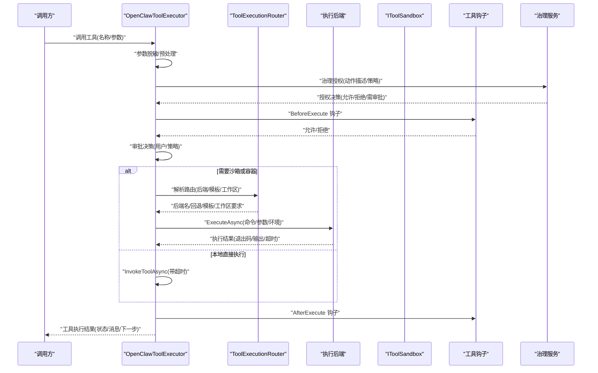
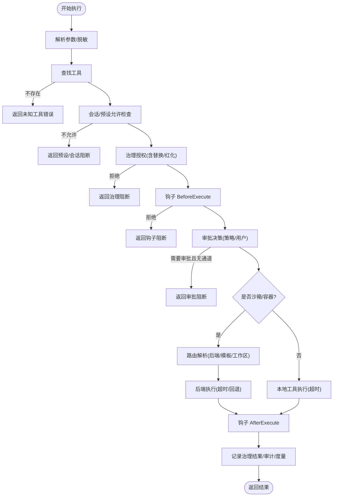
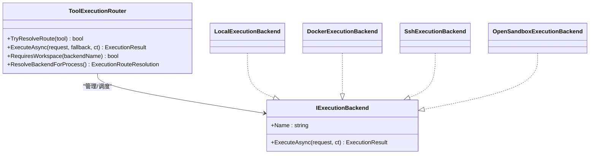
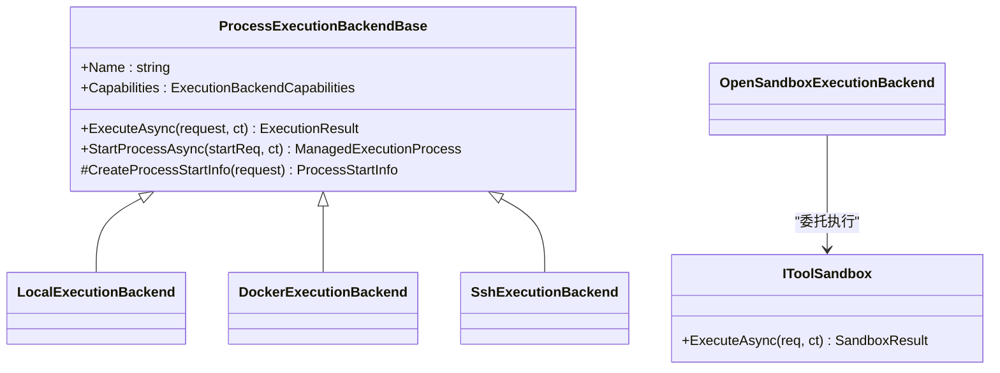
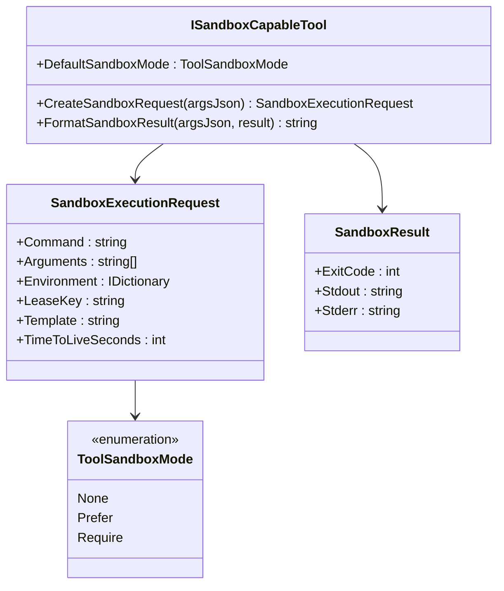
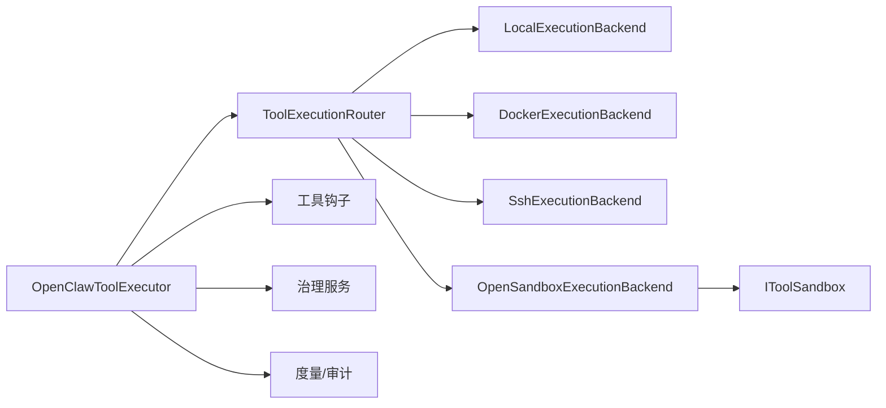

# 工具执行

<cite>
**本文引用的文件**
- [OpenClawToolExecutor.cs](file://src/OpenClaw.Agent/OpenClawToolExecutor.cs)
- [ToolExecutionRouter.cs](file://src/OpenClaw.Agent/Execution/ToolExecutionRouter.cs)
- [LocalExecutionBackend.cs](file://src/OpenClaw.Agent/Execution/LocalExecutionBackend.cs)
- [DockerExecutionBackend.cs](file://src/OpenClaw.Agent/Execution/DockerExecutionBackend.cs)
- [OpenSandboxExecutionBackend.cs](file://src/OpenClaw.Agent/Execution/OpenSandboxExecutionBackend.cs)
- [SshExecutionBackend.cs](file://src/OpenClaw.Agent/Execution/SshExecutionBackend.cs)
- [ProcessExecutionBackendBase.cs](file://src/OpenClaw.Agent/Execution/ProcessExecutionBackendBase.cs)
- [IExecutionBackend.cs](file://src/OpenClaw.Core/Abstractions/IExecutionBackend.cs)
- [IToolSandbox.cs](file://src/OpenClaw.Core/Abstractions/IToolSandbox.cs)
- [ISandboxCapableTool.cs](file://src/OpenClaw.Core/Abstractions/ISandboxCapableTool.cs)
- [ExecutionModels.cs](file://src/OpenClaw.Core/Models/ExecutionModels.cs)
- [SandboxModels.cs](file://src/OpenClaw.Core/Models/SandboxModels.cs)
- [GatewayConfig.cs](file://src/OpenClaw.Core/Models/GatewayConfig.cs)
</cite>

## 目录
1. [简介](#简介)
2. [项目结构](#项目结构)
3. [核心组件](#核心组件)
4. [架构总览](#架构总览)
5. [详细组件分析](#详细组件分析)
6. [依赖关系分析](#依赖关系分析)
7. [性能考量](#性能考量)
8. [故障排查指南](#故障排查指南)
9. [结论](#结论)
10. [附录](#附录)

## 简介
本文件面向 OpenClaw 工具执行系统，围绕 OpenClawToolExecutor 的核心架构与执行后端管理，系统性阐述工具调用流程、执行上下文管理、权限控制策略、工具沙箱机制、超时与重试、资源限制与监控指标，并覆盖本地执行、Docker 容器执行、OpenSandbox 安全执行等多执行模式。文档同时解释工具注册机制、执行路由决策、工作区约束、失败分类与恢复建议，帮助开发者与运维人员快速理解并正确配置与扩展工具执行能力。

## 项目结构
工具执行相关代码主要分布在以下模块：
- 执行器与路由：OpenClawToolExecutor、ToolExecutionRouter
- 执行后端：LocalExecutionBackend、DockerExecutionBackend、OpenSandboxExecutionBackend、SshExecutionBackend、ProcessExecutionBackendBase
- 抽象与模型：IExecutionBackend、IToolSandbox、ISandboxCapableTool、ExecutionModels、SandboxModels
- 配置：GatewayConfig（含 ExecutionConfig、ToolingConfig）

图表来源
- [OpenClawToolExecutor.cs](file://src/OpenClaw.Agent/OpenClawToolExecutor.cs)
- [ToolExecutionRouter.cs](file://src/OpenClaw.Agent/Execution/ToolExecutionRouter.cs)
- [LocalExecutionBackend.cs](file://src/OpenClaw.Agent/Execution/LocalExecutionBackend.cs)
- [DockerExecutionBackend.cs](file://src/OpenClaw.Agent/Execution/DockerExecutionBackend.cs)
- [OpenSandboxExecutionBackend.cs](file://src/OpenClaw.Agent/Execution/OpenSandboxExecutionBackend.cs)
- [SshExecutionBackend.cs](file://src/OpenClaw.Agent/Execution/SshExecutionBackend.cs)
- [ProcessExecutionBackendBase.cs](file://src/OpenClaw.Agent/Execution/ProcessExecutionBackendBase.cs)
- [IExecutionBackend.cs](file://src/OpenClaw.Core/Abstractions/IExecutionBackend.cs)
- [IToolSandbox.cs](file://src/OpenClaw.Core/Abstractions/IToolSandbox.cs)
- [ISandboxCapableTool.cs](file://src/OpenClaw.Core/Abstractions/ISandboxCapableTool.cs)
- [ExecutionModels.cs](file://src/OpenClaw.Core/Models/ExecutionModels.cs)
- [SandboxModels.cs](file://src/OpenClaw.Core/Models/SandboxModels.cs)

章节来源
- [OpenClawToolExecutor.cs](file://src/OpenClaw.Agent/OpenClawToolExecutor.cs)
- [ToolExecutionRouter.cs](file://src/OpenClaw.Agent/Execution/ToolExecutionRouter.cs)
- [ExecutionModels.cs](file://src/OpenClaw.Core/Models/ExecutionModels.cs)
- [GatewayConfig.cs](file://src/OpenClaw.Core/Models/GatewayConfig.cs)

## 核心组件
- OpenClawToolExecutor：工具执行主控，负责工具声明、会话与转轮上下文、治理授权、审批流程、钩子、超时与重试、结果归档与审计、度量上报。
- ToolExecutionRouter：根据工具与配置解析执行路由，选择后端（local/docker/ssh/opensandbox），支持回退与模板化执行。
- 执行后端：ProcessExecutionBackendBase 及其派生类封装进程生命周期、超时、输出捕获；OpenSandboxExecutionBackend 封装沙箱执行。
- 抽象与模型：定义执行请求/结果、后端能力、沙箱模式与请求/结果等契约。

章节来源
- [OpenClawToolExecutor.cs](file://src/OpenClaw.Agent/OpenClawToolExecutor.cs)
- [ToolExecutionRouter.cs](file://src/OpenClaw.Agent/Execution/ToolExecutionRouter.cs)
- [ProcessExecutionBackendBase.cs](file://src/OpenClaw.Agent/Execution/ProcessExecutionBackendBase.cs)
- [IExecutionBackend.cs](file://src/OpenClaw.Core/Abstractions/IExecutionBackend.cs)
- [IToolSandbox.cs](file://src/OpenClaw.Core/Abstractions/IToolSandbox.cs)
- [ISandboxCapableTool.cs](file://src/OpenClaw.Core/Abstractions/ISandboxCapableTool.cs)
- [ExecutionModels.cs](file://src/OpenClaw.Core/Models/ExecutionModels.cs)
- [SandboxModels.cs](file://src/OpenClaw.Core/Models/SandboxModels.cs)

## 架构总览
下图展示从工具调用到执行完成的关键交互路径，包括治理授权、审批、路由与后端执行、结果格式化与审计记录。

图表来源
- [OpenClawToolExecutor.cs](file://src/OpenClaw.Agent/OpenClawToolExecutor.cs)
- [ToolExecutionRouter.cs](file://src/OpenClaw.Agent/Execution/ToolExecutionRouter.cs)
- [IExecutionBackend.cs](file://src/OpenClaw.Core/Abstractions/IExecutionBackend.cs)
- [IToolSandbox.cs](file://src/OpenClaw.Core/Abstractions/IToolSandbox.cs)

## 详细组件分析

### OpenClawToolExecutor：执行主控与治理编排
- 工具注册与声明：以字典维护工具名到 ITool 实例映射，动态替换 MCP 工具时保持原子性。
- 会话与预设：按会话与工具预设过滤可用工具集合，支持路由白名单。
- 治理与审批：解析动作描述与治理描述，调用治理服务进行授权；结合计划-执行-验证（PEV）决策；支持用户回调审批；对变更后的批准指纹进行校验。
- 超时与重试：统一工具级超时；流式工具独立超时；异常分类与失败码；失败计数与告警。
- 结果归档与审计：记录治理结果、度量指标、审计日志；对结果与消息进行脱敏。
- 流式工具：支持 IStreamingTool 的增量输出收集与脱敏转发。

图表来源
- [OpenClawToolExecutor.cs](file://src/OpenClaw.Agent/OpenClawToolExecutor.cs)

章节来源
- [OpenClawToolExecutor.cs](file://src/OpenClaw.Agent/OpenClawToolExecutor.cs)

### ToolExecutionRouter：执行路由与后端选择
- 后端注册：基于配置 profiles 动态注册 local/docker/ssh/opensandbox 后端；支持默认后端与回退后端。
- 路由解析：优先使用工具级路由配置；否则根据 ISandboxCapableTool 的默认沙箱模式与策略解析；当启用 OpenSandbox 且工具需要沙箱时，自动路由至 opensandbox 并可回退。
- 工作区要求：判断后端类型是否需要工作区根目录约束。
- 进程后端判定：识别隔离型进程后端（非 opensandbox 且为进程型后端）。

图表来源
- [ToolExecutionRouter.cs](file://src/OpenClaw.Agent/Execution/ToolExecutionRouter.cs)
- [LocalExecutionBackend.cs](file://src/OpenClaw.Agent/Execution/LocalExecutionBackend.cs)
- [DockerExecutionBackend.cs](file://src/OpenClaw.Agent/Execution/DockerExecutionBackend.cs)
- [SshExecutionBackend.cs](file://src/OpenClaw.Agent/Execution/SshExecutionBackend.cs)
- [OpenSandboxExecutionBackend.cs](file://src/OpenClaw.Agent/Execution/OpenSandboxExecutionBackend.cs)
- [IExecutionBackend.cs](file://src/OpenClaw.Core/Abstractions/IExecutionBackend.cs)

章节来源
- [ToolExecutionRouter.cs](file://src/OpenClaw.Agent/Execution/ToolExecutionRouter.cs)

### 执行后端：进程与沙箱执行
- ProcessExecutionBackendBase：统一进程启动、输出捕获、超时控制与杀进程树；支持交互式输入与 PTY 能力（视平台与后端能力）。
- LocalExecutionBackend：本地进程执行，支持工作区根目录约束与相对路径展开；不强制工作区时可自由目录。
- DockerExecutionBackend：通过 docker run 执行，支持镜像、工作目录、环境变量注入与参数拼接。
- SshExecutionBackend：通过 ssh 远程执行，支持密钥认证、端口、工作目录切换与环境变量注入。
- OpenSandboxExecutionBackend：委托 IToolSandbox 执行，内置超时控制与超时结果标准化。

图表来源
- [ProcessExecutionBackendBase.cs](file://src/OpenClaw.Agent/Execution/ProcessExecutionBackendBase.cs)
- [LocalExecutionBackend.cs](file://src/OpenClaw.Agent/Execution/LocalExecutionBackend.cs)
- [DockerExecutionBackend.cs](file://src/OpenClaw.Agent/Execution/DockerExecutionBackend.cs)
- [SshExecutionBackend.cs](file://src/OpenClaw.Agent/Execution/SshExecutionBackend.cs)
- [OpenSandboxExecutionBackend.cs](file://src/OpenClaw.Agent/Execution/OpenSandboxExecutionBackend.cs)
- [IToolSandbox.cs](file://src/OpenClaw.Core/Abstractions/IToolSandbox.cs)

章节来源
- [ProcessExecutionBackendBase.cs](file://src/OpenClaw.Agent/Execution/ProcessExecutionBackendBase.cs)
- [LocalExecutionBackend.cs](file://src/OpenClaw.Agent/Execution/LocalExecutionBackend.cs)
- [DockerExecutionBackend.cs](file://src/OpenClaw.Agent/Execution/DockerExecutionBackend.cs)
- [SshExecutionBackend.cs](file://src/OpenClaw.Agent/Execution/SshExecutionBackend.cs)
- [OpenSandboxExecutionBackend.cs](file://src/OpenClaw.Agent/Execution/OpenSandboxExecutionBackend.cs)

### 沙箱与工具能力：ISandboxCapableTool 与策略
- ISandboxCapableTool：定义默认沙箱模式、创建沙箱请求、格式化沙箱结果。
- ToolSandboxMode：None/Prefer/Require，用于策略解析与路由决策。
- SandboxExecutionRequest/SandboxResult：标准化沙箱执行请求与结果。

图表来源
- [ISandboxCapableTool.cs](file://src/OpenClaw.Core/Abstractions/ISandboxCapableTool.cs)
- [SandboxModels.cs](file://src/OpenClaw.Core/Models/SandboxModels.cs)

章节来源
- [ISandboxCapableTool.cs](file://src/OpenClaw.Core/Abstractions/ISandboxCapableTool.cs)
- [SandboxModels.cs](file://src/OpenClaw.Core/Models/SandboxModels.cs)

### 权限控制与治理：授权、审批与审计
- 治理授权：解析动作描述与治理描述，调用 IToolGovernanceService 授权；支持参数红化与替换。
- 审批流程：策略/用户双重审批；PEV 决策影响最终是否需要审批。
- 审计与度量：记录治理决策、执行耗时、字节数、失败原因；异常分类与失败码。

章节来源
- [OpenClawToolExecutor.cs](file://src/OpenClaw.Agent/OpenClawToolExecutor.cs)

### 工具注册机制与声明
- 工具注册：构造时以工具名建立字典映射；支持热更新替换 MCP 工具，保持原子性。
- 声明生成：根据工具参数 Schema 生成 AI 函数声明，供上层模型调用。

章节来源
- [OpenClawToolExecutor.cs](file://src/OpenClaw.Agent/OpenClawToolExecutor.cs)

### 执行上下文与会话
- 上下文：Session、TurnContext、ToolExecutionContext；用于权限、审计、度量与钩子。
- 会话过滤：按会话路由白名单与预设允许工具集合过滤。

章节来源
- [OpenClawToolExecutor.cs](file://src/OpenClaw.Agent/OpenClawToolExecutor.cs)

### 错误处理与重试机制
- 超时：工具级超时；流式工具独立超时；超时返回标准化失败。
- 异常分类：操作取消、沙箱异常、运行时能力缺失、浏览器后端缺失等；失败码与下一步建议。
- 回退：当后端不可用时，按配置进行回退（如本地回退）。

章节来源
- [OpenClawToolExecutor.cs](file://src/OpenClaw.Agent/OpenClawToolExecutor.cs)
- [ToolExecutionRouter.cs](file://src/OpenClaw.Agent/Execution/ToolExecutionRouter.cs)

### 资源限制与监控指标
- 资源限制：后端超时、工作区根目录限制、路径白/黑名单、URL 安全策略。
- 监控指标：工具调用次数、超时次数、执行耗时直方图、失败计数；审计日志包含治理决策与评估耗时。

章节来源
- [GatewayConfig.cs](file://src/OpenClaw.Core/Models/GatewayConfig.cs)
- [ExecutionModels.cs](file://src/OpenClaw.Core/Models/ExecutionModels.cs)
- [OpenClawToolExecutor.cs](file://src/OpenClaw.Agent/OpenClawToolExecutor.cs)

## 依赖关系分析
- 组件耦合：OpenClawToolExecutor 依赖 ToolExecutionRouter、IToolSandbox、治理服务、钩子、度量与审计；Router 依赖后端实现与配置。
- 外部依赖：进程执行依赖系统命令（docker/ssh）、IToolSandbox 提供者（如 OpenSandbox）。
- 循环依赖：未见循环依赖迹象。

图表来源
- [OpenClawToolExecutor.cs](file://src/OpenClaw.Agent/OpenClawToolExecutor.cs)
- [ToolExecutionRouter.cs](file://src/OpenClaw.Agent/Execution/ToolExecutionRouter.cs)
- [OpenSandboxExecutionBackend.cs](file://src/OpenClaw.Agent/Execution/OpenSandboxExecutionBackend.cs)
- [IToolSandbox.cs](file://src/OpenClaw.Core/Abstractions/IToolSandbox.cs)

章节来源
- [OpenClawToolExecutor.cs](file://src/OpenClaw.Agent/OpenClawToolExecutor.cs)
- [ToolExecutionRouter.cs](file://src/OpenClaw.Agent/Execution/ToolExecutionRouter.cs)

## 性能考量
- 超时控制：统一工具级超时，避免长尾阻塞；流式工具独立超时，防止内存膨胀。
- 并行执行：可配置独立工具调用并发执行，提升吞吐。
- 输出截断：流式结果在达到阈值后截断并追加省略标记，平衡实时性与内存占用。
- 度量与告警：失败计数、超时计数、执行耗时直方图，便于容量规划与问题定位。

## 故障排查指南
- 未知工具：确认工具已注册且名称匹配；检查热更新替换是否成功。
- 预设/会话阻断：核对会话路由白名单与工具预设允许集合。
- 治理拒绝：查看治理决策原因、策略 ID、信任分与评估耗时；必要时调整治理策略或侧车配置。
- 需要审批：确认审批通道可用与审批超时设置；检查 PEV 决策与动作描述。
- 沙箱/后端不可用：检查 OpenSandbox 提供者配置与可用性；核对后端超时与回退策略；确认工作区根目录与模板配置。
- 本地执行受限：浏览器工具可能禁用本地执行；检查工具能力与策略。
- 失败码与下一步：依据失败码与下一步建议进行修复（如配置浏览器后端、调整工具策略、放宽路径限制等）。

章节来源
- [OpenClawToolExecutor.cs](file://src/OpenClaw.Agent/OpenClawToolExecutor.cs)
- [ToolExecutionRouter.cs](file://src/OpenClaw.Agent/Execution/ToolExecutionRouter.cs)

## 结论
OpenClaw 工具执行系统以 OpenClawToolExecutor 为核心，结合 ToolExecutionRouter 的灵活路由与多种执行后端，实现了从本地到容器再到 OpenSandbox 的安全执行路径。通过治理授权、审批与审计、超时与回退、度量与监控，系统在保证安全性的同时提供了良好的可观测性与可扩展性。建议在生产环境中严格配置工作区根目录、URL 安全策略与治理策略，并合理设置超时与并发参数以获得最佳性能与稳定性。

## 附录
- 配置要点：ExecutionConfig（默认后端、后端配置、工具路由）、ToolingConfig（工具超时、审批、工作区、路径白/黑名单、浏览器策略）。
- 关键模型：ExecutionRequest/Result、SandboxExecutionRequest/SandboxResult、ToolSandboxMode。

章节来源
- [GatewayConfig.cs](file://src/OpenClaw.Core/Models/GatewayConfig.cs)
- [ExecutionModels.cs](file://src/OpenClaw.Core/Models/ExecutionModels.cs)
- [SandboxModels.cs](file://src/OpenClaw.Core/Models/SandboxModels.cs)