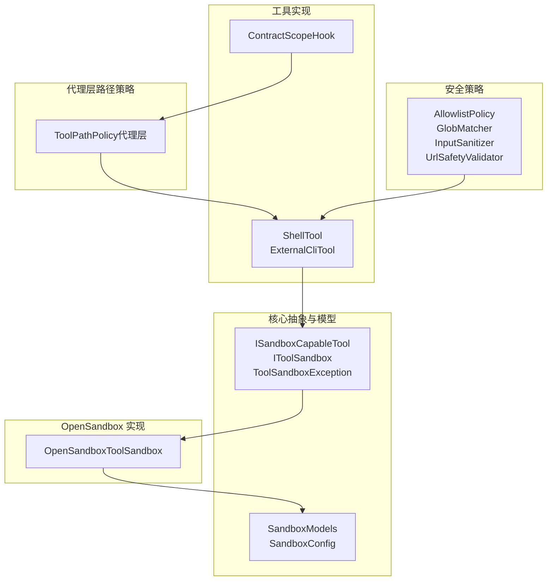
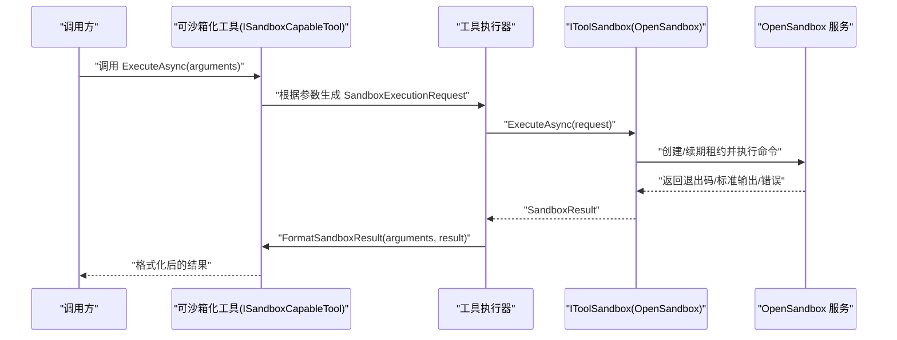
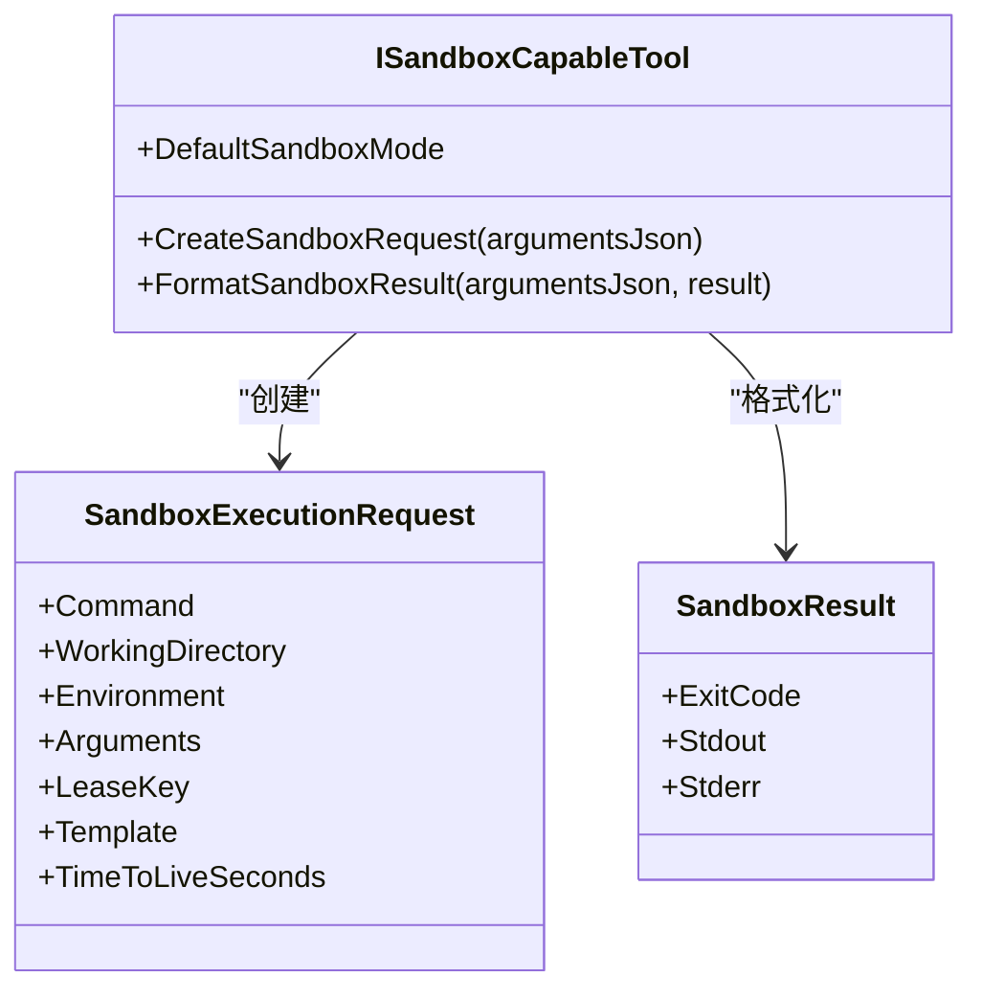
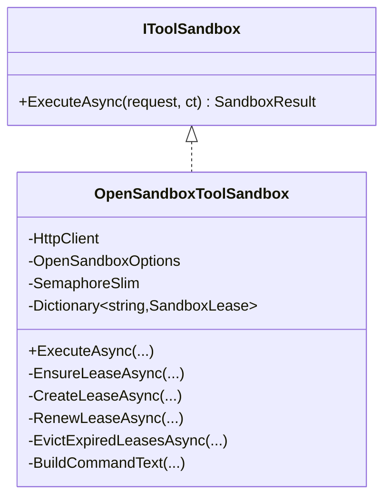
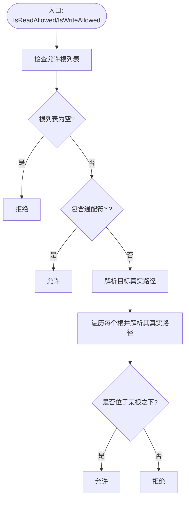
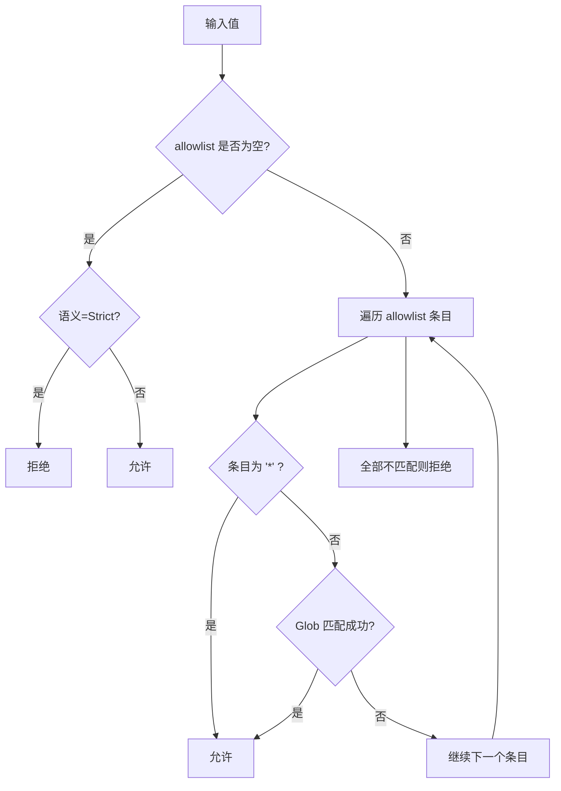
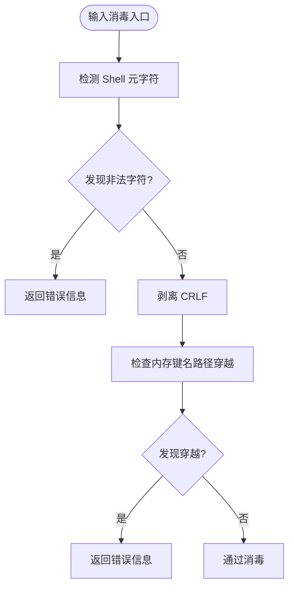
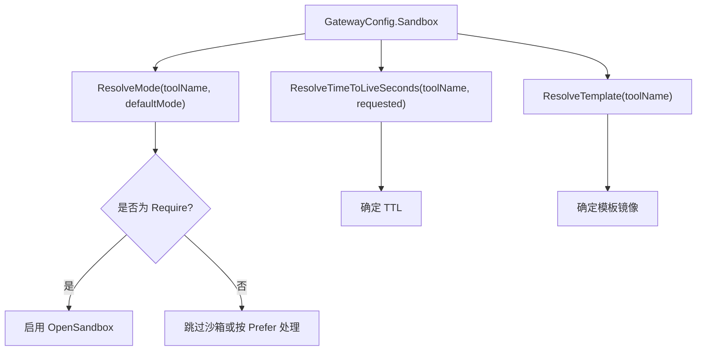
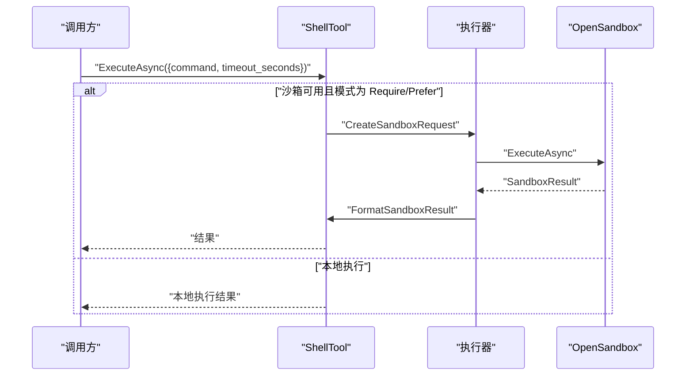
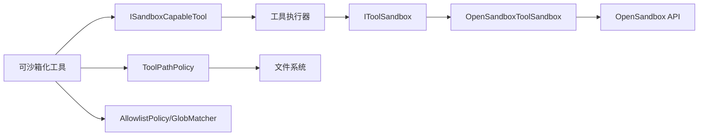

# 工具沙箱

<cite>
**本文引用的文件**
- [ISandboxCapableTool.cs](file://src/OpenClaw.Core/Abstractions/ISandboxCapableTool.cs)
- [IToolSandbox.cs](file://src/OpenClaw.Core/Abstractions/IToolSandbox.cs)
- [ToolSandboxException.cs](file://src/OpenClaw.Core/Abstractions/ToolSandboxException.cs)
- [SandboxModels.cs](file://src/OpenClaw.Core/Models/SandboxModels.cs)
- [SandboxConfig.cs](file://src/OpenClaw.Core/Models/SandboxConfig.cs)
- [OpenSandboxToolSandbox.cs](file://src/OpenClawNet.Sandbox.OpenSandbox/OpenSandboxToolSandbox.cs)
- [ToolPathPolicy.cs（代理层）](file://src/OpenClaw.Agent/Tools/ToolPathPolicy.cs)
- [ToolPathPolicy.cs（测试）](file://src/OpenClaw.Tests/ToolPathPolicyTests.cs)
- [AllowlistPolicy.cs](file://src/OpenClaw.Core/Security/AllowlistPolicy.cs)
- [GlobMatcher.cs](file://src/OpenClaw.Core/Security/GlobMatcher.cs)
- [InputSanitizer.cs](file://src/OpenClaw.Core/Security/InputSanitizer.cs)
- [UrlSafetyValidator.cs](file://src/OpenClaw.Core/Security/UrlSafetyValidator.cs)
- [ShellTool.cs](file://src/OpenClaw.Agent/Tools/ShellTool.cs)
- [ExternalCliTool.cs](file://src/OpenClaw.Agent/Tools/ExternalCliTool.cs)
- [ContractScopeHook.cs](file://src/OpenClaw.Agent/ContractScopeHook.cs)
- [OpenClawToolExecutorTests.cs](file://src/OpenClaw.Tests/OpenClawToolExecutorTests.cs)
</cite>

## 目录
1. [简介](#简介)
2. [项目结构](#项目结构)
3. [核心组件](#核心组件)
4. [架构总览](#架构总览)
5. [详细组件分析](#详细组件分析)
6. [依赖关系分析](#依赖关系分析)
7. [性能考量](#性能考量)
8. [故障排查指南](#故障排查指南)
9. [结论](#结论)
10. [附录：配置与最佳实践](#附录配置与最佳实践)

## 简介
本文件系统性阐述工具沙箱机制的设计与实现，围绕以下关键主题展开：
- ISandboxCapableTool 接口设计：定义“可沙箱化工具”的能力边界、默认沙箱模式、沙箱执行请求构建与结果格式化。
- IToolSandbox 抽象与 OpenSandbox 实现：统一沙箱执行接口，并通过 OpenSandbox 提供容器化隔离能力。
- ToolPathPolicy 路径策略：基于真实路径解析与符号链接安全校验，确保读写操作在受控根目录内进行。
- AllowlistPolicy 白名单策略：支持严格与兼容两种语义，结合通配符匹配实现灵活的允许/拒绝判定。
- 输入消毒与安全策略：Shell 元字符检测、CRLF 清理、URL 安全校验、内存键名路径穿越防护等。
- 隔离级别、性能影响、配置选项与安全最佳实践：帮助读者在生产中正确启用与优化沙箱。

## 项目结构
与工具沙箱直接相关的代码分布在如下模块：
- 核心抽象与模型：OpenClaw.Core（接口、异常、模型、策略）
- OpenSandbox 实现：OpenClawNet.Sandbox.OpenSandbox（HTTP 客户端、租约管理、命令构建）
- 代理层路径策略：OpenClaw.Agent.Tools（对 ToolingConfig 的路径访问控制）
- 安全策略与工具实现：OpenClaw.Core.Security（白名单、通配符、输入消毒、URL 校验）、OpenClaw.Agent.Tools（ShellTool、ExternalCliTool 等）

**图表来源**
- [ISandboxCapableTool.cs:1-13](file://src/OpenClaw.Core/Abstractions/ISandboxCapableTool.cs#L1-L13)
- [IToolSandbox.cs:1-11](file://src/OpenClaw.Core/Abstractions/IToolSandbox.cs#L1-L11)
- [ToolSandboxException.cs:1-28](file://src/OpenClaw.Core/Abstractions/ToolSandboxException.cs#L1-L28)
- [SandboxModels.cs:1-28](file://src/OpenClaw.Core/Models/SandboxModels.cs#L1-L28)
- [SandboxConfig.cs:1-152](file://src/OpenClaw.Core/Models/SandboxConfig.cs#L1-L152)
- [OpenSandboxToolSandbox.cs:1-427](file://src/OpenClawNet.Sandbox.OpenSandbox/OpenSandboxToolSandbox.cs#L1-L427)
- [ToolPathPolicy.cs（代理层）:1-132](file://src/OpenClaw.Agent/Tools/ToolPathPolicy.cs#L1-L132)
- [AllowlistPolicy.cs:1-43](file://src/OpenClaw.Core/Security/AllowlistPolicy.cs#L1-L43)
- [GlobMatcher.cs:1-89](file://src/OpenClaw.Core/Security/GlobMatcher.cs#L1-L89)
- [InputSanitizer.cs:1-38](file://src/OpenClaw.Core/Security/InputSanitizer.cs#L1-L38)
- [UrlSafetyValidator.cs:1-43](file://src/OpenClaw.Core/Security/UrlSafetyValidator.cs#L1-L43)
- [ShellTool.cs:1-193](file://src/OpenClaw.Agent/Tools/ShellTool.cs#L1-L193)
- [ExternalCliTool.cs:1-252](file://src/OpenClaw.Agent/Tools/ExternalCliTool.cs#L1-L252)
- [ContractScopeHook.cs:121-156](file://src/OpenClaw.Agent/ContractScopeHook.cs#L121-L156)

**章节来源**
- [ISandboxCapableTool.cs:1-13](file://src/OpenClaw.Core/Abstractions/ISandboxCapableTool.cs#L1-L13)
- [IToolSandbox.cs:1-11](file://src/OpenClaw.Core/Abstractions/IToolSandbox.cs#L1-L11)
- [ToolSandboxException.cs:1-28](file://src/OpenClaw.Core/Abstractions/ToolSandboxException.cs#L1-L28)
- [SandboxModels.cs:1-28](file://src/OpenClaw.Core/Models/SandboxModels.cs#L1-L28)
- [SandboxConfig.cs:1-152](file://src/OpenClaw.Core/Models/SandboxConfig.cs#L1-L152)
- [OpenSandboxToolSandbox.cs:1-427](file://src/OpenClawNet.Sandbox.OpenSandbox/OpenSandboxToolSandbox.cs#L1-L427)
- [ToolPathPolicy.cs（代理层）:1-132](file://src/OpenClaw.Agent/Tools/ToolPathPolicy.cs#L1-L132)
- [AllowlistPolicy.cs:1-43](file://src/OpenClaw.Core/Security/AllowlistPolicy.cs#L1-L43)
- [GlobMatcher.cs:1-89](file://src/OpenClaw.Core/Security/GlobMatcher.cs#L1-L89)
- [InputSanitizer.cs:1-38](file://src/OpenClaw.Core/Security/InputSanitizer.cs#L1-L38)
- [UrlSafetyValidator.cs:1-43](file://src/OpenClaw.Core/Security/UrlSafetyValidator.cs#L1-L43)
- [ShellTool.cs:1-193](file://src/OpenClaw.Agent/Tools/ShellTool.cs#L1-L193)
- [ExternalCliTool.cs:1-252](file://src/OpenClaw.Agent/Tools/ExternalCliTool.cs#L1-L252)
- [ContractScopeHook.cs:121-156](file://src/OpenClaw.Agent/ContractScopeHook.cs#L121-L156)

## 核心组件
- ISandboxCapableTool：声明工具的默认沙箱模式、如何从 JSON 参数生成沙箱执行请求、以及如何格式化沙箱结果。
- IToolSandbox：统一的沙箱执行接口，屏蔽具体后端差异。
- OpenSandboxToolSandbox：IToolSandbox 的 OpenSandbox 实现，负责租约生命周期、命令构建、环境变量校验、超时与重试、错误分类与回收。
- SandboxModels：定义 ToolSandboxMode、SandboxExecutionRequest、SandboxResult 等核心数据结构。
- SandboxConfig：沙箱提供方、模板、TTL、工具级覆盖等配置解析与决策逻辑。
- ToolPathPolicy：代理层路径策略，基于真实路径解析与符号链接安全校验，限制文件系统访问范围。
- AllowlistPolicy/GlobMatcher：白名单策略与通配符匹配，支持严格与兼容两种语义。
- InputSanitizer/UrlSafetyValidator：输入消毒与 URL 安全校验，降低注入与内网探测风险。
- ShellTool/ExternalCliTool：典型可沙箱化工具实现，展示如何调用 IToolSandbox 并处理结果。

**章节来源**
- [ISandboxCapableTool.cs:1-13](file://src/OpenClaw.Core/Abstractions/ISandboxCapableTool.cs#L1-L13)
- [IToolSandbox.cs:1-11](file://src/OpenClaw.Core/Abstractions/IToolSandbox.cs#L1-L11)
- [OpenSandboxToolSandbox.cs:1-427](file://src/OpenClawNet.Sandbox.OpenSandbox/OpenSandboxToolSandbox.cs#L1-L427)
- [SandboxModels.cs:1-28](file://src/OpenClaw.Core/Models/SandboxModels.cs#L1-L28)
- [SandboxConfig.cs:1-152](file://src/OpenClaw.Core/Models/SandboxConfig.cs#L1-L152)
- [ToolPathPolicy.cs（代理层）:1-132](file://src/OpenClaw.Agent/Tools/ToolPathPolicy.cs#L1-L132)
- [AllowlistPolicy.cs:1-43](file://src/OpenClaw.Core/Security/AllowlistPolicy.cs#L1-L43)
- [GlobMatcher.cs:1-89](file://src/OpenClaw.Core/Security/GlobMatcher.cs#L1-L89)
- [InputSanitizer.cs:1-38](file://src/OpenClaw.Core/Security/InputSanitizer.cs#L1-L38)
- [UrlSafetyValidator.cs:1-43](file://src/OpenClaw.Core/Security/UrlSafetyValidator.cs#L1-L43)
- [ShellTool.cs:1-193](file://src/OpenClaw.Agent/Tools/ShellTool.cs#L1-L193)
- [ExternalCliTool.cs:1-252](file://src/OpenClaw.Agent/Tools/ExternalCliTool.cs#L1-L252)

## 架构总览
下图展示了“可沙箱化工具”到“OpenSandbox 执行器”的端到端流程，包括配置解析、路径策略、安全校验与结果格式化。

**图表来源**
- [ISandboxCapableTool.cs:1-13](file://src/OpenClaw.Core/Abstractions/ISandboxCapableTool.cs#L1-L13)
- [IToolSandbox.cs:1-11](file://src/OpenClaw.Core/Abstractions/IToolSandbox.cs#L1-L11)
- [OpenSandboxToolSandbox.cs:48-81](file://src/OpenClawNet.Sandbox.OpenSandbox/OpenSandboxToolSandbox.cs#L48-L81)
- [SandboxModels.cs:10-26](file://src/OpenClaw.Core/Models/SandboxModels.cs#L10-L26)
- [SandboxConfig.cs:124-152](file://src/OpenClaw.Core/Models/SandboxConfig.cs#L124-L152)
- [ShellTool.cs:87-113](file://src/OpenClaw.Agent/Tools/ShellTool.cs#L87-L113)

## 详细组件分析

### ISandboxCapableTool 接口设计
- DefaultSandboxMode：工具的默认沙箱模式（None/Prefer/Require），用于在未显式配置时的回退策略。
- CreateSandboxRequest：将工具参数 JSON 转换为标准化的 SandboxExecutionRequest，包含命令、工作目录、环境变量、参数、租约键、模板与 TTL。
- FormatSandboxResult：将沙箱执行结果标准化为工具可读的文本，便于后续处理或上报。

**图表来源**
- [ISandboxCapableTool.cs:5-12](file://src/OpenClaw.Core/Abstractions/ISandboxCapableTool.cs#L5-L12)
- [SandboxModels.cs:10-26](file://src/OpenClaw.Core/Models/SandboxModels.cs#L10-L26)

**章节来源**
- [ISandboxCapableTool.cs:1-13](file://src/OpenClaw.Core/Abstractions/ISandboxCapableTool.cs#L1-L13)
- [SandboxModels.cs:1-28](file://src/OpenClaw.Core/Models/SandboxModels.cs#L1-L28)

### IToolSandbox 抽象与 OpenSandbox 实现
- IToolSandbox：定义 ExecuteAsync(SandboxExecutionRequest) -> SandboxResult 的统一契约。
- OpenSandboxToolSandbox：
  - 租约管理：支持一次性租约与持久租约；并发安全；过期清理；丢失租约自动恢复。
  - 命令构建：拼装 export、cd、最终命令，校验环境变量名合法性。
  - 错误处理：区分 5xx（不可用）、4xx（参数错误）、缺失租约（重建）等。
  - 指标与日志：记录租约创建/复用/恢复次数、调试日志。

**图表来源**
- [IToolSandbox.cs:5-10](file://src/OpenClaw.Core/Abstractions/IToolSandbox.cs#L5-L10)
- [OpenSandboxToolSandbox.cs:14-427](file://src/OpenClawNet.Sandbox.OpenSandbox/OpenSandboxToolSandbox.cs#L14-L427)

**章节来源**
- [IToolSandbox.cs:1-11](file://src/OpenClaw.Core/Abstractions/IToolSandbox.cs#L1-L11)
- [OpenSandboxToolSandbox.cs:1-427](file://src/OpenClawNet.Sandbox.OpenSandbox/OpenSandboxToolSandbox.cs#L1-L427)

### ToolPathPolicy 路径策略
- 设计目标：防止通过符号链接逃逸到受控根目录之外，确保读写仅限于允许的根目录集合。
- 关键点：
  - 使用真实路径解析（ResolveRealPath），递归解析符号链接，避免环链导致无限递归。
  - 对不存在文件/目录也进行祖先解析，保证父目录的真实位置被正确评估。
  - 支持通配符“*”与空列表（拒绝所有）等边界情况。
  - Windows 与非 Windows 的大小写敏感性差异处理。

**图表来源**
- [ToolPathPolicy.cs（代理层）:9-35](file://src/OpenClaw.Agent/Tools/ToolPathPolicy.cs#L9-L35)
- [ToolPathPolicy.cs（代理层）:42-73](file://src/OpenClaw.Agent/Tools/ToolPathPolicy.cs#L42-L73)
- [ToolPathPolicy.cs（代理层）:79-110](file://src/OpenClaw.Agent/Tools/ToolPathPolicy.cs#L79-L110)
- [ToolPathPolicy.cs（代理层）:117-130](file://src/OpenClaw.Agent/Tools/ToolPathPolicy.cs#L117-L130)

**章节来源**
- [ToolPathPolicy.cs（代理层）:1-132](file://src/OpenClaw.Agent/Tools/ToolPathPolicy.cs#L1-L132)
- [ToolPathPolicy.cs（测试）:1-185](file://src/OpenClaw.Tests/ToolPathPolicyTests.cs#L1-L185)

### AllowlistPolicy 白名单策略
- 语义：
  - Legacy：空白名单视为“允许全部”，兼容历史行为。
  - Strict：空白名单视为“禁止全部”，更严格的默认策略。
- 匹配：支持通配符“*”与 GlobMatcher，大小写敏感可配置。
- 应用：可用于频道、用户、主机等多类资源的允许/拒绝判定。

**图表来源**
- [AllowlistPolicy.cs:9-41](file://src/OpenClaw.Core/Security/AllowlistPolicy.cs#L9-L41)
- [GlobMatcher.cs:9-63](file://src/OpenClaw.Core/Security/GlobMatcher.cs#L9-L63)

**章节来源**
- [AllowlistPolicy.cs:1-43](file://src/OpenClaw.Core/Security/AllowlistPolicy.cs#L1-L43)
- [GlobMatcher.cs:1-89](file://src/OpenClaw.Core/Security/GlobMatcher.cs#L1-L89)
- [AllowlistPolicyTests.cs:1-34](file://src/OpenClaw.Tests/AllowlistPolicyTests.cs#L1-L34)

### 输入消毒与 URL 安全
- InputSanitizer：
  - Shell 元字符检测：禁用分号、管道、引号、美元、括号、尖括号、换行等，防止命令注入。
  - CRLF 清理：剥离 IMAP/SMTP 协议中的回车与换行，避免行注入。
  - 内存键名路径穿越检测：阻断 ../ 或 \ 等穿越尝试。
- UrlSafetyValidator：
  - 默认阻断 localhost、metadata 等内置黑名单主机。
  - 可配置阻断私有网络目标与 CIDR 列表。
  - DNS 解析前预检，必要时进行异步解析并二次判定。

**图表来源**
- [InputSanitizer.cs:9-38](file://src/OpenClaw.Core/Security/InputSanitizer.cs#L9-L38)

**章节来源**
- [InputSanitizer.cs:1-38](file://src/OpenClaw.Core/Security/InputSanitizer.cs#L1-L38)
- [UrlSafetyValidator.cs:1-43](file://src/OpenClaw.Core/Security/UrlSafetyValidator.cs#L1-L43)

### 配置与策略解析（SandboxConfig）
- 提供方选择：None/OpenSandbox。
- 工具级覆盖：支持为特定工具设置 Mode/Template/TTL，优先级高于全局默认。
- TTL 解析：支持请求级覆盖；否则按工具级或全局默认。
- RequireSandboxed 判定：当 OpenSandbox 已配置且工具模式为 Require 时强制沙箱化。

**图表来源**
- [SandboxConfig.cs:124-152](file://src/OpenClaw.Core/Models/SandboxConfig.cs#L124-L152)

**章节来源**
- [SandboxConfig.cs:1-152](file://src/OpenClaw.Core/Models/SandboxConfig.cs#L1-L152)

### 典型工具实现：ShellTool
- 默认模式：Prefer（优先沙箱，但本地执行也可接受）。
- CreateSandboxRequest：将命令包装为带超时的 /bin/sh -lc，并以 Arguments 传入。
- FormatSandboxResult：将退出码 124 映射为超时，合并 stdout/stderr 输出。
- 本地执行：在未启用沙箱或沙箱不可用时，走本地进程执行，带超时与输出截断保护。

**图表来源**
- [ShellTool.cs:87-113](file://src/OpenClaw.Agent/Tools/ShellTool.cs#L87-L113)
- [OpenSandboxToolSandbox.cs:108-146](file://src/OpenClawNet.Sandbox.OpenSandbox/OpenSandboxToolSandbox.cs#L108-L146)

**章节来源**
- [ShellTool.cs:1-193](file://src/OpenClaw.Agent/Tools/ShellTool.cs#L1-L193)
- [OpenSandboxToolSandbox.cs:1-427](file://src/OpenClawNet.Sandbox.OpenSandbox/OpenSandboxToolSandbox.cs#L1-L427)

### 合同作用域与路径策略集成（ContractScopeHook）
- 将工具的文件系统能力与合同作用域绑定，仅允许在已授权路径范围内进行读写。
- 对路径进行展开与真实路径解析，避免符号链接逃逸。

**章节来源**
- [ContractScopeHook.cs:128-156](file://src/OpenClaw.Agent/ContractScopeHook.cs#L128-L156)

## 依赖关系分析
- 组件耦合：
  - 工具实现依赖 ISandboxCapableTool 与 IToolSandbox，解耦执行后端。
  - OpenSandboxToolSandbox 依赖 OpenSandbox API 与 JSON 序列化上下文。
  - ToolPathPolicy 依赖系统路径解析与符号链接解析 API。
  - AllowlistPolicy/GlobMatcher 独立于平台，提供通用匹配能力。
- 外部依赖：
  - OpenSandbox HTTP API（租约、执行、续期、删除）。
  - 运行时指标与日志框架（用于租约统计与调试）。

**图表来源**
- [ISandboxCapableTool.cs:1-13](file://src/OpenClaw.Core/Abstractions/ISandboxCapableTool.cs#L1-L13)
- [IToolSandbox.cs:1-11](file://src/OpenClaw.Core/Abstractions/IToolSandbox.cs#L1-L11)
- [OpenSandboxToolSandbox.cs:1-427](file://src/OpenClawNet.Sandbox.OpenSandbox/OpenSandboxToolSandbox.cs#L1-L427)
- [ToolPathPolicy.cs（代理层）:1-132](file://src/OpenClaw.Agent/Tools/ToolPathPolicy.cs#L1-L132)
- [AllowlistPolicy.cs:1-43](file://src/OpenClaw.Core/Security/AllowlistPolicy.cs#L1-L43)
- [GlobMatcher.cs:1-89](file://src/OpenClaw.Core/Security/GlobMatcher.cs#L1-L89)

**章节来源**
- [ISandboxCapableTool.cs:1-13](file://src/OpenClaw.Core/Abstractions/ISandboxCapableTool.cs#L1-L13)
- [IToolSandbox.cs:1-11](file://src/OpenClaw.Core/Abstractions/IToolSandbox.cs#L1-L11)
- [OpenSandboxToolSandbox.cs:1-427](file://src/OpenClawNet.Sandbox.OpenSandbox/OpenSandboxToolSandbox.cs#L1-L427)
- [ToolPathPolicy.cs（代理层）:1-132](file://src/OpenClaw.Agent/Tools/ToolPathPolicy.cs#L1-L132)
- [AllowlistPolicy.cs:1-43](file://src/OpenClaw.Core/Security/AllowlistPolicy.cs#L1-L43)
- [GlobMatcher.cs:1-89](file://src/OpenClaw.Core/Security/GlobMatcher.cs#L1-L89)

## 性能考量
- 租约复用：OpenSandboxToolSandbox 通过并发门控与租约字典减少重复创建，显著降低 API 调用开销。
- 命令构建：在内存中拼接 export/cd/cmd，避免额外文件写入。
- 超时与输出截断：本地 ShellTool 在无沙箱场景下限制输出大小与超时，避免资源耗尽。
- 路径解析：最大符号链接深度限制与已访问集合去重，防止环链导致的无限递归与高开销。

[本节为通用性能讨论，无需列出章节来源]

## 故障排查指南
- 沙箱不可用：
  - 5xx：服务端不可用，重试或降级为本地执行。
  - 4xx：参数错误或租约缺失，检查模板、租约键与环境变量命名。
  - 超时：调整 TTL 或缩短命令执行时间。
- 结果异常：
  - 退出码 124：表示超时（OpenSandbox 的 timeout 命令返回），检查命令复杂度与超时设置。
  - 丢失租约：实现具备自动恢复逻辑，若仍失败，检查租约键一致性与模板变更。
- 路径策略拒绝：
  - 符号链接逃逸：确认目标文件/目录的真实解析路径未越界。
  - Windows 大小写：注意路径比较大小写敏感性差异。
- 白名单/URL 安全：
  - 严格模式下空白名单会拒绝所有；如需放开，请添加“*”或具体条目。
  - URL 被阻断：检查 UrlSafetyConfig 的 BlockPrivateNetworkTargets 与 BlockedCidrs 设置。

**章节来源**
- [OpenSandboxToolSandbox.cs:315-350](file://src/OpenClawNet.Sandbox.OpenSandbox/OpenSandboxToolSandbox.cs#L315-L350)
- [ToolPathPolicy.cs（代理层）:45-73](file://src/OpenClaw.Agent/Tools/ToolPathPolicy.cs#L45-L73)
- [UrlSafetyValidator.cs:27-43](file://src/OpenClaw.Core/Security/UrlSafetyValidator.cs#L27-L43)
- [ShellTool.cs:105-113](file://src/OpenClaw.Agent/Tools/ShellTool.cs#L105-L113)

## 结论
工具沙箱机制通过“接口抽象 + 容器化执行 + 多层安全策略”实现了可控、可观测、可扩展的工具执行环境。ISandboxCapableTool 与 IToolSandbox 的清晰职责划分，使工具开发者只需关注参数到命令的映射；OpenSandbox 实现提供了稳定的租约与执行能力；路径策略、白名单与输入消毒共同构成了纵深防御体系。合理配置 SandboxConfig 与安全策略，可在保障安全的同时获得良好的性能与体验。

[本节为总结性内容，无需列出章节来源]

## 附录：配置与最佳实践

### 沙箱隔离级别
- None：不进行沙箱化，直接本地执行（仅在受控环境下使用）。
- Prefer：优先沙箱化，若沙箱不可用则回退本地执行。
- Require：强制沙箱化，必须满足 OpenSandbox 配置与模板要求。

**章节来源**
- [SandboxModels.cs:3-8](file://src/OpenClaw.Core/Models/SandboxModels.cs#L3-L8)
- [SandboxConfig.cs:146-152](file://src/OpenClaw.Core/Models/SandboxConfig.cs#L146-L152)

### 配置项说明
- 提供方与端点：Provider、Endpoint、ApiKey。
- 默认 TTL：DefaultTTL（秒）。
- 工具级覆盖：Tools[toolName].Mode/Template/TTL。
- URL 安全：BlockPrivateNetworkTargets、BlockedCidrs、Enabled 等。

**章节来源**
- [SandboxConfig.cs:1-27](file://src/OpenClaw.Core/Models/SandboxConfig.cs#L1-L27)
- [UrlSafetyValidator.cs:17-43](file://src/OpenClaw.Core/Security/UrlSafetyValidator.cs#L17-L43)

### 安全最佳实践
- 默认采用 Strict 白名单语义，避免历史兼容导致的宽泛放行。
- 路径策略使用精确根目录，避免“*”滥用；对符号链接进行严格解析与越界检查。
- 输入消毒：对所有外部输入进行 Shell 元字符与 CRLF 清理；对路径穿越进行显式检测。
- URL 安全：默认阻断私有网络与 metadata 主机；按需配置阻断列表。
- 沙箱模板：最小化镜像与权限，仅暴露必要工具与资源。
- 监控与审计：开启租约统计与执行日志，定期审查失败与超时事件。

[本节为通用建议，无需列出章节来源]

### 示例：在测试中启用 Require 沙箱
- 将工具模式设为 Require，并指定模板镜像；若 Provider 为 OpenSandbox，则强制走容器执行。
- 若 Provider 为 None，则工具本地执行（仅用于演示与回归测试）。

**章节来源**
- [OpenClawToolExecutorTests.cs:180-214](file://src/OpenClaw.Tests/OpenClawToolExecutorTests.cs#L180-L214)
- [OpenClawToolExecutorTests.cs:340-356](file://src/OpenClaw.Tests/OpenClawToolExecutorTests.cs#L340-L356)