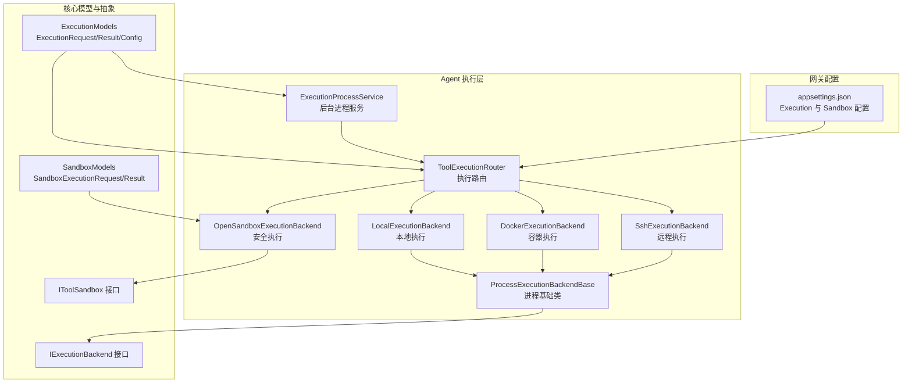
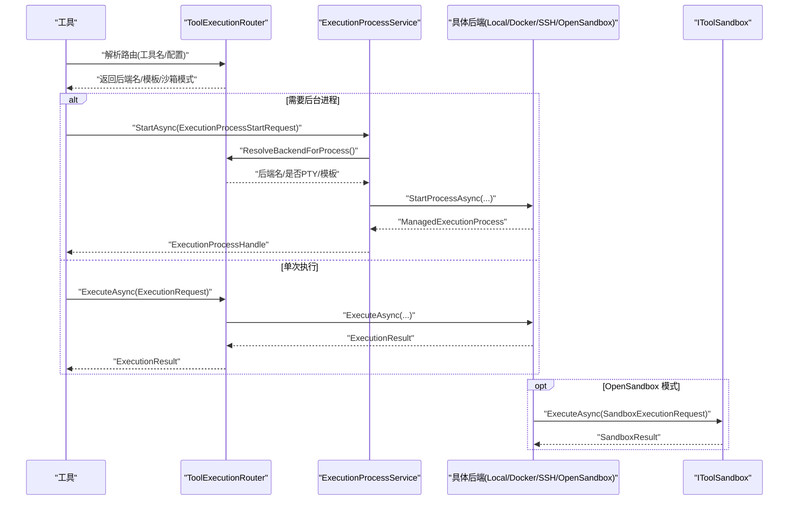
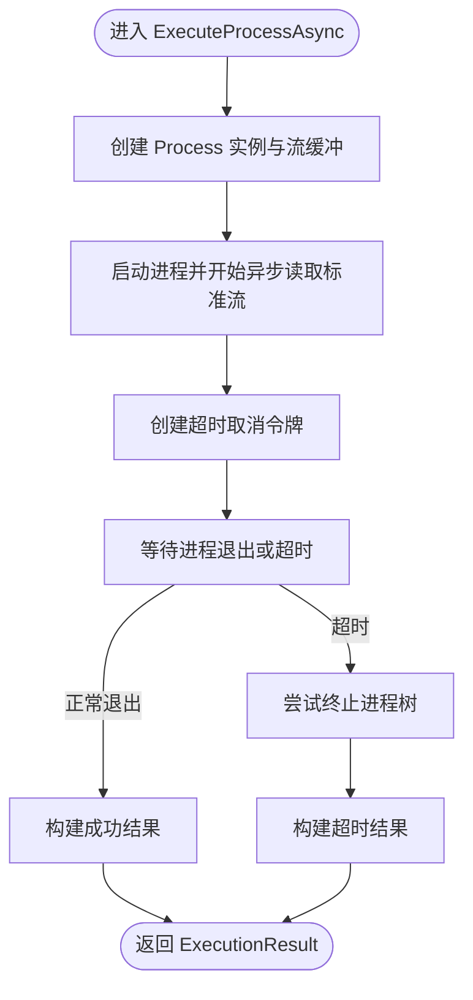
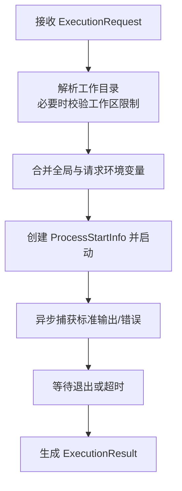
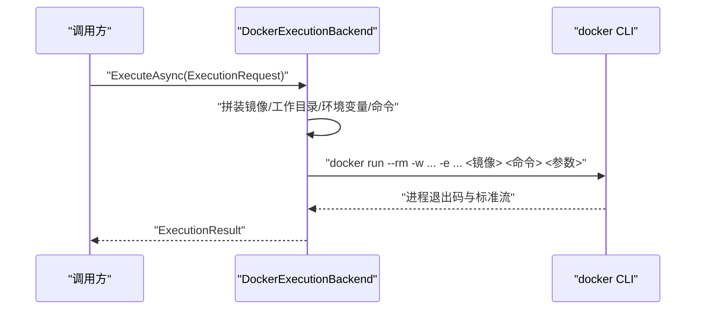
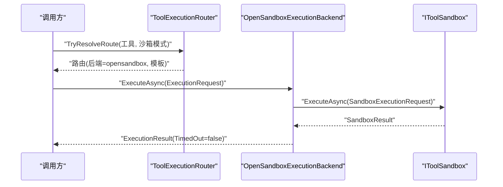
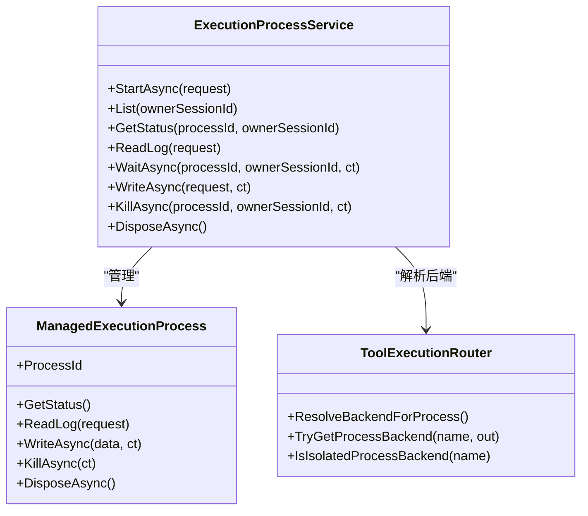
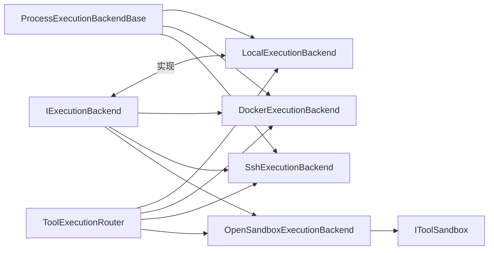

# 执行后端

<cite>
**本文引用的文件**
- [LocalExecutionBackend.cs](file://src/OpenClaw.Agent/Execution/LocalExecutionBackend.cs)
- [DockerExecutionBackend.cs](file://src/OpenClaw.Agent/Execution/DockerExecutionBackend.cs)
- [OpenSandboxExecutionBackend.cs](file://src/OpenClaw.Agent/Execution/OpenSandboxExecutionBackend.cs)
- [ProcessExecutionBackendBase.cs](file://src/OpenClaw.Agent/Execution/ProcessExecutionBackendBase.cs)
- [SshExecutionBackend.cs](file://src/OpenClaw.Agent/Execution/SshExecutionBackend.cs)
- [ExecutionProcessService.cs](file://src/OpenClaw.Agent/Execution/ExecutionProcessService.cs)
- [ToolExecutionRouter.cs](file://src/OpenClaw.Agent/Execution/ToolExecutionRouter.cs)
- [IExecutionBackend.cs](file://src/OpenClaw.Core/Abstractions/IExecutionBackend.cs)
- [IToolSandbox.cs](file://src/OpenClaw.Core/Abstractions/IToolSandbox.cs)
- [ExecutionModels.cs](file://src/OpenClaw.Core/Models/ExecutionModels.cs)
- [SandboxModels.cs](file://src/OpenClaw.Core/Models/SandboxModels.cs)
- [appsettings.json](file://src/OpenClaw.Gateway/appsettings.json)
- [OpenSandboxToolSandbox.cs](file://src/OpenClawNet.Sandbox.OpenSandbox/OpenSandboxToolSandbox.cs)
</cite>

## 目录
1. [简介](#简介)
2. [项目结构](#项目结构)
3. [核心组件](#核心组件)
4. [架构总览](#架构总览)
5. [详细组件分析](#详细组件分析)
6. [依赖关系分析](#依赖关系分析)
7. [性能与安全考量](#性能与安全考量)
8. [故障排查指南](#故障排查指南)
9. [结论](#结论)
10. [附录：配置示例与最佳实践](#附录配置示例与最佳实践)

## 简介
本文件系统性阐述执行后端体系，覆盖本地执行、容器执行、安全执行（OpenSandbox）三类模式，以及统一的基础抽象与进程管理机制。内容包括：
- 各后端实现原理与差异
- 配置方法与典型场景
- 选择策略、性能对比、安全考虑与故障处理
- 具体配置示例与最佳实践

## 项目结构
执行后端位于 Agent 层的 Execution 子模块，围绕统一的请求/结果模型与路由机制工作，并通过工具沙箱在需要时提供安全隔离。

图表来源
- [LocalExecutionBackend.cs:1-99](file://src/OpenClaw.Agent/Execution/LocalExecutionBackend.cs#L1-L99)
- [DockerExecutionBackend.cs:1-66](file://src/OpenClaw.Agent/Execution/DockerExecutionBackend.cs#L1-L66)
- [SshExecutionBackend.cs:1-63](file://src/OpenClaw.Agent/Execution/SshExecutionBackend.cs#L1-L63)
- [OpenSandboxExecutionBackend.cs:1-69](file://src/OpenClaw.Agent/Execution/OpenSandboxExecutionBackend.cs#L1-L69)
- [ProcessExecutionBackendBase.cs:1-142](file://src/OpenClaw.Agent/Execution/ProcessExecutionBackendBase.cs#L1-L142)
- [ExecutionProcessService.cs:1-522](file://src/OpenClaw.Agent/Execution/ExecutionProcessService.cs#L1-L522)
- [ToolExecutionRouter.cs:1-253](file://src/OpenClaw.Agent/Execution/ToolExecutionRouter.cs#L1-L253)
- [IExecutionBackend.cs:1-13](file://src/OpenClaw.Core/Abstractions/IExecutionBackend.cs#L1-L13)
- [IToolSandbox.cs:1-12](file://src/OpenClaw.Core/Abstractions/IToolSandbox.cs#L1-L12)
- [ExecutionModels.cs:1-179](file://src/OpenClaw.Core/Models/ExecutionModels.cs#L1-L179)
- [SandboxModels.cs:1-28](file://src/OpenClaw.Core/Models/SandboxModels.cs#L1-L28)
- [appsettings.json:1-908](file://src/OpenClaw.Gateway/appsettings.json#L1-L908)

章节来源
- [ToolExecutionRouter.cs:28-63](file://src/OpenClaw.Agent/Execution/ToolExecutionRouter.cs#L28-L63)
- [ExecutionModels.cs:8-20](file://src/OpenClaw.Core/Models/ExecutionModels.cs#L8-L20)

## 核心组件
- 统一接口与模型
  - IExecutionBackend：定义后端名称与单次执行能力。
  - ExecutionRequest/ExecutionResult：封装命令、参数、环境变量、工作目录、超时等执行要素与返回信息。
  - ExecutionConfig/ExecutionBackendProfileConfig：执行层配置与后端配置档案。
- 进程基础与后台管理
  - ProcessExecutionBackendBase：抽象出进程启动、标准流捕获、超时控制与进程生命周期管理。
  - ExecutionProcessService：维护后台进程集合、状态查询、日志分页读取、输入写入、超时与终止等。
- 路由与选择
  - ToolExecutionRouter：根据工具与配置解析后端路由，支持默认后端、工具级路由、沙箱模式与模板选择。

章节来源
- [IExecutionBackend.cs:5-12](file://src/OpenClaw.Core/Abstractions/IExecutionBackend.cs#L5-L12)
- [ExecutionModels.cs:62-86](file://src/OpenClaw.Core/Models/ExecutionModels.cs#L62-L86)
- [ProcessExecutionBackendBase.cs:8-21](file://src/OpenClaw.Agent/Execution/ProcessExecutionBackendBase.cs#L8-L21)
- [ExecutionProcessService.cs:278-377](file://src/OpenClaw.Agent/Execution/ExecutionProcessService.cs#L278-L377)
- [ToolExecutionRouter.cs:7-253](file://src/OpenClaw.Agent/Execution/ToolExecutionRouter.cs#L7-L253)

## 架构总览
下图展示从工具调用到后端执行的整体流程，包括路由、进程管理与安全沙箱集成。

图表来源
- [ToolExecutionRouter.cs:114-157](file://src/OpenClaw.Agent/Execution/ToolExecutionRouter.cs#L114-L157)
- [ExecutionProcessService.cs:301-377](file://src/OpenClaw.Agent/Execution/ExecutionProcessService.cs#L301-L377)
- [OpenSandboxExecutionBackend.cs:22-67](file://src/OpenClaw.Agent/Execution/OpenSandboxExecutionBackend.cs#L22-L67)
- [IToolSandbox.cs:5-10](file://src/OpenClaw.Core/Abstractions/IToolSandbox.cs#L5-L10)

## 详细组件分析

### ProcessExecutionBackendBase 基础类
- 设计要点
  - 抽象出“进程型”后端的共同行为：创建 ProcessStartInfo、单次执行、后台进程启动、超时与终止、标准流捕获。
  - 提供统一的超时控制与取消令牌协作，确保在超时或外部取消时能安全终止进程树。
- 关键流程
  - 单次执行：启动进程、异步读取标准输出/错误、等待退出、构造 ExecutionResult。
  - 后台进程：创建 ManagedExecutionProcess，注册事件回调，暴露状态查询、日志分页、输入写入、超时监控与终止。
- 资源隔离策略
  - 使用 ProcessStartInfo 的重定向与非 Shell 执行，避免交互式会话对宿主的影响。
  - 超时路径中强制 Kill 整个进程树，降低僵尸进程风险。

图表来源
- [ProcessExecutionBackendBase.cs:61-128](file://src/OpenClaw.Agent/Execution/ProcessExecutionBackendBase.cs#L61-L128)

章节来源
- [ProcessExecutionBackendBase.cs:8-142](file://src/OpenClaw.Agent/Execution/ProcessExecutionBackendBase.cs#L8-L142)

### LocalExecutionBackend 本地执行
- 实现原理
  - 直接以当前主机用户身份启动命令，支持工作目录、环境变量、交互式输入与 PTY（非 Windows）。
  - 工作目录校验：当请求要求工作区限制时，拒绝越权目录访问；支持 ~ 与相对路径解析。
- 能力与限制
  - 支持一次性命令与进程；在非 Windows 平台支持 PTY。
  - 无网络隔离，适合开发与受控环境。
- 配置要点
  - 可设置默认工作目录、环境变量、超时秒数、工作区根路径（用于越权保护）。

图表来源
- [LocalExecutionBackend.cs:27-98](file://src/OpenClaw.Agent/Execution/LocalExecutionBackend.cs#L27-L98)

章节来源
- [LocalExecutionBackend.cs:6-99](file://src/OpenClaw.Agent/Execution/LocalExecutionBackend.cs#L6-L99)
- [ExecutionModels.cs:26-41](file://src/OpenClaw.Core/Models/ExecutionModels.cs#L26-L41)

### DockerExecutionBackend 容器执行
- 实现原理
  - 通过 docker CLI 在容器内运行命令，自动拼装 --rm、-w、-e 等参数。
  - 镜像来源优先使用请求模板或后端配置中的 Image 字段。
- 能力与限制
  - 支持一次性命令；适合需要一致运行时与隔离的场景。
  - 依赖宿主机安装并可访问 docker。
- 配置要点
  - 必须提供镜像；可设置工作目录、环境变量、超时秒数。

图表来源
- [DockerExecutionBackend.cs:19-64](file://src/OpenClaw.Agent/Execution/DockerExecutionBackend.cs#L19-L64)

章节来源
- [DockerExecutionBackend.cs:6-66](file://src/OpenClaw.Agent/Execution/DockerExecutionBackend.cs#L6-L66)
- [ExecutionModels.cs:26-41](file://src/OpenClaw.Core/Models/ExecutionModels.cs#L26-L41)

### OpenSandboxExecutionBackend 安全执行
- 实现原理
  - 不直接启动进程，而是委托 IToolSandbox 执行，后者负责创建/租用沙箱、执行命令并回收。
  - 支持超时控制与取消；超时返回 TimedOut 标记。
- 能力与限制
  - 适合需要强隔离与可审计的工具执行；不支持长时间后台进程。
  - 依赖 OpenSandbox 提供商可用性与模板配置。
- 配置要点
  - 通过 Sandbox 配置指定提供商、端点、密钥、默认 TTL 与工具级模板。

图表来源
- [OpenSandboxExecutionBackend.cs:22-67](file://src/OpenClaw.Agent/Execution/OpenSandboxExecutionBackend.cs#L22-L67)
- [ToolExecutionRouter.cs:86-112](file://src/OpenClaw.Agent/Execution/ToolExecutionRouter.cs#L86-L112)
- [SandboxModels.cs:10-26](file://src/OpenClaw.Core/Models/SandboxModels.cs#L10-L26)

章节来源
- [OpenSandboxExecutionBackend.cs:7-69](file://src/OpenClaw.Agent/Execution/OpenSandboxExecutionBackend.cs#L7-L69)
- [appsettings.json:209-231](file://src/OpenClaw.Gateway/appsettings.json#L209-L231)

### 进程管理与后台执行
- 后台进程生命周期
  - ExecutionProcessService 负责启动、状态查询、日志分页、输入写入、超时与终止。
  - ManagedExecutionProcess 封装进程对象、锁保护的输出缓冲、退出通知与超时监控。
- 选择策略
  - ToolExecutionRouter.ResolveBackendForProcess 优先工具级路由，其次沙箱模式，最后回退到默认后端。
  - 对于需要后台运行的工具（如 process），必须选择支持 IExecutionProcessBackend 的后端。

图表来源
- [ExecutionProcessService.cs:278-522](file://src/OpenClaw.Agent/Execution/ExecutionProcessService.cs#L278-L522)
- [ToolExecutionRouter.cs:164-231](file://src/OpenClaw.Agent/Execution/ToolExecutionRouter.cs#L164-L231)

章节来源
- [ExecutionProcessService.cs:17-277](file://src/OpenClaw.Agent/Execution/ExecutionProcessService.cs#L17-L277)
- [ToolExecutionRouter.cs:164-231](file://src/OpenClaw.Agent/Execution/ToolExecutionRouter.cs#L164-L231)

## 依赖关系分析
- 组件耦合
  - 后端均实现 IExecutionBackend；进程型后端继承 ProcessExecutionBackendBase，复用统一的进程管理逻辑。
  - OpenSandboxExecutionBackend 依赖 IToolSandbox，解耦了安全执行细节。
  - ToolExecutionRouter 统一装配与路由，降低上层对具体后端的感知。
- 外部依赖
  - DockerExecutionBackend 依赖 docker CLI；SshExecutionBackend 依赖 ssh 客户端。
  - OpenSandboxExecutionBackend 依赖远端沙箱服务（由 IToolSandbox 实现）。

图表来源
- [IExecutionBackend.cs:5-12](file://src/OpenClaw.Core/Abstractions/IExecutionBackend.cs#L5-L12)
- [ProcessExecutionBackendBase.cs:8-17](file://src/OpenClaw.Agent/Execution/ProcessExecutionBackendBase.cs#L8-L17)
- [ToolExecutionRouter.cs:28-63](file://src/OpenClaw.Agent/Execution/ToolExecutionRouter.cs#L28-L63)
- [OpenSandboxExecutionBackend.cs:7-18](file://src/OpenClaw.Agent/Execution/OpenSandboxExecutionBackend.cs#L7-L18)
- [IToolSandbox.cs:5-10](file://src/OpenClaw.Core/Abstractions/IToolSandbox.cs#L5-L10)

章节来源
- [ToolExecutionRouter.cs:28-63](file://src/OpenClaw.Agent/Execution/ToolExecutionRouter.cs#L28-L63)

## 性能与安全考量
- 性能对比
  - 本地执行：启动开销最小，适合短命令与高频调用；但缺乏隔离，存在权限与环境污染风险。
  - 容器执行：启动有额外开销，但运行时一致、隔离性好；适合多语言/多依赖场景。
  - 安全执行（OpenSandbox）：通过远端沙箱获得强隔离与审计能力，但引入网络延迟与服务商可用性风险。
- 安全考虑
  - 本地执行：启用工作区根路径校验，拒绝越权目录；谨慎注入环境变量。
  - 容器执行：固定镜像版本，限制挂载与网络；仅暴露必要环境变量。
  - 安全执行：严格控制模板与 TTL；对敏感操作启用沙箱模式。
- 选择建议
  - 开发调试：本地执行。
  - 生产任务：优先容器执行；对高风险工具采用 OpenSandbox。
  - 长后台进程：仅选择支持 IExecutionProcessBackend 的后端（如 Docker/SSH），避免 OpenSandbox。

[本节为通用指导，无需特定文件引用]

## 故障排查指南
- 常见问题定位
  - 后端不可用：检查 ToolExecutionRouter 是否正确装配对应后端；确认配置文件中 Profiles 与 Enabled。
  - 超时与取消：关注 ProcessExecutionBackendBase 的超时路径与取消令牌传递；查看 ExecutionResult.TimedOut。
  - 进程异常退出：通过 ExecutionProcessService.GetStatus 查看 ExitCode 与状态；使用 ReadLog 获取增量日志。
  - OpenSandbox 执行失败：确认提供商端点、密钥与模板；检查 SandboxExecutionRequest 参数合法性。
- 日志与可观测性
  - ExecutionProcessService 记录运行事件与指标；可通过 OnRuntimeEvent 回调接入运行事件存储。
  - OpenSandboxToolSandbox 在执行前后进行沙箱创建/续期/删除，异常时记录诊断信息。

章节来源
- [ProcessExecutionBackendBase.cs:91-128](file://src/OpenClaw.Agent/Execution/ProcessExecutionBackendBase.cs#L91-L128)
- [ExecutionProcessService.cs:468-520](file://src/OpenClaw.Agent/Execution/ExecutionProcessService.cs#L468-L520)
- [OpenSandboxToolSandbox.cs:368-379](file://src/OpenClawNet.Sandbox.OpenSandbox/OpenSandboxToolSandbox.cs#L368-L379)

## 结论
执行后端体系以统一接口与模型为核心，结合路由与进程管理，实现了从本地到容器再到安全沙箱的完整执行链路。通过合理的配置与选择策略，可在性能、隔离与易用性之间取得平衡。生产环境建议优先采用容器或 OpenSandbox 执行，并配合严格的路由与监控策略。

[本节为总结，无需特定文件引用]

## 附录：配置示例与最佳实践
- 配置示例（摘自网关配置）
  - Execution 默认后端与 Profiles：参考 [appsettings.json:232-253](file://src/OpenClaw.Gateway/appsettings.json#L232-L253)
  - Sandbox 提供商与工具模板：参考 [appsettings.json:209-231](file://src/OpenClaw.Gateway/appsettings.json#L209-L231)
  - 工具级路由（示例）：在 Tools 中为 shell/code_exec/browser 指定 Backend/FallbackBackend/RequireWorkspace 等，参考 [ExecutionModels.cs:47-52](file://src/OpenClaw.Core/Models/ExecutionModels.cs#L47-L52)
- 最佳实践
  - 明确工具的沙箱需求：对可能写文件、网络访问或高权限操作的工具启用 Require 或 Prefer 模式。
  - 控制超时与 TTL：为不同工具设置合理 TimeoutSeconds 与 Sandbox TTL，避免资源泄漏。
  - 限制工作区：本地后端启用 WorkspaceRoot 并在请求中关闭 RequireWorkspace 以减少误操作。
  - 进程型工具选型：仅在 Docker/SSH 等支持后台进程的后端上运行需要长时间存活的工具。
  - 监控与告警：利用 ExecutionProcessService 的运行事件与指标，建立健康检查与告警。

章节来源
- [appsettings.json:209-253](file://src/OpenClaw.Gateway/appsettings.json#L209-L253)
- [ExecutionModels.cs:47-52](file://src/OpenClaw.Core/Models/ExecutionModels.cs#L47-L52)
- [ToolExecutionRouter.cs:164-203](file://src/OpenClaw.Agent/Execution/ToolExecutionRouter.cs#L164-L203)