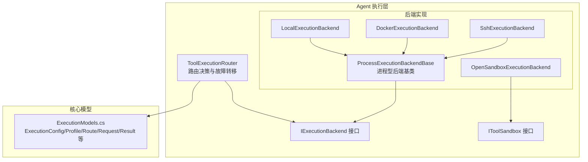
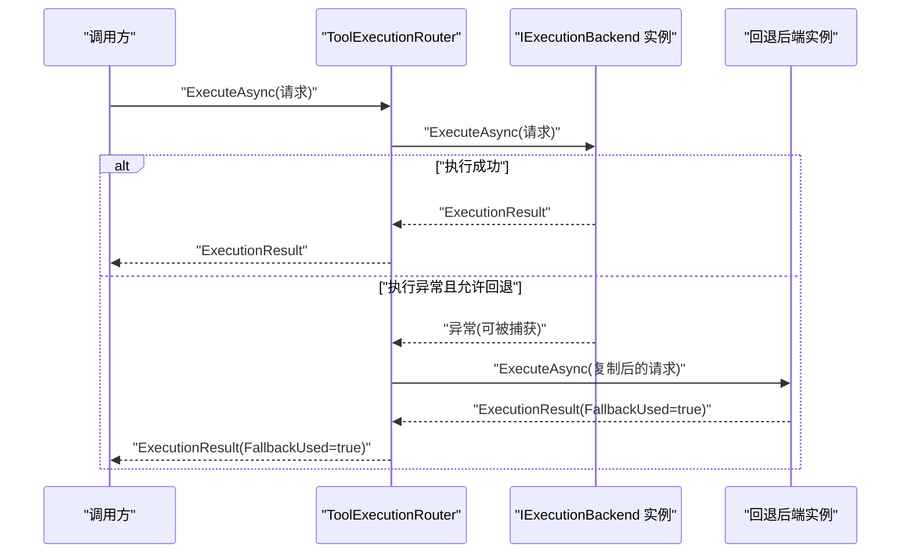
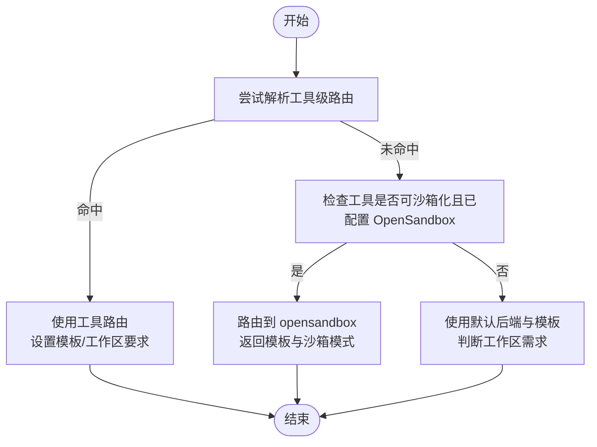
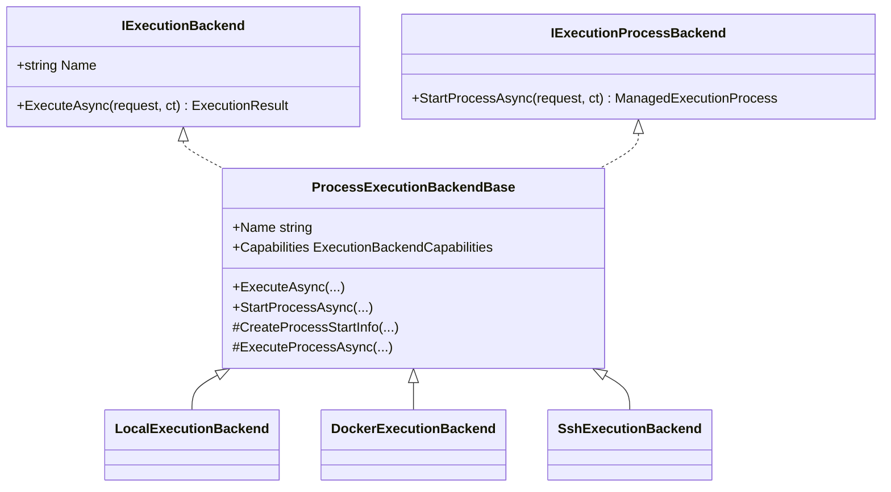
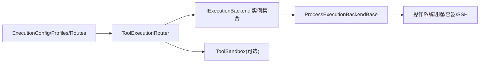

# 执行路由

<cite>
**本文引用的文件**
- [ToolExecutionRouter.cs](file://src/OpenClaw.Agent/Execution/ToolExecutionRouter.cs)
- [LocalExecutionBackend.cs](file://src/OpenClaw.Agent/Execution/LocalExecutionBackend.cs)
- [DockerExecutionBackend.cs](file://src/OpenClaw.Agent/Execution/DockerExecutionBackend.cs)
- [SshExecutionBackend.cs](file://src/OpenClaw.Agent/Execution/SshExecutionBackend.cs)
- [OpenSandboxExecutionBackend.cs](file://src/OpenClaw.Agent/Execution/OpenSandboxExecutionBackend.cs)
- [ProcessExecutionBackendBase.cs](file://src/OpenClaw.Agent/Execution/ProcessExecutionBackendBase.cs)
- [IExecutionBackend.cs](file://src/OpenClaw.Core/Abstractions/IExecutionBackend.cs)
- [IToolSandbox.cs](file://src/OpenClaw.Core/Abstractions/IToolSandbox.cs)
- [ExecutionModels.cs](file://src/OpenClaw.Core/Models/ExecutionModels.cs)
</cite>

## 目录
1. [简介](#简介)
2. [项目结构](#项目结构)
3. [核心组件](#核心组件)
4. [架构总览](#架构总览)
5. [详细组件分析](#详细组件分析)
6. [依赖关系分析](#依赖关系分析)
7. [性能考量](#性能考量)
8. [故障排查指南](#故障排查指南)
9. [结论](#结论)
10. [附录](#附录)

## 简介
本文件围绕执行路由系统进行深入解析，重点覆盖 ToolExecutionRouter 路由器的决策逻辑、负载均衡策略、故障转移机制；解释执行后端选择算法、会话亲和性、资源利用率优化等核心能力；并提供路由配置选项、性能监控、故障诊断与容量规划建议，以及高可用部署实践。

## 项目结构
执行路由系统位于 Agent 层，围绕“路由决策 + 后端执行”的职责划分组织代码。核心文件包括：
- 路由器：ToolExecutionRouter.cs
- 后端基类与具体实现：ProcessExecutionBackendBase.cs、LocalExecutionBackend.cs、DockerExecutionBackend.cs、SshExecutionBackend.cs、OpenSandboxExecutionBackend.cs
- 接口与模型：IExecutionBackend.cs、IToolSandbox.cs、ExecutionModels.cs

图表来源
- [ToolExecutionRouter.cs:1-253](file://src/OpenClaw.Agent/Execution/ToolExecutionRouter.cs#L1-L253)
- [ProcessExecutionBackendBase.cs:1-142](file://src/OpenClaw.Agent/Execution/ProcessExecutionBackendBase.cs#L1-L142)
- [LocalExecutionBackend.cs:1-99](file://src/OpenClaw.Agent/Execution/LocalExecutionBackend.cs#L1-L99)
- [DockerExecutionBackend.cs:1-66](file://src/OpenClaw.Agent/Execution/DockerExecutionBackend.cs#L1-L66)
- [SshExecutionBackend.cs:1-63](file://src/OpenClaw.Agent/Execution/SshExecutionBackend.cs#L1-L63)
- [OpenSandboxExecutionBackend.cs:1-69](file://src/OpenClaw.Agent/Execution/OpenSandboxExecutionBackend.cs#L1-L69)
- [IExecutionBackend.cs:1-13](file://src/OpenClaw.Core/Abstractions/IExecutionBackend.cs#L1-L13)
- [IToolSandbox.cs:1-12](file://src/OpenClaw.Core/Abstractions/IToolSandbox.cs#L1-L12)
- [ExecutionModels.cs:1-179](file://src/OpenClaw.Core/Models/ExecutionModels.cs#L1-L179)

章节来源
- [ToolExecutionRouter.cs:1-253](file://src/OpenClaw.Agent/Execution/ToolExecutionRouter.cs#L1-L253)
- [ExecutionModels.cs:1-179](file://src/OpenClaw.Core/Models/ExecutionModels.cs#L1-L179)

## 核心组件
- ToolExecutionRouter：负责根据工具名与配置解析执行路由，决定后端、回退后端、模板与工作区要求，并在执行失败时触发故障转移。
- 进程型后端基类 ProcessExecutionBackendBase：统一处理进程启动、输出捕获、超时控制与进程树清理。
- 具体后端：
  - LocalExecutionBackend：本地进程执行，支持交互式输入与 pty（非 Windows）。
  - DockerExecutionBackend：通过 docker CLI 拉起容器执行命令。
  - SshExecutionBackend：通过 ssh 在远端主机执行命令。
  - OpenSandboxExecutionBackend：委托 IToolSandbox 执行，内置独立超时控制。
- 接口与模型：
  - IExecutionBackend：统一后端接口。
  - IToolSandbox：工具沙箱执行接口。
  - ExecutionModels：路由配置、后端配置、请求/结果与进程相关模型。

章节来源
- [ToolExecutionRouter.cs:7-253](file://src/OpenClaw.Agent/Execution/ToolExecutionRouter.cs#L7-L253)
- [ProcessExecutionBackendBase.cs:8-142](file://src/OpenClaw.Agent/Execution/ProcessExecutionBackendBase.cs#L8-L142)
- [LocalExecutionBackend.cs:6-99](file://src/OpenClaw.Agent/Execution/LocalExecutionBackend.cs#L6-L99)
- [DockerExecutionBackend.cs:6-66](file://src/OpenClaw.Agent/Execution/DockerExecutionBackend.cs#L6-L66)
- [SshExecutionBackend.cs:6-63](file://src/OpenClaw.Agent/Execution/SshExecutionBackend.cs#L6-L63)
- [OpenSandboxExecutionBackend.cs:7-69](file://src/OpenClaw.Agent/Execution/OpenSandboxExecutionBackend.cs#L7-L69)
- [IExecutionBackend.cs:5-12](file://src/OpenClaw.Core/Abstractions/IExecutionBackend.cs#L5-L12)
- [IToolSandbox.cs:5-10](file://src/OpenClaw.Core/Abstractions/IToolSandbox.cs#L5-L10)
- [ExecutionModels.cs:8-179](file://src/OpenClaw.Core/Models/ExecutionModels.cs#L8-L179)

## 架构总览
执行路由系统采用“配置驱动 + 可插拔后端”的架构。路由器根据工具名与配置表决定后端，若指定回退后端且允许本地回退，则在主后端失败时自动切换到回退后端。OpenSandbox 提供隔离执行能力，可作为默认或工具级路由目标。

图表来源
- [ToolExecutionRouter.cs:114-157](file://src/OpenClaw.Agent/Execution/ToolExecutionRouter.cs#L114-L157)
- [IExecutionBackend.cs:9-11](file://src/OpenClaw.Core/Abstractions/IExecutionBackend.cs#L9-L11)

## 详细组件分析

### ToolExecutionRouter 路由器
- 决策逻辑
  - 工具级路由：优先从配置表中按工具名匹配后端与回退后端；若命中，同时解析模板与工作区要求。
  - 沙箱模式：当工具具备沙箱能力且配置启用 OpenSandbox 时，将路由至 opensandbox 后端，并返回模板与沙箱模式信息。
  - 默认回退：若未命中工具级路由，使用默认后端与模板，并判断是否需要工作区。
- 故障转移
  - 在执行主后端时捕获异常，若存在回退后端且允许本地回退，则构造新的请求对象（复制环境变量、工作目录等），在回退后端上重试，并将结果标记为使用了回退后端。
- 会话亲和性
  - 路由器本身不维护会话状态；会话亲和性由上层调用方在请求中携带标识并在后端实现中处理（例如通过工作目录或租约键）。
- 资源利用率优化
  - 通过统一的进程基类实现超时控制与进程树清理，避免僵尸进程与资源泄漏。
  - OpenSandbox 后端独立超时控制，避免阻塞主流程。
- 关键方法与行为
  - TryResolveRoute：解析工具级路由与沙箱模式。
  - ExecuteAsync：执行并支持故障转移。
  - ResolveBackendForProcess：解析 process/shell 工具的后端与模板。
  - RequiresWorkspace/ResolveTemplate：查询工作区需求与模板来源。

图表来源
- [ToolExecutionRouter.cs:65-112](file://src/OpenClaw.Agent/Execution/ToolExecutionRouter.cs#L65-L112)
- [ToolExecutionRouter.cs:164-203](file://src/OpenClaw.Agent/Execution/ToolExecutionRouter.cs#L164-L203)

章节来源
- [ToolExecutionRouter.cs:65-203](file://src/OpenClaw.Agent/Execution/ToolExecutionRouter.cs#L65-L203)

### 进程型后端基类 ProcessExecutionBackendBase
- 统一能力
  - 支持一次性命令与长期进程两种模式；支持 pty（非 Windows）与交互式输入。
  - StartProcessAsync：启动进程、封装为托管进程句柄并开始输出捕获。
  - ExecuteProcessAsync：启动进程、异步等待退出、处理超时与进程树清理。
- 超时与清理
  - 使用取消令牌与计时器组合实现超时；超时后尝试终止整个进程树，确保资源回收。
- 子类职责
  - 仅需实现 CreateProcessStartInfo，即可获得统一的执行与监控能力。

图表来源
- [ProcessExecutionBackendBase.cs:8-142](file://src/OpenClaw.Agent/Execution/ProcessExecutionBackendBase.cs#L8-L142)
- [LocalExecutionBackend.cs:6-99](file://src/OpenClaw.Agent/Execution/LocalExecutionBackend.cs#L6-L99)
- [DockerExecutionBackend.cs:6-66](file://src/OpenClaw.Agent/Execution/DockerExecutionBackend.cs#L6-L66)
- [SshExecutionBackend.cs:6-63](file://src/OpenClaw.Agent/Execution/SshExecutionBackend.cs#L6-L63)
- [IExecutionBackend.cs:5-12](file://src/OpenClaw.Core/Abstractions/IExecutionBackend.cs#L5-L12)

章节来源
- [ProcessExecutionBackendBase.cs:8-142](file://src/OpenClaw.Agent/Execution/ProcessExecutionBackendBase.cs#L8-L142)

### 本地后端 LocalExecutionBackend
- 特性
  - Name 固定为 local；Capabilities 根据平台决定是否支持 pty 与交互式输入。
  - 工作目录解析：支持 ~ 展开与工作区根校验；当 RequireWorkspace 为真时，限制工作目录必须位于工作区根下。
- 环境变量与参数
  - 合并后端与请求中的环境变量；参数逐个追加到进程启动信息。

章节来源
- [LocalExecutionBackend.cs:6-99](file://src/OpenClaw.Agent/Execution/LocalExecutionBackend.cs#L6-L99)

### Docker 后端 DockerExecutionBackend
- 特性
  - 通过 docker CLI 启动容器执行命令；必须提供镜像（请求模板或后端配置）。
  - 支持工作目录、环境变量注入与参数传递。
- 安全与隔离
  - 使用 --rm 保证容器生命周期管理；镜像来源由模板或后端配置提供。

章节来源
- [DockerExecutionBackend.cs:6-66](file://src/OpenClaw.Agent/Execution/DockerExecutionBackend.cs#L6-L66)

### SSH 后端 SshExecutionBackend
- 特性
  - 通过 ssh 在远端主机执行命令；必须提供 Host 与 Username。
  - 支持私钥认证、自定义端口与工作目录切换；对包含空格的参数进行必要转义。
- 场景
  - 适用于跨主机执行与资源受限场景。

章节来源
- [SshExecutionBackend.cs:6-63](file://src/OpenClaw.Agent/Execution/SshExecutionBackend.cs#L6-L63)

### OpenSandbox 后端 OpenSandboxExecutionBackend
- 特性
  - 委托 IToolSandbox 执行，内部设置独立超时；超时返回 TimedOut 标记。
  - 将 SandboxExecutionRequest 映射为 ExecutionRequest 并返回 ExecutionResult。
- 适用场景
  - 需要更强隔离与可控超时的工具执行。

章节来源
- [OpenSandboxExecutionBackend.cs:7-69](file://src/OpenClaw.Agent/Execution/OpenSandboxExecutionBackend.cs#L7-L69)
- [IToolSandbox.cs:5-10](file://src/OpenClaw.Core/Abstractions/IToolSandbox.cs#L5-L10)

### 执行模型与配置
- ExecutionConfig：全局执行配置，包含默认后端、后端配置集与工具路由集。
- ExecutionBackendProfileConfig：后端配置项，涵盖类型、启用状态、工作目录、环境变量、镜像、主机信息、超时与工作区根等。
- ExecutionToolRouteConfig：工具路由配置，指定后端、回退后端与工作区要求。
- ExecutionRequest/ExecutionResult：请求与结果模型，包含命令、参数、环境变量、模板、TTL、工作区要求、超时标记与耗时等。
- 进程相关模型：进程启动、句柄、状态与日志拉取等。

章节来源
- [ExecutionModels.cs:8-179](file://src/OpenClaw.Core/Models/ExecutionModels.cs#L8-L179)

## 依赖关系分析
- 路由器依赖
  - 配置：ExecutionConfig、ExecutionBackendProfileConfig、ExecutionToolRouteConfig
  - 后端集合：IExecutionBackend 实例字典（按名称索引）
  - 日志：ILogger
- 后端依赖
  - 进程型后端依赖 ProcessExecutionBackendBase 统一能力
  - OpenSandbox 后端依赖 IToolSandbox
- 调用链
  - 路由器 -> 后端 -> 进程基类（如为进程型）-> 外部进程/容器/远程主机

图表来源
- [ToolExecutionRouter.cs:16-63](file://src/OpenClaw.Agent/Execution/ToolExecutionRouter.cs#L16-L63)
- [ProcessExecutionBackendBase.cs:8-142](file://src/OpenClaw.Agent/Execution/ProcessExecutionBackendBase.cs#L8-L142)
- [ExecutionModels.cs:8-52](file://src/OpenClaw.Core/Models/ExecutionModels.cs#L8-L52)
- [IToolSandbox.cs:5-10](file://src/OpenClaw.Core/Abstractions/IToolSandbox.cs#L5-L10)

章节来源
- [ToolExecutionRouter.cs:16-63](file://src/OpenClaw.Agent/Execution/ToolExecutionRouter.cs#L16-L63)
- [ExecutionModels.cs:8-52](file://src/OpenClaw.Core/Models/ExecutionModels.cs#L8-L52)

## 性能考量
- 超时与资源回收
  - 进程型后端统一实现超时控制与进程树清理，避免资源泄漏；OpenSandbox 后端独立超时，降低对主流程影响。
- I/O 捕获
  - 异步读取标准输出与错误流，避免阻塞；长输出可通过分页拉取接口（见进程日志模型）。
- 并发与回退
  - 路由器在主后端失败时触发回退执行，减少整体失败率；回退路径应尽量与主路径隔离（不同后端/不同主机）。
- 工作区与隔离
  - 本地后端支持工作区根校验，防止越权访问；Docker/SSH 后端天然隔离，适合高风险工具。
- 监控指标
  - 建议采集：后端执行耗时、超时次数、回退次数、进程数、输出字节数等。

[本节为通用性能建议，无需特定文件引用]

## 故障排查指南
- 常见问题定位
  - 后端未配置：ExecuteAsync 抛出无效后端异常；检查 ExecutionConfig 与 Profiles。
  - 镜像缺失（Docker）：后端抛出缺少镜像异常；确认模板或后端 Image。
  - 主机信息缺失（SSH）：后端抛出缺少 Host/Username 异常；确认 Host、Username、Port。
  - 工作区越界（本地）：抛出工作目录不在工作区根下的异常；检查 RequireWorkspace 与工作区配置。
  - 超时：进程型后端返回 TimedOut；调整超时配置或优化工具执行。
- 故障转移验证
  - 确认请求 AllowLocalFallback 与回退后端配置；观察结果中标记 FallbackUsed。
- 日志与诊断
  - 利用进程日志拉取接口获取增量输出；结合后端执行耗时与超时标记定位瓶颈。
  - 开启路由器日志，观察沙箱模式解析与模板选择过程。

章节来源
- [ToolExecutionRouter.cs:114-157](file://src/OpenClaw.Agent/Execution/ToolExecutionRouter.cs#L114-L157)
- [LocalExecutionBackend.cs:53-83](file://src/OpenClaw.Agent/Execution/LocalExecutionBackend.cs#L53-L83)
- [DockerExecutionBackend.cs:22-26](file://src/OpenClaw.Agent/Execution/DockerExecutionBackend.cs#L22-L26)
- [SshExecutionBackend.cs:22-25](file://src/OpenClaw.Agent/Execution/SshExecutionBackend.cs#L22-L25)
- [ProcessExecutionBackendBase.cs:61-128](file://src/OpenClaw.Agent/Execution/ProcessExecutionBackendBase.cs#L61-L128)

## 结论
ToolExecutionRouter 通过“配置驱动 + 可插拔后端 + 统一进程基类”的设计，实现了灵活的工具路由、可靠的故障转移与良好的资源利用。结合 OpenSandbox 的强隔离与可控超时，可在多后端环境下实现高可用与高安全性的工具执行体系。

[本节为总结性内容，无需特定文件引用]

## 附录

### 路由策略配置示例（文字说明）
- 工具级路由
  - 为特定工具指定后端与回退后端，并设置是否需要工作区。
- 默认后端
  - 设置默认后端与模板；当工具未命中路由时生效。
- 后端配置
  - 为每个后端配置类型、启用状态、工作目录、环境变量、镜像、主机信息、超时与工作区根。
- 沙箱模式
  - 对可沙箱化工具启用 OpenSandbox；可指定模板与超时。

章节来源
- [ExecutionModels.cs:8-52](file://src/OpenClaw.Core/Models/ExecutionModels.cs#L8-L52)
- [ToolExecutionRouter.cs:65-112](file://src/OpenClaw.Agent/Execution/ToolExecutionRouter.cs#L65-L112)

### 高可用部署建议
- 后端多样性
  - 同时启用 local、docker、ssh 与 opensandbox，满足不同工具与安全需求。
- 回退策略
  - 为主后端配置合理的回退后端，避免单点故障；确保回退后端与主后端物理隔离。
- 超时与熔断
  - 为各后端设置合理超时；对不稳定后端引入熔断或降级策略。
- 监控与告警
  - 建立关键指标监控（执行耗时、超时、回退、失败率）与告警机制。
- 容量规划
  - 基于工具执行频率与资源消耗估算 CPU/内存/磁盘/网络容量；为容器与远端主机预留资源余量。

[本节为通用建议，无需特定文件引用]