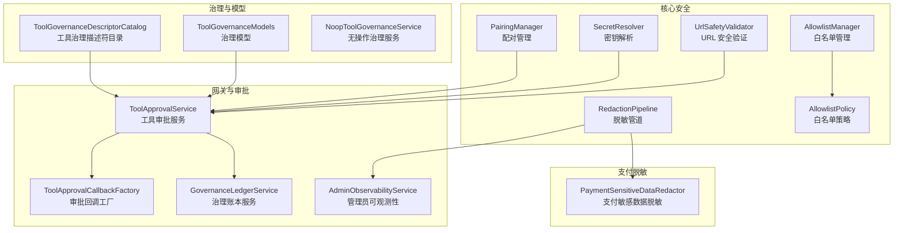
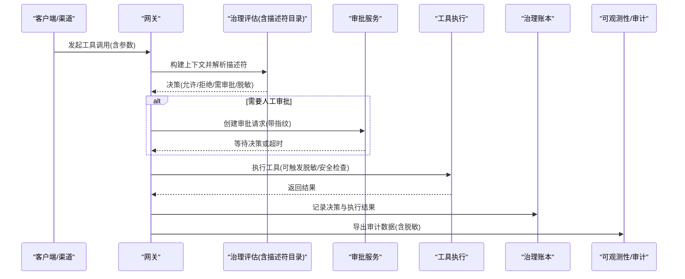
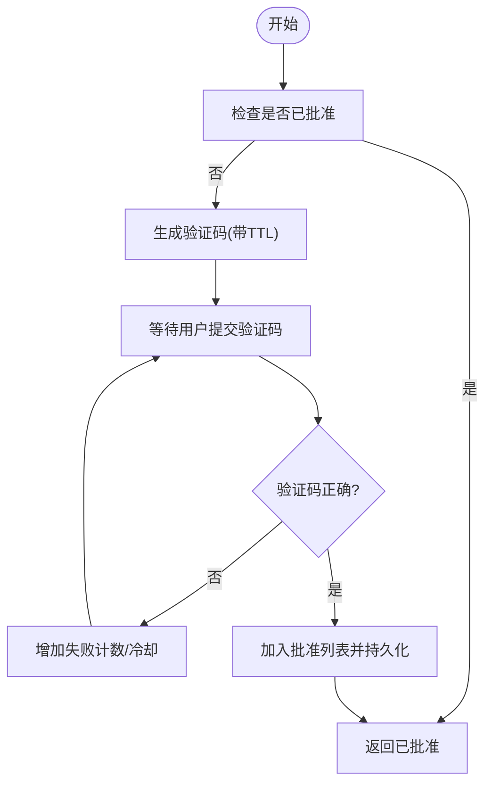
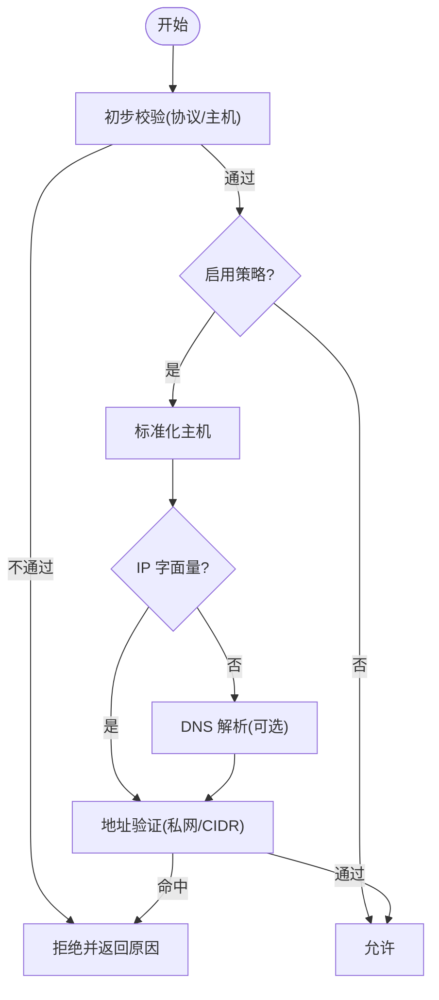
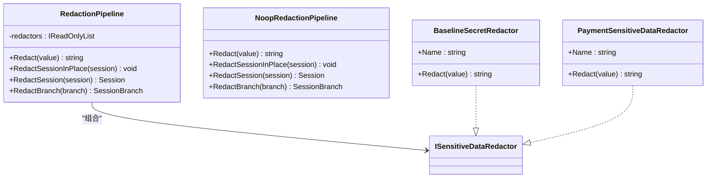
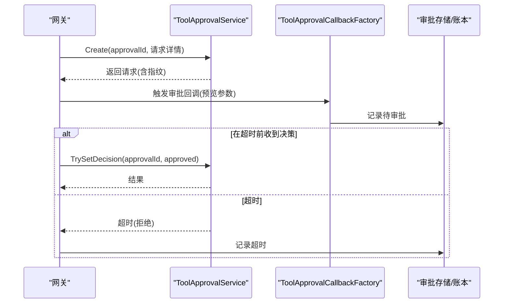
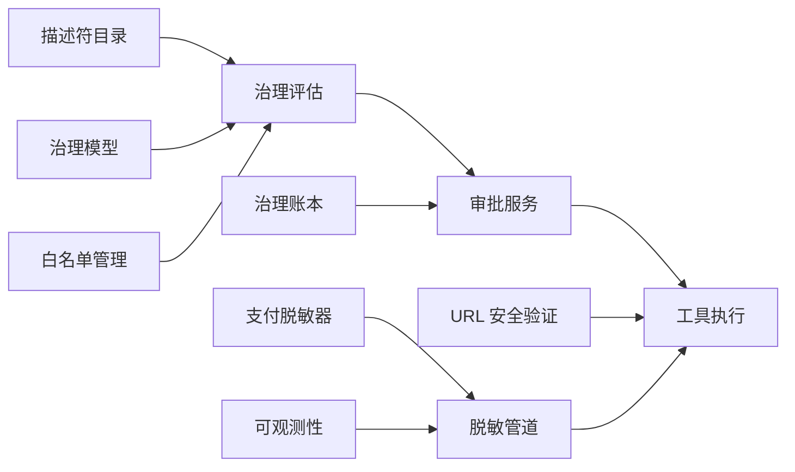

# 权限控制

<cite>
**本文引用的文件**
- [PairingManager.cs](file://src/OpenClaw.Core/Security/PairingManager.cs)
- [SecretResolver.cs](file://src/OpenClaw.Core/Security/SecretResolver.cs)
- [UrlSafetyValidator.cs](file://src/OpenClaw.Core/Security/UrlSafetyValidator.cs)
- [RedactionPipeline.cs](file://src/OpenClaw.Core/Security/RedactionPipeline.cs)
- [ToolGovernanceDescriptorCatalog.cs](file://src/OpenClaw.Core/Governance/ToolGovernanceDescriptorCatalog.cs)
- [ToolGovernanceModels.cs](file://src/OpenClaw.Core/Models/ToolGovernanceModels.cs)
- [ToolApprovalService.cs](file://src/OpenClaw.Core/Pipeline/ToolApprovalService.cs)
- [AllowlistManager.cs](file://src/OpenClaw.Core/Security/AllowlistManager.cs)
- [AllowlistPolicy.cs](file://src/OpenClaw.Core/Security/AllowlistPolicy.cs)
- [NoopToolGovernanceService.cs](file://src/OpenClaw.Core/Governance/NoopToolGovernanceService.cs)
- [GovernanceLedgerService.cs](file://src/OpenClaw.Gateway/GovernanceLedgerService.cs)
- [ToolApprovalCallbackFactory.cs](file://src/OpenClaw.Gateway/ToolApprovalCallbackFactory.cs)
- [AdminObservabilityService.cs](file://src/OpenClaw.Gateway/AdminObservabilityService.cs)
- [PaymentSensitiveDataRedactor.cs](file://src/OpenClaw.Payments.Core/PaymentSensitiveDataRedactor.cs)
- [BrowserTool.cs](file://src/OpenClaw.Agent/Tools/BrowserTool.cs)
- [UrlSafetyValidatorTests.cs](file://src/OpenClaw.Tests/UrlSafetyValidatorTests.cs)
</cite>

## 目录
1. [简介](#简介)
2. [项目结构](#项目结构)
3. [核心组件](#核心组件)
4. [架构总览](#架构总览)
5. [组件详解](#组件详解)
6. [依赖关系分析](#依赖关系分析)
7. [性能考量](#性能考量)
8. [故障排查指南](#故障排查指南)
9. [结论](#结论)
10. [附录](#附录)

## 简介
本文件系统性阐述权限控制体系的关键能力与实现：PairingManager 配对管理、SecretResolver 密钥解析、UrlSafetyValidator URL 安全验证、RedactionPipeline 数据脱敏管道；并覆盖工具治理描述符目录、权限评估流程、审批指纹验证等核心机制。文档同时提供策略配置建议、安全审计与合规要点、最佳实践与常见问题排查方法，帮助读者在保障安全的前提下高效使用与扩展权限控制能力。

## 项目结构
权限控制相关代码主要分布在以下模块：
- 核心安全模块（OpenClaw.Core/Security）：配对、密钥解析、URL 安全、脱敏、白名单等
- 治理与模型（OpenClaw.Core/Governance 与 Models）：工具治理描述符、决策模型、上下文
- 网关与审批（OpenClaw.Gateway）：审批回调工厂、治理账本、可观测性导出
- 支付敏感数据脱敏（OpenClaw.Payments.Core）
- 测试（OpenClaw.Tests）：安全策略与治理行为验证

图表来源
- [PairingManager.cs:14-211](file://src/OpenClaw.Core/Security/PairingManager.cs#L14-L211)
- [SecretResolver.cs:14-66](file://src/OpenClaw.Core/Security/SecretResolver.cs#L14-L66)
- [UrlSafetyValidator.cs:17-219](file://src/OpenClaw.Core/Security/UrlSafetyValidator.cs#L17-L219)
- [RedactionPipeline.cs:21-131](file://src/OpenClaw.Core/Security/RedactionPipeline.cs#L21-L131)
- [ToolGovernanceDescriptorCatalog.cs:5-181](file://src/OpenClaw.Core/Governance/ToolGovernanceDescriptorCatalog.cs#L5-L181)
- [ToolGovernanceModels.cs:24-150](file://src/OpenClaw.Core/Models/ToolGovernanceModels.cs#L24-L150)
- [ToolApprovalService.cs:49-265](file://src/OpenClaw.Core/Pipeline/ToolApprovalService.cs#L49-L265)
- [ToolApprovalCallbackFactory.cs:120-153](file://src/OpenClaw.Gateway/ToolApprovalCallbackFactory.cs#L120-L153)
- [GovernanceLedgerService.cs:174-204](file://src/OpenClaw.Gateway/GovernanceLedgerService.cs#L174-L204)
- [AdminObservabilityService.cs:763-791](file://src/OpenClaw.Gateway/AdminObservabilityService.cs#L763-L791)
- [PaymentSensitiveDataRedactor.cs:25-63](file://src/OpenClaw.Payments.Core/PaymentSensitiveDataRedactor.cs#L25-L63)

章节来源
- [PairingManager.cs:14-211](file://src/OpenClaw.Core/Security/PairingManager.cs#L14-L211)
- [ToolGovernanceDescriptorCatalog.cs:5-181](file://src/OpenClaw.Core/Governance/ToolGovernanceDescriptorCatalog.cs#L5-L181)
- [ToolApprovalService.cs:49-265](file://src/OpenClaw.Core/Pipeline/ToolApprovalService.cs#L49-L265)

## 核心组件
- 配对管理 PairingManager：生成一次性验证码、校验与持久化批准发送方、防暴力破解与固定时间比较
- 密钥解析 SecretResolver：统一解析 env/raw/裸字符串三种密钥引用，支持严格与回退策略
- URL 安全验证 UrlSafetyValidator：基于内置与自定义规则的主机与CIDR检查，支持异步 DNS 解析
- 脱敏管道 RedactionPipeline：链式敏感信息脱敏，支持会话级入站/出站数据清洗
- 工具治理描述符目录 ToolGovernanceDescriptorCatalog：内置工具风险等级、访问能力与审批需求映射
- 审批服务 ToolApprovalService：内存队列式审批请求与等待、超时处理、授权匹配
- 白名单 AllowlistManager/Policy：按通道持久化白名单，支持动态更新与严格/传统语义
- 治理账本 GovernanceLedgerService：记录治理决策生命周期与风险级别
- 支付敏感数据脱敏 PaymentSensitiveDataRedactor：识别并脱敏支付令牌、卡号、CVV 等

章节来源
- [PairingManager.cs:14-211](file://src/OpenClaw.Core/Security/PairingManager.cs#L14-L211)
- [SecretResolver.cs:14-66](file://src/OpenClaw.Core/Security/SecretResolver.cs#L14-L66)
- [UrlSafetyValidator.cs:17-219](file://src/OpenClaw.Core/Security/UrlSafetyValidator.cs#L17-L219)
- [RedactionPipeline.cs:21-131](file://src/OpenClaw.Core/Security/RedactionPipeline.cs#L21-L131)
- [ToolGovernanceDescriptorCatalog.cs:5-181](file://src/OpenClaw.Core/Governance/ToolGovernanceDescriptorCatalog.cs#L5-L181)
- [ToolApprovalService.cs:49-265](file://src/OpenClaw.Core/Pipeline/ToolApprovalService.cs#L49-L265)
- [AllowlistManager.cs:19-126](file://src/OpenClaw.Core/Security/AllowlistManager.cs#L19-L126)
- [AllowlistPolicy.cs:9-43](file://src/OpenClaw.Core/Security/AllowlistPolicy.cs#L9-L43)
- [GovernanceLedgerService.cs:174-204](file://src/OpenClaw.Gateway/GovernanceLedgerService.cs#L174-L204)
- [PaymentSensitiveDataRedactor.cs:25-63](file://src/OpenClaw.Payments.Core/PaymentSensitiveDataRedactor.cs#L25-L63)

## 架构总览
权限控制贯穿“输入校验—治理评估—审批—执行—审计”的闭环：

图表来源
- [ToolGovernanceDescriptorCatalog.cs:12-32](file://src/OpenClaw.Core/Governance/ToolGovernanceDescriptorCatalog.cs#L12-L32)
- [ToolApprovalService.cs:65-99](file://src/OpenClaw.Core/Pipeline/ToolApprovalService.cs#L65-L99)
- [GovernanceLedgerService.cs:174-204](file://src/OpenClaw.Gateway/GovernanceLedgerService.cs#L174-L204)
- [AdminObservabilityService.cs:763-791](file://src/OpenClaw.Gateway/AdminObservabilityService.cs#L763-L791)

## 组件详解

### 配对管理 PairingManager
- 功能要点
  - 为未批准的发送方生成 6 位验证码，带 TTL 与失败冷却
  - 固定时间比较防止时序攻击
  - 持久化批准列表，重启后仍有效
  - 支持管理员手动批准与撤销
- 关键流程

图表来源
- [PairingManager.cs:53-124](file://src/OpenClaw.Core/Security/PairingManager.cs#L53-L124)

章节来源
- [PairingManager.cs:14-211](file://src/OpenClaw.Core/Security/PairingManager.cs#L14-L211)

### 密钥解析 SecretResolver
- 功能要点
  - 支持 env:VAR、raw:value、裸变量名（回退到字面量）三种引用
  - 提供 raw 引用检测，用于公开绑定加固
  - 日志告警提示裸变量名回退场景
- 使用建议
  - 生产环境优先使用 env: 前缀，避免裸变量名
  - 对于测试或演示，可使用 raw: 但需明确风险

章节来源
- [SecretResolver.cs:14-66](file://src/OpenClaw.Core/Security/SecretResolver.cs#L14-L66)

### URL 安全验证 UrlSafetyValidator
- 功能要点
  - 内置黑名单主机（如 localhost、metadata.*）
  - 支持自定义主机通配与 CIDR 黑名单
  - 可选阻断私有网络目标与 DNS 解析
  - 提供同步/异步两种验证接口
- 行为特征
  - 仅允许绝对 http/https URL
  - 对 IPv4/IPv6 地址进行规范化与范围判定
  - CIDR 匹配采用逐字节掩码计算

图表来源
- [UrlSafetyValidator.cs:27-111](file://src/OpenClaw.Core/Security/UrlSafetyValidator.cs#L27-L111)
- [UrlSafetyValidator.cs:113-135](file://src/OpenClaw.Core/Security/UrlSafetyValidator.cs#L113-L135)

章节来源
- [UrlSafetyValidator.cs:17-219](file://src/OpenClaw.Core/Security/UrlSafetyValidator.cs#L17-L219)
- [UrlSafetyValidatorTests.cs:10-41](file://src/OpenClaw.Tests/UrlSafetyValidatorTests.cs#L10-L41)
- [BrowserTool.cs:144-171](file://src/OpenClaw.Agent/Tools/BrowserTool.cs#L144-L171)

### 脱敏管道 RedactionPipeline
- 功能要点
  - 多级脱敏器链式执行（如基础密钥、支付敏感数据）
  - 支持对会话历史、分支进行就地/克隆脱敏
  - 默认提供空实现（Noop）便于禁用
- 典型脱敏器
  - 基础密钥脱敏：Authorization Bearer、OpenAI 秘钥、API Key 字段
  - 支付敏感数据脱敏：卡号、CVV、授权令牌、JSON 字段等

图表来源
- [RedactionPipeline.cs:21-131](file://src/OpenClaw.Core/Security/RedactionPipeline.cs#L21-L131)
- [PaymentSensitiveDataRedactor.cs:25-63](file://src/OpenClaw.Payments.Core/PaymentSensitiveDataRedactor.cs#L25-L63)

章节来源
- [RedactionPipeline.cs:21-131](file://src/OpenClaw.Core/Security/RedactionPipeline.cs#L21-L131)
- [PaymentSensitiveDataRedactor.cs:25-63](file://src/OpenClaw.Payments.Core/PaymentSensitiveDataRedactor.cs#L25-L63)

### 工具治理描述符目录 ToolGovernanceDescriptorCatalog
- 功能要点
  - 内置大量工具的治理描述符，包含风险等级、能力集合、是否需要审批、只读等属性
  - 运行时根据动作描述符（是否变更、是否需要审批）动态提升风险与审批需求
  - 提供回退描述符，确保未知工具也有默认策略
- 风险与能力
  - 低/中/高/关键风险分级
  - 能力包括文件系统、网络、外部 CLI、代码执行、消息发送等

章节来源
- [ToolGovernanceDescriptorCatalog.cs:5-181](file://src/OpenClaw.Core/Governance/ToolGovernanceDescriptorCatalog.cs#L5-L181)
- [ToolGovernanceModels.cs:65-93](file://src/OpenClaw.Core/Models/ToolGovernanceModels.cs#L65-L93)

### 审批指纹与审批服务 ToolApprovalService
- 功能要点
  - 为每次审批请求生成唯一指纹（approvalId），携带会话、渠道、发送方、工具名、参数摘要等
  - 支持超时等待、取消、并发决策设置、请求者身份校验
  - 列表查询与过期清理，保证内存队列可控
- 审批回调与超时处理
  - 等待决策超时自动拒绝，并记录治理账本与运行事件

图表来源
- [ToolApprovalService.cs:65-99](file://src/OpenClaw.Core/Pipeline/ToolApprovalService.cs#L65-L99)
- [ToolApprovalService.cs:156-218](file://src/OpenClaw.Core/Pipeline/ToolApprovalService.cs#L156-L218)
- [ToolApprovalCallbackFactory.cs:120-153](file://src/OpenClaw.Gateway/ToolApprovalCallbackFactory.cs#L120-L153)

章节来源
- [ToolApprovalService.cs:49-265](file://src/OpenClaw.Core/Pipeline/ToolApprovalService.cs#L49-L265)
- [ToolApprovalCallbackFactory.cs:120-153](file://src/OpenClaw.Gateway/ToolApprovalCallbackFactory.cs#L120-L153)

### 白名单 AllowlistManager/Policy
- 功能要点
  - 按通道持久化允许来源/去向，支持动态更新与原子写入
  - 严格模式要求显式匹配；传统模式空白名单即放行
- 使用建议
  - 生产环境推荐严格模式，避免误放行
  - 动态白名单优先于静态配置

章节来源
- [AllowlistManager.cs:19-126](file://src/OpenClaw.Core/Security/AllowlistManager.cs#L19-L126)
- [AllowlistPolicy.cs:9-43](file://src/OpenClaw.Core/Security/AllowlistPolicy.cs#L9-L43)

### 治理账本 GovernanceLedgerService
- 功能要点
  - 记录治理决策生命周期（Active/Expired/Revoked/Superseded）
  - 归一化决策与状态，推导风险级别，输出事件严重性
  - 与审批超时、撤销等场景联动

章节来源
- [GovernanceLedgerService.cs:174-204](file://src/OpenClaw.Gateway/GovernanceLedgerService.cs#L174-L204)
- [GovernanceLedgerService.cs:431-481](file://src/OpenClaw.Gateway/GovernanceLedgerService.cs#L431-L481)

## 依赖关系分析
- 组件耦合
  - 治理评估依赖描述符目录与模型，输出决策
  - 审批服务独立于具体工具，仅依赖上下文与指纹
  - 脱敏管道与支付脱敏器解耦，可按需组合
  - URL 安全验证与浏览器工具共享策略逻辑
- 外部依赖
  - DNS 解析（UrlSafetyValidator）
  - 文件系统（PairingManager/AllowlistManager 的持久化）

图表来源
- [ToolGovernanceDescriptorCatalog.cs:12-32](file://src/OpenClaw.Core/Governance/ToolGovernanceDescriptorCatalog.cs#L12-L32)
- [ToolGovernanceModels.cs:44-93](file://src/OpenClaw.Core/Models/ToolGovernanceModels.cs#L44-L93)
- [ToolApprovalService.cs:49-265](file://src/OpenClaw.Core/Pipeline/ToolApprovalService.cs#L49-L265)
- [UrlSafetyValidator.cs:17-219](file://src/OpenClaw.Core/Security/UrlSafetyValidator.cs#L17-L219)
- [RedactionPipeline.cs:21-131](file://src/OpenClaw.Core/Security/RedactionPipeline.cs#L21-L131)
- [PaymentSensitiveDataRedactor.cs:25-63](file://src/OpenClaw.Payments.Core/PaymentSensitiveDataRedactor.cs#L25-L63)
- [AllowlistManager.cs:19-126](file://src/OpenClaw.Core/Security/AllowlistManager.cs#L19-L126)
- [GovernanceLedgerService.cs:174-204](file://src/OpenClaw.Gateway/GovernanceLedgerService.cs#L174-L204)
- [AdminObservabilityService.cs:763-791](file://src/OpenClaw.Gateway/AdminObservabilityService.cs#L763-L791)

## 性能考量
- PairingManager
  - 并发字典与固定时间比较，注意高并发下的失败冷却窗口
- UrlSafetyValidator
  - DNS 异步解析可选，建议在策略允许时关闭解析以降低延迟
  - CIDR 匹配为线性扫描，建议限制黑名单数量
- RedactionPipeline
  - 多级正则替换，建议在高频路径上缓存或减少不必要的脱敏
- ToolApprovalService
  - 内存队列，超时清理与并发决策设置避免内存膨胀

## 故障排查指南
- 验证码无法使用/频繁失败
  - 检查验证码 TTL 与失败冷却是否生效
  - 确认固定时间比较未被绕过
  - 参考：[PairingManager.cs:53-124](file://src/OpenClaw.Core/Security/PairingManager.cs#L53-L124)
- 密钥解析异常
  - 确认引用格式（env:/raw:/裸变量名）
  - 生产环境避免裸变量名回退
  - 参考：[SecretResolver.cs:24-54](file://src/OpenClaw.Core/Security/SecretResolver.cs#L24-L54)
- URL 被错误拦截
  - 检查策略配置（启用、私网阻断、CIDR、主机黑名单）
  - 验证 DNS 解析是否可达
  - 参考：[UrlSafetyValidator.cs:27-111](file://src/OpenClaw.Core/Security/UrlSafetyValidator.cs#L27-L111)，[UrlSafetyValidatorTests.cs:10-41](file://src/OpenClaw.Tests/UrlSafetyValidatorTests.cs#L10-L41)
- 审批超时
  - 检查审批等待超时与回调工厂记录
  - 确认治理账本是否记录超时
  - 参考：[ToolApprovalService.cs:156-218](file://src/OpenClaw.Core/Pipeline/ToolApprovalService.cs#L156-L218)，[ToolApprovalCallbackFactory.cs:120-153](file://src/OpenClaw.Gateway/ToolApprovalCallbackFactory.cs#L120-L153)
- 白名单不生效
  - 检查动态白名单文件是否成功写入与原子替换
  - 确认通道 ID 安全化与路径拼接
  - 参考：[AllowlistManager.cs:53-84](file://src/OpenClaw.Core/Security/AllowlistManager.cs#L53-L84)
- 脱敏不彻底
  - 确认脱敏器顺序与正则覆盖范围
  - 对支付敏感数据启用专用脱敏器
  - 参考：[RedactionPipeline.cs:21-131](file://src/OpenClaw.Core/Security/RedactionPipeline.cs#L21-L131)，[PaymentSensitiveDataRedactor.cs:25-63](file://src/OpenClaw.Payments.Core/PaymentSensitiveDataRedactor.cs#L25-L63)

章节来源
- [PairingManager.cs:53-124](file://src/OpenClaw.Core/Security/PairingManager.cs#L53-L124)
- [SecretResolver.cs:24-54](file://src/OpenClaw.Core/Security/SecretResolver.cs#L24-L54)
- [UrlSafetyValidator.cs:27-111](file://src/OpenClaw.Core/Security/UrlSafetyValidator.cs#L27-L111)
- [UrlSafetyValidatorTests.cs:10-41](file://src/OpenClaw.Tests/UrlSafetyValidatorTests.cs#L10-L41)
- [ToolApprovalService.cs:156-218](file://src/OpenClaw.Core/Pipeline/ToolApprovalService.cs#L156-L218)
- [ToolApprovalCallbackFactory.cs:120-153](file://src/OpenClaw.Gateway/ToolApprovalCallbackFactory.cs#L120-L153)
- [AllowlistManager.cs:53-84](file://src/OpenClaw.Core/Security/AllowlistManager.cs#L53-L84)
- [RedactionPipeline.cs:21-131](file://src/OpenClaw.Core/Security/RedactionPipeline.cs#L21-L131)
- [PaymentSensitiveDataRedactor.cs:25-63](file://src/OpenClaw.Payments.Core/PaymentSensitiveDataRedactor.cs#L25-L63)

## 结论
该权限控制系统通过“配对—密钥—URL—脱敏—治理—审批—账本—可观测”的完整链路，实现了对工具调用的多维度安全控制。描述符目录与审批指纹确保了策略可追溯与可审计；URL 安全验证与白名单策略有效降低了内网与外部风险；脱敏管道与支付专用脱敏器满足合规要求。建议在生产中启用严格白名单、最小权限治理、强制审批高风险工具，并结合治理账本与可观测性持续监控与优化。

## 附录

### 权限策略配置清单
- URL 安全策略
  - enabled：是否启用
  - blockPrivateNetworkTargets：是否阻断私网目标
  - blockedCidrs：CIDR 黑名单数组
  - blockedHostGlobs：主机通配黑名单
- 治理服务配置
  - provider：治理服务提供方（http_sidecar）
  - sidecarBaseUrl：治理侧车地址
  - decisionEndpoint/resultEndpoint：决策与结果上报端点
  - timeoutMs：超时毫秒
  - auditResults：是否审计结果
  - failClosed/failOpenReadOnlyLowRisk：失败时策略
  - requireGovernanceForHighRiskTools：高风险工具是否强制治理
- 白名单策略
  - semantics：strict 或 legacy
  - allowedFrom/allowedTo：通道白名单条目

章节来源
- [ToolGovernanceModels.cs:24-36](file://src/OpenClaw.Core/Models/ToolGovernanceModels.cs#L24-L36)
- [ToolGovernanceModels.cs:38-42](file://src/OpenClaw.Core/Models/ToolGovernanceModels.cs#L38-L42)
- [AllowlistPolicy.cs:11-16](file://src/OpenClaw.Core/Security/AllowlistPolicy.cs#L11-L16)
- [AllowlistManager.cs:32-51](file://src/OpenClaw.Core/Security/AllowlistManager.cs#L32-L51)