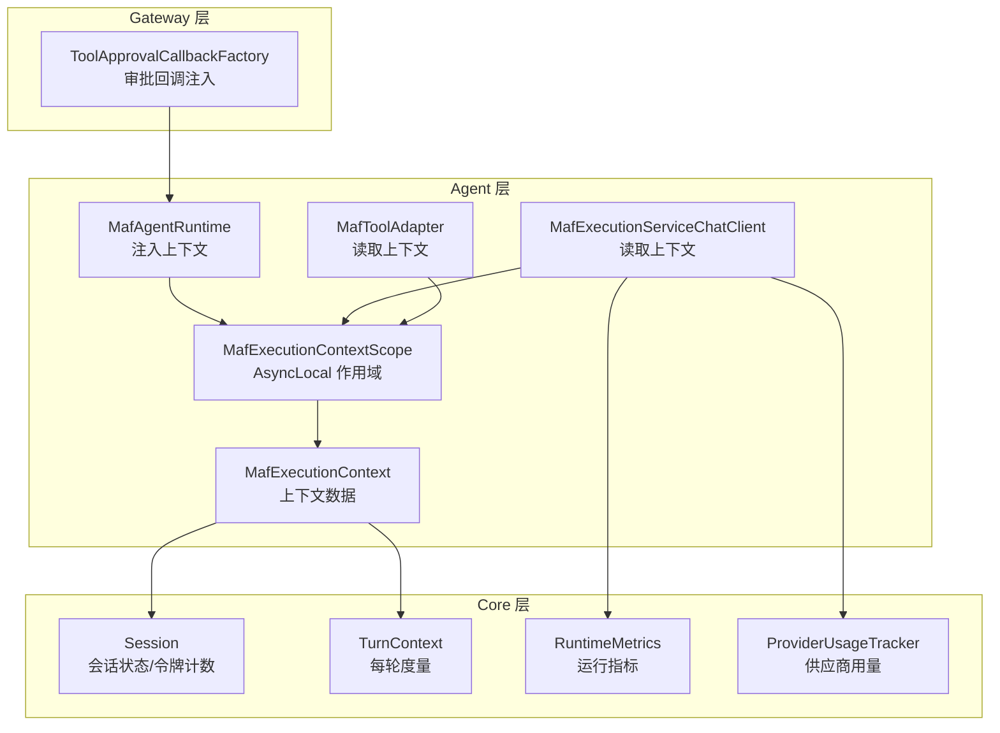
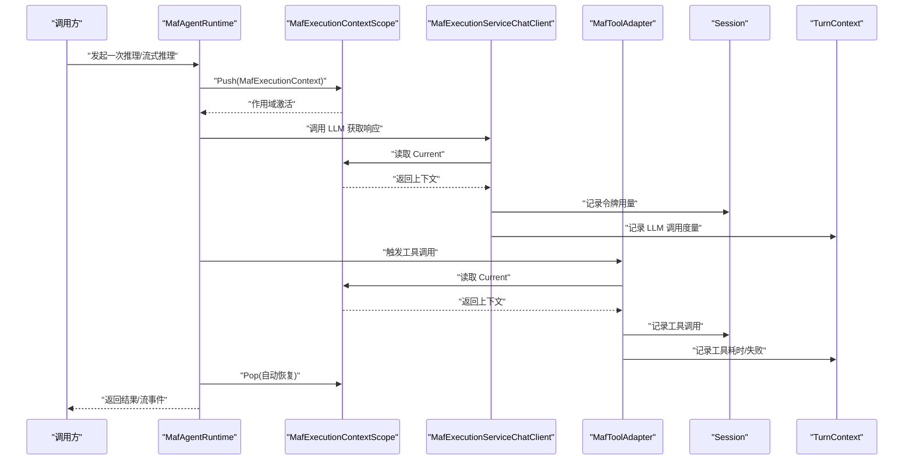
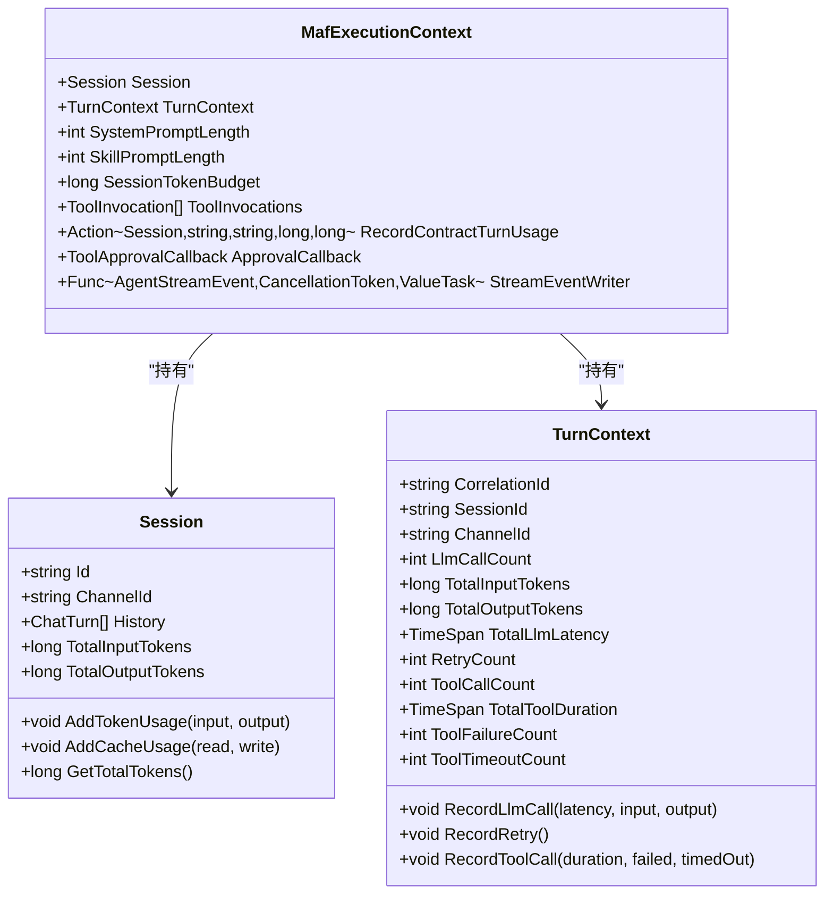
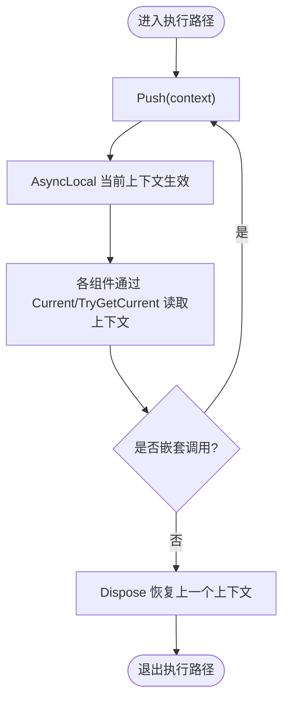
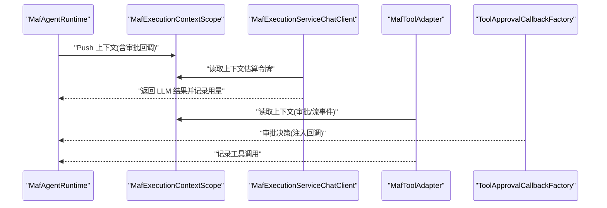
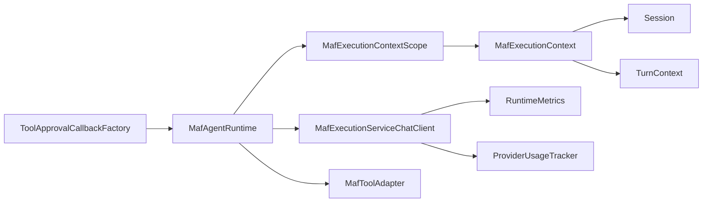

# 执行上下文

<cite>
**本文引用的文件**
- [MafExecutionContext.cs](file://src/OpenClaw.Agent/MafExecutionContext.cs)
- [MafAgentRuntime.cs](file://src/OpenClaw.Agent/MafAgentRuntime.cs)
- [MafExecutionServiceChatClient.cs](file://src/OpenClaw.Agent/MafExecutionServiceChatClient.cs)
- [MafToolAdapter.cs](file://src/OpenClaw.Agent/MafToolAdapter.cs)
- [Session.cs](file://src/OpenClaw.Core/Models/Session.cs)
- [TurnContext.cs](file://src/OpenClaw.Core/Observability/TurnContext.cs)
- [ToolApprovalCallbackFactory.cs](file://src/OpenClaw.Gateway/ToolApprovalCallbackFactory.cs)
- [RuntimeMetrics.cs](file://src/OpenClaw.Core/Observability/RuntimeMetrics.cs)
- [ProviderUsageTracker.cs](file://src/OpenClaw.Core/Observability/ProviderUsageTracker.cs)
</cite>

## 目录
1. [简介](#简介)
2. [项目结构](#项目结构)
3. [核心组件](#核心组件)
4. [架构总览](#架构总览)
5. [详细组件分析](#详细组件分析)
6. [依赖关系分析](#依赖关系分析)
7. [性能考量](#性能考量)
8. [故障排查指南](#故障排查指南)
9. [结论](#结论)
10. [附录](#附录)

## 简介
本文件系统性阐述执行上下文管理系统的设计与实现，重点围绕 MafExecutionContext 及其作用域容器 MafExecutionContextScope。该系统用于在多轮对话、工具调用、流式输出等复杂执行路径中，跨组件传递会话状态、令牌预算、审批回调、流事件写入器等关键信息，确保上下文在异步与并发场景下的正确性与可追踪性。文档涵盖上下文数据结构、生命周期管理、线程安全保证、资源清理策略、性能影响、调试与监控指标，并提供配置建议与最佳实践。

## 项目结构
执行上下文相关代码主要分布在以下模块：
- Agent 层：上下文定义与作用域管理、运行时注入、工具适配器读取
- Core 模型与可观测性：会话状态、令牌统计、每轮上下文度量
- Gateway 层：工具审批回调工厂，将审批决策注入上下文链路

**图表来源**
- [MafExecutionContext.cs:5-45](file://src/OpenClaw.Agent/MafExecutionContext.cs#L5-L45)
- [MafAgentRuntime.cs:271-282](file://src/OpenClaw.Agent/MafAgentRuntime.cs#L271-L282)
- [MafExecutionServiceChatClient.cs:37-64](file://src/OpenClaw.Agent/MafExecutionServiceChatClient.cs#L37-L64)
- [MafToolAdapter.cs:33-61](file://src/OpenClaw.Agent/MafToolAdapter.cs#L33-L61)
- [Session.cs:15-135](file://src/OpenClaw.Core/Models/Session.cs#L15-L135)
- [TurnContext.cs:12-75](file://src/OpenClaw.Core/Observability/TurnContext.cs#L12-L75)
- [ToolApprovalCallbackFactory.cs:29-147](file://src/OpenClaw.Gateway/ToolApprovalCallbackFactory.cs#L29-L147)

**章节来源**
- [MafExecutionContext.cs:1-46](file://src/OpenClaw.Agent/MafExecutionContext.cs#L1-L46)
- [MafAgentRuntime.cs:260-337](file://src/OpenClaw.Agent/MafAgentRuntime.cs#L260-L337)
- [MafExecutionServiceChatClient.cs:30-188](file://src/OpenClaw.Agent/MafExecutionServiceChatClient.cs#L30-L188)
- [MafToolAdapter.cs:25-63](file://src/OpenClaw.Agent/MafToolAdapter.cs#L25-L63)
- [Session.cs:1-200](file://src/OpenClaw.Core/Models/Session.cs#L1-L200)
- [TurnContext.cs:1-76](file://src/OpenClaw.Core/Observability/TurnContext.cs#L1-L76)
- [ToolApprovalCallbackFactory.cs:10-147](file://src/OpenClaw.Gateway/ToolApprovalCallbackFactory.cs#L10-L147)

## 核心组件
- MafExecutionContext：承载单次执行所需的会话、每轮上下文、提示长度、令牌预算、工具调用列表、审批回调、流事件写入器等。
- MafExecutionContextScope：基于 AsyncLocal 的线程/协程安全作用域，提供 Current/TryGetCurrent/Push/RestoreScope。
- MafAgentRuntime：在每次推理或流式推理开始时，构建并推入上下文，确保后续组件可读取。
- MafExecutionServiceChatClient：从作用域读取上下文，进行令牌估算、用量记录、指标上报。
- MafToolAdapter：从作用域读取上下文，记录工具调用、触发流事件写入。
- Session/TurnContext：会话级令牌统计与每轮度量，支撑上下文中的预算与用量记录。
- ToolApprovalCallbackFactory：生成审批回调，注入到上下文中，贯穿工具调用审批流程。

**章节来源**
- [MafExecutionContext.cs:5-17](file://src/OpenClaw.Agent/MafExecutionContext.cs#L5-L17)
- [MafExecutionContextScope:19-45](file://src/OpenClaw.Agent/MafExecutionContext.cs#L19-L45)
- [MafAgentRuntime.cs:271-282](file://src/OpenClaw.Agent/MafAgentRuntime.cs#L271-L282)
- [MafExecutionServiceChatClient.cs:37-64](file://src/OpenClaw.Agent/MafExecutionServiceChatClient.cs#L37-L64)
- [MafToolAdapter.cs:33-61](file://src/OpenClaw.Agent/MafToolAdapter.cs#L33-L61)
- [Session.cs:117-135](file://src/OpenClaw.Core/Models/Session.cs#L117-L135)
- [TurnContext.cs:49-65](file://src/OpenClaw.Core/Observability/TurnContext.cs#L49-L65)
- [ToolApprovalCallbackFactory.cs:42-86](file://src/OpenClaw.Gateway/ToolApprovalCallbackFactory.cs#L42-L86)

## 架构总览
执行上下文贯穿“运行时 -> LLM 客户端 -> 工具适配器”的调用链，形成统一的会话与度量视图。

**图表来源**
- [MafAgentRuntime.cs:271-282](file://src/OpenClaw.Agent/MafAgentRuntime.cs#L271-L282)
- [MafExecutionServiceChatClient.cs:37-64](file://src/OpenClaw.Agent/MafExecutionServiceChatClient.cs#L37-L64)
- [MafToolAdapter.cs:33-61](file://src/OpenClaw.Agent/MafToolAdapter.cs#L33-L61)
- [Session.cs:117-135](file://src/OpenClaw.Core/Models/Session.cs#L117-L135)
- [TurnContext.cs:49-65](file://src/OpenClaw.Core/Observability/TurnContext.cs#L49-L65)

## 详细组件分析

### 上下文数据结构与职责
- Session：会话级状态与令牌累计，支持并发安全的原子更新。
- TurnContext：每轮请求的轻量度量载体，包含 LLM 调用次数、输入/输出令牌、延迟、重试次数、工具调用次数、工具耗时、失败/超时计数。
- MafExecutionContext：将 Session、TurnContext、系统/技能提示长度、会话令牌预算、工具调用集合、审批回调、流事件写入器等打包，供链路各环节共享。

**图表来源**
- [Session.cs:15-135](file://src/OpenClaw.Core/Models/Session.cs#L15-L135)
- [TurnContext.cs:12-75](file://src/OpenClaw.Core/Observability/TurnContext.cs#L12-L75)
- [MafExecutionContext.cs:6-17](file://src/OpenClaw.Agent/MafExecutionContext.cs#L6-L17)

**章节来源**
- [Session.cs:15-135](file://src/OpenClaw.Core/Models/Session.cs#L15-L135)
- [TurnContext.cs:12-75](file://src/OpenClaw.Core/Observability/TurnContext.cs#L12-L75)
- [MafExecutionContext.cs:6-17](file://src/OpenClaw.Agent/MafExecutionContext.cs#L6-L17)

### 作用域机制与线程安全
- 作用域容器使用 AsyncLocal 存储当前上下文，天然支持异步/并发场景下的隔离与继承。
- Push 返回 IDisposable，Dispose 时恢复先前上下文，确保嵌套/并行调用不会互相污染。
- Current 在无上下文时抛出异常，TryGetCurrent 则返回空，便于工具执行等不确定上下文的场景。

**图表来源**
- [MafExecutionContextScope:19-45](file://src/OpenClaw.Agent/MafExecutionContext.cs#L19-L45)

**章节来源**
- [MafExecutionContextScope:19-45](file://src/OpenClaw.Agent/MafExecutionContext.cs#L19-L45)

### 生命周期管理与资源清理
- 运行时在推理开始时 Push 上下文，在 finally/using 块结束时自动恢复，避免泄漏。
- 流式推理中，即使发生异常，也会尝试完成通道并记录度量，保证资源释放与可观测性。
- 工具调用完成后将调用信息追加到上下文的工具调用列表，便于回合总结与审计。

**章节来源**
- [MafAgentRuntime.cs:271-282](file://src/OpenClaw.Agent/MafAgentRuntime.cs#L271-L282)
- [MafAgentRuntime.cs:467-479](file://src/OpenClaw.Agent/MafAgentRuntime.cs#L467-L479)
- [MafAgentRuntime.cs:562-566](file://src/OpenClaw.Agent/MafAgentRuntime.cs#L562-L566)
- [MafToolAdapter.cs:55-58](file://src/OpenClaw.Agent/MafToolAdapter.cs#L55-L58)

### 会话状态传递与工具调用跟踪
- LLM 客户端从上下文读取技能提示长度以进行更准确的令牌估算；记录回合度量与会话令牌用量。
- 工具适配器从上下文读取审批回调与流事件写入器，触发工具执行并记录调用信息。
- 审批回调由网关侧工厂生成，注入到上下文中，贯穿工具调用审批流程。

**图表来源**
- [MafAgentRuntime.cs:271-282](file://src/OpenClaw.Agent/MafAgentRuntime.cs#L271-L282)
- [MafExecutionServiceChatClient.cs:37-64](file://src/OpenClaw.Agent/MafExecutionServiceChatClient.cs#L37-L64)
- [MafToolAdapter.cs:33-61](file://src/OpenClaw.Agent/MafToolAdapter.cs#L33-L61)
- [ToolApprovalCallbackFactory.cs:42-86](file://src/OpenClaw.Gateway/ToolApprovalCallbackFactory.cs#L42-L86)

**章节来源**
- [MafExecutionServiceChatClient.cs:134-186](file://src/OpenClaw.Agent/MafExecutionServiceChatClient.cs#L134-L186)
- [MafToolAdapter.cs:31-61](file://src/OpenClaw.Agent/MafToolAdapter.cs#L31-L61)
- [ToolApprovalCallbackFactory.cs:29-147](file://src/OpenClaw.Gateway/ToolApprovalCallbackFactory.cs#L29-L147)

### 调试信息收集与监控指标
- TurnContext 提供每轮 LLM/工具调用的原子计数与累计耗时，支持结构化日志输出。
- Chat 客户端在记录用量的同时，更新运行指标与供应商用量追踪器，便于仪表盘展示。
- 运行时在异常与流式场景中，仍尽力完成度量记录与通道关闭，保证可观测性完整。

**章节来源**
- [TurnContext.cs:49-75](file://src/OpenClaw.Core/Observability/TurnContext.cs#L49-L75)
- [MafExecutionServiceChatClient.cs:134-186](file://src/OpenClaw.Agent/MafExecutionServiceChatClient.cs#L134-L186)
- [RuntimeMetrics.cs](file://src/OpenClaw.Core/Observability/RuntimeMetrics.cs)
- [ProviderUsageTracker.cs](file://src/OpenClaw.Core/Observability/ProviderUsageTracker.cs)

## 依赖关系分析
- MafAgentRuntime 依赖 MafExecutionContextScope 注入上下文，再驱动 LLM 客户端与工具适配器。
- MafExecutionServiceChatClient 依赖上下文进行令牌估算与用量记录。
- MafToolAdapter 依赖上下文进行工具调用记录与流事件写入。
- Session/TurnContext 为上下文提供会话级与回合级度量数据源。
- ToolApprovalCallbackFactory 将审批回调注入上下文，保障工具调用的治理一致性。

**图表来源**
- [MafAgentRuntime.cs:271-282](file://src/OpenClaw.Agent/MafAgentRuntime.cs#L271-L282)
- [MafExecutionContext.cs:6-17](file://src/OpenClaw.Agent/MafExecutionContext.cs#L6-L17)
- [Session.cs:117-135](file://src/OpenClaw.Core/Models/Session.cs#L117-L135)
- [TurnContext.cs:49-65](file://src/OpenClaw.Core/Observability/TurnContext.cs#L49-L65)
- [MafExecutionServiceChatClient.cs:134-186](file://src/OpenClaw.Agent/MafExecutionServiceChatClient.cs#L134-L186)
- [MafToolAdapter.cs:33-61](file://src/OpenClaw.Agent/MafToolAdapter.cs#L33-L61)
- [ToolApprovalCallbackFactory.cs:42-86](file://src/OpenClaw.Gateway/ToolApprovalCallbackFactory.cs#L42-L86)

**章节来源**
- [MafAgentRuntime.cs:1-118](file://src/OpenClaw.Agent/MafAgentRuntime.cs#L1-L118)
- [MafExecutionContext.cs:1-46](file://src/OpenClaw.Agent/MafExecutionContext.cs#L1-L46)
- [Session.cs:1-200](file://src/OpenClaw.Core/Models/Session.cs#L1-L200)
- [TurnContext.cs:1-76](file://src/OpenClaw.Core/Observability/TurnContext.cs#L1-L76)
- [MafExecutionServiceChatClient.cs:1-188](file://src/OpenClaw.Agent/MafExecutionServiceChatClient.cs#L1-L188)
- [MafToolAdapter.cs:1-63](file://src/OpenClaw.Agent/MafToolAdapter.cs#L1-L63)
- [ToolApprovalCallbackFactory.cs:10-147](file://src/OpenClaw.Gateway/ToolApprovalCallbackFactory.cs#L10-L147)

## 性能考量
- AsyncLocal 访问成本低，适合高频读取；但深层嵌套或大量并发时需避免频繁 Push/Pop。
- 令牌估算与用量记录为常量时间操作，对整体性能影响有限；建议在工具执行与 LLM 调用处集中记录，减少重复计算。
- 流式场景中，通道缓冲与事件写入应保持单读者/单写者，避免竞争；异常路径尽量完成通道关闭，防止阻塞。
- 并发工具调用使用原子计数，避免锁争用；建议控制工具数量与批量大小，降低上下文写入压力。

[本节为通用性能讨论，无需列出具体文件来源]

## 故障排查指南
- 无上下文异常：当直接调用 LLM 或工具而未通过运行时入口时，可能触发“未在上下文内”的异常。请通过运行时入口 Push 上下文。
- 令牌超限：会话级令牌预算与合同级预算均会阻止继续执行。检查 Session.TokenBudget 与合同策略。
- 审批阻塞：工具调用可能因审批回调未决导致阻塞。确认审批服务可用与超时设置合理。
- 度量缺失：若流式通道提前关闭或异常中断，可能导致部分度量未记录。检查通道完成逻辑与异常处理分支。

**章节来源**
- [MafExecutionContextScope:23-26](file://src/OpenClaw.Agent/MafExecutionContext.cs#L23-L26)
- [MafAgentRuntime.cs:364-381](file://src/OpenClaw.Agent/MafAgentRuntime.cs#L364-L381)
- [MafAgentRuntime.cs:524-561](file://src/OpenClaw.Agent/MafAgentRuntime.cs#L524-L561)
- [ToolApprovalCallbackFactory.cs:125-146](file://src/OpenClaw.Gateway/ToolApprovalCallbackFactory.cs#L125-L146)

## 结论
MafExecutionContext 通过 AsyncLocal 作用域实现了跨组件的上下文传递，结合 Session/TurnContext 提供了会话级与回合级的度量能力。运行时在推理与流式路径中统一注入上下文，LLM 客户端与工具适配器按需读取，形成清晰的生命周期与可观测性闭环。配合审批回调与用量追踪，系统在功能完整性与性能之间取得平衡。

[本节为总结性内容，无需列出具体文件来源]

## 附录

### 配置选项与最佳实践
- 启用流式输出：运行时需开启流式开关，否则会抛出不支持异常。
- 令牌预算：合理设置会话级与合同级预算，避免过度消耗；定期检查用量与成本。
- 审批策略：根据工具风险等级配置审批超时与重放策略，减少阻塞。
- 观测性：充分利用 TurnContext 与运行指标，建立仪表盘与告警；在异常路径中确保通道完成与度量记录。

**章节来源**
- [MafAgentRuntime.cs:346-347](file://src/OpenClaw.Agent/MafAgentRuntime.cs#L346-L347)
- [MafAgentRuntime.cs:96-105](file://src/OpenClaw.Agent/MafAgentRuntime.cs#L96-L105)
- [ToolApprovalCallbackFactory.cs:40-40](file://src/OpenClaw.Gateway/ToolApprovalCallbackFactory.cs#L40-L40)