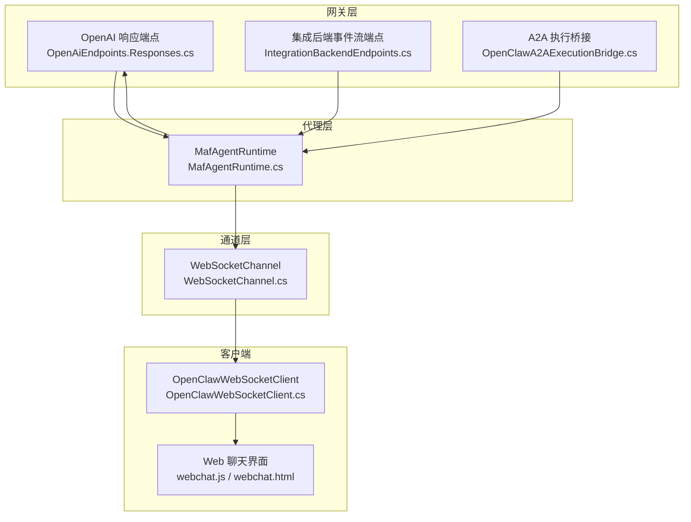
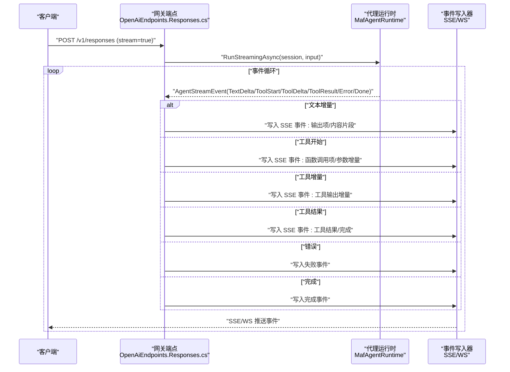
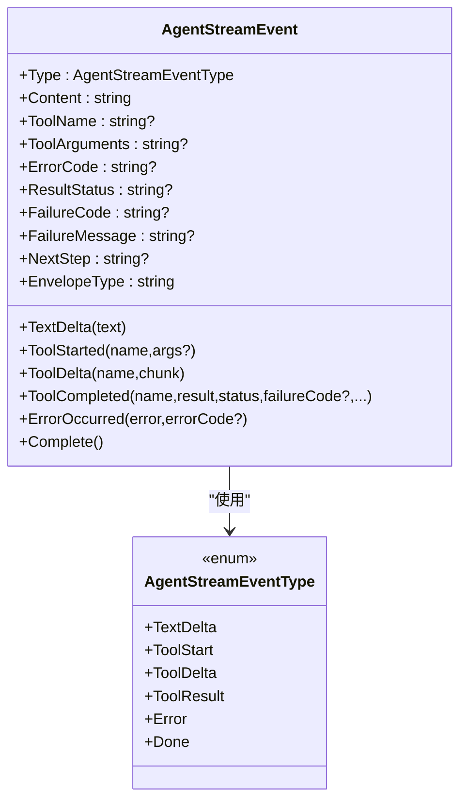
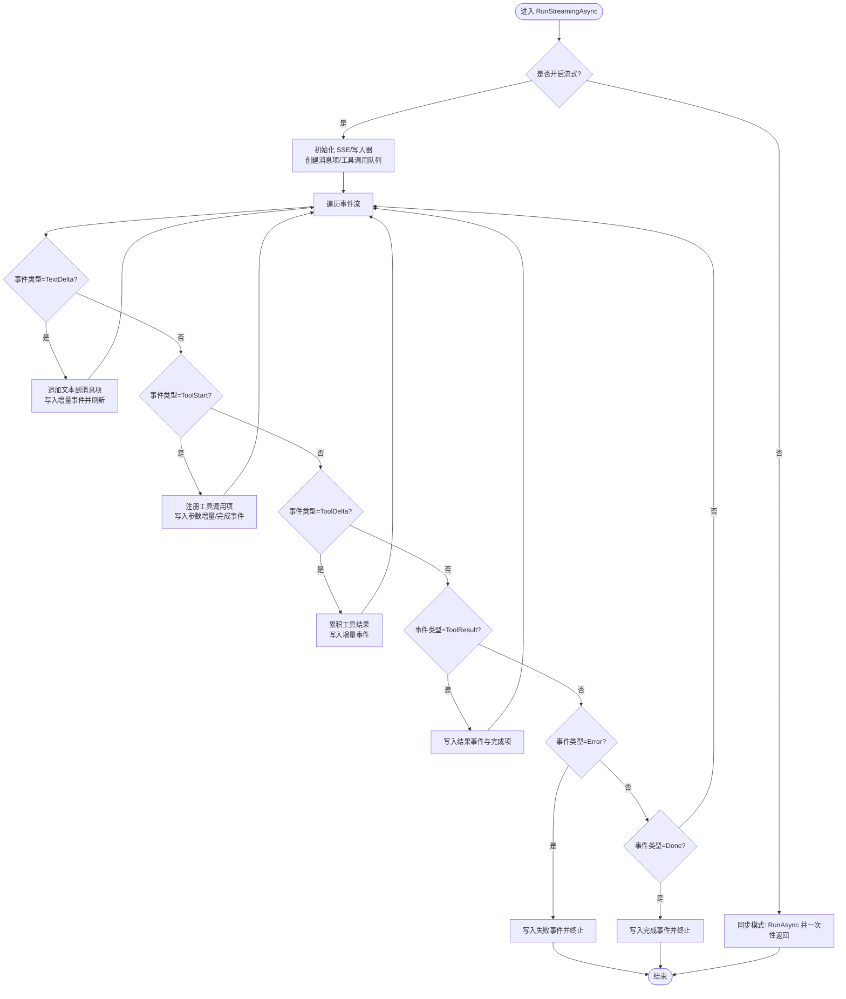
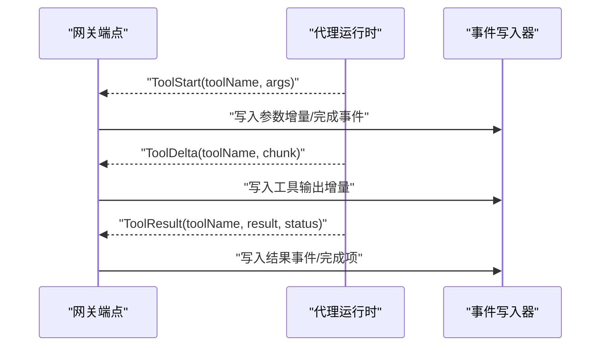
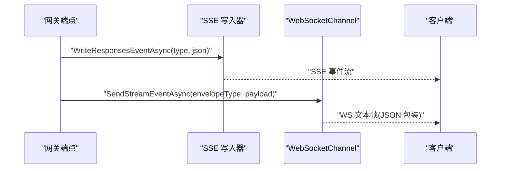
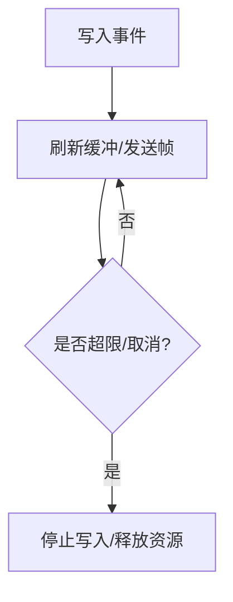
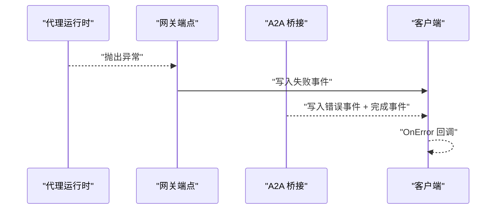
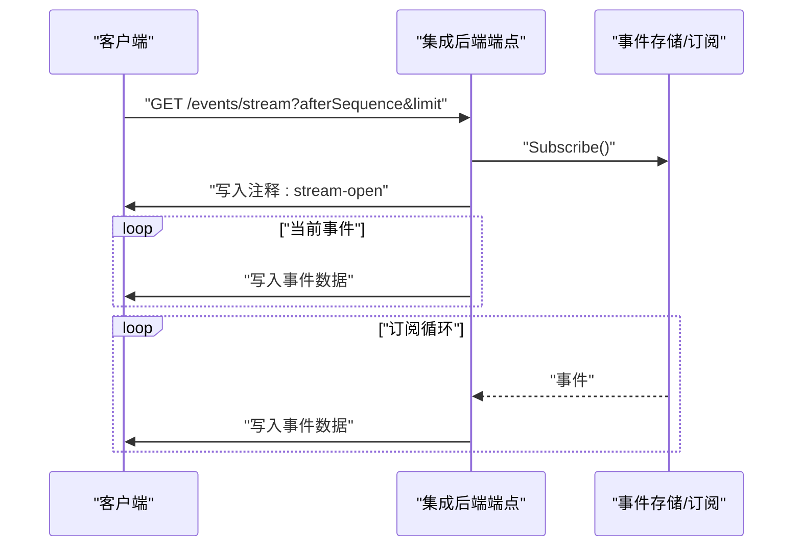
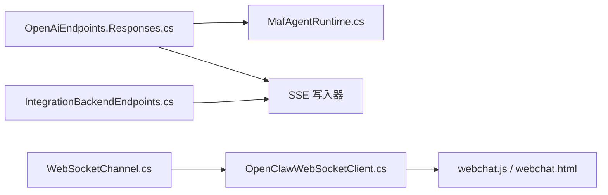

# 流式响应处理

<cite>
**本文引用的文件**
- [StreamingTypes.cs](file://src/OpenClaw.Core/Models/StreamingTypes.cs)
- [IStreamingTool.cs](file://src/OpenClaw.Core/Abstractions/IStreamingTool.cs)
- [OpenAiEndpoints.Responses.cs](file://src/OpenClaw.Gateway/Endpoints/OpenAiEndpoints.Responses.cs)
- [IntegrationBackendEndpoints.cs](file://src/OpenClaw.Gateway/Endpoints/IntegrationBackendEndpoints.cs)
- [WebSocketChannel.cs](file://src/OpenClaw.Channels/WebSocketChannel.cs)
- [OpenClawA2AExecutionBridge.cs](file://src/OpenClaw.Gateway/A2A/OpenClawA2AExecutionBridge.cs)
- [MafAgentRuntime.cs](file://src/OpenClaw.Agent/MafAgentRuntime.cs)
- [MafServiceCollectionExtensions.cs](file://src/OpenClaw.Agent/MafServiceCollectionExtensions.cs)
- [RuntimeMetrics.cs](file://src/OpenClaw.Core/Observability/RuntimeMetrics.cs)
- [OpenClawWebSocketClient.cs](file://src/OpenClaw.Client/OpenClawWebSocketClient.cs)
- [webchat.js](file://src/OpenClaw.Gateway/wwwroot/webchat.js)
- [webchat.html](file://src/OpenClaw.Gateway/wwwroot/webchat.html)
- [A2AIntegrationTests.cs](file://src/OpenClaw.Tests/A2AIntegrationTests.cs)
- [GatewayAdminEndpointTests.cs](file://src/OpenClaw.Tests/GatewayAdminEndpointTests.cs)
- [GatewayWorkersTests.cs](file://src/OpenClaw.Tests/GatewayWorkersTests.cs)
</cite>

## 目录
1. [简介](#简介)
2. [项目结构](#项目结构)
3. [核心组件](#核心组件)
4. [架构总览](#架构总览)
5. [详细组件分析](#详细组件分析)
6. [依赖关系分析](#依赖关系分析)
7. [性能考量](#性能考量)
8. [故障排查指南](#故障排查指南)
9. [结论](#结论)
10. [附录](#附录)

## 简介
本文件系统性阐述流式响应处理体系，围绕 RunStreamingAsync 的实现路径、事件流管理、文本增量与工具调用的流式传输进行深入解析，并覆盖 AgentStreamEvent 类型模型、事件写入器、背压与异常传播、渲染优化与实时更新、连接状态管理与错误恢复策略、配置项与可观测性指标及调试工具。

## 项目结构
流式响应处理涉及网关端点、通道层、代理运行时与前端客户端等多层协作：
- 网关端点负责接收请求、建立 SSE/WS 连接、桥接 AgentStreamEvent 到客户端事件格式
- 通道层负责 WebSocket 连接管理与事件推送
- 代理运行时负责执行会话、产生 AgentStreamEvent 流
- 客户端负责订阅事件、渲染增量内容与维护连接状态

图表来源
- [OpenAiEndpoints.Responses.cs:140-571](file://src/OpenClaw.Gateway/Endpoints/OpenAiEndpoints.Responses.cs#L140-L571)
- [IntegrationBackendEndpoints.cs:151-215](file://src/OpenClaw.Gateway/Endpoints/IntegrationBackendEndpoints.cs#L151-L215)
- [OpenClawA2AExecutionBridge.cs:70-89](file://src/OpenClaw.Gateway/A2A/OpenClawA2AExecutionBridge.cs#L70-L89)
- [MafAgentRuntime.cs:1-200](file://src/OpenClaw.Agent/MafAgentRuntime.cs#L1-L200)
- [WebSocketChannel.cs:242-281](file://src/OpenClaw.Channels/WebSocketChannel.cs#L242-L281)
- [OpenClawWebSocketClient.cs:214-247](file://src/OpenClaw.Client/OpenClawWebSocketClient.cs#L214-L247)
- [webchat.js:828-861](file://src/OpenClaw.Gateway/wwwroot/webchat.js#L828-L861)

章节来源
- [OpenAiEndpoints.Responses.cs:140-571](file://src/OpenClaw.Gateway/Endpoints/OpenAiEndpoints.Responses.cs#L140-L571)
- [IntegrationBackendEndpoints.cs:151-215](file://src/OpenClaw.Gateway/Endpoints/IntegrationBackendEndpoints.cs#L151-L215)
- [OpenClawA2AExecutionBridge.cs:70-89](file://src/OpenClaw.Gateway/A2A/OpenClawA2AExecutionBridge.cs#L70-L89)
- [MafAgentRuntime.cs:1-200](file://src/OpenClaw.Agent/MafAgentRuntime.cs#L1-L200)
- [WebSocketChannel.cs:242-281](file://src/OpenClaw.Channels/WebSocketChannel.cs#L242-L281)
- [OpenClawWebSocketClient.cs:214-247](file://src/OpenClaw.Client/OpenClawWebSocketClient.cs#L214-L247)
- [webchat.js:828-861](file://src/OpenClaw.Gateway/wwwroot/webchat.js#L828-L861)

## 核心组件
- AgentStreamEvent 与类型：定义流式事件类型（文本增量、工具开始/增量/结果、错误、完成），并提供零分配热路径构造方法与 WS 包装映射
- IStreamingTool：可选的工具接口，支持以增量字符串序列返回工具输出
- 网关端点（OpenAI 兼容）：在请求开启流式时，设置 SSE 头并逐事件写入，桥接文本增量与工具调用的参数/结果
- 集成后端事件流：为后端会话提供 SSE 事件流，支持分页与实时订阅
- WebSocketChannel：管理长连接、按包发送事件、支持基于 JSON 包装的流式事件
- 代理运行时（MafAgentRuntime）：执行会话、生成 AgentStreamEvent 序列、处理工具调用与内存/令牌预算
- A2A 执行桥接：将 A2A 请求转换为流式事件并回传
- 客户端与前端：订阅事件、渲染增量、维护连接状态与重连逻辑

章节来源
- [StreamingTypes.cs:1-88](file://src/OpenClaw.Core/Models/StreamingTypes.cs#L1-L88)
- [IStreamingTool.cs:1-11](file://src/OpenClaw.Core/Abstractions/IStreamingTool.cs#L1-L11)
- [OpenAiEndpoints.Responses.cs:140-571](file://src/OpenClaw.Gateway/Endpoints/OpenAiEndpoints.Responses.cs#L140-L571)
- [IntegrationBackendEndpoints.cs:151-215](file://src/OpenClaw.Gateway/Endpoints/IntegrationBackendEndpoints.cs#L151-L215)
- [WebSocketChannel.cs:242-281](file://src/OpenClaw.Channels/WebSocketChannel.cs#L242-L281)
- [MafAgentRuntime.cs:1-200](file://src/OpenClaw.Agent/MafAgentRuntime.cs#L1-L200)
- [OpenClawA2AExecutionBridge.cs:70-89](file://src/OpenClaw.Gateway/A2A/OpenClawA2AExecutionBridge.cs#L70-L89)
- [OpenClawWebSocketClient.cs:214-247](file://src/OpenClaw.Client/OpenClawWebSocketClient.cs#L214-L247)

## 架构总览
下图展示从请求到事件消费的完整链路，包括文本增量与工具调用的两条主要事件流。

图表来源
- [OpenAiEndpoints.Responses.cs:140-571](file://src/OpenClaw.Gateway/Endpoints/OpenAiEndpoints.Responses.cs#L140-L571)
- [MafAgentRuntime.cs:1-200](file://src/OpenClaw.Agent/MafAgentRuntime.cs#L1-L200)

## 详细组件分析

### AgentStreamEvent 类型与事件模型
- 类型枚举：TextDelta、ToolStart、ToolDelta、ToolResult、Error、Done
- 结构体设计：零分配热路径，提供静态工厂方法快速构造常用事件
- 映射到 WS 包装类型：用于 WebSocket 通道的事件类型映射

图表来源
- [StreamingTypes.cs:6-25](file://src/OpenClaw.Core/Models/StreamingTypes.cs#L6-L25)
- [StreamingTypes.cs:31-87](file://src/OpenClaw.Core/Models/StreamingTypes.cs#L31-L87)

章节来源
- [StreamingTypes.cs:1-88](file://src/OpenClaw.Core/Models/StreamingTypes.cs#L1-L88)

### RunStreamingAsync 实现与事件流管理
- 网关端点在请求开启流式时，设置 SSE 头并初始化事件写入器
- 通过 RunStreamingAsync 获取事件流，按事件类型分别处理：
  - 文本增量：构建消息项与内容片段事件，增量写入并刷新缓冲
  - 工具开始：注册函数调用项，写入参数增量与完成事件
  - 工具增量：累积结果并写入工具输出增量
  - 工具结果：写入结果事件与完成项
  - 错误：写入失败事件并终止
  - 完成：写入完成事件并终止
- 异常传播：捕获非取消异常并写入失败事件；取消异常按取消处理

图表来源
- [OpenAiEndpoints.Responses.cs:140-571](file://src/OpenClaw.Gateway/Endpoints/OpenAiEndpoints.Responses.cs#L140-L571)

章节来源
- [OpenAiEndpoints.Responses.cs:140-571](file://src/OpenClaw.Gateway/Endpoints/OpenAiEndpoints.Responses.cs#L140-L571)

### 文本增量处理与工具调用流式传输
- 文本增量：确保消息项存在，追加增量，写入内容片段事件并刷新
- 工具调用：
  - 注册/获取工具调用状态，写入参数增量与完成事件
  - 工具增量：累积结果并写入工具输出增量
  - 工具结果：写入结果事件与完成项，并清理调用队列

图表来源
- [OpenAiEndpoints.Responses.cs:400-527](file://src/OpenClaw.Gateway/Endpoints/OpenAiEndpoints.Responses.cs#L400-L527)

章节来源
- [OpenAiEndpoints.Responses.cs:400-527](file://src/OpenClaw.Gateway/Endpoints/OpenAiEndpoints.Responses.cs#L400-L527)

### 事件写入器与 SSE/WS 模式
- SSE 写入器：为每个事件写入 event/data/空行格式，支持刷新缓冲
- WS 写入器：仅对启用 JSON 包装的连接发送流式事件，序列化为服务器包并发送

图表来源
- [OpenAiEndpoints.Responses.cs:156-157](file://src/OpenClaw.Gateway/Endpoints/OpenAiEndpoints.Responses.cs#L156-L157)
- [WebSocketChannel.cs:242-281](file://src/OpenClaw.Channels/WebSocketChannel.cs#L242-L281)

章节来源
- [OpenAiEndpoints.Responses.cs:156-157](file://src/OpenClaw.Gateway/Endpoints/OpenAiEndpoints.Responses.cs#L156-L157)
- [WebSocketChannel.cs:242-281](file://src/OpenClaw.Channels/WebSocketChannel.cs#L242-L281)

### 背压处理与连接状态管理
- 背压：SSE/WS 写入后主动刷新缓冲，避免阻塞；WebSocketChannel 对每 IP/MIN 速率限制与最大连接数进行控制
- 连接状态：前端维护连接状态（连接中/已连接/断开/重连），根据 WS 事件切换 UI 状态与自动刷新

图表来源
- [OpenAiEndpoints.Responses.cs:373-571](file://src/OpenClaw.Gateway/Endpoints/OpenAiEndpoints.Responses.cs#L373-L571)
- [WebSocketChannel.cs:334-354](file://src/OpenClaw.Channels/WebSocketChannel.cs#L334-L354)
- [webchat.js:828-861](file://src/OpenClaw.Gateway/wwwroot/webchat.js#L828-L861)

章节来源
- [OpenAiEndpoints.Responses.cs:373-571](file://src/OpenClaw.Gateway/Endpoints/OpenAiEndpoints.Responses.cs#L373-L571)
- [WebSocketChannel.cs:334-354](file://src/OpenClaw.Channels/WebSocketChannel.cs#L334-L354)
- [webchat.js:828-861](file://src/OpenClaw.Gateway/wwwroot/webchat.js#L828-L861)

### 异常流式传播与错误恢复
- 网关端点捕获非取消异常并写入失败事件，随后终止流
- A2A 执行桥接捕获异常并发出错误事件与完成事件，确保客户端收到终端信号
- 客户端在接收循环中捕获异常并上报错误

图表来源
- [OpenAiEndpoints.Responses.cs:561-570](file://src/OpenClaw.Gateway/Endpoints/OpenAiEndpoints.Responses.cs#L561-L570)
- [OpenClawA2AExecutionBridge.cs:75-84](file://src/OpenClaw.Gateway/A2A/OpenClawA2AExecutionBridge.cs#L75-L84)
- [OpenClawWebSocketClient.cs:216-222](file://src/OpenClaw.Client/OpenClawWebSocketClient.cs#L216-L222)

章节来源
- [OpenAiEndpoints.Responses.cs:561-570](file://src/OpenClaw.Gateway/Endpoints/OpenAiEndpoints.Responses.cs#L561-L570)
- [OpenClawA2AExecutionBridge.cs:75-84](file://src/OpenClaw.Gateway/A2A/OpenClawA2AExecutionBridge.cs#L75-L84)
- [OpenClawWebSocketClient.cs:216-222](file://src/OpenClaw.Client/OpenClawWebSocketClient.cs#L216-L222)

### 集成后端事件流（SSE）
- 支持分页查询与实时订阅，写入注释行标识流开启，过滤非目标会话事件，遇到完成事件即停止

图表来源
- [IntegrationBackendEndpoints.cs:151-215](file://src/OpenClaw.Gateway/Endpoints/IntegrationBackendEndpoints.cs#L151-L215)

章节来源
- [IntegrationBackendEndpoints.cs:151-215](file://src/OpenClaw.Gateway/Endpoints/IntegrationBackendEndpoints.cs#L151-L215)

### 流式渲染优化与实时更新
- 渲染优化：事件写入后立即刷新，减少等待时间；前端按事件类型增量更新 UI
- 实时更新：WebSocketChannel 维护连接状态，前端定时刷新会话列表，断线自动重连

章节来源
- [OpenAiEndpoints.Responses.cs:373-571](file://src/OpenClaw.Gateway/Endpoints/OpenAiEndpoints.Responses.cs#L373-L571)
- [webchat.js:828-861](file://src/OpenClaw.Gateway/wwwroot/webchat.js#L828-L861)
- [webchat.html:462-506](file://src/OpenClaw.Gateway/wwwroot/webchat.html#L462-L506)

## 依赖关系分析
- 网关端点依赖代理运行时产生事件流
- 事件写入器依赖 SSE/WS 通道
- 通道层依赖连接配置与速率限制
- 客户端依赖前端 UI 与 WebSocket 客户端

图表来源
- [OpenAiEndpoints.Responses.cs:140-571](file://src/OpenClaw.Gateway/Endpoints/OpenAiEndpoints.Responses.cs#L140-L571)
- [IntegrationBackendEndpoints.cs:151-215](file://src/OpenClaw.Gateway/Endpoints/IntegrationBackendEndpoints.cs#L151-L215)
- [WebSocketChannel.cs:242-281](file://src/OpenClaw.Channels/WebSocketChannel.cs#L242-L281)
- [OpenClawWebSocketClient.cs:214-247](file://src/OpenClaw.Client/OpenClawWebSocketClient.cs#L214-L247)
- [webchat.js:828-861](file://src/OpenClaw.Gateway/wwwroot/webchat.js#L828-L861)

章节来源
- [OpenAiEndpoints.Responses.cs:140-571](file://src/OpenClaw.Gateway/Endpoints/OpenAiEndpoints.Responses.cs#L140-L571)
- [IntegrationBackendEndpoints.cs:151-215](file://src/OpenClaw.Gateway/Endpoints/IntegrationBackendEndpoints.cs#L151-L215)
- [WebSocketChannel.cs:242-281](file://src/OpenClaw.Channels/WebSocketChannel.cs#L242-L281)
- [OpenClawWebSocketClient.cs:214-247](file://src/OpenClaw.Client/OpenClawWebSocketClient.cs#L214-L247)
- [webchat.js:828-861](file://src/OpenClaw.Gateway/wwwroot/webchat.js#L828-L861)

## 性能考量
- 事件写入与刷新：SSE/WS 写入后立即刷新，降低延迟
- 连接与速率限制：WebSocketChannel 对每 IP/MIN 速率与最大连接数进行限制，防止过载
- 观测性指标：RuntimeMetrics 提供运行时度量，可用于评估吞吐与错误率

章节来源
- [OpenAiEndpoints.Responses.cs:373-571](file://src/OpenClaw.Gateway/Endpoints/OpenAiEndpoints.Responses.cs#L373-L571)
- [WebSocketChannel.cs:334-354](file://src/OpenClaw.Channels/WebSocketChannel.cs#L334-L354)
- [RuntimeMetrics.cs:212-311](file://src/OpenClaw.Core/Observability/RuntimeMetrics.cs#L212-L311)

## 故障排查指南
- 流式事件未到达：检查 SSE/WS 写入是否成功、刷新是否生效、客户端是否正确订阅
- 工具调用无增量：确认工具实现 IStreamingTool，或检查工具结果事件是否被正确写出
- 连接断开：前端连接状态与自动重连逻辑，查看 webchat.js 中连接状态切换
- 异常未传播：确认网关端点与 A2A 桥接中的异常捕获与错误事件写出
- 单元测试参考：集成测试验证了事件流的正确性与终止条件

章节来源
- [GatewayAdminEndpointTests.cs:6305-6331](file://src/OpenClaw.Tests/GatewayAdminEndpointTests.cs#L6305-L6331)
- [A2AIntegrationTests.cs:170-200](file://src/OpenClaw.Tests/A2AIntegrationTests.cs#L170-L200)
- [GatewayWorkersTests.cs:427-453](file://src/OpenClaw.Tests/GatewayWorkersTests.cs#L427-L453)
- [OpenClawWebSocketClient.cs:216-222](file://src/OpenClaw.Client/OpenClawWebSocketClient.cs#L216-L222)
- [webchat.js:828-861](file://src/OpenClaw.Gateway/wwwroot/webchat.js#L828-L861)

## 结论
该流式响应处理系统以 AgentStreamEvent 为核心抽象，通过网关端点将代理运行时产生的事件流桥接到 SSE/WS 客户端，实现了文本增量与工具调用的实时传输。系统在事件写入、背压控制、异常传播与连接状态管理方面具备清晰的设计与实现，配合前端实时渲染与可观测性指标，能够满足生产环境的低延迟与高可靠需求。

## 附录

### 流式配置选项
- 代理运行时配置：EnableStreaming/EnableStreamingFallback 等选项由服务配置注入
- WebSocket 连接配置：最大连接数、每 IP 最大连接数、速率限制等

章节来源
- [MafServiceCollectionExtensions.cs:33-64](file://src/OpenClaw.Agent/MafServiceCollectionExtensions.cs#L33-L64)
- [WebSocketChannel.cs:334-354](file://src/OpenClaw.Channels/WebSocketChannel.cs#L334-L354)

### 性能监控指标
- 运行时指标：进程启动/完成/失败/超时、提示缓存读写/预热、脉冲运行、保留策略等

章节来源
- [RuntimeMetrics.cs:212-311](file://src/OpenClaw.Core/Observability/RuntimeMetrics.cs#L212-L311)

### 调试工具
- 前端：连接状态指示、自动重连、会话刷新
- 客户端：接收循环异常捕获与错误回调
- 单元测试：事件流解析与断言

章节来源
- [webchat.js:828-861](file://src/OpenClaw.Gateway/wwwroot/webchat.js#L828-L861)
- [OpenClawWebSocketClient.cs:216-222](file://src/OpenClaw.Client/OpenClawWebSocketClient.cs#L216-L222)
- [A2AIntegrationTests.cs:555-590](file://src/OpenClaw.Tests/A2AIntegrationTests.cs#L555-L590)