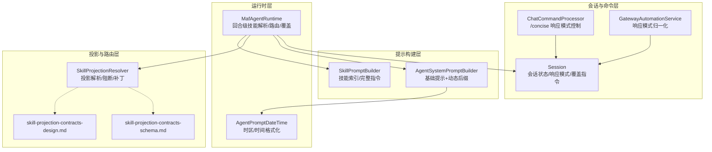
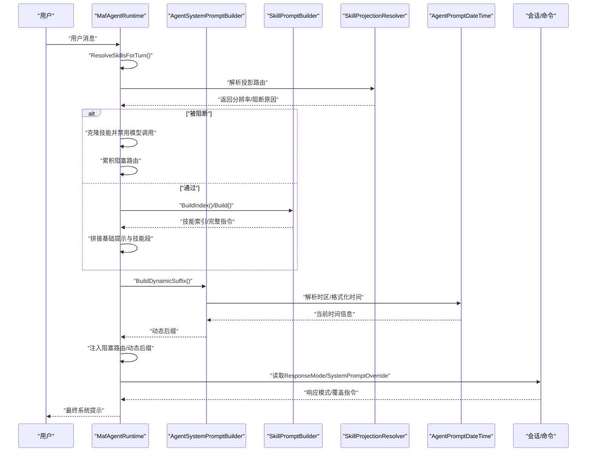
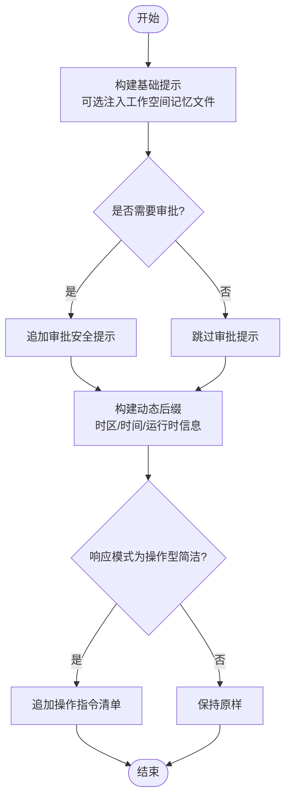
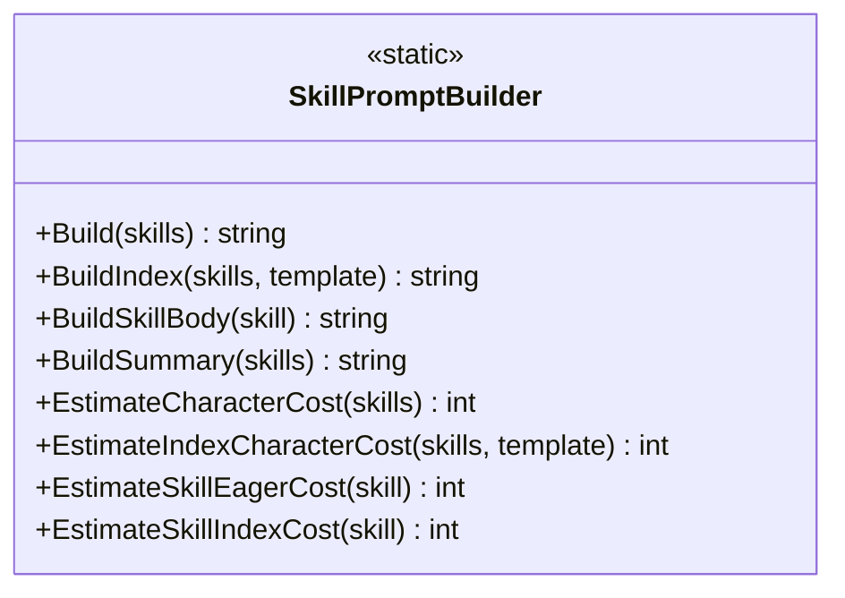
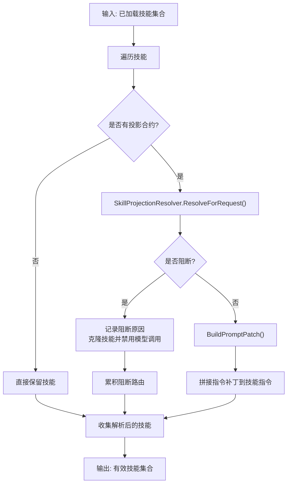
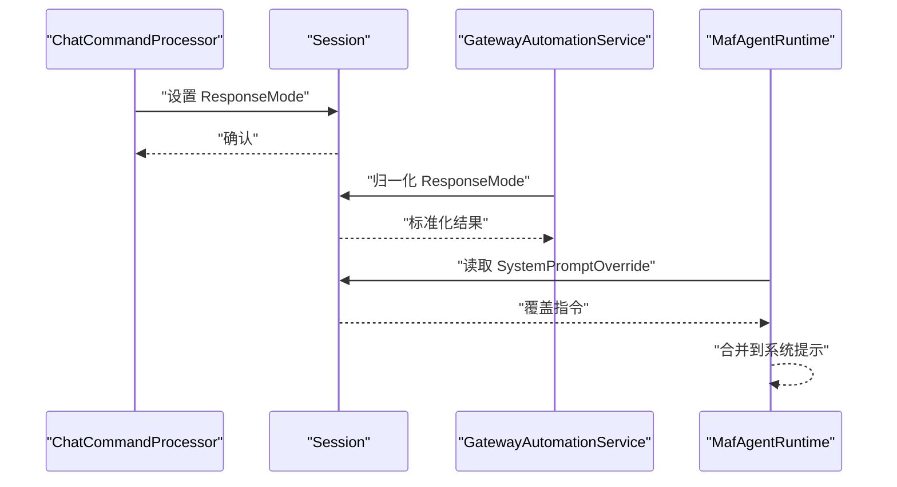
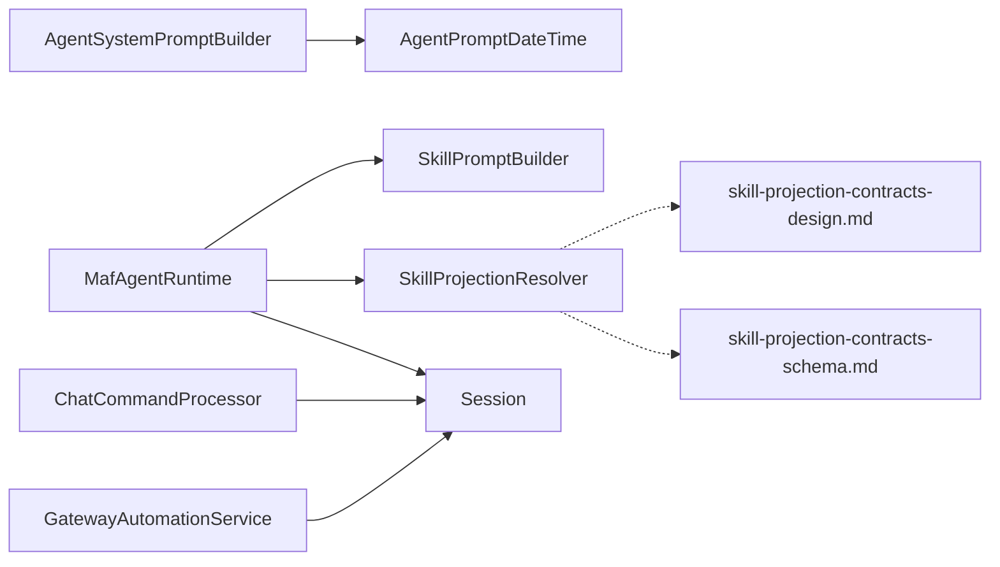

# 系统提示构建

<cite>
**本文档引用的文件**
- [AgentSystemPromptBuilder.cs](file://src/OpenClaw.Agent/AgentSystemPromptBuilder.cs)
- [SkillPromptBuilder.cs](file://src/OpenClaw.Core/Skills/SkillPromptBuilder.cs)
- [MafAgentRuntime.cs](file://src/OpenClaw.Agent/MafAgentRuntime.cs)
- [AgentPromptDateTime.cs](file://src/OpenClaw.Agent/AgentPromptDateTime.cs)
- [Session.cs](file://src/OpenClaw.Core/Models/Session.cs)
- [ChatCommandProcessor.cs](file://src/OpenClaw.Core/Pipeline/ChatCommandProcessor.cs)
- [GatewayAutomationService.cs](file://src/OpenClaw.Gateway/GatewayAutomationService.cs)
- [SkillProjectionResolver.cs](file://src/OpenClaw.Core/Skills/SkillProjectionResolver.cs)
- [skill-projection-contracts-design.md](file://docs/skill-projection-contracts-design.md)
- [skill-projection-contracts-schema.md](file://docs/skill-projection-contracts-schema.md)
- [AgentSystemPromptBuilderTests.cs](file://src/OpenClaw.Tests/AgentSystemPromptBuilderTests.cs)
- [SkillTests.cs](file://src/OpenClaw.Tests/SkillTests.cs)
</cite>

## 目录
1. [简介](#简介)
2. [项目结构](#项目结构)
3. [核心组件](#核心组件)
4. [架构总览](#架构总览)
5. [详细组件分析](#详细组件分析)
6. [依赖关系分析](#依赖关系分析)
7. [性能考量](#性能考量)
8. [故障排除指南](#故障排除指南)
9. [结论](#结论)
10. [附录](#附录)

## 简介
本文件系统化阐述系统提示构建子系统的设计与实现，重点围绕 AgentSystemPromptBuilder 的构建逻辑、动态提示生成、技能提示整合、路由指令处理等关键能力。文档同时覆盖提示模板系统、上下文感知构建、技能选择算法、阻塞路由处理、提示长度优化、动态内容注入、多模态支持与个性化定制，并提供提示配置选项、调试技巧与效果优化建议。

## 项目结构
系统提示构建涉及三个层面：
- 基础提示层：由 AgentSystemPromptBuilder 负责，生成基础系统提示并注入动态后缀（时间、运行时环境）。
- 技能提示层：由 SkillPromptBuilder 负责，提供技能索引与完整指令的两种输出形态，支持渐进披露与按需加载。
- 路由与上下文层：由 MafAgentRuntime 负责，在每次对话回合中根据用户输入与投影合约进行技能筛选与指令补丁拼接，并处理阻塞路由与会话级覆盖指令。

**图表来源**
- [AgentSystemPromptBuilder.cs:1-150](file://src/OpenClaw.Agent/AgentSystemPromptBuilder.cs#L1-L150)
- [SkillPromptBuilder.cs:1-354](file://src/OpenClaw.Core/Skills/SkillPromptBuilder.cs#L1-L354)
- [MafAgentRuntime.cs:589-788](file://src/OpenClaw.Agent/MafAgentRuntime.cs#L589-L788)
- [AgentPromptDateTime.cs:1-45](file://src/OpenClaw.Agent/AgentPromptDateTime.cs#L1-L45)
- [Session.cs:1-135](file://src/OpenClaw.Core/Models/Session.cs#L1-L135)
- [ChatCommandProcessor.cs:171-198](file://src/OpenClaw.Core/Pipeline/ChatCommandProcessor.cs#L171-L198)
- [GatewayAutomationService.cs:705-716](file://src/OpenClaw.Gateway/GatewayAutomationService.cs#L705-L716)
- [SkillProjectionResolver.cs:39-74](file://src/OpenClaw.Core/Skills/SkillProjectionResolver.cs#L39-L74)
- [skill-projection-contracts-design.md:196-319](file://docs/skill-projection-contracts-design.md#L196-L319)
- [skill-projection-contracts-schema.md:439-496](file://docs/skill-projection-contracts-schema.md#L439-L496)

**章节来源**
- [AgentSystemPromptBuilder.cs:1-150](file://src/OpenClaw.Agent/AgentSystemPromptBuilder.cs#L1-L150)
- [SkillPromptBuilder.cs:1-354](file://src/OpenClaw.Core/Skills/SkillPromptBuilder.cs#L1-L354)
- [MafAgentRuntime.cs:589-788](file://src/OpenClaw.Agent/MafAgentRuntime.cs#L589-L788)

## 核心组件
- AgentSystemPromptBuilder：负责基础系统提示的构建与动态后缀注入，支持工作空间记忆文件（AGENTS.md、SOUL.md）的可选注入，以及响应模式下的操作指令注入。
- SkillPromptBuilder：提供技能提示的两种输出形态：仅索引（渐进披露）与完整指令（包含每个技能的详细说明），并提供成本估算与摘要输出，便于调试与预算控制。
- MafAgentRuntime：在每次回合中解析技能、应用投影路由、处理阻塞路由、注入动态后缀，并支持会话级覆盖指令（SystemPromptOverride）与阻塞路由汇总展示。
- AgentPromptDateTime：提供时区解析与时钟格式化，确保动态后缀中的时间信息准确。
- 会话与命令：Session 持有 ResponseMode 与 SystemPromptOverride；ChatCommandProcessor 提供 /concise 控制；GatewayAutomationService 归一化响应模式。

**章节来源**
- [AgentSystemPromptBuilder.cs:20-101](file://src/OpenClaw.Agent/AgentSystemPromptBuilder.cs#L20-L101)
- [SkillPromptBuilder.cs:20-145](file://src/OpenClaw.Core/Skills/SkillPromptBuilder.cs#L20-L145)
- [MafAgentRuntime.cs:589-620](file://src/OpenClaw.Agent/MafAgentRuntime.cs#L589-L620)
- [AgentPromptDateTime.cs:7-45](file://src/OpenClaw.Agent/AgentPromptDateTime.cs#L7-L45)
- [Session.cs:61-62](file://src/OpenClaw.Core/Models/Session.cs#L61-L62)
- [ChatCommandProcessor.cs:171-198](file://src/OpenClaw.Core/Pipeline/ChatCommandProcessor.cs#L171-L198)
- [GatewayAutomationService.cs:705-716](file://src/OpenClaw.Gateway/GatewayAutomationService.cs#L705-L716)

## 架构总览
系统提示构建采用“基础提示 + 技能索引/完整指令 + 动态后缀”的分层设计。运行时在回合开始时：
- 读取基础提示与技能索引；
- 应用投影路由解析，生成阻塞路由与指令补丁；
- 注入动态后缀（时间、运行时环境）；
- 应用会话级覆盖指令；
- 输出最终系统提示。

**图表来源**
- [MafAgentRuntime.cs:589-620](file://src/OpenClaw.Agent/MafAgentRuntime.cs#L589-L620)
- [MafAgentRuntime.cs:1016-1056](file://src/OpenClaw.Agent/MafAgentRuntime.cs#L1016-L1056)
- [AgentSystemPromptBuilder.cs:111-118](file://src/OpenClaw.Agent/AgentSystemPromptBuilder.cs#L111-L118)
- [AgentPromptDateTime.cs:13-21](file://src/OpenClaw.Agent/AgentPromptDateTime.cs#L13-L21)
- [SkillPromptBuilder.cs:20-63](file://src/OpenClaw.Core/Skills/SkillPromptBuilder.cs#L20-L63)
- [SkillProjectionResolver.cs:39-74](file://src/OpenClaw.Core/Skills/SkillProjectionResolver.cs#L39-L74)
- [Session.cs:61-62](file://src/OpenClaw.Core/Models/Session.cs#L61-L62)

## 详细组件分析

### AgentSystemPromptBuilder 分析
- 基础提示构建：支持可选的工作空间记忆文件注入（AGENTS.md、SOUL.md），并根据是否需要审批（requireApproval）添加安全提示。
- 动态后缀：每回合注入当前时间与运行时信息（主机名、操作系统、.NET 版本、Shell），确保上下文时效性。
- 响应模式：针对“操作型简洁响应”模式，追加操作指令清单，帮助模型在受限输出风格下仍保持可操作性。

**图表来源**
- [AgentSystemPromptBuilder.cs:29-101](file://src/OpenClaw.Agent/AgentSystemPromptBuilder.cs#L29-L101)
- [AgentSystemPromptBuilder.cs:103-118](file://src/OpenClaw.Agent/AgentSystemPromptBuilder.cs#L103-L118)
- [AgentPromptDateTime.cs:7-45](file://src/OpenClaw.Agent/AgentPromptDateTime.cs#L7-L45)

**章节来源**
- [AgentSystemPromptBuilder.cs:20-101](file://src/OpenClaw.Agent/AgentSystemPromptBuilder.cs#L20-L101)
- [AgentSystemPromptBuilderTests.cs:9-23](file://src/OpenClaw.Tests/AgentSystemPromptBuilderTests.cs#L9-L23)

### SkillPromptBuilder 分析
- 渐进披露：BuildIndex 仅输出技能元数据与资源清单，避免一次性注入大量指令文本，降低提示长度与成本。
- 完整指令：Build 输出技能索引与每个技能的详细说明，适合需要一次性提供完整上下文的场景。
- 成本估算：提供估算函数，帮助在调试与预算控制时预估字符成本。
- 摘要输出：BuildSummary 用于快速查看已加载技能及其标志位，辅助排障。

**图表来源**
- [SkillPromptBuilder.cs:9-354](file://src/OpenClaw.Core/Skills/SkillPromptBuilder.cs#L9-L354)

**章节来源**
- [SkillPromptBuilder.cs:20-145](file://src/OpenClaw.Core/Skills/SkillPromptBuilder.cs#L20-L145)
- [SkillTests.cs:583-786](file://src/OpenClaw.Tests/SkillTests.cs#L583-L786)

### MafAgentRuntime 技能解析与路由处理
- 技能解析：ResolveSkillsForTurn 遍历技能，对具备投影合约的技能调用 SkillProjectionResolver 进行解析。
- 阻断路由：当解析被阻断时，记录阻断原因与技能名称，克隆技能并禁用模型调用，同时累积阻断路由列表。
- 指令补丁：当解析通过时，基于 Resolution 构建 Prompt Patch 并追加到技能指令末尾，实现“细化而非替换”的投影集成。
- 动态后缀注入：在技能段之后注入动态后缀，随后应用会话级覆盖指令（SystemPromptOverride）。

**图表来源**
- [MafAgentRuntime.cs:1016-1056](file://src/OpenClaw.Agent/MafAgentRuntime.cs#L1016-L1056)
- [SkillProjectionResolver.cs:39-74](file://src/OpenClaw.Core/Skills/SkillProjectionResolver.cs#L39-L74)

**章节来源**
- [MafAgentRuntime.cs:589-620](file://src/OpenClaw.Agent/MafAgentRuntime.cs#L589-L620)
- [MafAgentRuntime.cs:1016-1075](file://src/OpenClaw.Agent/MafAgentRuntime.cs#L1016-L1075)
- [skill-projection-contracts-design.md:196-319](file://docs/skill-projection-contracts-design.md#L196-L319)

### 响应模式与会话覆盖
- 响应模式：Session.ResponseMode 控制输出风格；/concise 命令可在会话内切换；GatewayAutomationService 对响应模式进行归一化。
- 会话覆盖：Session.SystemPromptOverride 允许路由层在运行前注入覆盖指令，最终与系统提示合并。

**图表来源**
- [ChatCommandProcessor.cs:171-198](file://src/OpenClaw.Core/Pipeline/ChatCommandProcessor.cs#L171-L198)
- [Session.cs:61-62](file://src/OpenClaw.Core/Models/Session.cs#L61-L62)
- [GatewayAutomationService.cs:705-716](file://src/OpenClaw.Gateway/GatewayAutomationService.cs#L705-L716)
- [MafAgentRuntime.cs:616-619](file://src/OpenClaw.Agent/MafAgentRuntime.cs#L616-L619)

**章节来源**
- [Session.cs:46-62](file://src/OpenClaw.Core/Models/Session.cs#L46-L62)
- [ChatCommandProcessor.cs:171-198](file://src/OpenClaw.Core/Pipeline/ChatCommandProcessor.cs#L171-L198)
- [GatewayAutomationService.cs:705-716](file://src/OpenClaw.Gateway/GatewayAutomationService.cs#L705-L716)

### 多模态支持与动态内容注入
- 多模态：运行时在非视觉模型场景下，将内联 data-URI 图像解码为临时文件路径，以减少上下文窗口占用，并通过工具读取本地路径进行分析。
- 动态内容：AgentPromptDateTime 提供时区解析与时钟格式化，确保动态后缀始终反映当前时间与运行时环境。

**章节来源**
- [MafAgentRuntime.cs:893-923](file://src/OpenClaw.Agent/MafAgentRuntime.cs#L893-L923)
- [AgentPromptDateTime.cs:13-45](file://src/OpenClaw.Agent/AgentPromptDateTime.cs#L13-L45)

## 依赖关系分析
- AgentSystemPromptBuilder 依赖 AgentPromptDateTime 提供时区与时间格式化。
- MafAgentRuntime 依赖 SkillPromptBuilder 生成技能提示，依赖 SkillProjectionResolver 进行路由解析与阻断处理。
- 会话与命令层通过 Session 字段与命令处理器影响最终系统提示的风格与覆盖指令。
- 文档资料（skill-projection-contracts-design.md、skill-projection-contracts-schema.md）定义了投影合约的绑定、解析与阻断规则。

**图表来源**
- [AgentSystemPromptBuilder.cs:1-150](file://src/OpenClaw.Agent/AgentSystemPromptBuilder.cs#L1-L150)
- [AgentPromptDateTime.cs:1-45](file://src/OpenClaw.Agent/AgentPromptDateTime.cs#L1-L45)
- [MafAgentRuntime.cs:589-788](file://src/OpenClaw.Agent/MafAgentRuntime.cs#L589-L788)
- [SkillPromptBuilder.cs:1-354](file://src/OpenClaw.Core/Skills/SkillPromptBuilder.cs#L1-L354)
- [SkillProjectionResolver.cs:39-74](file://src/OpenClaw.Core/Skills/SkillProjectionResolver.cs#L39-L74)
- [Session.cs:1-135](file://src/OpenClaw.Core/Models/Session.cs#L1-L135)
- [ChatCommandProcessor.cs:171-198](file://src/OpenClaw.Core/Pipeline/ChatCommandProcessor.cs#L171-L198)
- [GatewayAutomationService.cs:705-716](file://src/OpenClaw.Gateway/GatewayAutomationService.cs#L705-L716)
- [skill-projection-contracts-design.md:196-319](file://docs/skill-projection-contracts-design.md#L196-L319)
- [skill-projection-contracts-schema.md:439-496](file://docs/skill-projection-contracts-schema.md#L439-L496)

**章节来源**
- [MafAgentRuntime.cs:589-788](file://src/OpenClaw.Agent/MafAgentRuntime.cs#L589-L788)
- [SkillProjectionResolver.cs:39-74](file://src/OpenClaw.Core/Skills/SkillProjectionResolver.cs#L39-L74)

## 性能考量
- 渐进披露：优先使用 SkillPromptBuilder.BuildIndex，仅注入技能元数据与资源清单，避免一次性加载全部 SKILL.md 内容，显著降低提示长度与成本。
- 成本估算：利用 SkillPromptBuilder 的估算函数在调试阶段评估不同策略的成本差异，指导预算控制。
- 动态后缀：仅在回合开始时计算一次，避免重复开销；时间格式化遵循本地化规则，兼顾准确性与性能。
- 历史压缩：运行时对历史进行压缩与摘要，减少上下文负担，间接提升提示构建效率。

**章节来源**
- [SkillPromptBuilder.cs:224-298](file://src/OpenClaw.Core/Skills/SkillPromptBuilder.cs#L224-L298)
- [MafAgentRuntime.cs:684-764](file://src/OpenClaw.Agent/MafAgentRuntime.cs#L684-L764)

## 故障排除指南
- 响应模式无效：检查 Session.ResponseMode 设置与 /concise 命令执行结果，确认 GatewayAutomationService 的归一化逻辑。
- 技能未显示：确认技能未被标记为 DisableModelInvocation，或在投影解析中被阻断；查看阻塞路由汇总。
- 覆盖指令未生效：确认 SystemPromptOverride 是否为空，以及其在回合构建中的合并顺序。
- 时间信息异常：检查 AgentPromptDateTime 的时区解析与格式化逻辑，确保本地时区可用。

**章节来源**
- [AgentSystemPromptBuilderTests.cs:9-23](file://src/OpenClaw.Tests/AgentSystemPromptBuilderTests.cs#L9-L23)
- [SkillTests.cs:614-660](file://src/OpenClaw.Tests/SkillTests.cs#L614-L660)
- [MafAgentRuntime.cs:605-606](file://src/OpenClaw.Agent/MafAgentRuntime.cs#L605-L606)
- [Session.cs:46-62](file://src/OpenClaw.Core/Models/Session.cs#L46-L62)

## 结论
系统提示构建通过“基础提示 + 技能索引 + 动态后缀 + 路由指令”的组合，实现了上下文感知、可扩展、可调试与高性能的提示生成。渐进披露与投影路由机制确保提示长度可控，同时满足复杂任务的上下文需求。配合响应模式与会话覆盖指令，系统在安全性与灵活性之间取得平衡。

## 附录

### 提示配置选项
- 工作空间记忆文件：AGENTS.md、SOUL.md（自动检测与注入）
- 响应模式：Session.ResponseMode（默认/操作型简洁/全量）
- 会话覆盖指令：Session.SystemPromptOverride（路由层注入）
- 技能指令模板：SkillPromptBuilder.DefaultIndexTemplate（支持自定义模板）

**章节来源**
- [AgentSystemPromptBuilder.cs:92-100](file://src/OpenClaw.Agent/AgentSystemPromptBuilder.cs#L92-L100)
- [Session.cs:46-62](file://src/OpenClaw.Core/Models/Session.cs#L46-L62)
- [SkillPromptBuilder.cs:73-81](file://src/OpenClaw.Core/Skills/SkillPromptBuilder.cs#L73-L81)

### 调试技巧
- 使用 SkillPromptBuilder.BuildSummary 查看已加载技能与标志位。
- 使用估算函数对比 Build 与 BuildIndex 的成本差异。
- 在回合构建后检查阻塞路由汇总，定位投影解析问题。
- 验证响应模式注入与覆盖指令合并顺序。

**章节来源**
- [SkillPromptBuilder.cs:201-222](file://src/OpenClaw.Core/Skills/SkillPromptBuilder.cs#L201-L222)
- [SkillTests.cs:662-701](file://src/OpenClaw.Tests/SkillTests.cs#L662-L701)
- [MafAgentRuntime.cs:605-606](file://src/OpenClaw.Agent/MafAgentRuntime.cs#L605-L606)

### 效果优化建议
- 优先采用渐进披露（BuildIndex），仅在必要时按需加载完整指令。
- 通过投影路由细化技能指令，避免在系统提示中直接暴露大量细节。
- 合理设置会话覆盖指令，减少不必要的重复信息。
- 在非视觉模型场景下，尽量使用本地路径而非 data-URI，降低上下文长度。

**章节来源**
- [SkillPromptBuilder.cs:14-19](file://src/OpenClaw.Core/Skills/SkillPromptBuilder.cs#L14-L19)
- [MafAgentRuntime.cs:1000-1007](file://src/OpenClaw.Agent/MafAgentRuntime.cs#L1000-L1007)
- [MafAgentRuntime.cs:893-923](file://src/OpenClaw.Agent/MafAgentRuntime.cs#L893-L923)