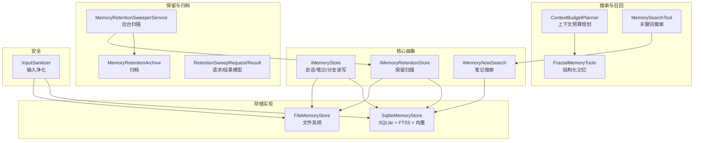
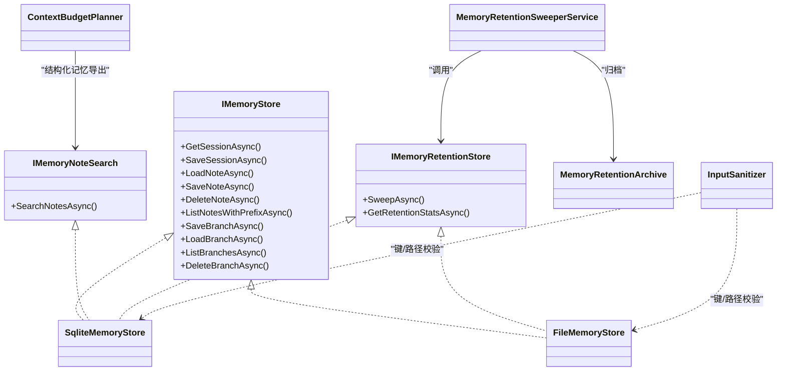
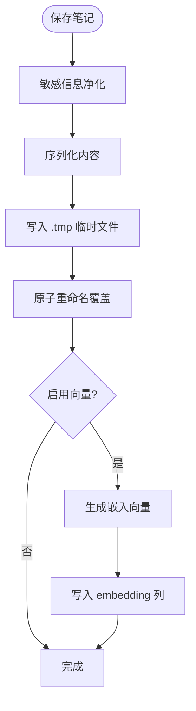
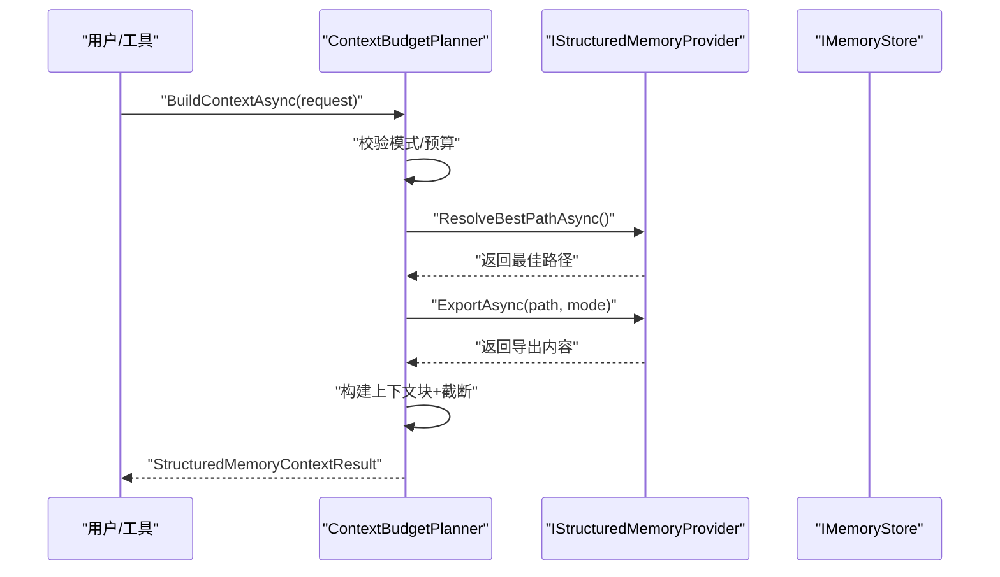
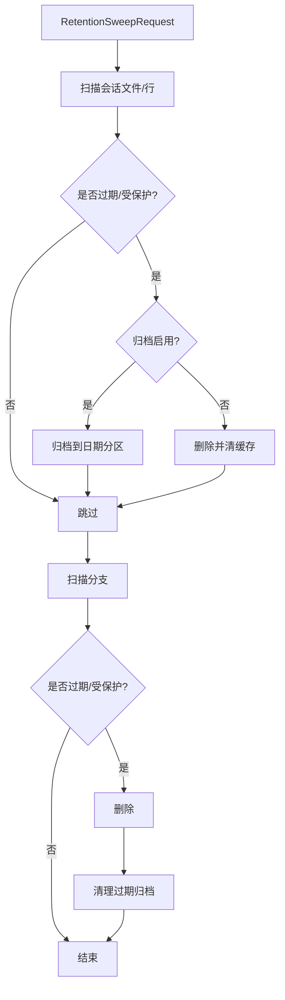
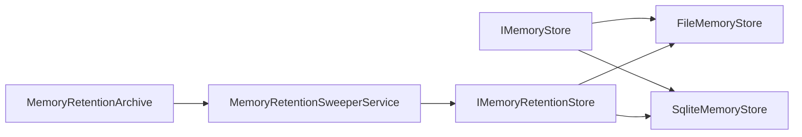

# 记忆处理

<cite>
**本文引用的文件**
- [IMemoryStore.cs](file://src/OpenClaw.Core/Abstractions/IMemoryStore.cs)
- [IMemoryNoteSearch.cs](file://src/OpenClaw.Core/Abstractions/IMemoryNoteSearch.cs)
- [IMemoryRetentionStore.cs](file://src/OpenClaw.Core/Abstractions/IMemoryRetentionStore.cs)
- [FileMemoryStore.cs](file://src/OpenClaw.Core/Memory/FileMemoryStore.cs)
- [SqliteMemoryStore.cs](file://src/OpenClaw.Core/Memory/SqliteMemoryStore.cs)
- [ContextBudgetPlanner.cs](file://src/OpenClaw.Core/Memory/ContextBudgetPlanner.cs)
- [MemoryRetentionArchive.cs](file://src/OpenClaw.Core/Memory/MemoryRetentionArchive.cs)
- [MemoryRetentionModels.cs](file://src/OpenClaw.Core/Models/MemoryRetentionModels.cs)
- [InputSanitizer.cs](file://src/OpenClaw.Core/Security/InputSanitizer.cs)
- [MemoryRetentionSweeperService.cs](file://src/OpenClaw.Gateway/Extensions/MemoryRetentionSweeperService.cs)
- [openclaw-memory-recall-and-retention.md](file://docs/openclaw-memory-recall-and-retention.md)
- [MemorySearchTool.cs](file://src/OpenClaw.Agent/Tools/MemorySearchTool.cs)
- [FractalMemoryTools.cs](file://src/OpenClaw.Agent/Tools/FractalMemoryTools.cs)
</cite>

## 目录
1. [简介](#简介)
2. [项目结构](#项目结构)
3. [核心组件](#核心组件)
4. [架构总览](#架构总览)
5. [详细组件分析](#详细组件分析)
6. [依赖关系分析](#依赖关系分析)
7. [性能考量](#性能考量)
8. [故障排查指南](#故障排查指南)
9. [结论](#结论)
10. [附录](#附录)

## 简介
本文件系统性阐述记忆处理系统的架构与实现，覆盖以下主题：
- 存储后端：文件系统与 SQLite 双栈实现及其差异
- 上下文预算规划：如何根据令牌与字符预算构建可控的上下文
- 记忆召回机制：自动与手动两种模式，以及安全注入策略
- 记忆保留策略：过期扫描、归档与生命周期管理
- 搜索与检索：全文搜索、向量检索与混合评分
- 隐私与安全：输入净化、路径安全、不可信数据注入约束
- 批量处理与后台服务：保留扫描的并发与可观测性
- 配置选项、性能调优与容量规划

## 项目结构
记忆处理相关代码主要分布在以下模块：
- 核心抽象与模型：定义统一接口与数据契约
- 存储实现：文件系统与 SQLite 两种后端
- 搜索与召回：全文搜索、向量检索与上下文预算
- 保留与归档：后台扫描、归档与统计
- 安全与工具：输入净化、记忆工具与 Fractal 结构化记忆

图表来源
- [IMemoryStore.cs:9-24](file://src/OpenClaw.Core/Abstractions/IMemoryStore.cs#L9-L24)
- [IMemoryNoteSearch.cs:18-27](file://src/OpenClaw.Core/Abstractions/IMemoryNoteSearch.cs#L18-L27)
- [IMemoryRetentionStore.cs:9-17](file://src/OpenClaw.Core/Abstractions/IMemoryRetentionStore.cs#L9-L17)
- [FileMemoryStore.cs:32-76](file://src/OpenClaw.Core/Memory/FileMemoryStore.cs#L32-L76)
- [SqliteMemoryStore.cs:12-45](file://src/OpenClaw.Core/Memory/SqliteMemoryStore.cs#L12-L45)
- [ContextBudgetPlanner.cs:7-17](file://src/OpenClaw.Core/Memory/ContextBudgetPlanner.cs#L7-L17)
- [MemoryRetentionSweeperService.cs:22-63](file://src/OpenClaw.Gateway/Extensions/MemoryRetentionSweeperService.cs#L22-L63)
- [MemoryRetentionArchive.cs:7-21](file://src/OpenClaw.Core/Memory/MemoryRetentionArchive.cs#L7-L21)
- [MemoryRetentionModels.cs:7-61](file://src/OpenClaw.Core/Models/MemoryRetentionModels.cs#L7-L61)
- [InputSanitizer.cs:9-83](file://src/OpenClaw.Core/Security/InputSanitizer.cs#L9-L83)
- [MemorySearchTool.cs:7-30](file://src/OpenClaw.Agent/Tools/MemorySearchTool.cs#L7-L30)
- [FractalMemoryTools.cs:10-36](file://src/OpenClaw.Agent/Tools/FractalMemoryTools.cs#L10-L36)

章节来源
- [openclaw-memory-recall-and-retention.md:1-242](file://docs/openclaw-memory-recall-and-retention.md#L1-L242)

## 核心组件
- 存储接口 IMemoryStore：统一的会话、笔记与分支持久化接口，定义读写契约
- 搜索接口 IMemoryNoteSearch：提供关键词搜索能力，返回命中列表与评分
- 保留接口 IMemoryRetentionStore：提供后台扫描与归档能力
- FileMemoryStore：文件系统实现，基于 JSON/Markdown 文件与内存缓存
- SqliteMemoryStore：SQLite 实现，支持 FTS5 全文与可选向量嵌入
- ContextBudgetPlanner：根据令牌与字符预算生成上下文块
- MemoryRetentionSweeperService：后台保留扫描服务
- MemoryRetentionArchive：归档与清理
- InputSanitizer：输入净化与路径安全校验
- 记忆工具：MemorySearchTool、FractalMemoryTools 等

章节来源
- [IMemoryStore.cs:9-24](file://src/OpenClaw.Core/Abstractions/IMemoryStore.cs#L9-L24)
- [IMemoryNoteSearch.cs:18-27](file://src/OpenClaw.Core/Abstractions/IMemoryNoteSearch.cs#L18-L27)
- [IMemoryRetentionStore.cs:9-17](file://src/OpenClaw.Core/Abstractions/IMemoryRetentionStore.cs#L9-L17)
- [FileMemoryStore.cs:32-76](file://src/OpenClaw.Core/Memory/FileMemoryStore.cs#L32-L76)
- [SqliteMemoryStore.cs:12-45](file://src/OpenClaw.Core/Memory/SqliteMemoryStore.cs#L12-L45)
- [ContextBudgetPlanner.cs:7-17](file://src/OpenClaw.Core/Memory/ContextBudgetPlanner.cs#L7-L17)
- [MemoryRetentionSweeperService.cs:22-63](file://src/OpenClaw.Gateway/Extensions/MemoryRetentionSweeperService.cs#L22-L63)
- [MemoryRetentionArchive.cs:7-21](file://src/OpenClaw.Core/Memory/MemoryRetentionArchive.cs#L7-L21)
- [InputSanitizer.cs:9-83](file://src/OpenClaw.Core/Security/InputSanitizer.cs#L9-L83)
- [MemorySearchTool.cs:7-30](file://src/OpenClaw.Agent/Tools/MemorySearchTool.cs#L7-L30)
- [FractalMemoryTools.cs:10-36](file://src/OpenClaw.Agent/Tools/FractalMemoryTools.cs#L10-L36)

## 架构总览
记忆系统以接口解耦，支持双后端实现，配合搜索、保留与安全组件，形成可扩展、可观测且安全的记忆基础设施。

图表来源
- [IMemoryStore.cs:9-24](file://src/OpenClaw.Core/Abstractions/IMemoryStore.cs#L9-L24)
- [IMemoryNoteSearch.cs:18-27](file://src/OpenClaw.Core/Abstractions/IMemoryNoteSearch.cs#L18-L27)
- [IMemoryRetentionStore.cs:9-17](file://src/OpenClaw.Core/Abstractions/IMemoryRetentionStore.cs#L9-L17)
- [FileMemoryStore.cs:32-76](file://src/OpenClaw.Core/Memory/FileMemoryStore.cs#L32-L76)
- [SqliteMemoryStore.cs:12-45](file://src/OpenClaw.Core/Memory/SqliteMemoryStore.cs#L12-L45)
- [ContextBudgetPlanner.cs:7-17](file://src/OpenClaw.Core/Memory/ContextBudgetPlanner.cs#L7-L17)
- [MemoryRetentionSweeperService.cs:22-63](file://src/OpenClaw.Gateway/Extensions/MemoryRetentionSweeperService.cs#L22-L63)
- [MemoryRetentionArchive.cs:7-21](file://src/OpenClaw.Core/Memory/MemoryRetentionArchive.cs#L7-L21)
- [InputSanitizer.cs:9-83](file://src/OpenClaw.Core/Security/InputSanitizer.cs#L9-L83)

## 详细组件分析

### 存储后端：FileMemoryStore 与 SqliteMemoryStore
- FileMemoryStore
  - 组织结构：sessions/、notes/、branches/ 三个子目录
  - 安全设计：URL 安全 Base64 编码文件名，超长键经 SHA256 哈希并辅以 .key 文件
  - 可靠性：会话文件采用临时文件 + 原子重命名；损坏文件移动到 .corrupt-* 备份
  - 并发：64 路条带信号量 + 内存缓存，降低锁竞争
  - 搜索：内存 TF 索引（时间衰减加权）
- SqliteMemoryStore
  - WAL 模式 + synchronous=NORMAL 平衡持久性与吞吐
  - FTS5 支持：notes_fts、session_turns_fts，自动触发器同步
  - 向量嵌入：可选 IEmbeddingGenerator，BM25(40%) + 余弦相似度(60%) 混合评分
  - 并发：SQLite WAL + PRAGMA，支持高并发写入

图表来源
- [SqliteMemoryStore.cs:237-282](file://src/OpenClaw.Core/Memory/SqliteMemoryStore.cs#L237-L282)

章节来源
- [FileMemoryStore.cs:32-76](file://src/OpenClaw.Core/Memory/FileMemoryStore.cs#L32-L76)
- [SqliteMemoryStore.cs:12-45](file://src/OpenClaw.Core/Memory/SqliteMemoryStore.cs#L12-L45)
- [openclaw-memory-recall-and-retention.md:25-64](file://docs/openclaw-memory-recall-and-retention.md#L25-L64)

### 记忆搜索与召回
- 关键词搜索
  - FileMemoryStore：内存索引 + 前缀过滤 + 时间衰减评分
  - SqliteMemoryStore：FTS5 全文检索；可选向量嵌入参与混合评分
- 自动召回
  - ContextBudgetPlanner：根据配置与请求计算最大字符/令牌预算，生成上下文块
  - 回想流程：优先项目作用域前缀，再回退全局搜索
- 工具接口
  - MemorySearchTool：关键词搜索，支持 text/json 输出
  - FractalMemoryTools：结构化记忆搜索、打开、最近变更、导出等

图表来源
- [ContextBudgetPlanner.cs:19-84](file://src/OpenClaw.Core/Memory/ContextBudgetPlanner.cs#L19-L84)
- [StructuredMemoryModels.cs:108-128](file://src/OpenClaw.Core/Models/StructuredMemoryModels.cs#L108-L128)

章节来源
- [IMemoryNoteSearch.cs:18-27](file://src/OpenClaw.Core/Abstractions/IMemoryNoteSearch.cs#L18-L27)
- [SqliteMemoryStore.cs:319-490](file://src/OpenClaw.Core/Memory/SqliteMemoryStore.cs#L319-L490)
- [FileMemoryStore.cs:356-405](file://src/OpenClaw.Core/Memory/FileMemoryStore.cs#L356-L405)
- [ContextBudgetPlanner.cs:19-84](file://src/OpenClaw.Core/Memory/ContextBudgetPlanner.cs#L19-L84)
- [MemorySearchTool.cs:31-60](file://src/OpenClaw.Agent/Tools/MemorySearchTool.cs#L31-L60)
- [FractalMemoryTools.cs:26-36](file://src/OpenClaw.Agent/Tools/FractalMemoryTools.cs#L26-L36)

### 记忆保留与归档
- 保留扫描
  - MemoryRetentionSweeperService：周期性或手动触发，构建 RetentionSweepRequest
  - 过滤受保护会话（活跃会话、星标/标签保护）
  - 扫描 sessions/branches，按 TTL 判定删除或归档
- 归档
  - MemoryRetentionArchive：按日期分区存储，JSON 封装元数据与 payload
  - 清理过期归档文件，空目录回收
- 统计与可观测性
  - RetentionSweepResult/RetentionRunStatus：计数器、错误、耗时、状态

图表来源
- [MemoryRetentionSweeperService.cs:143-241](file://src/OpenClaw.Gateway/Extensions/MemoryRetentionSweeperService.cs#L143-L241)
- [FileMemoryStore.cs:570-623](file://src/OpenClaw.Core/Memory/FileMemoryStore.cs#L570-L623)
- [SqliteMemoryStore.cs:654-732](file://src/OpenClaw.Core/Memory/SqliteMemoryStore.cs#L654-L732)
- [MemoryRetentionArchive.cs:79-166](file://src/OpenClaw.Core/Memory/MemoryRetentionArchive.cs#L79-L166)
- [MemoryRetentionModels.cs:7-61](file://src/OpenClaw.Core/Models/MemoryRetentionModels.cs#L7-L61)

章节来源
- [MemoryRetentionSweeperService.cs:22-121](file://src/OpenClaw.Gateway/Extensions/MemoryRetentionSweeperService.cs#L22-L121)
- [MemoryRetentionArchive.cs:7-218](file://src/OpenClaw.Core/Memory/MemoryRetentionArchive.cs#L7-L218)
- [MemoryRetentionModels.cs:7-83](file://src/OpenClaw.Core/Models/MemoryRetentionModels.cs#L7-L83)

### 上下文预算规划
- 预算来源：请求参数 MaxChars/MaxTokens 与全局配置
- 规则：取三者最小值，字符预算按平均 4 字符/token 估算
- 截断：超过预算时插入标记并截断，记录 Truncated

章节来源
- [ContextBudgetPlanner.cs:137-148](file://src/OpenClaw.Core/Memory/ContextBudgetPlanner.cs#L137-L148)

### 隐私与安全
- 输入净化：禁止 Shell 元字符、CRLF 注入、路径穿越、控制字符
- 路径安全：文件名 Base64 编码，键超长哈希，避免路径遍历
- 不可信数据注入：召回内容作为用户消息注入，明确不可执行指令

章节来源
- [InputSanitizer.cs:9-83](file://src/OpenClaw.Core/Security/InputSanitizer.cs#L9-L83)
- [FileMemoryStore.cs:42-47](file://src/OpenClaw.Core/Memory/FileMemoryStore.cs#L42-L47)
- [openclaw-memory-recall-and-retention.md:100-111](file://docs/openclaw-memory-recall-and-retention.md#L100-L111)

### 批量处理与后台服务
- 并发控制：FileMemoryStore 使用 64 路条带信号量；SQLite 使用 WAL
- 后台扫描：MemoryRetentionSweeperService 周期执行，支持 DryRun
- 指标与日志：运行次数、归档/删除计数、错误统计、耗时

章节来源
- [FileMemoryStore.cs:34-76](file://src/OpenClaw.Core/Memory/FileMemoryStore.cs#L34-L76)
- [SqliteMemoryStore.cs:54-148](file://src/OpenClaw.Core/Memory/SqliteMemoryStore.cs#L54-L148)
- [MemoryRetentionSweeperService.cs:98-121](file://src/OpenClaw.Gateway/Extensions/MemoryRetentionSweeperService.cs#L98-L121)

## 依赖关系分析
- 耦合与内聚
  - IMemoryStore 与具体实现低耦合，便于替换后端
  - IMemoryRetentionStore 为可选能力，增强保留功能而不改变核心接口
- 外部依赖
  - SQLite：Microsoft.Data.Sqlite
  - FTS5：SQLite 内建全文检索
  - 向量嵌入：IEmbeddingGenerator<string, Embedding<float>>
- 循环依赖
  - 未见循环依赖；保留服务通过接口依赖存储实现

图表来源
- [IMemoryStore.cs:9-24](file://src/OpenClaw.Core/Abstractions/IMemoryStore.cs#L9-L24)
- [IMemoryRetentionStore.cs:9-17](file://src/OpenClaw.Core/Abstractions/IMemoryRetentionStore.cs#L9-L17)
- [FileMemoryStore.cs:32-76](file://src/OpenClaw.Core/Memory/FileMemoryStore.cs#L32-L76)
- [SqliteMemoryStore.cs:12-45](file://src/OpenClaw.Core/Memory/SqliteMemoryStore.cs#L12-L45)
- [MemoryRetentionSweeperService.cs:22-63](file://src/OpenClaw.Gateway/Extensions/MemoryRetentionSweeperService.cs#L22-L63)
- [MemoryRetentionArchive.cs:7-21](file://src/OpenClaw.Core/Memory/MemoryRetentionArchive.cs#L7-L21)

章节来源
- [IMemoryStore.cs:9-24](file://src/OpenClaw.Core/Abstractions/IMemoryStore.cs#L9-L24)
- [IMemoryRetentionStore.cs:9-17](file://src/OpenClaw.Core/Abstractions/IMemoryRetentionStore.cs#L9-L17)
- [SqliteMemoryStore.cs:12-45](file://src/OpenClaw.Core/Memory/SqliteMemoryStore.cs#L12-L45)
- [FileMemoryStore.cs:32-76](file://src/OpenClaw.Core/Memory/FileMemoryStore.cs#L32-L76)
- [MemoryRetentionSweeperService.cs:22-63](file://src/OpenClaw.Gateway/Extensions/MemoryRetentionSweeperService.cs#L22-L63)

## 性能考量
- I/O 与并发
  - FileMemoryStore：64 路条带 + 内存缓存，减少锁竞争
  - SqliteMemoryStore：WAL + synchronous=NORMAL，提升写入吞吐
- 搜索性能
  - FTS5：全文检索高效；向量嵌入混合评分需额外计算
  - 建议：合理限制 limit、prefix 与查询复杂度
- 序列化与嵌入
  - SQLite 向量以原始字节存储，避免额外转换开销
- 扫描与归档
  - 控制 MaxItemsPerSweep，避免一次性扫描过多文件
  - 归档路径应与主存储分离，减少 I/O 竞争

[本节为通用指导，无需列出章节来源]

## 故障排查指南
- 会话加载失败
  - FileMemoryStore：损坏文件会被隔离为 .corrupt-*，检查日志定位路径
  - SqliteMemoryStore：抛出 MemoryStoreCorruptionException，检查数据库一致性
- 保留扫描异常
  - 查看 RetentionSweepResult.Errors 与 MemoryRetentionSweeperService 日志
  - 使用 DryRun 预演，调整 TTL 与 MaxItems
- 归档问题
  - 检查 ArchivePath 权限与磁盘空间
  - 过期归档清理失败会记录 ErrorMessages
- 搜索无结果
  - SQLite：确认 FTS5 是否启用与触发器是否生效
  - FileMemoryStore：确认索引是否初始化与前缀过滤是否正确

章节来源
- [FileMemoryStore.cs:191-223](file://src/OpenClaw.Core/Memory/FileMemoryStore.cs#L191-L223)
- [SqliteMemoryStore.cs:172-178](file://src/OpenClaw.Core/Memory/SqliteMemoryStore.cs#L172-L178)
- [MemoryRetentionSweeperService.cs:137-140](file://src/OpenClaw.Gateway/Extensions/MemoryRetentionSweeperService.cs#L137-L140)
- [MemoryRetentionArchive.cs:79-166](file://src/OpenClaw.Core/Memory/MemoryRetentionArchive.cs#L79-L166)

## 结论
该记忆处理系统通过清晰的接口与双后端实现，提供了可扩展、可观测且安全的记忆能力。结合上下文预算规划、自动与手动召回、FTS5 全文与向量混合检索、以及后台保留与归档，满足从开发到生产的多样化需求。建议在生产环境启用 SQLite + 向量嵌入，并配合合理的 TTL 与扫描策略，持续监控运行指标与错误日志。

[本节为总结性内容，无需列出章节来源]

## 附录

### 配置选项与最佳实践
- Provider 选择
  - 本地开发：FileMemoryStore（零依赖）
  - 生产：SqliteMemoryStore（FTS5 + 向量）
- Recall 配置
  - 开启 recall.enabled，合理设置 maxNotes 与 maxChars
- Retention 配置
  - 启用 retention.enabled，设置合适的 sessionTtlDays/branchTtlDays
  - 使用 archiveEnabled 与 archiveRetentionDays 管控归档生命周期
- 性能调优
  - 限制单次扫描 MaxItems，避免阻塞
  - SQLite 使用 WAL 模式，合理设置 synchronous
  - 向量嵌入按需开启，避免不必要的计算

章节来源
- [openclaw-memory-recall-and-retention.md:141-234](file://docs/openclaw-memory-recall-and-retention.md#L141-L234)