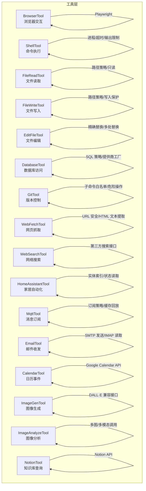
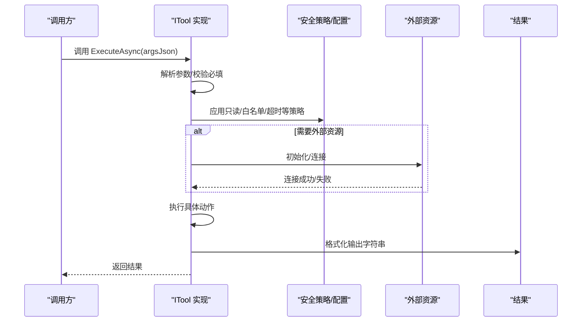
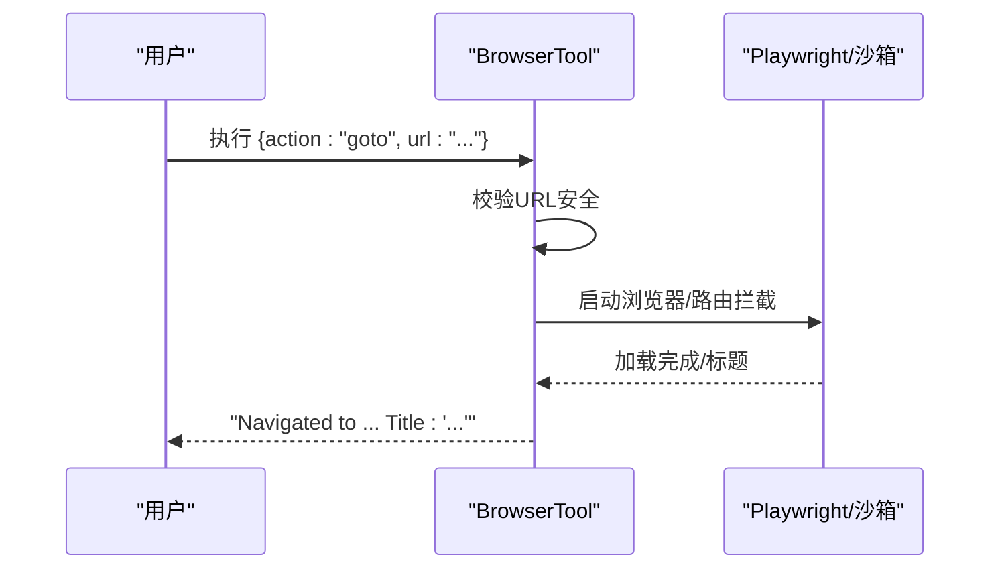
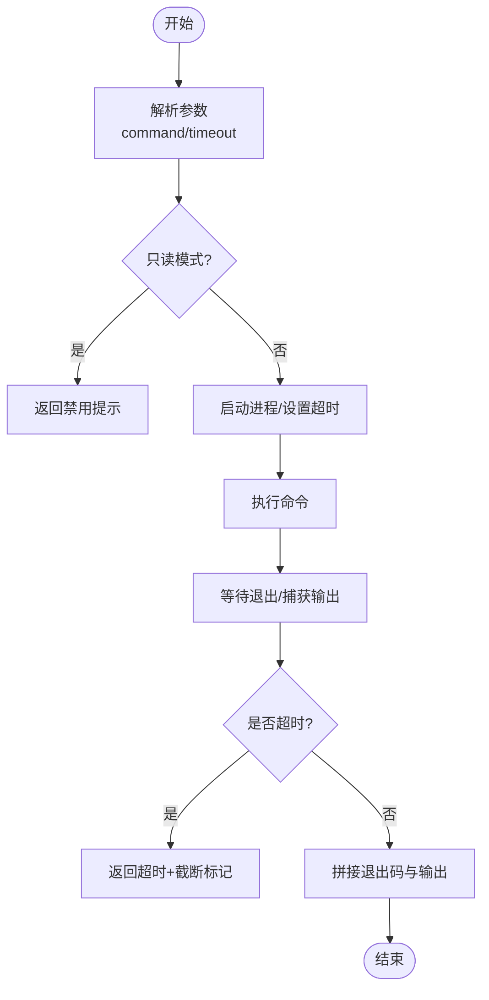
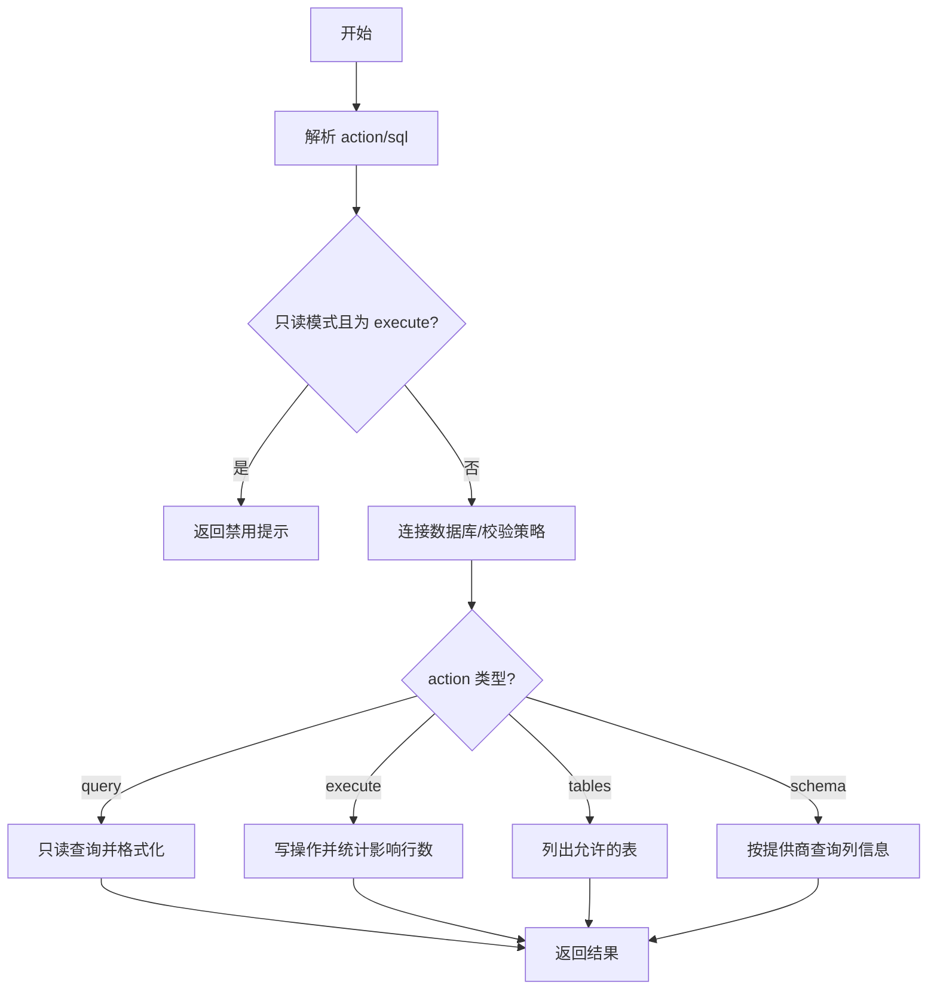
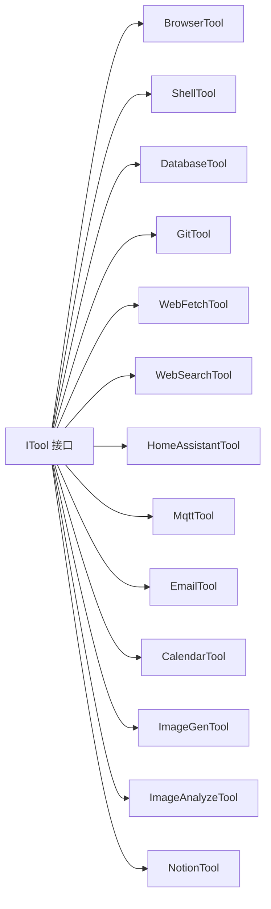

# 内置工具集

<cite>
**本文档引用的文件**
- [BrowserTool.cs](file://src/OpenClaw.Agent/Tools/BrowserTool.cs)
- [ShellTool.cs](file://src/OpenClaw.Agent/Tools/ShellTool.cs)
- [FileReadTool.cs](file://src/OpenClaw.Agent/Tools/FileReadTool.cs)
- [FileWriteTool.cs](file://src/OpenClaw.Agent/Tools/FileWriteTool.cs)
- [EditFileTool.cs](file://src/OpenClaw.Agent/Tools/EditFileTool.cs)
- [DatabaseTool.cs](file://src/OpenClaw.Agent/Tools/DatabaseTool.cs)
- [GitTool.cs](file://src/OpenClaw.Agent/Tools/GitTool.cs)
- [WebFetchTool.cs](file://src/OpenClaw.Agent/Tools/WebFetchTool.cs)
- [WebSearchTool.cs](file://src/OpenClaw.Agent/Tools/WebSearchTool.cs)
- [HomeAssistantTool.cs](file://src/OpenClaw.Agent/Tools/HomeAssistantTool.cs)
- [MqttTool.cs](file://src/OpenClaw.Agent/Tools/MqttTool.cs)
- [EmailTool.cs](file://src/OpenClaw.Agent/Tools/EmailTool.cs)
- [CalendarTool.cs](file://src/OpenClaw.Agent/Tools/CalendarTool.cs)
- [ImageGenTool.cs](file://src/OpenClaw.Agent/Tools/ImageGenTool.cs)
- [ImageAnalyzeTool.cs](file://src/OpenClaw.Agent/Tools/ImageAnalyzeTool.cs)
- [NotionTool.cs](file://src/OpenClaw.Agent/Tools/NotionTool.cs)
</cite>

## 目录
1. [简介](#简介)
2. [项目结构](#项目结构)
3. [核心组件](#核心组件)
4. [架构总览](#架构总览)
5. [详细组件分析](#详细组件分析)
6. [依赖关系分析](#依赖关系分析)
7. [性能考量](#性能考量)
8. [故障排查指南](#故障排查指南)
9. [结论](#结论)
10. [附录](#附录)

## 简介
本文件系统性梳理 Kingcrab 项目内置工具集，覆盖浏览器工具、Shell 工具、文件工具、数据库工具、Git 工具、Web 工具、Home Assistant 工具、MQTT 工具、邮件工具、日历工具、图像工具（生成、分析）、Notion 工具等。对每个工具提供参数定义、返回值约定、错误处理策略与使用示例路径，帮助开发者与使用者快速上手并安全地集成到工作流中。

## 项目结构
内置工具位于 Agent 层的 Tools 命名空间下，遵循统一的 ITool 接口规范，支持本地执行与沙箱执行两种模式，并通过参数 Schema 描述工具能力与约束。各工具均实现：
- 名称与描述
- 参数 Schema（JSON 模式）
- 执行逻辑（ExecuteAsync）
- 沙箱请求构建与结果格式化（可选）

图表来源
- [BrowserTool.cs:17-300](file://src/OpenClaw.Agent/Tools/BrowserTool.cs#L17-L300)
- [ShellTool.cs:11-193](file://src/OpenClaw.Agent/Tools/ShellTool.cs#L11-L193)
- [FileReadTool.cs:9-66](file://src/OpenClaw.Agent/Tools/FileReadTool.cs#L9-L66)
- [FileWriteTool.cs:9-58](file://src/OpenClaw.Agent/Tools/FileWriteTool.cs#L9-L58)
- [EditFileTool.cs:9-108](file://src/OpenClaw.Agent/Tools/EditFileTool.cs#L9-L108)
- [DatabaseTool.cs:18-340](file://src/OpenClaw.Agent/Tools/DatabaseTool.cs#L18-L340)
- [GitTool.cs:16-234](file://src/OpenClaw.Agent/Tools/GitTool.cs#L16-L234)
- [WebFetchTool.cs:18-212](file://src/OpenClaw.Agent/Tools/WebFetchTool.cs#L18-L212)
- [WebSearchTool.cs:14-207](file://src/OpenClaw.Agent/Tools/WebSearchTool.cs#L14-L207)
- [HomeAssistantTool.cs:9-283](file://src/OpenClaw.Agent/Tools/HomeAssistantTool.cs#L9-L283)
- [MqttTool.cs:11-152](file://src/OpenClaw.Agent/Tools/MqttTool.cs#L11-L152)
- [EmailTool.cs:16-402](file://src/OpenClaw.Agent/Tools/EmailTool.cs#L16-L402)
- [CalendarTool.cs:14-406](file://src/OpenClaw.Agent/Tools/CalendarTool.cs#L14-L406)
- [ImageGenTool.cs:15-146](file://src/OpenClaw.Agent/Tools/ImageGenTool.cs#L15-L146)
- [ImageAnalyzeTool.cs:16-180](file://src/OpenClaw.Agent/Tools/ImageAnalyzeTool.cs#L16-L180)
- [NotionTool.cs:8-169](file://src/OpenClaw.Agent/Tools/NotionTool.cs#L8-L169)

章节来源
- [BrowserTool.cs:17-300](file://src/OpenClaw.Agent/Tools/BrowserTool.cs#L17-L300)
- [ShellTool.cs:11-193](file://src/OpenClaw.Agent/Tools/ShellTool.cs#L11-L193)
- [FileReadTool.cs:9-66](file://src/OpenClaw.Agent/Tools/FileReadTool.cs#L9-L66)
- [FileWriteTool.cs:9-58](file://src/OpenClaw.Agent/Tools/FileWriteTool.cs#L9-L58)
- [EditFileTool.cs:9-108](file://src/OpenClaw.Agent/Tools/EditFileTool.cs#L9-L108)
- [DatabaseTool.cs:18-340](file://src/OpenClaw.Agent/Tools/DatabaseTool.cs#L18-L340)
- [GitTool.cs:16-234](file://src/OpenClaw.Agent/Tools/GitTool.cs#L16-L234)
- [WebFetchTool.cs:18-212](file://src/OpenClaw.Agent/Tools/WebFetchTool.cs#L18-L212)
- [WebSearchTool.cs:14-207](file://src/OpenClaw.Agent/Tools/WebSearchTool.cs#L14-L207)
- [HomeAssistantTool.cs:9-283](file://src/OpenClaw.Agent/Tools/HomeAssistantTool.cs#L9-L283)
- [MqttTool.cs:11-152](file://src/OpenClaw.Agent/Tools/MqttTool.cs#L11-L152)
- [EmailTool.cs:16-402](file://src/OpenClaw.Agent/Tools/EmailTool.cs#L16-L402)
- [CalendarTool.cs:14-406](file://src/OpenClaw.Agent/Tools/CalendarTool.cs#L14-L406)
- [ImageGenTool.cs:15-146](file://src/OpenClaw.Agent/Tools/ImageGenTool.cs#L15-L146)
- [ImageAnalyzeTool.cs:16-180](file://src/OpenClaw.Agent/Tools/ImageAnalyzeTool.cs#L16-L180)
- [NotionTool.cs:8-169](file://src/OpenClaw.Agent/Tools/NotionTool.cs#L8-L169)

## 核心组件
- 统一接口：所有工具实现 ITool，具备 Name、Description、ParameterSchema、ExecuteAsync 等契约。
- 沙箱能力：部分工具实现 ISandboxCapableTool，支持 CreateSandboxRequest 与 FormatSandboxResult，便于在受限环境中运行。
- 安全策略：广泛采用输入校验、路径策略、URL 安全验证、超时与输出限制、只读模式开关等机制。
- 可观测性：记录执行指标（如浏览器取消重置次数）与审计日志，便于问题定位与合规追踪。

章节来源
- [BrowserTool.cs:17-300](file://src/OpenClaw.Agent/Tools/BrowserTool.cs#L17-L300)
- [ShellTool.cs:11-193](file://src/OpenClaw.Agent/Tools/ShellTool.cs#L11-L193)

## 架构总览
工具执行链路通常包含：参数解析 → 安全校验 → 资源初始化 → 业务执行 → 结果格式化 → 返回字符串。部分工具还支持沙箱模式，将执行过程封装为外部进程或容器任务。

图表来源
- [BrowserTool.cs:340-448](file://src/OpenClaw.Agent/Tools/BrowserTool.cs#L340-L448)
- [ShellTool.cs:24-85](file://src/OpenClaw.Agent/Tools/ShellTool.cs#L24-L85)
- [DatabaseTool.cs:70-101](file://src/OpenClaw.Agent/Tools/DatabaseTool.cs#L70-L101)

## 详细组件分析

### 浏览器工具（BrowserTool）
- 功能特性
  - 支持导航、点击、填写、文本提取、脚本求值、截图等。
  - 本地执行需 Playwright 安装；否则提示不可用。
  - 支持沙箱模式，通过 Node Runner 执行，内置 URL 安全策略与私网拦截。
- 关键参数
  - action: goto/click/fill/get_text/evaluate/screenshot
  - url/selector/value/script 等按 action 选择性使用
- 返回值
  - 成功：描述性文本或 Base64 截图
  - 失败：错误信息字符串
- 错误处理
  - URL 安全校验失败直接拒绝
  - 超时/取消：返回取消提示
  - 未知 action：返回错误
- 使用示例
  - 导航到页面并获取标题：参见 [BrowserTool.cs:374-384](file://src/OpenClaw.Agent/Tools/BrowserTool.cs#L374-L384)
  - 填充表单并截图：参见 [BrowserTool.cs:394-430](file://src/OpenClaw.Agent/Tools/BrowserTool.cs#L394-L430)

图表来源
- [BrowserTool.cs:340-448](file://src/OpenClaw.Agent/Tools/BrowserTool.cs#L340-L448)
- [BrowserTool.cs:491-526](file://src/OpenClaw.Agent/Tools/BrowserTool.cs#L491-L526)

章节来源
- [BrowserTool.cs:17-300](file://src/OpenClaw.Agent/Tools/BrowserTool.cs#L17-L300)
- [BrowserTool.cs:340-448](file://src/OpenClaw.Agent/Tools/BrowserTool.cs#L340-L448)
- [BrowserTool.cs:491-526](file://src/OpenClaw.Agent/Tools/BrowserTool.cs#L491-L526)

### Shell 工具（ShellTool）
- 功能特性
  - 在本地执行 shell 命令，支持 Windows 与类 Unix。
  - 输出大小限制与超时控制，避免资源滥用。
  - 只读模式下禁用执行。
- 关键参数
  - command: 必填
  - timeout_seconds: 默认 30，范围 1~600
- 返回值
  - 包含退出码与标准输出/错误的字符串
  - 超时：标记超时并截断
- 错误处理
  - 只读模式：直接返回禁用提示
  - 配置禁用：返回禁用提示
  - 超时：返回超时标记
- 使用示例
  - 查看当前目录：参见 [ShellTool.cs:24-85](file://src/OpenClaw.Agent/Tools/ShellTool.cs#L24-L85)

图表来源
- [ShellTool.cs:24-85](file://src/OpenClaw.Agent/Tools/ShellTool.cs#L24-L85)
- [ShellTool.cs:115-157](file://src/OpenClaw.Agent/Tools/ShellTool.cs#L115-L157)

章节来源
- [ShellTool.cs:11-193](file://src/OpenClaw.Agent/Tools/ShellTool.cs#L11-L193)

### 文件工具（FileReadTool/FileWriteTool/EditFileTool）
- 文件读取（FileReadTool）
  - 参数：path（必填），max_lines（默认 200，上限 5000）
  - 安全：路径解析与只读策略检查
  - 行数截断：超过限制追加“更多行”提示
- 文件写入（FileWriteTool）
  - 参数：path、content（必填）
  - 安全：路径解析与写入策略检查
  - 原子写：临时文件 + 原子移动
- 文件编辑（EditFileTool）
  - 参数：path、old_text、new_text、replace_all（默认 false）
  - 安全：路径解析与写入策略检查
  - 语义：未找到旧文本则报错；非唯一且未开启 replace_all 则报错
  - 原子写：临时文件 + 原子移动

章节来源
- [FileReadTool.cs:9-66](file://src/OpenClaw.Agent/Tools/FileReadTool.cs#L9-L66)
- [FileWriteTool.cs:9-58](file://src/OpenClaw.Agent/Tools/FileWriteTool.cs#L9-L58)
- [EditFileTool.cs:9-108](file://src/OpenClaw.Agent/Tools/EditFileTool.cs#L9-L108)

### 数据库工具（DatabaseTool）
- 功能特性
  - 支持 SQLite、PostgreSQL、MySQL（通过 DbProviderFactory 注册）
  - 动作：query（只读）、execute（写操作需允许）、tables、schema
  - 安全：SQL 关键字白名单识别写操作；多语句开关；表级白名单/黑名单
- 关键参数
  - action: query/execute/tables/schema
  - sql/table 等按 action 使用
- 返回值
  - query：表格化结果（列头、分隔线、行数据，最多 MaxRows）
  - execute：影响行数
  - tables/schema：列表或结构化列信息
- 错误处理
  - 只读模式下禁止 execute
  - 配置缺失：返回连接串未配置
  - SQL 策略：多语句禁用、表权限拒绝、写操作禁用
- 使用示例
  - 查询并格式化表格：参见 [DatabaseTool.cs:103-124](file://src/OpenClaw.Agent/Tools/DatabaseTool.cs#L103-L124)
  - 执行写操作：参见 [DatabaseTool.cs:126-146](file://src/OpenClaw.Agent/Tools/DatabaseTool.cs#L126-L146)

图表来源
- [DatabaseTool.cs:70-101](file://src/OpenClaw.Agent/Tools/DatabaseTool.cs#L70-L101)
- [DatabaseTool.cs:103-146](file://src/OpenClaw.Agent/Tools/DatabaseTool.cs#L103-L146)

章节来源
- [DatabaseTool.cs:18-340](file://src/OpenClaw.Agent/Tools/DatabaseTool.cs#L18-L340)

### Git 工具（GitTool）
- 功能特性
  - 支持 status/diff/log/add/commit/branch/checkout/stash/show 等常用子命令
  - 破坏性操作（push/pull/reset 等）需显式允许
  - 参数注入防护：严格令牌化与元字符检查
- 关键参数
  - subcommand: 子命令枚举
  - args: 额外参数（需安全传递）
  - cwd: 工作目录（可选）
- 返回值
  - 标准输出；stderr 以 [stderr] 前缀拼接
  - 空输出时返回完成信息
- 错误处理
  - 不支持的子命令：返回错误
  - 破坏性操作未允许：返回禁用提示
  - reset --hard 特别限制：即使允许也禁用
- 使用示例
  - 查看最近提交摘要：参见 [GitTool.cs:91-104](file://src/OpenClaw.Agent/Tools/GitTool.cs#L91-L104)

章节来源
- [GitTool.cs:16-234](file://src/OpenClaw.Agent/Tools/GitTool.cs#L16-L234)

### Web 工具（WebFetchTool/WebSearchTool）
- 网页抓取（WebFetchTool）
  - 抓取指定 URL，剥离 HTML 标签，提取可读文本
  - 支持最大长度与自动长度限制
  - URL 安全策略与最大重定向次数控制
- 网络搜索（WebSearchTool）
  - 支持 Tavily、Brave、SearXNG 三种后端
  - 统一返回标题、链接、摘要
- 关键参数
  - WebFetch: url（必填），max_length（可选）
  - WebSearch: query（必填），max_results（默认 5，上限 20）
- 返回值
  - WebFetch: URL、内容类型、长度、正文（可能截断）
  - WebSearch: 结构化结果列表
- 错误处理
  - URL 非法/重定向异常/超时/HTTP 错误
  - 提供商不支持：返回错误
- 使用示例
  - 抓取文档并提取文本：参见 [WebFetchTool.cs:48-159](file://src/OpenClaw.Agent/Tools/WebFetchTool.cs#L48-L159)
  - 搜索并格式化结果：参见 [WebSearchTool.cs:39-67](file://src/OpenClaw.Agent/Tools/WebSearchTool.cs#L39-L67)

章节来源
- [WebFetchTool.cs:18-212](file://src/OpenClaw.Agent/Tools/WebFetchTool.cs#L18-L212)
- [WebSearchTool.cs:14-207](file://src/OpenClaw.Agent/Tools/WebSearchTool.cs#L14-L207)

### Home Assistant 工具（HomeAssistantTool）
- 功能特性
  - 读取实体状态、列举服务、解析目标（区域/名称）
  - 支持文本/JSON 两种输出格式
  - 实体索引缓存加速查询
- 关键参数
  - op: list_entities/get_state/list_services/resolve_targets/describe_entity
  - entity_id/domain/area/name_contains/limit/format
- 返回值
  - 文本/JSON 格式化输出
- 错误处理
  - 未知 op：返回错误
  - JSON 解析失败：回退原始响应
- 使用示例
  - 列举实体并格式化输出：参见 [HomeAssistantTool.cs:70-101](file://src/OpenClaw.Agent/Tools/HomeAssistantTool.cs#L70-L101)

章节来源
- [HomeAssistantTool.cs:9-283](file://src/OpenClaw.Agent/Tools/HomeAssistantTool.cs#L9-L283)

### MQTT 工具（MqttTool）
- 功能特性
  - 订阅一次性消息（支持超时与 QoS）
  - 事件桥接缓存回放（get_last）
  - 订阅策略：通配符与白名单/黑名单匹配
- 关键参数
  - op: subscribe_once/get_last
  - topic（必填），timeout_ms（默认 5000），qos（默认 0）
- 返回值
  - subscribe_once：返回主题与负载
  - get_last：返回最近缓存消息（支持通配符）
- 错误处理
  - 策略不允许：返回错误
  - 缓存无命中：提示启用事件桥接
- 使用示例
  - 订阅一次性消息：参见 [MqttTool.cs:80-135](file://src/OpenClaw.Agent/Tools/MqttTool.cs#L80-L135)

章节来源
- [MqttTool.cs:11-152](file://src/OpenClaw.Agent/Tools/MqttTool.cs#L11-L152)

### 邮件工具（EmailTool）
- 功能特性
  - SMTP 发送：from/to/subject/body
  - IMAP 读取：列出、读取、搜索（IMAP SEARCH 语法）
  - 输入净化：防止命令注入与 CRLF 注入
- 关键参数
  - action: send/list/read/search
  - send: to/subject/body
  - list/read/search: folder/count/query/message_id
- 返回值
  - 发送：成功信息
  - IMAP：列表/正文/搜索结果
- 错误处理
  - 凭证/主机未配置：返回错误
  - 登录失败：返回错误
  - IMAP 异常：返回错误
- 使用示例
  - 发送邮件：参见 [EmailTool.cs:92-129](file://src/OpenClaw.Agent/Tools/EmailTool.cs#L92-L129)
  - 搜索邮件：参见 [EmailTool.cs:185-239](file://src/OpenClaw.Agent/Tools/EmailTool.cs#L185-L239)

章节来源
- [EmailTool.cs:16-402](file://src/OpenClaw.Agent/Tools/EmailTool.cs#L16-L402)

### 日历工具（CalendarTool）
- 功能特性
  - Google Calendar API 集成
  - 支持列出、搜索、创建、更新、删除事件
  - JWT 自签名换取访问令牌
- 关键参数
  - action: list/search/create/update/delete
  - list/search: query/days_ahead
  - create/update: title/start/end/description/location/event_id
  - delete: event_id
- 返回值
  - 列表/搜索：格式化事件清单
  - 创建/更新/删除：成功信息或错误
- 错误处理
  - 凭证未配置：返回错误
  - 认证失败：返回错误
  - HTTP 错误：返回错误
- 使用示例
  - 创建事件：参见 [CalendarTool.cs:157-189](file://src/OpenClaw.Agent/Tools/CalendarTool.cs#L157-L189)

章节来源
- [CalendarTool.cs:14-406](file://src/OpenClaw.Agent/Tools/CalendarTool.cs#L14-L406)

### 图像工具（ImageGenTool/ImageAnalyzeTool）
- 图像生成（ImageGenTool）
  - OpenAI DALL·E 兼容接口
  - 参数：prompt/size/quality
  - 返回：图片 URL 或修订提示
- 图像分析（ImageAnalyzeTool）
  - 多图/多模态：支持 URL 与本地路径（Base64）
  - 参数：image_urls/image_paths/prompt
  - 返回：模型回答（截断）
- 错误处理
  - API Key 未配置：返回错误
  - 超时/异常：返回错误
- 使用示例
  - 生成图片并返回 URL：参见 [ImageGenTool.cs:66-118](file://src/OpenClaw.Agent/Tools/ImageGenTool.cs#L66-L118)
  - 分析多张图片并返回描述：参见 [ImageAnalyzeTool.cs:52-107](file://src/OpenClaw.Agent/Tools/ImageAnalyzeTool.cs#L52-L107)

章节来源
- [ImageGenTool.cs:15-146](file://src/OpenClaw.Agent/Tools/ImageGenTool.cs#L15-L146)
- [ImageAnalyzeTool.cs:16-180](file://src/OpenClaw.Agent/Tools/ImageAnalyzeTool.cs#L16-L180)

### Notion 工具（NotionTool）
- 功能特性
  - 读取页面、检索笔记、搜索页面
  - 默认数据库/页面约束与最大结果限制
- 关键参数
  - op: read_page/get_note/list_notes/search
  - page_id/database_id/query/limit
- 返回值
  - 页面内容、笔记列表、搜索结果
- 错误处理
  - 参数缺失：抛出参数错误
  - 配置错误/网络异常：返回错误
- 使用示例
  - 读取页面并格式化输出：参见 [NotionTool.cs:73-81](file://src/OpenClaw.Agent/Tools/NotionTool.cs#L73-L81)

章节来源
- [NotionTool.cs:8-169](file://src/OpenClaw.Agent/Tools/NotionTool.cs#L8-L169)

## 依赖关系分析
- 组件内聚与耦合
  - 工具间低耦合，通过统一接口与参数 Schema 解耦
  - 外部依赖集中在各自工具内部（Playwright、HttpClient、OpenAI SDK、MQTT 客户端等）
- 安全与策略
  - 路径策略、URL 安全、输入净化、只读模式、超时与输出限制贯穿多个工具
- 可扩展性
  - 通过配置项（Provider、Endpoint、ApiKey 等）与策略（AllowWrite、AllowPush、Policy 等）实现灵活扩展

图表来源
- [BrowserTool.cs:17-300](file://src/OpenClaw.Agent/Tools/BrowserTool.cs#L17-L300)
- [ShellTool.cs:11-193](file://src/OpenClaw.Agent/Tools/ShellTool.cs#L11-L193)
- [DatabaseTool.cs:18-340](file://src/OpenClaw.Agent/Tools/DatabaseTool.cs#L18-L340)
- [GitTool.cs:16-234](file://src/OpenClaw.Agent/Tools/GitTool.cs#L16-L234)
- [WebFetchTool.cs:18-212](file://src/OpenClaw.Agent/Tools/WebFetchTool.cs#L18-L212)
- [WebSearchTool.cs:14-207](file://src/OpenClaw.Agent/Tools/WebSearchTool.cs#L14-L207)
- [HomeAssistantTool.cs:9-283](file://src/OpenClaw.Agent/Tools/HomeAssistantTool.cs#L9-L283)
- [MqttTool.cs:11-152](file://src/OpenClaw.Agent/Tools/MqttTool.cs#L11-L152)
- [EmailTool.cs:16-402](file://src/OpenClaw.Agent/Tools/EmailTool.cs#L16-L402)
- [CalendarTool.cs:14-406](file://src/OpenClaw.Agent/Tools/CalendarTool.cs#L14-L406)
- [ImageGenTool.cs:15-146](file://src/OpenClaw.Agent/Tools/ImageGenTool.cs#L15-L146)
- [ImageAnalyzeTool.cs:16-180](file://src/OpenClaw.Agent/Tools/ImageAnalyzeTool.cs#L16-L180)
- [NotionTool.cs:8-169](file://src/OpenClaw.Agent/Tools/NotionTool.cs#L8-L169)

章节来源
- [BrowserTool.cs:17-300](file://src/OpenClaw.Agent/Tools/BrowserTool.cs#L17-L300)
- [ShellTool.cs:11-193](file://src/OpenClaw.Agent/Tools/ShellTool.cs#L11-L193)
- [DatabaseTool.cs:18-340](file://src/OpenClaw.Agent/Tools/DatabaseTool.cs#L18-L340)
- [GitTool.cs:16-234](file://src/OpenClaw.Agent/Tools/GitTool.cs#L16-L234)
- [WebFetchTool.cs:18-212](file://src/OpenClaw.Agent/Tools/WebFetchTool.cs#L18-L212)
- [WebSearchTool.cs:14-207](file://src/OpenClaw.Agent/Tools/WebSearchTool.cs#L14-L207)
- [HomeAssistantTool.cs:9-283](file://src/OpenClaw.Agent/Tools/HomeAssistantTool.cs#L9-L283)
- [MqttTool.cs:11-152](file://src/OpenClaw.Agent/Tools/MqttTool.cs#L11-L152)
- [EmailTool.cs:16-402](file://src/OpenClaw.Agent/Tools/EmailTool.cs#L16-L402)
- [CalendarTool.cs:14-406](file://src/OpenClaw.Agent/Tools/CalendarTool.cs#L14-L406)
- [ImageGenTool.cs:15-146](file://src/OpenClaw.Agent/Tools/ImageGenTool.cs#L15-L146)
- [ImageAnalyzeTool.cs:16-180](file://src/OpenClaw.Agent/Tools/ImageAnalyzeTool.cs#L16-L180)
- [NotionTool.cs:8-169](file://src/OpenClaw.Agent/Tools/NotionTool.cs#L8-L169)

## 性能考量
- I/O 限制
  - Shell 输出大小限制、Git 输出大小限制、Web 抓取大小限制，避免内存与带宽压力。
- 超时控制
  - 各工具均设置合理超时，防止长时间阻塞。
- 并发与锁
  - 浏览器工具内部使用信号量保证并发安全与资源复用。
- 网络与 API
  - 搜索与外部 API 调用采用最小必要字段与分页/限制，降低延迟与成本。

## 故障排查指南
- 常见错误类型
  - 配置缺失：如数据库连接串、API Key、SMTP/IMAP 主机等
  - 权限不足：只读模式、路径策略、URL 安全、订阅策略
  - 输入非法：参数缺失、URL 非法、命令注入风险
  - 超时与中断：网络波动、外部服务慢响应
- 定位建议
  - 查看返回字符串中的错误提示与退出码
  - 检查工具参数 Schema 是否满足要求
  - 开启更详细的日志与审计记录（如浏览器取消重置计数）
  - 对外部依赖进行连通性测试（curl/openssl/浏览器）

章节来源
- [DatabaseTool.cs:70-101](file://src/OpenClaw.Agent/Tools/DatabaseTool.cs#L70-L101)
- [EmailTool.cs:92-129](file://src/OpenClaw.Agent/Tools/EmailTool.cs#L92-L129)
- [WebFetchTool.cs:48-159](file://src/OpenClaw.Agent/Tools/WebFetchTool.cs#L48-L159)
- [BrowserTool.cs:340-448](file://src/OpenClaw.Agent/Tools/BrowserTool.cs#L340-L448)

## 结论
内置工具集在功能覆盖、安全性与可扩展性之间取得良好平衡。通过统一接口、参数 Schema、安全策略与可观测性设计，开发者可以快速集成并安全地使用各类工具。建议在生产环境启用只读模式、严格的 URL/路径策略与订阅策略，并结合监控与审计日志进行持续优化。

## 附录
- 参数 Schema 与使用示例路径
  - 浏览器工具：参见 [BrowserTool.cs:284-300](file://src/OpenClaw.Agent/Tools/BrowserTool.cs#L284-L300)
  - Shell 工具：参见 [ShellTool.cs:19-21](file://src/OpenClaw.Agent/Tools/ShellTool.cs#L19-L21)
  - 文件读取：参见 [FileReadTool.cs:17-18](file://src/OpenClaw.Agent/Tools/FileReadTool.cs#L17-L18)
  - 文件写入：参见 [FileWriteTool.cs:17-18](file://src/OpenClaw.Agent/Tools/FileWriteTool.cs#L17-L18)
  - 文件编辑：参见 [EditFileTool.cs:17-18](file://src/OpenClaw.Agent/Tools/EditFileTool.cs#L17-L18)
  - 数据库工具：参见 [DatabaseTool.cs:41-61](file://src/OpenClaw.Agent/Tools/DatabaseTool.cs#L41-L61)
  - Git 工具：参见 [GitTool.cs:26-47](file://src/OpenClaw.Agent/Tools/GitTool.cs#L26-L47)
  - 网页抓取：参见 [WebFetchTool.cs:37-46](file://src/OpenClaw.Agent/Tools/WebFetchTool.cs#L37-L46)
  - 网络搜索：参见 [WebSearchTool.cs:28-37](file://src/OpenClaw.Agent/Tools/WebSearchTool.cs#L28-L37)
  - Home Assistant：参见 [HomeAssistantTool.cs:27-45](file://src/OpenClaw.Agent/Tools/HomeAssistantTool.cs#L27-L45)
  - MQTT：参见 [MqttTool.cs:22-33](file://src/OpenClaw.Agent/Tools/MqttTool.cs#L22-L33)
  - 邮件：参见 [EmailTool.cs:30-72](file://src/OpenClaw.Agent/Tools/EmailTool.cs#L30-L72)
  - 日历：参见 [CalendarTool.cs:30-75](file://src/OpenClaw.Agent/Tools/CalendarTool.cs#L30-L75)
  - 图像生成：参见 [ImageGenTool.cs:29-50](file://src/OpenClaw.Agent/Tools/ImageGenTool.cs#L29-L50)
  - 图像分析：参见 [ImageAnalyzeTool.cs:29-50](file://src/OpenClaw.Agent/Tools/ImageAnalyzeTool.cs#L29-L50)
  - Notion：参见 [NotionTool.cs:22-37](file://src/OpenClaw.Agent/Tools/NotionTool.cs#L22-L37)