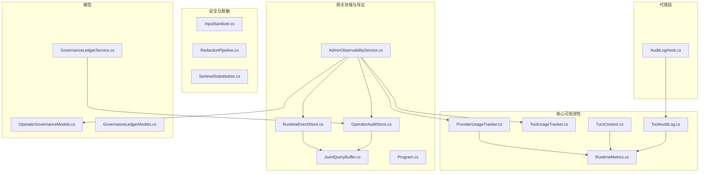
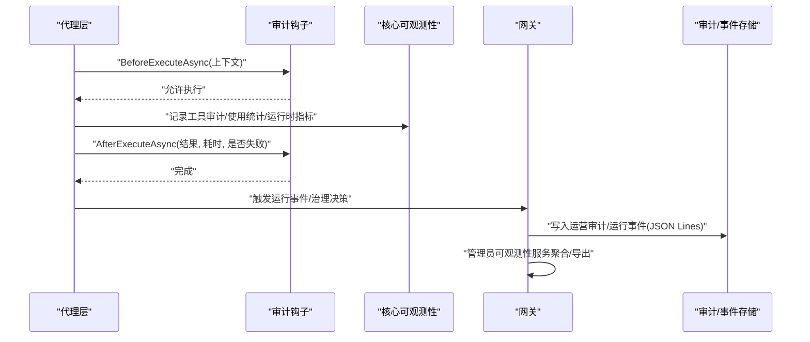
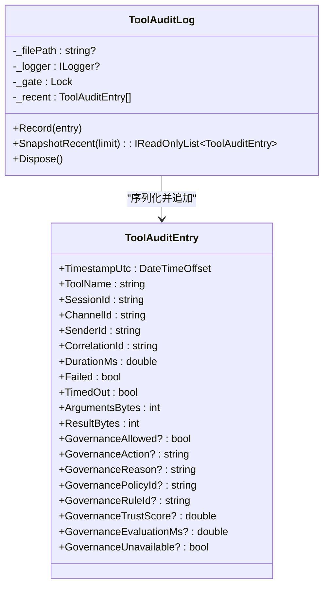
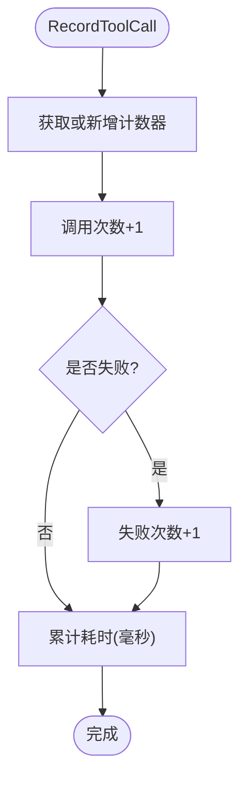
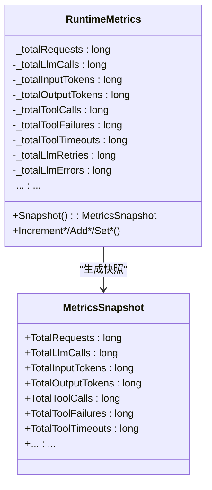
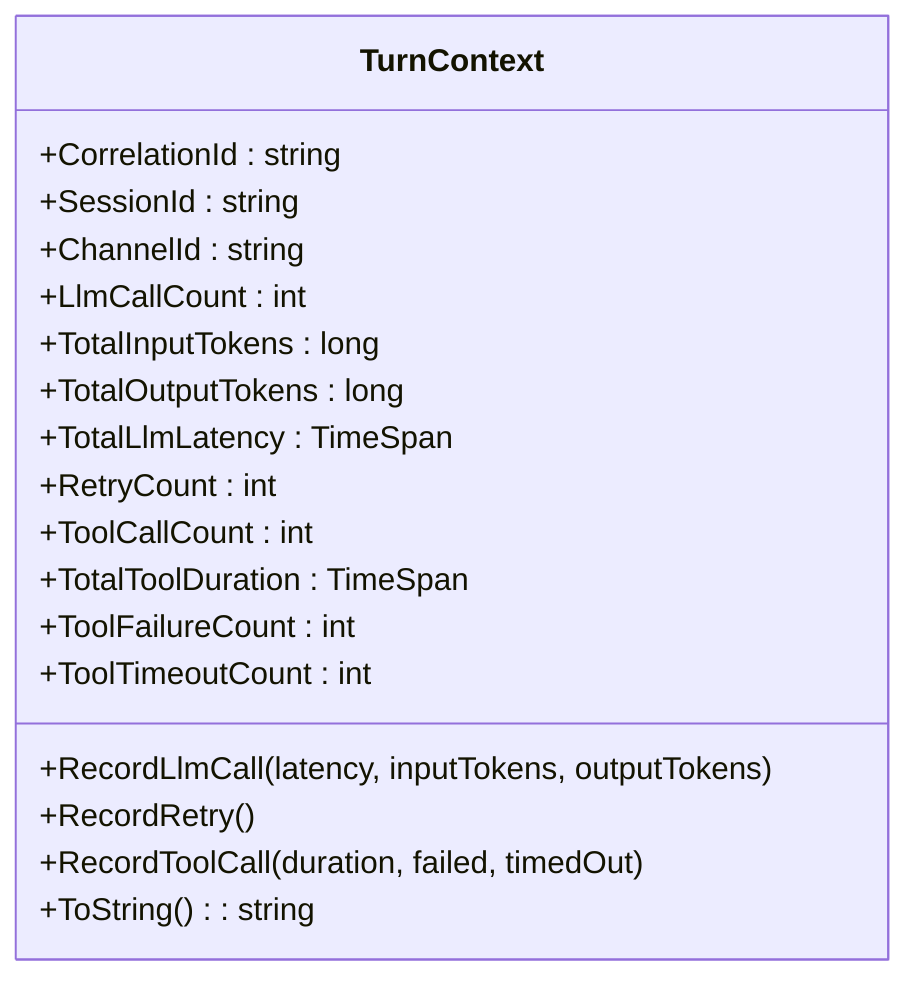
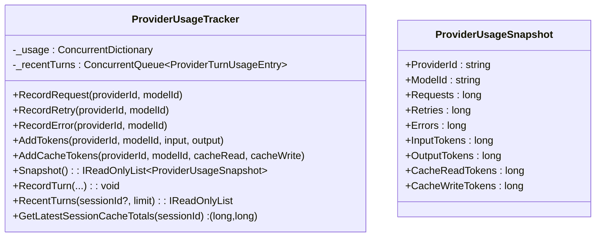
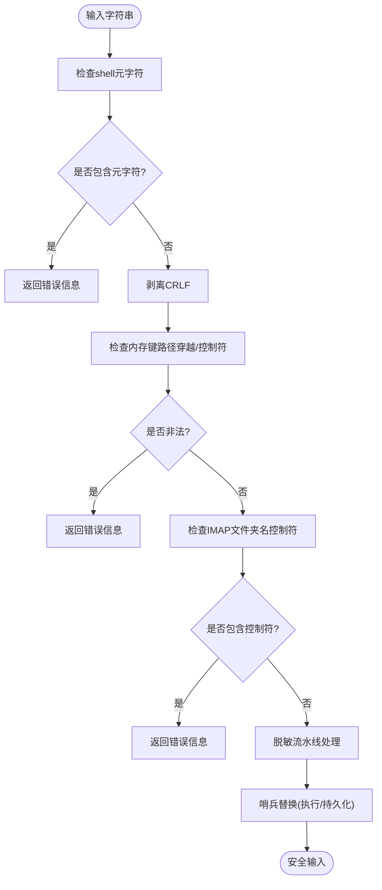
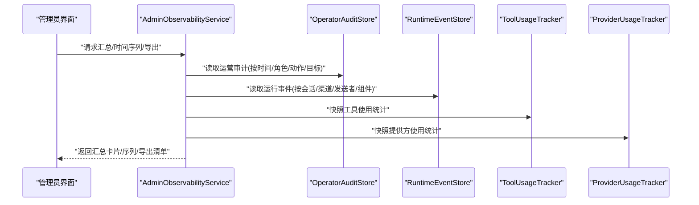
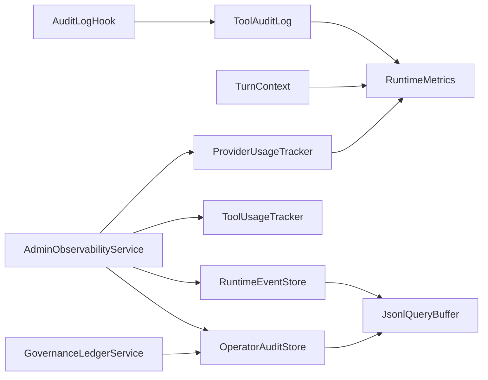

# 审计日志

<cite>
**本文引用的文件**
- [ToolAuditLog.cs](file://src/OpenClaw.Core/Observability/ToolAuditLog.cs)
- [ToolUsageTracker.cs](file://src/OpenClaw.Core/Observability/ToolUsageTracker.cs)
- [RuntimeMetrics.cs](file://src/OpenClaw.Core/Observability/RuntimeMetrics.cs)
- [TurnContext.cs](file://src/OpenClaw.Core/Observability/TurnContext.cs)
- [ProviderUsageTracker.cs](file://src/OpenClaw.Core/Observability/ProviderUsageTracker.cs)
- [InputSanitizer.cs](file://src/OpenClaw.Core/Security/InputSanitizer.cs)
- [RedactionPipeline.cs](file://src/OpenClaw.Core/Security/RedactionPipeline.cs)
- [SentinelSubstitution.cs](file://src/OpenClaw.Core/Security/SentinelSubstitution.cs)
- [AuditLogHook.cs](file://src/OpenClaw.Agent/AuditLogHook.cs)
- [OperatorAuditStore.cs](file://src/OpenClaw.Gateway/OperatorAuditStore.cs)
- [RuntimeEventStore.cs](file://src/OpenClaw.Gateway/RuntimeEventStore.cs)
- [JsonlQueryBuffer.cs](file://src/OpenClaw.Gateway/JsonlQueryBuffer.cs)
- [AdminObservabilityService.cs](file://src/OpenClaw.Gateway/AdminObservabilityService.cs)
- [Program.cs](file://src/OpenClaw.Gateway/Program.cs)
- [OperatorGovernanceModels.cs](file://src/OpenClaw.Core/Models/OperatorGovernanceModels.cs)
- [GovernanceLedgerService.cs](file://src/OpenClaw.Gateway/GovernanceLedgerService.cs)
- [GovernanceLedgerModels.cs](file://src/OpenClaw.Core/Models/GovernanceLedgerModels.cs)
</cite>

## 目录
1. [简介](#简介)
2. [项目结构](#项目结构)
3. [核心组件](#核心组件)
4. [架构总览](#架构总览)
5. [详细组件分析](#详细组件分析)
6. [依赖关系分析](#依赖关系分析)
7. [性能考量](#性能考量)
8. [故障排查指南](#故障排查指南)
9. [结论](#结论)
10. [附录](#附录)

## 简介
本文件系统化梳理了 Kingcrab 项目的审计日志与可观测性体系，覆盖工具使用审计、操作日志记录、性能监控、敏感信息脱敏与替换、日志聚合与导出、指标采集与可视化等能力。重点包括：
- 工具执行审计：结构化 JSON Lines 记录、最近缓存快照、线程安全写入
- 运行时指标：轻量级原子计数器与仪表盘展示
- 对话上下文：关联 ID、会话/渠道标识、并发工具调用度量
- 提供方使用统计：按提供方/模型维度的请求、错误、令牌用量与缓存统计
- 敏感数据处理：输入校验、脱敏流水线、哨兵替换
- 日志聚合与导出：运营审计、运行事件、审批历史、治理账本等多源聚合
- 合规与报告：导出清单、保留策略、合规性摘要卡片

## 项目结构
围绕审计与可观测性的代码主要分布在以下模块：
- 核心可观测性（OpenClaw.Core/Observability）：审计条目、使用统计、运行时指标、对话上下文、提供方使用统计
- 安全与脱敏（OpenClaw.Core/Security）：输入清洗、敏感数据脱敏流水线、哨兵替换服务
- 代理层钩子（OpenClaw.Agent）：工具执行审计钩子
- 网关存储与导出（OpenClaw.Gateway）：运营审计存储、运行事件存储、JSON Lines 查询缓冲、管理员可观测性服务、导出清单
- 模型定义（OpenClaw.Core/Models）：治理账本与可观测性摘要模型

**图表来源**
- [ToolAuditLog.cs:1-125](file://src/OpenClaw.Core/Observability/ToolAuditLog.cs#L1-L125)
- [ToolUsageTracker.cs:1-59](file://src/OpenClaw.Core/Observability/ToolUsageTracker.cs#L1-L59)
- [RuntimeMetrics.cs:1-312](file://src/OpenClaw.Core/Observability/RuntimeMetrics.cs#L1-L312)
- [TurnContext.cs:1-76](file://src/OpenClaw.Core/Observability/TurnContext.cs#L1-L76)
- [ProviderUsageTracker.cs:1-176](file://src/OpenClaw.Core/Observability/ProviderUsageTracker.cs#L1-L176)
- [InputSanitizer.cs:1-84](file://src/OpenClaw.Core/Security/InputSanitizer.cs#L1-L84)
- [RedactionPipeline.cs:1-131](file://src/OpenClaw.Core/Security/RedactionPipeline.cs#L1-L131)
- [SentinelSubstitution.cs:1-38](file://src/OpenClaw.Core/Security/SentinelSubstitution.cs#L1-L38)
- [AuditLogHook.cs:1-63](file://src/OpenClaw.Agent/AuditLogHook.cs#L1-L63)
- [OperatorAuditStore.cs:1-178](file://src/OpenClaw.Gateway/OperatorAuditStore.cs#L1-L178)
- [RuntimeEventStore.cs:1-70](file://src/OpenClaw.Gateway/RuntimeEventStore.cs#L1-L70)
- [JsonlQueryBuffer.cs:1-50](file://src/OpenClaw.Gateway/JsonlQueryBuffer.cs#L1-L50)
- [AdminObservabilityService.cs:107-182](file://src/OpenClaw.Gateway/AdminObservabilityService.cs#L107-L182)
- [Program.cs:66-91](file://src/OpenClaw.Gateway/Program.cs#L66-L91)
- [OperatorGovernanceModels.cs:330-359](file://src/OpenClaw.Core/Models/OperatorGovernanceModels.cs#L330-L359)
- [GovernanceLedgerService.cs:109-143](file://src/OpenClaw.Gateway/GovernanceLedgerService.cs#L109-L143)
- [GovernanceLedgerModels.cs:95-145](file://src/OpenClaw.Core/Models/GovernanceLedgerModels.cs#L95-L145)

**章节来源**
- [Program.cs:66-91](file://src/OpenClaw.Gateway/Program.cs#L66-L91)

## 核心组件
- 工具审计记录（ToolAuditEntry）：记录工具名称、会话/渠道/发送者标识、关联 ID、耗时、是否失败/超时、治理决策与评分、参数/结果字节数等
- 工具审计日志（ToolAuditLog）：线程安全追加写入 JSON Lines 文件，带最近条目环形缓冲快照
- 工具使用统计（ToolUsageTracker）：按工具名聚合调用次数、失败数、超时数与总耗时
- 运行时指标（RuntimeMetrics）：原子计数器集合，暴露为健康端点指标，涵盖请求、LLM 调用、令牌用量、工具调用、会话、进程、沙箱、内存召回、提示缓存、脉冲等
- 对话上下文（TurnContext）：单次用户回合的关联 ID、会话/渠道标识，以及 LLM/工具调用的并发度量
- 提供方使用统计（ProviderUsageTracker）：按提供方/模型维度统计请求、重试、错误、输入/输出令牌、缓存读写令牌，并支持回合级最近使用记录
- 输入清洗（InputSanitizer）：检测与清理 shell 元字符、CRLF 注入风险、路径穿越与控制字符
- 脱敏流水线（RedactionPipeline）：对会话内容、工具调用参数/结果进行多步脱敏
- 哨兵替换（SentinelSubstitution）：在执行与持久化之间进行参数替换，避免敏感参数进入持久化存储
- 审计钩子（AuditLogHook）：工具执行前后的结构化日志记录
- 运营审计存储（OperatorAuditStore）：JSON Lines 追加写入，链式校验与序列号维护
- 运行事件存储（RuntimeEventStore）：JSON Lines 追加写入，支持查询过滤
- JSON Lines 查询缓冲（JsonlQueryBuffer）：从文件末尾读取最新 N 条记录，支持谓词过滤
- 管理员可观测性服务（AdminObservabilityService）：构建汇总卡片、时间序列、导出清单与保留策略

**章节来源**
- [ToolAuditLog.cs:10-32](file://src/OpenClaw.Core/Observability/ToolAuditLog.cs#L10-L32)
- [ToolAuditLog.cs:39-114](file://src/OpenClaw.Core/Observability/ToolAuditLog.cs#L39-L114)
- [ToolUsageTracker.cs:5-59](file://src/OpenClaw.Core/Observability/ToolUsageTracker.cs#L5-L59)
- [RuntimeMetrics.cs:10-312](file://src/OpenClaw.Core/Observability/RuntimeMetrics.cs#L10-L312)
- [TurnContext.cs:12-76](file://src/OpenClaw.Core/Observability/TurnContext.cs#L12-L76)
- [ProviderUsageTracker.cs:7-176](file://src/OpenClaw.Core/Observability/ProviderUsageTracker.cs#L7-L176)
- [InputSanitizer.cs:9-84](file://src/OpenClaw.Core/Security/InputSanitizer.cs#L9-L84)
- [RedactionPipeline.cs:21-131](file://src/OpenClaw.Core/Security/RedactionPipeline.cs#L21-L131)
- [SentinelSubstitution.cs:23-38](file://src/OpenClaw.Core/Security/SentinelSubstitution.cs#L23-L38)
- [AuditLogHook.cs:10-63](file://src/OpenClaw.Agent/AuditLogHook.cs#L10-L63)
- [OperatorAuditStore.cs:38-178](file://src/OpenClaw.Gateway/OperatorAuditStore.cs#L38-L178)
- [RuntimeEventStore.cs:37-70](file://src/OpenClaw.Gateway/RuntimeEventStore.cs#L37-L70)
- [JsonlQueryBuffer.cs:7-50](file://src/OpenClaw.Gateway/JsonlQueryBuffer.cs#L7-L50)
- [AdminObservabilityService.cs:107-182](file://src/OpenClaw.Gateway/AdminObservabilityService.cs#L107-L182)

## 架构总览
审计与可观测性贯穿“代理层钩子 → 核心可观测性 → 网关存储/导出”的主干流程；同时通过安全组件在输入阶段与持久化阶段进行敏感数据保护。

**图表来源**
- [AuditLogHook.cs:17-61](file://src/OpenClaw.Agent/AuditLogHook.cs#L17-L61)
- [ToolAuditLog.cs:72-95](file://src/OpenClaw.Core/Observability/ToolAuditLog.cs#L72-L95)
- [ToolUsageTracker.cs:9-26](file://src/OpenClaw.Core/Observability/ToolUsageTracker.cs#L9-L26)
- [RuntimeMetrics.cs:129-178](file://src/OpenClaw.Core/Observability/RuntimeMetrics.cs#L129-L178)
- [OperatorAuditStore.cs:82-93](file://src/OpenClaw.Gateway/OperatorAuditStore.cs#L82-L93)
- [RuntimeEventStore.cs:37-47](file://src/OpenClaw.Gateway/RuntimeEventStore.cs#L37-L47)
- [AdminObservabilityService.cs:117-182](file://src/OpenClaw.Gateway/AdminObservabilityService.cs#L117-L182)

## 详细组件分析

### 工具审计日志（ToolAuditLog）
- 数据模型：ToolAuditEntry 包含时间戳、工具名、会话/渠道/发送者、关联 ID、耗时、失败/超时标记、治理字段、参数/结果字节数等
- 写入策略：线程安全追加写入 JSON Lines 文件；初始化目录失败时降级禁用文件写入；最近条目环形缓冲用于快速快照
- 序列化：使用 Source Generation 上下文，禁用空值与缩进，保证紧凑与高性能

**图表来源**
- [ToolAuditLog.cs:10-32](file://src/OpenClaw.Core/Observability/ToolAuditLog.cs#L10-L32)
- [ToolAuditLog.cs:39-114](file://src/OpenClaw.Core/Observability/ToolAuditLog.cs#L39-L114)

**章节来源**
- [ToolAuditLog.cs:72-114](file://src/OpenClaw.Core/Observability/ToolAuditLog.cs#L72-L114)

### 工具使用统计（ToolUsageTracker）
- 统计维度：调用次数、失败次数、超时次数、总耗时（双精度以位模式存储）
- 并发安全：使用 Interlocked 实现无锁累加与读取快照
- 快照排序：按调用次数降序、工具名升序

**图表来源**
- [ToolUsageTracker.cs:9-26](file://src/OpenClaw.Core/Observability/ToolUsageTracker.cs#L9-L26)

**章节来源**
- [ToolUsageTracker.cs:28-41](file://src/OpenClaw.Core/Observability/ToolUsageTracker.cs#L28-L41)

### 运行时指标（RuntimeMetrics）
- 计数器类型：单调递增计数器（如请求、LLM 调用、工具调用、错误、会话、进程、沙箱、内存召回、提示缓存、脉冲等）
- 仪表盘指标：活动会话、熔断器状态、保留进程、最近运行时间与成功标志
- 快照结构：MetricsSnapshot 用于序列化导出

**图表来源**
- [RuntimeMetrics.cs:10-312](file://src/OpenClaw.Core/Observability/RuntimeMetrics.cs#L10-L312)

**章节来源**
- [RuntimeMetrics.cs:189-250](file://src/OpenClaw.Core/Observability/RuntimeMetrics.cs#L189-L250)

### 对话上下文（TurnContext）
- 关联 ID：优先取分布式追踪的 TraceId，否则生成短 GUID 片段
- 单回合度量：LLM 调用次数、输入/输出令牌、总延迟、重试次数；工具调用次数、总耗时、失败/超时次数
- 并发安全：工具调用使用 Interlocked，LLM 调用为顺序场景

**图表来源**
- [TurnContext.cs:12-76](file://src/OpenClaw.Core/Observability/TurnContext.cs#L12-L76)

**章节来源**
- [TurnContext.cs:49-65](file://src/OpenClaw.Core/Observability/TurnContext.cs#L49-L65)

### 提供方使用统计（ProviderUsageTracker）
- 维度：ProviderId/ModelId
- 统计项：请求、重试、错误、输入/输出令牌、缓存读/写令牌
- 回合记录：最近 256 条回合使用记录，支持按会话筛选与缓存统计查询

**图表来源**
- [ProviderUsageTracker.cs:7-176](file://src/OpenClaw.Core/Observability/ProviderUsageTracker.cs#L7-L176)

**章节来源**
- [ProviderUsageTracker.cs:40-121](file://src/OpenClaw.Core/Observability/ProviderUsageTracker.cs#L40-L121)

### 安全与敏感信息处理
- 输入清洗：检测 shell 元字符、CRLF 注入、路径穿越与控制字符，返回错误信息
- 脱敏流水线：对会话历史中的内容、工具调用参数/结果进行多步正则替换
- 哨兵替换：在执行与持久化之间进行参数替换，避免敏感参数进入持久化存储

**图表来源**
- [InputSanitizer.cs:24-82](file://src/OpenClaw.Core/Security/InputSanitizer.cs#L24-L82)
- [RedactionPipeline.cs:30-94](file://src/OpenClaw.Core/Security/RedactionPipeline.cs#L30-L94)
- [SentinelSubstitution.cs:23-38](file://src/OpenClaw.Core/Security/SentinelSubstitution.cs#L23-L38)

**章节来源**
- [InputSanitizer.cs:24-82](file://src/OpenClaw.Core/Security/InputSanitizer.cs#L24-L82)
- [RedactionPipeline.cs:30-94](file://src/OpenClaw.Core/Security/RedactionPipeline.cs#L30-L94)
- [SentinelSubstitution.cs:23-38](file://src/OpenClaw.Core/Security/SentinelSubstitution.cs#L23-L38)

### 审计钩子与日志聚合
- 审计钩子：在工具执行前后记录结构化日志，便于快速定位问题
- 运营审计存储：JSON Lines 追加写入，维护链式校验与序列号
- 运行事件存储：JSON Lines 追加写入，支持按会话/渠道/发送者/组件过滤查询
- JSON Lines 查询缓冲：从文件末尾读取最新 N 条记录，支持谓词过滤
- 管理员可观测性服务：构建汇总卡片、时间序列、导出清单与保留策略

**图表来源**
- [AdminObservabilityService.cs:117-182](file://src/OpenClaw.Gateway/AdminObservabilityService.cs#L117-L182)
- [OperatorAuditStore.cs:97-125](file://src/OpenClaw.Gateway/OperatorAuditStore.cs#L97-L125)
- [RuntimeEventStore.cs:51-70](file://src/OpenClaw.Gateway/RuntimeEventStore.cs#L51-L70)
- [ToolUsageTracker.cs:28-41](file://src/OpenClaw.Core/Observability/ToolUsageTracker.cs#L28-L41)
- [ProviderUsageTracker.cs:40-46](file://src/OpenClaw.Core/Observability/ProviderUsageTracker.cs#L40-L46)

**章节来源**
- [AuditLogHook.cs:17-61](file://src/OpenClaw.Agent/AuditLogHook.cs#L17-L61)
- [OperatorAuditStore.cs:82-125](file://src/OpenClaw.Gateway/OperatorAuditStore.cs#L82-L125)
- [RuntimeEventStore.cs:37-70](file://src/OpenClaw.Gateway/RuntimeEventStore.cs#L37-L70)
- [JsonlQueryBuffer.cs:9-49](file://src/OpenClaw.Gateway/JsonlQueryBuffer.cs#L9-L49)
- [AdminObservabilityService.cs:252-283](file://src/OpenClaw.Gateway/AdminObservabilityService.cs#L252-L283)

## 依赖关系分析
- 组件耦合
  - 审计钩子依赖日志接口，向 ToolAuditLog 提供上下文
  - ToolAuditLog 与 RuntimeMetrics 在工具执行路径中协同
  - TurnContext 为并发工具调用提供统一度量入口
  - ProviderUsageTracker 与 RuntimeMetrics 共享运行时指标来源
  - OperatorAuditStore/运行事件存储依赖 JSON Lines 缓冲与序列化上下文
  - AdminObservabilityService 聚合多源数据并生成导出清单
- 外部集成
  - 网关启动时注册可观测性扩展与服务
  - 治理账本服务与运营审计存储协作，支撑合规审计

**图表来源**
- [Program.cs:66-91](file://src/OpenClaw.Gateway/Program.cs#L66-L91)
- [AdminObservabilityService.cs:117-182](file://src/OpenClaw.Gateway/AdminObservabilityService.cs#L117-L182)
- [GovernanceLedgerService.cs:109-143](file://src/OpenClaw.Gateway/GovernanceLedgerService.cs#L109-L143)

**章节来源**
- [Program.cs:66-91](file://src/OpenClaw.Gateway/Program.cs#L66-L91)

## 性能考量
- 无锁与原子操作：RuntimeMetrics、ToolUsageTracker、TurnContext 使用 Interlocked/Volatile，降低锁竞争
- Source Generation：ToolAuditLog 的 JSON 序列化上下文减少反射开销
- 追加写入：JSON Lines 适合高吞吐日志写入，避免随机 IO
- 最近缓冲：ToolAuditLog 的环形缓冲减少频繁磁盘访问，提升快照效率
- 查询优化：JsonlQueryBuffer 从文件末尾读取，限制匹配队列大小，避免大文件全量扫描

[本节为通用性能讨论，不直接分析具体文件]

## 故障排查指南
- 审计文件写入失败
  - 现象：记录工具审计时出现警告
  - 排查：检查文件路径权限、磁盘空间、目录创建异常
  - 参考
    - [ToolAuditLog.cs:86-94](file://src/OpenClaw.Core/Observability/ToolAuditLog.cs#L86-L94)
    - [OperatorAuditStore.cs:88-93](file://src/OpenClaw.Gateway/OperatorAuditStore.cs#L88-L93)
    - [RuntimeEventStore.cs:42-47](file://src/OpenClaw.Gateway/RuntimeEventStore.cs#L42-L47)
- JSON Lines 解析异常
  - 现象：查询运营审计/运行事件时报解析失败
  - 排查：确认文件存在、行格式正确、序列化上下文一致
  - 参考
    - [JsonlQueryBuffer.cs:30-45](file://src/OpenClaw.Gateway/JsonlQueryBuffer.cs#L30-L45)
    - [OperatorAuditStore.cs:100-125](file://src/OpenClaw.Gateway/OperatorAuditStore.cs#L100-L125)
    - [RuntimeEventStore.cs:51-70](file://src/OpenClaw.Gateway/RuntimeEventStore.cs#L51-L70)
- 导出清单缺失或保留窗口告警
  - 现象：导出包缺少某些文件或包含保留窗口警告
  - 排查：核对导出策略、保留天数、文件生成范围
  - 参考
    - [AdminObservabilityService.cs:252-283](file://src/OpenClaw.Gateway/AdminObservabilityService.cs#L252-L283)
- 治理账本撤销与事件记录
  - 现象：撤销治理条目后未见运行事件
  - 排查：确认撤销调用与事件追加逻辑
  - 参考
    - [GovernanceLedgerService.cs:117-138](file://src/OpenClaw.Gateway/GovernanceLedgerService.cs#L117-L138)

**章节来源**
- [ToolAuditLog.cs:86-94](file://src/OpenClaw.Core/Observability/ToolAuditLog.cs#L86-L94)
- [OperatorAuditStore.cs:88-125](file://src/OpenClaw.Gateway/OperatorAuditStore.cs#L88-L125)
- [RuntimeEventStore.cs:42-70](file://src/OpenClaw.Gateway/RuntimeEventStore.cs#L42-L70)
- [JsonlQueryBuffer.cs:30-45](file://src/OpenClaw.Gateway/JsonlQueryBuffer.cs#L30-L45)
- [AdminObservabilityService.cs:252-283](file://src/OpenClaw.Gateway/AdminObservabilityService.cs#L252-L283)
- [GovernanceLedgerService.cs:117-138](file://src/OpenClaw.Gateway/GovernanceLedgerService.cs#L117-L138)

## 结论
本审计日志体系通过“工具执行审计 + 运行时指标 + 对话上下文 + 提供方统计 + 安全脱敏 + 日志聚合导出”形成闭环，既满足合规审计与运营监控需求，又兼顾性能与可维护性。建议在生产环境中：
- 明确审计文件路径与权限，启用 JSON Lines 追加写入
- 配置合适的保留策略与导出周期
- 使用脱敏与哨兵替换保护敏感信息
- 利用管理员可观测性服务生成合规报告与趋势分析

[本节为总结性内容，不直接分析具体文件]

## 附录

### 审计日志格式与字段说明
- 工具审计条目（ToolAuditEntry）
  - 时间戳、工具名、会话/渠道/发送者、关联 ID、耗时（毫秒）、失败/超时标记
  - 治理字段：允许/动作/原因/策略/规则/信任分/评估耗时/不可用
  - 参数/结果字节数（默认不记录原始负载，避免泄露敏感信息）

**章节来源**
- [ToolAuditLog.cs:10-32](file://src/OpenClaw.Core/Observability/ToolAuditLog.cs#L10-L32)

### 日志级别与记录位置
- 信息级别：工具调用开始、完成（含耗时与结果长度）
- 警告级别：工具执行失败（含耗时与结果长度）
- 记录位置：代理层审计钩子与工具审计日志

**章节来源**
- [AuditLogHook.cs:22-58](file://src/OpenClaw.Agent/AuditLogHook.cs#L22-L58)
- [ToolAuditLog.cs:72-95](file://src/OpenClaw.Core/Observability/ToolAuditLog.cs#L72-L95)

### 敏感信息脱敏与替换
- 输入清洗：shell 元字符、CRLF、路径穿越、控制字符
- 脱敏流水线：Authorization Bearer、OpenAI 秘钥、API Key 字段
- 哨兵替换：执行与持久化参数替换，避免敏感参数入库

**章节来源**
- [InputSanitizer.cs:24-82](file://src/OpenClaw.Core/Security/InputSanitizer.cs#L24-L82)
- [RedactionPipeline.cs:104-131](file://src/OpenClaw.Core/Security/RedactionPipeline.cs#L104-L131)
- [SentinelSubstitution.cs:23-38](file://src/OpenClaw.Core/Security/SentinelSubstitution.cs#L23-L38)

### 日志配置与查询方法
- 配置
  - 网关启动时注册可观测性扩展与服务
  - 审计/事件存储路径由配置决定
- 查询
  - 运营审计：按角色、动作、目标、时间范围过滤
  - 运行事件：按会话/渠道/发送者/组件过滤
  - 最新 N 条：通过 JSON Lines 查询缓冲

**章节来源**
- [Program.cs:66-91](file://src/OpenClaw.Gateway/Program.cs#L66-L91)
- [OperatorAuditStore.cs:97-125](file://src/OpenClaw.Gateway/OperatorAuditStore.cs#L97-L125)
- [RuntimeEventStore.cs:51-70](file://src/OpenClaw.Gateway/RuntimeEventStore.cs#L51-L70)
- [JsonlQueryBuffer.cs:9-49](file://src/OpenClaw.Gateway/JsonlQueryBuffer.cs#L9-L49)

### 性能分析与合规报告
- 性能分析
  - 使用运行时指标与工具使用统计，结合会话/渠道维度分析瓶颈
- 合规报告
  - 通过管理员可观测性服务生成汇总卡片、时间序列与导出清单，支持保留策略与合规审计

**章节来源**
- [RuntimeMetrics.cs:189-250](file://src/OpenClaw.Core/Observability/RuntimeMetrics.cs#L189-L250)
- [ToolUsageTracker.cs:28-41](file://src/OpenClaw.Core/Observability/ToolUsageTracker.cs#L28-L41)
- [AdminObservabilityService.cs:117-182](file://src/OpenClaw.Gateway/AdminObservabilityService.cs#L117-L182)
- [OperatorGovernanceModels.cs:344-359](file://src/OpenClaw.Core/Models/OperatorGovernanceModels.cs#L344-L359)