# 工具系统

<cite>
**本文引用的文件**
- [BrowserTool.cs](file://src/OpenClaw.Agent/Tools/BrowserTool.cs)
- [ShellTool.cs](file://src/OpenClaw.Agent/Tools/ShellTool.cs)
- [FileReadTool.cs](file://src/OpenClaw.Agent/Tools/FileReadTool.cs)
- [FileWriteTool.cs](file://src/OpenClaw.Agent/Tools/FileWriteTool.cs)
- [DatabaseTool.cs](file://src/OpenClaw.Agent/Tools/DatabaseTool.cs)
- [ExternalCliTool.cs](file://src/OpenClaw.Agent/Tools/ExternalCliTool.cs)
- [ToolExecutionRouter.cs](file://src/OpenClaw.Agent/Execution/ToolExecutionRouter.cs)
- [LocalExecutionBackend.cs](file://src/OpenClaw.Agent/Execution/LocalExecutionBackend.cs)
- [DockerExecutionBackend.cs](file://src/OpenClaw.Agent/Execution/DockerExecutionBackend.cs)
- [SshExecutionBackend.cs](file://src/OpenClaw.Agent/Execution/SshExecutionBackend.cs)
- [OpenSandboxExecutionBackend.cs](file://src/OpenClaw.Agent/Execution/OpenSandboxExecutionBackend.cs)
- [IToolSandbox.cs](file://src/OpenClaw.Core/Abstractions/IToolSandbox.cs)
- [UrlSafetyValidator.cs](file://src/OpenClaw.Core/Security/UrlSafetyValidator.cs)
- [InputSanitizer.cs](file://src/OpenClaw.Core/Security/InputSanitizer.cs)
- [ToolAuditLog.cs](file://src/OpenClaw.Core/Observability/ToolAuditLog.cs)
- [AuditLogHook.cs](file://src/OpenClaw.Agent/AuditLogHook.cs)
</cite>

## 目录
1. [简介](#简介)
2. [项目结构](#项目结构)
3. [核心组件](#核心组件)
4. [架构总览](#架构总览)
5. [详细组件分析](#详细组件分析)
6. [依赖关系分析](#依赖关系分析)
7. [性能考量](#性能考量)
8. [故障排查指南](#故障排查指南)
9. [结论](#结论)
10. [附录](#附录)

## 简介
本文件系统性梳理工具系统的实现与使用，覆盖内置工具集（浏览器工具、Shell 工具、文件工具、数据库工具、外部 CLI 工具等）、工具执行后端（本地执行、Docker 执行、SSH 执行、OpenSandbox 执行）、工具沙箱机制、权限控制系统、工具审计日志，并给出工具接口规范、参数校验、错误处理、安全策略、自定义工具开发指南、工具注册流程、性能优化建议与安全最佳实践。

## 项目结构
工具系统主要由以下层次构成：
- 工具层：内置工具实现（浏览器、Shell、文件、数据库、外部 CLI 等）
- 执行路由层：根据配置与沙箱策略选择执行后端
- 执行后端层：本地进程、Docker 容器、SSH 远程、OpenSandbox 沙箱
- 安全与合规层：URL 安全策略、输入净化、路径策略、治理与审计
- 观测与审计层：工具执行审计日志与钩子

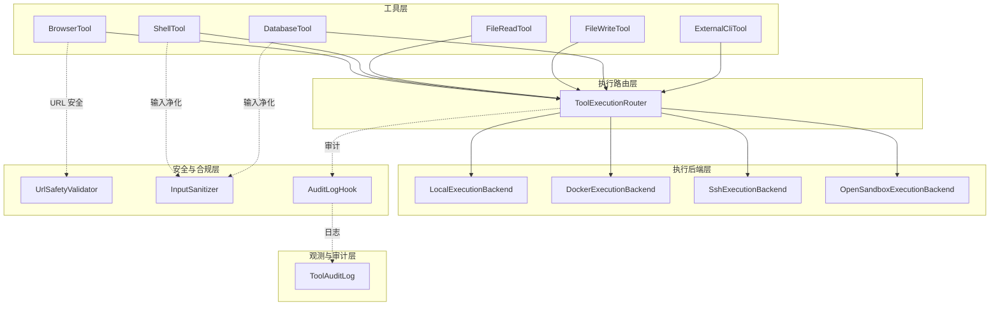

**图表来源**
- [ToolExecutionRouter.cs:1-253](file://src/OpenClaw.Agent/Execution/ToolExecutionRouter.cs#L1-L253)
- [LocalExecutionBackend.cs:1-99](file://src/OpenClaw.Agent/Execution/LocalExecutionBackend.cs#L1-L99)
- [DockerExecutionBackend.cs:1-66](file://src/OpenClaw.Agent/Execution/DockerExecutionBackend.cs#L1-L66)
- [SshExecutionBackend.cs:1-63](file://src/OpenClaw.Agent/Execution/SshExecutionBackend.cs#L1-L63)
- [OpenSandboxExecutionBackend.cs:1-69](file://src/OpenClaw.Agent/Execution/OpenSandboxExecutionBackend.cs#L1-L69)
- [BrowserTool.cs:1-696](file://src/OpenClaw.Agent/Tools/BrowserTool.cs#L1-L696)
- [ShellTool.cs:1-193](file://src/OpenClaw.Agent/Tools/ShellTool.cs#L1-L193)
- [FileReadTool.cs:1-66](file://src/OpenClaw.Agent/Tools/FileReadTool.cs#L1-L66)
- [FileWriteTool.cs:1-58](file://src/OpenClaw.Agent/Tools/FileWriteTool.cs#L1-L58)
- [DatabaseTool.cs:1-944](file://src/OpenClaw.Agent/Tools/DatabaseTool.cs#L1-L944)
- [ExternalCliTool.cs:1-252](file://src/OpenClaw.Agent/Tools/ExternalCliTool.cs#L1-L252)
- [UrlSafetyValidator.cs:1-219](file://src/OpenClaw.Core/Security/UrlSafetyValidator.cs#L1-L219)
- [InputSanitizer.cs:1-84](file://src/OpenClaw.Core/Security/InputSanitizer.cs#L1-L84)
- [AuditLogHook.cs:1-63](file://src/OpenClaw.Agent/AuditLogHook.cs#L1-L63)
- [ToolAuditLog.cs:1-125](file://src/OpenClaw.Core/Observability/ToolAuditLog.cs#L1-L125)

**章节来源**
- [ToolExecutionRouter.cs:1-253](file://src/OpenClaw.Agent/Execution/ToolExecutionRouter.cs#L1-L253)
- [LocalExecutionBackend.cs:1-99](file://src/OpenClaw.Agent/Execution/LocalExecutionBackend.cs#L1-L99)
- [DockerExecutionBackend.cs:1-66](file://src/OpenClaw.Agent/Execution/DockerExecutionBackend.cs#L1-L66)
- [SshExecutionBackend.cs:1-63](file://src/OpenClaw.Agent/Execution/SshExecutionBackend.cs#L1-L63)
- [OpenSandboxExecutionBackend.cs:1-69](file://src/OpenClaw.Agent/Execution/OpenSandboxExecutionBackend.cs#L1-L69)

## 核心组件
- 内置工具集
  - 浏览器工具：支持导航、点击、填写、取文本、脚本求值、截图；具备 URL 安全策略与沙箱执行能力
  - Shell 工具：本地命令执行，带超时与输出截断保护
  - 文件读写工具：受路径策略控制，读取限制行数，写入原子化落盘
  - 数据库工具：SQLite/PostgreSQL/MySQL 通用访问，SQL 多语句与表级访问策略
  - 外部 CLI 工具：基于连接器的受控外部命令执行，预览与审批流程
- 执行后端
  - 本地：支持进程、PTY、交互式输入
  - Docker：容器内一次性执行
  - SSH：远程主机执行
  - OpenSandbox：统一沙箱执行入口
- 沙箱与安全
  - IToolSandbox 接口抽象
  - URL 安全策略（私网地址、CIDR、主机通配）
  - 输入净化（Shell 元字符、CRLF、键名与 IMAP 名称）
- 审计与可观测性
  - 工具审计日志（JSON Lines），记录关键指标与治理结果
  - 审计钩子在执行前后记录信息

**章节来源**
- [BrowserTool.cs:1-696](file://src/OpenClaw.Agent/Tools/BrowserTool.cs#L1-L696)
- [ShellTool.cs:1-193](file://src/OpenClaw.Agent/Tools/ShellTool.cs#L1-L193)
- [FileReadTool.cs:1-66](file://src/OpenClaw.Agent/Tools/FileReadTool.cs#L1-L66)
- [FileWriteTool.cs:1-58](file://src/OpenClaw.Agent/Tools/FileWriteTool.cs#L1-L58)
- [DatabaseTool.cs:1-944](file://src/OpenClaw.Agent/Tools/DatabaseTool.cs#L1-L944)
- [ExternalCliTool.cs:1-252](file://src/OpenClaw.Agent/Tools/ExternalCliTool.cs#L1-L252)
- [IToolSandbox.cs:1-12](file://src/OpenClaw.Core/Abstractions/IToolSandbox.cs#L1-L12)
- [UrlSafetyValidator.cs:1-219](file://src/OpenClaw.Core/Security/UrlSafetyValidator.cs#L1-L219)
- [InputSanitizer.cs:1-84](file://src/OpenClaw.Core/Security/InputSanitizer.cs#L1-L84)
- [ToolAuditLog.cs:1-125](file://src/OpenClaw.Core/Observability/ToolAuditLog.cs#L1-L125)
- [AuditLogHook.cs:1-63](file://src/OpenClaw.Agent/AuditLogHook.cs#L1-L63)

## 架构总览
工具执行从“路由解析”开始，依据工具类型、配置与沙箱策略决定后端；若为沙箱工具且策略允许，则优先走 OpenSandbox 后端；否则按配置回退到本地或其他后端。执行期间进行安全校验与审计记录。

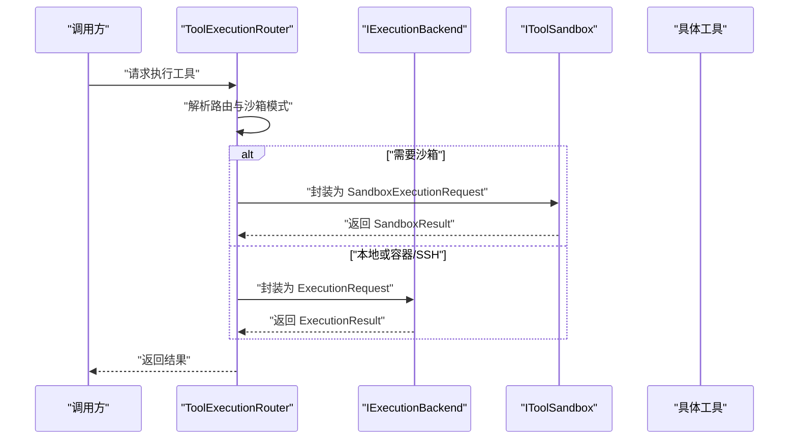

**图表来源**
- [ToolExecutionRouter.cs:65-112](file://src/OpenClaw.Agent/Execution/ToolExecutionRouter.cs#L65-L112)
- [OpenSandboxExecutionBackend.cs:22-67](file://src/OpenClaw.Agent/Execution/OpenSandboxExecutionBackend.cs#L22-L67)
- [LocalExecutionBackend.cs:27-28](file://src/OpenClaw.Agent/Execution/LocalExecutionBackend.cs#L27-L28)
- [DockerExecutionBackend.cs:19-20](file://src/OpenClaw.Agent/Execution/DockerExecutionBackend.cs#L19-L20)
- [SshExecutionBackend.cs:19-20](file://src/OpenClaw.Agent/Execution/SshExecutionBackend.cs#L19-L20)

## 详细组件分析

### 浏览器工具（BrowserTool）
- 能力
  - 支持导航、点击、填写、取文本、脚本求值、截图
  - 本地执行需 Playwright 可用；否则提示不可用
  - 支持沙箱模式，通过 Node 脚本在隔离环境中运行
- URL 安全
  - 基于 UrlSafetyValidator 的策略校验，拦截私网/回环/CIDR 黑名单
  - 支持 DNS 解析失败兜底拒绝
- 参数与错误
  - 参数 Schema 明确 action 与必要字段
  - 对未知 action 返回明确错误
- 沙箱参数构建
  - 仅透传必要字段，对 evaluate 行为进行配置开关校验
  - 将 URL 安全策略序列化为 payload

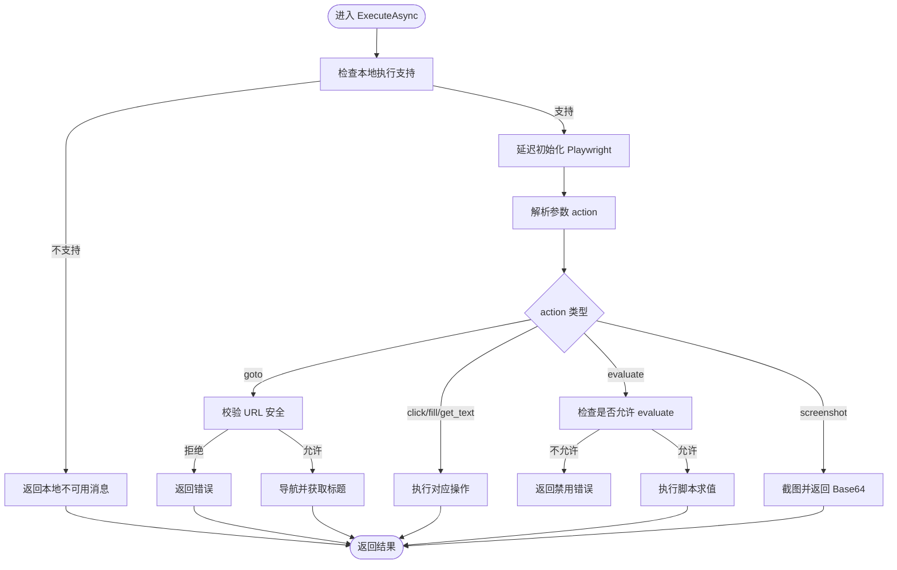

**图表来源**
- [BrowserTool.cs:340-448](file://src/OpenClaw.Agent/Tools/BrowserTool.cs#L340-L448)
- [BrowserTool.cs:539-548](file://src/OpenClaw.Agent/Tools/BrowserTool.cs#L539-L548)
- [UrlSafetyValidator.cs:27-58](file://src/OpenClaw.Core/Security/UrlSafetyValidator.cs#L27-L58)

**章节来源**
- [BrowserTool.cs:17-696](file://src/OpenClaw.Agent/Tools/BrowserTool.cs#L17-L696)
- [UrlSafetyValidator.cs:1-219](file://src/OpenClaw.Core/Security/UrlSafetyValidator.cs#L1-L219)

### Shell 工具（ShellTool）
- 能力
  - 在本地以 shell 执行命令，支持 Windows 与类 Unix
  - 超时控制与输出上限（64KB）截断
- 沙箱
  - 使用外部超时包装（如 timeout）在沙箱中执行
- 参数与错误
  - 必须提供 command；timeout_seconds 有范围限制
  - 只读模式与禁用开关会直接拒绝

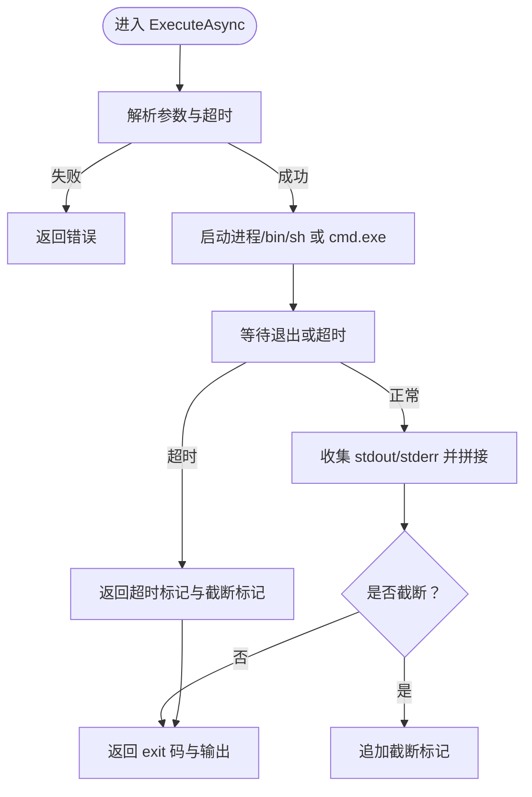

**图表来源**
- [ShellTool.cs:24-85](file://src/OpenClaw.Agent/Tools/ShellTool.cs#L24-L85)
- [ShellTool.cs:115-157](file://src/OpenClaw.Agent/Tools/ShellTool.cs#L115-L157)

**章节来源**
- [ShellTool.cs:1-193](file://src/OpenClaw.Agent/Tools/ShellTool.cs#L1-L193)

### 文件读写工具（FileReadTool、FileWriteTool）
- 读取
  - 限制最大行数，异步流式读取，避免上下文溢出
  - 路径解析与读取白名单策略
- 写入
  - 只读模式禁止
  - 路径解析与写入白名单策略
  - 原子写（临时文件 + 移动）

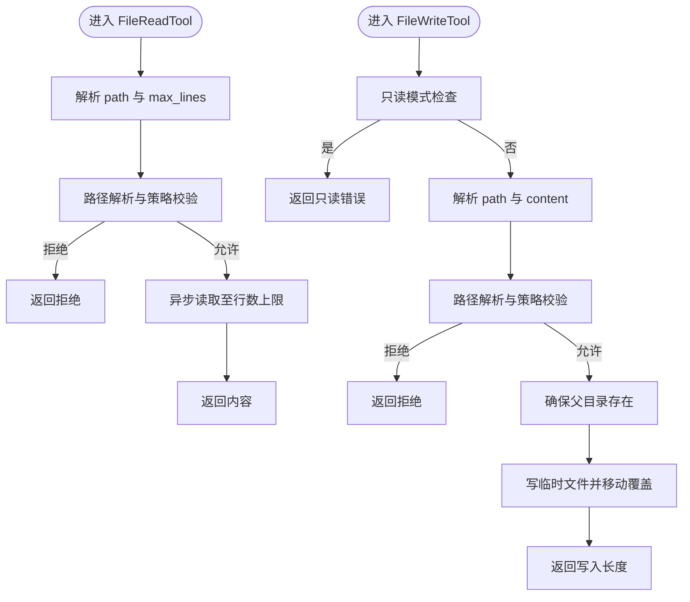

**图表来源**
- [FileReadTool.cs:19-64](file://src/OpenClaw.Agent/Tools/FileReadTool.cs#L19-L64)
- [FileWriteTool.cs:19-56](file://src/OpenClaw.Agent/Tools/FileWriteTool.cs#L19-L56)

**章节来源**
- [FileReadTool.cs:1-66](file://src/OpenClaw.Agent/Tools/FileReadTool.cs#L1-L66)
- [FileWriteTool.cs:1-58](file://src/OpenClaw.Agent/Tools/FileWriteTool.cs#L1-L58)

### 数据库工具（DatabaseTool）
- 能力
  - 支持 SQLite/PostgreSQL/MySQL（通过 DbProviderFactory）
  - 动作：query、execute、tables、schema
  - 读写分离：query 严格只读；execute 需开启 AllowWrite
- 安全与策略
  - SQL 多语句开关
  - 表白/黑名单与标识符规范化
  - 关键词检测写操作
- 输出格式化
  - 结果集表格化展示，限制行数并截断长列

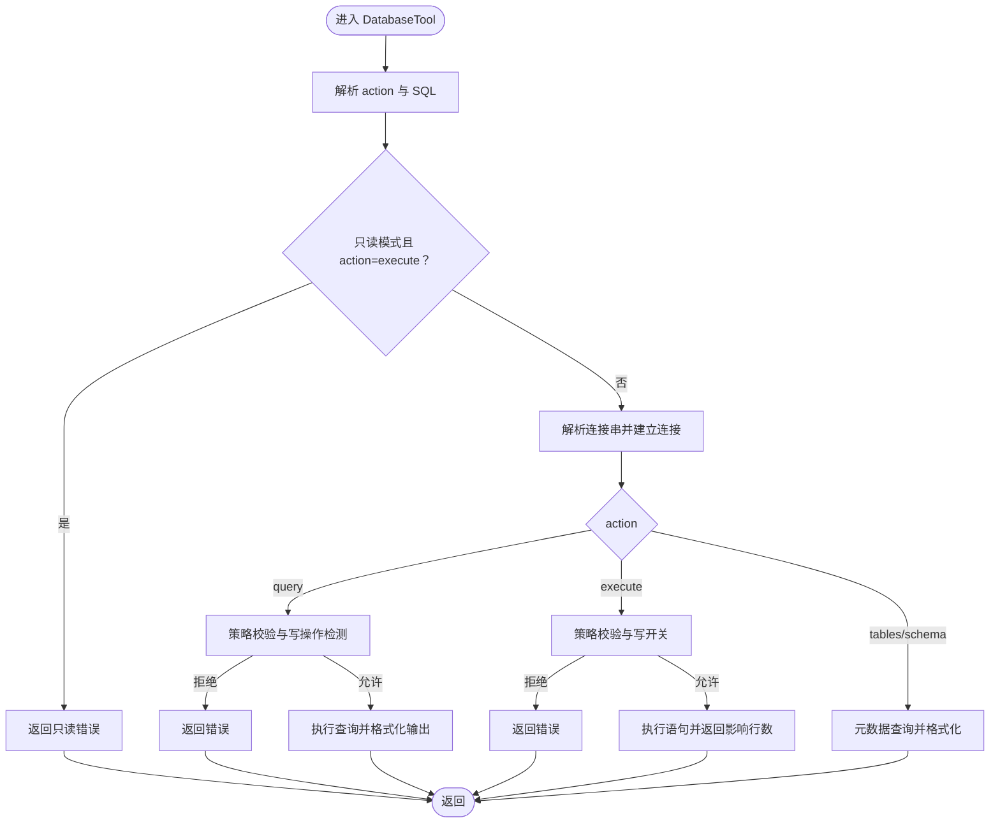

**图表来源**
- [DatabaseTool.cs:70-101](file://src/OpenClaw.Agent/Tools/DatabaseTool.cs#L70-L101)
- [DatabaseTool.cs:103-146](file://src/OpenClaw.Agent/Tools/DatabaseTool.cs#L103-L146)
- [DatabaseTool.cs:148-182](file://src/OpenClaw.Agent/Tools/DatabaseTool.cs#L148-L182)
- [DatabaseTool.cs:184-236](file://src/OpenClaw.Agent/Tools/DatabaseTool.cs#L184-L236)

**章节来源**
- [DatabaseTool.cs:1-944](file://src/OpenClaw.Agent/Tools/DatabaseTool.cs#L1-L944)

### 外部 CLI 工具（ExternalCliTool）
- 能力
  - 列出连接器、状态、命令；查看命令模式；预览与执行
  - 支持干跑预览与审批指纹
- 审计与事件
  - 记录审计条目（含风险等级、只读、工作目录等）
  - 记录运行时事件（预览、执行、超时、失败等）

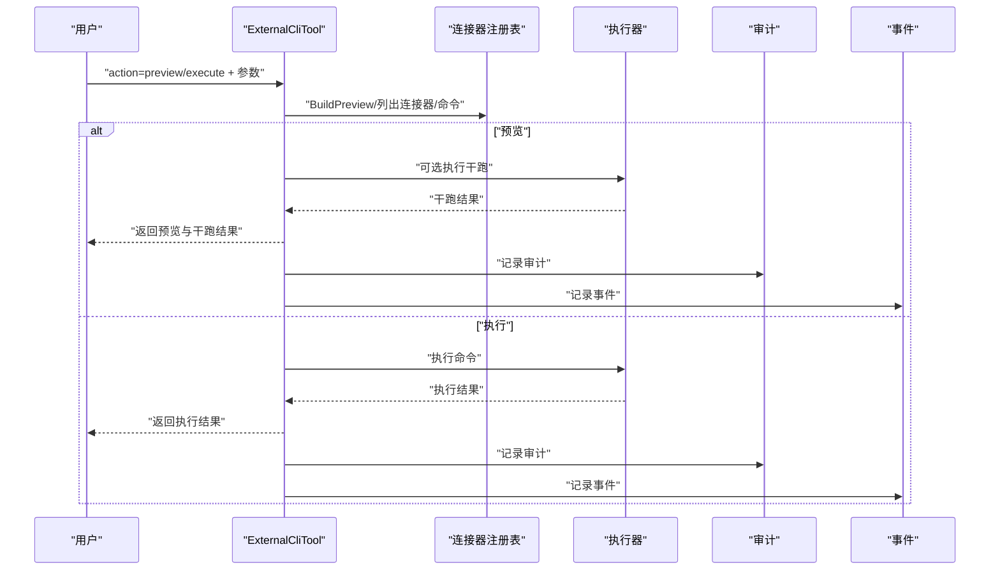

**图表来源**
- [ExternalCliTool.cs:49-168](file://src/OpenClaw.Agent/Tools/ExternalCliTool.cs#L49-L168)
- [ExternalCliTool.cs:170-196](file://src/OpenClaw.Agent/Tools/ExternalCliTool.cs#L170-L196)
- [ExternalCliTool.cs:198-223](file://src/OpenClaw.Agent/Tools/ExternalCliTool.cs#L198-L223)

**章节来源**
- [ExternalCliTool.cs:1-252](file://src/OpenClaw.Agent/Tools/ExternalCliTool.cs#L1-L252)

### 执行路由与后端
- 路由解析
  - 优先匹配配置化的工具路由；否则根据工具是否支持沙箱与策略决定后端
  - OpenSandbox 提供统一沙箱执行入口
- 后端能力
  - 本地：支持进程、PTY、交互式输入
  - Docker：镜像运行一次性命令
  - SSH：远程主机执行，支持密钥与环境变量注入
  - OpenSandbox：统一超时与结果封装

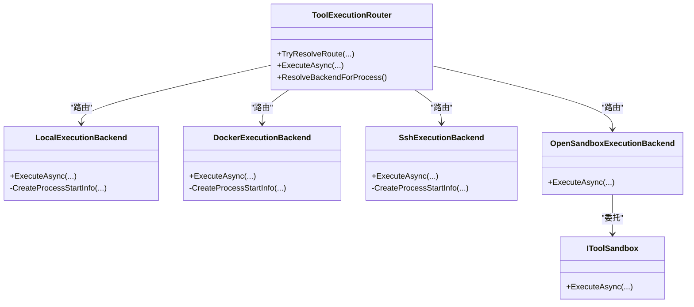

**图表来源**
- [ToolExecutionRouter.cs:7-63](file://src/OpenClaw.Agent/Execution/ToolExecutionRouter.cs#L7-L63)
- [LocalExecutionBackend.cs:6-51](file://src/OpenClaw.Agent/Execution/LocalExecutionBackend.cs#L6-L51)
- [DockerExecutionBackend.cs:6-64](file://src/OpenClaw.Agent/Execution/DockerExecutionBackend.cs#L6-L64)
- [SshExecutionBackend.cs:6-58](file://src/OpenClaw.Agent/Execution/SshExecutionBackend.cs#L6-L58)
- [OpenSandboxExecutionBackend.cs:7-41](file://src/OpenClaw.Agent/Execution/OpenSandboxExecutionBackend.cs#L7-L41)
- [IToolSandbox.cs:5-10](file://src/OpenClaw.Core/Abstractions/IToolSandbox.cs#L5-L10)

**章节来源**
- [ToolExecutionRouter.cs:1-253](file://src/OpenClaw.Agent/Execution/ToolExecutionRouter.cs#L1-L253)
- [LocalExecutionBackend.cs:1-99](file://src/OpenClaw.Agent/Execution/LocalExecutionBackend.cs#L1-L99)
- [DockerExecutionBackend.cs:1-66](file://src/OpenClaw.Agent/Execution/DockerExecutionBackend.cs#L1-L66)
- [SshExecutionBackend.cs:1-63](file://src/OpenClaw.Agent/Execution/SshExecutionBackend.cs#L1-L63)
- [OpenSandboxExecutionBackend.cs:1-69](file://src/OpenClaw.Agent/Execution/OpenSandboxExecutionBackend.cs#L1-L69)
- [IToolSandbox.cs:1-12](file://src/OpenClaw.Core/Abstractions/IToolSandbox.cs#L1-L12)

### 沙箱与安全策略
- IToolSandbox 抽象
  - 统一的沙箱执行接口，便于替换不同沙箱实现
- URL 安全策略
  - 仅允许 http/https，阻断 localhost、metadata 等主机
  - 支持主机通配与 CIDR 黑名单
  - DNS 解析失败即拒绝
- 输入净化
  - Shell 元字符检测与阻断
  - CRLF 剥离防止协议注入
  - 键名与 IMAP 文件夹名安全校验

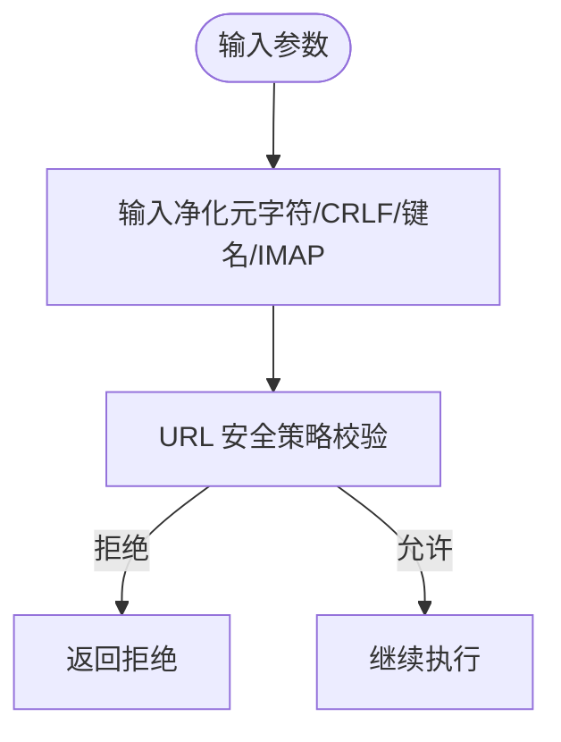

**图表来源**
- [InputSanitizer.cs:24-82](file://src/OpenClaw.Core/Security/InputSanitizer.cs#L24-L82)
- [UrlSafetyValidator.cs:60-111](file://src/OpenClaw.Core/Security/UrlSafetyValidator.cs#L60-L111)

**章节来源**
- [IToolSandbox.cs:1-12](file://src/OpenClaw.Core/Abstractions/IToolSandbox.cs#L1-L12)
- [UrlSafetyValidator.cs:1-219](file://src/OpenClaw.Core/Security/UrlSafetyValidator.cs#L1-L219)
- [InputSanitizer.cs:1-84](file://src/OpenClaw.Core/Security/InputSanitizer.cs#L1-L84)

### 审计日志与钩子
- 审计钩子
  - 在执行前记录调用摘要，在执行后记录耗时与结果长度
- 审计日志
  - JSON Lines 追加写入，记录时间戳、工具名、会话/通道/发送者、耗时、失败/超时、治理结果等
  - 不记录原始参数与结果，仅记录字节数，兼顾隐私与可追溯

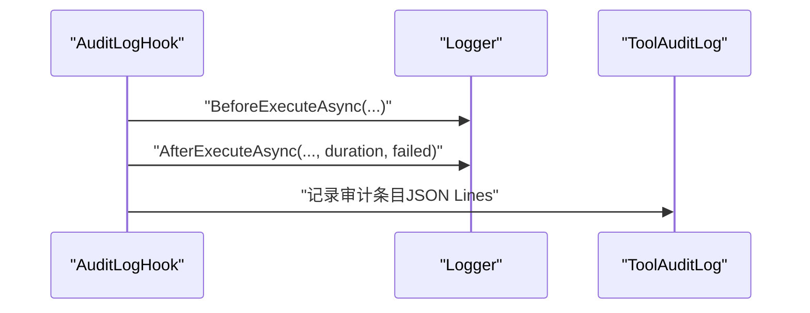

**图表来源**
- [AuditLogHook.cs:17-61](file://src/OpenClaw.Agent/AuditLogHook.cs#L17-L61)
- [ToolAuditLog.cs:72-95](file://src/OpenClaw.Core/Observability/ToolAuditLog.cs#L72-L95)

**章节来源**
- [AuditLogHook.cs:1-63](file://src/OpenClaw.Agent/AuditLogHook.cs#L1-L63)
- [ToolAuditLog.cs:1-125](file://src/OpenClaw.Core/Observability/ToolAuditLog.cs#L1-L125)

## 依赖关系分析
- 工具到路由：所有工具经由 ToolExecutionRouter 决策后端
- 路由到后端：根据配置与策略选择本地/容器/SSH/OpenSandbox
- 安全组件：BrowserTool 依赖 URL 安全策略；ShellTool 依赖输入净化；DatabaseTool 依赖输入净化
- 审计链路：工具执行前后经由审计钩子与审计日志

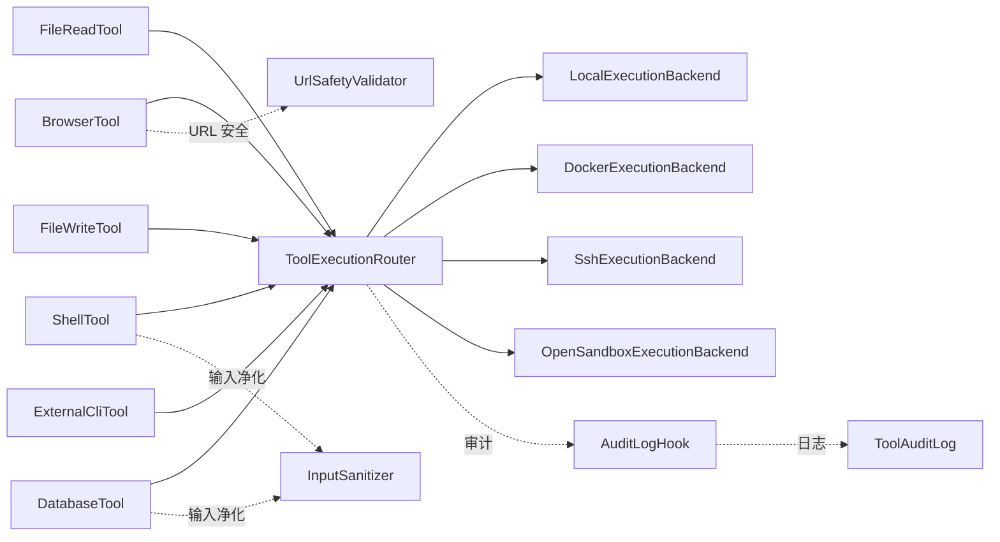

**图表来源**
- [ToolExecutionRouter.cs:1-253](file://src/OpenClaw.Agent/Execution/ToolExecutionRouter.cs#L1-L253)
- [BrowserTool.cs:1-696](file://src/OpenClaw.Agent/Tools/BrowserTool.cs#L1-L696)
- [ShellTool.cs:1-193](file://src/OpenClaw.Agent/Tools/ShellTool.cs#L1-L193)
- [DatabaseTool.cs:1-944](file://src/OpenClaw.Agent/Tools/DatabaseTool.cs#L1-L944)
- [ExternalCliTool.cs:1-252](file://src/OpenClaw.Agent/Tools/ExternalCliTool.cs#L1-L252)
- [UrlSafetyValidator.cs:1-219](file://src/OpenClaw.Core/Security/UrlSafetyValidator.cs#L1-L219)
- [InputSanitizer.cs:1-84](file://src/OpenClaw.Core/Security/InputSanitizer.cs#L1-L84)
- [AuditLogHook.cs:1-63](file://src/OpenClaw.Agent/AuditLogHook.cs#L1-L63)
- [ToolAuditLog.cs:1-125](file://src/OpenClaw.Core/Observability/ToolAuditLog.cs#L1-L125)

**章节来源**
- [ToolExecutionRouter.cs:1-253](file://src/OpenClaw.Agent/Execution/ToolExecutionRouter.cs#L1-L253)

## 性能考量
- 输出截断与行数限制
  - Shell 工具输出上限 64KB，避免大输出拖垮系统
  - 文件读取限制最大行数，防止上下文溢出
- 超时控制
  - Shell 工具与 OpenSandbox 后端均设置超时，防止长时间占用
- 连接与资源
  - 数据库工具限制结果集行数，避免内存膨胀
  - 浏览器工具按需初始化 Playwright，减少常驻开销
- I/O 优化
  - 文件读取采用异步流式读取
  - 写入采用临时文件 + 原子移动，降低锁竞争

[本节为通用指导，无需特定文件引用]

## 故障排查指南
- 浏览器工具
  - 本地不可用：确认 Playwright 可用或切换沙箱执行
  - URL 被策略拒绝：检查主机通配与 CIDR 黑名单
  - 超时或取消：检查超时配置与网络状况
- Shell 工具
  - 返回超时与截断标记：调整 timeout_seconds 或减少输出
  - 只读模式：关闭只读模式或改用其他工具
- 文件工具
  - 路径被拒绝：核对路径策略与实际路径解析
  - 写入失败：检查磁盘空间与权限
- 数据库工具
  - 多语句被拒：启用多语句或拆分语句
  - 表访问被拒：调整表白/黑名单或使用允许的表
  - 连接失败：检查连接串与驱动注册
- 外部 CLI 工具
  - 预览与执行差异：利用干跑模板验证
  - 审计与事件：通过审计日志定位失败原因
- 审计与钩子
  - 审计日志未写入：检查文件路径与权限
  - 钩子未生效：确认已注册审计钩子

**章节来源**
- [BrowserTool.cs:20-21](file://src/OpenClaw.Agent/Tools/BrowserTool.cs#L20-L21)
- [ShellTool.cs:125-135](file://src/OpenClaw.Agent/Tools/ShellTool.cs#L125-L135)
- [FileReadTool.cs:25-28](file://src/OpenClaw.Agent/Tools/FileReadTool.cs#L25-L28)
- [FileWriteTool.cs:21-22](file://src/OpenClaw.Agent/Tools/FileWriteTool.cs#L21-L22)
- [DatabaseTool.cs:352-368](file://src/OpenClaw.Agent/Tools/DatabaseTool.cs#L352-L368)
- [ExternalCliTool.cs:170-196](file://src/OpenClaw.Agent/Tools/ExternalCliTool.cs#L170-L196)
- [ToolAuditLog.cs:54-66](file://src/OpenClaw.Core/Observability/ToolAuditLog.cs#L54-L66)
- [AuditLogHook.cs:22-58](file://src/OpenClaw.Agent/AuditLogHook.cs#L22-L58)

## 结论
工具系统通过清晰的分层设计实现了“工具—路由—后端—安全—审计”的完整闭环。内置工具覆盖常见场景，执行后端灵活可插拔，沙箱与安全策略共同保障运行安全，审计日志提供可追溯性。遵循本文的接口规范、参数校验、错误处理与安全策略，可稳定地扩展与维护工具体系。

[本节为总结，无需特定文件引用]

## 附录

### 工具接口规范与参数校验
- 工具接口
  - ITool：Name、Description、ParameterSchema、ExecuteAsync
  - ISandboxCapableTool：DefaultSandboxMode、CreateSandboxRequest、FormatSandboxResult
- 参数校验
  - 必填字段校验与类型校验
  - 范围约束（如 timeout_seconds）
  - 策略开关（只读模式、写开关、URL 安全策略）
- 错误处理
  - 明确的错误消息与返回格式
  - 超时与取消的特殊处理
- 安全策略
  - Shell 元字符阻断
  - URL 安全策略
  - 路径策略与输入净化

**章节来源**
- [ShellTool.cs:115-157](file://src/OpenClaw.Agent/Tools/ShellTool.cs#L115-L157)
- [BrowserTool.cs:580-661](file://src/OpenClaw.Agent/Tools/BrowserTool.cs#L580-L661)
- [DatabaseTool.cs:352-368](file://src/OpenClaw.Agent/Tools/DatabaseTool.cs#L352-L368)
- [InputSanitizer.cs:24-82](file://src/OpenClaw.Core/Security/InputSanitizer.cs#L24-L82)
- [UrlSafetyValidator.cs:60-111](file://src/OpenClaw.Core/Security/UrlSafetyValidator.cs#L60-L111)

### 自定义工具开发指南
- 实现 ITool 或 IToolWithContext
- 定义 ParameterSchema，明确必填与默认值
- 在 ExecuteAsync 中完成参数解析、策略校验与执行
- 如需沙箱：实现 ISandboxCapableTool，提供 CreateSandboxRequest 与 FormatSandboxResult
- 注册与测试：在系统中注册工具并编写单元测试

[本节为通用指导，无需特定文件引用]

### 工具注册流程
- 在路由配置中为工具指定后端与模板
- 若工具支持沙箱，配置沙箱策略与模板
- 通过审计钩子与审计日志启用可观测性

**章节来源**
- [ToolExecutionRouter.cs:65-112](file://src/OpenClaw.Agent/Execution/ToolExecutionRouter.cs#L65-L112)
- [AuditLogHook.cs:1-63](file://src/OpenClaw.Agent/AuditLogHook.cs#L1-L63)
- [ToolAuditLog.cs:1-125](file://src/OpenClaw.Core/Observability/ToolAuditLog.cs#L1-L125)

### 性能优化建议
- 控制输出大小与行数
- 设置合理的超时与重试策略
- 使用异步 I/O 与原子写入
- 限制结果集规模与列宽

[本节为通用指导，无需特定文件引用]

### 安全最佳实践
- 默认最小权限原则，启用 URL 安全策略与路径策略
- 禁用不必要的写操作与 evaluate
- 使用沙箱执行高风险工具
- 审计日志脱敏，仅记录必要字段

[本节为通用指导，无需特定文件引用]