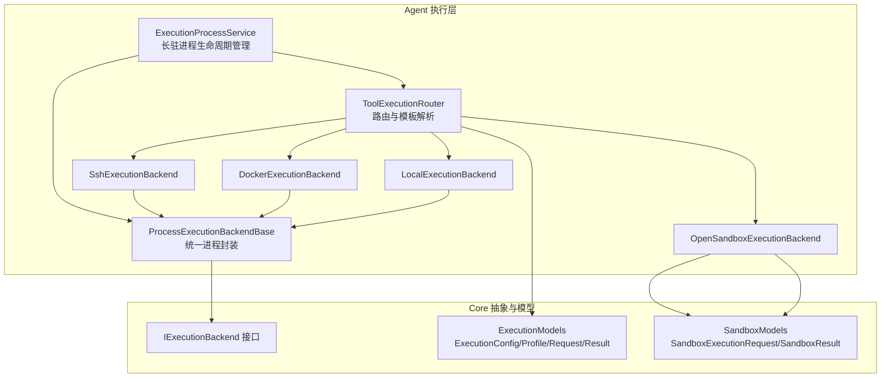
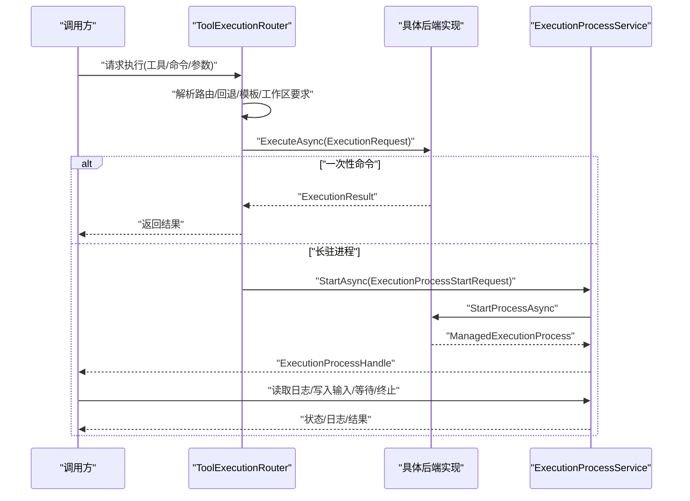
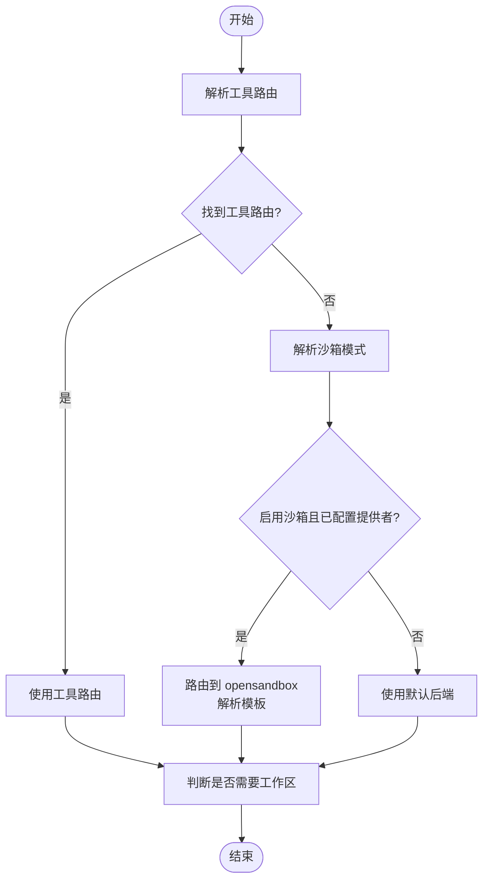
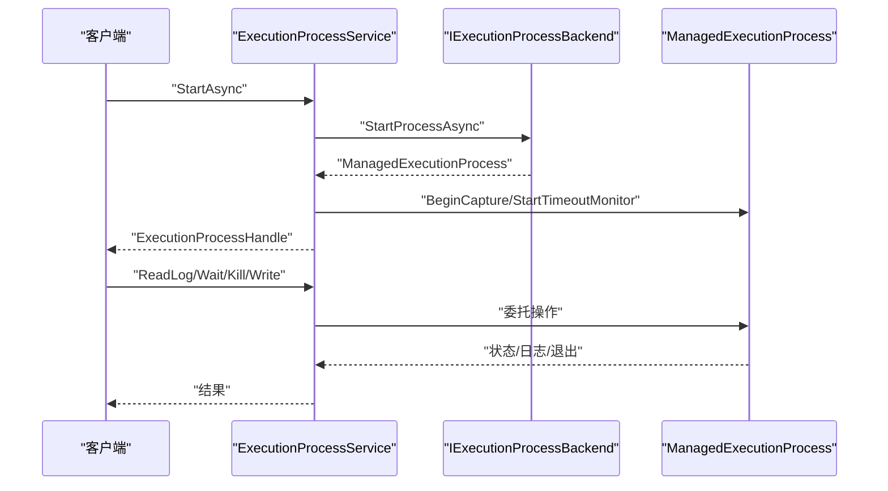
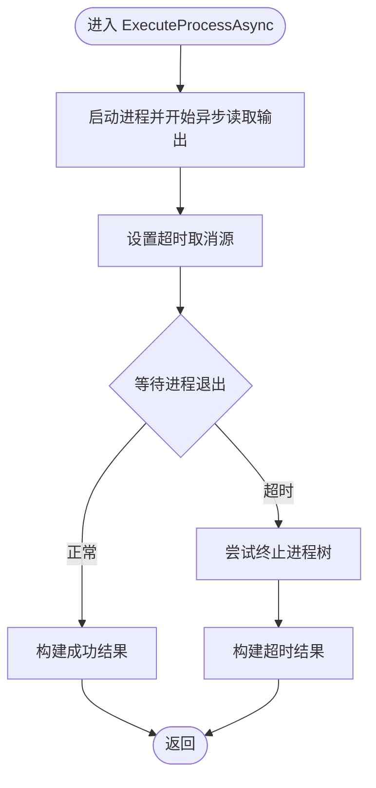
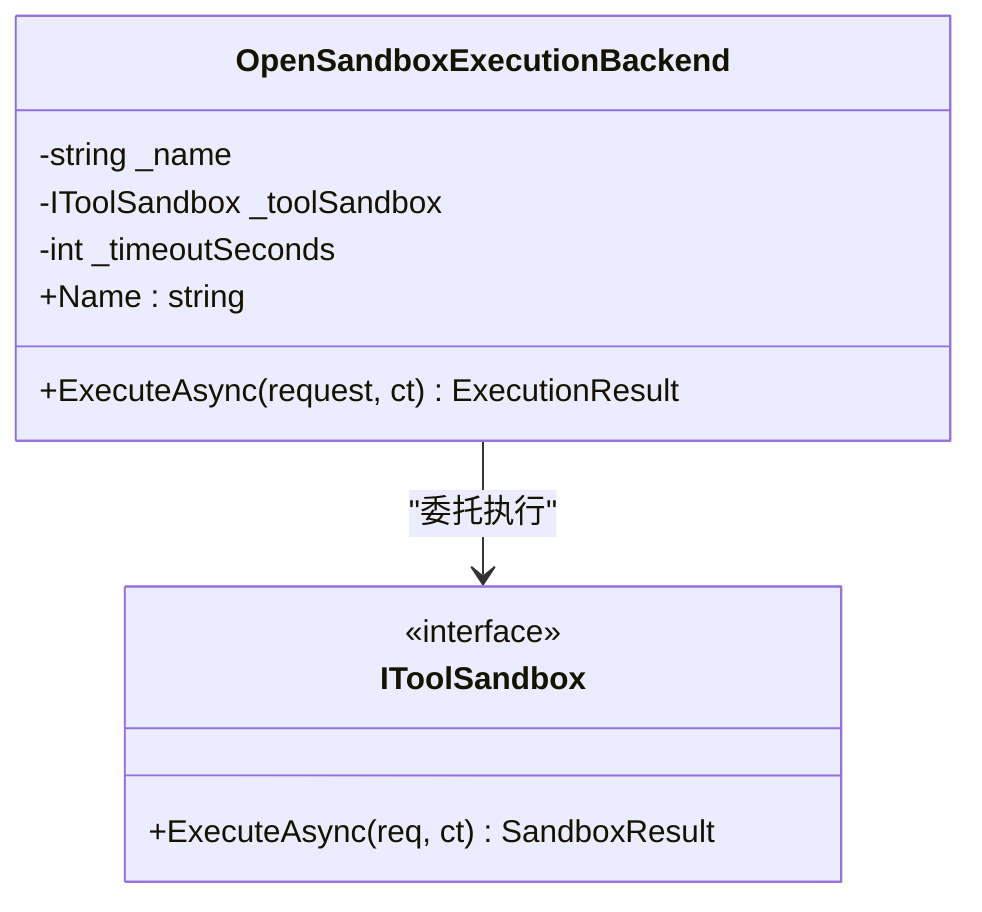
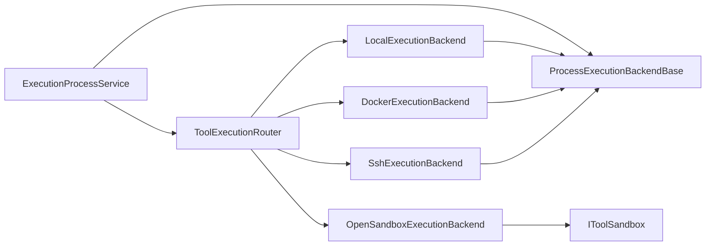

# 执行后端

<cite>
**本文引用的文件**
- [LocalExecutionBackend.cs](file://src/OpenClaw.Agent/Execution/LocalExecutionBackend.cs)
- [DockerExecutionBackend.cs](file://src/OpenClaw.Agent/Execution/DockerExecutionBackend.cs)
- [SshExecutionBackend.cs](file://src/OpenClaw.Agent/Execution/SshExecutionBackend.cs)
- [OpenSandboxExecutionBackend.cs](file://src/OpenClaw.Agent/Execution/OpenSandboxExecutionBackend.cs)
- [ProcessExecutionBackendBase.cs](file://src/OpenClaw.Agent/Execution/ProcessExecutionBackendBase.cs)
- [ToolExecutionRouter.cs](file://src/OpenClaw.Agent/Execution/ToolExecutionRouter.cs)
- [ExecutionProcessService.cs](file://src/OpenClaw.Agent/Execution/ExecutionProcessService.cs)
- [ExecutionModels.cs](file://src/OpenClaw.Core/Models/ExecutionModels.cs)
- [SandboxModels.cs](file://src/OpenClaw.Core/Models/SandboxModels.cs)
- [IExecutionBackend.cs](file://src/OpenClaw.Core/Abstractions/IExecutionBackend.cs)
</cite>

## 目录
1. [简介](#简介)
2. [项目结构](#项目结构)
3. [核心组件](#核心组件)
4. [架构总览](#架构总览)
5. [详细组件分析](#详细组件分析)
6. [依赖关系分析](#依赖关系分析)
7. [性能考量](#性能考量)
8. [故障排除指南](#故障排除指南)
9. [结论](#结论)
10. [附录](#附录)

## 简介
本文件系统性梳理执行后端子系统的设计与实现，覆盖以下后端类型：本地执行、Docker 容器执行、SSH 远程执行、OpenSandbox 安全沙箱执行。内容包括：
- 各后端的实现原理、能力边界与适用场景
- 配置参数与路由策略
- 工具执行流程、进程管理、资源限制、超时与错误恢复
- 性能对比与安全考虑
- 常见问题排查与最佳实践

## 项目结构
执行后端位于 Agent 层的 Execution 命名空间下，核心由“后端实现 + 路由器 + 进程服务”构成，并通过 Core 模型与抽象进行解耦。

图示来源
- [ToolExecutionRouter.cs:1-253](file://src/OpenClaw.Agent/Execution/ToolExecutionRouter.cs#L1-L253)
- [ExecutionProcessService.cs:1-522](file://src/OpenClaw.Agent/Execution/ExecutionProcessService.cs#L1-L522)
- [ProcessExecutionBackendBase.cs:1-142](file://src/OpenClaw.Agent/Execution/ProcessExecutionBackendBase.cs#L1-L142)
- [LocalExecutionBackend.cs:1-99](file://src/OpenClaw.Agent/Execution/LocalExecutionBackend.cs#L1-L99)
- [DockerExecutionBackend.cs:1-66](file://src/OpenClaw.Agent/Execution/DockerExecutionBackend.cs#L1-L66)
- [SshExecutionBackend.cs:1-63](file://src/OpenClaw.Agent/Execution/SshExecutionBackend.cs#L1-L63)
- [OpenSandboxExecutionBackend.cs:1-69](file://src/OpenClaw.Agent/Execution/OpenSandboxExecutionBackend.cs#L1-L69)
- [ExecutionModels.cs:1-179](file://src/OpenClaw.Core/Models/ExecutionModels.cs#L1-L179)
- [SandboxModels.cs:1-28](file://src/OpenClaw.Core/Models/SandboxModels.cs#L1-L28)
- [IExecutionBackend.cs:1-13](file://src/OpenClaw.Core/Abstractions/IExecutionBackend.cs#L1-L13)

章节来源
- [ToolExecutionRouter.cs:1-253](file://src/OpenClaw.Agent/Execution/ToolExecutionRouter.cs#L1-L253)
- [ExecutionProcessService.cs:1-522](file://src/OpenClaw.Agent/Execution/ExecutionProcessService.cs#L1-L522)
- [ProcessExecutionBackendBase.cs:1-142](file://src/OpenClaw.Agent/Execution/ProcessExecutionBackendBase.cs#L1-L142)
- [ExecutionModels.cs:1-179](file://src/OpenClaw.Core/Models/ExecutionModels.cs#L1-L179)

## 核心组件
- 路由器（ToolExecutionRouter）：根据工具名称与配置解析后端路由、回退策略、工作区要求与沙箱模式；支持按工具或默认后端执行一次性命令。
- 进程服务（ExecutionProcessService）：管理长驻后台进程的生命周期（启动、状态查询、日志拉取、输入写入、终止），内置超时监控与历史清理。
- 进程基类（ProcessExecutionBackendBase）：统一封装进程启动、输出捕获、超时控制与结果返回。
- 后端实现：本地、Docker、SSH、OpenSandbox 四种执行后端，分别面向不同运行环境与隔离需求。
- 抽象与模型：IExecutionBackend 接口、ExecutionConfig/Profile/Request/Result、SandboxExecutionRequest/SandboxResult 等。

章节来源
- [ToolExecutionRouter.cs:1-253](file://src/OpenClaw.Agent/Execution/ToolExecutionRouter.cs#L1-L253)
- [ExecutionProcessService.cs:1-522](file://src/OpenClaw.Agent/Execution/ExecutionProcessService.cs#L1-L522)
- [ProcessExecutionBackendBase.cs:1-142](file://src/OpenClaw.Agent/Execution/ProcessExecutionBackendBase.cs#L1-L142)
- [IExecutionBackend.cs:1-13](file://src/OpenClaw.Core/Abstractions/IExecutionBackend.cs#L1-L13)
- [ExecutionModels.cs:1-179](file://src/OpenClaw.Core/Models/ExecutionModels.cs#L1-L179)
- [SandboxModels.cs:1-28](file://src/OpenClaw.Core/Models/SandboxModels.cs#L1-L28)

## 架构总览
执行后端采用“配置驱动 + 可插拔后端”的设计。路由器负责解析工具到后端的映射与模板选择；进程服务负责长驻进程的全生命周期；后端实现基于统一基类或直接对接沙箱接口。

图示来源
- [ToolExecutionRouter.cs:114-157](file://src/OpenClaw.Agent/Execution/ToolExecutionRouter.cs#L114-L157)
- [ExecutionProcessService.cs:301-377](file://src/OpenClaw.Agent/Execution/ExecutionProcessService.cs#L301-L377)
- [ProcessExecutionBackendBase.cs:19-44](file://src/OpenClaw.Agent/Execution/ProcessExecutionBackendBase.cs#L19-L44)

## 详细组件分析

### 路由器（ToolExecutionRouter）
- 功能要点
  - 解析工具路由：优先使用工具级配置，其次默认后端；支持为特定工具设置回退后端。
  - 沙箱模式：对可沙箱工具解析有效模式（None/Prefer/Require），必要时自动路由至 opensandbox 并解析模板。
  - 进程后端判定：识别哪些后端支持长驻进程，以及是否需要工作区隔离。
  - 模板解析：从后端配置中提取镜像/模板信息，用于 Docker/SSH 或 OpenSandbox 场景。
- 关键行为
  - 执行一次性命令：按路由直接调用后端，支持在失败时按回退策略切换。
  - 解析进程后端：针对 process/shell 等场景，决定后端、模板与工作区要求。
  - 工作区要求：Docker/SSH 默认需要工作区隔离，本地默认不需要。

图示来源
- [ToolExecutionRouter.cs:65-112](file://src/OpenClaw.Agent/Execution/ToolExecutionRouter.cs#L65-L112)
- [ToolExecutionRouter.cs:164-203](file://src/OpenClaw.Agent/Execution/ToolExecutionRouter.cs#L164-L203)

章节来源
- [ToolExecutionRouter.cs:1-253](file://src/OpenClaw.Agent/Execution/ToolExecutionRouter.cs#L1-L253)

### 进程服务（ExecutionProcessService）
- 功能要点
  - 生命周期管理：启动、状态查询、日志分页读取、写入标准输入、终止进程。
  - 超时控制：基于任务超时令牌与后台计时器实现超时检测与强制终止。
  - 历史保留：完成进程按时间窗口与数量上限保留，避免内存膨胀。
  - 事件与指标：记录运行事件与过程统计，便于可观测性。
- 关键行为
  - 对不支持长驻进程的后端（如 opensandbox）拒绝启动进程。
  - 对需要隔离的进程（如 process 工具）校验后端是否具备隔离能力。
  - 支持 PTY 模式开关，但需后端明确支持。

图示来源
- [ExecutionProcessService.cs:301-377](file://src/OpenClaw.Agent/Execution/ExecutionProcessService.cs#L301-L377)
- [ExecutionProcessService.cs:395-430](file://src/OpenClaw.Agent/Execution/ExecutionProcessService.cs#L395-L430)
- [ExecutionProcessService.cs:401-420](file://src/OpenClaw.Agent/Execution/ExecutionProcessService.cs#L401-L420)

章节来源
- [ExecutionProcessService.cs:1-522](file://src/OpenClaw.Agent/Execution/ExecutionProcessService.cs#L1-L522)

### 进程基类（ProcessExecutionBackendBase）
- 统一封装
  - 一次性命令执行：启动进程、异步读取 stdout/stderr、统一超时处理与结果构造。
  - 长驻进程启动：实现 IExecutionProcessBackend，返回 ManagedExecutionProcess。
  - 能力声明：默认支持一次性命令与交互输入，PTY 支持按平台判定。
- 超时与回收
  - 使用链接取消令牌在超时后尝试终止进程树并返回超时结果。
  - 结果包含后端名、退出码、输出、耗时与超时标记。

图示来源
- [ProcessExecutionBackendBase.cs:61-128](file://src/OpenClaw.Agent/Execution/ProcessExecutionBackendBase.cs#L61-L128)

章节来源
- [ProcessExecutionBackendBase.cs:1-142](file://src/OpenClaw.Agent/Execution/ProcessExecutionBackendBase.cs#L1-L142)

### 本地执行后端（LocalExecutionBackend）
- 实现原理
  - 直接以当前主机用户身份启动外部进程，支持工作目录解析与工作区限制。
  - 环境变量合并：优先使用后端配置，再叠加请求中的环境变量。
  - 工作区校验：当请求要求工作区时，确保工作目录位于允许的根路径之下。
- 能力与限制
  - 支持一次性命令与交互输入；非 Windows 平台支持 PTY。
  - 不支持长驻进程（通过基类接口约束）。
- 典型用途
  - 开发调试、快速验证、无需隔离的轻量任务。

章节来源
- [LocalExecutionBackend.cs:1-99](file://src/OpenClaw.Agent/Execution/LocalExecutionBackend.cs#L1-L99)
- [ProcessExecutionBackendBase.cs:8-17](file://src/OpenClaw.Agent/Execution/ProcessExecutionBackendBase.cs#L8-L17)

### Docker 执行后端（DockerExecutionBackend）
- 实现原理
  - 通过调用 docker CLI 启动容器执行命令，自动拼装 --rm、-w、-e 等参数。
  - 镜像来源：优先使用请求模板或后端配置中的镜像。
- 能力与限制
  - 支持一次性命令；不支持长驻进程。
  - 默认需要工作区隔离（工作目录与环境变量通过 -w/-e 注入）。
- 典型用途
  - 需要一致运行环境、隔离依赖的工具执行；CI/CD 场景常用。

章节来源
- [DockerExecutionBackend.cs:1-66](file://src/OpenClaw.Agent/Execution/DockerExecutionBackend.cs#L1-L66)
- [ExecutionModels.cs:26-41](file://src/OpenClaw.Core/Models/ExecutionModels.cs#L26-L41)

### SSH 执行后端（SshExecutionBackend）
- 实现原理
  - 通过 ssh 客户端连接远端主机执行命令，支持自定义端口与私钥认证。
  - 将工作目录切换与环境变量注入到远端命令行。
- 能力与限制
  - 支持一次性命令；不支持长驻进程。
  - 默认需要工作区隔离（远端工作目录通过 cd 注入）。
- 典型用途
  - 在受控服务器或边缘节点执行工具；跨主机资源编排。

章节来源
- [SshExecutionBackend.cs:1-63](file://src/OpenClaw.Agent/Execution/SshExecutionBackend.cs#L1-L63)
- [ExecutionModels.cs:26-41](file://src/OpenClaw.Core/Models/ExecutionModels.cs#L26-L41)

### OpenSandbox 执行后端（OpenSandboxExecutionBackend）
- 实现原理
  - 直接委托 IToolSandbox 执行，屏蔽底层实现细节。
  - 自带独立超时控制（可配置秒数），超时后返回超时结果。
- 能力与限制
  - 支持一次性命令；不支持长驻进程。
  - 通过沙箱提供强隔离能力，适合高风险工具。
- 典型用途
  - 对安全性要求极高的工具执行；作为默认或回退方案。

图示来源
- [OpenSandboxExecutionBackend.cs:1-69](file://src/OpenClaw.Agent/Execution/OpenSandboxExecutionBackend.cs#L1-L69)
- [SandboxModels.cs:10-26](file://src/OpenClaw.Core/Models/SandboxModels.cs#L10-L26)

章节来源
- [OpenSandboxExecutionBackend.cs:1-69](file://src/OpenClaw.Agent/Execution/OpenSandboxExecutionBackend.cs#L1-L69)
- [SandboxModels.cs:1-28](file://src/OpenClaw.Core/Models/SandboxModels.cs#L1-L28)

## 依赖关系分析
- 路由器依赖配置模型与后端注册表，动态构建可用后端集合。
- 进程服务依赖路由器与后端（仅限支持长驻进程的后端）。
- 后端实现统一继承或适配基类，保证一致性。
- OpenSandbox 后端依赖 IToolSandbox 抽象，实现与具体沙箱实现解耦。

图示来源
- [ToolExecutionRouter.cs:28-62](file://src/OpenClaw.Agent/Execution/ToolExecutionRouter.cs#L28-L62)
- [ExecutionProcessService.cs:278-299](file://src/OpenClaw.Agent/Execution/ExecutionProcessService.cs#L278-L299)
- [ProcessExecutionBackendBase.cs:8-11](file://src/OpenClaw.Agent/Execution/ProcessExecutionBackendBase.cs#L8-L11)
- [OpenSandboxExecutionBackend.cs:9-18](file://src/OpenClaw.Agent/Execution/OpenSandboxExecutionBackend.cs#L9-L18)

章节来源
- [ToolExecutionRouter.cs:1-253](file://src/OpenClaw.Agent/Execution/ToolExecutionRouter.cs#L1-L253)
- [ExecutionProcessService.cs:1-522](file://src/OpenClaw.Agent/Execution/ExecutionProcessService.cs#L1-L522)
- [ProcessExecutionBackendBase.cs:1-142](file://src/OpenClaw.Agent/Execution/ProcessExecutionBackendBase.cs#L1-L142)
- [IExecutionBackend.cs:1-13](file://src/OpenClaw.Core/Abstractions/IExecutionBackend.cs#L1-L13)

## 性能考量
- 进程开销
  - 本地执行开销最低，适合短小、频繁的任务。
  - Docker/SSH 需要额外的网络与容器启动成本，适合需要稳定运行环境的任务。
  - OpenSandbox 提供更强隔离，可能带来轻微性能损耗，换取更高的安全性。
- 资源限制
  - 后端配置支持超时秒数（TimeoutSeconds），建议为高风险或不可信工具设置更严格的超时。
  - 进程服务对完成进程进行历史清理，避免长期运行导致内存占用增长。
- I/O 与吞吐
  - 异步读取 stdout/stderr 的方式避免阻塞主线程，适合长时间运行任务。
  - 日志分页读取（最大字符数）避免单次传输过大。

## 故障排除指南
- 后端未配置或不可用
  - 现象：抛出“后端未配置”异常。
  - 处理：检查 ExecutionConfig 中的 Profiles 与 Tools 映射，确认后端名称正确。
- 工作区拒绝访问
  - 现象：本地后端在 RequireWorkspace=true 时，若工作目录不在允许范围内会抛出异常。
  - 处理：调整请求的工作目录或后端的 WorkspaceRoot/WorkingDirectory，确保在允许前缀内。
- SSH/Docker 需要工作区
  - 现象：路由要求工作区隔离，但工具未满足。
  - 处理：为工具配置合适的后端（Docker/SSH）或关闭 RequireWorkspace。
- 进程后端不支持长驻
  - 现象：尝试启动长驻进程被拒绝（例如 opensandbox 不支持）。
  - 处理：更换为支持长驻进程的后端（Docker/SSH/本地），或调整工具策略。
- 超时与强制终止
  - 现象：一次性命令或长驻进程超时，返回超时结果或被终止。
  - 处理：适当提高超时阈值，优化工具执行逻辑，或拆分任务。
- 回退策略
  - 现象：主后端失败，但未配置回退或不允许本地回退。
  - 处理：在工具路由中配置 FallbackBackend，并确保 AllowLocalFallback=true（如需要）。

章节来源
- [ToolExecutionRouter.cs:114-157](file://src/OpenClaw.Agent/Execution/ToolExecutionRouter.cs#L114-L157)
- [LocalExecutionBackend.cs:53-83](file://src/OpenClaw.Agent/Execution/LocalExecutionBackend.cs#L53-L83)
- [ExecutionProcessService.cs:301-336](file://src/OpenClaw.Agent/Execution/ExecutionProcessService.cs#L301-L336)
- [ProcessExecutionBackendBase.cs:87-116](file://src/OpenClaw.Agent/Execution/ProcessExecutionBackendBase.cs#L87-L116)

## 结论
该执行后端系统通过“配置驱动 + 可插拔后端 + 统一进程管理”的架构，实现了从本地到容器、远程与沙箱的多场景覆盖。路由器与进程服务提供了灵活的路由、回退、工作区与隔离策略，满足不同安全与性能需求。建议在生产中结合工具风险等级与运行环境，合理配置后端与超时策略，并利用沙箱作为高风险工具的默认保护层。

## 附录

### 配置参数速查
- ExecutionConfig
  - Enabled：是否启用执行路由
  - DefaultBackend：默认后端名称
  - Profiles：后端配置字典
  - Tools：工具到后端的路由映射
- ExecutionBackendProfileConfig
  - Type：后端类型（local/docker/ssh/opensandbox）
  - Enabled：是否启用
  - WorkingDirectory/WorkspaceRoot：工作目录与工作区根
  - Environment：环境变量
  - Image：Docker 镜像
  - Host/Port/Username/PrivateKeyPath：SSH 连接参数
  - TimeoutSeconds：超时秒数
- ExecutionToolRouteConfig
  - Backend/FallbackBackend：目标后端与回退后端
  - RequireWorkspace：是否需要工作区隔离

章节来源
- [ExecutionModels.cs:8-52](file://src/OpenClaw.Core/Models/ExecutionModels.cs#L8-L52)