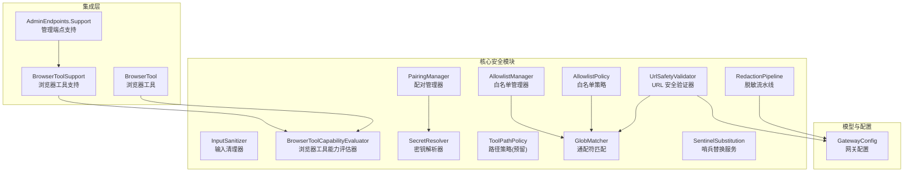
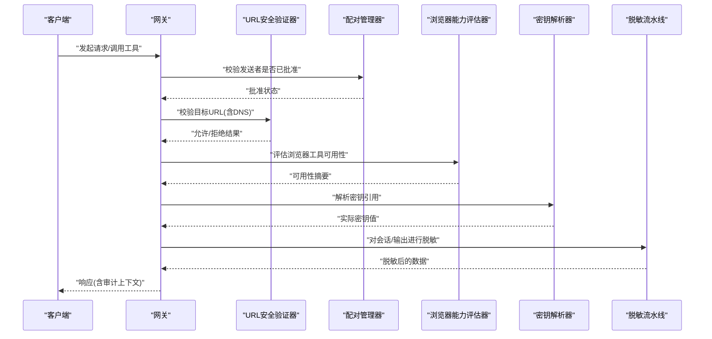
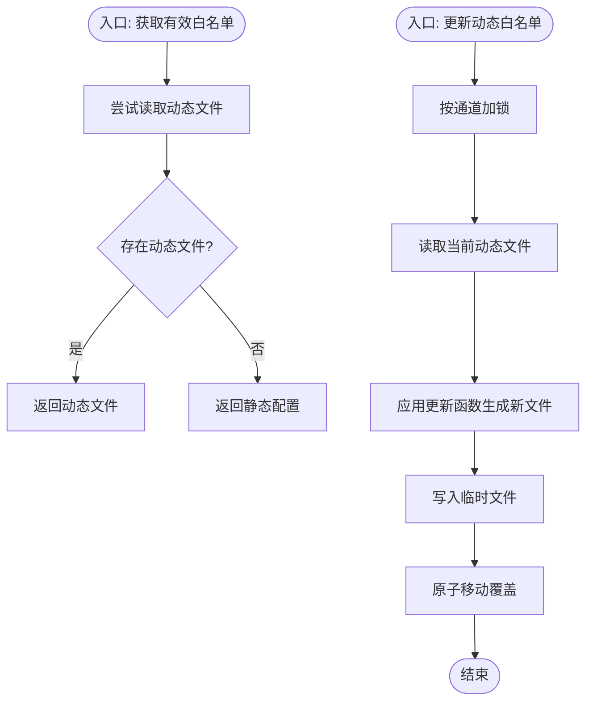
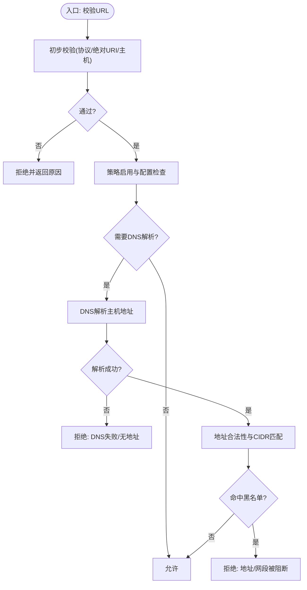
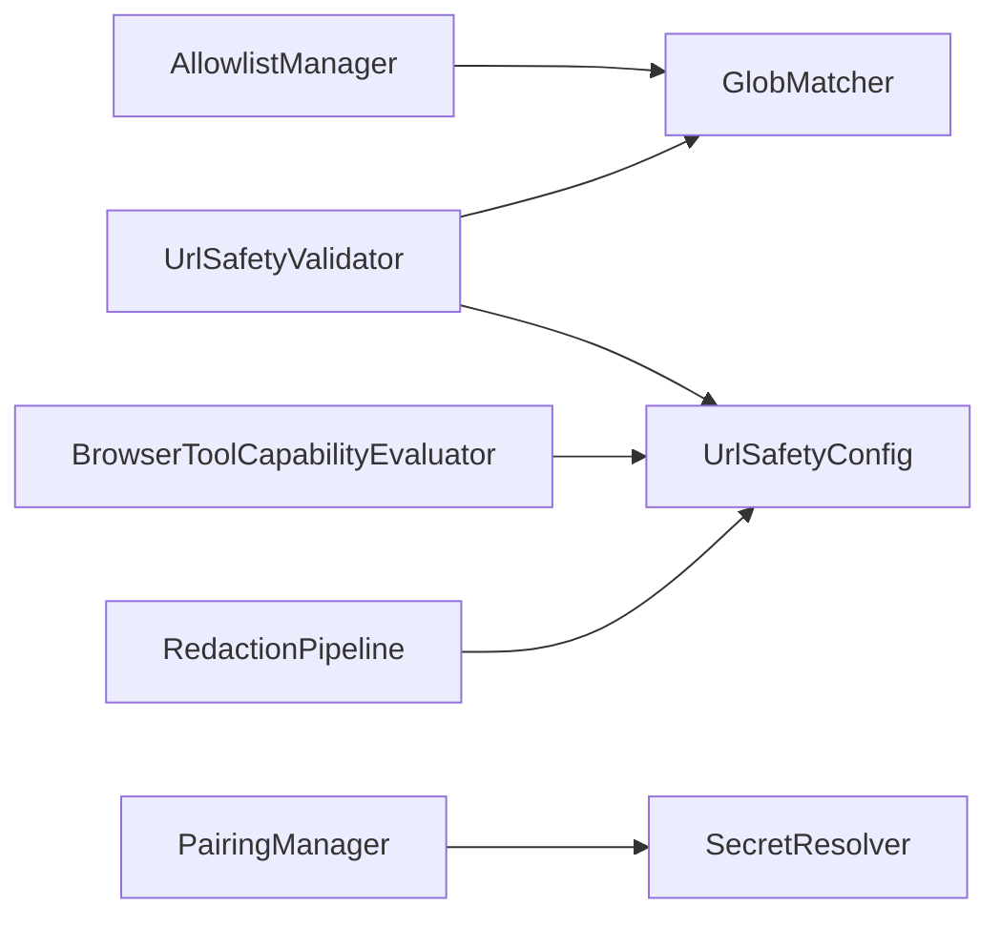

# 权限控制

<cite>
**本文引用的文件**
- [AllowlistManager.cs](file://src/OpenClaw.Core/security/AllowlistManager.cs)
- [UrlSafetyValidator.cs](file://src/OpenClaw.Core/security/UrlSafetyValidator.cs)
- [InputSanitizer.cs](file://src/OpenClaw.Core/security/InputSanitizer.cs)
- [BrowserToolCapabilityEvaluator.cs](file://src/OpenClaw.Core/security/BrowserToolCapabilityEvaluator.cs)
- [PairingManager.cs](file://src/OpenClaw.Core/security/PairingManager.cs)
- [SecretResolver.cs](file://src/OpenClaw.Core/security/SecretResolver.cs)
- [ToolPathPolicy.cs](file://src/OpenClaw.Core/security/ToolPathPolicy.cs)
- [AllowlistPolicy.cs](file://src/OpenClaw.Core/security/AllowlistPolicy.cs)
- [GlobMatcher.cs](file://src/OpenClaw.Core/security/GlobMatcher.cs)
- [RedactionPipeline.cs](file://src/OpenClaw.Core/security/RedactionPipeline.cs)
- [SentinelSubstitution.cs](file://src/OpenClaw.Core/security/SentinelSubstitution.cs)
- [GatewayConfig.cs](file://src/OpenClaw.Core/models/GatewayConfig.cs)
- [BrowserToolSupport.cs](file://src/OpenClaw.Gateway/BrowserToolSupport.cs)
- [AdminEndpoints.Support.cs](file://src/OpenClaw.Gateway/Endpoints/AdminEndpoints.Support.cs)
- [BrowserTool.cs](file://src/OpenClaw.Agent/Tools/BrowserTool.cs)
- [UrlSafetyValidatorTests.cs](file://src/OpenClaw.Tests/UrlSafetyValidatorTests.cs)
- [AllowlistManagerTests.cs](file://src/OpenClaw.Tests/AllowlistManagerTests.cs)
</cite>

## 目录
1. [简介](#简介)
2. [项目结构](#项目结构)
3. [核心组件](#核心组件)
4. [架构总览](#架构总览)
5. [详细组件分析](#详细组件分析)
6. [依赖关系分析](#依赖关系分析)
7. [性能考量](#性能考量)
8. [故障排查指南](#故障排查指南)
9. [结论](#结论)
10. [附录](#附录)

## 简介
本文件系统化梳理 Kingcrab（OpenClaw）项目的权限控制系统，覆盖工具权限管理、访问控制、安全策略与合规性保障。重点包括：
- 白名单管理器：动态与静态白名单合并、并发安全持久化、通道级隔离
- URL 安全验证器：基于主机通配符与 CIDR 的出站网络访问控制
- 输入清理器：注入攻击防护（Shell 元字符、CRLF、路径穿越、IMAP 控制字符）
- 浏览器工具能力评估器：结合运行时与执行后端判定可用性
- 配对管理器：一次性验证码生成、固定时间比较、批准列表持久化
- 密钥解析器：统一的密钥来源解析（环境变量、原始值、回退策略）
- 路径策略：已预留文件系统路径读写策略接口
- 敏感信息保护：多阶段脱敏流水线与哨兵替换服务
- 审计与合规：会话历史脱敏、浏览器工具能力可视化、启动期安全预设

## 项目结构
权限控制相关代码主要位于 OpenClaw.Core 的 Security 命名空间，并在 Gateway 与 Agent 层进行集成使用。

图示来源
- [AllowlistManager.cs:19-125](file://src/OpenClaw.Core/security/AllowlistManager.cs#L19-L125)
- [UrlSafetyValidator.cs:17-219](file://src/OpenClaw.Core/security/UrlSafetyValidator.cs#L17-L219)
- [InputSanitizer.cs:9-84](file://src/OpenClaw.Core/security/InputSanitizer.cs#L9-L84)
- [BrowserToolCapabilityEvaluator.cs:5-61](file://src/OpenClaw.Core/security/BrowserToolCapabilityEvaluator.cs#L5-L61)
- [PairingManager.cs:14-211](file://src/OpenClaw.Core/security/PairingManager.cs#L14-L211)
- [SecretResolver.cs:14-66](file://src/OpenClaw.Core/security/SecretResolver.cs#L14-L66)
- [ToolPathPolicy.cs:1-136](file://src/OpenClaw.Core/security/ToolPathPolicy.cs#L1-L136)
- [AllowlistPolicy.cs:9-43](file://src/OpenClaw.Core/security/AllowlistPolicy.cs#L9-L43)
- [GlobMatcher.cs:3-89](file://src/OpenClaw.Core/security/GlobMatcher.cs#L3-L89)
- [RedactionPipeline.cs:21-131](file://src/OpenClaw.Core/security/RedactionPipeline.cs#L21-L131)
- [SentinelSubstitution.cs:1-38](file://src/OpenClaw.Core/security/SentinelSubstitution.cs#L1-L38)
- [GatewayConfig.cs:371-384](file://src/OpenClaw.Core/models/GatewayConfig.cs#L371-L384)
- [BrowserToolSupport.cs:13-25](file://src/OpenClaw.Gateway/BrowserToolSupport.cs#L13-L25)
- [AdminEndpoints.Support.cs:227-466](file://src/OpenClaw.Gateway/Endpoints/AdminEndpoints.Support.cs#L227-L466)
- [BrowserTool.cs:271-305](file://src/OpenClaw.Agent/Tools/BrowserTool.cs#L271-L305)

章节来源
- [AllowlistManager.cs:19-125](file://src/OpenClaw.Core/security/AllowlistManager.cs#L19-L125)
- [UrlSafetyValidator.cs:17-219](file://src/OpenClaw.Core/security/UrlSafetyValidator.cs#L17-L219)
- [InputSanitizer.cs:9-84](file://src/OpenClaw.Core/security/InputSanitizer.cs#L9-L84)
- [BrowserToolCapabilityEvaluator.cs:5-61](file://src/OpenClaw.Core/security/BrowserToolCapabilityEvaluator.cs#L5-L61)
- [PairingManager.cs:14-211](file://src/OpenClaw.Core/security/PairingManager.cs#L14-L211)
- [SecretResolver.cs:14-66](file://src/OpenClaw.Core/security/SecretResolver.cs#L14-L66)
- [ToolPathPolicy.cs:1-136](file://src/OpenClaw.Core/security/ToolPathPolicy.cs#L1-L136)
- [AllowlistPolicy.cs:9-43](file://src/OpenClaw.Core/security/AllowlistPolicy.cs#L9-L43)
- [GlobMatcher.cs:3-89](file://src/OpenClaw.Core/security/GlobMatcher.cs#L3-L89)
- [RedactionPipeline.cs:21-131](file://src/OpenClaw.Core/security/RedactionPipeline.cs#L21-L131)
- [SentinelSubstitution.cs:1-38](file://src/OpenClaw.Core/security/SentinelSubstitution.cs#L1-L38)
- [GatewayConfig.cs:371-384](file://src/OpenClaw.Core/models/GatewayConfig.cs#L371-L384)
- [BrowserToolSupport.cs:13-25](file://src/OpenClaw.Gateway/BrowserToolSupport.cs#L13-L25)
- [AdminEndpoints.Support.cs:227-466](file://src/OpenClaw.Gateway/Endpoints/AdminEndpoints.Support.cs#L227-L466)
- [BrowserTool.cs:271-305](file://src/OpenClaw.Agent/Tools/BrowserTool.cs#L271-L305)

## 核心组件
- 白名单管理器：按通道持久化允许来源/去向，动态文件优先于静态配置；并发安全更新与原子落盘
- URL 安全验证器：支持内置黑名单、自定义主机黑名单、CIDR 黑名单、私网地址阻断、DNS 解析校验
- 输入清理器：Shell 元字符检测、CRLF 去除、路径穿越与空字节检测、IMAP 文件夹名控制字符过滤
- 浏览器工具能力评估器：综合配置开关、本地动态代码支持、执行后端可用性判断
- 配对管理器：一次性验证码、固定时间比较防时序攻击、失败冷却、批准列表持久化
- 密钥解析器：统一 env/raw/裸字符串解析，生产建议显式 env:
- 路径策略：预留文件系统根目录读写许可判定
- 敏感信息保护：多步脱敏流水线、会话历史脱敏、基础密钥识别与替换
- 哨兵替换服务：参数 JSON 替换与持久化分离，避免明文泄露

章节来源
- [AllowlistManager.cs:19-125](file://src/OpenClaw.Core/security/AllowlistManager.cs#L19-L125)
- [UrlSafetyValidator.cs:17-219](file://src/OpenClaw.Core/security/UrlSafetyValidator.cs#L17-L219)
- [InputSanitizer.cs:9-84](file://src/OpenClaw.Core/security/InputSanitizer.cs#L9-L84)
- [BrowserToolCapabilityEvaluator.cs:5-61](file://src/OpenClaw.Core/security/BrowserToolCapabilityEvaluator.cs#L5-L61)
- [PairingManager.cs:14-211](file://src/OpenClaw.Core/security/PairingManager.cs#L14-L211)
- [SecretResolver.cs:14-66](file://src/OpenClaw.Core/security/SecretResolver.cs#L14-L66)
- [ToolPathPolicy.cs:1-136](file://src/OpenClaw.Core/security/ToolPathPolicy.cs#L1-L136)
- [RedactionPipeline.cs:21-131](file://src/OpenClaw.Core/security/RedactionPipeline.cs#L21-L131)
- [SentinelSubstitution.cs:1-38](file://src/OpenClaw.Core/security/SentinelSubstitution.cs#L1-L38)

## 架构总览
权限控制贯穿“配置—验证—执行—记录”链路，关键交互如下：

图示来源
- [UrlSafetyValidator.cs:27-58](file://src/OpenClaw.Core/security/UrlSafetyValidator.cs#L27-L58)
- [PairingManager.cs:44-124](file://src/OpenClaw.Core/security/PairingManager.cs#L44-L124)
- [BrowserToolCapabilityEvaluator.cs:7-30](file://src/OpenClaw.Core/security/BrowserToolCapabilityEvaluator.cs#L7-L30)
- [SecretResolver.cs:24-54](file://src/OpenClaw.Core/security/SecretResolver.cs#L24-L54)
- [RedactionPipeline.cs:30-93](file://src/OpenClaw.Core/security/RedactionPipeline.cs#L30-L93)

## 详细组件分析

### 白名单管理器
- 功能要点
  - 按通道存储动态白名单文件，路径安全清洗，未知通道回退到 unknown.json
  - 动态文件优先于静态配置，合并生效
  - 并发安全：按通道加锁，临时文件写入+原子移动，异常时尽力清理
  - 支持添加/设置允许来源，自动去重与空白过滤
- 关键流程

图示来源
- [AllowlistManager.cs:32-51](file://src/OpenClaw.Core/security/AllowlistManager.cs#L32-L51)
- [AllowlistManager.cs:53-84](file://src/OpenClaw.Core/security/AllowlistManager.cs#L53-L84)
- [AllowlistManager.cs:117-124](file://src/OpenClaw.Core/security/AllowlistManager.cs#L117-L124)

章节来源
- [AllowlistManager.cs:19-125](file://src/OpenClaw.Core/security/AllowlistManager.cs#L19-L125)
- [AllowlistManagerTests.cs:9-42](file://src/OpenClaw.Tests/AllowlistManagerTests.cs#L9-L42)

### URL 安全验证器
- 功能要点
  - 内置黑名单主机（如 localhost、metadata.*）
  - 支持自定义主机通配符黑名单与 CIDR 黑名单
  - 可选阻断私网/回环/链路本地/组播等非公网地址
  - DNS 解析失败与无地址返回明确拒绝原因
  - 提供同步与异步两种校验方法
- 关键流程

图示来源
- [UrlSafetyValidator.cs:27-58](file://src/OpenClaw.Core/security/UrlSafetyValidator.cs#L27-L58)
- [UrlSafetyValidator.cs:60-111](file://src/OpenClaw.Core/security/UrlSafetyValidator.cs#L60-L111)
- [UrlSafetyValidator.cs:113-135](file://src/OpenClaw.Core/security/UrlSafetyValidator.cs#L113-L135)
- [UrlSafetyValidator.cs:175-217](file://src/OpenClaw.Core/security/UrlSafetyValidator.cs#L175-L217)

章节来源
- [UrlSafetyValidator.cs:17-219](file://src/OpenClaw.Core/security/UrlSafetyValidator.cs#L17-L219)
- [UrlSafetyValidatorTests.cs:10-41](file://src/OpenClaw.Tests/UrlSafetyValidatorTests.cs#L10-L41)
- [GatewayConfig.cs:371-384](file://src/OpenClaw.Core/models/GatewayConfig.cs#L371-L384)

### 输入清理器
- 功能要点
  - Shell 元字符检测（;|&`$(){}<> 回车换行）
  - CRLF 去除用于 IMAP/SMTP 防注入
  - 记忆键路径穿越与空字节禁止
  - IMAP 文件夹名控制字符过滤
- 复杂度与性能
  - 使用 SIMD 加速的搜索值进行快速扫描
  - 字符串构建采用只读跨度与索引方式，减少分配

章节来源
- [InputSanitizer.cs:9-84](file://src/OpenClaw.Core/security/InputSanitizer.cs#L9-L84)

### 浏览器工具能力评估器
- 功能要点
  - 综合配置开关、本地动态代码支持、执行后端可用性
  - 旧版 OpenSandbox 路由判定
  - 返回“禁用/仅后端/可用/不可用”等理由
- 集成点
  - 管理端点展示浏览器工具可用性摘要
  - Agent 运行时根据能力决定是否初始化

章节来源
- [BrowserToolCapabilityEvaluator.cs:5-61](file://src/OpenClaw.Core/security/BrowserToolCapabilityEvaluator.cs#L5-L61)
- [BrowserToolSupport.cs:13-25](file://src/OpenClaw.Gateway/BrowserToolSupport.cs#L13-L25)
- [AdminEndpoints.Support.cs:227-466](file://src/OpenClaw.Gateway/Endpoints/AdminEndpoints.Support.cs#L227-L466)
- [BrowserTool.cs:271-305](file://src/OpenClaw.Agent/Tools/BrowserTool.cs#L271-L305)

### 配对管理器
- 功能要点
  - 生成 6 位验证码（有效期 10 分钟）
  - 固定时间比较防止时序攻击
  - 失败次数限制与冷却
  - 批准列表持久化（临时文件+原子写入）
- 安全特性
  - 使用 CryptographicOperations.FixedTimeEquals
  - 失败冷却窗口限制暴力尝试

章节来源
- [PairingManager.cs:14-211](file://src/OpenClaw.Core/security/PairingManager.cs#L14-L211)

### 密钥解析器
- 功能要点
  - env:VAR_NAME → 环境变量
  - raw:literal → 原始字面量（不推荐）
  - bare string → 优先作为环境变量名，不存在则回退为字面量
  - 提供 IsRawRef 判定，用于公开绑定硬化工单
- 生产建议
  - 强制使用 env: 前缀以避免误写导致的明文泄露

章节来源
- [SecretResolver.cs:14-66](file://src/OpenClaw.Core/security/SecretResolver.cs#L14-L66)

### 路径策略
- 当前状态
  - 已预留文件系统路径读写策略接口与辅助函数（未启用）
  - 包含路径解析、符号链接处理、根目录判定等逻辑
- 建议
  - 在启用文件类工具时，结合 WorkspaceOnly 与 AllowedReadRoots/AllowedWriteRoots 使用

章节来源
- [ToolPathPolicy.cs:1-136](file://src/OpenClaw.Core/security/ToolPathPolicy.cs#L1-L136)

### 白名单策略与通配符匹配
- AllowlistPolicy
  - 严格模式下空列表即“全部拒绝”，通配符“*”可放行
  - 支持大小写敏感/不敏感比较
- GlobMatcher
  - 基于 Span 的高效通配符匹配，避免 Split 分割开销
  - 允许/拒绝组合：拒绝优先

章节来源
- [AllowlistPolicy.cs:9-43](file://src/OpenClaw.Core/security/AllowlistPolicy.cs#L9-L43)
- [GlobMatcher.cs:3-89](file://src/OpenClaw.Core/security/GlobMatcher.cs#L3-L89)

### 敏感信息保护与哨兵替换
- 脱敏流水线
  - 多级脱敏器串联，支持对字符串与会话历史进行脱敏
  - 基线脱敏器识别 Authorization Bearer、OpenAI Secret、API Key 字段
- 哨兵替换服务
  - 将高敏感参数替换为占位符，区分执行参数与持久化参数
  - 默认空实现（Noop）

章节来源
- [RedactionPipeline.cs:21-131](file://src/OpenClaw.Core/security/RedactionPipeline.cs#L21-L131)
- [SentinelSubstitution.cs:1-38](file://src/OpenClaw.Core/security/SentinelSubstitution.cs#L1-L38)

## 依赖关系分析
- 组件耦合
  - AllowlistManager 依赖 GlobMatcher 与 CoreJsonContext
  - UrlSafetyValidator 依赖 GlobMatcher、UrlSafetyConfig、DNS 解析
  - BrowserToolCapabilityEvaluator 依赖 GatewayConfig 与运行时状态
  - PairingManager 依赖 SecretResolver（批准列表中可能包含密钥引用）
  - RedactionPipeline 依赖会话模型序列化上下文
- 外部依赖
  - System.Net、System.Net.Sockets（DNS 解析）
  - System.Security.Cryptography（固定时间比较）
  - System.Text.Json（序列化/反序列化）

图示来源
- [AllowlistManager.cs:19-125](file://src/OpenClaw.Core/security/AllowlistManager.cs#L19-L125)
- [UrlSafetyValidator.cs:17-219](file://src/OpenClaw.Core/security/UrlSafetyValidator.cs#L17-L219)
- [BrowserToolCapabilityEvaluator.cs:5-61](file://src/OpenClaw.Core/security/BrowserToolCapabilityEvaluator.cs#L5-L61)
- [PairingManager.cs:14-211](file://src/OpenClaw.Core/security/PairingManager.cs#L14-L211)
- [RedactionPipeline.cs:21-131](file://src/OpenClaw.Core/security/RedactionPipeline.cs#L21-L131)

## 性能考量
- SIMD 优化：输入清理器使用 SearchValues 减少内存分配与循环开销
- Span 匹配：GlobMatcher 基于 Span 避免字符串分割，提升通配符匹配效率
- 原子写入：白名单与批准列表采用临时文件+Move，降低竞态与部分写入风险
- DNS 异步：URL 安全验证器提供异步版本，避免阻塞等待
- 缓存友好：并发字典按通道分段，降低锁竞争

## 故障排查指南
- URL 安全策略
  - 症状：访问外部站点被阻断
  - 排查：确认 UrlSafetyConfig.Enabled、BlockPrivateNetworkTargets、BlockedHostGlobs、BlockedCidrs 设置
  - 参考测试：UrlSafetyValidatorTests 中针对私网与通配符黑名单的断言
- 白名单不生效
  - 症状：动态白名单未覆盖静态配置
  - 排查：检查 allowlists/{channel}.json 是否存在且格式正确；确认路径清洗规则
  - 参考测试：AllowlistManagerTests 中动态覆盖静态与路径清洗断言
- 配对验证码无效
  - 症状：多次错误后无法再次尝试
  - 排查：检查失败冷却时间、最大失败次数；确认固定时间比较是否触发
- 密钥解析异常
  - 症状：密钥为空或警告提示回退
  - 排查：确认 env: 前缀使用；检查环境变量是否存在；生产环境避免使用 raw:
- 浏览器工具不可用
  - 症状：前端显示不可用
  - 排查：检查配置开关、本地动态代码支持、执行后端可用性；查看管理端点能力摘要

章节来源
- [UrlSafetyValidatorTests.cs:10-41](file://src/OpenClaw.Tests/UrlSafetyValidatorTests.cs#L10-L41)
- [AllowlistManagerTests.cs:9-42](file://src/OpenClaw.Tests/AllowlistManagerTests.cs#L9-L42)
- [PairingManager.cs:70-124](file://src/OpenClaw.Core/security/PairingManager.cs#L70-L124)
- [SecretResolver.cs:24-54](file://src/OpenClaw.Core/security/SecretResolver.cs#L24-L54)
- [AdminEndpoints.Support.cs:436-459](file://src/OpenClaw.Gateway/Endpoints/AdminEndpoints.Support.cs#L436-L459)

## 结论
本权限控制系统通过“白名单+URL 安全+输入清理+能力评估+配对+密钥解析+脱敏”的多层防御，实现了从接入、执行到记录的全流程安全控制。建议在生产部署中：
- 显式开启 URL 安全策略与私网阻断
- 使用 env: 前缀解析密钥，避免明文
- 启用浏览器工具能力评估并在管理端点可见化
- 对高敏感参数启用哨兵替换与脱敏流水线
- 结合通道白名单与配对机制强化 DM 接入安全

## 附录

### 权限策略配置清单
- URL 安全策略
  - Enabled：是否启用
  - BlockPrivateNetworkTargets：是否阻断私网/回环/元数据地址
  - BlockedHostGlobs：主机黑名单通配符
  - BlockedCidrs：CIDR 黑名单
- 通道白名单策略
  - AllowlistSemantics：strict 或 legacy
  - AllowedFrom/AllowedTo：通道级允许来源/去向
- 工具与浏览器
  - Tooling.RequireToolApproval/ApprovalRequiredTools
  - Tooling.EnableBrowserTool/AllowBrowserEvaluate/BrowserHeadless
- 安全绑定与公开暴露
  - Security.StrictPublicBindProfile：公开绑定安全预设
  - Security.AllowUnsafeToolingOnPublicBind/AllowPluginBridgeOnPublicBind/AllowRawSecretRefsOnPublicBind

章节来源
- [GatewayConfig.cs:331-369](file://src/OpenClaw.Core/models/GatewayConfig.cs#L331-L369)
- [GatewayConfig.cs:371-384](file://src/OpenClaw.Core/models/GatewayConfig.cs#L371-L384)
- [GatewayConfig.cs:412-457](file://src/OpenClaw.Core/models/GatewayConfig.cs#L412-L457)