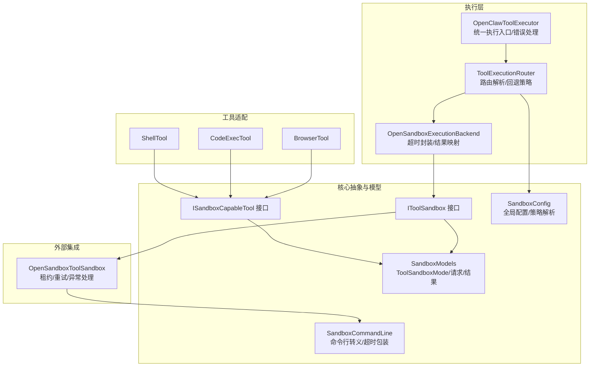
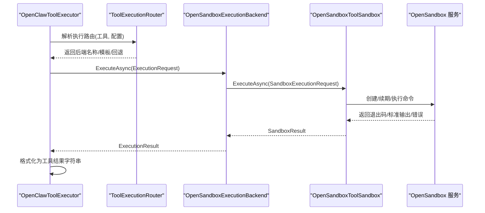
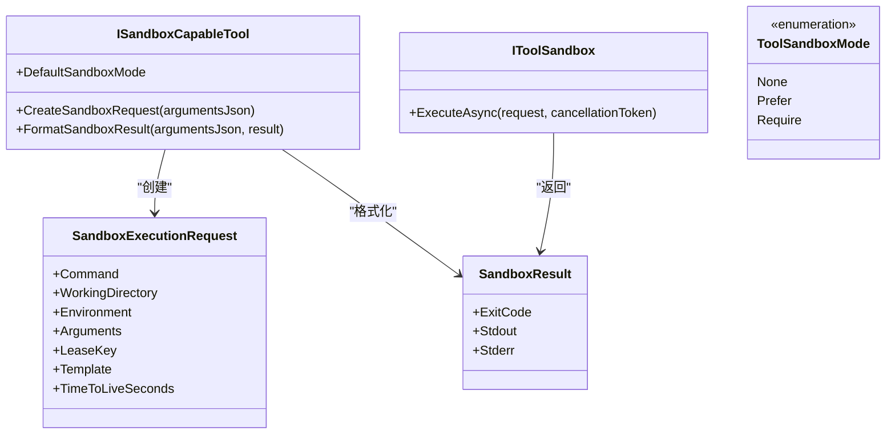
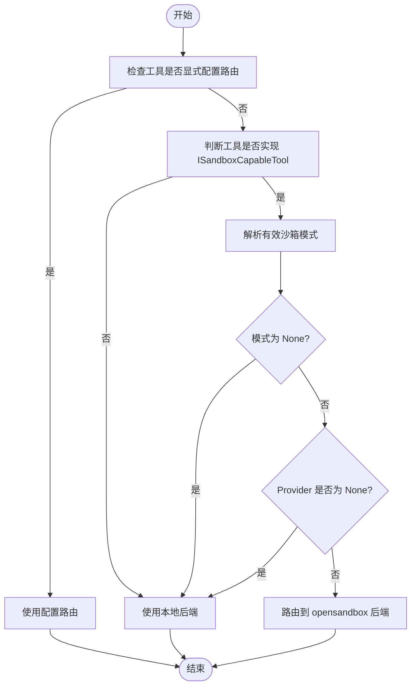
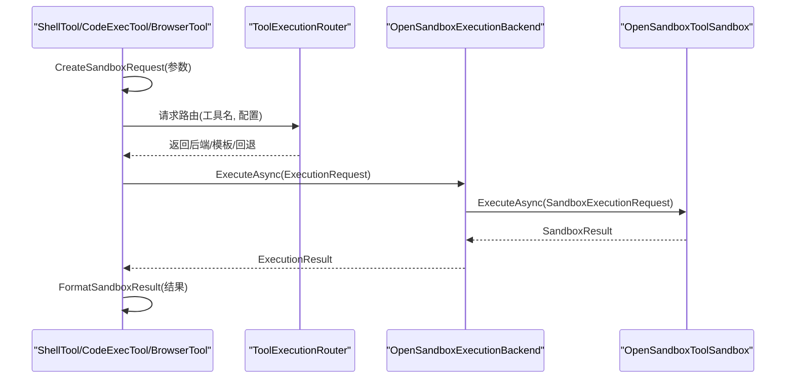
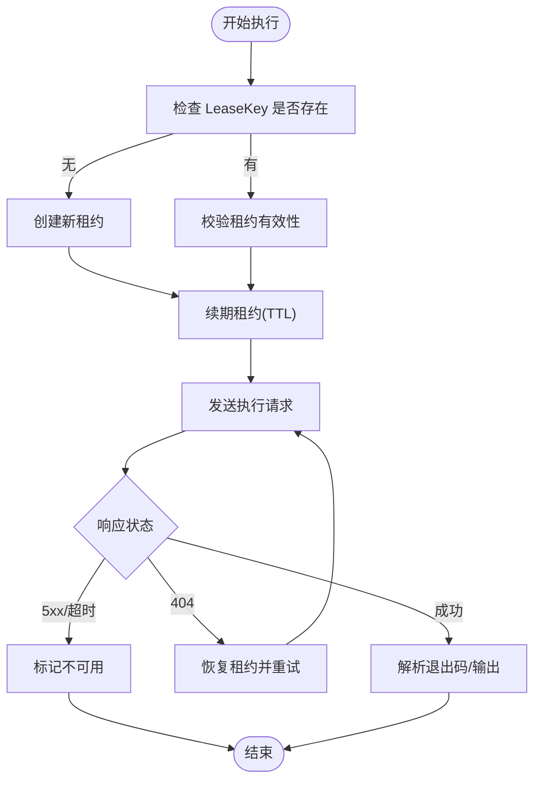
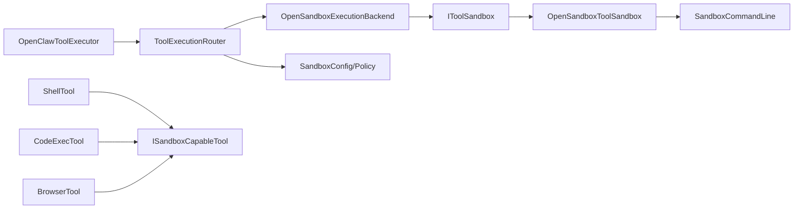

# 沙箱机制

<cite>
**本文引用的文件**
- [docs/sandboxing.md](file://docs/sandboxing.md)
- [src/OpenClaw.Agent/Execution/ToolExecutionRouter.cs](file://src/OpenClaw.Agent/Execution/ToolExecutionRouter.cs)
- [src/OpenClaw.Agent/Execution/OpenSandboxExecutionBackend.cs](file://src/OpenClaw.Agent/Execution/OpenSandboxExecutionBackend.cs)
- [src/OpenClaw.Agent/OpenClawToolExecutor.cs](file://src/OpenClaw.Agent/OpenClawToolExecutor.cs)
- [src/OpenClaw.Agent/Tools/ShellTool.cs](file://src/OpenClaw.Agent/Tools/ShellTool.cs)
- [src/OpenClaw.Agent/Tools/CodeExecTool.cs](file://src/OpenClaw.Agent/Tools/CodeExecTool.cs)
- [src/OpenClaw.Agent/Tools/BrowserTool.cs](file://src/OpenClaw.Agent/Tools/BrowserTool.cs)
- [src/OpenClaw.Core/Abstractions/ISandboxCapableTool.cs](file://src/OpenClaw.Core/Abstractions/ISandboxCapableTool.cs)
- [src/OpenClaw.Core/Abstractions/IToolSandbox.cs](file://src/OpenClaw.Core/Abstractions/IToolSandbox.cs)
- [src/OpenClaw.Core/Abstractions/ToolSandboxException.cs](file://src/OpenClaw.Core/Abstractions/ToolSandboxException.cs)
- [src/OpenClaw.Core/Models/SandboxModels.cs](file://src/OpenClaw.Core/Models/SandboxModels.cs)
- [src/OpenClaw.Core/Models/SandboxConfig.cs](file://src/OpenClaw.Core/Models/SandboxConfig.cs)
- [src/OpenClaw.Core/Models/SandboxCommandLine.cs](file://src/OpenClaw.Core/Models/SandboxCommandLine.cs)
- [src/OpenClawNet.Sandbox.OpenSandbox/OpenSandboxToolSandbox.cs](file://src/OpenClawNet.Sandbox.OpenSandbox/OpenSandboxToolSandbox.cs)
</cite>

## 目录
1. [简介](#简介)
2. [项目结构](#项目结构)
3. [核心组件](#核心组件)
4. [架构总览](#架构总览)
5. [详细组件分析](#详细组件分析)
6. [依赖关系分析](#依赖关系分析)
7. [性能考量](#性能考量)
8. [故障排除指南](#故障排除指南)
9. [结论](#结论)
10. [附录](#附录)

## 简介
本文件系统性阐述 OpenClaw.NET 的可选沙箱执行机制，重点覆盖安全隔离原理、实现方式与配置选项；详细说明沙箱接口设计、安全策略、资源限制、网络访问控制、文件系统隔离、进程隔离等核心能力；并提供沙箱模式选择（强制、优先、禁用）、沙箱请求构建、结果格式化、错误处理与性能优化建议。同时给出沙箱工具开发指南、安全最佳实践与故障排除方法。

## 项目结构
围绕沙箱机制的关键代码分布在以下模块：
- 核心抽象与模型：定义沙箱接口、模式枚举、请求/结果模型与策略解析器
- 执行路由与后端：根据工具与配置选择本地或 OpenSandbox 后端执行
- 工具适配：实现 ISandboxCapableTool 的高风险原生工具（shell、code_exec、browser）
- OpenSandbox 集成：通过 IToolSandbox 实现对外部沙箱服务的调用与租约管理
- 文档与配置：提供默认配置示例、构建启用方式与操作注意事项

**图表来源**
- [src/OpenClaw.Agent/Execution/ToolExecutionRouter.cs:65-112](file://src/OpenClaw.Agent/Execution/ToolExecutionRouter.cs#L65-L112)
- [src/OpenClaw.Agent/Execution/OpenSandboxExecutionBackend.cs:22-67](file://src/OpenClaw.Agent/Execution/OpenSandboxExecutionBackend.cs#L22-L67)
- [src/OpenClaw.Agent/OpenClawToolExecutor.cs:899-953](file://src/OpenClaw.Agent/OpenClawToolExecutor.cs#L899-L953)
- [src/OpenClaw.Agent/Tools/ShellTool.cs:87-113](file://src/OpenClaw.Agent/Tools/ShellTool.cs#L87-L113)
- [src/OpenClaw.Agent/Tools/CodeExecTool.cs:71-112](file://src/OpenClaw.Agent/Tools/CodeExecTool.cs#L71-L112)
- [src/OpenClaw.Agent/Tools/BrowserTool.cs:585-603](file://src/OpenClaw.Agent/Tools/BrowserTool.cs#L585-L603)
- [src/OpenClaw.Core/Abstractions/ISandboxCapableTool.cs:5-12](file://src/OpenClaw.Core/Abstractions/ISandboxCapableTool.cs#L5-L12)
- [src/OpenClaw.Core/Abstractions/IToolSandbox.cs:5-10](file://src/OpenClaw.Core/Abstractions/IToolSandbox.cs#L5-L10)
- [src/OpenClaw.Core/Models/SandboxModels.cs:3-28](file://src/OpenClaw.Core/Models/SandboxModels.cs#L3-L28)
- [src/OpenClaw.Core/Models/SandboxConfig.cs:3-46](file://src/OpenClaw.Core/Models/SandboxConfig.cs#L3-L46)
- [src/OpenClaw.Core/Models/SandboxCommandLine.cs:5-33](file://src/OpenClaw.Core/Models/SandboxCommandLine.cs#L5-L33)
- [src/OpenClawNet.Sandbox.OpenSandbox/OpenSandboxToolSandbox.cs:48-81](file://src/OpenClawNet.Sandbox.OpenSandbox/OpenSandboxToolSandbox.cs#L48-L81)

**章节来源**
- [docs/sandboxing.md:1-264](file://docs/sandboxing.md#L1-L264)

## 核心组件
- 沙箱接口与契约
  - ISandboxCapableTool：声明默认沙箱模式、创建沙箱请求、格式化沙箱结果
  - IToolSandbox：对外部沙箱服务的统一执行接口
- 数据模型与策略
  - ToolSandboxMode：None/Prefer/Require 三种模式
  - SandboxExecutionRequest/SandboxResult：跨边界传输的请求与结果载体
  - SandboxConfig/ToolSandboxPolicy：全局与工具级配置解析、模板与 TTL 解析、模式决策
  - SandboxCommandLine：命令行参数转义与超时包装
- 执行路由与后端
  - ToolExecutionRouter：基于配置与工具能力解析执行路径，支持回退后端
  - OpenSandboxExecutionBackend：对 IToolSandbox 的执行封装，含超时控制
- 工具适配
  - ShellTool/CodeExecTool/BrowserTool：实现 ISandboxCapableTool，负责将工具参数转换为沙箱请求，并格式化输出
- 外部集成
  - OpenSandboxToolSandbox：与 OpenSandbox 服务交互，管理租约生命周期、重试与异常分类

**章节来源**
- [src/OpenClaw.Core/Abstractions/ISandboxCapableTool.cs:5-12](file://src/OpenClaw.Core/Abstractions/ISandboxCapableTool.cs#L5-L12)
- [src/OpenClaw.Core/Abstractions/IToolSandbox.cs:5-10](file://src/OpenClaw.Core/Abstractions/IToolSandbox.cs#L5-L10)
- [src/OpenClaw.Core/Models/SandboxModels.cs:3-28](file://src/OpenClaw.Core/Models/SandboxModels.cs#L3-L28)
- [src/OpenClaw.Core/Models/SandboxConfig.cs:3-168](file://src/OpenClaw.Core/Models/SandboxConfig.cs#L3-L168)
- [src/OpenClaw.Core/Models/SandboxCommandLine.cs:5-33](file://src/OpenClaw.Core/Models/SandboxCommandLine.cs#L5-L33)
- [src/OpenClaw.Agent/Execution/ToolExecutionRouter.cs:65-112](file://src/OpenClaw.Agent/Execution/ToolExecutionRouter.cs#L65-L112)
- [src/OpenClaw.Agent/Execution/OpenSandboxExecutionBackend.cs:22-67](file://src/OpenClaw.Agent/Execution/OpenSandboxExecutionBackend.cs#L22-L67)
- [src/OpenClaw.Agent/Tools/ShellTool.cs:87-113](file://src/OpenClaw.Agent/Tools/ShellTool.cs#L87-L113)
- [src/OpenClaw.Agent/Tools/CodeExecTool.cs:71-112](file://src/OpenClaw.Agent/Tools/CodeExecTool.cs#L71-L112)
- [src/OpenClaw.Agent/Tools/BrowserTool.cs:585-603](file://src/OpenClaw.Agent/Tools/BrowserTool.cs#L585-L603)
- [src/OpenClawNet.Sandbox.OpenSandbox/OpenSandboxToolSandbox.cs:48-81](file://src/OpenClawNet.Sandbox.OpenSandbox/OpenSandboxToolSandbox.cs#L48-L81)

## 架构总览
沙箱执行的整体流程如下：
- 工具选择与能力判定：OpenClawToolExecutor 判断工具是否实现 ISandboxCapableTool
- 模式解析：依据全局配置与工具默认值解析 Effective Mode（None/Prefer/Require）
- 路由决策：ToolExecutionRouter 基于配置与模式选择执行后端（local 或 opensandbox），必要时设置回退
- 执行封装：OpenSandboxExecutionBackend 将 ExecutionRequest 转换为 SandboxExecutionRequest 并调用 IToolSandbox
- 结果映射：将 SandboxResult 映射为工具可读的字符串输出

**图表来源**
- [src/OpenClaw.Agent/OpenClawToolExecutor.cs:899-953](file://src/OpenClaw.Agent/OpenClawToolExecutor.cs#L899-L953)
- [src/OpenClaw.Agent/Execution/ToolExecutionRouter.cs:114-157](file://src/OpenClaw.Agent/Execution/ToolExecutionRouter.cs#L114-L157)
- [src/OpenClaw.Agent/Execution/OpenSandboxExecutionBackend.cs:22-67](file://src/OpenClaw.Agent/Execution/OpenSandboxExecutionBackend.cs#L22-L67)
- [src/OpenClawNet.Sandbox.OpenSandbox/OpenSandboxToolSandbox.cs:48-81](file://src/OpenClawNet.Sandbox.OpenSandbox/OpenSandboxToolSandbox.cs#L48-L81)

## 详细组件分析

### 接口与数据模型
- ISandboxCapableTool
  - DefaultSandboxMode：工具默认沙箱模式
  - CreateSandboxRequest：将工具参数序列化为 SandboxExecutionRequest
  - FormatSandboxResult：将 SandboxResult 格式化为工具可读字符串
- IToolSandbox
  - ExecuteAsync：对外部沙箱服务发起执行请求
- SandboxExecutionRequest/SandboxResult
  - 包含命令、工作目录、环境变量、参数、租约键、模板、TTL 等关键字段
- ToolSandboxMode 与策略
  - None/Prefer/Require 三种模式
  - ResolveMode/ResolveTemplate/ResolveTimeToLiveSeconds 决策链
- SandboxCommandLine
  - 提供参数转义与超时包装，确保命令在受限环境中安全执行

**图表来源**
- [src/OpenClaw.Core/Abstractions/ISandboxCapableTool.cs:5-12](file://src/OpenClaw.Core/Abstractions/ISandboxCapableTool.cs#L5-L12)
- [src/OpenClaw.Core/Abstractions/IToolSandbox.cs:5-10](file://src/OpenClaw.Core/Abstractions/IToolSandbox.cs#L5-L10)
- [src/OpenClaw.Core/Models/SandboxModels.cs:10-26](file://src/OpenClaw.Core/Models/SandboxModels.cs#L10-L26)

**章节来源**
- [src/OpenClaw.Core/Abstractions/ISandboxCapableTool.cs:5-12](file://src/OpenClaw.Core/Abstractions/ISandboxCapableTool.cs#L5-L12)
- [src/OpenClaw.Core/Abstractions/IToolSandbox.cs:5-10](file://src/OpenClaw.Core/Abstractions/IToolSandbox.cs#L5-L10)
- [src/OpenClaw.Core/Models/SandboxModels.cs:3-28](file://src/OpenClaw.Core/Models/SandboxModels.cs#L3-L28)
- [src/OpenClaw.Core/Models/SandboxConfig.cs:48-167](file://src/OpenClaw.Core/Models/SandboxConfig.cs#L48-L167)
- [src/OpenClaw.Core/Models/SandboxCommandLine.cs:5-33](file://src/OpenClaw.Core/Models/SandboxCommandLine.cs#L5-L33)

### 执行路由与后端
- ToolExecutionRouter
  - 支持从配置中直接指定工具路由，否则根据工具能力与模式解析
  - 当工具实现 ISandboxCapableTool 且模式非 None 时，若 Provider 非 None，则路由到 opensandbox 后端
  - 支持回退后端（fallbackBackend）与本地回退开关
- OpenSandboxExecutionBackend
  - 对外暴露统一的 IExecutionBackend 接口
  - 将 ExecutionRequest 转换为 SandboxExecutionRequest 并调用 IToolSandbox
  - 统一封装超时控制与结果映射

**图表来源**
- [src/OpenClaw.Agent/Execution/ToolExecutionRouter.cs:65-112](file://src/OpenClaw.Agent/Execution/ToolExecutionRouter.cs#L65-L112)
- [src/OpenClaw.Agent/Execution/OpenSandboxExecutionBackend.cs:22-67](file://src/OpenClaw.Agent/Execution/OpenSandboxExecutionBackend.cs#L22-L67)

**章节来源**
- [src/OpenClaw.Agent/Execution/ToolExecutionRouter.cs:65-112](file://src/OpenClaw.Agent/Execution/ToolExecutionRouter.cs#L65-L112)
- [src/OpenClaw.Agent/Execution/OpenSandboxExecutionBackend.cs:22-67](file://src/OpenClaw.Agent/Execution/OpenSandboxExecutionBackend.cs#L22-L67)

### 工具适配：请求构建与结果格式化
- ShellTool
  - CreateSandboxRequest：将命令包装为 /bin/sh -lc，并通过 SandboxCommandLine.WrapWithTimeout 添加超时
  - FormatSandboxResult：根据退出码与输出流拼接结果字符串
- CodeExecTool
  - CreateSandboxRequest：根据语言选择解释器与参数，同样通过超时包装
  - FormatSandboxResult：分别输出 stdout/stderr，并包含退出码
- BrowserTool
  - CreateSandboxRequest：生成 Node 运行时脚本，携带动作与参数
  - FormatSandboxResult：根据退出码与错误信息返回用户可读消息

**图表来源**
- [src/OpenClaw.Agent/Tools/ShellTool.cs:87-113](file://src/OpenClaw.Agent/Tools/ShellTool.cs#L87-L113)
- [src/OpenClaw.Agent/Tools/CodeExecTool.cs:71-112](file://src/OpenClaw.Agent/Tools/CodeExecTool.cs#L71-L112)
- [src/OpenClaw.Agent/Tools/BrowserTool.cs:585-603](file://src/OpenClaw.Agent/Tools/BrowserTool.cs#L585-L603)
- [src/OpenClaw.Agent/Execution/ToolExecutionRouter.cs:114-157](file://src/OpenClaw.Agent/Execution/ToolExecutionRouter.cs#L114-L157)
- [src/OpenClaw.Agent/Execution/OpenSandboxExecutionBackend.cs:22-67](file://src/OpenClaw.Agent/Execution/OpenSandboxExecutionBackend.cs#L22-L67)
- [src/OpenClawNet.Sandbox.OpenSandbox/OpenSandboxToolSandbox.cs:48-81](file://src/OpenClawNet.Sandbox.OpenSandbox/OpenSandboxToolSandbox.cs#L48-L81)

**章节来源**
- [src/OpenClaw.Agent/Tools/ShellTool.cs:87-113](file://src/OpenClaw.Agent/Tools/ShellTool.cs#L87-L113)
- [src/OpenClaw.Agent/Tools/CodeExecTool.cs:71-112](file://src/OpenClaw.Agent/Tools/CodeExecTool.cs#L71-L112)
- [src/OpenClaw.Agent/Tools/BrowserTool.cs:585-603](file://src/OpenClaw.Agent/Tools/BrowserTool.cs#L585-L603)

### 外部集成：OpenSandbox 工具沙箱
- 租约管理
  - 通过 LeaseKey 复用租约，避免重复创建
  - 定期续期与过期清理，缺失租约时自动恢复
- 命令执行
  - 将环境变量导出、工作目录切换与命令组合为单条 shell 命令
  - 使用超时包装确保执行时限
- 异常处理
  - 4xx 错误抛出 ToolSandboxException
  - 5xx 或不可达抛出 ToolSandboxUnavailableException
  - 缺失租约进行恢复重试

**图表来源**
- [src/OpenClawNet.Sandbox.OpenSandbox/OpenSandboxToolSandbox.cs:108-146](file://src/OpenClawNet.Sandbox.OpenSandbox/OpenSandboxToolSandbox.cs#L108-L146)
- [src/OpenClawNet.Sandbox.OpenSandbox/OpenSandboxToolSandbox.cs:148-175](file://src/OpenClawNet.Sandbox.OpenSandbox/OpenSandboxToolSandbox.cs#L148-L175)
- [src/OpenClawNet.Sandbox.OpenSandbox/OpenSandboxToolSandbox.cs:214-241](file://src/OpenClawNet.Sandbox.OpenSandbox/OpenSandboxToolSandbox.cs#L214-L241)
- [src/OpenClawNet.Sandbox.OpenSandbox/OpenSandboxToolSandbox.cs:321-350](file://src/OpenClawNet.Sandbox.OpenSandbox/OpenSandboxToolSandbox.cs#L321-L350)

**章节来源**
- [src/OpenClawNet.Sandbox.OpenSandbox/OpenSandboxToolSandbox.cs:48-81](file://src/OpenClawNet.Sandbox.OpenSandbox/OpenSandboxToolSandbox.cs#L48-L81)
- [src/OpenClawNet.Sandbox.OpenSandbox/OpenSandboxToolSandbox.cs:108-146](file://src/OpenClawNet.Sandbox.OpenSandbox/OpenSandboxToolSandbox.cs#L108-L146)
- [src/OpenClawNet.Sandbox.OpenSandbox/OpenSandboxToolSandbox.cs:148-175](file://src/OpenClawNet.Sandbox.OpenSandbox/OpenSandboxToolSandbox.cs#L148-L175)
- [src/OpenClawNet.Sandbox.OpenSandbox/OpenSandboxToolSandbox.cs:214-241](file://src/OpenClawNet.Sandbox.OpenSandbox/OpenSandboxToolSandbox.cs#L214-L241)
- [src/OpenClawNet.Sandbox.OpenSandbox/OpenSandboxToolSandbox.cs:321-350](file://src/OpenClawNet.Sandbox.OpenSandbox/OpenSandboxToolSandbox.cs#L321-L350)

## 依赖关系分析
- 松耦合设计
  - 工具仅依赖 ISandboxCapableTool 抽象，不关心具体后端实现
  - 执行路由与后端解耦，便于扩展其他沙箱提供商
- 关键依赖链
  - OpenClawToolExecutor → ToolExecutionRouter → OpenSandboxExecutionBackend → IToolSandbox → OpenSandboxToolSandbox
  - 工具 → ISandboxCapableTool → SandboxExecutionRequest
  - OpenSandboxToolSandbox → SandboxCommandLine

**图表来源**
- [src/OpenClaw.Agent/OpenClawToolExecutor.cs:899-953](file://src/OpenClaw.Agent/OpenClawToolExecutor.cs#L899-L953)
- [src/OpenClaw.Agent/Execution/ToolExecutionRouter.cs:65-112](file://src/OpenClaw.Agent/Execution/ToolExecutionRouter.cs#L65-L112)
- [src/OpenClaw.Agent/Execution/OpenSandboxExecutionBackend.cs:22-67](file://src/OpenClaw.Agent/Execution/OpenSandboxExecutionBackend.cs#L22-L67)
- [src/OpenClaw.Core/Abstractions/ISandboxCapableTool.cs:5-12](file://src/OpenClaw.Core/Abstractions/ISandboxCapableTool.cs#L5-L12)
- [src/OpenClaw.Core/Models/SandboxConfig.cs:48-167](file://src/OpenClaw.Core/Models/SandboxConfig.cs#L48-L167)
- [src/OpenClaw.Core/Models/SandboxCommandLine.cs:5-33](file://src/OpenClaw.Core/Models/SandboxCommandLine.cs#L5-L33)
- [src/OpenClawNet.Sandbox.OpenSandbox/OpenSandboxToolSandbox.cs:48-81](file://src/OpenClawNet.Sandbox.OpenSandbox/OpenSandboxToolSandbox.cs#L48-L81)

**章节来源**
- [src/OpenClaw.Agent/OpenClawToolExecutor.cs:899-953](file://src/OpenClaw.Agent/OpenClawToolExecutor.cs#L899-L953)
- [src/OpenClaw.Agent/Execution/ToolExecutionRouter.cs:65-112](file://src/OpenClaw.Agent/Execution/ToolExecutionRouter.cs#L65-L112)
- [src/OpenClaw.Agent/Execution/OpenSandboxExecutionBackend.cs:22-67](file://src/OpenClaw.Agent/Execution/OpenSandboxExecutionBackend.cs#L22-L67)
- [src/OpenClaw.Core/Abstractions/ISandboxCapableTool.cs:5-12](file://src/OpenClaw.Core/Abstractions/ISandboxCapableTool.cs#L5-L12)
- [src/OpenClaw.Core/Models/SandboxConfig.cs:48-167](file://src/OpenClaw.Core/Models/SandboxConfig.cs#L48-L167)
- [src/OpenClaw.Core/Models/SandboxCommandLine.cs:5-33](file://src/OpenClaw.Core/Models/SandboxCommandLine.cs#L5-L33)
- [src/OpenClawNet.Sandbox.OpenSandbox/OpenSandboxToolSandbox.cs:48-81](file://src/OpenClawNet.Sandbox.OpenSandbox/OpenSandboxToolSandbox.cs#L48-L81)

## 性能考量
- 租约复用与续期
  - 通过 LeaseKey 复用租约，减少创建/销毁开销
  - 定期续期避免超时导致的失败重试
- 超时与输出截断
  - 命令执行采用超时包装，防止长时间阻塞
  - 输出流设置上限，避免内存膨胀
- 回退策略
  - 在 Provider 不可用或 Reachable 时，按需回退到本地执行（受配置与模式约束）

**章节来源**
- [src/OpenClawNet.Sandbox.OpenSandbox/OpenSandboxToolSandbox.cs:148-175](file://src/OpenClawNet.Sandbox.OpenSandbox/OpenSandboxToolSandbox.cs#L148-L175)
- [src/OpenClawNet.Sandbox.OpenSandbox/OpenSandboxToolSandbox.cs:214-241](file://src/OpenClawNet.Sandbox.OpenSandbox/OpenSandboxToolSandbox.cs#L214-L241)
- [src/OpenClaw.Agent/Tools/ShellTool.cs:22-84](file://src/OpenClaw.Agent/Tools/ShellTool.cs#L22-L84)
- [src/OpenClaw.Agent/Tools/CodeExecTool.cs:56-258](file://src/OpenClaw.Agent/Tools/CodeExecTool.cs#L56-L258)

## 故障排除指南
- 常见异常类型
  - ToolSandboxException：沙箱侧业务错误（如参数非法、4xx）
  - ToolSandboxUnavailableException：沙箱服务不可达或 5xx
- 错误分类与回退
  - 当 Provider 不可用或后端不可用时，根据模式与回退配置决定是否回退到本地
  - Require 模式下不可回退，直接报错
- 定位步骤
  - 检查全局配置 Provider 与工具级模式
  - 确认 OpenSandbox 服务可达与鉴权配置
  - 查看租约状态与续期日志
  - 核对命令行转义与超时设置

**章节来源**
- [src/OpenClaw.Core/Abstractions/ToolSandboxException.cs:3-28](file://src/OpenClaw.Core/Abstractions/ToolSandboxException.cs#L3-L28)
- [src/OpenClaw.Agent/OpenClawToolExecutor.cs:498-527](file://src/OpenClaw.Agent/OpenClawToolExecutor.cs#L498-L527)
- [src/OpenClaw.Agent/OpenClawToolExecutor.cs:932-953](file://src/OpenClaw.Agent/OpenClawToolExecutor.cs#L932-L953)
- [src/OpenClawNet.Sandbox.OpenSandbox/OpenSandboxToolSandbox.cs:321-350](file://src/OpenClawNet.Sandbox.OpenSandbox/OpenSandboxToolSandbox.cs#L321-L350)

## 结论
该沙箱机制以清晰的接口抽象与策略解析为核心，结合 OpenSandbox 的租约与执行能力，实现了对高风险原生工具的安全隔离与可控执行。通过模式选择、模板与 TTL 配置、超时与输出限制、以及完善的错误处理与回退策略，既满足了生产环境的安全要求，也兼顾了性能与可观测性。

## 附录

### 沙箱模式与配置要点
- 模式选择
  - None：不使用沙箱
  - Prefer：可用时走沙箱，否则回退本地
  - Require：必须走沙箱，不可回退
- 全局配置项
  - Provider：当前支持 OpenSandbox 或 None
  - Endpoint/ApiKey：服务端点与鉴权
  - DefaultTTL：默认租期（秒）
  - Tools.*.Mode/Template/TTL：工具级覆盖
- 构建启用
  - 通过编译参数开启 OpenSandbox 集成

**章节来源**
- [docs/sandboxing.md:55-141](file://docs/sandboxing.md#L55-L141)
- [src/OpenClaw.Core/Models/SandboxConfig.cs:3-46](file://src/OpenClaw.Core/Models/SandboxConfig.cs#L3-L46)

### 安全最佳实践
- 默认 Prefer，严格场景使用 Require
- 为不同工具选择合适的容器镜像模板，最小权限原则
- 合理设置 TTL 与超时，避免资源泄露
- 对外暴露的绑定建议配合 Require 模式并通过网关加固检查

**章节来源**
- [docs/sandboxing.md:142-151](file://docs/sandboxing.md#L142-L151)

### 开发者指南：实现 ISandboxCapableTool
- 明确 DefaultSandboxMode
- CreateSandboxRequest 中完成参数解析与命令组装，必要时使用 SandboxCommandLine
- FormatSandboxResult 输出统一格式，包含退出码与关键错误信息
- 注意环境变量命名合法性与工作目录切换

**章节来源**
- [src/OpenClaw.Core/Abstractions/ISandboxCapableTool.cs:5-12](file://src/OpenClaw.Core/Abstractions/ISandboxCapableTool.cs#L5-L12)
- [src/OpenClaw.Core/Models/SandboxCommandLine.cs:5-33](file://src/OpenClaw.Core/Models/SandboxCommandLine.cs#L5-L33)
- [src/OpenClaw.Agent/Tools/ShellTool.cs:87-113](file://src/OpenClaw.Agent/Tools/ShellTool.cs#L87-L113)
- [src/OpenClaw.Agent/Tools/CodeExecTool.cs:71-112](file://src/OpenClaw.Agent/Tools/CodeExecTool.cs#L71-L112)
- [src/OpenClaw.Agent/Tools/BrowserTool.cs:585-603](file://src/OpenClaw.Agent/Tools/BrowserTool.cs#L585-L603)