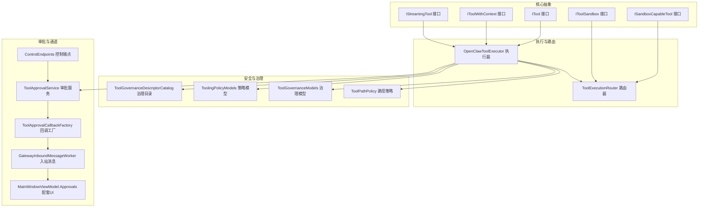
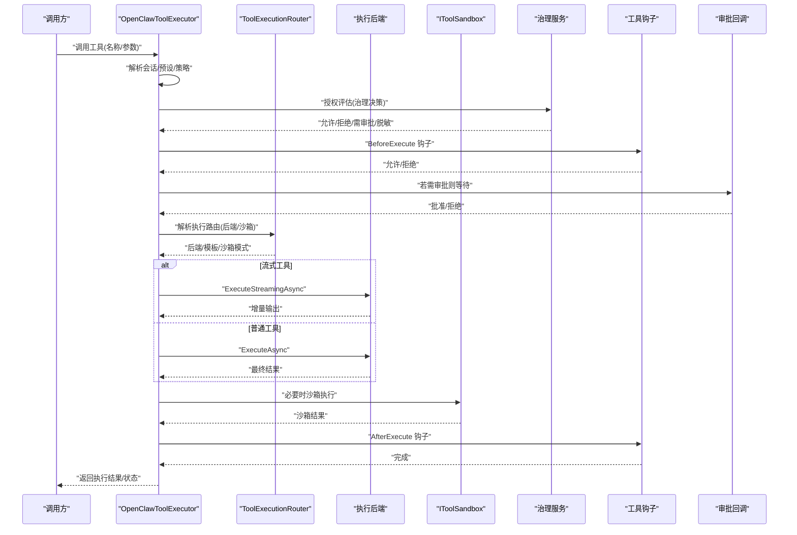
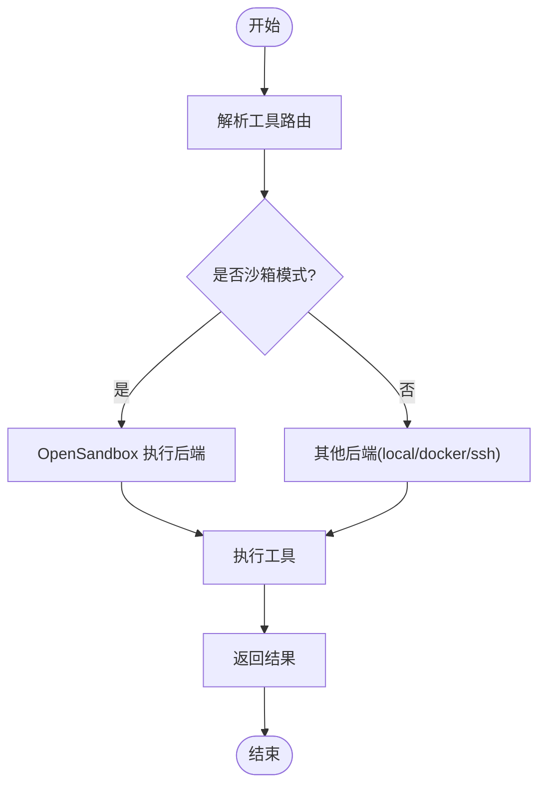
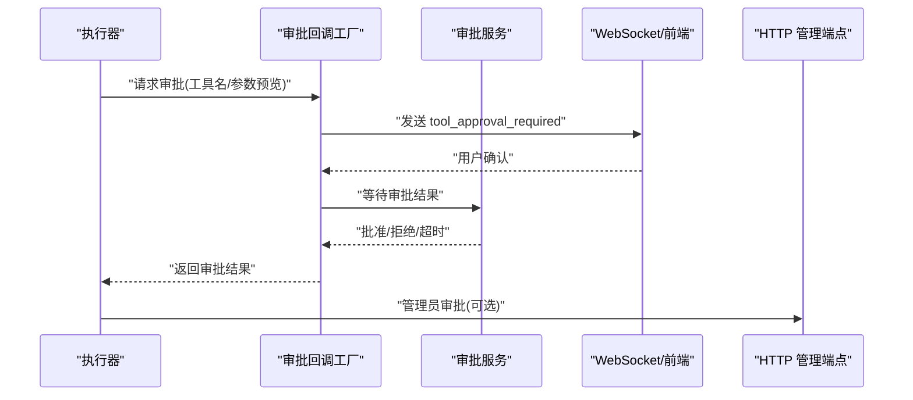
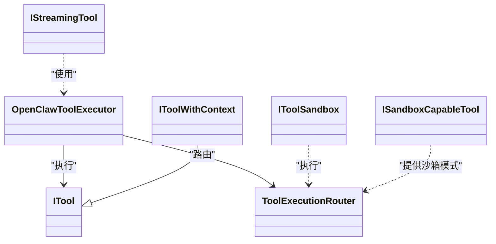

# 自定义工具开发

<cite>
**本文引用的文件**
- [ITool.cs](file://src/OpenClaw.Core/Abstractions/ITool.cs)
- [IToolWithContext.cs](file://src/OpenClaw.Core/Abstractions/IToolWithContext.cs)
- [IStreamingTool.cs](file://src/OpenClaw.Core/Abstractions/IStreamingTool.cs)
- [IToolSandbox.cs](file://src/OpenClaw.Core/Abstractions/IToolSandbox.cs)
- [ISandboxCapableTool.cs](file://src/OpenClaw.Core/Abstractions/ISandboxCapableTool.cs)
- [ToolExecutionRouter.cs](file://src/OpenClaw.Agent/Execution/ToolExecutionRouter.cs)
- [OpenClawToolExecutor.cs](file://src/OpenClaw.Agent/OpenClawToolExecutor.cs)
- [ToolGovernanceDescriptorCatalog.cs](file://src/OpenClaw.Core/Governance/ToolGovernanceDescriptorCatalog.cs)
- [ToolingPolicyModels.cs](file://src/OpenClaw.Core/Models/ToolingPolicyModels.cs)
- [ToolGovernanceModels.cs](file://src/OpenClaw.Core/Models/ToolGovernanceModels.cs)
- [ToolPathPolicy.cs](file://src/OpenClaw.Core/Security/ToolPathPolicy.cs)
- [TOOLS_GUIDE.md](file://docs/TOOLS_GUIDE.md)
- [ToolApprovalService.cs](file://src/OpenClaw.Core/Pipeline/ToolApprovalService.cs)
- [ToolApprovalCallbackFactory.cs](file://src/OpenClaw.Gateway/ToolApprovalCallbackFactory.cs)
- [GatewayInboundMessageWorker.cs](file://src/OpenClaw.Gateway/Extensions/GatewayInboundMessageWorker.cs)
- [MainWindowViewModel.Approvals.cs](file://src/OpenClaw.Companion/ViewModels/MainWindowViewModel.Approvals.cs)
- [ControlEndpoints.cs](file://src/OpenClaw.Gateway/Endpoints/ControlEndpoints.cs)
</cite>

## 目录
1. [简介](#简介)
2. [项目结构](#项目结构)
3. [核心组件](#核心组件)
4. [架构总览](#架构总览)
5. [详细组件分析](#详细组件分析)
6. [依赖关系分析](#依赖关系分析)
7. [性能考量](#性能考量)
8. [故障排查指南](#故障排查指南)
9. [结论](#结论)
10. [附录](#附录)

## 简介
本指南面向在 OpenClaw.NET 中开发与集成“自定义工具”的工程师，系统阐述工具接口规范（ITool、IToolWithContext、IStreamingTool）、执行与路由机制、参数校验与安全策略、流式响应、沙箱集成、权限控制与审批流程，并提供开发模板、测试方法、调试技巧与性能优化建议。

## 项目结构
围绕工具开发的关键代码分布在以下模块：
- 核心抽象层：定义工具接口与治理模型
- 执行层：工具执行器与执行路由
- 安全与治理：工具治理目录、策略模型、路径策略
- 审批与通道：审批服务、回调工厂、网关入站消息处理、配套 UI
- 文档与策略：工具使用指南与安全加固建议

**图表来源**
- [ITool.cs:1-17](file://src/OpenClaw.Core/Abstractions/ITool.cs#L1-L17)
- [IToolWithContext.cs:1-16](file://src/OpenClaw.Core/Abstractions/IToolWithContext.cs#L1-L16)
- [IStreamingTool.cs:1-11](file://src/OpenClaw.Core/Abstractions/IStreamingTool.cs#L1-L11)
- [IToolSandbox.cs:1-12](file://src/OpenClaw.Core/Abstractions/IToolSandbox.cs#L1-L12)
- [ISandboxCapableTool.cs:1-14](file://src/OpenClaw.Core/Abstractions/ISandboxCapableTool.cs#L1-L14)
- [OpenClawToolExecutor.cs:1-1059](file://src/OpenClaw.Agent/OpenClawToolExecutor.cs#L1-L1059)
- [ToolExecutionRouter.cs:1-253](file://src/OpenClaw.Agent/Execution/ToolExecutionRouter.cs#L1-L253)
- [ToolGovernanceDescriptorCatalog.cs:1-181](file://src/OpenClaw.Core/Governance/ToolGovernanceDescriptorCatalog.cs#L1-L181)
- [ToolingPolicyModels.cs:1-45](file://src/OpenClaw.Core/Models/ToolingPolicyModels.cs#L1-L45)
- [ToolGovernanceModels.cs:1-150](file://src/OpenClaw.Core/Models/ToolGovernanceModels.cs#L1-L150)
- [ToolPathPolicy.cs:1-136](file://src/OpenClaw.Core/Security/ToolPathPolicy.cs#L1-L136)
- [ToolApprovalService.cs:148-188](file://src/OpenClaw.Core/Pipeline/ToolApprovalService.cs#L148-L188)
- [ToolApprovalCallbackFactory.cs:120-153](file://src/OpenClaw.Gateway/ToolApprovalCallbackFactory.cs#L120-L153)
- [GatewayInboundMessageWorker.cs:524-545](file://src/OpenClaw.Gateway/Extensions/GatewayInboundMessageWorker.cs#L524-L545)
- [MainWindowViewModel.Approvals.cs:394-429](file://src/OpenClaw.Companion/ViewModels/MainWindowViewModel.Approvals.cs#L394-L429)
- [ControlEndpoints.cs:277-302](file://src/OpenClaw.Gateway/Endpoints/ControlEndpoints.cs#L277-L302)

**章节来源**
- [OpenClawToolExecutor.cs:1-1059](file://src/OpenClaw.Agent/OpenClawToolExecutor.cs#L1-L1059)
- [ToolExecutionRouter.cs:1-253](file://src/OpenClaw.Agent/Execution/ToolExecutionRouter.cs#L1-L253)
- [ToolGovernanceDescriptorCatalog.cs:1-181](file://src/OpenClaw.Core/Governance/ToolGovernanceDescriptorCatalog.cs#L1-L181)
- [ToolingPolicyModels.cs:1-45](file://src/OpenClaw.Core/Models/ToolingPolicyModels.cs#L1-L45)
- [ToolGovernanceModels.cs:1-150](file://src/OpenClaw.Core/Models/ToolGovernanceModels.cs#L1-L150)
- [ToolPathPolicy.cs:1-136](file://src/OpenClaw.Core/Security/ToolPathPolicy.cs#L1-L136)
- [ToolApprovalService.cs:148-188](file://src/OpenClaw.Core/Pipeline/ToolApprovalService.cs#L148-L188)
- [ToolApprovalCallbackFactory.cs:120-153](file://src/OpenClaw.Gateway/ToolApprovalCallbackFactory.cs#L120-L153)
- [GatewayInboundMessageWorker.cs:524-545](file://src/OpenClaw.Gateway/Extensions/GatewayInboundMessageWorker.cs#L524-L545)
- [MainWindowViewModel.Approvals.cs:394-429](file://src/OpenClaw.Companion/ViewModels/MainWindowViewModel.Approvals.cs#L394-L429)
- [ControlEndpoints.cs:277-302](file://src/OpenClaw.Gateway/Endpoints/ControlEndpoints.cs#L277-L302)

## 核心组件
- 工具接口族
  - ITool：最小化接口，提供名称、描述、参数 Schema 与异步执行入口，面向 AOT 剪枝优化。
  - IToolWithContext：在 ITool 基础上增加上下文参数，便于访问会话与轮次上下文。
  - IStreamingTool：可选接口，支持流式增量输出，适用于长时任务或实时反馈场景。
- 沙箱与执行
  - IToolSandbox：统一沙箱执行入口；ISandboxCapableTool：声明默认沙箱模式与请求构造能力。
  - ToolExecutionRouter：根据配置与工具能力解析执行后端（本地、Docker、SSH、OpenSandbox），并支持回退策略。
- 治理与策略
  - ToolGovernanceDescriptorCatalog：内置工具治理描述，结合动作描述动态提升风险等级与审批需求。
  - ToolingPolicyModels：工具集/预设配置模型，支持允许/拒绝工具集合与审批工具集。
  - ToolGovernanceModels：治理决策、上下文、结果与侧车交互模型。
- 安全与路径
  - ToolPathPolicy：文件系统读写路径白/黑名单策略（注释版本）。
- 审批与通道
  - ToolApprovalService：审批等待与决策结果管理。
  - ToolApprovalCallbackFactory：审批回调工厂，封装审批事件与等待逻辑。
  - GatewayInboundMessageWorker：在入站消息中触发审批事件（如 WebSocket envelope）。
  - UI 与控制端点：配套 UI 提供审批确认，HTTP 端点支持管理员审批与请求者匹配。

**章节来源**
- [ITool.cs:1-17](file://src/OpenClaw.Core/Abstractions/ITool.cs#L1-L17)
- [IToolWithContext.cs:1-16](file://src/OpenClaw.Core/Abstractions/IToolWithContext.cs#L1-L16)
- [IStreamingTool.cs:1-11](file://src/OpenClaw.Core/Abstractions/IStreamingTool.cs#L1-L11)
- [IToolSandbox.cs:1-12](file://src/OpenClaw.Core/Abstractions/IToolSandbox.cs#L1-L12)
- [ISandboxCapableTool.cs:1-14](file://src/OpenClaw.Core/Abstractions/ISandboxCapableTool.cs#L1-L14)
- [ToolExecutionRouter.cs:1-253](file://src/OpenClaw.Agent/Execution/ToolExecutionRouter.cs#L1-L253)
- [OpenClawToolExecutor.cs:1-1059](file://src/OpenClaw.Agent/OpenClawToolExecutor.cs#L1-L1059)
- [ToolGovernanceDescriptorCatalog.cs:1-181](file://src/OpenClaw.Core/Governance/ToolGovernanceDescriptorCatalog.cs#L1-L181)
- [ToolingPolicyModels.cs:1-45](file://src/OpenClaw.Core/Models/ToolingPolicyModels.cs#L1-L45)
- [ToolGovernanceModels.cs:1-150](file://src/OpenClaw.Core/Models/ToolGovernanceModels.cs#L1-L150)
- [ToolPathPolicy.cs:1-136](file://src/OpenClaw.Core/Security/ToolPathPolicy.cs#L1-L136)
- [ToolApprovalService.cs:148-188](file://src/OpenClaw.Core/Pipeline/ToolApprovalService.cs#L148-L188)
- [ToolApprovalCallbackFactory.cs:120-153](file://src/OpenClaw.Gateway/ToolApprovalCallbackFactory.cs#L120-L153)
- [GatewayInboundMessageWorker.cs:524-545](file://src/OpenClaw.Gateway/Extensions/GatewayInboundMessageWorker.cs#L524-L545)
- [MainWindowViewModel.Approvals.cs:394-429](file://src/OpenClaw.Companion/ViewModels/MainWindowViewModel.Approvals.cs#L394-L429)
- [ControlEndpoints.cs:277-302](file://src/OpenClaw.Gateway/Endpoints/ControlEndpoints.cs#L277-L302)

## 架构总览
下图展示从工具调用到执行、治理、审批与结果返回的完整链路。

**图表来源**
- [OpenClawToolExecutor.cs:134-630](file://src/OpenClaw.Agent/OpenClawToolExecutor.cs#L134-L630)
- [ToolExecutionRouter.cs:65-157](file://src/OpenClaw.Agent/Execution/ToolExecutionRouter.cs#L65-L157)
- [IToolSandbox.cs:1-12](file://src/OpenClaw.Core/Abstractions/IToolSandbox.cs#L1-L12)
- [ToolGovernanceDescriptorCatalog.cs:12-32](file://src/OpenClaw.Core/Governance/ToolGovernanceDescriptorCatalog.cs#L12-L32)
- [ToolApprovalService.cs:148-188](file://src/OpenClaw.Core/Pipeline/ToolApprovalService.cs#L148-L188)
- [ToolApprovalCallbackFactory.cs:120-153](file://src/OpenClaw.Gateway/ToolApprovalCallbackFactory.cs#L120-L153)

## 详细组件分析

### ITool 接口设计与实现要求
- 设计理念
  - 最小化以适配 AOT 剪枝，仅暴露名称、描述、参数 Schema 与执行入口。
  - 参数 Schema 使用 JSON Schema 描述，便于运行时校验与治理脱敏。
- 实现要点
  - Name/Description 必须稳定且语义清晰，作为治理与审批识别依据。
  - 参数校验应在 ExecuteAsync 内部进行，结合 ParameterSchema 与运行时输入。
  - 返回字符串结果应为序列化后的 JSON 或人类可读文本，避免泄露敏感信息。
- 错误处理
  - 对非法参数、越权操作、资源不可用等情况抛出明确异常，由执行器捕获并映射为失败码与提示。

**章节来源**
- [ITool.cs:1-17](file://src/OpenClaw.Core/Abstractions/ITool.cs#L1-L17)

### IToolWithContext 接口设计与实现要求
- 设计理念
  - 在 ITool 基础上注入 ToolExecutionContext，便于访问会话、轮次上下文与关联元数据。
- 实现要点
  - ExecuteAsync 的上下文参数用于权限判定、审计与策略解析。
  - 与 ITool 的 ExecuteAsync 重载保持兼容，优先使用带上下文的签名以获得更强的治理能力。

**章节来源**
- [IToolWithContext.cs:1-16](file://src/OpenClaw.Core/Abstractions/IToolWithContext.cs#L1-L16)

### IStreamingTool 接口设计与实现要求
- 设计理念
  - 支持流式增量输出，适合长时任务或需要实时反馈的工具。
- 实现要点
  - ExecuteStreamingAsync 返回 IAsyncEnumerable<string>，每次产生增量片段。
  - 执行器在 onDelta 回调中收集与转发增量，注意超时与背压控制。
- 性能与体验
  - 合理拆分输出片段，避免单片过大；确保在取消令牌下及时退出。

**章节来源**
- [IStreamingTool.cs:1-11](file://src/OpenClaw.Core/Abstractions/IStreamingTool.cs#L1-L11)
- [OpenClawToolExecutor.cs:786-800](file://src/OpenClaw.Agent/OpenClawToolExecutor.cs#L786-L800)

### 工具注册流程与生命周期
- 注册阶段
  - 将 ITool 实例加入执行器内部字典，生成工具声明列表，供会话按预设筛选。
- 热重载
  - 支持原子替换 MCP 工具，不影响进行中的请求。
- 生命周期
  - 工具实例由容器管理，注册表负责资源释放与重复注册处理。

**章节来源**
- [OpenClawToolExecutor.cs:119-132](file://src/OpenClaw.Agent/OpenClawToolExecutor.cs#L119-L132)

### 参数验证与脱敏
- 参数 Schema
  - 通过 ITool.ParameterSchema 提供 JSON Schema，执行器在治理阶段可进行脱敏与替换。
- 动作描述
  - 若工具实现 IToolActionDescriptorProvider，则根据参数动态解析是否变更、是否需审批与风险等级。
- 脱敏与替换
  - 治理服务可返回 RedactedArgumentsJson 或 ReplacementArgumentsJson，执行器在记录审计前应用。

**章节来源**
- [OpenClawToolExecutor.cs:198-266](file://src/OpenClaw.Agent/OpenClawToolExecutor.cs#L198-L266)
- [ToolGovernanceDescriptorCatalog.cs:12-32](file://src/OpenClaw.Core/Governance/ToolGovernanceDescriptorCatalog.cs#L12-L32)
- [ToolingPolicyModels.cs:35-44](file://src/OpenClaw.Core/Models/ToolingPolicyModels.cs#L35-L44)

### 错误处理与失败分类
- 失败分类
  - 超时、沙箱失败、运行时异常、治理拒绝/不可用等，分别映射不同失败码与提示。
- 失败处理
  - 执行器记录指标、审计日志与治理结果，保证可观测性与可追溯性。

**章节来源**
- [OpenClawToolExecutor.cs:483-530](file://src/OpenClaw.Agent/OpenClawToolExecutor.cs#L483-L530)
- [ToolGovernanceModels.cs:44-63](file://src/OpenClaw.Core/Models/ToolGovernanceModels.cs#L44-L63)

### 流式响应实现
- 流式工具
  - 实现 IStreamingTool 并在 ExecuteStreamingAsync 中产生增量输出。
- 收集与转发
  - 执行器在 onDelta 回调中收集片段，拼接为最终结果；注意最大长度限制与超时控制。

**章节来源**
- [OpenClawToolExecutor.cs:786-800](file://src/OpenClaw.Agent/OpenClawToolExecutor.cs#L786-L800)

### 沙箱集成与执行路由
- 路由解析
  - ToolExecutionRouter 根据工具名与配置解析后端（local/docker/ssh/opensandbox），并支持回退。
- 沙箱模式
  - ISandboxCapableTool 提供默认沙箱模式与请求构造；ToolExecutionRouter 结合策略决定是否启用 OpenSandbox。
- 执行后端
  - 不同后端负责隔离、工作区挂载、环境变量与模板渲染。

**图表来源**
- [ToolExecutionRouter.cs:65-112](file://src/OpenClaw.Agent/Execution/ToolExecutionRouter.cs#L65-L112)
- [ISandboxCapableTool.cs:5-12](file://src/OpenClaw.Core/Abstractions/ISandboxCapableTool.cs#L5-L12)
- [IToolSandbox.cs:5-10](file://src/OpenClaw.Core/Abstractions/IToolSandbox.cs#L5-L10)

**章节来源**
- [ToolExecutionRouter.cs:1-253](file://src/OpenClaw.Agent/Execution/ToolExecutionRouter.cs#L1-L253)
- [ISandboxCapableTool.cs:1-14](file://src/OpenClaw.Core/Abstractions/ISandboxCapableTool.cs#L1-L14)
- [IToolSandbox.cs:1-12](file://src/OpenClaw.Core/Abstractions/IToolSandbox.cs#L1-L12)

### 权限控制与策略配置
- 工具集与预设
  - ToolsetConfig/ToolPresetConfig 支持允许/拒绝工具集合与审批工具集，以及自治模式。
- 路径策略
  - ToolPathPolicy（注释版）提供路径白/黑名单与真实路径解析思路，可按需启用。
- 自治模式
  - 支持只读、监督、全开三种模式，逐步收紧权限。

**章节来源**
- [ToolingPolicyModels.cs:1-45](file://src/OpenClaw.Core/Models/ToolingPolicyModels.cs#L1-L45)
- [ToolPathPolicy.cs:1-136](file://src/OpenClaw.Core/Security/ToolPathPolicy.cs#L1-L136)
- [TOOLS_GUIDE.md:202-237](file://docs/TOOLS_GUIDE.md#L202-L237)

### 工具审批流程
- 触发条件
  - 治理决策要求审批、动作描述标记变更/需审批、或配置强制审批。
- 审批通道
  - WebSocket envelope、浏览器聊天界面、HTTP 管理端点。
- 决策与记录
  - ToolApprovalService 等待决策，回调工厂封装超时与记录，网关端点支持管理员审批与请求者匹配。

**图表来源**
- [OpenClawToolExecutor.cs:388-433](file://src/OpenClaw.Agent/OpenClawToolExecutor.cs#L388-L433)
- [ToolApprovalCallbackFactory.cs:120-153](file://src/OpenClaw.Gateway/ToolApprovalCallbackFactory.cs#L120-L153)
- [ToolApprovalService.cs:148-188](file://src/OpenClaw.Core/Pipeline/ToolApprovalService.cs#L148-L188)
- [GatewayInboundMessageWorker.cs:524-545](file://src/OpenClaw.Gateway/Extensions/GatewayInboundMessageWorker.cs#L524-L545)
- [MainWindowViewModel.Approvals.cs:394-429](file://src/OpenClaw.Companion/ViewModels/MainWindowViewModel.Approvals.cs#L394-L429)
- [ControlEndpoints.cs:277-302](file://src/OpenClaw.Gateway/Endpoints/ControlEndpoints.cs#L277-L302)

**章节来源**
- [OpenClawToolExecutor.cs:388-433](file://src/OpenClaw.Agent/OpenClawToolExecutor.cs#L388-L433)
- [ToolApprovalCallbackFactory.cs:120-153](file://src/OpenClaw.Gateway/ToolApprovalCallbackFactory.cs#L120-L153)
- [ToolApprovalService.cs:148-188](file://src/OpenClaw.Core/Pipeline/ToolApprovalService.cs#L148-L188)
- [GatewayInboundMessageWorker.cs:524-545](file://src/OpenClaw.Gateway/Extensions/GatewayInboundMessageWorker.cs#L524-L545)
- [MainWindowViewModel.Approvals.cs:394-429](file://src/OpenClaw.Companion/ViewModels/MainWindowViewModel.Approvals.cs#L394-L429)
- [ControlEndpoints.cs:277-302](file://src/OpenClaw.Gateway/Endpoints/ControlEndpoints.cs#L277-L302)

### 工具开发模板与最佳实践
- 开发模板
  - 实现 ITool（或 IToolWithContext），提供稳定的 Name/Description/ParameterSchema。
  - 如涉及变更类操作，实现 IToolActionDescriptorProvider 或在 ExecuteAsync 中基于参数动态解析。
  - 如需流式输出，实现 IStreamingTool。
  - 如需沙箱隔离，实现 ISandboxCapableTool 并提供默认沙箱模式与请求构造。
- 最佳实践
  - 参数校验前置，严格遵循 ParameterSchema。
  - 结果脱敏，避免泄露敏感字段；必要时使用治理服务替换参数。
  - 明确失败码与下一步建议，便于用户自助排障。
  - 为高风险工具设置审批要求，结合自治模式与路径策略。
  - 使用钩子进行审计与合规检查，确保可追溯。

**章节来源**
- [ITool.cs:1-17](file://src/OpenClaw.Core/Abstractions/ITool.cs#L1-L17)
- [IToolWithContext.cs:1-16](file://src/OpenClaw.Core/Abstractions/IToolWithContext.cs#L1-L16)
- [IStreamingTool.cs:1-11](file://src/OpenClaw.Core/Abstractions/IStreamingTool.cs#L1-L11)
- [ISandboxCapableTool.cs:1-14](file://src/OpenClaw.Core/Abstractions/ISandboxCapableTool.cs#L1-L14)
- [OpenClawToolExecutor.cs:198-305](file://src/OpenClaw.Agent/OpenClawToolExecutor.cs#L198-L305)
- [TOOLS_GUIDE.md:195-237](file://docs/TOOLS_GUIDE.md#L195-L237)

### 测试方法与调试技巧
- 单元测试
  - 使用测试桩模拟 ITool，断言 ExecuteAsync 行为与参数校验。
  - 对流式工具断言 ExecuteStreamingAsync 的增量输出顺序与总量。
- 集成测试
  - 通过 ToolExecutionRouter 解析路由，验证后端选择与回退逻辑。
  - 使用 ToolApprovalService 模拟审批等待，验证审批回调与超时处理。
- 调试技巧
  - 启用审计日志与治理结果记录，定位失败原因。
  - 使用治理侧车的 FailClosed/FailOpenReadOnlyLowRisk 策略验证边界行为。
  - 在 UI 中查看审批事件与历史，辅助复盘。

**章节来源**
- [OpenClawToolExecutor.cs:545-577](file://src/OpenClaw.Agent/OpenClawToolExecutor.cs#L545-L577)
- [ToolApprovalService.cs:148-188](file://src/OpenClaw.Core/Pipeline/ToolApprovalService.cs#L148-L188)
- [ToolExecutionRouter.cs:114-157](file://src/OpenClaw.Agent/Execution/ToolExecutionRouter.cs#L114-L157)

## 依赖关系分析
- 组件耦合
  - OpenClawToolExecutor 依赖 ITool、IToolWithContext、IStreamingTool、IToolSandbox、ToolExecutionRouter、治理与审批组件。
  - ToolExecutionRouter 依赖 IExecutionBackend 与 ISandboxCapableTool，耦合度适中。
- 外部依赖
  - 执行后端（本地/Docker/SSH/OpenSandbox）与治理侧车（HTTP）为外部集成点。
- 循环依赖
  - 当前结构未见循环依赖，接口分层清晰。

**图表来源**
- [ITool.cs:1-17](file://src/OpenClaw.Core/Abstractions/ITool.cs#L1-L17)
- [IToolWithContext.cs:1-16](file://src/OpenClaw.Core/Abstractions/IToolWithContext.cs#L1-L16)
- [IStreamingTool.cs:1-11](file://src/OpenClaw.Core/Abstractions/IStreamingTool.cs#L1-L11)
- [ISandboxCapableTool.cs:1-14](file://src/OpenClaw.Core/Abstractions/ISandboxCapableTool.cs#L1-L14)
- [IToolSandbox.cs:1-12](file://src/OpenClaw.Core/Abstractions/IToolSandbox.cs#L1-L12)
- [OpenClawToolExecutor.cs:1-100](file://src/OpenClaw.Agent/OpenClawToolExecutor.cs#L1-L100)
- [ToolExecutionRouter.cs:1-63](file://src/OpenClaw.Agent/Execution/ToolExecutionRouter.cs#L1-L63)

**章节来源**
- [OpenClawToolExecutor.cs:1-100](file://src/OpenClaw.Agent/OpenClawToolExecutor.cs#L1-L100)
- [ToolExecutionRouter.cs:1-63](file://src/OpenClaw.Agent/Execution/ToolExecutionRouter.cs#L1-L63)

## 性能考量
- 执行超时与并发
  - 合理设置 Tooling.ToolTimeoutSeconds，避免长时间阻塞；对流式工具注意背压与最大输出长度。
- 治理与钩子
  - 治理侧车与钩子可能引入额外延迟，建议在非关键路径使用，并开启失败快速路径。
- 沙箱与隔离
  - OpenSandbox 提升安全性但带来 IPC/隔离成本，仅对高风险工具启用。
- 指标与观测
  - 利用执行器记录的指标（失败数、超时数、耗时分布）持续优化工具实现与后端配置。

[本节为通用指导，无需特定文件来源]

## 故障排查指南
- 常见问题
  - 工具未知：检查工具名称与注册表一致性。
  - 被策略/预设阻止：核对会话预设与工具集配置。
  - 治理拒绝/不可用：查看治理侧车可用性与策略配置。
  - 审批超时：检查审批通道连通性与超时阈值。
  - 沙箱失败：检查 OpenSandbox 配置与模板。
- 审计与诊断
  - 查看工具审计日志与治理结果记录，定位失败原因与耗时瓶颈。
  - 使用治理侧车的 FailClosed/FailOpenReadOnlyLowRisk 策略验证边界行为。

**章节来源**
- [OpenClawToolExecutor.cs:545-577](file://src/OpenClaw.Agent/OpenClawToolExecutor.cs#L545-L577)
- [ToolGovernanceModels.cs:44-63](file://src/OpenClaw.Core/Models/ToolGovernanceModels.cs#L44-L63)
- [ToolApprovalService.cs:148-188](file://src/OpenClaw.Core/Pipeline/ToolApprovalService.cs#L148-L188)

## 结论
通过标准化的工具接口、完善的治理与审批体系、灵活的执行路由与沙箱集成，OpenClaw.NET 为自定义工具开发提供了安全、可观测、可扩展的基础设施。遵循本文的接口规范、开发模板与最佳实践，可高效构建高质量工具并融入整体自动化编排。

[本节为总结，无需特定文件来源]

## 附录
- 安全加固建议
  - 启用只读/监督/全开三种自治模式，逐步收紧权限。
  - 使用审批工具集与请求者匹配策略，降低误操作风险。
  - 严格路径策略与网络访问控制，限制工具作用域。
- 参考文档
  - 工具使用与安全加固指南：[TOOLS_GUIDE.md](file://docs/TOOLS_GUIDE.md)

**章节来源**
- [TOOLS_GUIDE.md:195-321](file://docs/TOOLS_GUIDE.md#L195-L321)