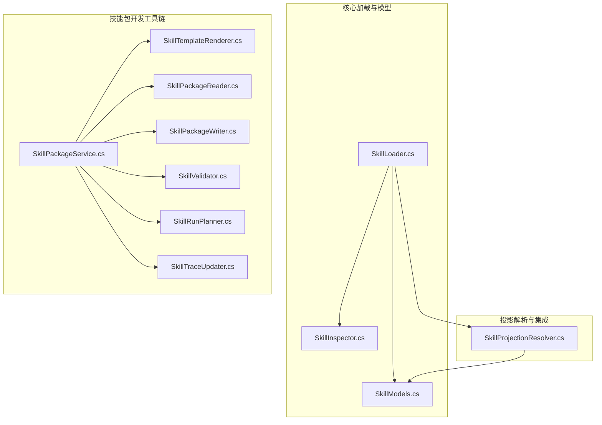
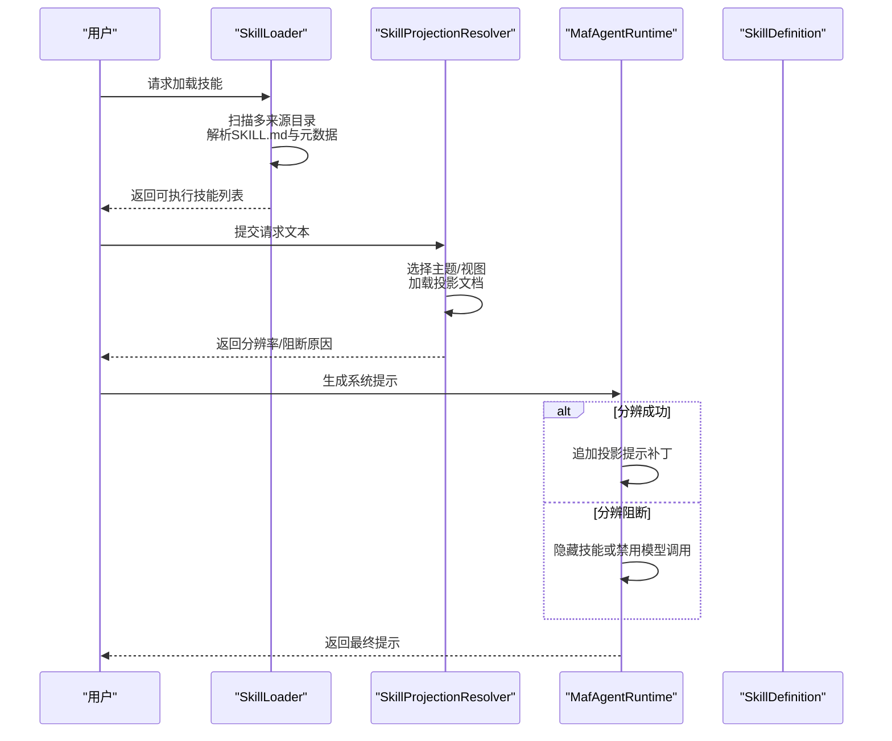
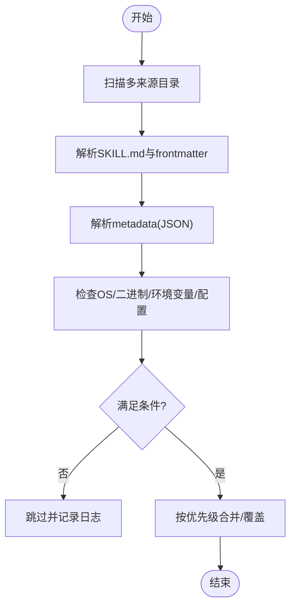
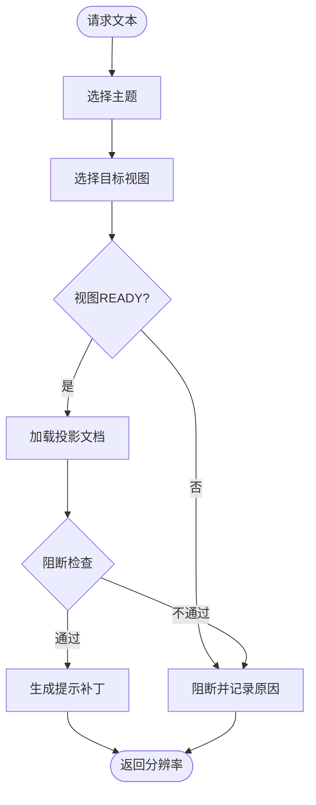
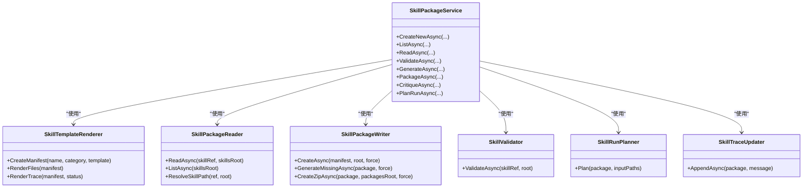
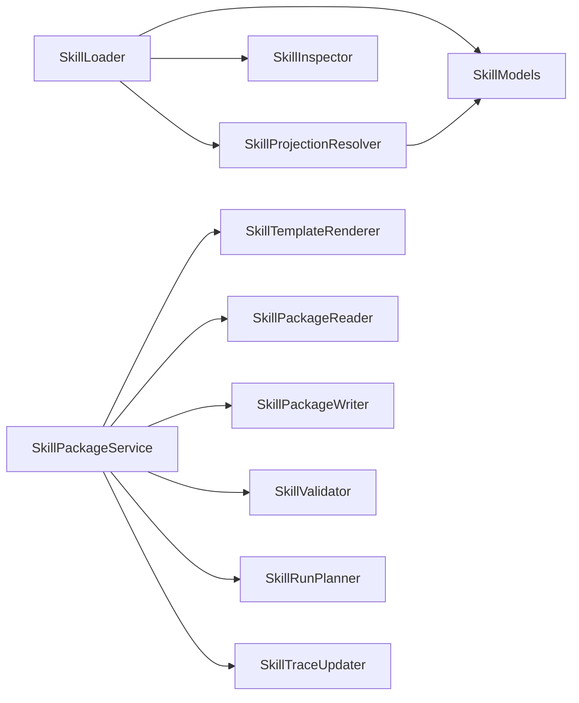

# 技能系统

<cite>
**本文引用的文件**
- [SkillLoader.cs](file://src/OpenClaw.Core/Skills/SkillLoader.cs)
- [SkillModels.cs](file://src/OpenClaw.Core/Skills/SkillModels.cs)
- [SkillInspector.cs](file://src/OpenClaw.Core/Skills/SkillInspector.cs)
- [SkillProjectionResolver.cs](file://src/OpenClaw.Core/Skills/SkillProjectionResolver.cs)
- [SkillKitModels.cs](file://src/OpenClaw.SkillKit.Abstractions/SkillKitModels.cs)
- [SkillTemplateRenderer.cs](file://src/OpenClaw.SkillKit/SkillTemplateRenderer.cs)
- [SkillPackageReader.cs](file://src/OpenClaw.SkillKit/SkillPackageReader.cs)
- [SkillPackageWriter.cs](file://src/OpenClaw.SkillKit/SkillPackageWriter.cs)
- [SkillPackageService.cs](file://src/OpenClaw.SkillKit/SkillPackageService.cs)
- [SkillValidator.cs](file://src/OpenClaw.SkillKit/SkillValidator.cs)
- [SkillRunPlanner.cs](file://src/OpenClaw.SkillKit/SkillRunPlanner.cs)
- [SkillTraceUpdater.cs](file://src/OpenClaw.SkillKit/SkillTraceUpdater.cs)
- [skill-projection-contracts-design.md](file://docs/skill-projection-contracts-design.md)
</cite>

## 目录
1. [简介](#简介)
2. [项目结构](#项目结构)
3. [核心组件](#核心组件)
4. [架构总览](#架构总览)
5. [详细组件分析](#详细组件分析)
6. [依赖关系分析](#依赖关系分析)
7. [性能考量](#性能考量)
8. [故障排查指南](#故障排查指南)
9. [结论](#结论)
10. [附录](#附录)

## 简介
本文件系统性阐述技能系统的架构设计、技能包格式、技能加载机制、技能开发工具链与模板系统；深入说明技能清单序列化、技能验证流程、技能投影机制与版本管理；并提供技能开发指南、最佳实践、调试技巧、性能优化与部署策略，辅以常见开发场景的解决方案。

## 项目结构
技能系统由“核心加载与模型”“投影解析与集成”“技能包开发工具链”三大子系统构成：
- 核心加载与模型：负责扫描技能目录、解析 SKILL.md、过滤与合并来源、构建技能定义与元数据。
- 投影解析与集成：在请求时刻基于投影合同进行主题与交付视图选择，生成提示补丁并影响技能可见性与指令。
- 技能包开发工具链：提供模板渲染、清单序列化、包读写、验证、打包、运行规划与变更追踪等能力。

**图表来源**
- [SkillLoader.cs:11-109](file://src/OpenClaw.Core/Skills/SkillLoader.cs#L11-L109)
- [SkillModels.cs:8-214](file://src/OpenClaw.Core/Skills/SkillModels.cs#L8-L214)
- [SkillInspector.cs:6-110](file://src/OpenClaw.Core/Skills/SkillInspector.cs#L6-L110)
- [SkillProjectionResolver.cs:10-613](file://src/OpenClaw.Core/Skills/SkillProjectionResolver.cs#L10-L613)
- [SkillTemplateRenderer.cs:6-363](file://src/OpenClaw.SkillKit/SkillTemplateRenderer.cs#L6-L363)
- [SkillPackageReader.cs:7-113](file://src/OpenClaw.SkillKit/SkillPackageReader.cs#L7-L113)
- [SkillPackageWriter.cs:7-77](file://src/OpenClaw.SkillKit/SkillPackageWriter.cs#L7-L77)
- [SkillPackageService.cs:6-76](file://src/OpenClaw.SkillKit/SkillPackageService.cs#L6-L76)
- [SkillValidator.cs:5-124](file://src/OpenClaw.SkillKit/SkillValidator.cs#L5-L124)
- [SkillRunPlanner.cs:5-25](file://src/OpenClaw.SkillKit/SkillRunPlanner.cs#L5-L25)
- [SkillTraceUpdater.cs:6-31](file://src/OpenClaw.SkillKit/SkillTraceUpdater.cs#L6-L31)

**章节来源**
- [SkillLoader.cs:11-109](file://src/OpenClaw.Core/Skills/SkillLoader.cs#L11-L109)
- [SkillModels.cs:8-214](file://src/OpenClaw.Core/Skills/SkillModels.cs#L8-L214)
- [SkillProjectionResolver.cs:10-613](file://src/OpenClaw.Core/Skills/SkillProjectionResolver.cs#L10-L613)
- [SkillTemplateRenderer.cs:6-363](file://src/OpenClaw.SkillKit/SkillTemplateRenderer.cs#L6-L363)
- [SkillPackageReader.cs:7-113](file://src/OpenClaw.SkillKit/SkillPackageReader.cs#L7-L113)
- [SkillPackageWriter.cs:7-77](file://src/OpenClaw.SkillKit/SkillPackageWriter.cs#L7-L77)
- [SkillPackageService.cs:6-76](file://src/OpenClaw.SkillKit/SkillPackageService.cs#L6-L76)
- [SkillValidator.cs:5-124](file://src/OpenClaw.SkillKit/SkillValidator.cs#L5-L124)
- [SkillRunPlanner.cs:5-25](file://src/OpenClaw.SkillKit/SkillRunPlanner.cs#L5-L25)
- [SkillTraceUpdater.cs:6-31](file://src/OpenClaw.SkillKit/SkillTraceUpdater.cs#L6-L31)

## 核心组件
- 技能配置与模型
  - SkillsConfig：顶层开关、加载策略、每技能覆盖项、最大资源读取字节等。
  - SkillDefinition/SkillMetadata/SkillResource：技能定义、元数据（OS/二进制/环境变量/配置/主环境变量/技能键）、资源清单。
  - SkillSource/SkillResourceKind：来源与资源类型。
- 技能加载器
  - LoadAll：按优先级扫描多来源目录，解析 SKILL.md，过滤允许列表、禁用项与需求门槛，返回可执行技能集合。
  - ParseSkillContent：解析 YAML 风格 frontmatter，填充指令、资源扫描、元数据 JSON 解析。
  - CheckRequirements：OS、PATH 二进制、任一二进制、环境变量（含配置注入与主环境变量）。
- 技能检查器
  - InspectPath/InspectInstalledRoot：定位 SKILL.md、解析定义、批量检查已安装根目录。
- 技能投影解析器
  - ResolveForRequest：按请求文本选择主题与目标视图，加载投影文档，执行阻断检查，生成分辨率与提示补丁。
  - BuildPromptPatch：将投影选择结果转为提示补丁片段。
- 技能包开发工具链
  - SkillTemplateRenderer：模板化清单与文档，内置多种模板配置。
  - SkillPackageReader/Writer：读取/创建/列举技能包，生成缺失文件，打包 ZIP。
  - SkillPackageService：组合渲染、读取、生成、验证、打包、评审、运行规划与变更追踪。
  - SkillValidator：校验清单、工作流、工具策略、政策一致性与文件完整性。
  - SkillRunPlanner：校验输入路径是否存在。
  - SkillTraceUpdater：向 trace.md 追加时间戳与变更记录。

**章节来源**
- [SkillModels.cs:8-214](file://src/OpenClaw.Core/Skills/SkillModels.cs#L8-L214)
- [SkillLoader.cs:17-109](file://src/OpenClaw.Core/Skills/SkillLoader.cs#L17-L109)
- [SkillLoader.cs:213-323](file://src/OpenClaw.Core/Skills/SkillLoader.cs#L213-L323)
- [SkillLoader.cs:441-493](file://src/OpenClaw.Core/Skills/SkillLoader.cs#L441-L493)
- [SkillInspector.cs:6-110](file://src/OpenClaw.Core/Skills/SkillInspector.cs#L6-L110)
- [SkillProjectionResolver.cs:12-67](file://src/OpenClaw.Core/Skills/SkillProjectionResolver.cs#L12-L67)
- [SkillProjectionResolver.cs:69-99](file://src/OpenClaw.Core/Skills/SkillProjectionResolver.cs#L69-L99)
- [SkillKitModels.cs:3-137](file://src/OpenClaw.SkillKit.Abstractions/SkillKitModels.cs#L3-L137)
- [SkillTemplateRenderer.cs:21-73](file://src/OpenClaw.SkillKit/SkillTemplateRenderer.cs#L21-L73)
- [SkillPackageReader.cs:9-31](file://src/OpenClaw.SkillKit/SkillPackageReader.cs#L9-L31)
- [SkillPackageReader.cs:33-64](file://src/OpenClaw.SkillKit/SkillPackageReader.cs#L33-L64)
- [SkillPackageWriter.cs:9-25](file://src/OpenClaw.SkillKit/SkillPackageWriter.cs#L9-L25)
- [SkillPackageWriter.cs:27-61](file://src/OpenClaw.SkillKit/SkillPackageWriter.cs#L27-L61)
- [SkillPackageService.cs:29-75](file://src/OpenClaw.SkillKit/SkillPackageService.cs#L29-L75)
- [SkillValidator.cs:7-78](file://src/OpenClaw.SkillKit/SkillValidator.cs#L7-L78)
- [SkillRunPlanner.cs:7-23](file://src/OpenClaw.SkillKit/SkillRunPlanner.cs#L7-L23)
- [SkillTraceUpdater.cs:8-20](file://src/OpenClaw.SkillKit/SkillTraceUpdater.cs#L8-L20)

## 架构总览
技能系统通过“加载—过滤—投影—提示增强—运行时路由”的流水线，将技能定义与投影合同无缝整合到运行时提示中，既保证技能可见性可控，又避免大体积上下文污染。

**图表来源**
- [SkillLoader.cs:17-109](file://src/OpenClaw.Core/Skills/SkillLoader.cs#L17-L109)
- [SkillProjectionResolver.cs:12-67](file://src/OpenClaw.Core/Skills/SkillProjectionResolver.cs#L12-L67)
- [skill-projection-contracts-design.md:196-216](file://docs/skill-projection-contracts-design.md#L196-L216)

**章节来源**
- [SkillLoader.cs:17-109](file://src/OpenClaw.Core/Skills/SkillLoader.cs#L17-L109)
- [SkillProjectionResolver.cs:12-67](file://src/OpenClaw.Core/Skills/SkillProjectionResolver.cs#L12-L67)
- [skill-projection-contracts-design.md:196-216](file://docs/skill-projection-contracts-design.md#L196-L216)

## 详细组件分析

### 技能加载与过滤（SkillLoader）
- 多源扫描与优先级
  - ExtraDirs → Bundled → Managed → Plugin → Workspace（最高优先级覆盖）
  - 支持工作区、托管、插件与额外目录的灵活组合
- SKILL.md 解析
  - YAML 风格 frontmatter 解析 name/description/metadata/user-invocable/disable-model-invocation/command-* 等
  - metadata JSON 解析 openclaw 字段（always/emoji/homepage/primaryEnv/skillKey/os/requires）
  - 指令中 {baseDir} 占位符替换为技能目录
  - 扫描 references/scripts 子目录，仅列出文件清单（不加载全文），用于模型按需拉取
- 过滤与要求
  - AllowBundled 白名单
  - 每技能 Entries.Enabled 覆盖
  - Always 忽略其他门槛
  - OS、PATH 二进制、任一二进制、环境变量（含配置注入与主环境变量）校验
  - 二进制查找带缓存，避免重复 IO
- 输出
  - 返回去重、覆盖后的可执行技能集合

**图表来源**
- [SkillLoader.cs:17-109](file://src/OpenClaw.Core/Skills/SkillLoader.cs#L17-L109)
- [SkillLoader.cs:213-323](file://src/OpenClaw.Core/Skills/SkillLoader.cs#L213-L323)
- [SkillLoader.cs:441-493](file://src/OpenClaw.Core/Skills/SkillLoader.cs#L441-L493)

**章节来源**
- [SkillLoader.cs:17-109](file://src/OpenClaw.Core/Skills/SkillLoader.cs#L17-L109)
- [SkillLoader.cs:213-323](file://src/OpenClaw.Core/Skills/SkillLoader.cs#L213-L323)
- [SkillLoader.cs:329-384](file://src/OpenClaw.Core/Skills/SkillLoader.cs#L329-L384)
- [SkillLoader.cs:441-493](file://src/OpenClaw.Core/Skills/SkillLoader.cs#L441-L493)

### 技能清单与序列化（SkillModels）
- SkillsConfig
  - Enabled、Load（ExtraDirs/IncludeBundled/IncludeManaged/ManagedRoot/IncludeWorkspace/Watch/WatchDebounceMs）
  - Entries（每技能覆盖：Enabled/ApiKey/Env/Config）
  - AllowBundled（仅捆绑技能白名单）
  - InstructionPrompt（系统提示模板占位符：{skills}/{load_instruction}/{resource_instruction}）
  - MaxResourceReadBytes（单次 read_skill_resource 返回上限，默认 256KB）
- SkillDefinition
  - Name/Description/Instructions/Location/Source/Metadata/UserInvocable/DisableModelInvocation
  - CommandDispatch/CommandTool/CommandArgMode
  - Resources（references/scripts 清单）
  - ProjectionContracts（投影合同集，kingcrab 扩展）
  - ArtifactContract（制品合同，kingcrab 扩展）
  - ProjectionDiscovery（投影发现诊断，kingcrab 扩展）
- SkillMetadata
  - Always/Emoji/Homepage/Os/RequireBins/RequireAnyBins/RequireEnv/RequireConfig/PrimaryEnv/SkillKey

**章节来源**
- [SkillModels.cs:8-214](file://src/OpenClaw.Core/Skills/SkillModels.cs#L8-L214)

### 技能检查与诊断（SkillInspector）
- TryLocateSkillRoot：在候选路径或其子树中定位唯一 SKILL.md 所在根
- InspectPath：解析单个技能定义并返回结果
- InspectInstalledRoot：遍历已安装根目录，批量检查

**章节来源**
- [SkillInspector.cs:6-110](file://src/OpenClaw.Core/Skills/SkillInspector.cs#L6-L110)

### 技能投影解析与提示补丁（SkillProjectionResolver）
- 请求时解析
  - ResolveForRequest：遍历投影合同集，尝试路由，处理歧义与阻断，按分数与生产者优先级择优
  - BuildPromptPatch：将选定主题、视图、允许术语、禁止假设、必要澄清、推理路径、来源摘要、交付制品等转为提示补丁
- 路由选择
  - SelectTopic/SelectView：基于信号权重打分，阈值判定歧义，支持默认视图与主题内覆盖
  - Fallback：无信号或弱信号时按预设顺序回退
- 阻断检查
  - 视图非 READY、存在开放问题、映射策略要求阻断等均导致阻断
- 与运行时集成
  - 成功：追加提示补丁
  - 阻断：隐藏技能或禁用模型调用，并记录 blocked reason

**图表来源**
- [SkillProjectionResolver.cs:12-67](file://src/OpenClaw.Core/Skills/SkillProjectionResolver.cs#L12-L67)
- [SkillProjectionResolver.cs:220-346](file://src/OpenClaw.Core/Skills/SkillProjectionResolver.cs#L220-L346)
- [SkillProjectionResolver.cs:399-452](file://src/OpenClaw.Core/Skills/SkillProjectionResolver.cs#L399-L452)
- [SkillProjectionResolver.cs:69-99](file://src/OpenClaw.Core/Skills/SkillProjectionResolver.cs#L69-L99)

**章节来源**
- [SkillProjectionResolver.cs:12-67](file://src/OpenClaw.Core/Skills/SkillProjectionResolver.cs#L12-L67)
- [SkillProjectionResolver.cs:220-346](file://src/OpenClaw.Core/Skills/SkillProjectionResolver.cs#L220-L346)
- [SkillProjectionResolver.cs:399-452](file://src/OpenClaw.Core/Skills/SkillProjectionResolver.cs#L399-L452)
- [SkillProjectionResolver.cs:69-99](file://src/OpenClaw.Core/Skills/SkillProjectionResolver.cs#L69-L99)
- [skill-projection-contracts-design.md:196-216](file://docs/skill-projection-contracts-design.md#L196-L216)

### 技能包开发工具链（SkillKit）
- 模板与清单
  - SkillTemplateRenderer：渲染 skill.yaml、intent.md、expectations.md、workflow.yaml、tools.yaml、guardrails.md、validation.md、examples.md、trace.md
  - 内置模板：generic/research/proposal/compliance/operations/software
- 包读写与服务
  - SkillPackageReader：读取技能包、列举技能目录、解析路径合法性
  - SkillPackageWriter：创建目录、生成缺失文件、打包 ZIP
  - SkillPackageService：组合 CreateNew/List/Read/Validate/Generate/Package/Critique/PlanRun
- 验证与运行规划
  - SkillValidator：校验 skill.yaml 存在与可读、文件完整性、清单字段、策略一致性、工作流步骤数量、工具策略冲突
  - SkillRunPlanner：校验输入路径存在性
- 变更追踪
  - SkillTraceUpdater：向 trace.md 追加时间戳与变更记录，自动初始化模板

**图表来源**
- [SkillTemplateRenderer.cs:6-363](file://src/OpenClaw.SkillKit/SkillTemplateRenderer.cs#L6-L363)
- [SkillPackageReader.cs:7-113](file://src/OpenClaw.SkillKit/SkillPackageReader.cs#L7-L113)
- [SkillPackageWriter.cs:7-77](file://src/OpenClaw.SkillKit/SkillPackageWriter.cs#L7-L77)
- [SkillPackageService.cs:6-76](file://src/OpenClaw.SkillKit/SkillPackageService.cs#L6-L76)
- [SkillValidator.cs:5-124](file://src/OpenClaw.SkillKit/SkillValidator.cs#L5-L124)
- [SkillRunPlanner.cs:5-25](file://src/OpenClaw.SkillKit/SkillRunPlanner.cs#L5-L25)
- [SkillTraceUpdater.cs:6-31](file://src/OpenClaw.SkillKit/SkillTraceUpdater.cs#L6-L31)

**章节来源**
- [SkillTemplateRenderer.cs:21-73](file://src/OpenClaw.SkillKit/SkillTemplateRenderer.cs#L21-L73)
- [SkillPackageReader.cs:9-64](file://src/OpenClaw.SkillKit/SkillPackageReader.cs#L9-L64)
- [SkillPackageWriter.cs:9-61](file://src/OpenClaw.SkillKit/SkillPackageWriter.cs#L9-L61)
- [SkillPackageService.cs:29-75](file://src/OpenClaw.SkillKit/SkillPackageService.cs#L29-L75)
- [SkillValidator.cs:7-78](file://src/OpenClaw.SkillKit/SkillValidator.cs#L7-L78)
- [SkillRunPlanner.cs:7-23](file://src/OpenClaw.SkillKit/SkillRunPlanner.cs#L7-L23)
- [SkillTraceUpdater.cs:8-20](file://src/OpenClaw.SkillKit/SkillTraceUpdater.cs#L8-L20)

## 依赖关系分析
- 组件耦合
  - SkillLoader 依赖 SkillModels（定义与元数据）、ILogger（日志）
  - SkillProjectionResolver 依赖 SkillLoader 的 SkillDefinition 与投影合同索引
  - SkillPackageService 组合 SkillKit.Abstractions 的模型与各工具
- 外部依赖
  - 文件系统（目录枚举、文件读写、ZIP 打包）
  - JSON 解析（技能与投影文档）
  - PATH 查询与二进制缓存
- 潜在循环依赖
  - 未见循环导入；投影解析器仅在运行时按请求解析，不反向依赖加载器

**图表来源**
- [SkillLoader.cs:11-109](file://src/OpenClaw.Core/Skills/SkillLoader.cs#L11-L109)
- [SkillProjectionResolver.cs:10-613](file://src/OpenClaw.Core/Skills/SkillProjectionResolver.cs#L10-L613)
- [SkillPackageService.cs:6-76](file://src/OpenClaw.SkillKit/SkillPackageService.cs#L6-L76)

**章节来源**
- [SkillLoader.cs:11-109](file://src/OpenClaw.Core/Skills/SkillLoader.cs#L11-L109)
- [SkillProjectionResolver.cs:10-613](file://src/OpenClaw.Core/Skills/SkillProjectionResolver.cs#L10-L613)
- [SkillPackageService.cs:6-76](file://src/OpenClaw.SkillKit/SkillPackageService.cs#L6-L76)

## 性能考量
- 加载性能
  - 二进制 PATH 查找使用并发字典缓存，避免重复扫描
  - 目录扫描与文件枚举设置忽略不可达与隐藏属性，减少异常开销
- 投影解析
  - 仅在请求时解析，避免 reload 静态绑定带来的无谓成本
  - 主题/视图评分与阈值判定避免歧义时的多余计算
- 包开发工具
  - 生成缺失文件与打包时按需写入，ZIP 使用最小压缩以提升速度
- 提示补丁
  - 仅追加精简后的投影片段，避免大体积上下文

**章节来源**
- [SkillLoader.cs:503-536](file://src/OpenClaw.Core/Skills/SkillLoader.cs#L503-L536)
- [SkillProjectionResolver.cs:220-346](file://src/OpenClaw.Core/Skills/SkillProjectionResolver.cs#L220-L346)
- [SkillPackageWriter.cs:42-61](file://src/OpenClaw.SkillKit/SkillPackageWriter.cs#L42-L61)

## 故障排查指南
- 技能未出现
  - 检查 SkillsConfig.Enabled、AllowBundled、Entries.Enabled
  - 检查 OS/二进制/环境变量/配置是否满足要求
  - 使用 SkillInspector 定位 SKILL.md 并查看解析结果
- 投影未生效
  - 确认 contracts/projections/**/contract-index.json 存在且可解析
  - 检查主题/视图选择是否因分数差距过小而歧义
  - 查看 blocked route 原因（READY 状态、开放问题、映射策略）
- 技能包问题
  - 使用 SkillValidator 检查 skill.yaml 与文件完整性
  - 使用 SkillPackageReader/ListAsync 检查包根路径与权限
  - 使用 SkillTraceUpdater 追加变更记录，定位问题时间点
- 性能问题
  - 检查 PATH 缓存命中率与目录权限
  - 减少不必要的投影合同数量与复杂度

**章节来源**
- [SkillInspector.cs:6-110](file://src/OpenClaw.Core/Skills/SkillInspector.cs#L6-L110)
- [SkillProjectionResolver.cs:12-67](file://src/OpenClaw.Core/Skills/SkillProjectionResolver.cs#L12-L67)
- [SkillValidator.cs:7-78](file://src/OpenClaw.SkillKit/SkillValidator.cs#L7-L78)
- [SkillTraceUpdater.cs:8-20](file://src/OpenClaw.SkillKit/SkillTraceUpdater.cs#L8-L20)

## 结论
技能系统通过“多源加载—需求过滤—投影路由—提示增强—运行时控制”的闭环，实现了可解释、可治理、可扩展的技能运行时。技能包开发工具链提供了从模板到验证、打包与追踪的一体化体验，配合投影机制，使技能在不同请求中动态适配并保持安全边界。

## 附录

### 技能包格式与模板系统
- 必备文件
  - skill.yaml（清单）、intent.md、expectations.md、workflow.yaml、tools.yaml、guardrails.md、validation.md、examples.md、trace.md
- 模板类别
  - generic、research、proposal、compliance、operations、software
- 清单字段
  - Id/Name/Version/Category/Description/Aliases/Intent/Inputs/Outputs/Tools/Guardrails/HumanApproval/Validation/Workflow
- 工具链操作
  - 创建新技能包、列举、读取、验证、生成缺失文件、打包、评审、运行规划、变更追踪

**章节来源**
- [SkillTemplateRenderer.cs:8-73](file://src/OpenClaw.SkillKit/SkillTemplateRenderer.cs#L8-L73)
- [SkillKitModels.cs:3-137](file://src/OpenClaw.SkillKit.Abstractions/SkillKitModels.cs#L3-L137)
- [SkillPackageReader.cs:9-31](file://src/OpenClaw.SkillKit/SkillPackageReader.cs#L9-L31)
- [SkillPackageWriter.cs:9-25](file://src/OpenClaw.SkillKit/SkillPackageWriter.cs#L9-L25)
- [SkillPackageService.cs:29-75](file://src/OpenClaw.SkillKit/SkillPackageService.cs#L29-L75)
- [SkillValidator.cs:7-78](file://src/OpenClaw.SkillKit/SkillValidator.cs#L7-L78)
- [SkillRunPlanner.cs:7-23](file://src/OpenClaw.SkillKit/SkillRunPlanner.cs#L7-L23)
- [SkillTraceUpdater.cs:8-20](file://src/OpenClaw.SkillKit/SkillTraceUpdater.cs#L8-L20)

### 技能清单序列化与验证流程
- 序列化
  - SkillManifestSerializer（由 SkillTemplateRenderer 调用）负责 skill.yaml/workflow.yaml/tools.yaml 的序列化
- 验证
  - 文件存在性、清单字段完整性、策略一致性、工作流步骤数量、工具策略冲突检测
  - 输出 SkillValidationResult（Issues）

**章节来源**
- [SkillValidator.cs:7-78](file://src/OpenClaw.SkillKit/SkillValidator.cs#L7-L78)

### 技能投影机制与版本管理
- 投影合同
  - contract-index.json：主题/视图评分维度、默认选择策略、生产者技能与优先级
  - *.projection.json：提示投影、交付制品、丢弃项、开放问题等
- 版本管理
  - 技能包目录名与版本号参与 ZIP 打包命名
  - trace.md 记录生成与变更历史，便于回溯

**章节来源**
- [SkillProjectionResolver.cs:12-67](file://src/OpenClaw.Core/Skills/SkillProjectionResolver.cs#L12-L67)
- [SkillPackageWriter.cs:39-61](file://src/OpenClaw.SkillKit/SkillPackageWriter.cs#L39-L61)
- [SkillTraceUpdater.cs:8-20](file://src/OpenClaw.SkillKit/SkillTraceUpdater.cs#L8-L20)
- [skill-projection-contracts-design.md:135-196](file://docs/skill-projection-contracts-design.md#L135-L196)

### 开发指南与最佳实践
- 开发流程
  - 使用 SkillPackageService.CreateNewAsync 初始化技能包
  - 使用 SkillValidator.ValidateAsync 持续验证
  - 使用 SkillRunPlanner.Plan 评估输入准备情况
  - 使用 SkillPackageService.PackageAsync 打包发布
- 最佳实践
  - 明确定义 Inputs/Outputs 与 Validation/Tools/Guardrails
  - 使用投影合同约束提示，避免模型自由发挥
  - 控制提示补丁大小，避免 token 成本过高
  - 为每个生产者设置明确的 producer_priority，避免同分歧义

**章节来源**
- [SkillPackageService.cs:29-75](file://src/OpenClaw.SkillKit/SkillPackageService.cs#L29-L75)
- [SkillValidator.cs:7-78](file://src/OpenClaw.SkillKit/SkillValidator.cs#L7-L78)
- [SkillRunPlanner.cs:7-23](file://src/OpenClaw.SkillKit/SkillRunPlanner.cs#L7-L23)
- [SkillProjectionResolver.cs:12-67](file://src/OpenClaw.Core/Skills/SkillProjectionResolver.cs#L12-L67)

### 调试技巧与性能优化
- 调试
  - 使用 SkillInspector 定位 SKILL.md 与解析结果
  - 查看投影解析日志与 blocked route 原因
  - 使用 trace.md 追踪变更时间线
- 性能
  - 启用 PATH 缓存与目录枚举优化
  - 仅在需要时加载投影文件
  - 控制投影合同数量与复杂度

**章节来源**
- [SkillInspector.cs:6-110](file://src/OpenClaw.Core/Skills/SkillInspector.cs#L6-L110)
- [SkillProjectionResolver.cs:12-67](file://src/OpenClaw.Core/Skills/SkillProjectionResolver.cs#L12-L67)
- [SkillTraceUpdater.cs:8-20](file://src/OpenClaw.SkillKit/SkillTraceUpdater.cs#L8-L20)
- [SkillLoader.cs:503-536](file://src/OpenClaw.Core/Skills/SkillLoader.cs#L503-L536)

### 部署策略
- 生产部署
  - 将技能包放置于受控目录（IncludeManaged/ManagedRoot/IncludeWorkspace）
  - 使用 Watch/WatchDebounceMs 实现热重载（谨慎使用）
  - 通过投影合同与阻断检查保障安全边界
- 发布与回滚
  - 使用 PackageAsync 生成 ZIP 包
  - 通过 trace.md 记录发布与回滚事件

**章节来源**
- [SkillModels.cs:45-67](file://src/OpenClaw.Core/Skills/SkillModels.cs#L45-L67)
- [SkillPackageWriter.cs:39-61](file://src/OpenClaw.SkillKit/SkillPackageWriter.cs#L39-L61)
- [SkillTraceUpdater.cs:8-20](file://src/OpenClaw.SkillKit/SkillTraceUpdater.cs#L8-L20)