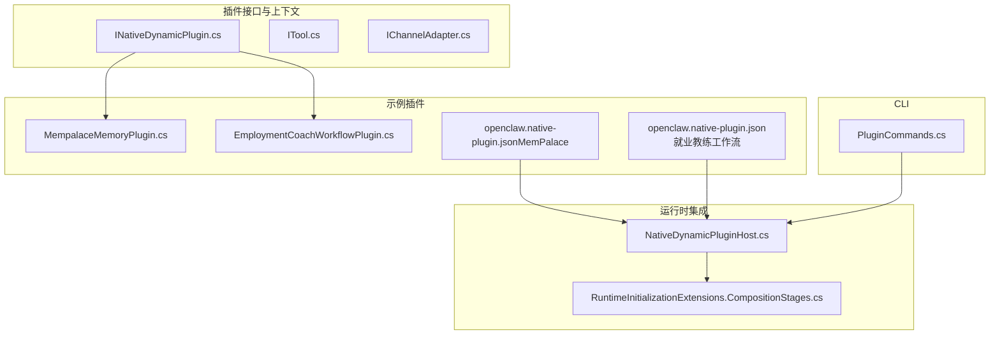
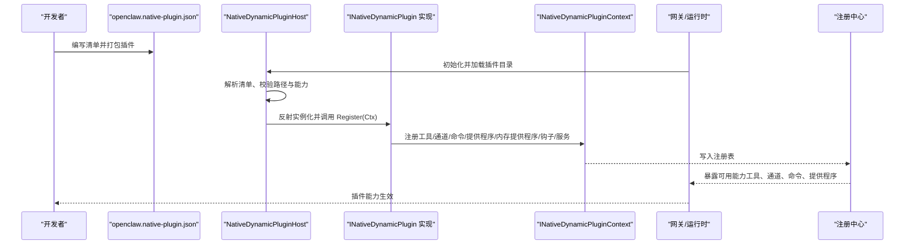
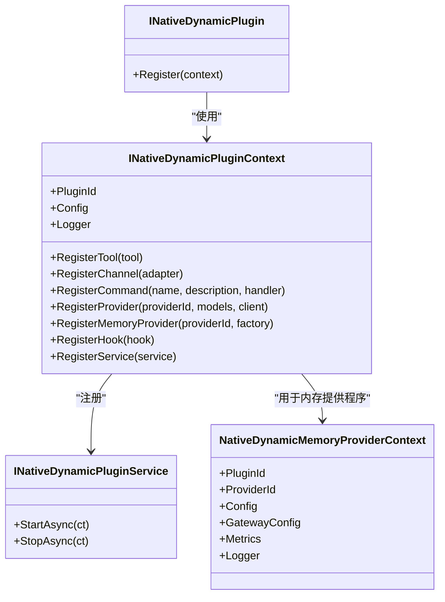
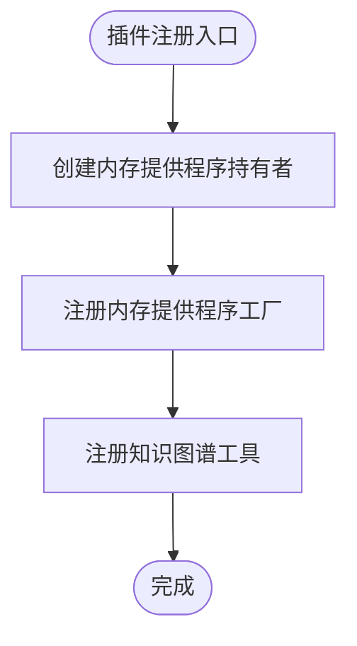
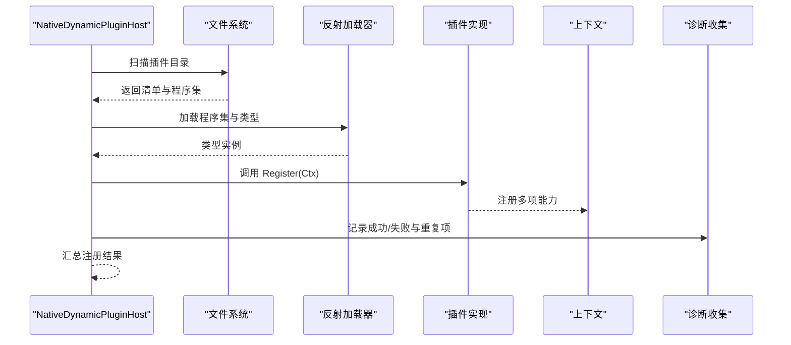
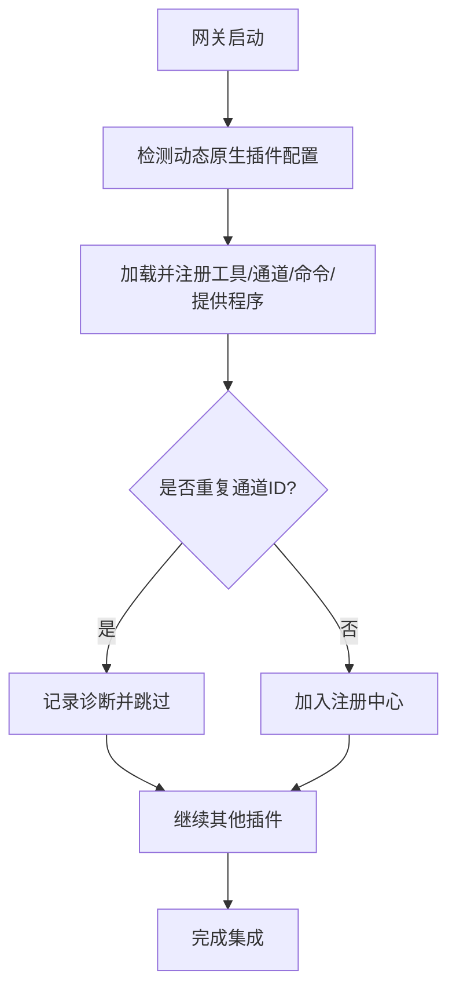
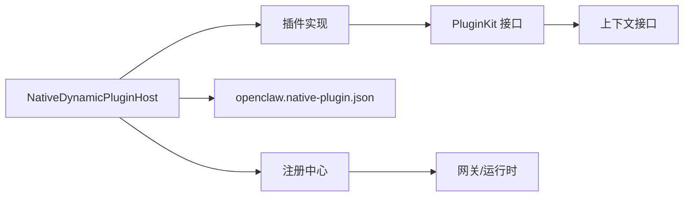

# .NET 原生插件开发

<cite>
**本文引用的文件**
- [INativeDynamicPlugin.cs](file://src/OpenClaw.PluginKit/INativeDynamicPlugin.cs)
- [MempalaceMemoryPlugin.cs](file://src/OpenClaw.Plugins.Mempalace/MempalaceMemoryPlugin.cs)
- [openclaw.native-plugin.json（MemPalace）](file://src/OpenClaw.Plugins.Mempalace/openclaw.native-plugin.json)
- [EmploymentCoachWorkflowPlugin.cs](file://src/OpenClaw.Plugins.EmploymentCoachWorkflow/EmploymentCoachWorkflowPlugin.cs)
- [openclaw.native-plugin.json（就业教练工作流）](file://src/OpenClaw.Plugins.EmploymentCoachWorkflow/openclaw.native-plugin.json)
- [ITool.cs](file://src/OpenClaw.Core/Abstractions/ITool.cs)
- [IChannelAdapter.cs](file://src/OpenClaw.Core/Abstractions/IChannelAdapter.cs)
- [RuntimeInitializationExtensions.CompositionStages.cs](file://src/OpenClaw.Gateway/Composition/RuntimeInitializationExtensions.CompositionStages.cs)
- [NativeDynamicPluginHost.cs](file://src/OpenClaw.Agent/Plugins/NativeDynamicPluginHost.cs)
- [NativeDynamicPluginHostTests.cs](file://src/OpenClaw.Tests/NativeDynamicPluginHostTests.cs)
- [CoreServicesExtensionsTests.cs](file://src/OpenClaw.Tests/CoreServicesExtensionsTests.cs)
- [PluginCommands.cs](file://src/OpenClaw.Cli/PluginCommands.cs)
- [MafToolAdapter.cs](file://src/OpenClaw.Agent/MafToolAdapter.cs)
- [MafTelemetryAdapter.cs](file://src/OpenClaw.Agent/MafTelemetryAdapter.cs)
- [MafAgentRuntime.cs](file://src/OpenClaw.Agent/MafAgentRuntime.cs)
- [MafExecutionContext.cs](file://src/OpenClaw.Agent/MafExecutionContext.cs)
- [MafOptions.cs](file://src/OpenClaw.Agent/MafOptions.cs)
- [MafServiceCollectionExtensions.cs](file://src/OpenClaw.Agent/MafServiceCollectionExtensions.cs)
- [MafAgentRuntimeFactory.cs](file://src/OpenClaw.Agent/MafAgentRuntimeFactory.cs)
- [MafAgentFactory.cs](file://src/OpenClaw.Agent/MafAgentFactory.cs)
- [MafExecutionServiceChatClient.cs](file://src/OpenClaw.Agent/MafExecutionServiceChatClient.cs)
- [MafJsonContext.cs](file://src/OpenClaw.Agent/MafJsonContext.cs)
- [MafSessionStateStore.cs](file://src/OpenClaw.Agent/MafSessionStateStore.cs)
- [MafCapabilities.cs](file://src/OpenClaw.Agent/MafCapabilities.cs)
- [MafToolExecutor.cs](file://src/OpenClaw.Agent/MafToolExecutor.cs)
- [MafAdapterTests.cs](file://src/OpenClaw.Tests/MafAdapterTests.cs)
- [MafAgentRuntimeTests.cs](file://src/OpenClaw.Tests/MafAgentRuntimeTests.cs)
- [MafGatewayIntegrationTests.cs](file://src/OpenClaw.Tests/MafGatewayIntegrationTests.cs)
- [MafTestRuntimeFactory.cs](file://src/OpenClaw.Tests/MafTestRuntimeFactory.cs)
- [MafJsonContext.cs](file://src/OpenClaw.Client/McpJsonContext.cs)
- [OpenClawHttpClient.cs](file://src/OpenClaw.Client/OpenClawHttpClient.cs)
- [OpenClawWebSocketClient.cs](file://src/OpenClaw.Client/OpenClawWebSocketClient.cs)
- [GatewayJsonContext.cs](file://src/OpenClaw.Gateway/GatewayJsonContext.cs)
- [GatewayLlmExecutionService.cs](file://src/OpenClaw.Gateway/GatewayLlmExecutionService.cs)
- [GatewayMaintenanceRuntimeService.cs](file://src/OpenClaw.Gateway/GatewayMaintenanceRuntimeService.cs)
- [GatewayPaymentApprovalService.cs](file://src/OpenClaw.Gateway/GatewayPaymentApprovalService.cs)
- [GatewaySecurity.cs](file://src/OpenClaw.Gateway/GatewaySecurity.cs)
- [PluginAdminSettingsService.cs](file://src/OpenClaw.Gateway/PluginAdminSettingsService.cs)
- [PluginHealthService.cs](file://src/OpenClaw.Gateway/PluginHealthService.cs)
- [ActorRateLimitService.cs](file://src/OpenClaw.Gateway/ActorRateLimitService.cs)
- [EvidenceBundleService.cs](file://src/OpenClaw.Gateway/EvidenceBundleService.cs)
- [LearningService.cs](file://src/OpenClaw.Gateway/LearningService.cs)
- [LlmProviderRegistry.cs](file://src/OpenClaw.Gateway/LlmProviderRegistry.cs)
- [LocalInferenceSupervisor.cs](file://src/OpenClaw.Gateway/LocalInferenceSupervisor.cs)
- [McpWorkspaceWatcherService.cs](file://src/OpenClaw.Gateway/McpWorkspaceWatcherService.cs)
- [MediaCacheStore.cs](file://src/OpenClaw.Gateway/MediaCacheStore.cs)
- [ProviderPolicyService.cs](file://src/OpenClaw.Gateway/ProviderPolicyService.cs)
- [RuntimeEventStore.cs](file://src/OpenClaw.Gateway/RuntimeEventStore.cs)
- [RuntimePulseService.cs](file://src/OpenClaw.Gateway/RuntimePulseService.cs)
- [SecurityPostureBuilder.cs](file://src/OpenClaw.Gateway/SecurityPostureBuilder.cs)
- [SessionMetadataStore.cs](file://src/OpenClaw.Gateway/SessionMetadataStore.cs)
- [SharedHarnessStateService.cs](file://src/OpenClaw.Gateway/SharedHarnessStateService.cs)
- [SkillWatcherService.cs](file://src/OpenClaw.Gateway/SkillWatcherService.cs)
- [ToolApprovalCallbackFactory.cs](file://src/OpenClaw.Gateway/ToolApprovalCallbackFactory.cs)
- [ToolApprovalGrantStore.cs](file://src/OpenClaw.Gateway/ToolApprovalGrantStore.cs)
- [ToolPresetResolver.cs](file://src/OpenClaw.Gateway/ToolPresetResolver.cs)
- [TwilioWebhookVerifier.cs](file://src/OpenClaw.Gateway/TwilioWebhookVerifier.cs)
- [VideoFrameExtractionService.cs](file://src/OpenClaw.Gateway/VideoFrameExtractionService.cs)
- [WebhookDeliveryStore.cs](file://src/OpenClaw.Gateway/WebhookDeliveryStore.cs)
- [MafAgentFactory.cs](file://src/OpenClaw.Agent/MafAgentFactory.cs)
- [MafAgentRuntimeFactory.cs](file://src/OpenClaw.Agent/MafAgentRuntimeFactory.cs)
- [MafAgentRuntime.cs](file://src/OpenClaw.Agent/MafAgentRuntime.cs)
- [MafExecutionContext.cs](file://src/OpenClaw.Agent/MafExecutionContext.cs)
- [MafOptions.cs](file://src/OpenClaw.Agent/MafOptions.cs)
- [MafServiceCollectionExtensions.cs](file://src/OpenClaw.Agent/MafServiceCollectionExtensions.cs)
- [MafExecutionServiceChatClient.cs](file://src/OpenClaw.Agent/MafExecutionServiceChatClient.cs)
- [MafJsonContext.cs](file://src/OpenClaw.Agent/MafJsonContext.cs)
- [MafSessionStateStore.cs](file://src/OpenClaw.Agent/MafSessionStateStore.cs)
- [MafCapabilities.cs](file://src/OpenClaw.Agent/MafCapabilities.cs)
- [MafToolExecutor.cs](file://src/OpenClaw.Agent/MafToolExecutor.cs)
- [MafAdapterTests.cs](file://src/OpenClaw.Tests/MafAdapterTests.cs)
- [MafAgentRuntimeTests.cs](file://src/OpenClaw.Tests/MafAgentRuntimeTests.cs)
- [MafGatewayIntegrationTests.cs](file://src/OpenClaw.Tests/MafGatewayIntegrationTests.cs)
- [MafTestRuntimeFactory.cs](file://src/OpenClaw.Tests/MafTestRuntimeFactory.cs)
- [MafJsonContext.cs](file://src/OpenClaw.Client/McpJsonContext.cs)
- [OpenClawHttpClient.cs](file://src/OpenClaw.Client/OpenClawHttpClient.cs)
- [OpenClawWebSocketClient.cs](file://src/OpenClaw.Client/OpenClawWebSocketClient.cs)
- [GatewayJsonContext.cs](file://src/OpenClaw.Gateway/GatewayJsonContext.cs)
- [GatewayLlmExecutionService.cs](file://src/OpenClaw.Gateway/GatewayLlmExecutionService.cs)
- [GatewayMaintenanceRuntimeService.cs](file://src/OpenClaw.Gateway/GatewayMaintenanceRuntimeService.cs)
- [GatewayPaymentApprovalService.cs](file://src/OpenClaw.Gateway/GatewayPaymentApprovalService.cs)
- [GatewaySecurity.cs](file://src/OpenClaw.Gateway/GatewaySecurity.cs)
- [PluginAdminSettingsService.cs](file://src/OpenClaw.Gateway/PluginAdminSettingsService.cs)
- [PluginHealthService.cs](file://src/OpenClaw.Gateway/PluginHealthService.cs)
- [ActorRateLimitService.cs](file://src/OpenClaw.Gateway/ActorRateLimitService.cs)
- [EvidenceBundleService.cs](file://src/OpenClaw.Gateway/EvidenceBundleService.cs)
- [LearningService.cs](file://src/OpenClaw.Gateway/LearningService.cs)
- [LlmProviderRegistry.cs](file://src/OpenClaw.Gateway/LlmProviderRegistry.cs)
- [LocalInferenceSupervisor.cs](file://src/OpenClaw.Gateway/LocalInferenceSupervisor.cs)
- [McpWorkspaceWatcherService.cs](file://src/OpenClaw.Gateway/McpWorkspaceWatcherService.cs)
- [MediaCacheStore.cs](file://src/OpenClaw.Gateway/MediaCacheStore.cs)
- [ProviderPolicyService.cs](file://src/OpenClaw.Gateway/ProviderPolicyService.cs)
- [RuntimeEventStore.cs](file://src/OpenClaw.Gateway/RuntimeEventStore.cs)
- [RuntimePulseService.cs](file://src/OpenClaw.Gateway/RuntimePulseService.cs)
- [SecurityPostureBuilder.cs](file://src/OpenClaw.Gateway/SecurityPostureBuilder.cs)
- [SessionMetadataStore.cs](file://src/OpenClaw.Gateway/SessionMetadataStore.cs)
- [SharedHarnessStateService.cs](file://src/OpenClaw.Gateway/SharedHarnessStateService.cs)
- [SkillWatcherService.cs](file://src/OpenClaw.Gateway/SkillWatcherService.cs)
- [ToolApprovalCallbackFactory.cs](file://src/OpenClaw.Gateway/ToolApprovalCallbackFactory.cs)
- [ToolApprovalGrantStore.cs](file://src/OpenClaw.Gateway/ToolApprovalGrantStore.cs)
- [ToolPresetResolver.cs](file://src/OpenClaw.Gateway/ToolPresetResolver.cs)
- [TwilioWebhookVerifier.cs](file://src/OpenClaw.Gateway/TwilioWebhookVerifier.cs)
- [VideoFrameExtractionService.cs](file://src/OpenClaw.Gateway/VideoFrameExtractionService.cs)
- [WebhookDeliveryStore.cs](file://src/OpenClaw.Gateway/WebhookDeliveryStore.cs)
</cite>

## 目录
1. [简介](#简介)
2. [项目结构](#项目结构)
3. [核心组件](#核心组件)
4. [架构总览](#架构总览)
5. [详细组件分析](#详细组件分析)
6. [依赖关系分析](#依赖关系分析)
7. [性能考虑](#性能考虑)
8. [故障排查指南](#故障排查指南)
9. [结论](#结论)
10. [附录](#附录)

## 简介
本指南面向希望在 .NET 生态中开发“原生插件”的开发者，围绕 OpenClaw 的动态原生插件体系，系统讲解接口实现、上下文使用、资源管理、插件注册（工具、通道适配器、命令、提供程序）、配置与生命周期、日志与可观测性、错误处理与性能监控，并提供可复用的开发范式与调试技巧。

## 项目结构
OpenClaw 将“原生插件”能力抽象为统一接口，通过插件清单（openclaw.native-plugin.json）声明元数据，运行时由动态原生插件宿主加载并注册到网关或代理运行时。典型目录组织如下：
- 插件接口与上下文：src/OpenClaw.PluginKit
- 示例插件：src/OpenClaw.Plugins.Mempalace、src/OpenClaw.Plugins.EmploymentCoachWorkflow
- 动态原生插件宿主：src/OpenClaw.Agent/Plugins/NativeDynamicPluginHost.cs
- 运行时集成：src/OpenClaw.Gateway/Composition/RuntimeInitializationExtensions.CompositionStages.cs
- CLI 插件命令：src/OpenClaw.Cli/PluginCommands.cs
- 工具与适配器：src/OpenClaw.Agent/MafToolAdapter.cs、MafTelemetryAdapter.cs 等
- 客户端与网关上下文：src/OpenClaw.Client/McpJsonContext.cs、src/OpenClaw.Gateway/GatewayJsonContext.cs

**图表来源**
- [INativeDynamicPlugin.cs:11-29](file://src/OpenClaw.PluginKit/INativeDynamicPlugin.cs#L11-L29)
- [ITool.cs:6-16](file://src/OpenClaw.Core/Abstractions/ITool.cs#L6-L16)
- [IChannelAdapter.cs:9-21](file://src/OpenClaw.Core/Abstractions/IChannelAdapter.cs#L9-L21)
- [MempalaceMemoryPlugin.cs:6-19](file://src/OpenClaw.Plugins.Mempalace/MempalaceMemoryPlugin.cs#L6-L19)
- [EmploymentCoachWorkflowPlugin.cs:5-10](file://src/OpenClaw.Plugins.EmploymentCoachWorkflow/EmploymentCoachWorkflowPlugin.cs#L5-L10)
- [openclaw.native-plugin.json（MemPalace）:1-10](file://src/OpenClaw.Plugins.Mempalace/openclaw.native-plugin.json#L1-L10)
- [openclaw.native-plugin.json（就业教练工作流）:1-11](file://src/OpenClaw.Plugins.EmploymentCoachWorkflow/openclaw.native-plugin.json#L1-L11)
- [RuntimeInitializationExtensions.CompositionStages.cs:202-315](file://src/OpenClaw.Gateway/Composition/RuntimeInitializationExtensions.CompositionStages.cs#L202-L315)
- [NativeDynamicPluginHost.cs](file://src/OpenClaw.Agent/Plugins/NativeDynamicPluginHost.cs)

**章节来源**
- [INativeDynamicPlugin.cs:11-46](file://src/OpenClaw.PluginKit/INativeDynamicPlugin.cs#L11-L46)
- [MempalaceMemoryPlugin.cs:6-43](file://src/OpenClaw.Plugins.Mempalace/MempalaceMemoryPlugin.cs#L6-L43)
- [EmploymentCoachWorkflowPlugin.cs:5-10](file://src/OpenClaw.Plugins.EmploymentCoachWorkflow/EmploymentCoachWorkflowPlugin.cs#L5-L10)
- [openclaw.native-plugin.json（MemPalace）:1-10](file://src/OpenClaw.Plugins.Mempalace/openclaw.native-plugin.json#L1-L10)
- [openclaw.native-plugin.json（就业教练工作流）:1-11](file://src/OpenClaw.Plugins.EmploymentCoachWorkflow/openclaw.native-plugin.json#L1-L11)
- [RuntimeInitializationExtensions.CompositionStages.cs:202-315](file://src/OpenClaw.Gateway/Composition/RuntimeInitializationExtensions.CompositionStages.cs#L202-L315)

## 核心组件
- 原生动态插件接口与上下文
  - INativeDynamicPlugin：插件入口，通过 Register 接收上下文进行注册。
  - INativeDynamicPluginContext：提供插件 ID、配置、日志；支持注册工具、通道适配器、命令、提供程序、内存提供程序工厂、钩子、服务等。
  - NativeDynamicMemoryProviderContext：内存提供程序上下文，包含插件 ID、提供程序 ID、配置、网关配置、运行时指标、日志等。
  - INativeDynamicPluginService：声明周期服务，支持异步启动与停止。
- 工具与通道适配器抽象
  - ITool：最小化工具接口，包含名称、描述、参数模式与执行。
  - IChannelAdapter：消息通道适配器，包含启动、发送、入站事件等。
- 运行时集成点
  - NativeDynamicPluginHost：动态原生插件宿主，负责加载、校验、注册与生命周期管理。
  - RuntimeInitializationExtensions：在网关启动阶段注册动态原生插件的工具、通道、命令、提供程序等。
- CLI 插件命令
  - PluginCommands：提供插件相关命令入口，便于安装、启用、诊断与维护。

**章节来源**
- [INativeDynamicPlugin.cs:11-46](file://src/OpenClaw.PluginKit/INativeDynamicPlugin.cs#L11-L46)
- [ITool.cs:6-16](file://src/OpenClaw.Core/Abstractions/ITool.cs#L6-L16)
- [IChannelAdapter.cs:9-21](file://src/OpenClaw.Core/Abstractions/IChannelAdapter.cs#L9-L21)
- [NativeDynamicPluginHost.cs](file://src/OpenClaw.Agent/Plugins/NativeDynamicPluginHost.cs)
- [RuntimeInitializationExtensions.CompositionStages.cs:202-315](file://src/OpenClaw.Gateway/Composition/RuntimeInitializationExtensions.CompositionStages.cs#L202-L315)
- [PluginCommands.cs](file://src/OpenClaw.Cli/PluginCommands.cs)

## 架构总览
下图展示从插件清单到运行时注册的整体流程，以及与网关、代理运行时的交互。

**图表来源**
- [openclaw.native-plugin.json（MemPalace）:1-10](file://src/OpenClaw.Plugins.Mempalace/openclaw.native-plugin.json#L1-L10)
- [openclaw.native-plugin.json（就业教练工作流）:1-11](file://src/OpenClaw.Plugins.EmploymentCoachWorkflow/openclaw.native-plugin.json#L1-L11)
- [RuntimeInitializationExtensions.CompositionStages.cs:202-315](file://src/OpenClaw.Gateway/Composition/RuntimeInitializationExtensions.CompositionStages.cs#L202-L315)
- [INativeDynamicPlugin.cs:11-29](file://src/OpenClaw.PluginKit/INativeDynamicPlugin.cs#L11-L29)

## 详细组件分析

### 组件一：插件接口与上下文（INativeDynamicPlugin 与 INativeDynamicPluginContext）
- 设计要点
  - Register 方法作为唯一入口，确保插件在拿到上下文后集中完成所有注册。
  - 上下文提供配置、日志、插件标识，便于插件按需读取与记录。
  - 支持注册多种能力：工具、通道适配器、命令、提供程序、内存提供程序工厂、钩子、服务。
- 数据结构与复杂度
  - 注册操作为 O(1) 并发安全，具体复杂度取决于下游注册中心实现。
- 依赖链
  - 插件实现依赖上下文接口；上下文由宿主注入；注册结果进入网关/运行时注册中心。
- 错误处理
  - 注册失败应通过日志上报并避免影响其他插件；重复注册应被拒绝并记录诊断信息。
- 性能影响
  - 注册过程应避免阻塞；如需初始化外部资源，建议延迟到首次使用或异步启动服务。

**图表来源**
- [INativeDynamicPlugin.cs:11-46](file://src/OpenClaw.PluginKit/INativeDynamicPlugin.cs#L11-L46)

**章节来源**
- [INativeDynamicPlugin.cs:11-46](file://src/OpenClaw.PluginKit/INativeDynamicPlugin.cs#L11-L46)

### 组件二：示例插件（MemPalace 内存插件）
- 能力概述
  - 通过 RegisterMemoryProvider 注册内存提供程序工厂，返回单例存储实例。
  - 同时注册一个工具，用于查询知识图谱状态并在未激活时提示配置。
- 资源管理
  - 使用锁保证线程安全的单例创建；TryGet 提供安全访问。
- 配置与诊断
  - 通过上下文中的 GatewayConfig、Metrics、Logger 获取运行时信息与指标。
- 生命周期
  - 工具与内存提供程序随插件注册；释放由宿主统一管理。

**图表来源**
- [MempalaceMemoryPlugin.cs:6-43](file://src/OpenClaw.Plugins.Mempalace/MempalaceMemoryPlugin.cs#L6-L43)

**章节来源**
- [MempalaceMemoryPlugin.cs:6-43](file://src/OpenClaw.Plugins.Mempalace/MempalaceMemoryPlugin.cs#L6-L43)

### 组件三：示例插件（就业教练工作流）
- 能力概述
  - 当前空实现，仅演示插件骨架；实际可在此注册技能、命令或工具。
- 扩展建议
  - 在 Register 中添加 RegisterCommand、RegisterProvider、RegisterTool 等调用。

**章节来源**
- [EmploymentCoachWorkflowPlugin.cs:5-10](file://src/OpenClaw.Plugins.EmploymentCoachWorkflow/EmploymentCoachWorkflowPlugin.cs#L5-L10)

### 组件四：插件清单（openclaw.native-plugin.json）
- 关键字段
  - id、name、version：插件标识与元信息。
  - assemblyPath、typeName：程序集路径与类型全名。
  - capabilities：声明支持的能力集合（如 memory、tools、skills 等）。
  - jitOnly：限制运行模式（如仅 JIT 支持）。
- 作用
  - 宿主依据清单解析并加载对应类型，执行 Register。

**章节来源**
- [openclaw.native-plugin.json（MemPalace）:1-10](file://src/OpenClaw.Plugins.Mempalace/openclaw.native-plugin.json#L1-L10)
- [openclaw.native-plugin.json（就业教练工作流）:1-11](file://src/OpenClaw.Plugins.EmploymentCoachWorkflow/openclaw.native-plugin.json#L1-L11)

### 组件五：动态原生插件宿主（NativeDynamicPluginHost）
- 职责
  - 解析清单、校验路径与能力、反射加载、调用 Register、收集诊断信息、管理生命周期。
- 关键行为
  - 加载工具、通道、命令、提供程序、内存提供程序。
  - 对越权路径、重复 ID、不兼容运行模式等情况进行拦截与报告。
- 测试覆盖
  - 单元测试验证 AOT/JIT 模式限制、路径越界、内存提供程序注册清理等。

**图表来源**
- [NativeDynamicPluginHost.cs](file://src/OpenClaw.Agent/Plugins/NativeDynamicPluginHost.cs)
- [NativeDynamicPluginHostTests.cs:100-234](file://src/OpenClaw.Tests/NativeDynamicPluginHostTests.cs#L100-L234)

**章节来源**
- [NativeDynamicPluginHost.cs](file://src/OpenClaw.Agent/Plugins/NativeDynamicPluginHost.cs)
- [NativeDynamicPluginHostTests.cs:100-234](file://src/OpenClaw.Tests/NativeDynamicPluginHostTests.cs#L100-L234)

### 组件六：运行时集成（注册桥接）
- 网关启动阶段
  - 在 RuntimeInitializationExtensions 中，根据配置启用动态原生插件，并注册其提供的工具、通道、命令、提供程序。
- 重复 ID 处理
  - 若发现重复通道 ID，记录诊断并跳过冲突项，避免覆盖已有适配器。
- 诊断与兼容性
  - 将插件诊断信息写入运行时诊断字典，便于运维与排障。

**图表来源**
- [RuntimeInitializationExtensions.CompositionStages.cs:202-315](file://src/OpenClaw.Gateway/Composition/RuntimeInitializationExtensions.CompositionStages.cs#L202-L315)

**章节来源**
- [RuntimeInitializationExtensions.CompositionStages.cs:202-315](file://src/OpenClaw.Gateway/Composition/RuntimeInitializationExtensions.CompositionStages.cs#L202-L315)

### 组件七：CLI 插件命令（PluginCommands）
- 能力
  - 提供插件安装、启用、诊断、维护等命令入口，便于本地开发与运维。
- 与宿主协作
  - CLI 命令可触发插件扫描、加载与健康检查，配合宿主进行诊断与修复。

**章节来源**
- [PluginCommands.cs](file://src/OpenClaw.Cli/PluginCommands.cs)

## 依赖关系分析
- 组件耦合
  - 插件实现依赖 PluginKit 接口；宿主依赖清单与反射；网关依赖注册中心。
- 外部依赖
  - 日志（ILogger）、配置（JsonElement?）、运行时指标（RuntimeMetrics）、网关配置（GatewayConfig）。
- 循环依赖
  - 插件与宿主之间为单向依赖；注册中心为集中式，避免循环。

**图表来源**
- [INativeDynamicPlugin.cs:11-29](file://src/OpenClaw.PluginKit/INativeDynamicPlugin.cs#L11-L29)
- [openclaw.native-plugin.json（MemPalace）:1-10](file://src/OpenClaw.Plugins.Mempalace/openclaw.native-plugin.json#L1-L10)
- [RuntimeInitializationExtensions.CompositionStages.cs:202-315](file://src/OpenClaw.Gateway/Composition/RuntimeInitializationExtensions.CompositionStages.cs#L202-L315)

**章节来源**
- [INativeDynamicPlugin.cs:11-46](file://src/OpenClaw.PluginKit/INativeDynamicPlugin.cs#L11-L46)
- [openclaw.native-plugin.json（MemPalace）:1-10](file://src/OpenClaw.Plugins.Mempalace/openclaw.native-plugin.json#L1-L10)
- [RuntimeInitializationExtensions.CompositionStages.cs:202-315](file://src/OpenClaw.Gateway/Composition/RuntimeInitializationExtensions.CompositionStages.cs#L202-L315)

## 性能考虑
- 加载与注册
  - 将重资源初始化延迟到首次使用或通过 INativeDynamicPluginService 异步启动，避免阻塞启动。
- 并发与锁
  - 内存提供程序持有者使用锁保护单例创建，注意避免长时间持锁；必要时采用不可变共享状态。
- 运行时指标
  - 使用 RuntimeMetrics 记录关键指标（如内存、请求量），结合日志进行趋势分析。
- AOT/JIT 兼容
  - 遵循 jitOnly 约束，确保仅在支持动态代码的运行模式下加载需要 JIT 的插件。

[本节为通用指导，无需特定文件来源]

## 故障排查指南
- 常见问题与定位
  - AOT 模式加载失败：检查插件清单的 jitOnly 与运行模式；参考测试用例对 AOT/JIT 的限制。
  - 路径越界：assemblyPath 不得指向根目录外；测试用例验证了该限制。
  - 重复通道 ID：注册阶段会记录诊断并跳过冲突项；检查插件 ID 与通道 ID 是否冲突。
  - 无动态原生内存提供程序：当需要内存能力但未注册任何提供程序时，核心服务会抛出异常；确保插件已注册内存提供程序。
- 诊断与日志
  - 宿主收集并输出诊断信息；CLI 命令可用于触发诊断与健康检查。
- 回归与验证
  - 使用单元测试与集成测试覆盖加载、注册、释放等关键路径。

**章节来源**
- [NativeDynamicPluginHostTests.cs:100-234](file://src/OpenClaw.Tests/NativeDynamicPluginHostTests.cs#L100-L234)
- [CoreServicesExtensionsTests.cs:343-424](file://src/OpenClaw.Tests/CoreServicesExtensionsTests.cs#L343-L424)

## 结论
通过统一的插件接口、严格的清单与宿主校验、完善的运行时集成与诊断机制，OpenClaw 为 .NET 原生插件提供了高内聚、低耦合的开发与运行框架。遵循本文的接口实现、上下文使用、资源管理与注册流程，可快速构建稳定、可观测且高性能的原生插件。

[本节为总结，无需特定文件来源]

## 附录

### A. 插件开发步骤清单
- 创建插件类，实现 INativeDynamicPlugin
- 在 Register 中调用上下文的 Register* 方法完成注册
- 编写 openclaw.native-plugin.json 清单，声明能力与类型
- 在测试中验证加载、注册与释放流程
- 使用 CLI 命令进行安装与诊断

**章节来源**
- [INativeDynamicPlugin.cs:11-29](file://src/OpenClaw.PluginKit/INativeDynamicPlugin.cs#L11-L29)
- [MempalaceMemoryPlugin.cs:6-43](file://src/OpenClaw.Plugins.Mempalace/MempalaceMemoryPlugin.cs#L6-L43)
- [openclaw.native-plugin.json（MemPalace）:1-10](file://src/OpenClaw.Plugins.Mempalace/openclaw.native-plugin.json#L1-L10)

### B. 最佳实践
- 将昂贵初始化放入 INativeDynamicPluginService 并异步启动
- 使用上下文日志记录关键事件与错误
- 严格遵守 AOT/JIT 运行模式约束
- 避免重复注册，确保通道 ID 唯一
- 通过测试覆盖边界条件（越界路径、AOT 模式）

**章节来源**
- [NativeDynamicPluginHostTests.cs:100-234](file://src/OpenClaw.Tests/NativeDynamicPluginHostTests.cs#L100-L234)
- [RuntimeInitializationExtensions.CompositionStages.cs:202-315](file://src/OpenClaw.Gateway/Composition/RuntimeInitializationExtensions.CompositionStages.cs#L202-L315)

### C. 调试技巧
- 使用 CLI 命令查看插件状态与诊断
- 在宿主与插件中增加细粒度日志
- 利用单元测试模拟不同运行模式与异常场景
- 通过内存提供程序持有者的单例逻辑验证并发安全性

**章节来源**
- [PluginCommands.cs](file://src/OpenClaw.Cli/PluginCommands.cs)
- [MempalaceMemoryPlugin.cs:21-40](file://src/OpenClaw.Plugins.Mempalace/MempalaceMemoryPlugin.cs#L21-L40)