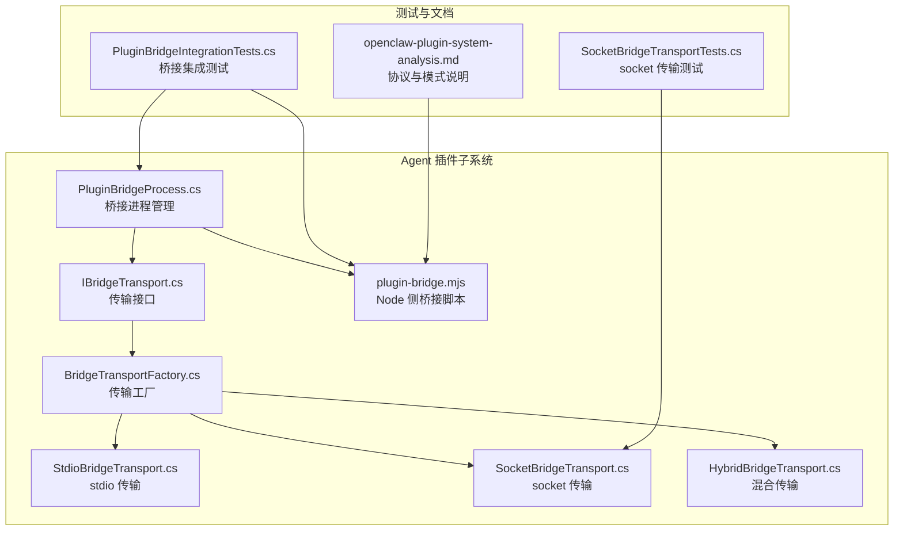
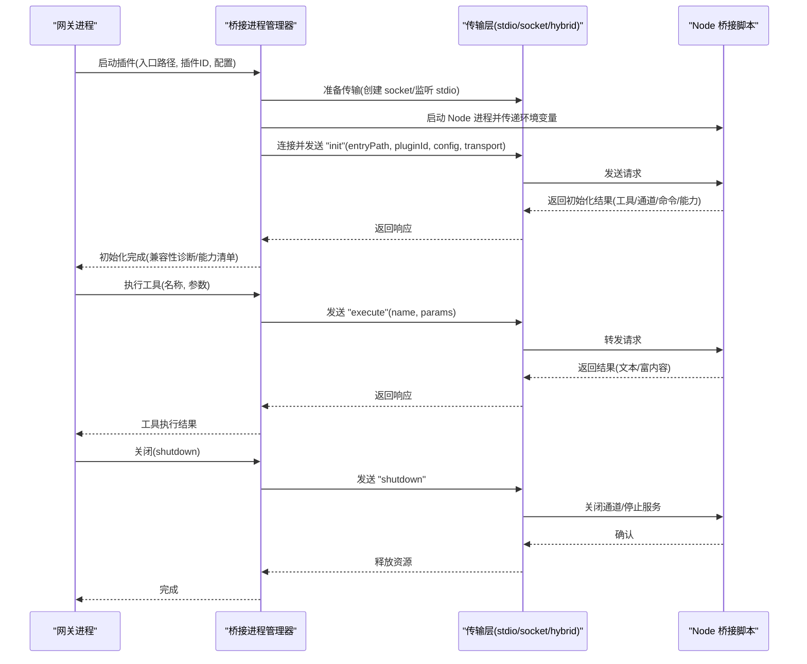
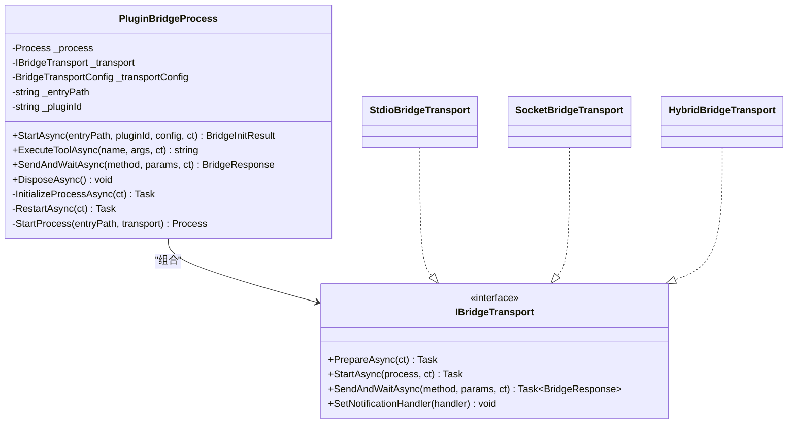
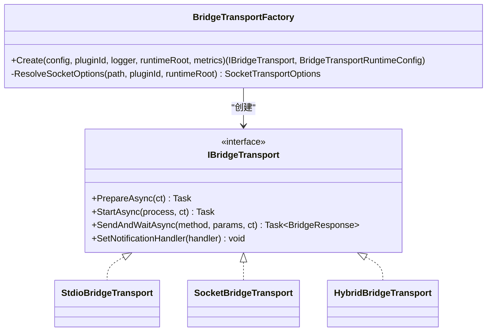
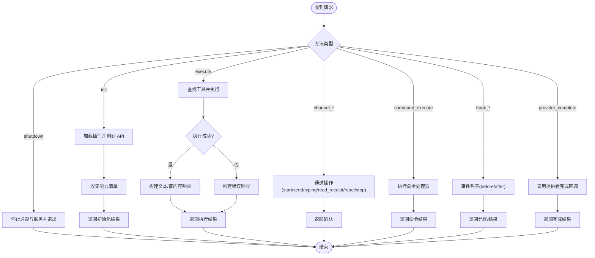
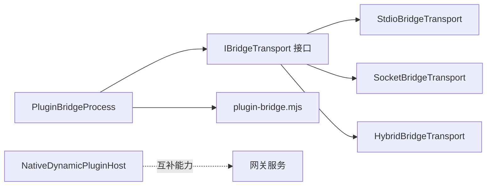
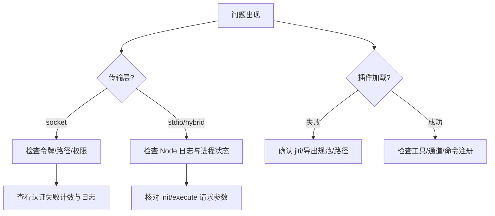

# JS/TS 插件桥接

<cite>
**本文引用的文件**
- [PluginBridgeProcess.cs](file://src/OpenClaw.Agent/Plugins/PluginBridgeProcess.cs)
- [plugin-bridge.mjs](file://src/OpenClaw.Agent/Plugins/plugin-bridge.mjs)
- [IBridgeTransport.cs](file://src/OpenClaw.Agent/Plugins/IBridgeTransport.cs)
- [BridgeTransportFactory.cs](file://src/OpenClaw.Agent/Plugins/BridgeTransportFactory.cs)
- [StdioBridgeTransport.cs](file://src/OpenClaw.Agent/Plugins/StdioBridgeTransport.cs)
- [SocketBridgeTransport.cs](file://src/OpenClaw.Agent/Plugins/SocketBridgeTransport.cs)
- [HybridBridgeTransport.cs](file://src/OpenClaw.Agent/Plugins/HybridBridgeTransport.cs)
- [NativeDynamicPluginHost.cs](file://src/OpenClaw.Agent/Plugins/NativeDynamicPluginHost.cs)
- [PluginBridgeIntegrationTests.cs](file://src/OpenClaw.Tests/PluginBridgeIntegrationTests.cs)
- [SocketBridgeTransportTests.cs](file://src/OpenClaw.Tests/SocketBridgeTransportTests.cs)
- [openclaw-plugin-system-analysis.md](file://docs/openclaw-plugin-system-analysis.md)
</cite>

## 目录
1. [简介](#简介)
2. [项目结构](#项目结构)
3. [核心组件](#核心组件)
4. [架构总览](#架构总览)
5. [详细组件分析](#详细组件分析)
6. [依赖关系分析](#依赖关系分析)
7. [性能考量](#性能考量)
8. [故障排查指南](#故障排查指南)
9. [结论](#结论)
10. [附录](#附录)

## 简介
本文件系统性阐述 JS/TS 插件桥接机制，涵盖 Node.js 插件桥接原理、JSON-RPC 通信协议、进程间通信（IPC）机制与传输层抽象。文档重点说明桥接配置、消息序列化、错误传播、超时与重试、桥接服务启动、插件生命周期管理与资源清理策略，并提供开发示例、调试方法与性能优化建议。

## 项目结构
围绕插件桥接的关键目录与文件：
- Agent 层插件桥接与传输层实现：src/OpenClaw.Agent/Plugins
- 测试用例与集成验证：src/OpenClaw.Tests
- 文档与协议说明：docs/openclaw-plugin-system-analysis.md

**图表来源**
- [PluginBridgeProcess.cs](file://src/OpenClaw.Agent/Plugins/PluginBridgeProcess.cs)
- [IBridgeTransport.cs](file://src/OpenClaw.Agent/Plugins/IBridgeTransport.cs)
- [BridgeTransportFactory.cs](file://src/OpenClaw.Agent/Plugins/BridgeTransportFactory.cs)
- [StdioBridgeTransport.cs](file://src/OpenClaw.Agent/Plugins/StdioBridgeTransport.cs)
- [SocketBridgeTransport.cs](file://src/OpenClaw.Agent/Plugins/SocketBridgeTransport.cs)
- [HybridBridgeTransport.cs](file://src/OpenClaw.Agent/Plugins/HybridBridgeTransport.cs)
- [plugin-bridge.mjs](file://src/OpenClaw.Agent/Plugins/plugin-bridge.mjs)
- [PluginBridgeIntegrationTests.cs](file://src/OpenClaw.Tests/PluginBridgeIntegrationTests.cs)
- [SocketBridgeTransportTests.cs](file://src/OpenClaw.Tests/SocketBridgeTransportTests.cs)
- [openclaw-plugin-system-analysis.md](file://docs/openclaw-plugin-system-analysis.md)

**章节来源**
- [PluginBridgeProcess.cs](file://src/OpenClaw.Agent/Plugins/PluginBridgeProcess.cs)
- [plugin-bridge.mjs](file://src/OpenClaw.Agent/Plugins/plugin-bridge.mjs)
- [IBridgeTransport.cs](file://src/OpenClaw.Agent/Plugins/IBridgeTransport.cs)
- [BridgeTransportFactory.cs](file://src/OpenClaw.Agent/Plugins/BridgeTransportFactory.cs)
- [StdioBridgeTransport.cs](file://src/OpenClaw.Agent/Plugins/StdioBridgeTransport.cs)
- [SocketBridgeTransport.cs](file://src/OpenClaw.Agent/Plugins/SocketBridgeTransport.cs)
- [HybridBridgeTransport.cs](file://src/OpenClaw.Agent/Plugins/HybridBridgeTransport.cs)
- [PluginBridgeIntegrationTests.cs](file://src/OpenClaw.Tests/PluginBridgeIntegrationTests.cs)
- [SocketBridgeTransportTests.cs](file://src/OpenClaw.Tests/SocketBridgeTransportTests.cs)
- [openclaw-plugin-system-analysis.md](file://docs/openclaw-plugin-system-analysis.md)

## 核心组件
- 桥接进程管理器：负责 Node.js 子进程生命周期、重启与资源清理，封装 JSON-RPC 请求/响应与通知转发。
- 传输层抽象：统一 stdio、socket、hybrid 三种传输模式，屏蔽平台差异与认证细节。
- Node 侧桥接脚本：实现插件加载、能力注册、工具执行、通道消息与命令分发、事件钩子与提供者完成回调等。
- 动态原生插件宿主：支持 .NET 原生动态插件加载与能力注册，与 JS/TS 桥接互补。

**章节来源**
- [PluginBridgeProcess.cs](file://src/OpenClaw.Agent/Plugins/PluginBridgeProcess.cs)
- [IBridgeTransport.cs](file://src/OpenClaw.Agent/Plugins/IBridgeTransport.cs)
- [BridgeTransportFactory.cs](file://src/OpenClaw.Agent/Plugins/BridgeTransportFactory.cs)
- [StdioBridgeTransport.cs](file://src/OpenClaw.Agent/Plugins/StdioBridgeTransport.cs)
- [SocketBridgeTransport.cs](file://src/OpenClaw.Agent/Plugins/SocketBridgeTransport.cs)
- [HybridBridgeTransport.cs](file://src/OpenClaw.Agent/Plugins/HybridBridgeTransport.cs)
- [plugin-bridge.mjs](file://src/OpenClaw.Agent/Plugins/plugin-bridge.mjs)
- [NativeDynamicPluginHost.cs](file://src/OpenClaw.Agent/Plugins/NativeDynamicPluginHost.cs)

## 架构总览
桥接采用“网关进程 + Node 桥接进程”的双进程模型，通过 JSON-RPC over 本地 IPC 通信。传输层在运行时根据配置选择 stdio、socket 或 hybrid 模式；Node 脚本负责插件加载与能力导出，网关侧负责工具执行调度与通道消息编排。

**图表来源**
- [PluginBridgeProcess.cs](file://src/OpenClaw.Agent/Plugins/PluginBridgeProcess.cs)
- [plugin-bridge.mjs](file://src/OpenClaw.Agent/Plugins/plugin-bridge.mjs)
- [IBridgeTransport.cs](file://src/OpenClaw.Agent/Plugins/IBridgeTransport.cs)
- [StdioBridgeTransport.cs](file://src/OpenClaw.Agent/Plugins/StdioBridgeTransport.cs)
- [SocketBridgeTransport.cs](file://src/OpenClaw.Agent/Plugins/SocketBridgeTransport.cs)
- [HybridBridgeTransport.cs](file://src/OpenClaw.Agent/Plugins/HybridBridgeTransport.cs)

## 详细组件分析

### 组件一：桥接进程管理器（PluginBridgeProcess）
职责与特性：
- 生命周期管理：启动/重启/监控/优雅关停 Node 桥接进程。
- 传输抽象：委托具体传输层进行请求/响应与通知收发。
- 序列化与反序列化：使用强类型 JSON 上下文进行参数与响应的序列化。
- 错误传播：将 Node 侧异常映射为可读错误字符串返回。
- 资源清理：进程退出、取消、Dispose 时清理传输与进程句柄。

关键流程：
- 启动阶段：创建传输实例、准备 socket/stdio、启动 Node 进程、发送 init 并等待响应。
- 执行阶段：构造 BridgeExecuteRequest，调用 SendAndWaitAsync，解析结果。
- 关闭阶段：发送 shutdown，等待退出或强制 Kill，释放传输与进程。

**图表来源**
- [PluginBridgeProcess.cs](file://src/OpenClaw.Agent/Plugins/PluginBridgeProcess.cs)
- [IBridgeTransport.cs](file://src/OpenClaw.Agent/Plugins/IBridgeTransport.cs)
- [StdioBridgeTransport.cs](file://src/OpenClaw.Agent/Plugins/StdioBridgeTransport.cs)
- [SocketBridgeTransport.cs](file://src/OpenClaw.Agent/Plugins/SocketBridgeTransport.cs)
- [HybridBridgeTransport.cs](file://src/OpenClaw.Agent/Plugins/HybridBridgeTransport.cs)

**章节来源**
- [PluginBridgeProcess.cs](file://src/OpenClaw.Agent/Plugins/PluginBridgeProcess.cs)

### 组件二：传输层抽象与工厂（IBridgeTransport、BridgeTransportFactory）
职责与特性：
- 抽象统一：对上提供 Prepare/Start/SendAndWait/SetNotificationHandler 等一致接口。
- 工厂模式：根据配置与运行时环境选择 stdio/socket/hybrid。
- 平台适配：Windows 使用命名管道，Unix 使用 Unix 域套接字；hybrid 在 init/shutdown 使用 stdio，在稳定期切换 socket。
- 安全加固：socket 传输启用一次性令牌认证，拒绝未认证连接；Unix 目录权限最小化。

**图表来源**
- [IBridgeTransport.cs](file://src/OpenClaw.Agent/Plugins/IBridgeTransport.cs)
- [BridgeTransportFactory.cs](file://src/OpenClaw.Agent/Plugins/BridgeTransportFactory.cs)
- [StdioBridgeTransport.cs](file://src/OpenClaw.Agent/Plugins/StdioBridgeTransport.cs)
- [SocketBridgeTransport.cs](file://src/OpenClaw.Agent/Plugins/SocketBridgeTransport.cs)
- [HybridBridgeTransport.cs](file://src/OpenClaw.Agent/Plugins/HybridBridgeTransport.cs)

**章节来源**
- [IBridgeTransport.cs](file://src/OpenClaw.Agent/Plugins/IBridgeTransport.cs)
- [BridgeTransportFactory.cs](file://src/OpenClaw.Agent/Plugins/BridgeTransportFactory.cs)
- [StdioBridgeTransport.cs](file://src/OpenClaw.Agent/Plugins/StdioBridgeTransport.cs)
- [SocketBridgeTransport.cs](file://src/OpenClaw.Agent/Plugins/SocketBridgeTransport.cs)
- [HybridBridgeTransport.cs](file://src/OpenClaw.Agent/Plugins/HybridBridgeTransport.cs)

### 组件三：Node 侧桥接脚本（plugin-bridge.mjs）
职责与特性：
- 插件加载：支持 .js/.cjs/.ts（通过 jiti），动态导入模块并调用导出的函数或 { register } API。
- 能力注册：工具、通道、命令、服务、提供者、事件钩子注册与收集。
- JSON-RPC 方法：init、execute、channel_*、command_execute、hook_*、provider_complete、shutdown。
- 通知与回包：sendNotification 发送事件通知；sendResponse 返回请求响应。
- 传输模式：stdio/socket/hybrid，hybrid 模式下仅 init/shutdown 允许走 stdio。
- 错误处理：捕获插件执行异常并返回标准化错误内容。

**图表来源**
- [plugin-bridge.mjs](file://src/OpenClaw.Agent/Plugins/plugin-bridge.mjs)

**章节来源**
- [plugin-bridge.mjs](file://src/OpenClaw.Agent/Plugins/plugin-bridge.mjs)

### 组件四：动态原生插件宿主（NativeDynamicPluginHost）
职责与特性：
- 发现与过滤：扫描插件清单、校验装配路径、过滤黑名单/白名单与禁用项。
- 加载与注册：在 JIT 边界内加载 .NET 插件，注册工具、通道、命令、提供者、内存提供者与技能根目录。
- 兼容性诊断：记录版本不匹配、重复 ID、越界路径等诊断信息。
- 生命周期：启动/停止后台服务，卸载程序集上下文，清理已注册项。

与 JS/TS 桥接的关系：
- 两者互补：原生插件直接在网关进程中运行，JS/TS 插件通过 Node 桥接进程隔离。
- 能力共享：原生插件注册的工具/通道/提供者可与 JS/TS 插件能力共同被网关使用。

**章节来源**
- [NativeDynamicPluginHost.cs](file://src/OpenClaw.Agent/Plugins/NativeDynamicPluginHost.cs)

## 依赖关系分析
- 组件耦合：
  - PluginBridgeProcess 依赖 IBridgeTransport，通过工厂创建具体传输实例。
  - Node 侧桥接脚本独立于 C# 传输层，仅遵循 JSON-RPC 协议。
- 外部依赖：
  - Node.js 运行时与 jiti（TS 支持）。
  - 平台本地 IPC：Windows 命名管道，Unix 域套接字。
- 循环依赖：无直接循环，传输层与进程管理器通过接口解耦。

**图表来源**
- [PluginBridgeProcess.cs](file://src/OpenClaw.Agent/Plugins/PluginBridgeProcess.cs)
- [IBridgeTransport.cs](file://src/OpenClaw.Agent/Plugins/IBridgeTransport.cs)
- [StdioBridgeTransport.cs](file://src/OpenClaw.Agent/Plugins/StdioBridgeTransport.cs)
- [SocketBridgeTransport.cs](file://src/OpenClaw.Agent/Plugins/SocketBridgeTransport.cs)
- [HybridBridgeTransport.cs](file://src/OpenClaw.Agent/Plugins/HybridBridgeTransport.cs)
- [plugin-bridge.mjs](file://src/OpenClaw.Agent/Plugins/plugin-bridge.mjs)
- [NativeDynamicPluginHost.cs](file://src/OpenClaw.Agent/Plugins/NativeDynamicPluginHost.cs)

**章节来源**
- [PluginBridgeProcess.cs](file://src/OpenClaw.Agent/Plugins/PluginBridgeProcess.cs)
- [IBridgeTransport.cs](file://src/OpenClaw.Agent/Plugins/IBridgeTransport.cs)
- [BridgeTransportFactory.cs](file://src/OpenClaw.Agent/Plugins/BridgeTransportFactory.cs)
- [StdioBridgeTransport.cs](file://src/OpenClaw.Agent/Plugins/StdioBridgeTransport.cs)
- [SocketBridgeTransport.cs](file://src/OpenClaw.Agent/Plugins/SocketBridgeTransport.cs)
- [HybridBridgeTransport.cs](file://src/OpenClaw.Agent/Plugins/HybridBridgeTransport.cs)
- [plugin-bridge.mjs](file://src/OpenClaw.Agent/Plugins/plugin-bridge.mjs)
- [NativeDynamicPluginHost.cs](file://src/OpenClaw.Agent/Plugins/NativeDynamicPluginHost.cs)

## 性能考量
- 传输模式选择：
  - stdio：简单可靠，适合轻量交互与调试。
  - socket：高吞吐、低延迟，适合稳定期数据流。
  - hybrid：init/shutdown 走 stdio，稳定期走 socket，自动降级。
- 内存与资源：
  - 进程内存快照可用于评估桥接开销与泄漏风险。
  - socket 目录与文件在进程退出后应正确清理，避免残留。
- 超时与重试：
  - 进程启动/连接设置合理超时；失败时指数退避重试并记录指标。
  - socket 认证失败计入指标，便于告警与审计。
- 序列化：
  - 使用强类型 JSON 上下文减少反射成本，避免不必要的装箱。

[本节为通用性能指导，无需特定文件引用]

## 故障排查指南
常见问题与定位方法：
- Node.js 未安装或不可用：启动时报错提示需要 Node.js 且在 PATH 中。
- 传输认证失败：socket 传输要求一次性令牌，未通过认证会拒绝连接并计数。
- 插件加载失败：检查 TS 是否安装 jiti，JS/CJS/ESM 导出是否符合规范。
- 工具执行异常：查看 Node 侧日志输出（stderr 重定向），确认参数与返回格式。
- 进程意外退出：监控 ExitMonitor 自动重启；检查日志与指标。

**图表来源**
- [SocketBridgeTransport.cs](file://src/OpenClaw.Agent/Plugins/SocketBridgeTransport.cs)
- [plugin-bridge.mjs](file://src/OpenClaw.Agent/Plugins/plugin-bridge.mjs)
- [PluginBridgeIntegrationTests.cs](file://src/OpenClaw.Tests/PluginBridgeIntegrationTests.cs)
- [SocketBridgeTransportTests.cs](file://src/OpenClaw.Tests/SocketBridgeTransportTests.cs)

**章节来源**
- [SocketBridgeTransport.cs](file://src/OpenClaw.Agent/Plugins/SocketBridgeTransport.cs)
- [plugin-bridge.mjs](file://src/OpenClaw.Agent/Plugins/plugin-bridge.mjs)
- [PluginBridgeIntegrationTests.cs](file://src/OpenClaw.Tests/PluginBridgeIntegrationTests.cs)
- [SocketBridgeTransportTests.cs](file://src/OpenClaw.Tests/SocketBridgeTransportTests.cs)

## 结论
JS/TS 插件桥接通过“网关进程 + Node 桥接进程”的双进程模型与统一的 JSON-RPC 协议，实现了跨语言能力扩展。传输层抽象屏蔽平台差异，支持 stdio/socket/hybrid 模式；Node 侧桥接脚本提供完善的插件加载、能力注册与事件分发机制。结合生命周期管理、错误传播与资源清理策略，该方案具备良好的稳定性与可维护性。

[本节为总结性内容，无需特定文件引用]

## 附录

### A. JSON-RPC 通信协议要点
- 请求/响应：每个请求包含 id 与方法，响应包含 id、result 或 error。
- 通知：插件向网关推送事件，如通道消息、认证事件等。
- 方法集合：init、execute、channel_*、command_execute、hook_*、provider_complete、shutdown。

**章节来源**
- [openclaw-plugin-system-analysis.md](file://docs/openclaw-plugin-system-analysis.md)
- [plugin-bridge.mjs](file://src/OpenClaw.Agent/Plugins/plugin-bridge.mjs)

### B. 桥接配置与启动流程
- 配置项：传输模式（stdio/socket/hybrid）、socket 路径、认证令牌、工作目录。
- 启动步骤：工厂创建传输 -> 准备 socket/stdio -> 启动 Node 进程 -> 发送 init -> 等待能力清单。
- 重启策略：指数退避重试，记录失败次数与指标。

**章节来源**
- [BridgeTransportFactory.cs](file://src/OpenClaw.Agent/Plugins/BridgeTransportFactory.cs)
- [PluginBridgeProcess.cs](file://src/OpenClaw.Agent/Plugins/PluginBridgeProcess.cs)

### C. 开发示例与最佳实践
- 插件入口导出：JS/CJS 使用函数或 { register }；TS 通过 jiti 加载。
- 工具注册：提供 name/description/parameters/execute，返回文本或富内容数组。
- 通道注册：提供 start/send/stop/typing/readReceipt/react 等回调。
- 命令注册：提供 name/description/handler，支持命令执行。
- 事件钩子：on(eventName, handler)，支持 before/after 钩子。
- 提供者注册：registerProvider，实现 complete 回调。

**章节来源**
- [plugin-bridge.mjs](file://src/OpenClaw.Agent/Plugins/plugin-bridge.mjs)
- [PluginBridgeIntegrationTests.cs](file://src/OpenClaw.Tests/PluginBridgeIntegrationTests.cs)

### D. 调试方法
- 启用 Node 日志：stderr 输出会被网关记录。
- 观察传输状态：socket 认证失败、路径权限、连接超时。
- 使用测试用例：参考集成测试中的插件创建与断言方式。

**章节来源**
- [plugin-bridge.mjs](file://src/OpenClaw.Agent/Plugins/plugin-bridge.mjs)
- [SocketBridgeTransportTests.cs](file://src/OpenClaw.Tests/SocketBridgeTransportTests.cs)
- [PluginBridgeIntegrationTests.cs](file://src/OpenClaw.Tests/PluginBridgeIntegrationTests.cs)