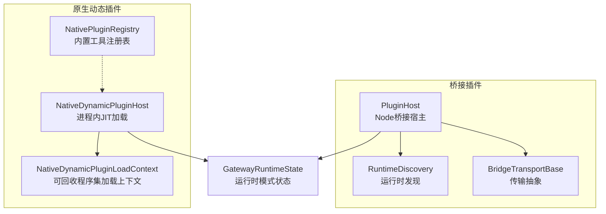
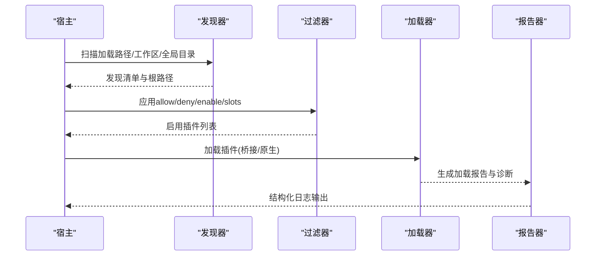
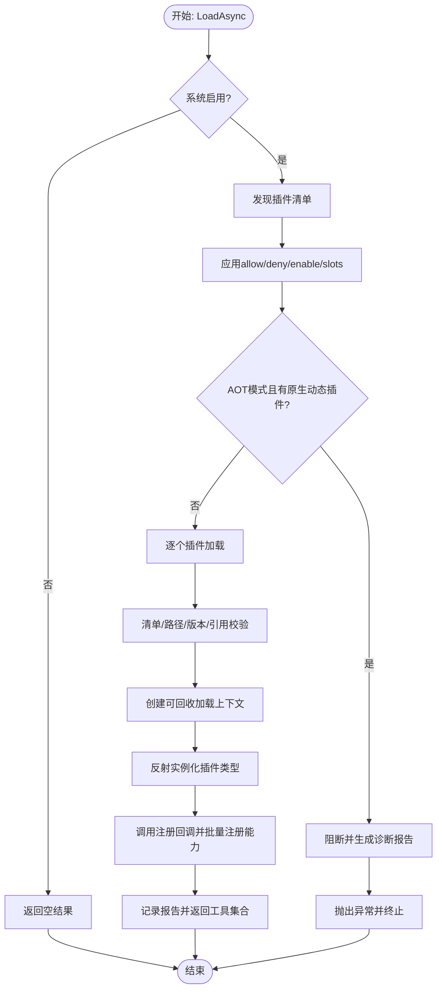
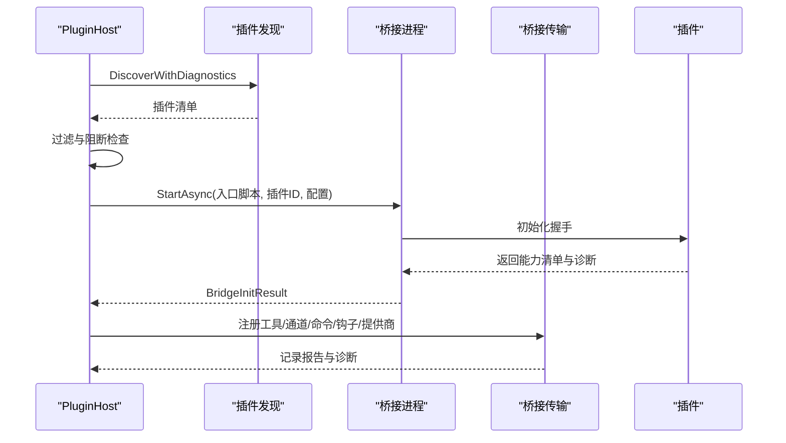
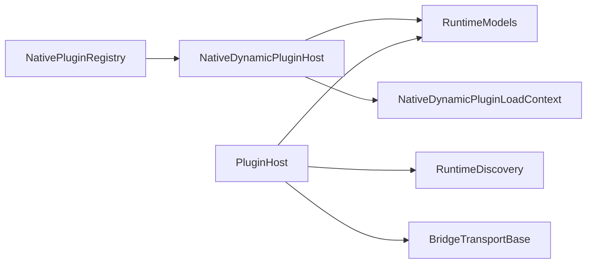

# 动态插件加载

<cite>
**本文引用的文件**
- [NativeDynamicPluginHost.cs](file://src/OpenClaw.Agent/Plugins/NativeDynamicPluginHost.cs)
- [PluginHost.cs](file://src/OpenClaw.Agent/Plugins/PluginHost.cs)
- [NativePluginRegistry.cs](file://src/OpenClaw.Agent/Plugins/NativePluginRegistry.cs)
- [RuntimeDiscovery.cs](file://src/OpenClaw.Agent/Plugins/RuntimeDiscovery.cs)
- [BridgeTransportBase.cs](file://src/OpenClaw.Agent/Plugins/BridgeTransportBase.cs)
- [PluginAdminSettingsService.cs](file://src/OpenClaw.Gateway/PluginAdminSettingsService.cs)
- [PluginHealthService.cs](file://src/OpenClaw.Gateway/PluginHealthService.cs)
- [RuntimeModels.cs](file://src/OpenClaw.Core/Models/RuntimeModels.cs)
- [NativeDynamicPluginHostTests.cs](file://src/OpenClaw.Tests/NativeDynamicPluginHostTests.cs)
- [CoreServicesExtensionsTests.cs](file://src/OpenClaw.Tests/CoreServicesExtensionsTests.cs)
- [PluginBridgeIntegrationTests.cs](file://src/OpenClaw.Tests/PluginBridgeIntegrationTests.cs)
</cite>

## 目录
1. [简介](#简介)
2. [项目结构](#项目结构)
3. [核心组件](#核心组件)
4. [架构总览](#架构总览)
5. [详细组件分析](#详细组件分析)
6. [依赖关系分析](#依赖关系分析)
7. [性能考量](#性能考量)
8. [故障排除指南](#故障排除指南)
9. [结论](#结论)
10. [附录](#附录)

## 简介
本文件系统化阐述动态插件加载机制，覆盖插件发现、加载、初始化的完整流程；解释插件宿主管理、程序集加载策略、依赖解析机制与版本兼容性检查；详述插件注册表管理、热重载支持现状、错误处理策略与性能优化技巧，并提供插件加载配置示例、调试方法与故障排除指南。

## 项目结构
动态插件系统由两类宿主协同工作：
- 原生动态插件宿主：在进程内以 JIT 模式加载 .NET 插件，使用独立的程序集加载上下文，支持工具、通道、命令、钩子、服务与内存提供器等能力注册。
- 桥接插件宿主：通过 Node.js 进程桥接外部语言插件，负责进程生命周期、传输层通信、能力协商与能力注册。

**图表来源**
- [NativeDynamicPluginHost.cs:19-51](file://src/OpenClaw.Agent/Plugins/NativeDynamicPluginHost.cs#L19-L51)
- [PluginHost.cs:14-53](file://src/OpenClaw.Agent/Plugins/PluginHost.cs#L14-L53)
- [RuntimeDiscovery.cs:8-84](file://src/OpenClaw.Agent/Plugins/RuntimeDiscovery.cs#L8-L84)
- [BridgeTransportBase.cs:10-38](file://src/OpenClaw.Agent/Plugins/BridgeTransportBase.cs#L10-L38)
- [RuntimeModels.cs:20-59](file://src/OpenClaw.Core/Models/RuntimeModels.cs#L20-L59)

**章节来源**
- [NativeDynamicPluginHost.cs:19-51](file://src/OpenClaw.Agent/Plugins/NativeDynamicPluginHost.cs#L19-L51)
- [PluginHost.cs:14-53](file://src/OpenClaw.Agent/Plugins/PluginHost.cs#L14-L53)
- [RuntimeModels.cs:20-59](file://src/OpenClaw.Core/Models/RuntimeModels.cs#L20-L59)

## 核心组件
- 原生动态插件宿主（NativeDynamicPluginHost）
  - 负责扫描与发现 openclaw.native-plugin.json 清单，过滤允许/拒绝列表与入口配置，执行 JIT-only 的程序集加载与类型验证，收集诊断信息并生成加载报告。
  - 使用可回收的程序集加载上下文隔离插件程序集，确保卸载与资源回收。
  - 支持能力声明与能力策略校验，阻断不兼容能力在 AOT 模式下的加载。
- 桥接插件宿主（PluginHost）
  - 发现 openclaw.plugin.json 清单，启动 Node.js 子进程，建立双向通信，注册工具、通道、命令、钩子与提供商等能力。
  - 执行能力兼容性检查与配置校验，记录加载报告。
- 运行时模式与策略
  - 通过运行时状态决定有效模式（AOT/JIT），并在加载阶段对能力进行阻断或警告。
- 注册表与偏好解析
  - 原生工具注册表用于构建内置工具集合，支持重复名称覆盖与偏好解析。
- 传输与运行时发现
  - 抽象传输层负责请求/响应与通知分发；运行时发现负责定位 Node.js 可执行文件。

**章节来源**
- [NativeDynamicPluginHost.cs:64-169](file://src/OpenClaw.Agent/Plugins/NativeDynamicPluginHost.cs#L64-L169)
- [PluginHost.cs:95-179](file://src/OpenClaw.Agent/Plugins/PluginHost.cs#L95-L179)
- [NativePluginRegistry.cs:13-104](file://src/OpenClaw.Agent/Plugins/NativePluginRegistry.cs#L13-L104)
- [RuntimeDiscovery.cs:8-84](file://src/OpenClaw.Agent/Plugins/RuntimeDiscovery.cs#L8-L84)
- [BridgeTransportBase.cs:10-76](file://src/OpenClaw.Agent/Plugins/BridgeTransportBase.cs#L10-L76)

## 架构总览
动态插件加载的整体流程如下：

**图表来源**
- [NativeDynamicPluginHost.cs:469-505](file://src/OpenClaw.Agent/Plugins/NativeDynamicPluginHost.cs#L469-L505)
- [PluginHost.cs:115-122](file://src/OpenClaw.Agent/Plugins/PluginHost.cs#L115-L122)

## 详细组件分析

### 原生动态插件宿主（NativeDynamicPluginHost）
职责与流程要点：
- 发现与过滤
  - 支持从配置路径、工作区隐藏目录与用户目录扫描插件清单；去重与路径安全校验（禁止越权根目录）。
  - 应用 allow/deny/enable/slots 过滤策略。
- 版本兼容性检查
  - 最低宿主版本与插件 API 版本校验，禁止主版本不匹配。
  - 插件引用的 PluginKit 主版本必须与宿主一致。
- 加载与初始化
  - 创建可回收的程序集加载上下文，按需解析依赖，避免污染宿主域。
  - 反射加载类型并实例化插件实现，调用注册回调，批量注册工具、通道、命令、钩子、提供商与内存提供器。
  - 对重复工具名进行告警并跳过，保留诊断记录。
- 运行时模式约束
  - 在 AOT 模式下直接阻断原生动态插件加载，返回明确诊断码与错误信息。
- 错误处理与清理
  - 失败时回滚已启动的服务与已加载的程序集，确保资源释放。
- 报告与诊断
  - 统一结构化日志输出，包含严重级别、诊断码、表面与路径等字段。

**图表来源**
- [NativeDynamicPluginHost.cs:64-169](file://src/OpenClaw.Agent/Plugins/NativeDynamicPluginHost.cs#L64-L169)
- [NativeDynamicPluginHost.cs:210-345](file://src/OpenClaw.Agent/Plugins/NativeDynamicPluginHost.cs#L210-L345)
- [NativeDynamicPluginHost.cs:700-811](file://src/OpenClaw.Agent/Plugins/NativeDynamicPluginHost.cs#L700-L811)

**章节来源**
- [NativeDynamicPluginHost.cs:64-169](file://src/OpenClaw.Agent/Plugins/NativeDynamicPluginHost.cs#L64-L169)
- [NativeDynamicPluginHost.cs:210-345](file://src/OpenClaw.Agent/Plugins/NativeDynamicPluginHost.cs#L210-L345)
- [NativeDynamicPluginHost.cs:700-811](file://src/OpenClaw.Agent/Plugins/NativeDynamicPluginHost.cs#L700-L811)

### 桥接插件宿主（PluginHost）
职责与流程要点：
- 发现与过滤
  - 发现 openclaw.plugin.json 清单，应用配置过滤策略。
- 初始化与能力协商
  - 启动 Node.js 子进程，发送初始化请求，接收能力清单与兼容性诊断。
  - 根据运行时模式阻断需要 JIT 的能力。
- 能力注册
  - 将工具包装为桥接工具，通道适配器与命令处理器绑定到桥接传输，事件钩子通过桥接注册。
- 报告与诊断
  - 记录工具/通道/命令/钩子/提供商数量与诊断信息。

**图表来源**
- [PluginHost.cs:95-179](file://src/OpenClaw.Agent/Plugins/PluginHost.cs#L95-L179)
- [PluginHost.cs:181-396](file://src/OpenClaw.Agent/Plugins/PluginHost.cs#L181-L396)
- [BridgeTransportBase.cs:40-76](file://src/OpenClaw.Agent/Plugins/BridgeTransportBase.cs#L40-L76)

**章节来源**
- [PluginHost.cs:95-179](file://src/OpenClaw.Agent/Plugins/PluginHost.cs#L95-L179)
- [PluginHost.cs:181-396](file://src/OpenClaw.Agent/Plugins/PluginHost.cs#L181-L396)
- [BridgeTransportBase.cs:40-76](file://src/OpenClaw.Agent/Plugins/BridgeTransportBase.cs#L40-L76)

### 原生工具注册表（NativePluginRegistry）
职责与流程要点：
- 构建内置工具集合，支持重复工具名覆盖与日志告警。
- 提供工具偏好解析逻辑，根据配置选择原生或桥接实现。
- 统一资源所有权与释放。

**章节来源**
- [NativePluginRegistry.cs:13-104](file://src/OpenClaw.Agent/Plugins/NativePluginRegistry.cs#L13-L104)
- [NativePluginRegistry.cs:137-233](file://src/OpenClaw.Agent/Plugins/NativePluginRegistry.cs#L137-L233)

### 运行时模式与能力策略
- 运行时状态
  - 请求模式、有效模式与动态代码支持能力三元组决定加载行为。
- 能力策略
  - 当有效模式为 AOT 时，对需要 JIT 的能力进行阻断并生成诊断码。
  - 原生动态插件默认具备“原生动态”能力，若声明技能则附加“技能”能力。

**章节来源**
- [RuntimeModels.cs:20-59](file://src/OpenClaw.Core/Models/RuntimeModels.cs#L20-L59)
- [NativeDynamicPluginHost.cs:87-130](file://src/OpenClaw.Agent/Plugins/NativeDynamicPluginHost.cs#L87-L130)
- [PluginHost.cs:232-272](file://src/OpenClaw.Agent/Plugins/PluginHost.cs#L232-L272)

### 程序集加载策略与依赖解析
- 原生动态插件
  - 使用可回收的程序集加载上下文，仅对系统/宿主/插件Kit等白名单程序集回退到当前域，其余依赖通过解析器定位并加载。
- 桥接插件
  - 通过 Node.js 进程加载外部语言实现，依赖 Node 生态的模块解析。

**章节来源**
- [NativeDynamicPluginHost.cs:882-906](file://src/OpenClaw.Agent/Plugins/NativeDynamicPluginHost.cs#L882-L906)
- [RuntimeDiscovery.cs:14-84](file://src/OpenClaw.Agent/Plugins/RuntimeDiscovery.cs#L14-L84)

## 依赖关系分析
- 宿主与运行时模式
  - 两者均依赖运行时状态进行能力阻断与诊断。
- 原生动态插件宿主
  - 依赖清单模型、能力策略、日志与诊断模型。
  - 依赖可回收加载上下文隔离插件域。
- 桥接插件宿主
  - 依赖传输抽象、运行时发现与 Node.js 可执行文件定位。
- 注册表
  - 与原生动态插件宿主协作，统一工具集合与偏好解析。

**图表来源**
- [NativeDynamicPluginHost.cs:23-51](file://src/OpenClaw.Agent/Plugins/NativeDynamicPluginHost.cs#L23-L51)
- [PluginHost.cs:16-53](file://src/OpenClaw.Agent/Plugins/PluginHost.cs#L16-L53)
- [RuntimeDiscovery.cs:8-84](file://src/OpenClaw.Agent/Plugins/RuntimeDiscovery.cs#L8-L84)
- [BridgeTransportBase.cs:10-38](file://src/OpenClaw.Agent/Plugins/BridgeTransportBase.cs#L10-L38)
- [NativePluginRegistry.cs:13-104](file://src/OpenClaw.Agent/Plugins/NativePluginRegistry.cs#L13-L104)

**章节来源**
- [NativeDynamicPluginHost.cs:23-51](file://src/OpenClaw.Agent/Plugins/NativeDynamicPluginHost.cs#L23-L51)
- [PluginHost.cs:16-53](file://src/OpenClaw.Agent/Plugins/PluginHost.cs#L16-L53)
- [RuntimeDiscovery.cs:8-84](file://src/OpenClaw.Agent/Plugins/RuntimeDiscovery.cs#L8-L84)
- [BridgeTransportBase.cs:10-38](file://src/OpenClaw.Agent/Plugins/BridgeTransportBase.cs#L10-L38)
- [NativePluginRegistry.cs:13-104](file://src/OpenClaw.Agent/Plugins/NativePluginRegistry.cs#L13-L104)

## 性能考量
- 程序集加载隔离
  - 原生动态插件使用可回收加载上下文，避免长期驻留导致的内存增长；失败时快速卸载与回滚。
- 并发与取消
  - 加载过程支持取消令牌，避免长时间阻塞；传输层请求超时控制降低等待时间。
- 重复项与冲突处理
  - 工具名称冲突直接跳过并记录告警，减少无效尝试。
- 运行时模式约束
  - 在 AOT 模式下提前阻断不兼容能力，避免无谓的加载与初始化开销。

**章节来源**
- [NativeDynamicPluginHost.cs:332-370](file://src/OpenClaw.Agent/Plugins/NativeDynamicPluginHost.cs#L332-L370)
- [BridgeTransportBase.cs:67-75](file://src/OpenClaw.Agent/Plugins/BridgeTransportBase.cs#L67-L75)

## 故障排除指南
常见问题与定位建议：
- AOT 模式下原生动态插件被阻断
  - 现象：加载失败并提示需要 JIT 模式。
  - 排查：确认运行时模式与插件能力是否包含 JIT-only 能力；必要时切换到 JIT 模式或移除相关能力。
  - 参考测试用例：[NativeDynamicPluginHostTests.cs:100-123](file://src/OpenClaw.Tests/NativeDynamicPluginHostTests.cs#L100-L123)
- 插件清单解析失败
  - 现象：报告包含“invalid_manifest”等诊断。
  - 排查：检查清单文件格式与字段完整性；查看报告中的路径定位具体问题。
  - 参考实现：[NativeDynamicPluginHost.cs:526-553](file://src/OpenClaw.Agent/Plugins/NativeDynamicPluginHost.cs#L526-L553)
- 程序集路径越权或不存在
  - 现象：报告包含“assembly_outside_root”或“assembly_not_found”。
  - 排查：确保 assemblyPath 解析后位于插件根目录内；确认文件存在。
  - 参考实现：[NativeDynamicPluginHost.cs:581-625](file://src/OpenClaw.Agent/Plugins/NativeDynamicPluginHost.cs#L581-L625)
- 插件 API 或宿主版本不兼容
  - 现象：报告包含“plugin_api_version_mismatch”或“host_version_too_old”。
  - 排查：升级宿主或插件至兼容版本；保持主版本一致。
  - 参考实现：[NativeDynamicPluginHost.cs:700-782](file://src/OpenClaw.Agent/Plugins/NativeDynamicPluginHost.cs#L700-L782)
- 插件引用的 PluginKit 主版本不匹配
  - 现象：报告包含“pluginkit_major_version_mismatch”。
  - 排查：确保插件引用的 PluginKit 与宿主主版本一致。
  - 参考实现：[NativeDynamicPluginHost.cs:785-811](file://src/OpenClaw.Agent/Plugins/NativeDynamicPluginHost.cs#L785-L811)
- 桥接插件能力不兼容
  - 现象：报告包含“jit_mode_required”等诊断。
  - 排查：确认插件声明的能力是否与当前运行时模式兼容；必要时调整模式或能力。
  - 参考实现：[PluginHost.cs:232-272](file://src/OpenClaw.Agent/Plugins/PluginHost.cs#L232-L272)
- 内存提供器未注册导致服务不可用
  - 现象：获取服务时报错提示“no dynamic native memory provider registered”。
  - 排查：确认已正确加载具备 memory 能力的原生动态插件并完成注册。
  - 参考测试用例：[CoreServicesExtensionsTests.cs:281-295](file://src/OpenClaw.Tests/CoreServicesExtensionsTests.cs#L281-L295)

**章节来源**
- [NativeDynamicPluginHostTests.cs:100-123](file://src/OpenClaw.Tests/NativeDynamicPluginHostTests.cs#L100-L123)
- [NativeDynamicPluginHost.cs:526-625](file://src/OpenClaw.Agent/Plugins/NativeDynamicPluginHost.cs#L526-L625)
- [NativeDynamicPluginHost.cs:700-811](file://src/OpenClaw.Agent/Plugins/NativeDynamicPluginHost.cs#L700-L811)
- [PluginHost.cs:232-272](file://src/OpenClaw.Agent/Plugins/PluginHost.cs#L232-L272)
- [CoreServicesExtensionsTests.cs:281-295](file://src/OpenClaw.Tests/CoreServicesExtensionsTests.cs#L281-L295)

## 结论
该动态插件系统通过原生动态与桥接两种宿主实现互补：前者在 JIT 环境下提供强类型与高性能的 .NET 插件体验，后者通过 Node 进程桥接多语言生态。系统在运行时模式、能力策略与版本兼容性方面提供了严格的约束与清晰的诊断输出，配合可回收加载上下文与传输层抽象，实现了稳定、可观测与可维护的插件加载体系。

## 附录

### 插件加载配置示例
- 原生动态插件配置要点
  - 启用开关、加载路径、允许/拒绝列表、入口配置（按插件 ID）。
  - 示例参考：[NativeDynamicPluginHostTests.cs:103-107](file://src/OpenClaw.Tests/NativeDynamicPluginHostTests.cs#L103-L107)
- 桥接插件配置要点
  - 启用开关、加载路径、入口脚本、传输方式、入口配置（按插件 ID）。
  - 示例参考：[PluginBridgeIntegrationTests.cs:867-871](file://src/OpenClaw.Tests/PluginBridgeIntegrationTests.cs#L867-L871)
- 运行时模式
  - 请求模式（auto/jit/aot）、动态代码支持能力；系统据此决定有效模式。
  - 示例参考：[RuntimeModels.cs:31-59](file://src/OpenClaw.Core/Models/RuntimeModels.cs#L31-L59)

**章节来源**
- [NativeDynamicPluginHostTests.cs:103-107](file://src/OpenClaw.Tests/NativeDynamicPluginHostTests.cs#L103-L107)
- [PluginBridgeIntegrationTests.cs:867-871](file://src/OpenClaw.Tests/PluginBridgeIntegrationTests.cs#L867-L871)
- [RuntimeModels.cs:31-59](file://src/OpenClaw.Core/Models/RuntimeModels.cs#L31-L59)

### 调试方法
- 查看加载报告
  - 通过 Reports 属性获取结构化诊断信息，包含严重级别、诊断码、表面与路径。
  - 参考实现：[NativeDynamicPluginHost.cs:171-188](file://src/OpenClaw.Agent/Plugins/NativeDynamicPluginHost.cs#L171-L188)，[PluginHost.cs:175-178](file://src/OpenClaw.Agent/Plugins/PluginHost.cs#L175-L178)
- 结构化日志
  - 宿主会将诊断以结构化日志形式输出，便于检索与聚合。
  - 参考实现：[NativeDynamicPluginHost.cs:183-186](file://src/OpenClaw.Agent/Plugins/NativeDynamicPluginHost.cs#L183-L186)
- 运行时健康快照
  - 通过健康服务汇总插件健康状态、诊断计数与重启次数等指标。
  - 参考实现：[PluginHealthService.cs:67-141](file://src/OpenClaw.Gateway/PluginHealthService.cs#L67-L141)

**章节来源**
- [NativeDynamicPluginHost.cs:171-188](file://src/OpenClaw.Agent/Plugins/NativeDynamicPluginHost.cs#L171-L188)
- [PluginHost.cs:175-178](file://src/OpenClaw.Agent/Plugins/PluginHost.cs#L175-L178)
- [PluginHealthService.cs:67-141](file://src/OpenClaw.Gateway/PluginHealthService.cs#L67-L141)

### 热重载支持
- 原生动态插件
  - 通过可回收加载上下文实现卸载与重新加载；失败时自动回滚。
  - 参考实现：[NativeDynamicPluginHost.cs:656-698](file://src/OpenClaw.Agent/Plugins/NativeDynamicPluginHost.cs#L656-L698)，[NativeDynamicPluginHost.cs:332-370](file://src/OpenClaw.Agent/Plugins/NativeDynamicPluginHost.cs#L332-L370)
- 桥接插件
  - 通过桥接进程生命周期管理，支持重启统计与内存快照查询。
  - 参考实现：[PluginHost.cs:500-522](file://src/OpenClaw.Agent/Plugins/PluginHost.cs#L500-L522)

**章节来源**
- [NativeDynamicPluginHost.cs:656-698](file://src/OpenClaw.Agent/Plugins/NativeDynamicPluginHost.cs#L656-L698)
- [NativeDynamicPluginHost.cs:332-370](file://src/OpenClaw.Agent/Plugins/NativeDynamicPluginHost.cs#L332-L370)
- [PluginHost.cs:500-522](file://src/OpenClaw.Agent/Plugins/PluginHost.cs#L500-L522)