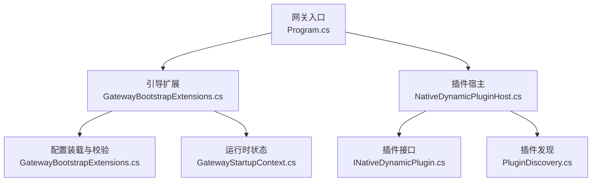
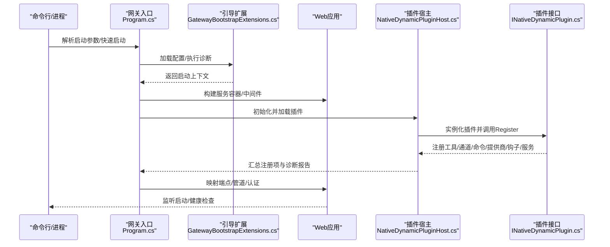
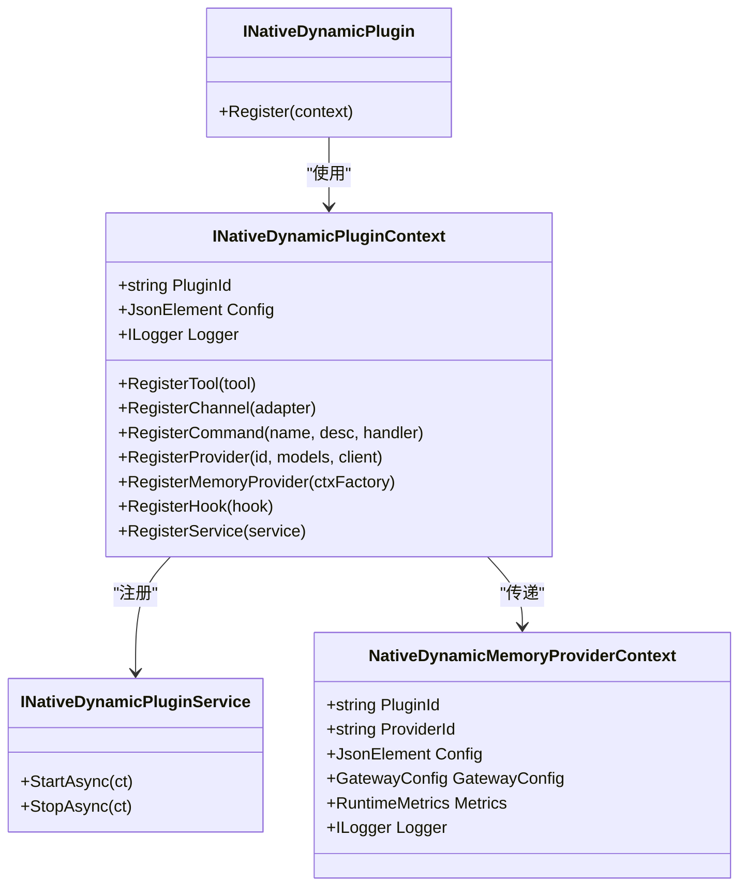
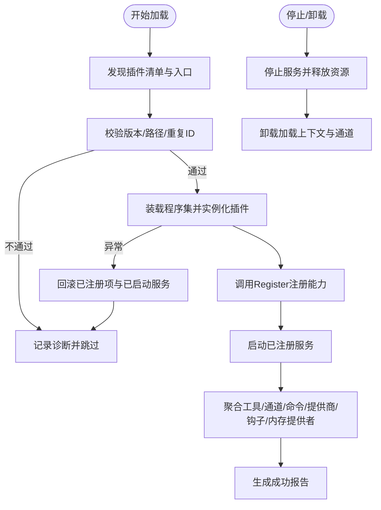
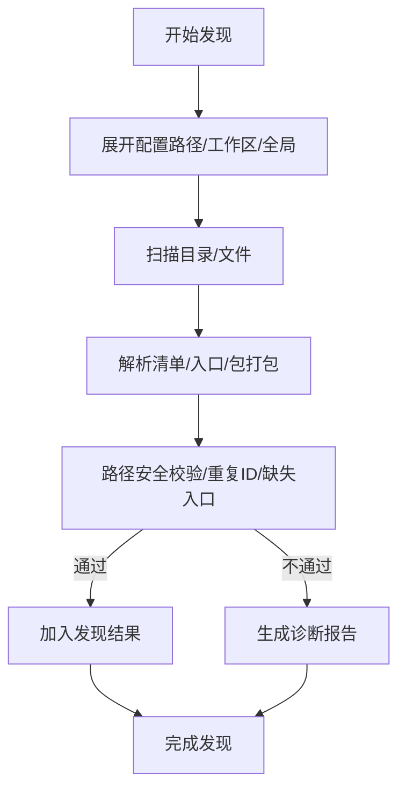
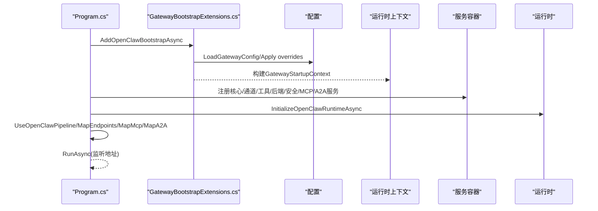
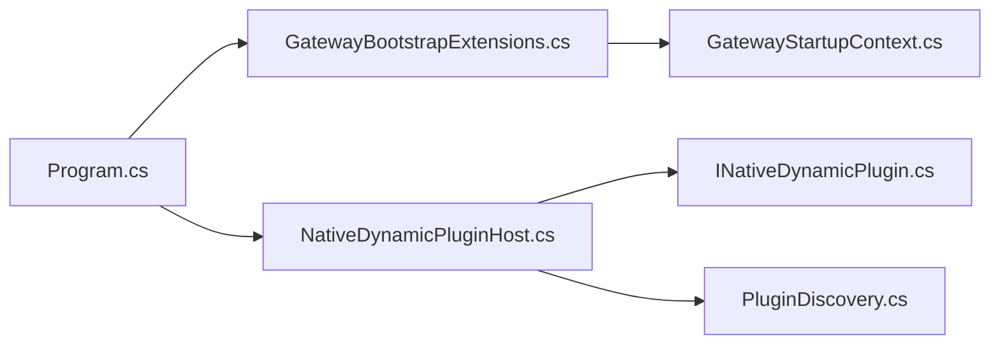

# 插件服务管理

<cite>
**本文引用的文件**
- [Program.cs](file://src/OpenClaw.Gateway/Program.cs)
- [GatewayBootstrapExtensions.cs](file://src/OpenClaw.Gateway/Bootstrap/GatewayBootstrapExtensions.cs)
- [GatewayStartupContext.cs](file://src/OpenClaw.Gateway/Bootstrap/GatewayStartupContext.cs)
- [INativeDynamicPlugin.cs](file://src/OpenClaw.PluginKit/INativeDynamicPlugin.cs)
- [NativeDynamicPluginHost.cs](file://src/OpenClaw.Agent/Plugins/NativeDynamicPluginHost.cs)
- [PluginDiscovery.cs](file://src/OpenClaw.Core/Plugins/PluginDiscovery.cs)
</cite>

## 目录
1. [简介](#简介)
2. [项目结构](#项目结构)
3. [核心组件](#核心组件)
4. [架构总览](#架构总览)
5. [详细组件分析](#详细组件分析)
6. [依赖关系分析](#依赖关系分析)
7. [性能考量](#性能考量)
8. [故障排查指南](#故障排查指南)
9. [结论](#结论)
10. [附录](#附录)

## 简介
本文件系统性阐述插件服务管理的设计与实现，覆盖插件服务注册、生命周期管理、依赖注入机制；服务接口定义、启动停止流程、资源清理策略、异常处理；服务发现、服务间通信、状态同步、监控指标收集；并提供服务开发示例、配置管理、调试技巧与性能优化建议。重点围绕动态原生插件（Native Dynamic Plugin）体系，结合网关启动引导、运行时状态与安全约束，形成从“发现—加载—注册—运行—清理”的完整闭环。

## 项目结构
插件服务管理涉及多个子系统协同：
- 网关入口与引导：负责解析配置、执行健康检查、构建服务容器、初始化运行时与中间件管线。
- 启动引导扩展：集中处理配置装载、环境变量覆盖、工具化兼容、运行模式解析与诊断。
- 运行时上下文：封装网关配置、运行态信息、绑定地址类型等，作为插件加载与注册的上下文。
- 插件接口与宿主：定义插件契约、承载插件发现、装配与生命周期管理。
- 核心插件发现：提供通用插件发现与过滤能力，支持多来源路径与包打包场景。

**图表来源**
- [Program.cs:14-124](file://src/OpenClaw.Gateway/Program.cs#L14-L124)
- [GatewayBootstrapExtensions.cs:18-135](file://src/OpenClaw.Gateway/Bootstrap/GatewayBootstrapExtensions.cs#L18-L135)
- [GatewayStartupContext.cs:6-15](file://src/OpenClaw.Gateway/Bootstrap/GatewayStartupContext.cs#L6-L15)
- [NativeDynamicPluginHost.cs:19-51](file://src/OpenClaw.Agent/Plugins/NativeDynamicPluginHost.cs#L19-L51)
- [INativeDynamicPlugin.cs:11-46](file://src/OpenClaw.PluginKit/INativeDynamicPlugin.cs#L11-L46)
- [PluginDiscovery.cs:11-63](file://src/OpenClaw.Core/Plugins/PluginDiscovery.cs#L11-L63)

**章节来源**
- [Program.cs:14-124](file://src/OpenClaw.Gateway/Program.cs#L14-L124)
- [GatewayBootstrapExtensions.cs:18-135](file://src/OpenClaw.Gateway/Bootstrap/GatewayBootstrapExtensions.cs#L18-L135)
- [GatewayStartupContext.cs:6-15](file://src/OpenClaw.Gateway/Bootstrap/GatewayStartupContext.cs#L6-L15)
- [NativeDynamicPluginHost.cs:19-51](file://src/OpenClaw.Agent/Plugins/NativeDynamicPluginHost.cs#L19-L51)
- [INativeDynamicPlugin.cs:11-46](file://src/OpenClaw.PluginKit/INativeDynamicPlugin.cs#L11-L46)
- [PluginDiscovery.cs:11-63](file://src/OpenClaw.Core/Plugins/PluginDiscovery.cs#L11-L63)

## 核心组件
- 网关入口与引导
  - 负责命令行参数解析、快速启动恢复、配置装载、服务注册、中间件映射、监听启动与异常恢复。
  - 关键点：应用启动事件回调用于标记“已启动”，便于启动失败恢复；健康检查模式与医生模式支持诊断。
- 引导扩展
  - 配置装载与来源诊断、非回环绑定安全校验、可选特性兼容性检查、环境变量覆盖、执行后端兼容、路径规范化。
- 运行时上下文
  - 封装网关配置、运行态（含运行模式）、是否非回环绑定、配置来源诊断、工作区路径、原生动态插件宿主实例。
- 插件接口与宿主
  - 插件契约定义注册能力（工具、通道、命令、模型提供商、内存提供者、钩子、服务）；宿主负责发现、验证、装配、启动/停止服务、清理资源。
- 插件发现
  - 支持标准清单、包打包、目录扫描、入口文件解析、路径安全校验（防越界与符号链接逃逸）。

**章节来源**
- [Program.cs:47-98](file://src/OpenClaw.Gateway/Program.cs#L47-L98)
- [GatewayBootstrapExtensions.cs:18-135](file://src/OpenClaw.Gateway/Bootstrap/GatewayBootstrapExtensions.cs#L18-L135)
- [GatewayStartupContext.cs:6-15](file://src/OpenClaw.Gateway/Bootstrap/GatewayStartupContext.cs#L6-L15)
- [INativeDynamicPlugin.cs:11-46](file://src/OpenClaw.PluginKit/INativeDynamicPlugin.cs#L11-L46)
- [NativeDynamicPluginHost.cs:64-169](file://src/OpenClaw.Agent/Plugins/NativeDynamicPluginHost.cs#L64-L169)
- [PluginDiscovery.cs:22-63](file://src/OpenClaw.Core/Plugins/PluginDiscovery.cs#L22-L63)

## 架构总览
下图展示从网关启动到插件加载与注册的整体流程，以及关键组件间的交互关系。

**图表来源**
- [Program.cs:47-98](file://src/OpenClaw.Gateway/Program.cs#L47-L98)
- [GatewayBootstrapExtensions.cs:18-135](file://src/OpenClaw.Gateway/Bootstrap/GatewayBootstrapExtensions.cs#L18-L135)
- [NativeDynamicPluginHost.cs:210-305](file://src/OpenClaw.Agent/Plugins/NativeDynamicPluginHost.cs#L210-L305)
- [INativeDynamicPlugin.cs:13](file://src/OpenClaw.PluginKit/INativeDynamicPlugin.cs#L13)

**章节来源**
- [Program.cs:47-98](file://src/OpenClaw.Gateway/Program.cs#L47-L98)
- [GatewayBootstrapExtensions.cs:18-135](file://src/OpenClaw.Gateway/Bootstrap/GatewayBootstrapExtensions.cs#L18-L135)
- [NativeDynamicPluginHost.cs:210-305](file://src/OpenClaw.Agent/Plugins/NativeDynamicPluginHost.cs#L210-L305)
- [INativeDynamicPlugin.cs:13](file://src/OpenClaw.PluginKit/INativeDynamicPlugin.cs#L13)

## 详细组件分析

### 组件一：插件接口与注册上下文
- 接口职责
  - 插件通过注册上下文声明能力：工具、通道适配器、命令、模型提供商、内存提供者工厂、钩子、服务。
  - 服务需实现异步启动/停止，由宿主统一管理生命周期。
- 注册上下文
  - 提供插件标识、配置、日志记录器；支持批量注册与能力汇总，便于后续能力评估与诊断。
- 内存提供者上下文
  - 提供插件ID、提供者ID、配置、网关配置、运行指标、日志器，便于内存提供者按插件维度隔离与观测。

**图表来源**
- [INativeDynamicPlugin.cs:11-46](file://src/OpenClaw.PluginKit/INativeDynamicPlugin.cs#L11-L46)

**章节来源**
- [INativeDynamicPlugin.cs:11-46](file://src/OpenClaw.PluginKit/INativeDynamicPlugin.cs#L11-L46)

### 组件二：原生动态插件宿主（加载与生命周期）
- 发现与过滤
  - 支持多路径发现（配置路径、工作区、用户目录），解析清单与入口文件，进行重复ID与越界校验。
- 装载与验证
  - 基于独立加载上下文装载插件程序集，校验插件套件版本兼容性与最小宿主版本要求。
- 注册与聚合
  - 收集工具、通道、命令、提供商、内存提供者、钩子与服务，生成诊断报告与加载统计。
- 生命周期管理
  - 启动阶段逐个调用服务StartAsync；停止阶段优先StopAsync，失败时尽力清理；卸载时释放加载上下文与通道资源。
- 清理策略
  - 失败加载时回滚已注册项与已启动服务；关闭时遍历所有已加载插件与通道进行资源回收。

**图表来源**
- [NativeDynamicPluginHost.cs:64-169](file://src/OpenClaw.Agent/Plugins/NativeDynamicPluginHost.cs#L64-L169)
- [NativeDynamicPluginHost.cs:210-345](file://src/OpenClaw.Agent/Plugins/NativeDynamicPluginHost.cs#L210-L345)
- [NativeDynamicPluginHost.cs:353-370](file://src/OpenClaw.Agent/Plugins/NativeDynamicPluginHost.cs#L353-L370)
- [NativeDynamicPluginHost.cs:656-698](file://src/OpenClaw.Agent/Plugins/NativeDynamicPluginHost.cs#L656-L698)

**章节来源**
- [NativeDynamicPluginHost.cs:64-169](file://src/OpenClaw.Agent/Plugins/NativeDynamicPluginHost.cs#L64-L169)
- [NativeDynamicPluginHost.cs:210-345](file://src/OpenClaw.Agent/Plugins/NativeDynamicPluginHost.cs#L210-L345)
- [NativeDynamicPluginHost.cs:353-370](file://src/OpenClaw.Agent/Plugins/NativeDynamicPluginHost.cs#L353-L370)
- [NativeDynamicPluginHost.cs:656-698](file://src/OpenClaw.Agent/Plugins/NativeDynamicPluginHost.cs#L656-L698)

### 组件三：插件发现与安全校验
- 发现策略
  - 优先级：配置路径 → 工作区 → 全局 → 打包扩展；支持单文件、目录清单、包打包（package.json openclaw.extensions）。
- 安全校验
  - 入口文件必须位于插件根目录内，防止符号链接逃逸；对重复ID进行去重与警告；对越界路径与缺失入口生成诊断。
- 路径解析
  - 使用真实路径解析与比较，避免大小写差异与符号链接陷阱。

**图表来源**
- [PluginDiscovery.cs:22-63](file://src/OpenClaw.Core/Plugins/PluginDiscovery.cs#L22-L63)
- [PluginDiscovery.cs:183-286](file://src/OpenClaw.Core/Plugins/PluginDiscovery.cs#L183-L286)
- [PluginDiscovery.cs:288-431](file://src/OpenClaw.Core/Plugins/PluginDiscovery.cs#L288-L431)
- [PluginDiscovery.cs:503-533](file://src/OpenClaw.Core/Plugins/PluginDiscovery.cs#L503-L533)

**章节来源**
- [PluginDiscovery.cs:22-63](file://src/OpenClaw.Core/Plugins/PluginDiscovery.cs#L22-L63)
- [PluginDiscovery.cs:183-286](file://src/OpenClaw.Core/Plugins/PluginDiscovery.cs#L183-L286)
- [PluginDiscovery.cs:288-431](file://src/OpenClaw.Core/Plugins/PluginDiscovery.cs#L288-L431)
- [PluginDiscovery.cs:503-533](file://src/OpenClaw.Core/Plugins/PluginDiscovery.cs#L503-L533)

### 组件四：网关启动与引导集成
- 启动流程
  - 解析启动选项与快速启动会话；装载配置并执行引导扩展；构建服务容器并注册核心/通道/工具/后端/安全/MCP/A2A服务；初始化运行时与中间件；映射端点与管道；启动监听。
- 异常与恢复
  - 启动前异常触发交互式恢复（快速启动/医生模式/建议提示）；启动后异常不进入恢复循环。
- 安全与诊断
  - 非回环绑定强制鉴权令牌；健康检查模式直接访问 /health；医生模式输出配置来源与诊断。

**图表来源**
- [Program.cs:47-98](file://src/OpenClaw.Gateway/Program.cs#L47-L98)
- [GatewayBootstrapExtensions.cs:18-135](file://src/OpenClaw.Gateway/Bootstrap/GatewayBootstrapExtensions.cs#L18-L135)
- [GatewayStartupContext.cs:6-15](file://src/OpenClaw.Gateway/Bootstrap/GatewayStartupContext.cs#L6-L15)

**章节来源**
- [Program.cs:47-98](file://src/OpenClaw.Gateway/Program.cs#L47-L98)
- [GatewayBootstrapExtensions.cs:18-135](file://src/OpenClaw.Gateway/Bootstrap/GatewayBootstrapExtensions.cs#L18-L135)
- [GatewayStartupContext.cs:6-15](file://src/OpenClaw.Gateway/Bootstrap/GatewayStartupContext.cs#L6-L15)

## 依赖关系分析
- 组件耦合
  - 网关入口依赖引导扩展与运行时上下文；运行时上下文持有插件宿主实例，形成“引导→宿主”的控制流。
  - 插件宿主依赖插件接口与核心发现模块；接口定义为插件与宿主之间的契约边界。
- 外部依赖
  - 配置系统（IConfiguration）、服务集合（IServiceCollection）、运行时模式解析、安全策略与健康检查。
- 循环依赖
  - 当前设计以“引导→宿主→接口”为主线，未见明显循环依赖迹象。

**图表来源**
- [Program.cs:47-98](file://src/OpenClaw.Gateway/Program.cs#L47-L98)
- [GatewayBootstrapExtensions.cs:18-135](file://src/OpenClaw.Gateway/Bootstrap/GatewayBootstrapExtensions.cs#L18-L135)
- [GatewayStartupContext.cs:6-15](file://src/OpenClaw.Gateway/Bootstrap/GatewayStartupContext.cs#L6-L15)
- [NativeDynamicPluginHost.cs:19-51](file://src/OpenClaw.Agent/Plugins/NativeDynamicPluginHost.cs#L19-L51)
- [INativeDynamicPlugin.cs:11-46](file://src/OpenClaw.PluginKit/INativeDynamicPlugin.cs#L11-L46)
- [PluginDiscovery.cs:11-63](file://src/OpenClaw.Core/Plugins/PluginDiscovery.cs#L11-L63)

**章节来源**
- [Program.cs:47-98](file://src/OpenClaw.Gateway/Program.cs#L47-L98)
- [GatewayBootstrapExtensions.cs:18-135](file://src/OpenClaw.Gateway/Bootstrap/GatewayBootstrapExtensions.cs#L18-L135)
- [GatewayStartupContext.cs:6-15](file://src/OpenClaw.Gateway/Bootstrap/GatewayStartupContext.cs#L6-L15)
- [NativeDynamicPluginHost.cs:19-51](file://src/OpenClaw.Agent/Plugins/NativeDynamicPluginHost.cs#L19-L51)
- [INativeDynamicPlugin.cs:11-46](file://src/OpenClaw.PluginKit/INativeDynamicPlugin.cs#L11-L46)
- [PluginDiscovery.cs:11-63](file://src/OpenClaw.Core/Plugins/PluginDiscovery.cs#L11-L63)

## 性能考量
- 插件发现与装载
  - 采用分层发现与去重策略，减少重复扫描；路径解析与符号链接处理在发现阶段完成，降低运行时开销。
- 生命周期管理
  - 服务启动/停止采用异步并行策略（在宿主内部逐个服务执行），避免阻塞主线程；失败时尽力清理，确保资源回收。
- 配置与诊断
  - 配置来源诊断仅在医生模式或错误时输出，避免生产环境冗余日志；健康检查短超时，降低对主流程影响。
- 运行模式限制
  - AOT 模式下禁止动态原生插件，提前在加载阶段抛出异常，避免运行期性能退化与安全风险。

[本节为通用指导，无需列出具体文件来源]

## 故障排查指南
- 启动失败恢复
  - 启动前异常：根据交互式恢复策略尝试快速启动、医生模式或退出码提示；记录启动失败报告。
  - 启动后异常：不进入恢复循环，直接退出并返回错误码。
- 插件加载失败
  - 版本不兼容（最小宿主版本、插件API主版本）：在报告中明确错误码与原因；AOT 模式下动态插件被阻止。
  - 路径越界或入口缺失：生成诊断并跳过该插件；重复ID仅保留首个并警告。
  - 加载过程中断：尽力回滚已注册项与已启动服务，并卸载加载上下文。
- 资源清理
  - 关闭时遍历所有已加载插件与通道，逐一调用停止与释放，确保无悬挂资源。
- 健康检查
  - 非回环绑定且存在鉴权令牌时，健康检查请求自动附加 Bearer 认证头；短超时避免阻塞。

**章节来源**
- [Program.cs:99-122](file://src/OpenClaw.Gateway/Program.cs#L99-L122)
- [NativeDynamicPluginHost.cs:700-782](file://src/OpenClaw.Agent/Plugins/NativeDynamicPluginHost.cs#L700-L782)
- [NativeDynamicPluginHost.cs:332-370](file://src/OpenClaw.Agent/Plugins/NativeDynamicPluginHost.cs#L332-L370)
- [NativeDynamicPluginHost.cs:656-698](file://src/OpenClaw.Agent/Plugins/NativeDynamicPluginHost.cs#L656-L698)
- [GatewayBootstrapExtensions.cs:402-419](file://src/OpenClaw.Gateway/Bootstrap/GatewayBootstrapExtensions.cs#L402-L419)

## 结论
本插件服务管理体系以“引导—宿主—接口—发现”为核心，实现了从配置装载、安全校验、插件发现、装载注册到生命周期管理与资源清理的完整闭环。通过严格的版本与路径校验、清晰的契约接口与异步生命周期管理，既保证了运行稳定性，也为开发者提供了灵活的扩展能力。建议在生产环境中启用医生模式进行预检，遵循配置来源诊断与健康检查机制，确保插件加载与运行的可观测性与可控性。

[本节为总结性内容，无需列出具体文件来源]

## 附录

### 服务接口定义与依赖注入要点
- 插件接口
  - 通过 INativeDynamicPlugin.Register 提供统一注册入口，宿主据此收集工具、通道、命令、提供商、钩子与服务。
- 依赖注入
  - 在网关引导阶段注册核心服务与插件能力；插件服务由宿主统一启动/停止，避免与框架容器混战。
- 配置注入
  - 插件配置通过注册上下文注入，支持 JSON Element 形式，便于插件按需读取。

**章节来源**
- [INativeDynamicPlugin.cs:11-46](file://src/OpenClaw.PluginKit/INativeDynamicPlugin.cs#L11-L46)
- [Program.cs:67-78](file://src/OpenClaw.Gateway/Program.cs#L67-L78)

### 启动停止流程与资源清理
- 启动
  - 引导扩展完成配置装载与诊断；宿主加载插件并启动服务；网关映射端点与中间件；监听启动。
- 停止
  - 宿主逐个停止服务并释放资源；卸载插件加载上下文与通道；清理内部集合与诊断报告。
- 清理
  - 失败加载时回滚已注册项与已启动服务；关闭时尽力释放所有资源。

**章节来源**
- [Program.cs:83-98](file://src/OpenClaw.Gateway/Program.cs#L83-L98)
- [NativeDynamicPluginHost.cs:246-250](file://src/OpenClaw.Agent/Plugins/NativeDynamicPluginHost.cs#L246-L250)
- [NativeDynamicPluginHost.cs:656-698](file://src/OpenClaw.Agent/Plugins/NativeDynamicPluginHost.cs#L656-L698)

### 服务发现、服务间通信与状态同步
- 服务发现
  - 通过插件发现模块扫描多来源路径，解析清单与入口，进行安全校验与重复ID处理。
- 服务间通信
  - 插件通过注册上下文声明能力，由宿主统一纳入网关运行时；工具、通道、命令、提供商等能力在运行时统一调度。
- 状态同步
  - 宿主维护插件加载报告与诊断集合，便于状态同步与可观测性输出。

**章节来源**
- [PluginDiscovery.cs:22-63](file://src/OpenClaw.Core/Plugins/PluginDiscovery.cs#L22-L63)
- [NativeDynamicPluginHost.cs:53-62](file://src/OpenClaw.Agent/Plugins/NativeDynamicPluginHost.cs#L53-L62)

### 监控指标收集
- 指标来源
  - 插件内存提供者上下文包含运行指标对象，便于按插件维度采集与上报。
- 输出方式
  - 结构化日志输出诊断信息，包括严重级别、错误码、表面、路径与消息，便于外部监控系统消费。

**章节来源**
- [INativeDynamicPlugin.cs:31-39](file://src/OpenClaw.PluginKit/INativeDynamicPlugin.cs#L31-L39)
- [NativeDynamicPluginHost.cs:171-188](file://src/OpenClaw.Agent/Plugins/NativeDynamicPluginHost.cs#L171-L188)

### 配置管理与调试技巧
- 配置来源
  - 支持配置文件覆盖、环境变量、工具化覆盖与执行兼容性调整；路径规范化与符号链接安全处理。
- 调试技巧
  - 医生模式输出配置来源与诊断；健康检查模式快速验证服务可用性；非回环绑定强制鉴权令牌。
- 性能优化建议
  - 启用医生模式进行预检；避免在 AOT 模式下启用动态原生插件；合理设置插件白名单与禁用列表。

**章节来源**
- [GatewayBootstrapExtensions.cs:143-159](file://src/OpenClaw.Gateway/Bootstrap/GatewayBootstrapExtensions.cs#L143-L159)
- [GatewayBootstrapExtensions.cs:173-217](file://src/OpenClaw.Gateway/Bootstrap/GatewayBootstrapExtensions.cs#L173-L217)
- [GatewayBootstrapExtensions.cs:402-419](file://src/OpenClaw.Gateway/Bootstrap/GatewayBootstrapExtensions.cs#L402-L419)