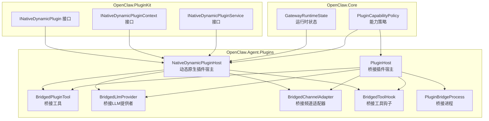
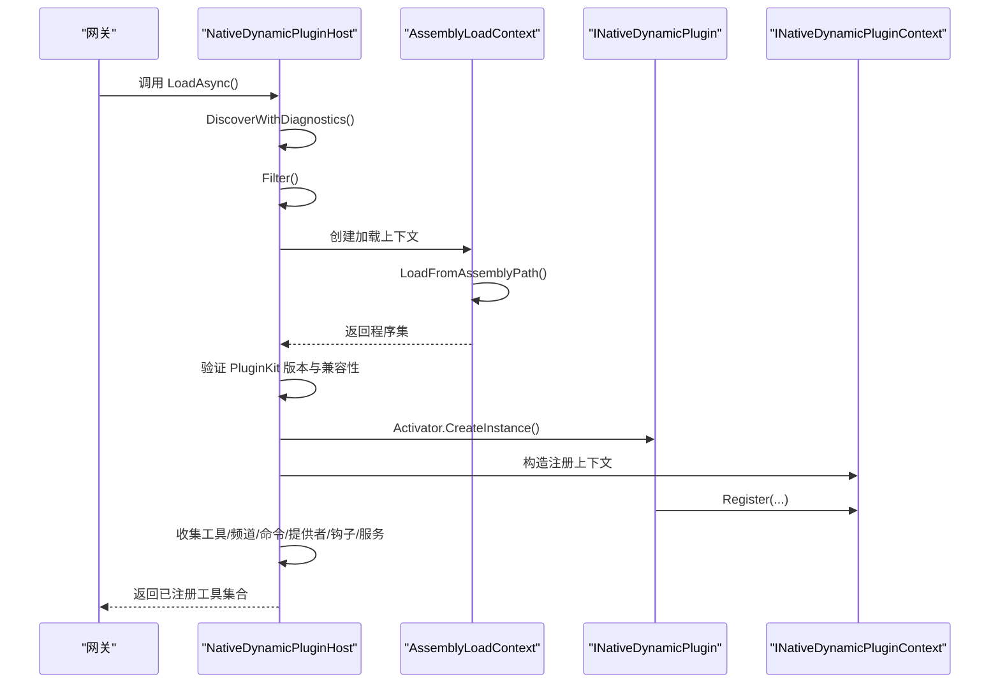
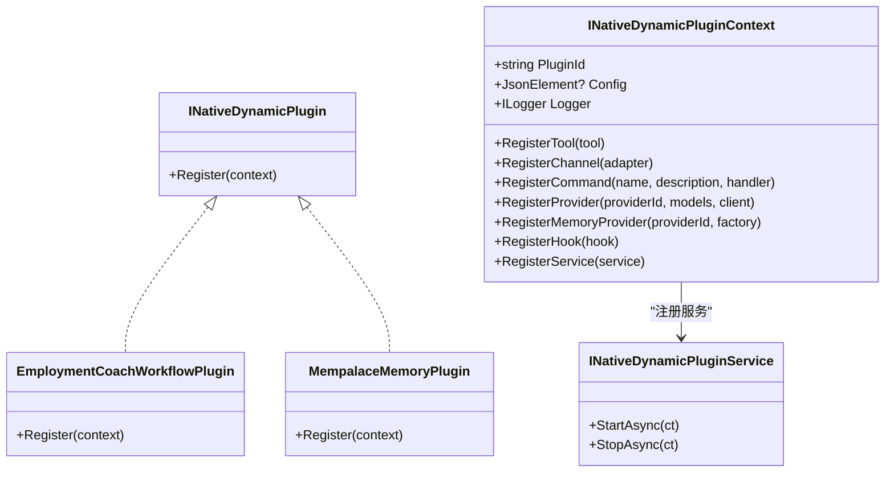
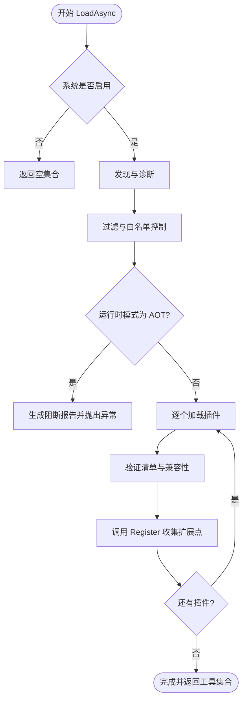
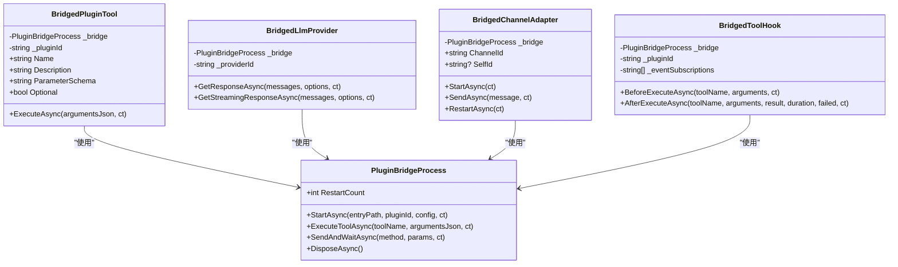
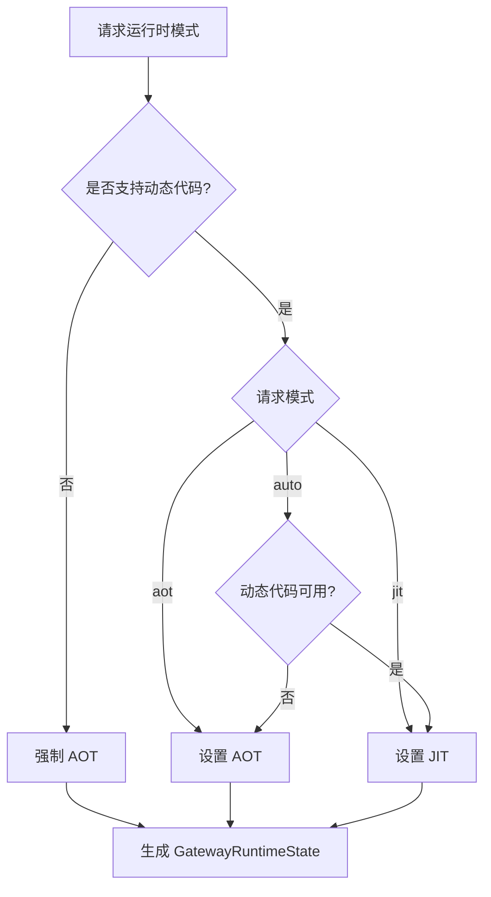
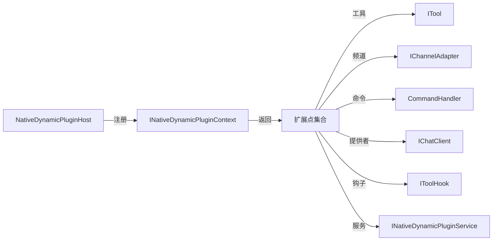

# 插件架构设计

<cite>
**本文档引用的文件**
- [INativeDynamicPlugin.cs](file://src/OpenClaw.PluginKit/INativeDynamicPlugin.cs)
- [NativeDynamicPluginHost.cs](file://src/OpenClaw.Agent/Plugins/NativeDynamicPluginHost.cs)
- [PluginHost.cs](file://src/OpenClaw.Agent/Plugins/PluginHost.cs)
- [BridgedPluginTool.cs](file://src/OpenClaw.Agent/Plugins/BridgedPluginTool.cs)
- [BridgedLlmProvider.cs](file://src/OpenClaw.Agent/Plugins/BridgedLlmProvider.cs)
- [BridgedChannelAdapter.cs](file://src/OpenClaw.Agent/Plugins/BridgedChannelAdapter.cs)
- [BridgedToolHook.cs](file://src/OpenClaw.Agent/Plugins/BridgedToolHook.cs)
- [PluginBridgeProcess.cs](file://src/OpenClaw.Agent/Plugins/PluginBridgeProcess.cs)
- [EmploymentCoachWorkflowPlugin.cs](file://src/OpenClaw.Plugins.EmploymentCoachWorkflow/EmploymentCoachWorkflowPlugin.cs)
- [MempalaceMemoryPlugin.cs](file://src/OpenClaw.Plugins.Mempalace/MempalaceMemoryPlugin.cs)
- [openclaw-plugin-system-analysis.md](file://docs/openclaw-plugin-system-analysis.md)
- [RuntimeModels.cs](file://src/OpenClaw.Core/Models/RuntimeModels.cs)
</cite>

## 目录
1. [简介](#简介)
2. [项目结构](#项目结构)
3. [核心组件](#核心组件)
4. [架构总览](#架构总览)
5. [详细组件分析](#详细组件分析)
6. [依赖关系分析](#依赖关系分析)
7. [性能考虑](#性能考虑)
8. [故障排除指南](#故障排除指南)
9. [结论](#结论)

## 简介
本文件系统性阐述 OpenClaw 插件架构设计，重点围绕动态原生插件系统（Native Dynamic Plugin）展开，涵盖整体架构、核心接口设计、组件交互模式、生命周期管理机制、安全边界与运行时策略。通过对 INativeDynamicPlugin 接口、INativeDynamicPluginContext 上下文、插件宿主 NativeDynamicPluginHost 的深入分析，帮助开发者理解插件系统的设计理念与实现原理。

## 项目结构
OpenClaw 插件系统由三大核心模块协同构成：
- **OpenClaw.PluginKit**：提供动态 .NET 插件的公共 SDK，定义 INativeDynamicPlugin 及其上下文接口。
- **OpenClaw.Agent**：负责插件发现、加载、桥接与生命周期管理，包含原生动态插件宿主与桥接适配器。
- **OpenClaw.Core**：提供运行时模型、能力策略与通用抽象，支撑插件系统在 AOT/JIT 环境下的安全运行。

**图表来源**
- [INativeDynamicPlugin.cs:11-46](file://src/OpenClaw.PluginKit/INativeDynamicPlugin.cs#L11-L46)
- [NativeDynamicPluginHost.cs:19-62](file://src/OpenClaw.Agent/Plugins/NativeDynamicPluginHost.cs#L19-L62)
- [PluginHost.cs:14-53](file://src/OpenClaw.Agent/Plugins/PluginHost.cs#L14-L53)
- [BridgedPluginTool.cs:10-40](file://src/OpenClaw.Agent/Plugins/BridgedPluginTool.cs#L10-L40)
- [BridgedLlmProvider.cs:13-74](file://src/OpenClaw.Agent/Plugins/BridgedLlmProvider.cs#L13-L74)
- [BridgedChannelAdapter.cs:13-44](file://src/OpenClaw.Agent/Plugins/BridgedChannelAdapter.cs#L13-L44)
- [BridgedToolHook.cs:13-30](file://src/OpenClaw.Agent/Plugins/BridgedToolHook.cs#L13-L30)
- [PluginBridgeProcess.cs:16-61](file://src/OpenClaw.Agent/Plugins/PluginBridgeProcess.cs#L16-L61)
- [RuntimeModels.cs:20-27](file://src/OpenClaw.Core/Models/RuntimeModels.cs#L20-L27)

**章节来源**
- [openclaw-plugin-system-analysis.md:1-439](file://docs/openclaw-plugin-system-analysis.md#L1-L439)

## 核心组件
本节聚焦动态原生插件系统的核心接口与上下文对象，阐明插件如何向宿主注册扩展点。

- **INativeDynamicPlugin 接口**
  - 插件入口点，通过 Register 方法接收上下文，完成工具、频道、命令、提供者、内存提供者、钩子和服务的注册。
  - 示例实现参见 EmploymentCoachWorkflowPlugin 与 MempalaceMemoryPlugin。

- **INativeDynamicPluginContext 上下文**
  - 提供插件标识、配置、日志记录器等基础能力。
  - 支持注册工具、频道适配器、命令处理器、LLM 提供者、内存提供者工厂、工具钩子与自定义服务。
  - 内存提供者上下文 NativeDynamicMemoryProviderContext 提供网关配置、指标与日志记录器，便于插件创建内存存储实例。

- **INativeDynamicPluginService 服务接口**
  - 定义插件生命周期服务的启动与停止方法，由宿主统一管理与销毁。

**章节来源**
- [INativeDynamicPlugin.cs:11-46](file://src/OpenClaw.PluginKit/INativeDynamicPlugin.cs#L11-L46)
- [EmploymentCoachWorkflowPlugin.cs:5-10](file://src/OpenClaw.Plugins.EmploymentCoachWorkflow/EmploymentCoachWorkflowPlugin.cs#L5-L10)
- [MempalaceMemoryPlugin.cs:6-20](file://src/OpenClaw.Plugins.Mempalace/MempalaceMemoryPlugin.cs#L6-L20)

## 架构总览
动态原生插件系统采用“进程内 JIT 专用”的设计，通过 AssemblyLoadContext 实现可卸载的程序集加载，确保热重载与隔离。宿主负责发现、验证、加载与生命周期管理，并将插件扩展点注册到统一的运行时。

**图表来源**
- [NativeDynamicPluginHost.cs:64-169](file://src/OpenClaw.Agent/Plugins/NativeDynamicPluginHost.cs#L64-L169)
- [NativeDynamicPluginHost.cs:210-345](file://src/OpenClaw.Agent/Plugins/NativeDynamicPluginHost.cs#L210-L345)

**章节来源**
- [NativeDynamicPluginHost.cs:19-62](file://src/OpenClaw.Agent/Plugins/NativeDynamicPluginHost.cs#L19-L62)
- [openclaw-plugin-system-analysis.md:334-387](file://docs/openclaw-plugin-system-analysis.md#L334-L387)

## 详细组件分析

### INativeDynamicPlugin 接口与实现
- 设计要点
  - 通过 Register 方法集中注册扩展点，避免分散初始化。
  - 使用上下文注入配置与日志，提升插件可测试性与可观测性。
- 典型实现
  - EmploymentCoachWorkflowPlugin：演示最小化注册骨架。
  - MempalaceMemoryPlugin：展示内存提供者注册与工具联动。

**图表来源**
- [INativeDynamicPlugin.cs:11-46](file://src/OpenClaw.PluginKit/INativeDynamicPlugin.cs#L11-L46)
- [EmploymentCoachWorkflowPlugin.cs:5-10](file://src/OpenClaw.Plugins.EmploymentCoachWorkflow/EmploymentCoachWorkflowPlugin.cs#L5-L10)
- [MempalaceMemoryPlugin.cs:6-20](file://src/OpenClaw.Plugins.Mempalace/MempalaceMemoryPlugin.cs#L6-L20)

**章节来源**
- [INativeDynamicPlugin.cs:11-46](file://src/OpenClaw.PluginKit/INativeDynamicPlugin.cs#L11-L46)
- [EmploymentCoachWorkflowPlugin.cs:5-10](file://src/OpenClaw.Plugins.EmploymentCoachWorkflow/EmploymentCoachWorkflowPlugin.cs#L5-L10)
- [MempalaceMemoryPlugin.cs:6-20](file://src/OpenClaw.Plugins.Mempalace/MempalaceMemoryPlugin.cs#L6-L20)

### NativeDynamicPluginHost 生命周期与安全边界
- 发现阶段
  - 支持配置路径、工作区与全局目录的多级扫描，解析 openclaw.native-plugin.json 清单。
  - 校验程序集路径在插件根目录内，防止符号链接逃逸。
- 过滤与能力策略
  - 基于 Allow/Deny/Entries 控制启用范围。
  - AOT 模式下禁止动态原生插件，通过能力策略阻断不兼容能力。
- 加载阶段
  - 使用 AssemblyLoadContext 加载程序集，验证最低宿主版本与 PluginKit 主版本一致性。
  - 实例化插件并调用 Register，收集注册的扩展点。
- 错误处理与清理
  - 失败时回滚已注册项并释放资源，保证宿主状态一致。
- 关闭阶段
  - 有序停止服务、释放加载上下文与资源。

**图表来源**
- [NativeDynamicPluginHost.cs:64-169](file://src/OpenClaw.Agent/Plugins/NativeDynamicPluginHost.cs#L64-L169)
- [NativeDynamicPluginHost.cs:210-345](file://src/OpenClaw.Agent/Plugins/NativeDynamicPluginHost.cs#L210-L345)

**章节来源**
- [NativeDynamicPluginHost.cs:64-169](file://src/OpenClaw.Agent/Plugins/NativeDynamicPluginHost.cs#L64-L169)
- [NativeDynamicPluginHost.cs:210-345](file://src/OpenClaw.Agent/Plugins/NativeDynamicPluginHost.cs#L210-L345)
- [RuntimeModels.cs:20-27](file://src/OpenClaw.Core/Models/RuntimeModels.cs#L20-L27)

### 扩展点注册与桥接适配器
- 工具注册
  - 通过 BridgedPluginTool 将桥接插件的工具暴露为 ITool，实现参数序列化与执行转发。
- LLM 提供者注册
  - BridgedLlmProvider 将插件提供的提供者包装为 IChatClient，支持同步与流式响应。
- 频道适配器注册
  - BridgedChannelAdapter 将插件频道映射为 IChannelAdapter，处理消息收发、认证事件与多账户自识别。
- 工具钩子注册
  - BridgedToolHook 将插件事件订阅桥接到 IToolHook，带超时保护避免阻塞。
- 桥接进程管理
  - PluginBridgeProcess 管理 Node.js 子进程生命周期、重启与内存快照，封装请求/响应与通知分发。

**图表来源**
- [BridgedPluginTool.cs:10-40](file://src/OpenClaw.Agent/Plugins/BridgedPluginTool.cs#L10-L40)
- [BridgedLlmProvider.cs:13-74](file://src/OpenClaw.Agent/Plugins/BridgedLlmProvider.cs#L13-L74)
- [BridgedChannelAdapter.cs:13-44](file://src/OpenClaw.Agent/Plugins/BridgedChannelAdapter.cs#L13-L44)
- [BridgedToolHook.cs:13-30](file://src/OpenClaw.Agent/Plugins/BridgedToolHook.cs#L13-L30)
- [PluginBridgeProcess.cs:16-61](file://src/OpenClaw.Agent/Plugins/PluginBridgeProcess.cs#L16-L61)

**章节来源**
- [BridgedPluginTool.cs:10-40](file://src/OpenClaw.Agent/Plugins/BridgedPluginTool.cs#L10-L40)
- [BridgedLlmProvider.cs:13-74](file://src/OpenClaw.Agent/Plugins/BridgedLlmProvider.cs#L13-L74)
- [BridgedChannelAdapter.cs:13-44](file://src/OpenClaw.Agent/Plugins/BridgedChannelAdapter.cs#L13-L44)
- [BridgedToolHook.cs:13-30](file://src/OpenClaw.Agent/Plugins/BridgedToolHook.cs#L13-L30)
- [PluginBridgeProcess.cs:16-61](file://src/OpenClaw.Agent/Plugins/PluginBridgeProcess.cs#L16-L61)

### 运行时模式与能力策略
- 运行时模式
  - GatewayRuntimeState 提供请求模式、有效模式与动态代码支持状态。
  - RuntimeModeResolver 根据配置与环境确定有效运行时模式。
- 能力策略
  - 动态原生插件在 AOT 模式下被完全阻止，因依赖 JIT 与 AssemblyLoadContext。
  - Bridge 插件不受此限制，因其在进程外运行。

**图表来源**
- [RuntimeModels.cs:29-59](file://src/OpenClaw.Core/Models/RuntimeModels.cs#L29-L59)

**章节来源**
- [RuntimeModels.cs:20-27](file://src/OpenClaw.Core/Models/RuntimeModels.cs#L20-L27)
- [openclaw-plugin-system-analysis.md:391-407](file://docs/openclaw-plugin-system-analysis.md#L391-L407)

## 依赖关系分析
- 组件耦合
  - NativeDynamicPluginHost 与 INativeDynamicPluginContext 强耦合，通过上下文收集扩展点。
  - 插件实现与宿主解耦，仅依赖 PluginKit 接口。
- 外部依赖
  - 动态原生插件依赖 AssemblyLoadContext 与 PluginKit 版本兼容性。
  - 桥接插件依赖 Node.js 子进程与 JSON-RPC 传输。
- 循环依赖
  - 未发现循环依赖；各模块职责清晰，接口边界明确。

**图表来源**
- [INativeDynamicPlugin.cs:16-29](file://src/OpenClaw.PluginKit/INativeDynamicPlugin.cs#L16-L29)
- [NativeDynamicPluginHost.cs:243-286](file://src/OpenClaw.Agent/Plugins/NativeDynamicPluginHost.cs#L243-L286)

**章节来源**
- [INativeDynamicPlugin.cs:16-29](file://src/OpenClaw.PluginKit/INativeDynamicPlugin.cs#L16-L29)
- [NativeDynamicPluginHost.cs:243-286](file://src/OpenClaw.Agent/Plugins/NativeDynamicPluginHost.cs#L243-L286)

## 性能考虑
- 加载成本
  - 动态原生插件：程序集加载开销低，支持热重载。
  - 桥接插件：Node.js 进程启动开销较高，但具备进程隔离优势。
- 传输效率
  - 桥接插件通过 stdio/Socket 传输，需避免 stdout 混杂日志。
- 资源管理
  - 宿主在失败时进行最佳努力清理，减少资源泄漏风险。
  - 服务生命周期由宿主统一管理，确保有序停机。

## 故障排除指南
- AOT 模式下动态原生插件被阻断
  - 现象：加载时报错提示需要 JIT 模式。
  - 处理：调整运行时模式为 JIT，或移除动态原生插件。
- 程序集路径越界
  - 现象：报告 assembly_outside_root。
  - 处理：确保 assemblyPath 在插件根目录内，避免符号链接逃逸。
- PluginKit 版本不兼容
  - 现象：报告 plugin_api_version_mismatch。
  - 处理：升级插件使用的 OpenClaw.PluginKit 至与宿主主版本一致。
- 插件配置错误
  - 现象：报告 invalid_manifest 或 duplicate_plugin_id。
  - 处理：修正清单字段或去重插件 ID。

**章节来源**
- [NativeDynamicPluginHost.cs:87-130](file://src/OpenClaw.Agent/Plugins/NativeDynamicPluginHost.cs#L87-L130)
- [NativeDynamicPluginHost.cs:581-625](file://src/OpenClaw.Agent/Plugins/NativeDynamicPluginHost.cs#L581-L625)
- [NativeDynamicPluginHost.cs:767-782](file://src/OpenClaw.Agent/Plugins/NativeDynamicPluginHost.cs#L767-L782)

## 结论
动态原生插件系统通过严格的运行时门控、清晰的接口边界与完善的生命周期管理，实现了高性能、可扩展且安全的插件生态。INativeDynamicPlugin 与 INativeDynamicPluginContext 为插件提供了统一的扩展点注册机制，NativeDynamicPluginHost 则承担了发现、验证、加载与回收的全部职责。结合能力策略与桥接插件体系，OpenClaw 在 AOT/JIT 场景下均能提供稳健的插件支持。