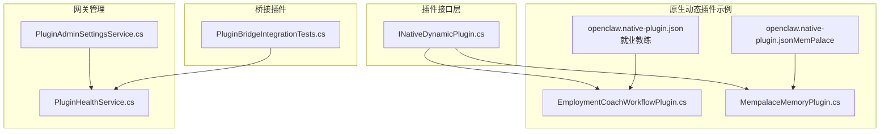
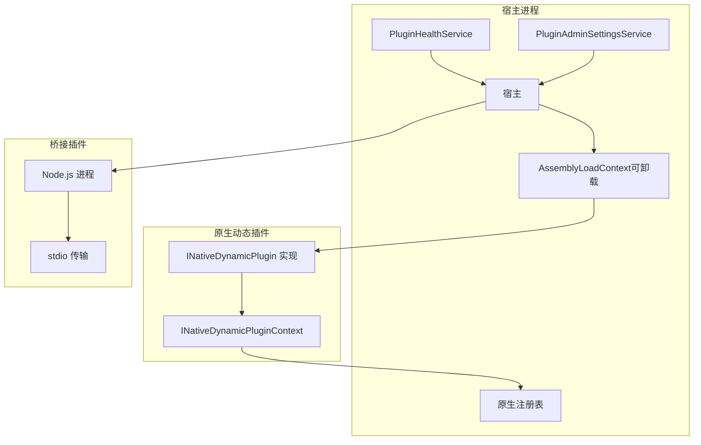
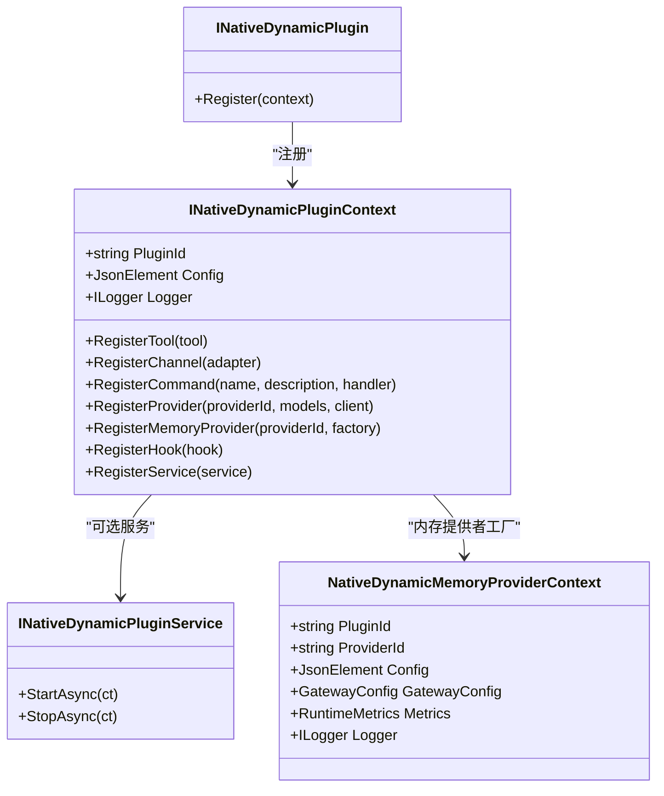
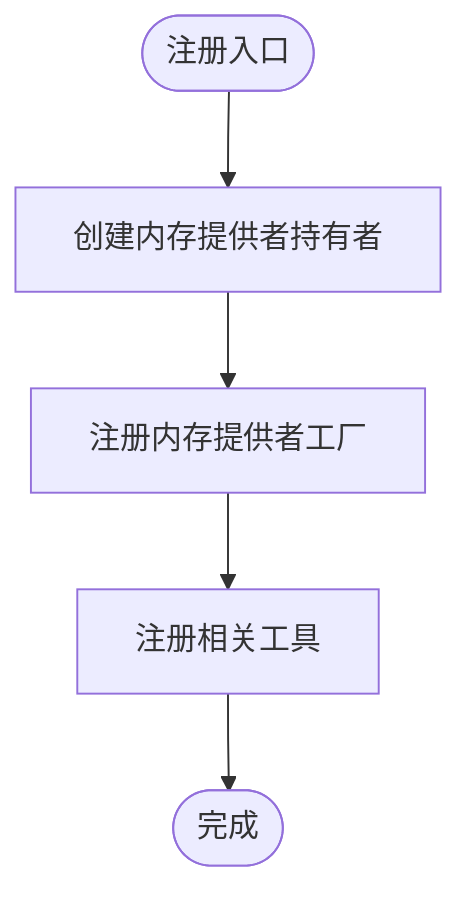
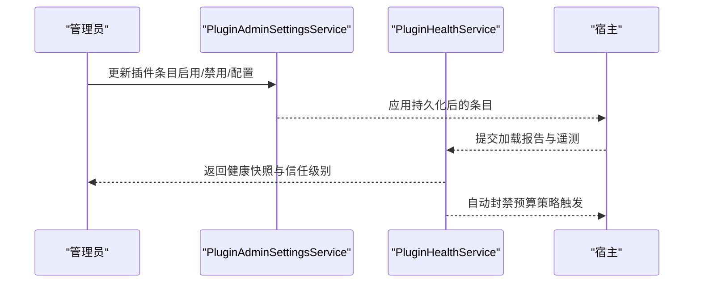
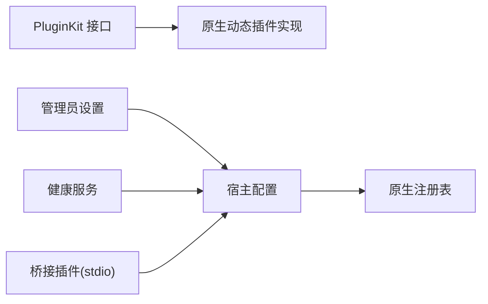

# 插件系统

<cite>
**本文引用的文件**
- [INativeDynamicPlugin.cs](file://src/OpenClaw.PluginKit/INativeDynamicPlugin.cs)
- [EmploymentCoachWorkflowPlugin.cs](file://src/OpenClaw.Plugins.EmploymentCoachWorkflow/EmploymentCoachWorkflowPlugin.cs)
- [openclaw.native-plugin.json（就业教练工作流）](file://src/OpenClaw.Plugins.EmploymentCoachWorkflow/openclaw.native-plugin.json)
- [MempalaceMemoryPlugin.cs](file://src/OpenClaw.Plugins.Mempalace/MempalaceMemoryPlugin.cs)
- [openclaw.native-plugin.json（MemPalace 内存提供者）](file://src/OpenClaw.Plugins.Mempalace/openclaw.native-plugin.json)
- [PaymentPluginRegistration.cs](file://src/OpenClaw.Plugins.Payment/PaymentPluginRegistration.cs)
- [PluginAdminSettingsService.cs](file://src/OpenClaw.Gateway/PluginAdminSettingsService.cs)
- [PluginHealthService.cs](file://src/OpenClaw.Gateway/PluginHealthService.cs)
- [openclaw-plugin-system-analysis.md](file://docs/openclaw-plugin-system-analysis.md)
- [PluginBridgeIntegrationTests.cs](file://src/OpenClaw.Tests/PluginBridgeIntegrationTests.cs)
- [NativeDynamicPluginHostTests.cs](file://src/OpenClaw.Tests/NativeDynamicPluginHostTests.cs)
- [GatewaySecurityExtensions.cs](file://src/OpenClaw.Gateway/Extensions/GatewaySecurityExtensions.cs)
</cite>

## 目录
1. [简介](#简介)
2. [项目结构](#项目结构)
3. [核心组件](#核心组件)
4. [架构总览](#架构总览)
5. [详细组件分析](#详细组件分析)
6. [依赖关系分析](#依赖关系分析)
7. [性能考量](#性能考量)
8. [故障排查指南](#故障排查指南)
9. [结论](#结论)
10. [附录](#附录)

## 简介
本文件系统化阐述 OpenClaw 的插件体系：包括动态原生插件（.NET）与 JS/TS 桥接插件（Bridge）两类扩展路径，覆盖插件生命周期、能力评估、安全隔离、性能监控与兼容性检查，并提供开发指南、API 规范、调试技巧、部署策略与最佳实践。

## 项目结构
插件系统由以下关键部分组成：
- 插件接口与契约：位于 PluginKit，定义原生动态插件的注册上下文与服务接口。
- 原生动态插件示例：EmploymentCoachWorkflow 与 Mempalace 内存插件，演示如何通过上下文注册工具、内存提供者等。
- 插件清单：每个原生动态插件以 openclaw.native-plugin.json 声明元数据与类型定位信息。
- 网关侧管理与健康：PluginAdminSettingsService 负责管理员配置持久化与应用；PluginHealthService 提供健康状态、信任级别、预算策略与自动封禁。
- 测试与文档：测试用例覆盖桥接插件与原生动态插件的加载、内存测量与生命周期；技术分析文档给出系统设计与对比。

图表来源
- [INativeDynamicPlugin.cs:11-46](file://src/OpenClaw.PluginKit/INativeDynamicPlugin.cs#L11-L46)
- [EmploymentCoachWorkflowPlugin.cs:5-10](file://src/OpenClaw.Plugins.EmploymentCoachWorkflow/EmploymentCoachWorkflowPlugin.cs#L5-L10)
- [MempalaceMemoryPlugin.cs:6-42](file://src/OpenClaw.Plugins.Mempalace/MempalaceMemoryPlugin.cs#L6-L42)
- [openclaw.native-plugin.json（就业教练工作流）:1-11](file://src/OpenClaw.Plugins.EmploymentCoachWorkflow/openclaw.native-plugin.json#L1-L11)
- [openclaw.native-plugin.json（MemPalace 内存提供者）:1-10](file://src/OpenClaw.Plugins.Mempalace/openclaw.native-plugin.json#L1-L10)
- [PluginAdminSettingsService.cs:8-138](file://src/OpenClaw.Gateway/PluginAdminSettingsService.cs#L8-L138)
- [PluginHealthService.cs:9-449](file://src/OpenClaw.Gateway/PluginHealthService.cs#L9-L449)
- [PluginBridgeIntegrationTests.cs:44-829](file://src/OpenClaw.Tests/PluginBridgeIntegrationTests.cs#L44-L829)

章节来源
- [INativeDynamicPlugin.cs:11-46](file://src/OpenClaw.PluginKit/INativeDynamicPlugin.cs#L11-L46)
- [openclaw-plugin-system-analysis.md:332-428](file://docs/openclaw-plugin-system-analysis.md#L332-L428)

## 核心组件
- 原生动态插件接口族
  - INativeDynamicPlugin：插件入口，通过 Register 注册能力。
  - INativeDynamicPluginContext：注册上下文，提供插件标识、配置、日志，以及注册工具、频道、命令、模型提供者、内存提供者、钩子、服务的能力。
  - INativeDynamicPluginService：可选的长生命周期服务，支持 StartAsync/StopAsync。
  - NativeDynamicMemoryProviderContext：内存提供者工厂上下文，包含插件 ID、提供者 ID、配置、网关配置、运行指标与日志。
- 原生动态插件示例
  - 就业教练工作流插件：展示最小化实现，用于占位或演示。
  - MemPalace 内存插件：注册内存提供者与工具，演示上下文工厂与线程安全持有者模式。
- 插件清单（openclaw.native-plugin.json）
  - 包含插件 ID、名称、版本、程序集路径、类型全名、能力声明、技能目录、运行时限制（如 JIT Only）等。
- 网关侧管理
  - PluginAdminSettingsService：持久化管理员对插件条目的启用/禁用与配置覆盖。
  - PluginHealthService：健康快照、信任级别、兼容性摘要、预算策略（重启次数、工作集、兼容性错误数）、自动封禁与手动审查。

章节来源
- [INativeDynamicPlugin.cs:11-46](file://src/OpenClaw.PluginKit/INativeDynamicPlugin.cs#L11-L46)
- [EmploymentCoachWorkflowPlugin.cs:5-10](file://src/OpenClaw.Plugins.EmploymentCoachWorkflow/EmploymentCoachWorkflowPlugin.cs#L5-L10)
- [MempalaceMemoryPlugin.cs:6-42](file://src/OpenClaw.Plugins.Mempalace/MempalaceMemoryPlugin.cs#L6-L42)
- [openclaw.native-plugin.json（就业教练工作流）:1-11](file://src/OpenClaw.Plugins.EmploymentCoachWorkflow/openclaw.native-plugin.json#L1-L11)
- [openclaw.native-plugin.json（MemPalace 内存提供者）:1-10](file://src/OpenClaw.Plugins.Mempalace/openclaw.native-plugin.json#L1-L10)
- [PluginAdminSettingsService.cs:8-138](file://src/OpenClaw.Gateway/PluginAdminSettingsService.cs#L8-L138)
- [PluginHealthService.cs:9-449](file://src/OpenClaw.Gateway/PluginHealthService.cs#L9-L449)

## 架构总览
插件系统分为两条扩展路径：
- 原生动态插件（.NET，JIT 模式）
  - 使用可卸载的 AssemblyLoadContext 加载，具备热重载能力；通过 PluginKit API 注册工具、频道、命令、提供者、内存提供者、钩子与服务。
  - 加载前进行三道兼容性验证：最低宿主版本、插件 API 版本主版本一致性、PluginKit 引用检查。
- 桥接插件（JS/TS）
  - 通过 Node.js 进程承载，使用标准输入输出（stdio）作为传输通道；支持 AOT 兼容。
- 启动时组合
  - 桥接插件 → MCP 工具注册（到原生注册表）→ 动态原生插件加载 → 基于优先级的解析 → 最终插件组合。

图表来源
- [openclaw-plugin-system-analysis.md:332-428](file://docs/openclaw-plugin-system-analysis.md#L332-L428)
- [INativeDynamicPlugin.cs:11-46](file://src/OpenClaw.PluginKit/INativeDynamicPlugin.cs#L11-L46)
- [PluginHealthService.cs:9-449](file://src/OpenClaw.Gateway/PluginHealthService.cs#L9-L449)
- [PluginAdminSettingsService.cs:8-138](file://src/OpenClaw.Gateway/PluginAdminSettingsService.cs#L8-L138)

## 详细组件分析

### 原生动态插件接口与上下文
- 设计要点
  - 通过 Register 将插件能力注入宿主注册表。
  - 上下文提供统一的日志、配置与注册 API，涵盖工具、频道、命令、模型提供者、内存提供者、钩子和服务。
  - 内存提供者工厂上下文包含运行指标与网关配置，便于资源计量与安全策略。
- 生命周期
  - 由宿主在加载阶段调用 Register；若插件实现 INativeDynamicPluginService，则在运行期调用 StartAsync/StopAsync。
- 安全与隔离
  - 使用可卸载的 AssemblyLoadContext，遵循特定程序集共享策略，减少依赖污染并支持热重载。

图表来源
- [INativeDynamicPlugin.cs:11-46](file://src/OpenClaw.PluginKit/INativeDynamicPlugin.cs#L11-L46)

章节来源
- [INativeDynamicPlugin.cs:11-46](file://src/OpenClaw.PluginKit/INativeDynamicPlugin.cs#L11-L46)

### 原生动态插件示例：就业教练工作流
- 作用
  - 展示最小化实现，作为占位或演示用途。
- 开发建议
  - 参考清单文件中的能力声明与运行时限制，确保与宿主兼容。

章节来源
- [EmploymentCoachWorkflowPlugin.cs:5-10](file://src/OpenClaw.Plugins.EmploymentCoachWorkflow/EmploymentCoachWorkflowPlugin.cs#L5-L10)
- [openclaw.native-plugin.json（就业教练工作流）:1-11](file://src/OpenClaw.Plugins.EmploymentCoachWorkflow/openclaw.native-plugin.json#L1-L11)

### 原生动态插件示例：MemPalace 内存提供者
- 能力
  - 注册内存提供者与相关工具，演示上下文工厂与线程安全持有者模式。
- 关键点
  - 使用锁保护内存存储实例的创建与访问。
  - 通过上下文参数传递网关配置与运行指标，便于监控与策略控制。

图表来源
- [MempalaceMemoryPlugin.cs:6-42](file://src/OpenClaw.Plugins.Mempalace/MempalaceMemoryPlugin.cs#L6-L42)

章节来源
- [MempalaceMemoryPlugin.cs:6-42](file://src/OpenClaw.Plugins.Mempalace/MempalaceMemoryPlugin.cs#L6-L42)

### 插件清单（openclaw.native-plugin.json）
- 字段说明
  - id/name/version：标识与版本。
  - assemblyPath/typeName：定位插件实现类型。
  - capabilities/skills：声明能力与技能目录。
  - jitOnly：限制仅在 JIT 模式运行。
- 作用
  - 宿主据此加载程序集、实例化类型并进行兼容性校验。

章节来源
- [openclaw.native-plugin.json（就业教练工作流）:1-11](file://src/OpenClaw.Plugins.EmploymentCoachWorkflow/openclaw.native-plugin.json#L1-L11)
- [openclaw.native-plugin.json（MemPalace 内存提供者）:1-10](file://src/OpenClaw.Plugins.Mempalace/openclaw.native-plugin.json#L1-L10)

### 网关侧管理：管理员设置与健康服务
- PluginAdminSettingsService
  - 提供插件条目的增删改查、快照与持久化，支持在运行时应用管理员覆盖。
- PluginHealthService
  - 生成健康快照，计算信任级别与兼容性摘要，基于预算策略自动封禁桥接插件，支持手动审查标记。
  - 读取运行时遥测（重启次数、内存快照），汇总诊断信息。

图表来源
- [PluginAdminSettingsService.cs:8-138](file://src/OpenClaw.Gateway/PluginAdminSettingsService.cs#L8-L138)
- [PluginHealthService.cs:9-449](file://src/OpenClaw.Gateway/PluginHealthService.cs#L9-L449)

章节来源
- [PluginAdminSettingsService.cs:8-138](file://src/OpenClaw.Gateway/PluginAdminSettingsService.cs#L8-L138)
- [PluginHealthService.cs:9-449](file://src/OpenClaw.Gateway/PluginHealthService.cs#L9-L449)

### JS/TS 桥接插件桥接
- 传输与兼容性
  - 使用标准输入输出（stdio）作为传输通道，支持 AOT 兼容。
- 性能与内存
  - 测试用例包含对桥接插件的内存快照测量，便于评估启动与运行时内存占用。
- 能力注册
  - 通过桥接脚本向宿主注册工具、命令与服务，桥接插件可声明能力并参与优先级解析。

章节来源
- [openclaw-plugin-system-analysis.md:332-428](file://docs/openclaw-plugin-system-analysis.md#L332-L428)
- [PluginBridgeIntegrationTests.cs:44-829](file://src/OpenClaw.Tests/PluginBridgeIntegrationTests.cs#L44-L829)
- [PluginBridgeIntegrationTests.cs:1072-1103](file://src/OpenClaw.Tests/PluginBridgeIntegrationTests.cs#L1072-L1103)

### 原生动态插件加载与生命周期（测试视角）
- 加载流程
  - 通过 NativeDynamicPluginHost 加载插件，执行工具调用与命令注册。
- 生命周期
  - 插件可实现 INativeDynamicPluginService，在宿主运行期启动/停止。
- 安全与隔离
  - 测试覆盖“路径逃逸”拒绝场景，确保插件程序集路径在允许范围内。

章节来源
- [NativeDynamicPluginHostTests.cs:41-234](file://src/OpenClaw.Tests/NativeDynamicPluginHostTests.cs#L41-L234)

## 依赖关系分析
- 组件耦合
  - 原生动态插件依赖 PluginKit 接口；网关侧通过 PluginHealthService 与 PluginAdminSettingsService 管理插件状态与策略。
  - 桥接插件通过 stdio 与宿主交互，不直接依赖 PluginKit。
- 外部依赖
  - 原生动态插件使用可卸载的 AssemblyLoadContext，遵循特定程序集共享策略，避免与宿主冲突。
- 循环依赖
  - 插件与宿主之间为单向依赖，无循环导入风险。

图表来源
- [INativeDynamicPlugin.cs:11-46](file://src/OpenClaw.PluginKit/INativeDynamicPlugin.cs#L11-L46)
- [PluginAdminSettingsService.cs:8-138](file://src/OpenClaw.Gateway/PluginAdminSettingsService.cs#L8-L138)
- [PluginHealthService.cs:9-449](file://src/OpenClaw.Gateway/PluginHealthService.cs#L9-L449)

## 性能考量
- 启动成本
  - 原生动态插件：程序集加载（约 10–50ms）。
  - 桥接插件：Node.js 进程生成（约 100–300ms）。
  - MCP 服务器：进程生成（约 100–500ms）。
- 内存占用
  - 通过 PluginBridgeIntegrationTests 对桥接插件进行内存快照测量，结合 PluginHealthService 的内存统计，识别异常波动。
- 运行时模式
  - 原生动态插件受限于 JIT 模式；桥接插件支持 AOT（stdio 传输）。

章节来源
- [openclaw-plugin-system-analysis.md:332-428](file://docs/openclaw-plugin-system-analysis.md#L332-L428)
- [PluginBridgeIntegrationTests.cs:44-829](file://src/OpenClaw.Tests/PluginBridgeIntegrationTests.cs#L44-L829)

## 故障排查指南
- 插件未加载或被封禁
  - 检查 PluginHealthService 的健康快照与信任级别，确认是否因预算策略触发自动封禁。
  - 查看兼容性诊断（错误/警告数量）与技能目录声明。
- 管理员设置未生效
  - 确认 PluginAdminSettingsService 是否正确持久化与应用条目。
- 安全与隔离问题
  - 若出现“路径逃逸”类错误，检查插件清单中的程序集路径是否位于允许的加载目录内。
- 运行时模式限制
  - 原生动态插件受 jitOnly 限制，需确保宿主处于 JIT 模式。
- 桥接插件稳定性
  - 结合重启次数、工作集与兼容性错误数阈值，定位不稳定插件并采取降级或封禁措施。

章节来源
- [PluginHealthService.cs:9-449](file://src/OpenClaw.Gateway/PluginHealthService.cs#L9-L449)
- [PluginAdminSettingsService.cs:8-138](file://src/OpenClaw.Gateway/PluginAdminSettingsService.cs#L8-L138)
- [NativeDynamicPluginHostTests.cs:160-167](file://src/OpenClaw.Tests/NativeDynamicPluginHostTests.cs#L160-L167)
- [openclaw-plugin-system-analysis.md:353-359](file://docs/openclaw-plugin-system-analysis.md#L353-L359)

## 结论
OpenClaw 插件系统通过原生动态插件与 JS/TS 桥接插件两条路径实现灵活扩展：前者强调低开销与强集成，后者强调生态与 AOT 兼容。系统在加载前进行严格的兼容性验证，运行期通过健康服务与管理员设置实现可观测与可控治理，配合预算策略与自动封禁保障整体稳定性。

## 附录

### 插件开发指南（.NET 原生）
- 实现步骤
  - 创建类实现 INativeDynamicPlugin，并在 Register 中调用上下文 API 注册所需能力。
  - 编写 openclaw.native-plugin.json，声明 ID、类型、能力与运行时限制。
  - 如需长生命周期服务，实现 INativeDynamicPluginService 并在 StartAsync/StopAsync 中处理资源。
- 安全与隔离
  - 遵循程序集共享策略，避免与宿主关键命名空间冲突。
  - 使用上下文提供的日志与运行指标，便于审计与监控。
- 兼容性检查
  - 确保 PluginKit 主版本与宿主一致，满足最低宿主版本要求。

章节来源
- [INativeDynamicPlugin.cs:11-46](file://src/OpenClaw.PluginKit/INativeDynamicPlugin.cs#L11-L46)
- [openclaw-plugin-system-analysis.md:353-359](file://docs/openclaw-plugin-system-analysis.md#L353-L359)

### API 接口规范（.NET 原生）
- 注册接口
  - RegisterTool、RegisterChannel、RegisterCommand、RegisterProvider、RegisterMemoryProvider、RegisterHook、RegisterService。
- 上下文字段
  - PluginId、Config、Logger；内存提供者工厂上下文包含 GatewayConfig、Metrics、Logger。
- 生命周期接口
  - INativeDynamicPluginService：StartAsync/StopAsync。

章节来源
- [INativeDynamicPlugin.cs:11-46](file://src/OpenClaw.PluginKit/INativeDynamicPlugin.cs#L11-L46)

### JS/TS 插件桥接（Bridge）
- 传输协议
  - stdio 作为唯一经验证的传输方式。
- 能力声明与注册
  - 通过桥接脚本注册工具、命令与服务，声明能力并参与优先级解析。
- AOT 兼容
  - 采用 stdio 传输，支持 AOT 模式。

章节来源
- [openclaw-plugin-system-analysis.md:332-428](file://docs/openclaw-plugin-system-analysis.md#L332-L428)
- [PluginBridgeIntegrationTests.cs:44-829](file://src/OpenClaw.Tests/PluginBridgeIntegrationTests.cs#L44-L829)

### 安全隔离机制
- 原生动态插件
  - 可卸载的 AssemblyLoadContext 与程序集共享策略，降低依赖冲突风险。
- 网关安全扩展
  - 禁止在非回环绑定暴露敏感配置；对原始密钥引用进行严格检查。
- 路径安全
  - 测试覆盖“路径逃逸”拒绝，确保插件程序集路径在允许范围内。

章节来源
- [openclaw-plugin-system-analysis.md:338-351](file://docs/openclaw-plugin-system-analysis.md#L338-L351)
- [GatewaySecurityExtensions.cs:200-218](file://src/OpenClaw.Gateway/Extensions/GatewaySecurityExtensions.cs#L200-L218)
- [NativeDynamicPluginHostTests.cs:160-167](file://src/OpenClaw.Tests/NativeDynamicPluginHostTests.cs#L160-L167)

### 性能监控与预算策略
- 监控维度
  - 重启次数、工作集大小、兼容性错误数。
- 自动封禁
  - 当超过预算阈值时自动封禁桥接插件，并记录原因。
- 手动审查
  - 支持将第三方插件标记为已审查，提升信任级别。

章节来源
- [PluginHealthService.cs:239-291](file://src/OpenClaw.Gateway/PluginHealthService.cs#L239-L291)
- [PluginHealthService.cs:389-416](file://src/OpenClaw.Gateway/PluginHealthService.cs#L389-L416)

### 兼容性检查
- 三道验证关卡
  - 最低宿主版本、插件 API 版本主版本一致性、PluginKit 引用检查。
- 诊断信息
  - 结构化输出，便于快速定位问题。

章节来源
- [openclaw-plugin-system-analysis.md:353-359](file://docs/openclaw-plugin-system-analysis.md#L353-L359)

### 调试技巧
- 原生动态插件
  - 使用测试用例模式，验证加载、工具执行与命令注册。
- 桥接插件
  - 通过内存快照测量与日志输出，定位性能瓶颈与异常。
- 网关侧
  - 通过健康服务与管理员设置，逐步缩小问题范围。

章节来源
- [NativeDynamicPluginHostTests.cs:41-75](file://src/OpenClaw.Tests/NativeDynamicPluginHostTests.cs#L41-L75)
- [PluginBridgeIntegrationTests.cs:785-808](file://src/OpenClaw.Tests/PluginBridgeIntegrationTests.cs#L785-L808)

### 部署策略与最佳实践
- 原生动态插件
  - 优先选择 JIT 模式运行；严格遵循清单声明与能力约束。
- 桥接插件
  - 使用 stdio 传输，启用 AOT 兼容；设置合理预算阈值，避免资源滥用。
- 网关侧治理
  - 通过管理员设置与健康服务，建立“审查—封禁—恢复”的闭环。

章节来源
- [openclaw-plugin-system-analysis.md:418-428](file://docs/openclaw-plugin-system-analysis.md#L418-L428)
- [PluginHealthService.cs:239-291](file://src/OpenClaw.Gateway/PluginHealthService.cs#L239-L291)

### 示例与参考
- 原生动态插件示例
  - 就业教练工作流插件与 MemPalace 内存插件。
- 插件清单
  - 两个示例插件的 openclaw.native-plugin.json。
- 支付插件工具
  - PaymentPluginRegistration 提供支付工具创建入口。

章节来源
- [EmploymentCoachWorkflowPlugin.cs:5-10](file://src/OpenClaw.Plugins.EmploymentCoachWorkflow/EmploymentCoachWorkflowPlugin.cs#L5-L10)
- [MempalaceMemoryPlugin.cs:6-42](file://src/OpenClaw.Plugins.Mempalace/MempalaceMemoryPlugin.cs#L6-L42)
- [openclaw.native-plugin.json（就业教练工作流）:1-11](file://src/OpenClaw.Plugins.EmploymentCoachWorkflow/openclaw.native-plugin.json#L1-L11)
- [openclaw.native-plugin.json（MemPalace 内存提供者）:1-10](file://src/OpenClaw.Plugins.Mempalace/openclaw.native-plugin.json#L1-L10)
- [PaymentPluginRegistration.cs:6-13](file://src/OpenClaw.Plugins.Payment/PaymentPluginRegistration.cs#L6-L13)