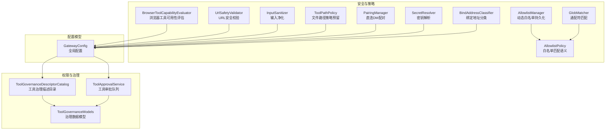
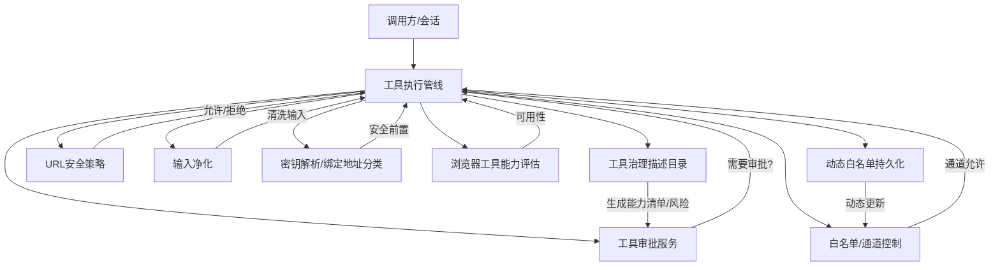
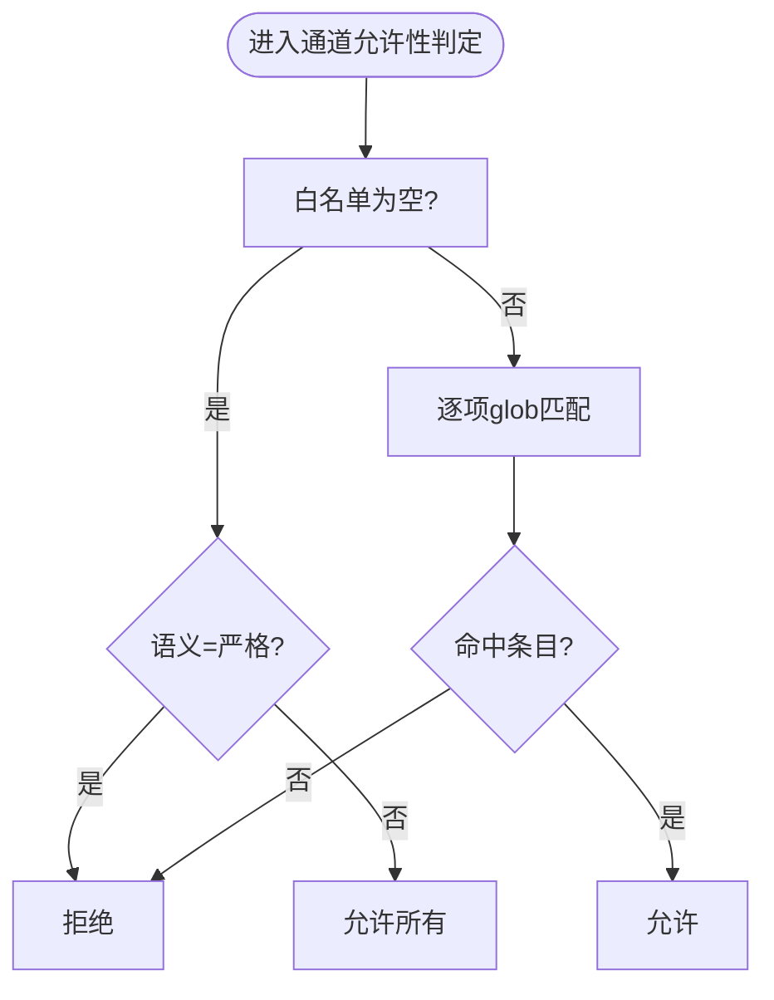
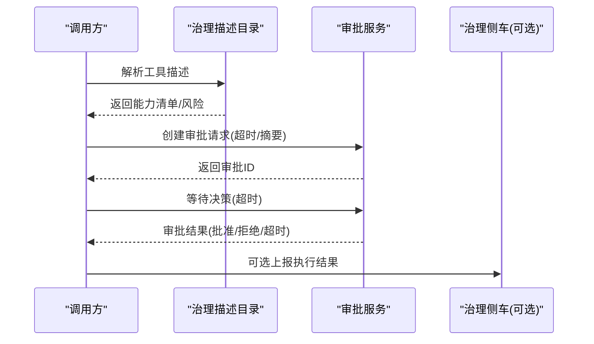
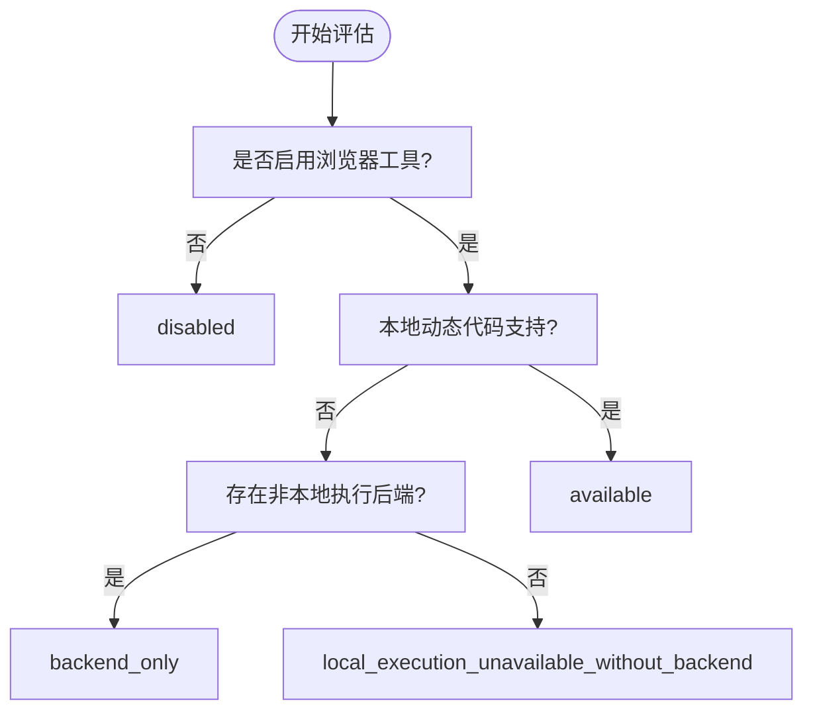
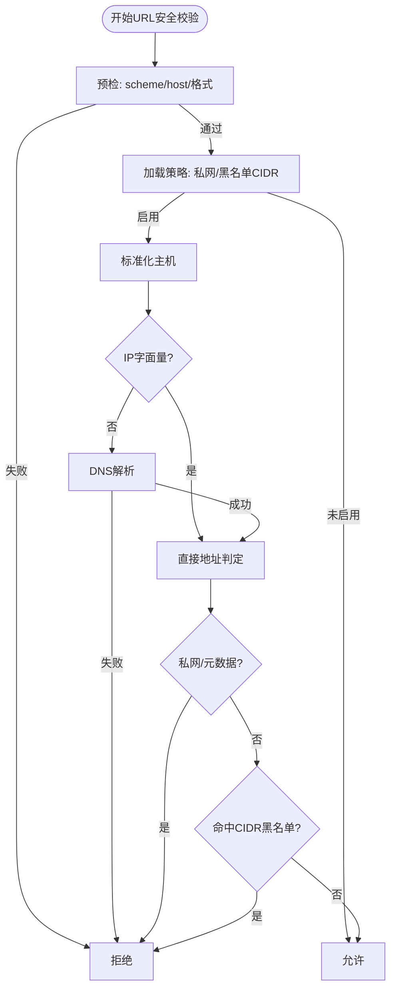
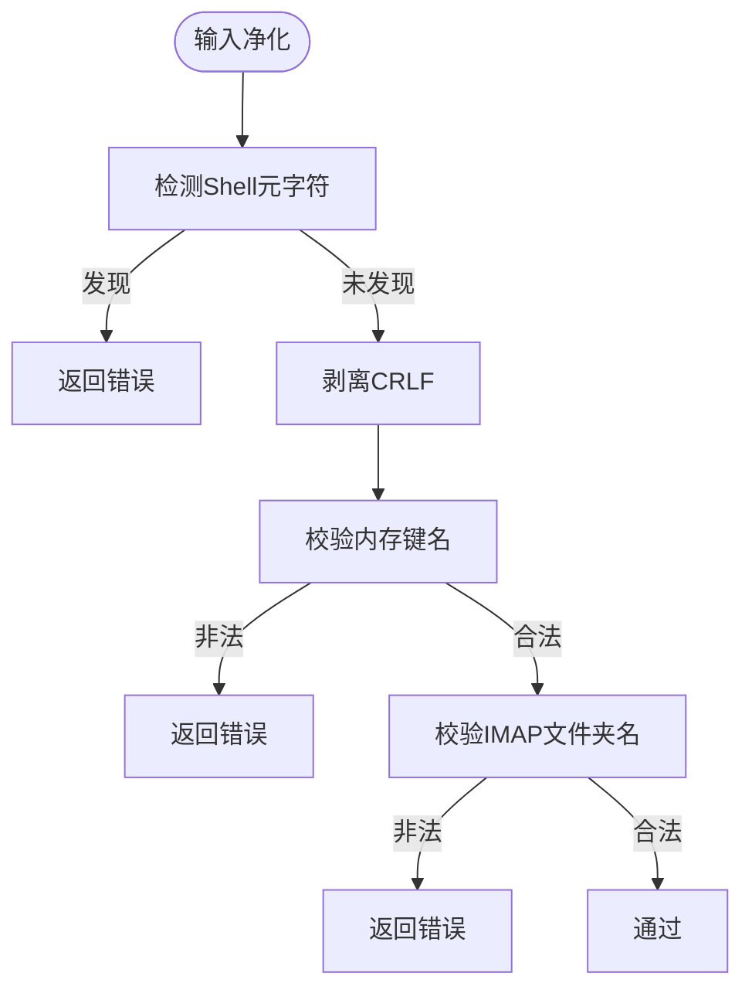
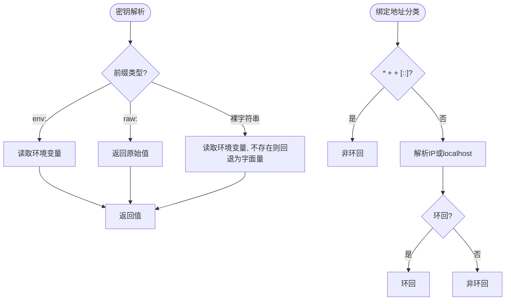
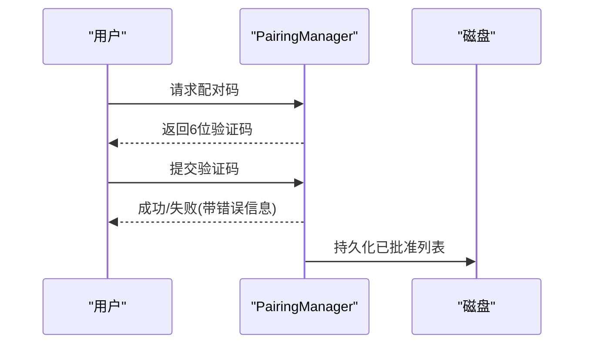
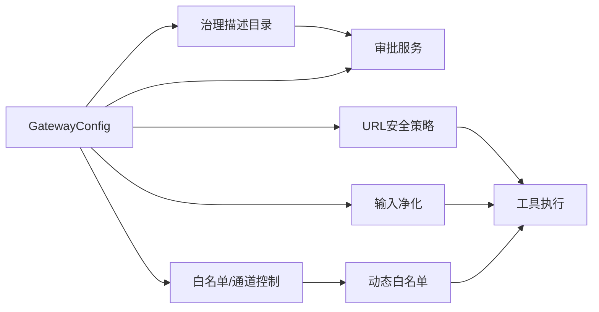

# 插件能力评估

<cite>
**本文引用的文件**
- [AllowlistManager.cs](file://src/OpenClaw.Core/Security/AllowlistManager.cs)
- [AllowlistPolicy.cs](file://src/OpenClaw.Core/Security/AllowlistPolicy.cs)
- [BrowserToolCapabilityEvaluator.cs](file://src/OpenClaw.Core\Security\BrowserToolCapabilityEvaluator.cs)
- [UrlSafetyValidator.cs](file://src/OpenClaw.Core\Security\UrlSafetyValidator.cs)
- [InputSanitizer.cs](file://src/OpenClaw.Core\Security\InputSanitizer.cs)
- [GlobMatcher.cs](file://src/OpenClaw.Core\Security\GlobMatcher.cs)
- [ToolPathPolicy.cs](file://src/OpenClaw.Core\Security\ToolPathPolicy.cs)
- [PairingManager.cs](file://src/OpenClaw.Core\Security\PairingManager.cs)
- [SecretResolver.cs](file://src/OpenClaw.Core\Security\SecretResolver.cs)
- [BindAddressClassifier.cs](file://src/OpenClaw.Core\Security\BindAddressClassifier.cs)
- [ToolGovernanceDescriptorCatalog.cs](file://src/OpenClaw.Core\Governance\ToolGovernanceDescriptorCatalog.cs)
- [ToolApprovalService.cs](file://src/OpenClaw.Core\Pipeline\ToolApprovalService.cs)
- [ToolGovernanceModels.cs](file://src/OpenClaw.Core\Models\ToolGovernanceModels.cs)
- [GatewayConfig.cs](file://src/OpenClaw.Core\Models\GatewayConfig.cs)
</cite>

## 目录
1. [简介](#简介)
2. [项目结构](#项目结构)
3. [核心组件](#核心组件)
4. [架构总览](#架构总览)
5. [详细组件分析](#详细组件分析)
6. [依赖关系分析](#依赖关系分析)
7. [性能考量](#性能考量)
8. [故障排查指南](#故障排查指南)
9. [结论](#结论)
10. [附录](#附录)

## 简介
本文件面向“插件能力评估系统”，系统性阐述插件能力检测、权限验证、安全策略评估机制，覆盖能力清单生成、白名单管理、权限继承规则、动态权限调整；同时给出安全扫描流程、风险评估算法、合规性检查与审计日志记录方法，并提供能力评估配置示例、安全最佳实践与合规指南。目标是帮助开发者与运维人员在不深入源码的前提下，快速理解并正确使用该能力评估体系。

## 项目结构
围绕“插件能力评估”的关键模块主要分布在以下路径：
- 安全与策略：AllowlistManager、AllowlistPolicy、BrowserToolCapabilityEvaluator、UrlSafetyValidator、InputSanitizer、GlobMatcher、ToolPathPolicy、PairingManager、SecretResolver、BindAddressClassifier
- 权限与治理：ToolGovernanceDescriptorCatalog、ToolApprovalService、ToolGovernanceModels
- 配置模型：GatewayConfig（含工具治理、工具集、浏览器工具、URL安全等）

**图表来源**
- [AllowlistManager.cs:19-125](file://src/OpenClaw.Core/Security/AllowlistManager.cs#L19-L125)
- [AllowlistPolicy.cs:9-42](file://src/OpenClaw.Core/Security/AllowlistPolicy.cs#L9-L42)
- [BrowserToolCapabilityEvaluator.cs:5-60](file://src/OpenClaw.Core\Security\BrowserToolCapabilityEvaluator.cs#L5-L60)
- [UrlSafetyValidator.cs:17-218](file://src/OpenClaw.Core\Security\UrlSafetyValidator.cs#L17-L218)
- [InputSanitizer.cs:9-83](file://src/OpenClaw.Core\Security\InputSanitizer.cs#L9-L83)
- [GlobMatcher.cs:3-88](file://src/OpenClaw.Core\Security\GlobMatcher.cs#L3-L88)
- [ToolPathPolicy.cs:5-135](file://src/OpenClaw.Core\Security\ToolPathPolicy.cs#L5-L135)
- [PairingManager.cs:14-210](file://src/OpenClaw.Core\Security\PairingManager.cs#L14-L210)
- [SecretResolver.cs:14-65](file://src/OpenClaw.Core\Security\SecretResolver.cs#L14-L65)
- [BindAddressClassifier.cs:5-18](file://src/OpenClaw.Core\Security\BindAddressClassifier.cs#L5-L18)
- [ToolGovernanceDescriptorCatalog.cs:5-180](file://src/OpenClaw.Core\Governance\ToolGovernanceDescriptorCatalog.cs#L5-L180)
- [ToolApprovalService.cs:49-264](file://src/OpenClaw.Core\Pipeline\ToolApprovalService.cs#L49-L264)
- [ToolGovernanceModels.cs:24-150](file://src/OpenClaw.Core\Models\ToolGovernanceModels.cs#L24-L150)
- [GatewayConfig.cs:9-800](file://src/OpenClaw.Core\Models\GatewayConfig.cs#L9-L800)

**章节来源**
- [AllowlistManager.cs:19-125](file://src/OpenClaw.Core/Security/AllowlistManager.cs#L19-L125)
- [ToolGovernanceDescriptorCatalog.cs:5-180](file://src/OpenClaw.Core/Governance/ToolGovernanceDescriptorCatalog.cs#L5-L180)
- [ToolApprovalService.cs:49-264](file://src/OpenClaw.Core/Pipeline/ToolApprovalService.cs#L49-L264)
- [ToolGovernanceModels.cs:24-150](file://src/OpenClaw.Core/Models/ToolGovernanceModels.cs#L24-L150)
- [GatewayConfig.cs:9-800](file://src/OpenClaw.Core/Models/GatewayConfig.cs#L9-L800)

## 核心组件
- 白名单与通道控制
  - 动态白名单：按通道持久化允许来源/去向，支持运行时更新与原子写入，优先于静态配置。
  - 匹配语义：支持“传统”和“严格”两种模式，空列表在传统模式下表示放行，在严格模式下默认拒绝。
- 工具治理与能力评估
  - 治理描述目录：内置工具能力清单与风险等级，支持从动作描述推导审批需求与只读属性。
  - 审批服务：在“监督式自治”模式下，将高风险或变更型工具执行纳入审批队列。
  - 数据模型：定义治理决策、上下文、侧车请求/响应与执行结果等结构。
- 浏览器工具能力评估
  - 基于配置与运行时状态综合判断浏览器工具是否可用，涵盖本地执行与后端沙箱路由。
- URL安全策略
  - 支持仅允许绝对HTTP(S)、阻止私网/元数据主机、CIDR黑名单、DNS解析与地址判定。
- 输入净化与路径策略
  - 防注入字符检测、CRLF剥离、内存键名校验、IMAP文件夹名校验；文件路径策略预留实现。
- 密钥解析与绑定地址分类
  - 统一密钥解析（环境变量、原始值、裸字符串回退），绑定地址分类用于公网绑定安全预设。

**章节来源**
- [AllowlistManager.cs:32-124](file://src/OpenClaw.Core/Security/AllowlistManager.cs#L32-L124)
- [AllowlistPolicy.cs:9-42](file://src/OpenClaw.Core/Security/AllowlistPolicy.cs#L9-L42)
- [ToolGovernanceDescriptorCatalog.cs:12-64](file://src/OpenClaw.Core/Governance/ToolGovernanceDescriptorCatalog.cs#L12-L64)
- [ToolApprovalService.cs:65-99](file://src/OpenClaw.Core/Pipeline/ToolApprovalService.cs#L65-L99)
- [ToolGovernanceModels.cs:65-150](file://src/OpenClaw.Core/Models/ToolGovernanceModels.cs#L65-L150)
- [BrowserToolCapabilityEvaluator.cs:7-30](file://src/OpenClaw.Core/Security/BrowserToolCapabilityEvaluator.cs#L7-L30)
- [UrlSafetyValidator.cs:27-135](file://src/OpenClaw.Core/Security/UrlSafetyValidator.cs#L27-L135)
- [InputSanitizer.cs:24-82](file://src/OpenClaw.Core/Security/InputSanitizer.cs#L24-L82)
- [ToolPathPolicy.cs:5-135](file://src/OpenClaw.Core/Security/ToolPathPolicy.cs#L5-L135)
- [SecretResolver.cs:24-65](file://src/OpenClaw.Core/Security/SecretResolver.cs#L24-L65)
- [BindAddressClassifier.cs:7-17](file://src/OpenClaw.Core/Security/BindAddressClassifier.cs#L7-L17)

## 架构总览
下图展示“插件能力评估”在系统中的位置与交互：工具调用经由治理描述目录与审批服务进行能力评估与权限控制，结合白名单、URL安全、输入净化与密钥解析等安全策略，最终落地到浏览器工具能力评估与动态白名单持久化。

**图表来源**
- [ToolGovernanceDescriptorCatalog.cs:12-64](file://src/OpenClaw.Core/Governance/ToolGovernanceDescriptorCatalog.cs#L12-L64)
- [ToolApprovalService.cs:65-99](file://src/OpenClaw.Core/Pipeline/ToolApprovalService.cs#L65-L99)
- [UrlSafetyValidator.cs:27-135](file://src/OpenClaw.Core/Security/UrlSafetyValidator.cs#L27-L135)
- [InputSanitizer.cs:24-82](file://src/OpenClaw.Core/Security/InputSanitizer.cs#L24-L82)
- [AllowlistManager.cs:32-124](file://src/OpenClaw.Core/Security/AllowlistManager.cs#L32-L124)
- [SecretResolver.cs:24-65](file://src/OpenClaw.Core/Security/SecretResolver.cs#L24-L65)
- [BrowserToolCapabilityEvaluator.cs:7-30](file://src/OpenClaw.Core/Security/BrowserToolCapabilityEvaluator.cs#L7-L30)

## 详细组件分析

### 白名单与通道控制
- 动态白名单
  - 以通道为维度持久化允许来源/去向，文件命名安全化处理，采用临时文件+原子替换保证一致性。
  - 提供添加、设置、合并等操作，内部通过并发字典与锁保障线程安全。
- 匹配语义
  - “传统”模式：空白名单即放行；“严格”模式：空白名单即拒绝。
  - 支持通配符“*”与glob匹配，大小写敏感可配置。
- 通道允许性判定
  - 允许来源与允许去向分别判定，结合通道配置与动态文件生效。

**图表来源**
- [AllowlistPolicy.cs:18-40](file://src/OpenClaw.Core/Security/AllowlistPolicy.cs#L18-L40)
- [GlobMatcher.cs:9-87](file://src/OpenClaw.Core/Security/GlobMatcher.cs#L9-L87)

**章节来源**
- [AllowlistManager.cs:32-124](file://src/OpenClaw.Core/Security/AllowlistManager.cs#L32-L124)
- [AllowlistPolicy.cs:9-42](file://src/OpenClaw.Core/Security/AllowlistPolicy.cs#L9-L42)
- [GlobMatcher.cs:3-88](file://src/OpenClaw.Core/Security/GlobMatcher.cs#L3-L88)

### 工具治理与能力清单
- 能力清单生成
  - 内置工具能力清单与风险等级，自动从动作描述推导是否需要审批、是否只读、是否可执行代码、网络/文件系统访问等。
- 风险评估
  - 风险等级枚举：低/中/高/严重；根据动作描述与工具名称综合提升风险等级。
- 审批流程
  - 在监督式自治模式下，高风险或变更型工具进入审批队列，支持超时、取消、查询与授权人匹配。

**图表来源**
- [ToolGovernanceDescriptorCatalog.cs:12-64](file://src/OpenClaw.Core/Governance/ToolGovernanceDescriptorCatalog.cs#L12-L64)
- [ToolApprovalService.cs:65-218](file://src/OpenClaw.Core/Pipeline/ToolApprovalService.cs#L65-L218)
- [ToolGovernanceModels.cs:44-150](file://src/OpenClaw.Core/Models/ToolGovernanceModels.cs#L44-L150)

**章节来源**
- [ToolGovernanceDescriptorCatalog.cs:66-180](file://src/OpenClaw.Core/Governance/ToolGovernanceDescriptorCatalog.cs#L66-L180)
- [ToolApprovalService.cs:65-264](file://src/OpenClaw.Core/Pipeline/ToolApprovalService.cs#L65-L264)
- [ToolGovernanceModels.cs:65-150](file://src/OpenClaw.Core/Models/ToolGovernanceModels.cs#L65-L150)

### 浏览器工具能力评估
- 判定依据
  - 是否启用浏览器工具、本地动态代码支持、是否存在非本地执行后端或遗留沙箱路由。
- 结果标识
  - 可用、仅后端可用、禁用、本地执行不可用但有后端等不同原因，便于诊断与提示。

**图表来源**
- [BrowserToolCapabilityEvaluator.cs:7-30](file://src/OpenClaw.Core/Security/BrowserToolCapabilityEvaluator.cs#L7-L30)

**章节来源**
- [BrowserToolCapabilityEvaluator.cs:5-60](file://src/OpenClaw.Core/Security/BrowserToolCapabilityEvaluator.cs#L5-L60)

### URL安全策略
- 校验步骤
  - 预检（scheme/host/格式）、可选DNS解析、私网/元数据/黑名单CIDR判定。
- 错误输出
  - 提供统一错误封装，便于工具层转换为用户可见提示。

**图表来源**
- [UrlSafetyValidator.cs:27-135](file://src/OpenClaw.Core/Security/UrlSafetyValidator.cs#L27-L135)

**章节来源**
- [UrlSafetyValidator.cs:17-218](file://src/OpenClaw.Core/Security/UrlSafetyValidator.cs#L17-L218)

### 输入净化与路径策略
- 输入净化
  - 检测Shell元字符、剥离CRLF、校验内存键名与IMAP文件夹名，防止注入与路径穿越。
- 路径策略
  - 文件系统读写根目录白名单、禁止路径通配符、路径解析与限制（预留实现）。

**图表来源**
- [InputSanitizer.cs:24-82](file://src/OpenClaw.Core/Security/InputSanitizer.cs#L24-L82)

**章节来源**
- [InputSanitizer.cs:9-83](file://src/OpenClaw.Core/Security/InputSanitizer.cs#L9-L83)
- [ToolPathPolicy.cs:5-135](file://src/OpenClaw.Core/Security/ToolPathPolicy.cs#L5-L135)

### 密钥解析与绑定地址分类
- 密钥解析
  - 支持env:、raw:前缀与裸字符串回退，统一密钥来源，避免明文硬编码。
- 绑定地址分类
  - 区分loopback与wildcard绑定，用于公网部署的安全预设。

**图表来源**
- [SecretResolver.cs:24-65](file://src/OpenClaw.Core/Security/SecretResolver.cs#L24-L65)
- [BindAddressClassifier.cs:7-17](file://src/OpenClaw.Core/Security/BindAddressClassifier.cs#L7-L17)

**章节来源**
- [SecretResolver.cs:14-65](file://src/OpenClaw.Core/Security/SecretResolver.cs#L14-L65)
- [BindAddressClassifier.cs:5-18](file://src/OpenClaw.Core/Security/BindAddressClassifier.cs#L5-L18)

### 直连DM配对与动态白名单
- 配对流程
  - 生成一次性6位验证码，带过期与失败冷却；固定时间比较防时序攻击；持久化已批准发送者。
- 动态白名单
  - 运行时更新允许来源，原子写入，支持批量设置与增量添加。

**图表来源**
- [PairingManager.cs:53-124](file://src/OpenClaw.Core/Security/PairingManager.cs#L53-L124)

**章节来源**
- [PairingManager.cs:14-210](file://src/OpenClaw.Core/Security/PairingManager.cs#L14-L210)
- [AllowlistManager.cs:53-124](file://src/OpenClaw.Core/Security/AllowlistManager.cs#L53-L124)

## 依赖关系分析
- 组件耦合
  - 工具治理描述目录与审批服务强相关，前者决定后者是否需要介入。
  - 白名单与通道策略贯穿多处，与配置模型紧密耦合。
  - URL安全与输入净化作为通用安全层，被工具执行链路广泛复用。
- 外部依赖
  - DNS解析（UrlSafetyValidator）、文件系统（ToolPathPolicy预留）、进程/沙箱（BrowserToolCapabilityEvaluator）等。

**图表来源**
- [ToolGovernanceDescriptorCatalog.cs:12-64](file://src/OpenClaw.Core/Governance/ToolGovernanceDescriptorCatalog.cs#L12-L64)
- [ToolApprovalService.cs:65-218](file://src/OpenClaw.Core/Pipeline/ToolApprovalService.cs#L65-L218)
- [UrlSafetyValidator.cs:27-135](file://src/OpenClaw.Core/Security/UrlSafetyValidator.cs#L27-L135)
- [InputSanitizer.cs:24-82](file://src/OpenClaw.Core/Security/InputSanitizer.cs#L24-L82)
- [AllowlistManager.cs:32-124](file://src/OpenClaw.Core/Security/AllowlistManager.cs#L32-L124)
- [GatewayConfig.cs:9-800](file://src/OpenClaw.Core/Models/GatewayConfig.cs#L9-L800)

**章节来源**
- [ToolGovernanceDescriptorCatalog.cs:5-180](file://src/OpenClaw.Core/Governance/ToolGovernanceDescriptorCatalog.cs#L5-L180)
- [ToolApprovalService.cs:49-264](file://src/OpenClaw.Core/Pipeline/ToolApprovalService.cs#L49-L264)
- [UrlSafetyValidator.cs:17-218](file://src/OpenClaw.Core/Security/UrlSafetyValidator.cs#L17-L218)
- [InputSanitizer.cs:9-83](file://src/OpenClaw.Core/Security/InputSanitizer.cs#L9-L83)
- [AllowlistManager.cs:19-125](file://src/OpenClaw.Core/Security/AllowlistManager.cs#L19-L125)
- [GatewayConfig.cs:9-800](file://src/OpenClaw.Core/Models/GatewayConfig.cs#L9-L800)

## 性能考量
- 匹配与查找
  - 白名单匹配采用通配符与span-based匹配，避免Split分配；建议合理控制条目数量与通配符复杂度。
- 并发与持久化
  - 动态白名单与配对列表使用并发容器与原子写入，减少锁竞争；建议定期清理过期项。
- DNS与地址判定
  - URL安全策略在启用DNS解析时引入网络开销，建议缓存与合理超时；对私网/元数据范围的判定为O(n)遍历。
- 审批队列
  - 审批等待采用TCS与超时控制，注意超时阈值与并发量平衡。

[本节为通用指导，无需特定文件来源]

## 故障排查指南
- 审批未生效
  - 检查治理配置与工具动作描述是否触发审批；确认审批ID、超时与授权人匹配。
- 白名单不生效
  - 确认通道维度与动态文件是否覆盖静态配置；检查文件路径与权限。
- URL被拒绝
  - 检查策略开关、私网阻断、主机黑名单与CIDR；核对DNS解析结果。
- 输入报错
  - 检查是否包含Shell元字符、CRLF、非法路径分隔符或控制字符。
- 配对失败
  - 核对验证码有效期、失败次数与冷却时间；确认固定时间比较逻辑。

**章节来源**
- [ToolApprovalService.cs:105-218](file://src/OpenClaw.Core/Pipeline/ToolApprovalService.cs#L105-L218)
- [AllowlistManager.cs:32-124](file://src/OpenClaw.Core/Security/AllowlistManager.cs#L32-L124)
- [UrlSafetyValidator.cs:27-135](file://src/OpenClaw.Core/Security/UrlSafetyValidator.cs#L27-L135)
- [InputSanitizer.cs:24-82](file://src/OpenClaw.Core/Security/InputSanitizer.cs#L24-L82)
- [PairingManager.cs:70-124](file://src/OpenClaw.Core/Security/PairingManager.cs#L70-L124)

## 结论
该能力评估系统通过“治理描述目录+审批服务+白名单/通道控制+URL安全/输入净化+密钥解析+绑定地址分类”的组合，实现了对插件能力的全面评估与可控执行。其设计强调：
- 可观测性：审批队列深度、治理侧车结果与审计日志。
- 可扩展性：内置工具能力清单与动作描述驱动的风险评估。
- 可靠性：动态白名单与配对持久化、原子写入与固定时间比较。
- 合规性：公网绑定安全预设、严格白名单语义、URL安全策略与输入净化。

[本节为总结，无需特定文件来源]

## 附录

### 能力评估配置示例
- 工具治理
  - 开启治理、选择HTTP侧车、设置超时与审计开关、Fail-closed策略。
- 工具集与工具预设
  - 定义工具集与预设，映射到具体工具与参数。
- 浏览器工具
  - 启用浏览器工具、允许后端路由、设置超时与无头模式。
- URL安全
  - 启用URL安全、阻断私网与元数据、配置CIDR黑名单与主机黑名单。
- 通道白名单
  - 设置通道允许来源/去向、选择严格语义。
- 直连DM配对
  - 配置配对策略、验证码有效期与失败冷却。

**章节来源**
- [ToolGovernanceModels.cs:24-63](file://src/OpenClaw.Core/Models/ToolGovernanceModels.cs#L24-L63)
- [GatewayConfig.cs:412-457](file://src/OpenClaw.Core/Models/GatewayConfig.cs#L412-L457)
- [GatewayConfig.cs:371-384](file://src/OpenClaw.Core/Models/GatewayConfig.cs#L371-L384)
- [GatewayConfig.cs:534-548](file://src/OpenClaw.Core/Models/GatewayConfig.cs#L534-L548)
- [PairingManager.cs:32-65](file://src/OpenClaw.Core/Security/PairingManager.cs#L32-L65)

### 安全最佳实践
- 使用严格白名单语义，避免空列表放行。
- 公网绑定时启用严格公共绑定预设，禁用raw密钥引用，限制插件桥接。
- 启用URL安全策略，阻断私网与元数据，配置CIDR黑名单。
- 对输入进行净化，禁止Shell元字符与路径穿越。
- 审批高风险工具，设置合理超时与授权人匹配。
- 定期清理过期配对与白名单，监控审批队列深度。

[本节为通用指导，无需特定文件来源]

### 合规指南
- 遵循最小权限原则，仅授予必要能力与只读权限。
- 记录治理决策与执行结果，满足审计要求。
- 对外部API与网络访问进行明确策略与监控。
- 保护密钥，避免明文存储，使用env:或raw:前缀明确意图。

[本节为通用指导，无需特定文件来源]