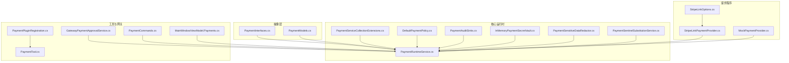
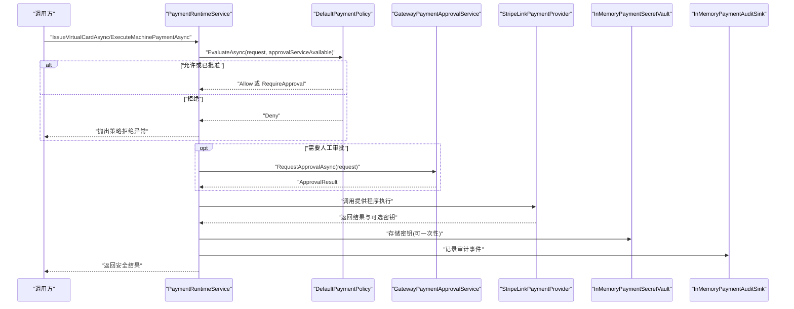
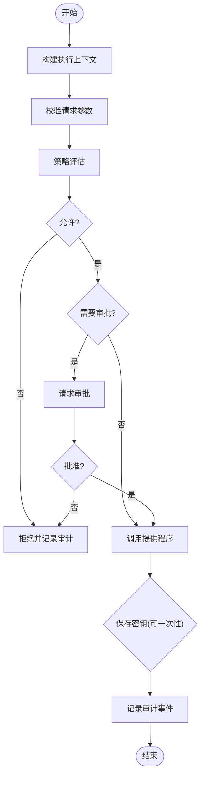
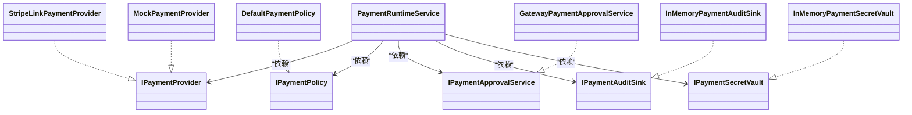

# 支付集成

<cite>
**本文引用的文件**
- [PaymentInterfaces.cs](file://src/OpenClaw.Payments.Abstractions/PaymentInterfaces.cs)
- [PaymentModels.cs](file://src/OpenClaw.Payments.Abstractions/PaymentModels.cs)
- [PaymentRuntimeService.cs](file://src/OpenClaw.Payments.Core/PaymentRuntimeService.cs)
- [PaymentServiceCollectionExtensions.cs](file://src/OpenClaw.Payments.Core/PaymentServiceCollectionExtensions.cs)
- [DefaultPaymentPolicy.cs](file://src/OpenClaw.Payments.Core/DefaultPaymentPolicy.cs)
- [MockPaymentProvider.cs](file://src/OpenClaw.Payments.Core/MockPaymentProvider.cs)
- [PaymentAuditSinks.cs](file://src/OpenClaw.Payments.Core/PaymentAuditSinks.cs)
- [InMemoryPaymentSecretVault.cs](file://src/OpenClaw.Payments.Core/InMemoryPaymentSecretVault.cs)
- [PaymentSensitiveDataRedactor.cs](file://src/OpenClaw.Payments.Core/PaymentSensitiveDataRedactor.cs)
- [PaymentSentinelSubstitutionService.cs](file://src/OpenClaw.Payments.Core/PaymentSentinelSubstitutionService.cs)
- [StripeLinkPaymentProvider.cs](file://src/OpenClaw.Payments.StripeLink/StripeLinkPaymentProvider.cs)
- [StripeLinkOptions.cs](file://src/OpenClaw.Payments.StripeLink/StripeLinkOptions.cs)
- [PaymentPluginRegistration.cs](file://src/OpenClaw.Plugins.Payment/PaymentPluginRegistration.cs)
- [PaymentTool.cs](file://src/OpenClaw.Plugins.Payment/PaymentTool.cs)
- [GatewayPaymentApprovalService.cs](file://src/OpenClaw.Gateway/GatewayPaymentApprovalService.cs)
- [PaymentCommands.cs](file://src/OpenClaw.Cli/PaymentCommands.cs)
- [MainWindowViewModel.Payments.cs](file://src/OpenClaw.Companion/ViewModels/MainWindowViewModel.Payments.cs)
</cite>

## 目录
1. [简介](#简介)
2. [项目结构](#项目结构)
3. [核心组件](#核心组件)
4. [架构总览](#架构总览)
5. [详细组件分析](#详细组件分析)
6. [依赖关系分析](#依赖关系分析)
7. [性能考量](#性能考量)
8. [故障排除指南](#故障排除指南)
9. [结论](#结论)
10. [附录](#附录)

## 简介
本文件为支付集成系统的综合技术文档，覆盖支付架构设计、Stripe Link 集成、支付流程管理、安全控制机制与审计日志。文档同时阐述支付提供程序接口、交易处理、退款管理（概念性）、对账机制（概念性）与合规要求（概念性），并提供支付配置指南、安全最佳实践、错误处理策略、监控告警设置与故障排除方法。

## 项目结构
支付相关代码按“抽象层-核心运行时-具体提供程序-工具与网关集成”的分层组织：
- 抽象层：定义支付接口、模型与环境常量
- 核心运行时：统一调度、策略、审批、审计与密钥保管
- 提供程序实现：Stripe Link CLI 与模拟提供程序
- 工具与网关：插件工具、CLI 命令、网关审批服务、桌面配套界面

**图表来源**
- [PaymentInterfaces.cs:1-60](file://src/OpenClaw.Payments.Abstractions/PaymentInterfaces.cs#L1-L60)
- [PaymentModels.cs:1-400](file://src/OpenClaw.Payments.Abstractions/PaymentModels.cs#L1-L400)
- [PaymentRuntimeService.cs:1-433](file://src/OpenClaw.Payments.Core/PaymentRuntimeService.cs#L1-L433)
- [DefaultPaymentPolicy.cs:1-60](file://src/OpenClaw.Payments.Core/DefaultPaymentPolicy.cs#L1-L60)
- [PaymentAuditSinks.cs:1-19](file://src/OpenClaw.Payments.Core/PaymentAuditSinks.cs#L1-L19)
- [InMemoryPaymentSecretVault.cs:1-73](file://src/OpenClaw.Payments.Core/InMemoryPaymentSecretVault.cs#L1-L73)
- [PaymentSensitiveDataRedactor.cs:1-88](file://src/OpenClaw.Payments.Core/PaymentSensitiveDataRedactor.cs#L1-L88)
- [PaymentSentinelSubstitutionService.cs:1-119](file://src/OpenClaw.Payments.Core/PaymentSentinelSubstitutionService.cs#L1-L119)
- [StripeLinkPaymentProvider.cs:1-286](file://src/OpenClaw.Payments.StripeLink/StripeLinkPaymentProvider.cs#L1-L286)
- [StripeLinkOptions.cs:1-12](file://src/OpenClaw.Payments.StripeLink/StripeLinkOptions.cs#L1-L12)
- [MockPaymentProvider.cs:1-165](file://src/OpenClaw.Payments.Core/MockPaymentProvider.cs#L1-L165)
- [PaymentPluginRegistration.cs:1-14](file://src/OpenClaw.Plugins.Payment/PaymentPluginRegistration.cs#L1-L14)
- [PaymentTool.cs:1-181](file://src/OpenClaw.Plugins.Payment/PaymentTool.cs#L1-L181)
- [GatewayPaymentApprovalService.cs:1-104](file://src/OpenClaw.Gateway/GatewayPaymentApprovalService.cs#L1-L104)
- [PaymentCommands.cs:1-206](file://src/OpenClaw.Cli/PaymentCommands.cs#L1-L206)
- [MainWindowViewModel.Payments.cs:1-273](file://src/OpenClaw.Companion/ViewModels/MainWindowViewModel.Payments.cs#L1-L273)

**章节来源**
- [PaymentInterfaces.cs:1-60](file://src/OpenClaw.Payments.Abstractions/PaymentInterfaces.cs#L1-L60)
- [PaymentModels.cs:1-400](file://src/OpenClaw.Payments.Abstractions/PaymentModels.cs#L1-L400)

## 核心组件
- 支付运行时服务：统一编排提供程序、策略评估、审批请求、审计记录与密钥保管
- 默认支付策略：基于环境、金额上限与审批服务可用性的决策
- 审计与密钥保管：内存审计与内存密钥保管，支持一次性取用与过期清理
- 敏感数据脱敏：识别并脱敏卡号、CVV、授权令牌等敏感字段
- 浏览器哨兵替换：在浏览器填充场景中按审批边界安全解析虚拟卡字段
- 提供程序实现：Stripe Link CLI 与模拟提供程序
- 工具与网关：插件工具、CLI 命令、网关审批服务、桌面配套界面

**章节来源**
- [PaymentRuntimeService.cs:1-433](file://src/OpenClaw.Payments.Core/PaymentRuntimeService.cs#L1-L433)
- [DefaultPaymentPolicy.cs:1-60](file://src/OpenClaw.Payments.Core/DefaultPaymentPolicy.cs#L1-L60)
- [PaymentAuditSinks.cs:1-19](file://src/OpenClaw.Payments.Core/PaymentAuditSinks.cs#L1-L19)
- [InMemoryPaymentSecretVault.cs:1-73](file://src/OpenClaw.Payments.Core/InMemoryPaymentSecretVault.cs#L1-L73)
- [PaymentSensitiveDataRedactor.cs:1-88](file://src/OpenClaw.Payments.Core/PaymentSensitiveDataRedactor.cs#L1-L88)
- [PaymentSentinelSubstitutionService.cs:1-119](file://src/OpenClaw.Payments.Core/PaymentSentinelSubstitutionService.cs#L1-L119)
- [StripeLinkPaymentProvider.cs:1-286](file://src/OpenClaw.Payments.StripeLink/StripeLinkPaymentProvider.cs#L1-L286)
- [MockPaymentProvider.cs:1-165](file://src/OpenClaw.Payments.Core/MockPaymentProvider.cs#L1-L165)
- [PaymentPluginRegistration.cs:1-14](file://src/OpenClaw.Plugins.Payment/PaymentPluginRegistration.cs#L1-L14)
- [PaymentTool.cs:1-181](file://src/OpenClaw.Plugins.Payment/PaymentTool.cs#L1-L181)
- [GatewayPaymentApprovalService.cs:1-104](file://src/OpenClaw.Gateway/GatewayPaymentApprovalService.cs#L1-L104)
- [PaymentCommands.cs:1-206](file://src/OpenClaw.Cli/PaymentCommands.cs#L1-L206)
- [MainWindowViewModel.Payments.cs:1-273](file://src/OpenClaw.Companion/ViewModels/MainWindowViewModel.Payments.cs#L1-L273)

## 架构总览
支付系统采用“策略-审批-执行-审计-密钥保管”闭环设计，通过运行时服务协调多提供程序，确保在测试与生产环境下的安全与合规。

**图表来源**
- [PaymentRuntimeService.cs:1-433](file://src/OpenClaw.Payments.Core/PaymentRuntimeService.cs#L1-L433)
- [DefaultPaymentPolicy.cs:1-60](file://src/OpenClaw.Payments.Core/DefaultPaymentPolicy.cs#L1-L60)
- [GatewayPaymentApprovalService.cs:1-104](file://src/OpenClaw.Gateway/GatewayPaymentApprovalService.cs#L1-L104)
- [StripeLinkPaymentProvider.cs:1-286](file://src/OpenClaw.Payments.StripeLink/StripeLinkPaymentProvider.cs#L1-L286)
- [InMemoryPaymentSecretVault.cs:1-73](file://src/OpenClaw.Payments.Core/InMemoryPaymentSecretVault.cs#L1-L73)
- [PaymentAuditSinks.cs:1-19](file://src/OpenClaw.Payments.Core/PaymentAuditSinks.cs#L1-L19)

## 详细组件分析

### 支付运行时服务（PaymentRuntimeService）
- 职责：路由到指定提供程序、构建执行上下文、校验请求、触发策略与审批、记录审计、管理密钥生命周期
- 关键流程：
  - 虚拟卡签发：策略评估 → 审批（如需）→ 调用提供程序 → 存储密钥 → 记录审计
  - 机器支付：策略评估 → 审批（如需）→ 记录尝试 → 调用提供程序 → 可选一次性授权密钥 → 记录审计
  - 支付状态查询：调用提供程序 → 记录审计
  - 浏览器哨兵替换：从保管库解析字段 → 策略评估 → 记录审计
- 错误处理：捕获提供程序异常并记录失败审计事件；策略拒绝抛出专用异常

**图表来源**
- [PaymentRuntimeService.cs:1-433](file://src/OpenClaw.Payments.Core/PaymentRuntimeService.cs#L1-L433)

**章节来源**
- [PaymentRuntimeService.cs:1-433](file://src/OpenClaw.Payments.Core/PaymentRuntimeService.cs#L1-L433)

### 默认支付策略（DefaultPaymentPolicy）
- 决策维度：环境（test/live）、金额上限、是否具备审批服务
- 行为：
  - test 模式下可直接允许（可配置）
  - live 模式下若超过金额上限则拒绝
  - live 模式下若无审批服务且策略禁止，则拒绝
  - 其余情况要求审批

**章节来源**
- [DefaultPaymentPolicy.cs:1-60](file://src/OpenClaw.Payments.Core/DefaultPaymentPolicy.cs#L1-L60)

### 审计与密钥保管
- 审计：内存队列持久化审计事件，支持快照查看
- 密钥保管：内存字典存储，支持 TTL、一次性取用、过期清理与撤销

**章节来源**
- [PaymentAuditSinks.cs:1-19](file://src/OpenClaw.Payments.Core/PaymentAuditSinks.cs#L1-L19)
- [InMemoryPaymentSecretVault.cs:1-73](file://src/OpenClaw.Payments.Core/InMemoryPaymentSecretVault.cs#L1-L73)

### 敏感数据脱敏（PaymentSensitiveDataRedactor）
- 识别规则：卡号候选、CVV 上下文、授权头、JSON 字段名、支付令牌
- 处理：使用正则匹配与 Luhn 校验识别有效卡号，统一替换为脱敏标记

**章节来源**
- [PaymentSensitiveDataRedactor.cs:1-88](file://src/OpenClaw.Payments.Core/PaymentSensitiveDataRedactor.cs#L1-L88)

### 浏览器哨兵替换（PaymentSentinelSubstitutionService）
- 场景：浏览器自动填充时，按审批边界安全解析虚拟卡字段
- 规则：仅在浏览器工具、填充动作中生效；支持 pan/cvv/exp_month/year/mm_yy/mm_yyyy/postal_code 解析
- 边界：解析前触发审批请求，失败即记录审计并拒绝

**章节来源**
- [PaymentSentinelSubstitutionService.cs:1-119](file://src/OpenClaw.Payments.Core/PaymentSentinelSubstitutionService.cs#L1-L119)

### 提供程序实现

#### Stripe Link 提供程序（StripeLinkPaymentProvider）
- 通过 link-cli 执行命令，解析 JSON 输出
- 支持：安装状态检查、资金来源列表、虚拟卡签发、机器支付执行、支付状态查询
- 参数映射：将请求对象映射为 CLI 参数，解析输出为领域模型

**章节来源**
- [StripeLinkPaymentProvider.cs:1-286](file://src/OpenClaw.Payments.StripeLink/StripeLinkPaymentProvider.cs#L1-L286)
- [StripeLinkOptions.cs:1-12](file://src/OpenClaw.Payments.StripeLink/StripeLinkOptions.cs#L1-L12)

#### 模拟提供程序（MockPaymentProvider）
- 用于测试与演示，生成确定性结果与状态
- 资金来源：固定显示名称与尾号
- 虚拟卡与机器支付：生成稳定 ID 与状态，便于端到端验证

**章节来源**
- [MockPaymentProvider.cs:1-165](file://src/OpenClaw.Payments.Core/MockPaymentProvider.cs#L1-L165)

### 工具与网关集成

#### 插件工具（PaymentTool）
- 将支付能力封装为工具，暴露 setup_status、list_funding_sources、issue_virtual_card、execute_machine_payment、get_payment_status 等动作
- 参数校验与序列化，错误转换为标准错误响应

**章节来源**
- [PaymentPluginRegistration.cs:1-14](file://src/OpenClaw.Plugins.Payment/PaymentPluginRegistration.cs#L1-L14)
- [PaymentTool.cs:1-181](file://src/OpenClaw.Plugins.Payment/PaymentTool.cs#L1-L181)

#### 网关审批服务（GatewayPaymentApprovalService）
- 基于网关工具审批框架，创建审批请求、等待决策、记录审计与治理账本

**章节来源**
- [GatewayPaymentApprovalService.cs:1-104](file://src/OpenClaw.Gateway/GatewayPaymentApprovalService.cs#L1-L104)

#### CLI 命令（PaymentCommands）
- 提供 setup、funding list、virtual-card issue、execute、status 等子命令
- 支持 --test 与 --environment live 切换，强制 live 需要 --yes 确认

**章节来源**
- [PaymentCommands.cs:1-206](file://src/OpenClaw.Cli/PaymentCommands.cs#L1-L206)

#### 桌面配套界面（MainWindowViewModel.Payments）
- 加载支付设置、列出资金来源、发起虚拟卡签发与机器支付、查询支付状态
- 包含确认对话与错误处理反馈

**章节来源**
- [MainWindowViewModel.Payments.cs:1-273](file://src/OpenClaw.Companion/ViewModels/MainWindowViewModel.Payments.cs#L1-L273)

## 依赖关系分析
- 运行时服务依赖：提供程序集合、策略、审批服务、审计与密钥保管
- 提供程序依赖：选项配置与 CLI 命令运行器
- 工具与网关：通过运行时服务统一接入支付能力

**图表来源**
- [PaymentRuntimeService.cs:1-433](file://src/OpenClaw.Payments.Core/PaymentRuntimeService.cs#L1-L433)
- [StripeLinkPaymentProvider.cs:1-286](file://src/OpenClaw.Payments.StripeLink/StripeLinkPaymentProvider.cs#L1-L286)
- [MockPaymentProvider.cs:1-165](file://src/OpenClaw.Payments.Core/MockPaymentProvider.cs#L1-L165)
- [DefaultPaymentPolicy.cs:1-60](file://src/OpenClaw.Payments.Core/DefaultPaymentPolicy.cs#L1-L60)
- [GatewayPaymentApprovalService.cs:1-104](file://src/OpenClaw.Gateway/GatewayPaymentApprovalService.cs#L1-L104)
- [PaymentAuditSinks.cs:1-19](file://src/OpenClaw.Payments.Core/PaymentAuditSinks.cs#L1-L19)
- [InMemoryPaymentSecretVault.cs:1-73](file://src/OpenClaw.Payments.Core/InMemoryPaymentSecretVault.cs#L1-L73)

**章节来源**
- [PaymentServiceCollectionExtensions.cs:1-43](file://src/OpenClaw.Payments.Core/PaymentServiceCollectionExtensions.cs#L1-L43)

## 性能考量
- 异步与取消：所有外部调用均支持取消令牌，避免阻塞
- 内存存储：审计与密钥采用内存实现，适合开发与测试；生产建议替换为持久化实现
- CLI 调用：Stripe Link 提供程序通过进程调用，注意超时与并发限制
- 序列化：使用源生成上下文，减少运行时开销

[本节为通用指导，无需特定文件来源]

## 故障排除指南
- CLI 命令报错
  - 现象：link-cli 未找到或启动失败
  - 排查：检查 CLI 路径、工作目录与环境变量；确认模式（test/live）
  - 参考：[StripeLinkPaymentProvider.cs:19-68](file://src/OpenClaw.Payments.StripeLink/StripeLinkPaymentProvider.cs#L19-L68)
- 策略拒绝
  - 现象：live 金额超限或无审批服务
  - 排查：调整金额上限、启用审批服务或切换至 test 模式
  - 参考：[DefaultPaymentPolicy.cs:21-51](file://src/OpenClaw.Payments.Core/DefaultPaymentPolicy.cs#L21-L51)
- 审批未决
  - 现象：等待审批超时或被拒绝
  - 排查：检查网关审批配置与超时时间
  - 参考：[GatewayPaymentApprovalService.cs:27-102](file://src/OpenClaw.Gateway/GatewayPaymentApprovalService.cs#L27-L102)
- 审计缺失
  - 现象：无法看到审计事件
  - 排查：确认使用内存审计实现并检查快照
  - 参考：[PaymentAuditSinks.cs:1-19](file://src/OpenClaw.Payments.Core/PaymentAuditSinks.cs#L1-L19)
- 密钥不可用
  - 现象：解析虚拟卡字段失败
  - 排查：确认密钥未过期、未一次性取用、未撤销
  - 参考：[InMemoryPaymentSecretVault.cs:34-62](file://src/OpenClaw.Payments.Core/InMemoryPaymentSecretVault.cs#L34-L62)

**章节来源**
- [StripeLinkPaymentProvider.cs:19-68](file://src/OpenClaw.Payments.StripeLink/StripeLinkPaymentProvider.cs#L19-L68)
- [DefaultPaymentPolicy.cs:21-51](file://src/OpenClaw.Payments.Core/DefaultPaymentPolicy.cs#L21-L51)
- [GatewayPaymentApprovalService.cs:27-102](file://src/OpenClaw.Gateway/GatewayPaymentApprovalService.cs#L27-L102)
- [PaymentAuditSinks.cs:1-19](file://src/OpenClaw.Payments.Core/PaymentAuditSinks.cs#L1-L19)
- [InMemoryPaymentSecretVault.cs:34-62](file://src/OpenClaw.Payments.Core/InMemoryPaymentSecretVault.cs#L34-L62)

## 结论
该支付集成系统以清晰的分层与接口设计实现了从策略、审批到执行、审计与密钥保管的完整闭环。通过 Stripe Link 与模拟提供程序，系统既满足生产集成需求，又便于测试与演示。建议在生产环境中替换内存实现为持久化版本，并完善治理与合规流程。

[本节为总结，无需特定文件来源]

## 附录

### 支付配置指南
- 注册核心服务
  - 使用扩展方法注册默认策略、审计、密钥保管与运行时服务
  - 可配置默认提供程序 ID、环境、密钥 TTL、是否允许 test 无需审批、live 是否必须审批、最大金额等
  - 参考：[PaymentServiceCollectionExtensions.cs:10-41](file://src/OpenClaw.Payments.Core/PaymentServiceCollectionExtensions.cs#L10-L41)
- Stripe Link 配置
  - 设置 CLI 路径、工作目录、环境变量、模式与超时
  - 参考：[StripeLinkOptions.cs:1-12](file://src/OpenClaw.Payments.StripeLink/StripeLinkOptions.cs#L1-L12)
- CLI 使用
  - 子命令：setup、funding list、virtual-card issue、execute、status
  - 环境切换：--test 或 --environment live；live 需 --yes 确认
  - 参考：[PaymentCommands.cs:12-137](file://src/OpenClaw.Cli/PaymentCommands.cs#L12-L137)

**章节来源**
- [PaymentServiceCollectionExtensions.cs:10-41](file://src/OpenClaw.Payments.Core/PaymentServiceCollectionExtensions.cs#L10-L41)
- [StripeLinkOptions.cs:1-12](file://src/OpenClaw.Payments.StripeLink/StripeLinkOptions.cs#L1-L12)
- [PaymentCommands.cs:12-137](file://src/OpenClaw.Cli/PaymentCommands.cs#L12-L137)

### 安全最佳实践
- 环境隔离：默认 test 模式，live 必须审批与明确限额
- 最小暴露：工具输出仅包含安全元数据，不包含原始密钥
- 数据脱敏：对日志与输出进行敏感字段脱敏
- 密钥管理：使用一次性密钥与短 TTL，及时撤销
- 审计留痕：所有关键操作均记录审计事件

**章节来源**
- [PaymentRuntimeService.cs:1-433](file://src/OpenClaw.Payments.Core/PaymentRuntimeService.cs#L1-L433)
- [PaymentSensitiveDataRedactor.cs:1-88](file://src/OpenClaw.Payments.Core/PaymentSensitiveDataRedactor.cs#L1-L88)
- [InMemoryPaymentSecretVault.cs:1-73](file://src/OpenClaw.Payments.Core/InMemoryPaymentSecretVault.cs#L1-L73)

### 错误处理策略
- 策略拒绝：抛出专用异常，携带原因
- CLI 参数错误：序列化为标准错误响应
- 提供程序失败：包装为运行时异常并记录审计

**章节来源**
- [PaymentRuntimeService.cs:269-334](file://src/OpenClaw.Payments.Core/PaymentRuntimeService.cs#L269-L334)
- [PaymentTool.cs:88-104](file://src/OpenClaw.Plugins.Payment/PaymentTool.cs#L88-L104)

### 监控告警设置
- 审计事件：通过内存审计快照或替换为持久化审计
- 日志脱敏：使用敏感数据脱敏器
- 状态检查：定期调用安装状态与资金来源列表

**章节来源**
- [PaymentAuditSinks.cs:1-19](file://src/OpenClaw.Payments.Core/PaymentAuditSinks.cs#L1-L19)
- [PaymentSensitiveDataRedactor.cs:1-88](file://src/OpenClaw.Payments.Core/PaymentSensitiveDataRedactor.cs#L1-L88)
- [StripeLinkPaymentProvider.cs:19-68](file://src/OpenClaw.Payments.StripeLink/StripeLinkPaymentProvider.cs#L19-L68)

### 合规要求（概念性）
- 审批与记录：所有资金移动操作需经审批并记录
- 数据最小化：仅保留必要元数据，密钥不落地或严格受控
- 可追溯性：审计事件包含时间戳、决策、原因与环境
- 限额与风控：根据业务设定金额上限与风控策略

[本节为概念性说明，无需特定文件来源]