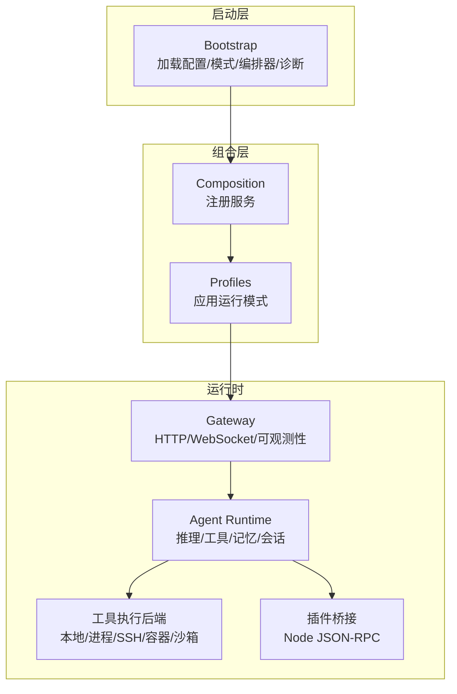
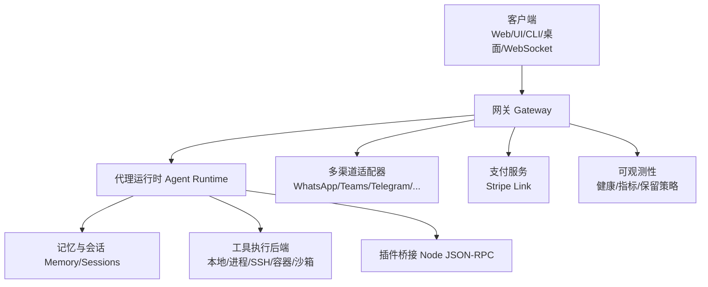
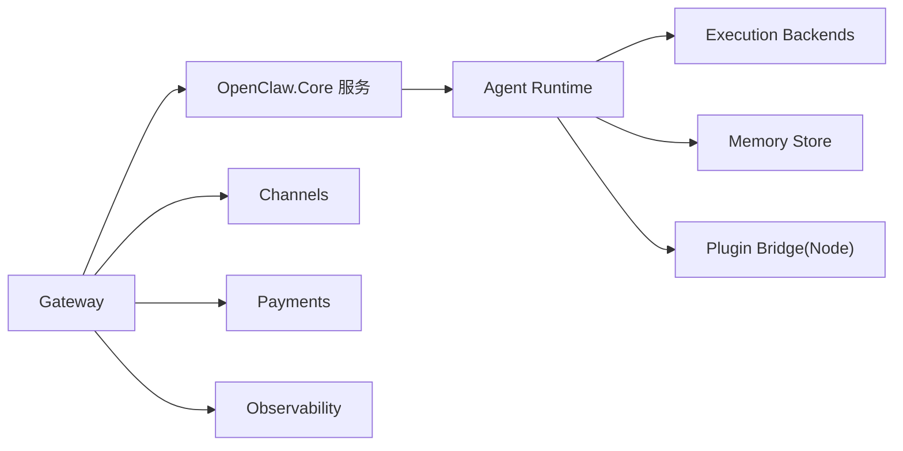

# 核心功能特性

<cite>
**本文引用的文件**
- [README.md](file://README.md)
- [QUICKSTART.md](file://QUICKSTART.md)
- [Program.cs](file://src/OpenClaw.Gateway/Program.cs)
- [MafAgentRuntime.cs](file://src/OpenClaw.Agent/MafAgentRuntime.cs)
- [GatewayConfig.cs](file://src/OpenClaw.Core/Models/GatewayConfig.cs)
- [BrowserTool.cs](file://src/OpenClaw.Agent/Tools/BrowserTool.cs)
- [WhatsAppChannel.cs](file://src/OpenClaw.Channels/WhatsAppChannel.cs)
- [StripeLinkPaymentProvider.cs](file://src/OpenClaw.Payments.StripeLink/StripeLinkPaymentProvider.cs)
- [Program.cs](file://src/OpenClaw.Cli/Program.cs)
- [Program.cs](file://src/OpenClaw.Dashboard/Program.cs)
</cite>

## 目录
1. [简介](#简介)
2. [项目结构](#项目结构)
3. [核心组件](#核心组件)
4. [架构总览](#架构总览)
5. [详细组件分析](#详细组件分析)
6. [依赖关系分析](#依赖关系分析)
7. [性能考量](#性能考量)
8. [故障排查指南](#故障排查指南)
9. [结论](#结论)
10. [附录](#附录)

## 简介
本文件面向 OpenClaw.NET 的使用者与维护者，系统化梳理其核心功能特性，覆盖以下方面：
- 网关服务：HTTP/WebSocket/API、OpenAI 兼容端点、可观测性与健康检查
- 代理运行时：工具执行、记忆与会话、策略与审批、消息流水线
- 工具系统：内置工具集、执行后端与沙箱路由
- 插件系统：动态加载、能力评估与兼容性
- 多渠道通信：WhatsApp、Teams、Telegram 等
- 支付集成：Stripe Link
- 管理界面：Web UI（Blazor WASM）、CLI、桌面应用（Avalonia）

目标是帮助读者快速理解各模块的作用、适用场景、配置要点，并提供可操作的使用示例与最佳实践。

## 项目结构
OpenClaw.NET 采用分层与模块化设计：
- 启动层（Bootstrap）：解析配置、选择运行模式与编排器、早期诊断与恢复
- 组合层（Composition/Profiles）：注册服务、按运行模式装配运行时
- 管线与端点层（Pipeline/Endpoints）：中间件、通道启动、工作者、关闭处理与统一的 HTTP/WebSocket 表面

图表来源
- [Program.cs:1-124](file://src/OpenClaw.Gateway/Program.cs#L1-L124)

章节来源
- [README.md:145-197](file://README.md#L145-L197)
- [Program.cs:1-124](file://src/OpenClaw.Gateway/Program.cs#L1-L124)

## 核心组件
- 网关（Gateway）
  - 提供 HTTP、WebSocket、浏览器 UI、Webhook、OpenAI 兼容端点等统一入口
  - 集成安全、速率限制、会话与可观测性
- 代理运行时（Agent Runtime）
  - 负责推理、工具调用、记忆检索与会话状态管理
  - 支持 MAF 或原生运行时路径
- 工具系统（Tools）
  - 内置工具集（如浏览器、文件读写、Shell、搜索、图像分析等）
  - 执行后端与沙箱路由（本地/进程/SSH/容器/OpenSandbox）
- 插件系统（Plugins）
  - 通过 Node 桥接运行 TS/JS 插件；支持 aot/jit 不同兼容面
  - 动态加载与能力评估
- 多渠道（Channels）
  - 支持 WhatsApp、Teams、Telegram、Slack、Discord、Twilio SMS、Signal 等
- 支付（Payments）
  - 原生支付开关、策略与 Stripe Link 集成
- 管理界面（Dashboard/Cli/Companion）
  - Blazor WASM 运营商仪表盘、CLI 交互与 Avalonia 桌面应用

章节来源
- [README.md:31-57](file://README.md#L31-L57)
- [README.md:325-343](file://README.md#L325-L343)
- [README.md:344-404](file://README.md#L344-L404)
- [README.md:494-506](file://README.md#L494-L506)
- [README.md:517-670](file://README.md#L517-L670)

## 架构总览
下图展示从客户端到网关、再到代理运行时与工具执行后端的整体交互：

图表来源
- [README.md:167-188](file://README.md#L167-L188)
- [Program.cs:60-96](file://src/OpenClaw.Gateway/Program.cs#L60-L96)

## 详细组件分析

### 网关服务（HTTP/WebSocket/API）
- HTTP/WebSocket
  - 默认绑定地址与端口、鉴权令牌、跨域与反向代理信任
  - WebSocket 文本与 JSON 包裹协议
- OpenAI 兼容端点
  - 提供 v1/chat/completions 等兼容接口
- 观测性与健康检查
  - /health、/metrics、/memory/retention/* 等端点
- 安全加固
  - 非回环绑定的严格默认策略、签名验证、请求体大小限制、速率限制

使用示例
- 本地启动与访问
  - dotnet run --project src/OpenClaw.Gateway -c Release
  - 浏览器打开 http://127.0.0.1:18789/chat
  - WebSocket ws://127.0.0.1:18789/ws
- CLI 使用
  - dotnet run --project src/OpenClaw.Cli -c Release -- chat
  - dotnet run --project src/OpenClaw.Cli -c Release -- run "summarize this README" --file ./README.md

配置要点
- 认证与安全
  - OpenClaw:AuthToken / OPENCLAW_AUTH_TOKEN
  - AllowQueryStringToken、AllowedOrigins、TrustForwardedHeaders、KnownProxies
- 端点与速率
  - WebSocket 最大消息/连接数、每连接每分钟消息数
  - SessionRateLimitPerMinute、MaxConcurrentSessions、SessionTimeoutMinutes
- Webhook 限制
  - Channels:* MaxRequestBytes、ValidateSignature、Secret/Token 引用

章节来源
- [README.md:256-292](file://README.md#L256-L292)
- [README.md:517-529](file://README.md#L517-L529)
- [README.md:393-404](file://README.md#L393-L404)
- [README.md:317-324](file://README.md#L317-L324)
- [QUICKSTART.md:1-190](file://QUICKSTART.md#L1-L190)
- [GatewayConfig.cs:11-79](file://src/OpenClaw.Core/Models/GatewayConfig.cs#L11-L79)
- [GatewayConfig.cs:386-393](file://src/OpenClaw.Core/Models/GatewayConfig.cs#L386-L393)
- [GatewayConfig.cs:534-548](file://src/OpenClaw.Core/Models/GatewayConfig.cs#L534-L548)

### 代理运行时（推理/工具/记忆/会话）
- 运行时选择
  - Runtime.Mode：aot/jit/auto；Runtime.Orchestrator：native/maf
- 推理与工具
  - MAF 运行时封装工具为 AITool，构建系统提示词与技能提示，支持流式输出
  - 历史压缩与记忆召回（可选），会话令牌预算控制
- 会话与策略
  - 会话状态存储、令牌预算、合同预算与超限拒绝
  - 工具审批、超时与并行执行策略

使用示例
- 交互式聊天与一次性任务
  - openclaw chat / openclaw run "..."
- 运行模式切换
  - aot 更安全低内存；jit 扩展插件兼容

最佳实践
- 在生产中启用 EstimatedTokenAdmissionControl 以提前拒绝超预算请求
- 合理设置 SessionTokenBudget 与 Compaction 参数，平衡成本与历史保留

章节来源
- [README.md:58-71](file://README.md#L58-L71)
- [README.md:190-197](file://README.md#L190-L197)
- [MafAgentRuntime.cs:1-800](file://src/OpenClaw.Agent/MafAgentRuntime.cs#L1-L800)
- [GatewayConfig.cs:175-214](file://src/OpenClaw.Core/Models/GatewayConfig.cs#L175-L214)
- [GatewayConfig.cs:412-457](file://src/OpenClaw.Core/Models/GatewayConfig.cs#L412-L457)

### 工具系统（内置工具集与执行后端）
- 内置工具
  - 文件读写、Shell、浏览器、搜索、图像分析/生成、数据库、Home Assistant、Notion、MQTT、邮件、日历、Git、PDF、XSearch 等
- 执行后端
  - 本地执行、进程执行、SSH、Docker、OpenSandbox（可选）
  - 工具执行路由与沙箱模式（Prefer/Require/None）
- 安全与策略
  - 工作区限制、路径白名单/黑名单、Shell 命令通配符、浏览器 URL 安全策略

使用示例
- 浏览器工具（Playwright）
  - 支持导航、点击、填写、截图、取文本、脚本求值（受控）
- 沙箱执行
  - 将高风险工具（shell/code_exec/browser）路由至 OpenSandbox

最佳实践
- 生产环境建议将 shell 设置为 Require 并限定镜像模板
- 对浏览器工具启用 URL 安全策略，避免访问私有/回环网络

章节来源
- [README.md:72-124](file://README.md#L72-L124)
- [BrowserTool.cs:1-696](file://src/OpenClaw.Agent/Tools/BrowserTool.cs#L1-L696)
- [GatewayConfig.cs:412-457](file://src/OpenClaw.Core/Models/GatewayConfig.cs#L412-L457)

### 插件系统（动态加载与能力评估）
- 运行模式与兼容面
  - aot：registerTool/registerService、打包技能、受支持清单/配置子集
  - jit：registerChannel/registerCommand/registerProvider/api.on(...)、原生动态插件
- 加载与诊断
  - 不支持表面在启动阶段失败，提供 per-plugin 负载诊断
- 生态兼容
  - 通过 Node 桥接运行 TS/JS 插件；纯 SKILL.md 包无需桥接

使用示例
- 启用插件桥接与动态原生插件（jit）
- 通过 CLI 插件命令安装/移除/列出插件

最佳实践
- 非回环绑定时谨慎开启插件桥接与动态插件
- 使用兼容性目录与兼容性命令进行生态验证

章节来源
- [README.md:325-343](file://README.md#L325-L343)
- [README.md:517-529](file://README.md#L517-L529)
- [Program.cs:1-800](file://src/OpenClaw.Cli/Program.cs#L1-L800)

### 多渠道通信（WhatsApp、Teams、Telegram 等）
- WhatsApp
  - 官方 Cloud API（Meta）、桥接（whatsmeow/baileys）与第一方工作者
  - 签名验证、DM/群组策略、最大请求字节、允许发送者列表
- Teams
  - Bot Framework、JWT 令牌校验、@提及要求、回复风格、文本分片
- Telegram
  - Bot 令牌、Webhook 密钥、最大请求字节、允许发送者列表
- 其他渠道
  - Twilio SMS、Slack、Discord、Signal 等，均支持签名验证与请求体限制

使用示例
- Telegram Webhook
  - set TELEGRAM_BOT_TOKEN，配置 Channels.Telegram.Enabled/Token/MaxRequestBytes
  - 注册 Webhook URL 至 Telegram API
- Twilio SMS
  - 配置 AccountSid/AuthToken/MessagingServiceSid/FromNumber
  - 开启 ValidateSignature，设置 AllowedFromNumbers/AllowedToNumbers

最佳实践
- 非回环绑定时开启 ValidateSignature
- 严格 allowlist 与最小权限原则

章节来源
- [README.md:344-404](file://README.md#L344-L404)
- [WhatsAppChannel.cs:1-320](file://src/OpenClaw.Channels/WhatsAppChannel.cs#L1-L320)
- [GatewayConfig.cs:534-634](file://src/OpenClaw.Core/Models/GatewayConfig.cs#L534-L634)
- [GatewayConfig.cs:688-711](file://src/OpenClaw.Core/Models/GatewayConfig.cs#L688-L711)
- [GatewayConfig.cs:713-733](file://src/OpenClaw.Core/Models/GatewayConfig.cs#L713-L733)
- [GatewayConfig.cs:735-772](file://src/OpenClaw.Core/Models/GatewayConfig.cs#L735-L772)

### 支付集成（Stripe Link）
- 原生支付开关与策略
  - Payments.Enabled、Provider、环境、策略（测试/真实）
- Stripe Link
  - link-cli 可执行路径、工作目录、环境变量、超时
  - 支持资金来源查询、虚拟卡发行、机器支付执行、状态查询
- 安全与审计
  - 敏感数据脱敏与审计日志

使用示例
- 启用支付与 Stripe Link，配置 link-cli 路径与环境变量
- 列出资金来源、发行虚拟卡、执行机器支付、查询状态

最佳实践
- 在非回环绑定时谨慎启用支付功能
- 使用策略控制最大金额与审批要求

章节来源
- [README.md:494-506](file://README.md#L494-L506)
- [StripeLinkPaymentProvider.cs:1-286](file://src/OpenClaw.Payments.StripeLink/StripeLinkPaymentProvider.cs#L1-L286)
- [GatewayConfig.cs:492-533](file://src/OpenClaw.Core/Models/GatewayConfig.cs#L492-L533)

### 管理界面（Web UI、CLI、桌面应用）
- Web UI（Blazor WASM 运营商仪表盘）
  - MudBlazor 组件、本地化拦截器、HTTP 客户端基地址
- CLI
  - 丰富的子命令：start、run、chat、live、tui、insights、setup、upgrade、maintenance、payment、external、memory、test、harness、compatibility、plugins、skill/skills、clawhub 等
  - 支持流式输出、模型与系统提示覆盖、文件/图片附件
- 桌面应用（Avalonia）
  - 跨平台桌面伴侣，支持记住令牌与会话持久化

使用示例
- 启动网关后打开 /chat
- openclaw chat / openclaw run "..."
- dotnet run --project src/OpenClaw.Companion -c Release

最佳实践
- 非回环绑定时设置 OPENCLAW_AUTH_TOKEN 并在 UI 中输入
- 使用 openclaw start 快速本地启动

章节来源
- [README.md:37-40](file://README.md#L37-L40)
- [README.md:247-255](file://README.md#L247-L255)
- [Program.cs:1-32](file://src/OpenClaw.Dashboard/Program.cs#L1-L32)
- [Program.cs:1-800](file://src/OpenClaw.Cli/Program.cs#L1-L800)

## 依赖关系分析
- 组件耦合
  - Gateway 依赖 Core 服务（安全、内存、工具、通道、支付、可观测性）
  - Agent Runtime 依赖工具执行后端与记忆存储
  - 插件系统通过 Node 桥接与 TS/JS 生态解耦
- 运行模式影响
  - aot：更严格的兼容面，适合主流部署
  - jit：扩展桥接与动态插件能力，适合需要生态兼容的场景
- 外部依赖
  - Playwright（浏览器工具）
  - Node.js（插件桥接）
  - Stripe link-cli（支付）

图表来源
- [Program.cs:60-96](file://src/OpenClaw.Gateway/Program.cs#L60-L96)
- [README.md:325-343](file://README.md#L325-L343)

章节来源
- [Program.cs:60-96](file://src/OpenClaw.Gateway/Program.cs#L60-L96)
- [README.md:325-343](file://README.md#L325-L343)

## 性能考量
- 运行模式
  - aot 更小内存占用，jit 兼容性更强但资源开销更大
- 历史与记忆
  - 启用 EnableCompaction 与合理阈值，降低上下文长度与计算成本
- 工具执行
  - 并行工具执行（ParallelToolExecution）提升吞吐，但需注意资源竞争
  - 沙箱执行带来额外延迟，建议在高风险工具上使用 Prefer/Require
- 观测性
  - 使用 /metrics 与 /health 监控请求量、错误率与保留策略执行情况

## 故障排查指南
常见问题与定位思路
- 启动失败
  - 使用 --doctor 检查配置与环境；查看 StartupConsoleCoordinator 输出
- 插件不兼容
  - aot 下禁用 registerChannel/registerCommand/registerProvider/api.on 等；jit 下启用桥接与动态插件
- 渠道签名验证失败
  - 确认 ValidateSignature、WebhookSecretToken/AppSecret、AllowedFromIds/Numbers
- 支付不可用
  - 检查 link-cli 是否存在、工作目录与环境变量、模式（test/live）
- 浏览器工具异常
  - 确认 URL 安全策略、headless/headful、超时与取消处理

章节来源
- [README.md:517-529](file://README.md#L517-L529)
- [README.md:344-404](file://README.md#L344-L404)
- [README.md:494-506](file://README.md#L494-L506)
- [BrowserTool.cs:1-696](file://src/OpenClaw.Agent/Tools/BrowserTool.cs#L1-L696)

## 结论
OpenClaw.NET 以清晰的分层架构与模块化设计，提供了从网关入口、代理运行时、工具与插件生态，到多渠道通信与支付集成的完整 Agent 基础设施。通过 aot/jit 两种运行模式与 MAF 可选编排，既能满足轻量部署需求，也能兼顾生态兼容与高级能力。配合完善的可观测性与安全加固，适合在 .NET 生态中构建生产级智能体系统。

## 附录
- 快速开始
  - 设置 MODEL_PROVIDER_KEY，选择 Runtime.Mode，运行 dotnet run --project src/OpenClaw.Gateway -c Release
  - 访问 http://127.0.0.1:18789/chat 或使用 CLI openclaw chat/run
- 生产部署建议
  - 使用反向代理与 TLS；启用 AllowedOrigins/TrustForwardedHeaders；设置 MaxConnectionsPerIp 与速率限制
  - 对非回环绑定启用严格安全配置与签名验证

章节来源
- [QUICKSTART.md:1-190](file://QUICKSTART.md#L1-L190)
- [README.md:517-529](file://README.md#L517-L529)