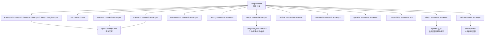
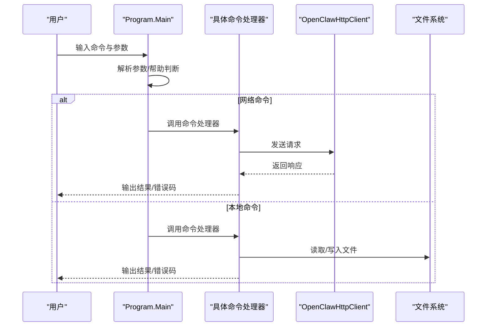
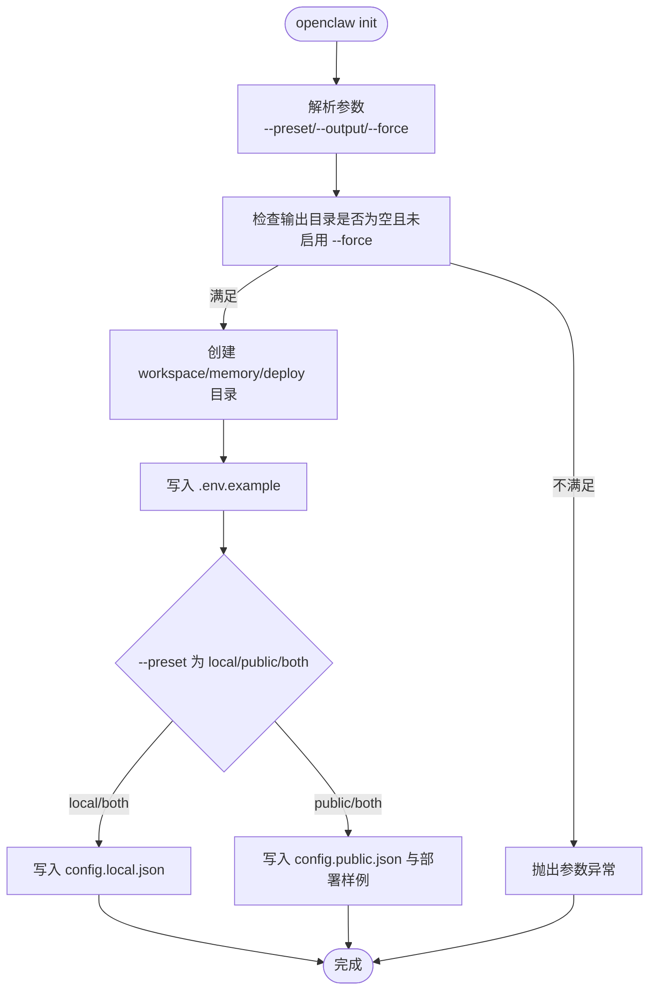
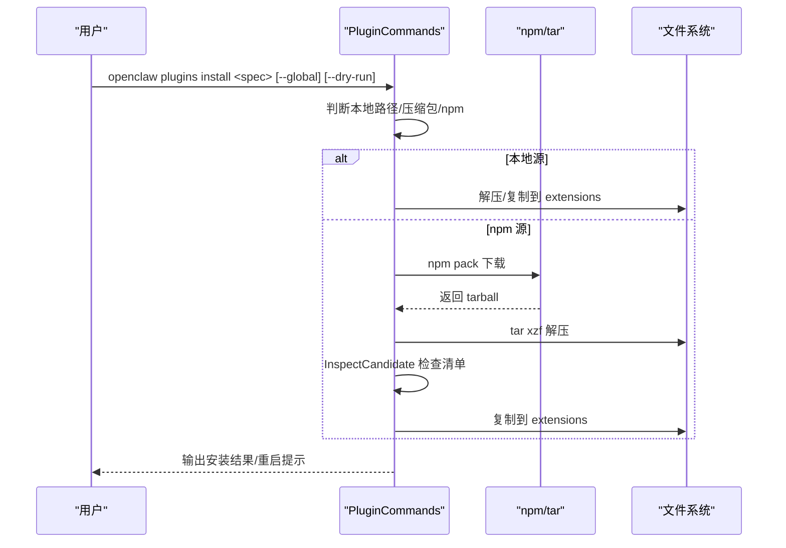
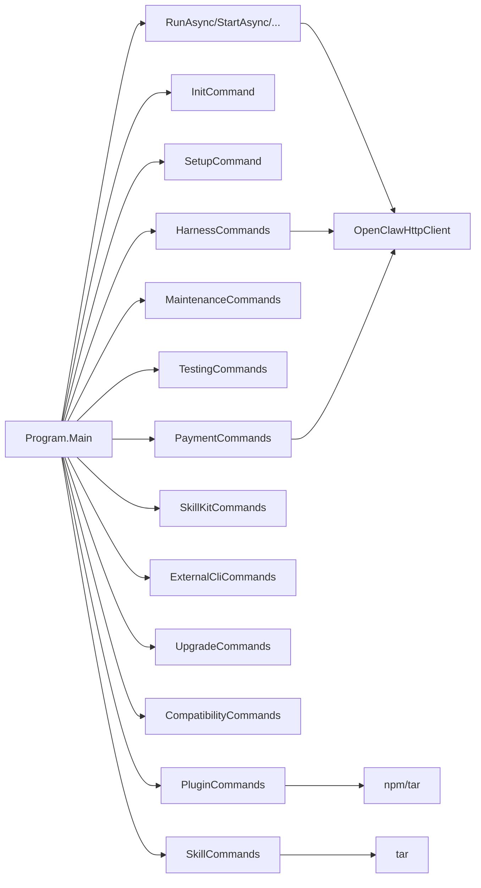

# 命令行工具

<cite>
**本文档引用的文件**
- [Program.cs](file://src/OpenClaw.Cli/Program.cs)
- [CliArgs.cs](file://src/OpenClaw.Cli/CliArgs.cs)
- [InitCommand.cs](file://src/OpenClaw.Cli/InitCommand.cs)
- [StartCommand.cs](file://src/OpenClaw.Cli/StartCommand.cs)
- [PluginCommands.cs](file://src/OpenClaw.Cli/PluginCommands.cs)
- [MaintenanceCommands.cs](file://src/OpenClaw.Cli/MaintenanceCommands.cs)
- [TestingCommands.cs](file://src/OpenClaw.Cli/TestingCommands.cs)
- [SkillCommands.cs](file://src/OpenClaw.Cli/SkillCommands.cs)
- [SkillKitCommands.cs](file://src/OpenClaw.Cli/SkillKitCommands.cs)
- [ExternalCliCommands.cs](file://src/OpenClaw.Cli/ExternalCliCommands.cs)
- [SetupCommand.cs](file://src/OpenClaw.Cli/SetupCommand.cs)
- [UpgradeCommands.cs](file://src/OpenClaw.Cli/UpgradeCommands.cs)
- [CompatibilityCommands.cs](file://src/OpenClaw.Cli/CompatibilityCommands.cs)
- [HarnessCommands.cs](file://src/OpenClaw.Cli/HarnessCommands.cs)
- [PaymentCommands.cs](file://src/OpenClaw.Cli/PaymentCommands.cs)
</cite>

## 目录
1. [简介](#简介)
2. [项目结构](#项目结构)
3. [核心组件](#核心组件)
4. [架构总览](#架构总览)
5. [详细组件分析](#详细组件分析)
6. [依赖关系分析](#依赖关系分析)
7. [性能考虑](#性能考虑)
8. [故障排除指南](#故障排除指南)
9. [结论](#结论)
10. [附录](#附录)

## 简介
本文件为基于 .NET CLI 的命令行工具（openclaw）的完整技术文档。内容涵盖命令结构、参数解析、执行流程、错误处理与输出格式；详述初始化、启动、配置、插件管理、维护、测试、技能与技能包、外部 CLI、升级与回滚、兼容性、测试夹具与回归、支付等功能命令的使用方法、参数选项与输出格式；并提供脚本化操作、批处理任务、自动化与 CI/CD 集成的最佳实践与开发指南。

## 项目结构
openclaw CLI 采用“主入口分发 + 子命令模块化”的组织方式：
- 主入口负责命令解析与分发，各子命令封装在独立类中，职责清晰、可扩展性强。
- 参数解析统一由轻量级 CliArgs 实现，支持位置参数、键值参数与标志位。
- 大多数命令通过 OpenClawHttpClient 与网关交互，或直接操作本地文件系统（如 init、plugins、skills）。

图表来源
- [Program.cs:12-80](file://src/OpenClaw.Cli/Program.cs#L12-L80)
- [InitCommand.cs:9-72](file://src/OpenClaw.Cli/InitCommand.cs#L9-L72)
- [SetupCommand.cs:22-139](file://src/OpenClaw.Cli/SetupCommand.cs#L22-L139)
- [PluginCommands.cs:18-37](file://src/OpenClaw.Cli/PluginCommands.cs#L18-L37)
- [MaintenanceCommands.cs:10-63](file://src/OpenClaw.Cli/MaintenanceCommands.cs#L10-L63)
- [TestingCommands.cs:12-34](file://src/OpenClaw.Cli/TestingCommands.cs#L12-L34)
- [SkillCommands.cs:10-28](file://src/OpenClaw.Cli/SkillCommands.cs#L10-L28)
- [SkillKitCommands.cs:8-42](file://src/OpenClaw.Cli/SkillKitCommands.cs#L8-L42)
- [ExternalCliCommands.cs:14-112](file://src/OpenClaw.Cli/ExternalCliCommands.cs#L14-L112)
- [UpgradeCommands.cs:12-28](file://src/OpenClaw.Cli/UpgradeCommands.cs#L12-L28)
- [CompatibilityCommands.cs:9-28](file://src/OpenClaw.Cli/CompatibilityCommands.cs#L9-L28)
- [HarnessCommands.cs:14-46](file://src/OpenClaw.Cli/HarnessCommands.cs#L14-L46)
- [PaymentCommands.cs:12-105](file://src/OpenClaw.Cli/PaymentCommands.cs#L12-L105)

章节来源
- [Program.cs:12-80](file://src/OpenClaw.Cli/Program.cs#L12-L80)
- [CliArgs.cs:14-98](file://src/OpenClaw.Cli/CliArgs.cs#L14-L98)

## 核心组件
- 命令分发器：Program.Main 根据第一个参数选择对应命令处理器，统一捕获异常并返回退出码。
- 参数解析器：CliArgs 支持位置参数、键值参数（--option value）、标志位（--flag），并处理 -- 之后的所有内容作为位置参数。
- 环境变量与默认值：命令普遍支持通过环境变量覆盖默认行为（如 OPENCLAW_BASE_URL、OPENCLAW_AUTH_TOKEN），并提供合理的默认值。
- 输出与帮助：每个命令均内置帮助文本，支持 --help/-h 或 help 子命令打印用法与示例。

章节来源
- [Program.cs:12-80](file://src/OpenClaw.Cli/Program.cs#L12-L80)
- [CliArgs.cs:14-98](file://src/OpenClaw.Cli/CliArgs.cs#L14-L98)

## 架构总览
openclaw CLI 的执行路径遵循“主入口 -> 参数解析 -> 子命令 -> 业务逻辑 -> 输出/错误码”的模式。网络型命令通过 OpenClawHttpClient 与网关通信；本地型命令直接写入文件系统或调用外部工具（如 npm、tar）。

图表来源
- [Program.cs:12-80](file://src/OpenClaw.Cli/Program.cs#L12-L80)
- [PluginCommands.cs:425-458](file://src/OpenClaw.Cli/PluginCommands.cs#L425-L458)
- [SkillCommands.cs:323-355](file://src/OpenClaw.Cli/SkillCommands.cs#L323-L355)

## 详细组件分析

### 初始化命令（init）
用途：生成最小化引导文件与目录，便于快速开始本地开发与演示。
- 支持 --preset（local|public|both）、--output、--force。
- 生成 .env.example、config.local.json/config.public.json、部署样例文件等。
- 输出生成路径与预设说明。

图表来源
- [InitCommand.cs:9-72](file://src/OpenClaw.Cli/InitCommand.cs#L9-L72)

章节来源
- [InitCommand.cs:9-72](file://src/OpenClaw.Cli/InitCommand.cs#L9-L72)

### 启动命令（start）
用途：一键启动网关，支持自动引导配置或直接启动已有配置。
- 自动解析配置路径，若不存在则进入引导流程。
- 支持 --with-companion、--open-browser、--skip-verify、--offline、--require-provider 等。
- 可与 SetupCommand 协作完成非交互式自动化。

章节来源
- [StartCommand.cs:9-47](file://src/OpenClaw.Cli/StartCommand.cs#L9-L47)
- [StartCommand.cs:49-68](file://src/OpenClaw.Cli/StartCommand.cs#L49-L68)
- [StartCommand.cs:70-96](file://src/OpenClaw.Cli/StartCommand.cs#L70-L96)

### 配置命令（setup）
用途：生成与验证配置文件，支持多种部署模式与后端（Docker、OpenSandbox、SSH）。
- 支持交互式与非交互式两种模式，自动推断后端类型。
- 写入配置文件与环境示例，输出下一步指引。
- 提供 tailscale serve 指南与 provider 特定设置（如 aperture）。

章节来源
- [SetupCommand.cs:22-139](file://src/OpenClaw.Cli/SetupCommand.cs#L22-L139)
- [SetupCommand.cs:506-680](file://src/OpenClaw.Cli/SetupCommand.cs#L506-L680)
- [SetupCommand.cs:682-800](file://src/OpenClaw.Cli/SetupCommand.cs#L682-L800)

### 插件管理命令（plugins）
用途：安装、卸载、列出、搜索第三方或本地插件。
- 支持从 npm/ClawHub 安装与从本地路径/压缩包安装。
- 安装前进行兼容性检查与信任级别评估。
- 支持 --global 全局安装与 --dry-run 预览。

图表来源
- [PluginCommands.cs:39-62](file://src/OpenClaw.Cli/PluginCommands.cs#L39-L62)
- [PluginCommands.cs:64-159](file://src/OpenClaw.Cli/PluginCommands.cs#L64-L159)
- [PluginCommands.cs:161-242](file://src/OpenClaw.Cli/PluginCommands.cs#L161-L242)
- [PluginCommands.cs:425-458](file://src/OpenClaw.Cli/PluginCommands.cs#L425-L458)

章节来源
- [PluginCommands.cs:18-37](file://src/OpenClaw.Cli/PluginCommands.cs#L18-L37)
- [PluginCommands.cs:275-317](file://src/OpenClaw.Cli/PluginCommands.cs#L275-L317)
- [PluginCommands.cs:319-364](file://src/OpenClaw.Cli/PluginCommands.cs#L319-L364)

### 维护命令（maintenance）
用途：扫描与修复运行时健康问题，输出报告与修复建议。
- 支持 scan 与 fix 子命令，可输出 JSON。
- 依据配置与模型诊断构建扫描输入，输出可靠性评分、存储占用、提示预算与漂移情况。

章节来源
- [MaintenanceCommands.cs:10-63](file://src/OpenClaw.Cli/MaintenanceCommands.cs#L10-L63)
- [MaintenanceCommands.cs:65-112](file://src/OpenClaw.Cli/MaintenanceCommands.cs#L65-L112)

### 测试命令（test）
用途：执行场景化测试与回归，生成报告与质量门禁。
- 支持 init、run、report、gates 子命令。
- 支持失败策略（--fail-on any|high）与输出目录控制。

章节来源
- [TestingCommands.cs:12-34](file://src/OpenClaw.Cli/TestingCommands.cs#L12-L34)
- [TestingCommands.cs:60-82](file://src/OpenClaw.Cli/TestingCommands.cs#L60-L82)
- [TestingCommands.cs:84-99](file://src/OpenClaw.Cli/TestingCommands.cs#L84-L99)
- [TestingCommands.cs:101-114](file://src/OpenClaw.Cli/TestingCommands.cs#L101-L114)

### 技能命令（skills）
用途：检查、安装与列出本地技能包。
- 支持 tarball 与目录两种源，支持 --managed 与 --workdir。
- 安装前进行信任与要求评估，支持 --dry-run。

章节来源
- [SkillCommands.cs:10-28](file://src/OpenClaw.Cli/SkillCommands.cs#L10-L28)
- [SkillCommands.cs:42-92](file://src/OpenClaw.Cli/SkillCommands.cs#L42-L92)
- [SkillCommands.cs:94-129](file://src/OpenClaw.Cli/SkillCommands.cs#L94-L129)
- [SkillCommands.cs:131-143](file://src/OpenClaw.Cli/SkillCommands.cs#L131-L143)

### 技能包命令（skill）
用途：创建、校验、批评、生成、打包与运行技能包（Dry-run）。
- 支持模板与分类，输出执行计划与工具策略概要。
- 运行时需 --dry-run，避免真实调用。

章节来源
- [SkillKitCommands.cs:8-42](file://src/OpenClaw.Cli/SkillKitCommands.cs#L8-L42)
- [SkillKitCommands.cs:44-67](file://src/OpenClaw.Cli/SkillKitCommands.cs#L44-L67)
- [SkillKitCommands.cs:90-102](file://src/OpenClaw.Cli/SkillKitCommands.cs#L90-L102)
- [SkillKitCommands.cs:118-130](file://src/OpenClaw.Cli/SkillKitCommands.cs#L118-L130)
- [SkillKitCommands.cs:132-146](file://src/OpenClaw.Cli/SkillKitCommands.cs#L132-L146)
- [SkillKitCommands.cs:148-173](file://src/OpenClaw.Cli/SkillKitCommands.cs#L148-L173)

### 外部 CLI 命令（external）
用途：列举、状态查询、命令列表、预览与执行外部 CLI 连接器。
- 支持 --param key=value 多参数，支持 --dry-run 与 --yes 批准。
- 输出文本或 JSON，严格限制输出字段。

章节来源
- [ExternalCliCommands.cs:14-112](file://src/OpenClaw.Cli/ExternalCliCommands.cs#L14-L112)
- [ExternalCliCommands.cs:114-165](file://src/OpenClaw.Cli/ExternalCliCommands.cs#L114-L165)
- [ExternalCliCommands.cs:248-268](file://src/OpenClaw.Cli/ExternalCliCommands.cs#L248-L268)

### 升级与回滚命令（upgrade）
用途：升级前预检、生成回滚快照与回滚恢复。
- 检查配置与提供商准备、插件兼容性、技能兼容性与迁移影响。
- 成功时保存“最后已知良好”快照，失败时给出推荐动作。

章节来源
- [UpgradeCommands.cs:12-28](file://src/OpenClaw.Cli/UpgradeCommands.cs#L12-L28)
- [UpgradeCommands.cs:30-106](file://src/OpenClaw.Cli/UpgradeCommands.cs#L30-L106)
- [UpgradeCommands.cs:108-162](file://src/OpenClaw.Cli/UpgradeCommands.cs#L108-L162)

### 兼容性命令（compatibility）
用途：列出公开兼容性场景目录，支持过滤与 JSON 输出。
- 支持按状态、类型、类别筛选，适合自动化集成与合规审计。

章节来源
- [CompatibilityCommands.cs:9-28](file://src/OpenClaw.Cli/CompatibilityCommands.cs#L9-L28)
- [CompatibilityCommands.cs:30-72](file://src/OpenClaw.Cli/CompatibilityCommands.cs#L30-L72)

### 测试夹具与回归命令（harness）
用途：离线执行测试夹具、生成代码库映射、查询共享夹具状态。
- 支持 map、state、test/regression 子命令，支持 JSON 输出与严格模式。
- 与网关交互以查询状态与冲突检测。

章节来源
- [HarnessCommands.cs:14-46](file://src/OpenClaw.Cli/HarnessCommands.cs#L14-L46)
- [HarnessCommands.cs:48-65](file://src/OpenClaw.Cli/HarnessCommands.cs#L48-L65)
- [HarnessCommands.cs:67-100](file://src/OpenClaw.Cli/HarnessCommands.cs#L67-L100)
- [HarnessCommands.cs:102-142](file://src/OpenClaw.Cli/HarnessCommands.cs#L102-L142)
- [HarnessCommands.cs:144-246](file://src/OpenClaw.Cli/HarnessCommands.cs#L144-L246)

### 支付命令（payment）
用途：查询支付设置、资金来源、签发虚拟卡、执行机器支付与查询状态。
- 支持测试/生产环境切换，Live 操作需要 --yes 明确确认。
- 输出受限安全元数据，避免敏感信息泄露。

章节来源
- [PaymentCommands.cs:12-105](file://src/OpenClaw.Cli/PaymentCommands.cs#L12-L105)
- [PaymentCommands.cs:107-137](file://src/OpenClaw.Cli/PaymentCommands.cs#L107-L137)
- [PaymentCommands.cs:139-153](file://src/OpenClaw.Cli/PaymentCommands.cs#L139-L153)

## 依赖关系分析
- Program.Main 依赖各命令处理器；大多数命令依赖 OpenClawHttpClient 进行网关交互。
- 插件命令依赖 npm 与 tar 工具；技能命令依赖 tar 工具与文件系统。
- 升级命令依赖 SetupVerificationService、PluginDiscovery、SkillInspector 等核心服务。
- 支付命令依赖 PaymentProvider 与网关支付接口。

图表来源
- [Program.cs:12-80](file://src/OpenClaw.Cli/Program.cs#L12-L80)
- [PluginCommands.cs:425-458](file://src/OpenClaw.Cli/PluginCommands.cs#L425-L458)
- [SkillCommands.cs:323-355](file://src/OpenClaw.Cli/SkillCommands.cs#L323-L355)

章节来源
- [Program.cs:12-80](file://src/OpenClaw.Cli/Program.cs#L12-L80)
- [PluginCommands.cs:425-458](file://src/OpenClaw.Cli/PluginCommands.cs#L425-L458)
- [SkillCommands.cs:323-355](file://src/OpenClaw.Cli/SkillCommands.cs#L323-L355)

## 性能考虑
- 流式输出：run/chat/livexxx 等命令支持流式输出，减少等待时间。
- 并行与异步：命令多处使用异步 I/O 与并发处理（如 npm/tar、HTTP 请求）。
- 本地缓存与预检：upgrade/maintenance 在执行前进行预检，避免无效网络请求。
- 输出裁剪：支付与外部 CLI 命令仅输出安全元数据，降低敏感信息泄露风险。

## 故障排除指南
- 未知命令：返回 2，并提示使用 --help。
- 参数缺失：抛出参数异常，提示缺失项与正确用法。
- 网络错误：HTTP 异常被捕获并输出错误信息，返回非零退出码。
- 交互终端不可用：非交互模式下缺少必要输入会提示改用 --non-interactive。
- TUI 不可用：AOT 构建可能缺少 TUI 组件，提示使用非 AOT 或 Web UI。

章节来源
- [Program.cs:78-83](file://src/OpenClaw.Cli/Program.cs#L78-L83)
- [Program.cs:60-69](file://src/OpenClaw.Cli/Program.cs#L60-L69)
- [HarnessCommands.cs:258-262](file://src/OpenClaw.Cli/HarnessCommands.cs#L258-L262)
- [PluginCommands.cs:454-458](file://src/OpenClaw.Cli/PluginCommands.cs#L454-L458)
- [SkillCommands.cs:351-355](file://src/OpenClaw.Cli/SkillCommands.cs#L351-L355)

## 结论
openclaw CLI 通过清晰的命令分层、完善的参数解析与帮助系统、稳健的错误处理与输出格式，提供了从本地初始化、配置、启动到插件与技能管理、测试与维护、支付与外部 CLI 集成的全链路能力。配合 CI/CD 与批处理脚本，可高效支撑自动化运维与持续交付。

## 附录

### 常用参数与环境变量
- 通用参数
  - --url <url>：网关基础地址，默认从环境变量 OPENCLAW_BASE_URL 获取。
  - --token <token>：认证令牌（建议使用 OPENCLAW_AUTH_TOKEN）。
  - --model <model>：覆盖模型。
  - --system <text>：系统提示词。
  - --preset <id>：平台策略包。
- 通用标志
  - --json：以 JSON 格式输出。
  - --dry-run：预览但不实际执行。
  - --yes：确认高风险操作（如外部 CLI 执行、Live 支付）。
  - --non-interactive：非交互模式，用于自动化。
  - --offline：离线模式（如 upgrade check）。
  - --strict：严格模式（如 harness regression）。

章节来源
- [Program.cs:124-130](file://src/OpenClaw.Cli/Program.cs#L124-L130)
- [HarnessCommands.cs:384-404](file://src/OpenClaw.Cli/HarnessCommands.cs#L384-L404)
- [PaymentCommands.cs:114-118](file://src/OpenClaw.Cli/PaymentCommands.cs#L114-L118)

### CI/CD 集成建议
- 使用 --non-interactive 与显式参数完成 setup 与 start，避免阻塞。
- 将 OPENCLAW_BASE_URL 与 OPENCLAW_AUTH_TOKEN 注入环境变量。
- 使用 --json 输出便于解析与报告生成。
- 对高风险命令（外部 CLI、Live 支付）使用 --yes 并在 CI 中明确审批流程。

### 开发与最佳实践
- 参数验证：优先使用 CliArgs 的 HasFlag/GetOption，对必填项进行显式校验。
- 错误处理：捕获特定异常并输出友好信息，返回语义化退出码。
- 输出美化：根据 --json 控制输出格式，避免敏感信息泄露。
- 帮助系统：为每个命令提供简明用法与示例，便于用户自助排查。