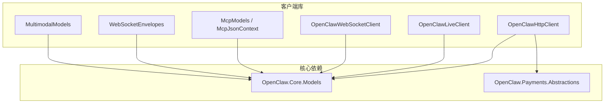
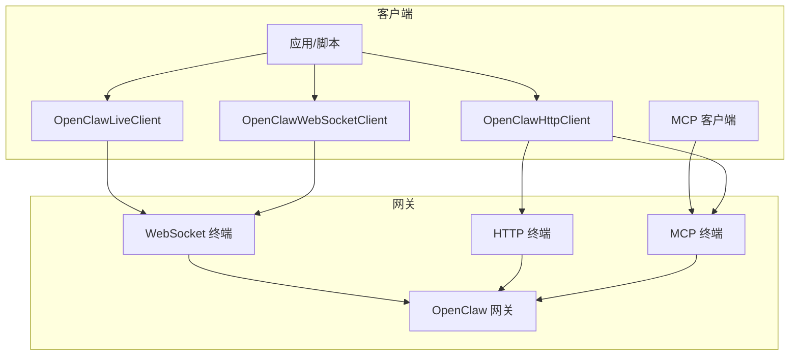
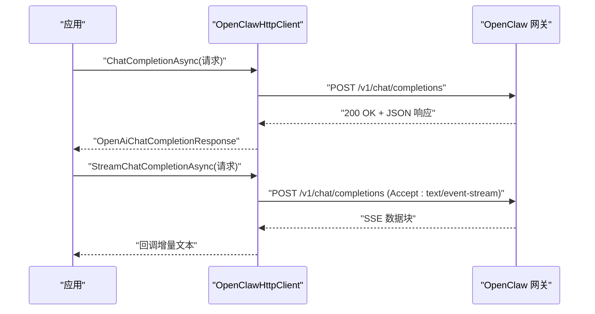
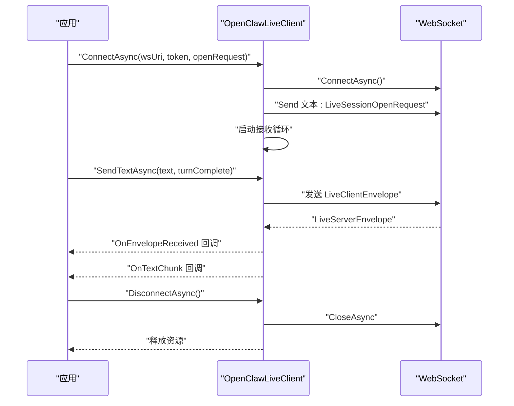
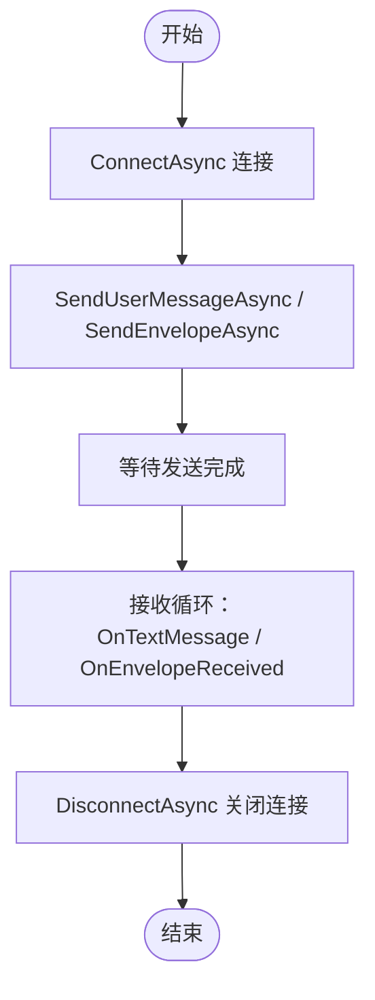
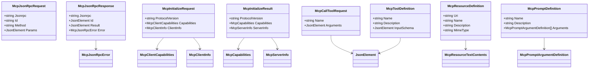
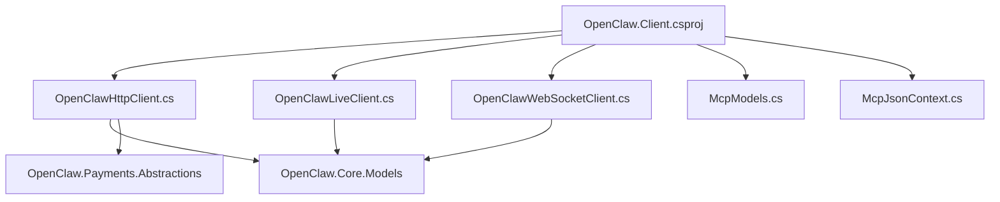

# 客户端库

<cite>
**本文引用的文件**
- [OpenClaw.Client.csproj](file://src/OpenClaw.Client/OpenClaw.Client.csproj)
- [OpenClawHttpClient.cs](file://src/OpenClaw.Client/OpenClawHttpClient.cs)
- [OpenClawLiveClient.cs](file://src/OpenClaw.Client/OpenClawLiveClient.cs)
- [OpenClawWebSocketClient.cs](file://src/OpenClaw.Client/OpenClawWebSocketClient.cs)
- [McpModels.cs](file://src/OpenClaw.Client/McpModels.cs)
- [McpJsonContext.cs](file://src/OpenClaw.Client/McpJsonContext.cs)
- [WebSocketEnvelopes.cs](file://src/OpenClaw.Core/Models/WebSocketEnvelopes.cs)
- [MultimodalModels.cs](file://src/OpenClaw.Core/Models/MultimodalModels.cs)
- [OpenClawLiveClientTests.cs](file://src/OpenClaw.Tests/OpenClawLiveClientTests.cs)
- [OpenClawWebSocketClientTests.cs](file://src/OpenClaw.Tests/OpenClawWebSocketClientTests.cs)
- [README.md](file://README.md)
- [QUICKSTART.md](file://QUICKSTART.md)
- [HarnessCommands.cs](file://src/OpenClaw.Cli/HarnessCommands.cs)
- [PaymentAwareHttpHandler.cs](file://src/OpenClaw.Payments.Core/PaymentAwareHttpHandler.cs)
- [ResilienceTests.cs](file://src/OpenClaw.Tests/ResilienceTests.cs)
</cite>

## 目录
1. [简介](#简介)
2. [项目结构](#项目结构)
3. [核心组件](#核心组件)
4. [架构总览](#架构总览)
5. [详细组件分析](#详细组件分析)
6. [依赖关系分析](#依赖关系分析)
7. [性能考虑](#性能考虑)
8. [故障排除指南](#故障排除指南)
9. [结论](#结论)
10. [附录](#附录)

## 简介
本文件为 OpenClaw.NET 客户端库的权威技术文档，面向希望在 .NET 生态中集成 OpenClaw 能力的开发者与运维人员。文档覆盖以下主题：
- 客户端库定位：提供类型化 HTTP 与 WebSocket 客户端 SDK，用于与 OpenClaw 网关进行交互。
- 连接方式：HTTP 客户端、WebSocket 客户端、MCP 客户端（JSON-RPC）。
- 功能范围：认证配置、请求发送、响应处理、错误与重试、连接管理、实时事件流、支付相关接口、会话与工具调用等。
- 使用示例与集成模式：提供多语言与多场景的使用建议、SDK 集成步骤、最佳实践与性能优化策略。

## 项目结构
OpenClaw 客户端库位于 src/OpenClaw.Client，核心文件包括：
- OpenClawHttpClient：基于 HttpClient 的类型化 HTTP 客户端，支持聊天补全、SSE 流式输出、MCP 协议、支付接口、会话与内存管理等。
- OpenClawLiveClient：面向“实时”会话的 WebSocket 客户端，支持文本/音频输入、中断、关闭会话、事件回调。
- OpenClawWebSocketClient：通用 WebSocket 客户端，支持消息封装、事件回调、断线重连与安全断开。
- McpModels 与 McpJsonContext：MCP 协议的数据模型与源生成上下文，确保高性能序列化。
- WebSocketEnvelopes 与 MultimodalModels：WebSocket 消息封装与多模态会话模型。
- 测试文件：OpenClawLiveClientTests 与 OpenClawWebSocketClientTests 提供行为验证与边界条件测试。

**图表来源**
- [OpenClawHttpClient.cs:1-1958](file://src/OpenClaw.Client/OpenClawHttpClient.cs#L1-L1958)
- [OpenClawLiveClient.cs:1-303](file://src/OpenClaw.Client/OpenClawLiveClient.cs#L1-L303)
- [OpenClawWebSocketClient.cs:1-248](file://src/OpenClaw.Client/OpenClawWebSocketClient.cs#L1-L248)
- [McpModels.cs:1-187](file://src/OpenClaw.Client/McpModels.cs#L1-L187)
- [McpJsonContext.cs:1-39](file://src/OpenClaw.Client/McpJsonContext.cs#L1-L39)
- [WebSocketEnvelopes.cs:1-109](file://src/OpenClaw.Core/Models/WebSocketEnvelopes.cs#L1-L109)
- [MultimodalModels.cs:1-118](file://src/OpenClaw.Core/Models/MultimodalModels.cs#L1-L118)

**章节来源**
- [OpenClaw.Client.csproj:1-16](file://src/OpenClaw.Client/OpenClaw.Client.csproj#L1-L16)

## 核心组件
- OpenClawHttpClient
  - 初始化：接收基础 URL 与可选认证令牌；内部构造多个子资源 URI（聊天补全、MCP、集成 API、管理员 API、支付接口、会话与内存接口等）。
  - 认证：默认添加 User-Agent，并在提供令牌时设置 Authorization 头。
  - 请求发送：统一通过 SendAsync 发送请求，支持预设头（presetId）与 SSE 流式响应。
  - 响应处理：使用 CoreJsonContext 或 McpJsonContext 进行强类型反序列化。
  - 错误处理：非成功状态码抛出 HTTP 异常，包含错误详情。
  - 支付接口：提供支付状态查询、虚拟卡签发、机器支付执行等。
  - 会话与内存：提供会话列表、详情、时间线、搜索、内存笔记增删改查、结构化记忆导出导入等。
  - 工具审批：提供审批列表、历史、决策提交等。
  - 后端会话：提供后端探测、会话启动、输入发送、事件流等。
- OpenClawLiveClient
  - 连接管理：支持授权头、连接/断开、发送文本/音频、中断、关闭会话。
  - 事件回调：OnEnvelopeReceived、OnTextChunk、OnError。
  - 安全断开：等待在途发送完成后再释放资源。
  - 大小限制：最大消息字节数控制，防止过大消息导致异常。
- OpenClawWebSocketClient
  - 连接管理：支持授权头、连接/断开、发送用户消息封装包。
  - 事件回调：OnTextMessage、OnEnvelopeReceived、OnError。
  - 安全断开：等待在途发送完成后再释放资源。
  - 大小限制：最大消息字节数控制。
- MCP 客户端能力
  - 初始化、工具列表、资源列表、资源模板列表、读取资源、提示词列表与获取、调用工具等。
  - 使用 McpJsonContext 进行高性能序列化与反序列化。
- WebSocket 封装
  - WsClientEnvelope/WsServerEnvelope：消息封装字段丰富，支持会话、消息 ID、回复关联、能力声明、结果状态等。
  - LiveClientEnvelope/LiveServerEnvelope：多模态实时会话封装，支持文本、音频、中断、转写等。

**章节来源**
- [OpenClawHttpClient.cs:91-182](file://src/OpenClaw.Client/OpenClawHttpClient.cs#L91-L182)
- [OpenClawLiveClient.cs:38-87](file://src/OpenClaw.Client/OpenClawLiveClient.cs#L38-L87)
- [OpenClawWebSocketClient.cs:38-57](file://src/OpenClaw.Client/OpenClawWebSocketClient.cs#L38-L57)
- [McpModels.cs:5-187](file://src/OpenClaw.Client/McpModels.cs#L5-L187)
- [McpJsonContext.cs:5-39](file://src/OpenClaw.Client/McpJsonContext.cs#L5-L39)
- [WebSocketEnvelopes.cs:7-108](file://src/OpenClaw.Core/Models/WebSocketEnvelopes.cs#L7-L108)
- [MultimodalModels.cs:99-117](file://src/OpenClaw.Core/Models/MultimodalModels.cs#L99-L117)

## 架构总览
下图展示了客户端库与网关之间的交互关系，以及不同连接方式的职责划分：

**图表来源**
- [OpenClawHttpClient.cs:184-185](file://src/OpenClaw.Client/OpenClawHttpClient.cs#L184-L185)
- [OpenClawLiveClient.cs:38-58](file://src/OpenClaw.Client/OpenClawLiveClient.cs#L38-L58)
- [OpenClawWebSocketClient.cs:38-57](file://src/OpenClaw.Client/OpenClawWebSocketClient.cs#L38-L57)
- [McpModels.cs:27-47](file://src/OpenClaw.Client/McpModels.cs#L27-L47)

## 详细组件分析

### OpenClawHttpClient 组件分析
- 初始化与认证
  - 构造函数接收 baseUrl 与可选 authToken，内部规范化并校验 URL，生成各子资源 URI。
  - 设置默认 User-Agent 与 Authorization 头（若提供）。
- 聊天补全与流式输出
  - ChatCompletionAsync：POST /v1/chat/completions，支持 presetId 头部。
  - StreamChatCompletionAsync：SSE 流式解析，逐段回调文本增量。
- MCP 客户端能力
  - InitializeMcpAsync、ListMcpToolsAsync、ListMcpResourcesAsync、ListMcpResourceTemplatesAsync、ReadMcpResourceAsync、ListMcpPromptsAsync、GetMcpPromptAsync、CallMcpToolAsync。
- 支付相关
  - GetPaymentSetupStatusAsync、ListPaymentFundingSourcesAsync、IssueVirtualCardAsync、ExecuteMachinePaymentAsync、GetPaymentStatusAsync。
- 集成与管理 API
  - 集成仪表盘、状态、审批、账户、后端、会话、资料、工作流、自动化、运行事件、消息、支付等。
- 会话与内存
  - 列表/详情/时间线/搜索、内存笔记增删改查、结构化记忆状态/搜索/打开/导出/最近/校验/索引刷新/交接。
- 后端会话与事件流
  - 探测、会话启动、输入发送、事件查询、SSE 事件流。
- 错误处理
  - 非成功状态码抛出 HTTP 异常，包含响应体错误信息。

**图表来源**
- [OpenClawHttpClient.cs:190-260](file://src/OpenClaw.Client/OpenClawHttpClient.cs#L190-L260)

**章节来源**
- [OpenClawHttpClient.cs:91-182](file://src/OpenClaw.Client/OpenClawHttpClient.cs#L91-L182)
- [OpenClawHttpClient.cs:184-185](file://src/OpenClaw.Client/OpenClawHttpClient.cs#L184-L185)
- [OpenClawHttpClient.cs:190-260](file://src/OpenClaw.Client/OpenClawHttpClient.cs#L190-L260)
- [OpenClawHttpClient.cs:262-320](file://src/OpenClaw.Client/OpenClawHttpClient.cs#L262-L320)
- [OpenClawHttpClient.cs:328-359](file://src/OpenClaw.Client/OpenClawHttpClient.cs#L328-L359)
- [OpenClawHttpClient.cs:517-543](file://src/OpenClaw.Client/OpenClawHttpClient.cs#L517-L543)
- [OpenClawHttpClient.cs:564-622](file://src/OpenClaw.Client/OpenClawHttpClient.cs#L564-L622)
- [OpenClawHttpClient.cs:624-662](file://src/OpenClaw.Client/OpenClawHttpClient.cs#L624-L662)

### OpenClawLiveClient 组件分析
- 连接生命周期
  - ConnectAsync：建立 WebSocket 连接，注入 Authorization 头，发送会话打开请求，启动接收循环。
  - DisconnectAsync：等待在途发送完成，关闭连接并释放资源。
- 发送能力
  - SendTextAsync、SendAudioAsync、InterruptAsync、CloseSessionAsync。
- 事件回调
  - OnEnvelopeReceived：收到服务端封装消息。
  - OnTextChunk：实时文本片段。
  - OnError：异常信息。
- 安全性与稳定性
  - 发送锁与状态锁，防止并发冲突。
  - 最大消息大小限制，避免内存溢出。
  - 接收循环异常捕获与继续处理。

**图表来源**
- [OpenClawLiveClient.cs:60-87](file://src/OpenClaw.Client/OpenClawLiveClient.cs#L60-L87)
- [OpenClawLiveClient.cs:89-123](file://src/OpenClaw.Client/OpenClawLiveClient.cs#L89-L123)
- [OpenClawLiveClient.cs:185-210](file://src/OpenClaw.Client/OpenClawLiveClient.cs#L185-L210)
- [OpenClawLiveClient.cs:212-282](file://src/OpenClaw.Client/OpenClawLiveClient.cs#L212-L282)

**章节来源**
- [OpenClawLiveClient.cs:38-87](file://src/OpenClaw.Client/OpenClawLiveClient.cs#L38-L87)
- [OpenClawLiveClient.cs:89-123](file://src/OpenClaw.Client/OpenClawLiveClient.cs#L89-L123)
- [OpenClawLiveClient.cs:185-210](file://src/OpenClaw.Client/OpenClawLiveClient.cs#L185-L210)
- [OpenClawLiveClient.cs:212-282](file://src/OpenClaw.Client/OpenClawLiveClient.cs#L212-L282)

### OpenClawWebSocketClient 组件分析
- 连接与断开
  - ConnectAsync：建立连接并启动接收循环。
  - DisconnectAsync：等待在途发送完成，关闭连接。
- 发送与封装
  - SendUserMessageAsync：发送用户消息封装包。
  - SendEnvelopeAsync：发送任意封装消息，带大小限制。
- 事件回调
  - OnTextMessage：原始文本消息。
  - OnEnvelopeReceived：反序列化后的服务器封装消息。
  - OnError：异常信息。
- 安全性
  - 发送锁与状态锁，防止并发冲突。
  - 最大消息大小限制。

**图表来源**
- [OpenClawWebSocketClient.cs:38-57](file://src/OpenClaw.Client/OpenClawWebSocketClient.cs#L38-L57)
- [OpenClawWebSocketClient.cs:119-128](file://src/OpenClaw.Client/OpenClawWebSocketClient.cs#L119-L128)
- [OpenClawWebSocketClient.cs:130-156](file://src/OpenClaw.Client/OpenClawWebSocketClient.cs#L130-L156)
- [OpenClawWebSocketClient.cs:158-227](file://src/OpenClaw.Client/OpenClawWebSocketClient.cs#L158-L227)

**章节来源**
- [OpenClawWebSocketClient.cs:38-57](file://src/OpenClaw.Client/OpenClawWebSocketClient.cs#L38-L57)
- [OpenClawWebSocketClient.cs:119-128](file://src/OpenClaw.Client/OpenClawWebSocketClient.cs#L119-L128)
- [OpenClawWebSocketClient.cs:130-156](file://src/OpenClaw.Client/OpenClawWebSocketClient.cs#L130-L156)
- [OpenClawWebSocketClient.cs:158-227](file://src/OpenClaw.Client/OpenClawWebSocketClient.cs#L158-L227)

### MCP 客户端组件分析
- 数据模型
  - McpJsonRpcRequest/Response/Error、McpInitializeRequest/Result、McpCapabilities、McpTool/Resource/Prompt 定义等。
- 源生成上下文
  - McpJsonContext：启用 camelCase 命名策略、忽略空值、禁用缩进，提升序列化性能。
- 典型流程
  - initialize → tools/list → resources/list → prompts/list → tools/call。

**图表来源**
- [McpModels.cs:5-187](file://src/OpenClaw.Client/McpModels.cs#L5-L187)
- [McpJsonContext.cs:5-39](file://src/OpenClaw.Client/McpJsonContext.cs#L5-L39)

**章节来源**
- [McpModels.cs:5-187](file://src/OpenClaw.Client/McpModels.cs#L5-L187)
- [McpJsonContext.cs:34-39](file://src/OpenClaw.Client/McpJsonContext.cs#L34-L39)

### WebSocket 封装与多模态模型
- WebSocketEnvelopes
  - WsClientEnvelope/WsServerEnvelope：支持消息类型、会话、消息 ID、回复关联、能力声明、结果状态、工单审批等字段。
- MultimodalModels
  - LiveClientEnvelope/LiveServerEnvelope：支持文本、音频、中断、错误等多模态实时会话字段。

```mermaid
classDiagram
class WsClientEnvelope {
+string Type
+string RequestId
+string ProtocolVersion
+string Operation
+string[] SupportedCatalogIds
+string Text
+string MessageId
+string ReplyToMessageId
+string SessionId
+bool? Approved
+string ApprovalId
}
class WsServerEnvelope {
+string Type
+string RequestId
+string ProtocolVersion
+string Operation
+string Text
+string InReplyToMessageId
+string SessionId
+string Error
+bool? Success
+string ApprovalId
+string ToolName
+string ArgumentsPreview
+bool? Approved
+string ResultStatus
}
class LiveClientEnvelope {
+string Type
+string Text
+string Base64Data
+string MimeType
+bool TurnComplete
}
class LiveServerEnvelope {
+string Type
+string Text
+string Base64Data
+string MimeType
+bool TurnComplete
+bool Interrupted
+string Error
}
WsServerEnvelope --> WsClientEnvelope : "响应"
LiveServerEnvelope --> LiveClientEnvelope : "响应"
```

**图表来源**
- [WebSocketEnvelopes.cs:7-108](file://src/OpenClaw.Core/Models/WebSocketEnvelopes.cs#L7-L108)
- [MultimodalModels.cs:99-117](file://src/OpenClaw.Core/Models/MultimodalModels.cs#L99-L117)

**章节来源**
- [WebSocketEnvelopes.cs:7-108](file://src/OpenClaw.Core/Models/WebSocketEnvelopes.cs#L7-L108)
- [MultimodalModels.cs:99-117](file://src/OpenClaw.Core/Models/MultimodalModels.cs#L99-L117)

## 依赖关系分析
- 项目依赖
  - OpenClawHttpClient.cs 依赖 OpenClaw.Core.Models 与 OpenClaw.Payments.Abstractions，以获得统一的模型与支付抽象。
  - OpenClawLiveClient.cs 与 OpenClawWebSocketClient.cs 依赖 OpenClaw.Core.Models 中的 WebSocket 封装与多模态模型。
  - McpJsonContext 依赖 System.Text.Json.SourceGeneration，启用 camelCase、忽略空值与禁用缩进，提升性能。
- 外部依赖
  - System.Net.Http、System.Net.WebSockets、System.Text.Json。

**图表来源**
- [OpenClaw.Client.csproj:11-14](file://src/OpenClaw.Client/OpenClaw.Client.csproj#L11-L14)
- [OpenClawHttpClient.cs:1-7](file://src/OpenClaw.Client/OpenClawHttpClient.cs#L1-L7)
- [OpenClawLiveClient.cs:1-6](file://src/OpenClaw.Client/OpenClawLiveClient.cs#L1-L6)
- [OpenClawWebSocketClient.cs:1-6](file://src/OpenClaw.Client/OpenClawWebSocketClient.cs#L1-L6)
- [McpModels.cs:1-2](file://src/OpenClaw.Client/McpModels.cs#L1-L2)
- [McpJsonContext.cs:1-3](file://src/OpenClaw.Client/McpJsonContext.cs#L1-L3)

**章节来源**
- [OpenClaw.Client.csproj:11-14](file://src/OpenClaw.Client/OpenClaw.Client.csproj#L11-L14)

## 性能考虑
- 序列化性能
  - 使用 McpJsonContext 与 CoreJsonContext，启用 camelCase、忽略空值、禁用缩进，减少序列化开销。
- 流式处理
  - SSE 流式聊天补全与后端事件流采用按行解析，避免一次性加载全部内容。
- 连接与并发
  - 发送锁与状态锁确保并发安全；最大消息大小限制防止内存压力。
- 超时与重试
  - 可结合 CircuitBreaker 与 PaymentAwareHttpHandler 实现重试与退避策略（见测试与支付处理器）。
- 缓冲区复用
  - 接收循环使用 ArrayPool<byte> 与 ArrayBufferWriter<byte>，降低 GC 压力。

**章节来源**
- [McpJsonContext.cs:34-39](file://src/OpenClaw.Client/McpJsonContext.cs#L34-L39)
- [OpenClawHttpClient.cs:204-260](file://src/OpenClaw.Client/OpenClawHttpClient.cs#L204-L260)
- [OpenClawLiveClient.cs:212-282](file://src/OpenClaw.Client/OpenClawLiveClient.cs#L212-L282)
- [OpenClawWebSocketClient.cs:158-227](file://src/OpenClaw.Client/OpenClawWebSocketClient.cs#L158-L227)
- [ResilienceTests.cs:1-36](file://src/OpenClaw.Tests/ResilienceTests.cs#L1-L36)
- [PaymentAwareHttpHandler.cs:62-97](file://src/OpenClaw.Payments.Core/PaymentAwareHttpHandler.cs#L62-L97)

## 故障排除指南
- 认证失败
  - 确认 OPENCLAW_AUTH_TOKEN 或传入的 authToken 正确；检查网关是否要求非本地绑定时强制认证。
- 连接问题
  - WebSocket 连接失败：检查 ws/wss 协议与网关绑定地址；确认 Authorization 头正确设置。
  - 断开异常：确保在 DisconnectAsync 前等待发送任务完成；参考测试用例验证行为。
- 消息过大
  - 发送或接收消息超过最大字节限制时抛出异常；适当减小消息或调整 maxMessageBytes。
- SSE 流解析错误
  - 确保 Accept: text/event-stream；检查数据块格式与 JSON 解析异常。
- 支付接口异常
  - 检查 provider、environment 参数；确认支付状态查询路径与参数拼接正确。
- 会话与内存操作
  - 确认 sessionId 与 key 参数不为空；检查权限与网关返回的错误信息。

**章节来源**
- [OpenClawLiveClientTests.cs:10-28](file://src/OpenClaw.Tests/OpenClawLiveClientTests.cs#L10-L28)
- [OpenClawWebSocketClientTests.cs:8-26](file://src/OpenClaw.Tests/OpenClawWebSocketClientTests.cs#L8-L26)
- [OpenClawLiveClient.cs:189-190](file://src/OpenClaw.Client/OpenClawLiveClient.cs#L189-L190)
- [OpenClawWebSocketClient.cs:135-136](file://src/OpenClaw.Client/OpenClawWebSocketClient.cs#L135-L136)
- [OpenClawHttpClient.cs:242-249](file://src/OpenClaw.Client/OpenClawHttpClient.cs#L242-L249)
- [README.md:279-291](file://README.md#L279-L291)

## 结论
OpenClaw 客户端库提供了类型化、高性能且易于使用的 .NET 客户端 SDK，覆盖 HTTP、WebSocket 与 MCP 三大连接方式。通过严格的模型定义、源生成优化与完善的错误处理机制，开发者可以快速集成聊天补全、实时多模态会话、工具调用、支付与会话/内存管理等功能。配合 CircuitBreaker 与支付处理器，可在生产环境中实现稳健的重试与退避策略。

## 附录

### 使用示例与集成指南
- 初始化与认证
  - 在应用启动时创建 OpenClawHttpClient，传入 baseUrl 与可选 authToken。
  - 对于 WebSocket 客户端，先 ConnectAsync 再发送消息；对于实时会话，先 ConnectAsync 再发送 LiveSessionOpenRequest。
- 请求发送与响应处理
  - HTTP：使用 ChatCompletionAsync 或 StreamChatCompletionAsync；根据需要设置 presetId。
  - WebSocket：使用 SendUserMessageAsync 或 SendEnvelopeAsync；订阅 OnTextMessage/OnEnvelopeReceived。
  - 实时会话：使用 SendTextAsync/SendAudioAsync；订阅 OnTextChunk/OnEnvelopeReceived。
- 错误与重试
  - 捕获 HTTP 异常并记录；结合 CircuitBreaker 实现指数退避。
  - 对于支付接口，使用 PaymentAwareHttpHandler 进行请求克隆与重试。
- 集成模式
  - CLI/脚本：通过 OpenClawHttpClient 执行命令式操作。
  - 桌面应用：使用 OpenClawLiveClient 或 OpenClawWebSocketClient 提供交互体验。
  - 自动化：通过 HTTP API 与 MCP 工具链实现自动化编排。

**章节来源**
- [HarnessCommands.cs:252-253](file://src/OpenClaw.Cli/HarnessCommands.cs#L252-L253)
- [README.md:218-223](file://README.md#L218-L223)
- [QUICKSTART.md:10-51](file://QUICKSTART.md#L10-L51)