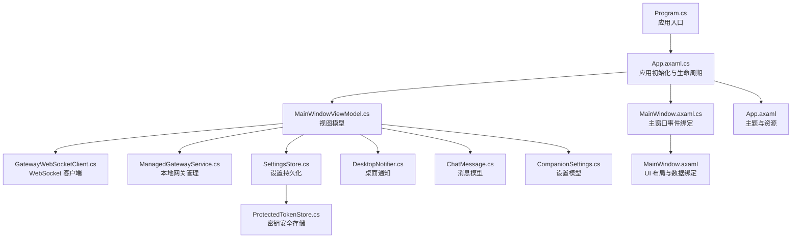
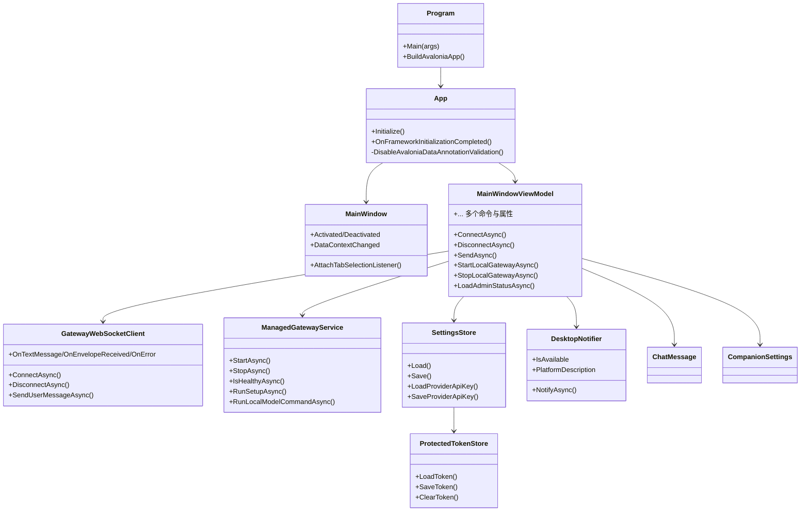
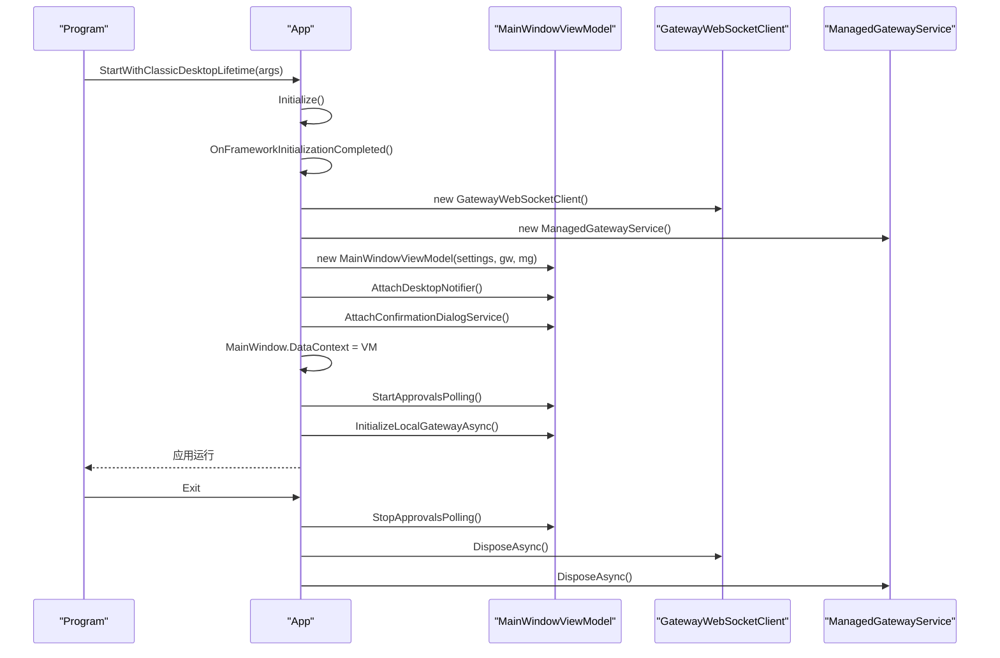
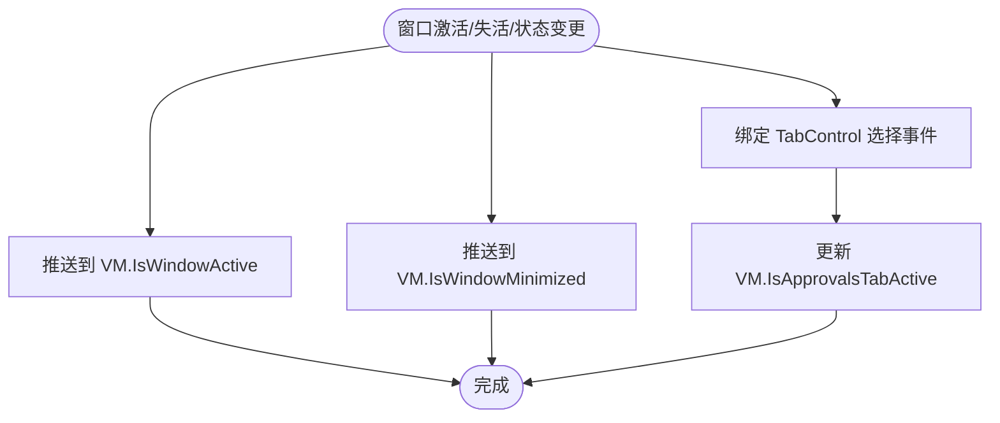
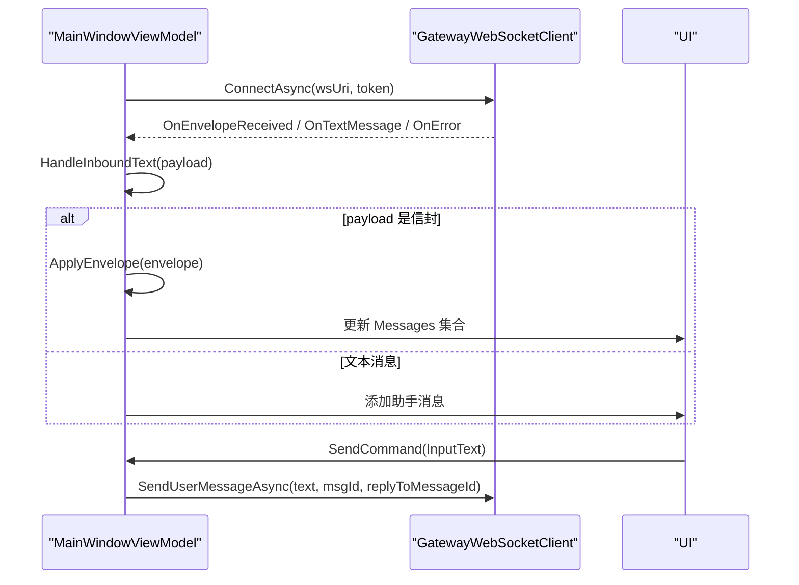
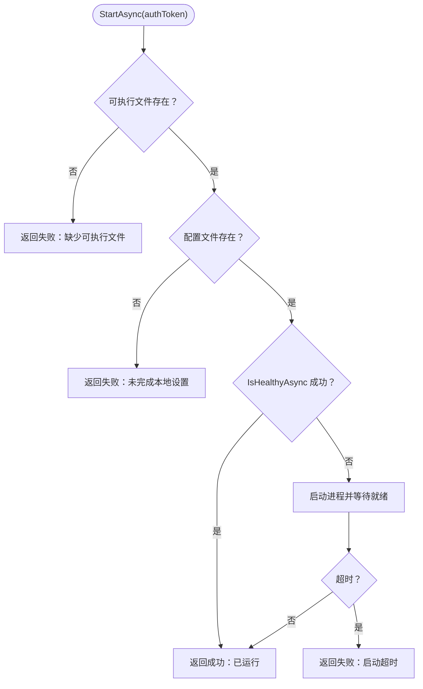
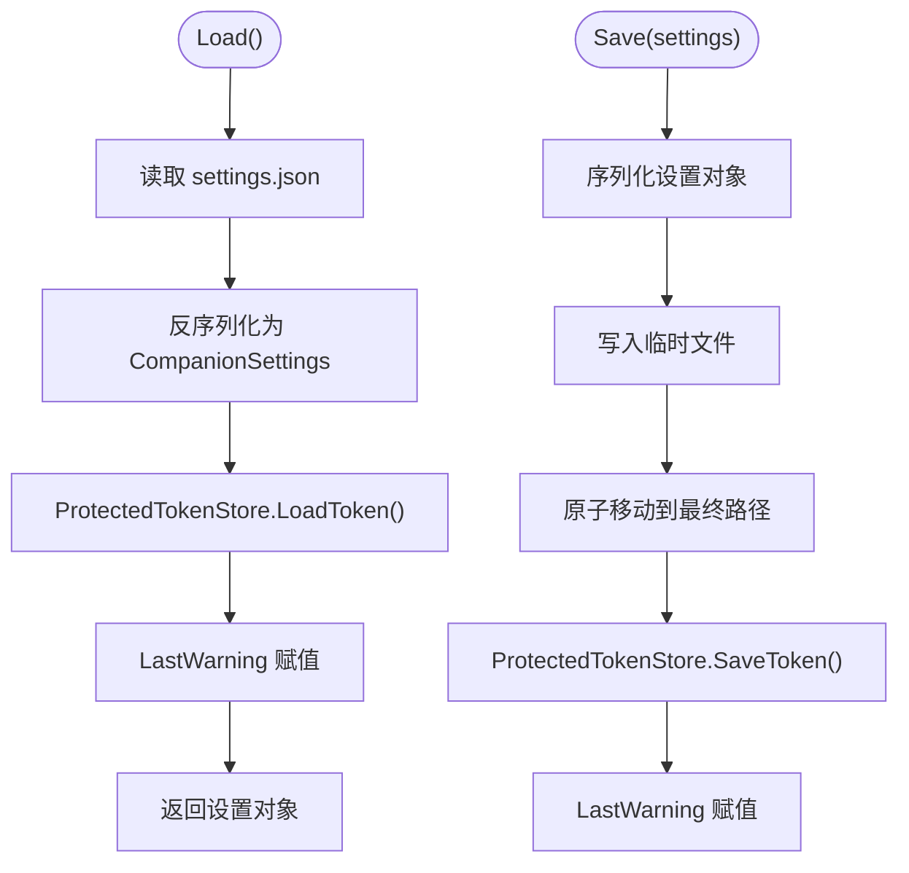
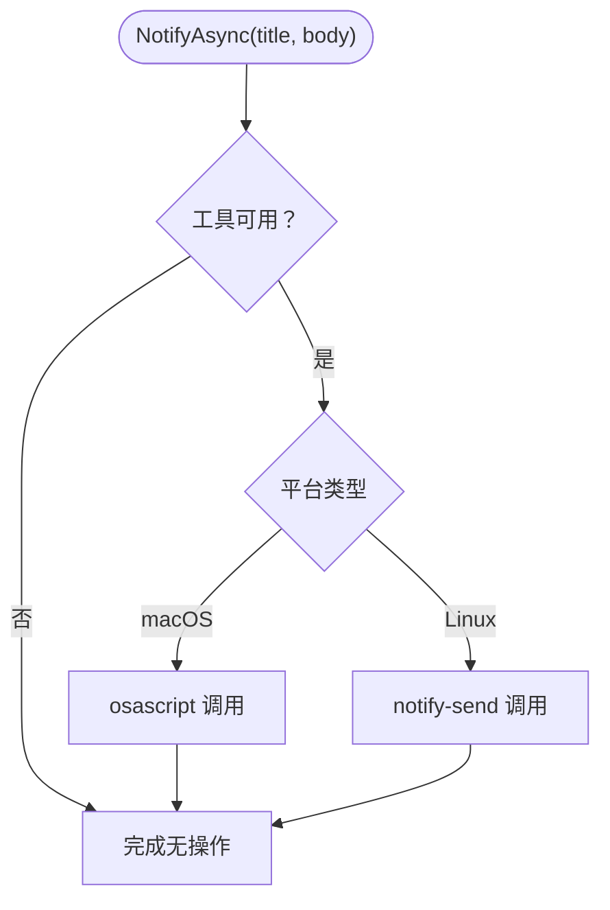
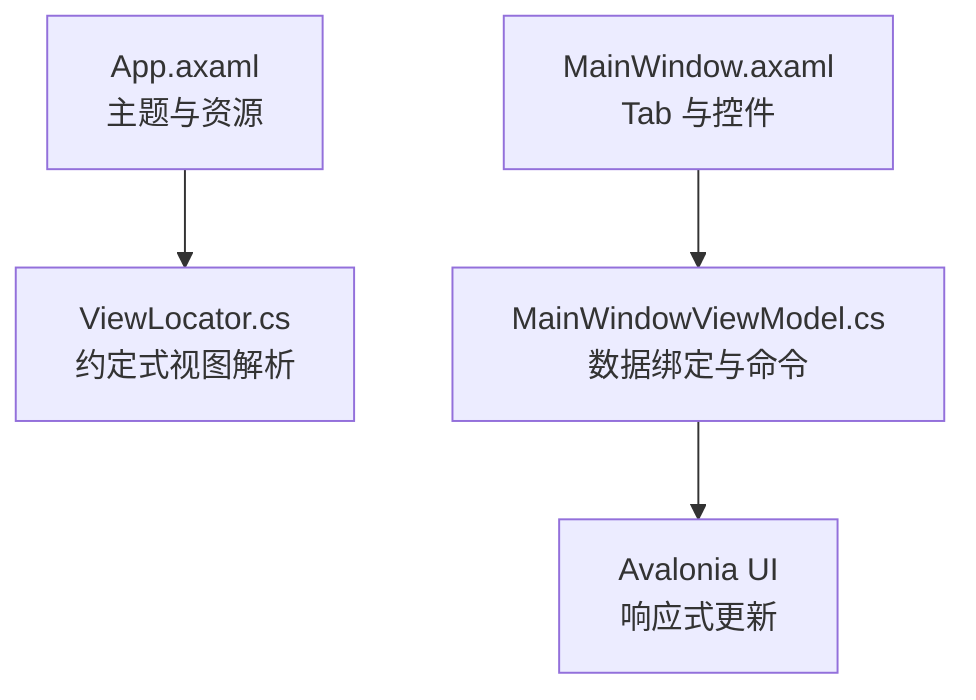
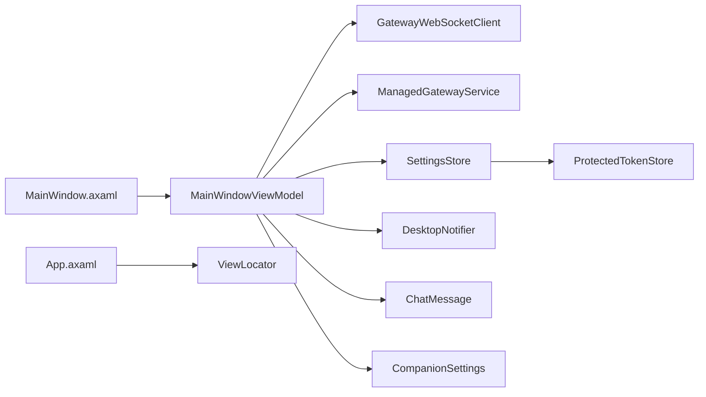

# 桌面客户端

<cite>
**本文引用的文件**
- [App.axaml.cs](file://src/OpenClaw.Companion/App.axaml.cs)
- [Program.cs](file://src/OpenClaw.Companion/Program.cs)
- [App.axaml](file://src/OpenClaw.Companion/App.axaml)
- [MainWindow.axaml.cs](file://src/OpenClaw.Companion/Views/MainWindow.axaml.cs)
- [MainWindow.axaml](file://src/OpenClaw.Companion/Views/MainWindow.axaml)
- [MainWindowViewModel.cs](file://src/OpenClaw.Companion/ViewModels/MainWindowViewModel.cs)
- [ViewModelBase.cs](file://src/OpenClaw.Companion/ViewModels/ViewModelBase.cs)
- [ViewLocator.cs](file://src/OpenClaw.Companion/ViewLocator.cs)
- [DesktopNotifier.cs](file://src/OpenClaw.Companion/Services/DesktopNotifier.cs)
- [ManagedGatewayService.cs](file://src/OpenClaw.Companion/Services/ManagedGatewayService.cs)
- [SettingsStore.cs](file://src/OpenClaw.Companion/Services/SettingsStore.cs)
- [ProtectedTokenStore.cs](file://src/OpenClaw.Companion/Services/ProtectedTokenStore.cs)
- [GatewayWebSocketClient.cs](file://src/OpenClaw.Companion/Services/GatewayWebSocketClient.cs)
- [ChatMessage.cs](file://src/OpenClaw.Companion/Models/ChatMessage.cs)
- [CompanionSettings.cs](file://src/OpenClaw.Companion/Models/CompanionSettings.cs)
</cite>

## 目录
1. [简介](#简介)
2. [项目结构](#项目结构)
3. [核心组件](#核心组件)
4. [架构总览](#架构总览)
5. [详细组件分析](#详细组件分析)
6. [依赖关系分析](#依赖关系分析)
7. [性能考虑](#性能考虑)
8. [故障排查指南](#故障排查指南)
9. [结论](#结论)
10. [附录](#附录)

## 简介
本文件为基于 Avalonia 的跨平台桌面客户端（OpenClaw.Companion）的完整技术文档。该客户端以 MVVM 架构为核心，结合服务层与通知系统，提供网关管理、实时消息展示、审批流程、会话与工作流管理、插件与通道监控、支付实验区等功能。文档覆盖窗口管理、视图模型、服务层、通知系统、主题与样式、跨平台安全存储、以及性能与用户体验设计要点。

## 项目结构
- 应用入口与生命周期：Program、App、MainWindow
- 视图与视图模型：MainWindow.axaml(.cs)、MainWindowViewModel
- 服务层：GatewayWebSocketClient、ManagedGatewayService、SettingsStore、ProtectedTokenStore、DesktopNotifier
- 模型：ChatMessage、CompanionSettings
- 样式与主题：App.axaml 中 FluentTheme 与自定义样式资源

**图表来源**
- [Program.cs:1-22](file://src/OpenClaw.Companion/Program.cs#L1-L22)
- [App.axaml.cs:1-78](file://src/OpenClaw.Companion/App.axaml.cs#L1-L78)
- [MainWindow.axaml.cs:1-66](file://src/OpenClaw.Companion/Views/MainWindow.axaml.cs#L1-L66)
- [MainWindowViewModel.cs:1-701](file://src/OpenClaw.Companion/ViewModels/MainWindowViewModel.cs#L1-L701)
- [GatewayWebSocketClient.cs:1-49](file://src/OpenClaw.Companion/Services/GatewayWebSocketClient.cs#L1-L49)
- [ManagedGatewayService.cs:1-674](file://src/OpenClaw.Companion/Services/ManagedGatewayService.cs#L1-L674)
- [SettingsStore.cs:1-204](file://src/OpenClaw.Companion/Services/SettingsStore.cs#L1-L204)
- [ProtectedTokenStore.cs:1-587](file://src/OpenClaw.Companion/Services/ProtectedTokenStore.cs#L1-L587)
- [DesktopNotifier.cs:1-176](file://src/OpenClaw.Companion/Services/DesktopNotifier.cs#L1-L176)
- [ChatMessage.cs:1-41](file://src/OpenClaw.Companion/Models/ChatMessage.cs#L1-L41)
- [CompanionSettings.cs:1-25](file://src/OpenClaw.Companion/Models/CompanionSettings.cs#L1-L25)
- [App.axaml:1-22](file://src/OpenClaw.Companion/App.axaml#L1-L22)
- [MainWindow.axaml:1-501](file://src/OpenClaw.Companion/Views/MainWindow.axaml#L1-L501)

**章节来源**
- [Program.cs:1-22](file://src/OpenClaw.Companion/Program.cs#L1-L22)
- [App.axaml.cs:1-78](file://src/OpenClaw.Companion/App.axaml.cs#L1-L78)
- [App.axaml:1-22](file://src/OpenClaw.Companion/App.axaml#L1-L22)

## 核心组件
- 应用入口与生命周期：Program 启动 Avalonia，App 在框架初始化时构建视图模型、注入服务、启动轮询与本地网关初始化。
- 主窗口与事件绑定：MainWindow 负责窗口激活/最小化状态同步到 VM、标签页选择监听、以及运行时状态推送。
- 视图模型：MainWindowViewModel 负责连接管理、消息流解析、聊天消息聚合、审批轮询、网关状态、仪表盘数据、各功能模块的数据加载与命令执行。
- 服务层：
  - GatewayWebSocketClient：封装底层 WebSocket 客户端事件转发。
  - ManagedGatewayService：负责本地网关进程管理、健康检查、配置读取、可执行文件解析、环境变量注入。
  - SettingsStore：设置文件持久化与令牌加载/保存。
  - ProtectedTokenStore：跨平台密钥安全存储（macOS Keychain、Windows DPAPI、Linux Secret-tool 或明文回退）。
  - DesktopNotifier：跨平台桌面通知（macOS/ Linux）。
- 模型：CompanionSettings、ChatMessage 提供数据契约与 UI 属性计算。

**章节来源**
- [MainWindowViewModel.cs:1-701](file://src/OpenClaw.Companion/ViewModels/MainWindowViewModel.cs#L1-L701)
- [GatewayWebSocketClient.cs:1-49](file://src/OpenClaw.Companion/Services/GatewayWebSocketClient.cs#L1-L49)
- [ManagedGatewayService.cs:1-674](file://src/OpenClaw.Companion/Services/ManagedGatewayService.cs#L1-L674)
- [SettingsStore.cs:1-204](file://src/OpenClaw.Companion/Services/SettingsStore.cs#L1-L204)
- [ProtectedTokenStore.cs:1-587](file://src/OpenClaw.Companion/Services/ProtectedTokenStore.cs#L1-L587)
- [DesktopNotifier.cs:1-176](file://src/OpenClaw.Companion/Services/DesktopNotifier.cs#L1-L176)
- [CompanionSettings.cs:1-25](file://src/OpenClaw.Companion/Models/CompanionSettings.cs#L1-L25)
- [ChatMessage.cs:1-41](file://src/OpenClaw.Companion/Models/ChatMessage.cs#L1-L41)

## 架构总览
客户端采用 MVVM + 服务层解耦的设计：
- 视图层：Avalonia XAML 布局，通过 DataContext 绑定到 ViewModel。
- 视图模型层：MainWindowViewModel 聚合业务逻辑、命令、状态与服务调用。
- 服务层：独立的服务类负责网络、进程、配置、安全与通知。
- 数据模型：轻量不可变记录类型，便于 UI 绑定与状态追踪。

**图表来源**
- [Program.cs:1-22](file://src/OpenClaw.Companion/Program.cs#L1-L22)
- [App.axaml.cs:1-78](file://src/OpenClaw.Companion/App.axaml.cs#L1-L78)
- [MainWindow.axaml.cs:1-66](file://src/OpenClaw.Companion/Views/MainWindow.axaml.cs#L1-L66)
- [MainWindowViewModel.cs:1-701](file://src/OpenClaw.Companion/ViewModels/MainWindowViewModel.cs#L1-L701)
- [GatewayWebSocketClient.cs:1-49](file://src/OpenClaw.Companion/Services/GatewayWebSocketClient.cs#L1-L49)
- [ManagedGatewayService.cs:1-674](file://src/OpenClaw.Companion/Services/ManagedGatewayService.cs#L1-L674)
- [SettingsStore.cs:1-204](file://src/OpenClaw.Companion/Services/SettingsStore.cs#L1-L204)
- [ProtectedTokenStore.cs:1-587](file://src/OpenClaw.Companion/Services/ProtectedTokenStore.cs#L1-L587)
- [DesktopNotifier.cs:1-176](file://src/OpenClaw.Companion/Services/DesktopNotifier.cs#L1-L176)
- [ChatMessage.cs:1-41](file://src/OpenClaw.Companion/Models/ChatMessage.cs#L1-L41)
- [CompanionSettings.cs:1-25](file://src/OpenClaw.Companion/Models/CompanionSettings.cs#L1-L25)

## 详细组件分析

### 应用入口与生命周期
- Program：使用 Avalonia 的经典桌面生命周期启动应用；BuildAvaloniaApp 配置平台检测、字体与日志。
- App：在框架初始化完成后禁用重复的数据验证插件，构造 GatewayWebSocketClient、ManagedGatewayService、SettingsStore，创建 MainWindowViewModel 并注入通知器与确认对话框服务，设置 MainWindow 为主窗体；在退出时停止轮询并释放资源。

**图表来源**
- [Program.cs:1-22](file://src/OpenClaw.Companion/Program.cs#L1-L22)
- [App.axaml.cs:1-78](file://src/OpenClaw.Companion/App.axaml.cs#L1-L78)

**章节来源**
- [Program.cs:1-22](file://src/OpenClaw.Companion/Program.cs#L1-L22)
- [App.axaml.cs:1-78](file://src/OpenClaw.Companion/App.axaml.cs#L1-L78)

### 主窗口与交互
- MainWindow：在激活/失活时向 VM 推送窗口状态；在窗口 DataContext 变更时绑定标签页选择事件；根据 TabControl 当前选中项更新“审批”标签页活跃状态。

**图表来源**
- [MainWindow.axaml.cs:1-66](file://src/OpenClaw.Companion/Views/MainWindow.axaml.cs#L1-L66)

**章节来源**
- [MainWindow.axaml.cs:1-66](file://src/OpenClaw.Companion/Views/MainWindow.axaml.cs#L1-L66)

### 视图模型：消息流与连接管理
- 连接管理：ConnectAsync/DisconnectAsync 控制 WebSocket 连接；连接成功后发送“已就绪”信号并加载管理员状态与 WhatsApp 设置。
- 消息流解析：HandleInboundText 解析文本或入站信封；ApplyEnvelope 分发不同类型的信封（打字开始/结束、助手片段/消息、错误、工具事件等），并维护当前“活动助手消息”的索引与回复 ID。
- 命令与状态：提供发送消息、启动/停止本地网关、加载仪表盘、审批刷新、工作流/自动化/内存/模型/插件/通道等模块的命令与状态属性。

**图表来源**
- [MainWindowViewModel.cs:198-265](file://src/OpenClaw.Companion/ViewModels/MainWindowViewModel.cs#L198-L265)
- [GatewayWebSocketClient.cs:24-34](file://src/OpenClaw.Companion/Services/GatewayWebSocketClient.cs#L24-L34)

**章节来源**
- [MainWindowViewModel.cs:198-265](file://src/OpenClaw.Companion/ViewModels/MainWindowViewModel.cs#L198-L265)
- [MainWindowViewModel.cs:485-689](file://src/OpenClaw.Companion/ViewModels/MainWindowViewModel.cs#L485-L689)

### 本地网关管理服务
- 可执行文件解析：支持直接路径、Resources 目录与 dotnet run 回退，自动定位 OpenClaw.Gateway 与 openclaw CLI。
- 进程管理：StartAsync/StopAsync 启停本地网关；WaitForReadyAsync 轮询健康状态；IsHealthyAsync 通过 /health 探针判断。
- 配置与路径：读取配置文件中的绑定地址与端口，生成 WebSocket URL；提供默认用户目录下的配置与工作区路径。
- 命令执行：RunSetupAsync 执行首次设置；RunLocalModelCommandAsync 支持安装/验证/移除嵌入式本地模型。

**图表来源**
- [ManagedGatewayService.cs:161-202](file://src/OpenClaw.Companion/Services/ManagedGatewayService.cs#L161-L202)
- [ManagedGatewayService.cs:238-264](file://src/OpenClaw.Companion/Services/ManagedGatewayService.cs#L238-L264)
- [ManagedGatewayService.cs:314-328](file://src/OpenClaw.Companion/Services/ManagedGatewayService.cs#L314-L328)

**章节来源**
- [ManagedGatewayService.cs:161-202](file://src/OpenClaw.Companion/Services/ManagedGatewayService.cs#L161-L202)
- [ManagedGatewayService.cs:238-264](file://src/OpenClaw.Companion/Services/ManagedGatewayService.cs#L238-L264)
- [ManagedGatewayService.cs:314-328](file://src/OpenClaw.Companion/Services/ManagedGatewayService.cs#L314-L328)
- [ManagedGatewayService.cs:412-453](file://src/OpenClaw.Companion/Services/ManagedGatewayService.cs#L412-L453)

### 设置与安全存储
- SettingsStore：统一加载/保存设置；从受保护令牌存储加载操作员令牌；支持明文回退开关；写入临时文件再原子移动。
- ProtectedTokenStore：按平台选择安全存储（macOS Keychain、Windows DPAPI、Linux Secret-tool），否则回退到明文文件；提供警告信息与清理能力。

**图表来源**
- [SettingsStore.cs:37-118](file://src/OpenClaw.Companion/Services/SettingsStore.cs#L37-L118)
- [ProtectedTokenStore.cs:45-106](file://src/OpenClaw.Companion/Services/ProtectedTokenStore.cs#L45-L106)

**章节来源**
- [SettingsStore.cs:37-118](file://src/OpenClaw.Companion/Services/SettingsStore.cs#L37-L118)
- [ProtectedTokenStore.cs:45-106](file://src/OpenClaw.Companion/Services/ProtectedTokenStore.cs#L45-L106)

### 桌面通知
- DesktopNotifier：检测平台与可用工具（macOS osascript、Linux notify-send），异步触发系统通知；对潜在泄漏进程进行超时与取消处理；提供平台描述与可用性状态。

**图表来源**
- [DesktopNotifier.cs:41-52](file://src/OpenClaw.Companion/Services/DesktopNotifier.cs#L41-L52)
- [DesktopNotifier.cs:105-112](file://src/OpenClaw.Companion/Services/DesktopNotifier.cs#L105-L112)

**章节来源**
- [DesktopNotifier.cs:41-52](file://src/OpenClaw.Companion/Services/DesktopNotifier.cs#L41-L52)
- [DesktopNotifier.cs:105-112](file://src/OpenClaw.Companion/Services/DesktopNotifier.cs#L105-L112)

### UI 布局与数据绑定
- App.axaml：配置 FluentTheme 与自定义样式资源，注册 ViewLocator 实现约定式视图解析。
- MainWindow.axaml：采用网格与 TabControl 布局，左侧标签页导航，右侧内容区域；大量使用数据绑定与命令绑定，支持连接设置、仪表盘、聊天、Canvas、会话、审批、工作流、自动化、运行事件、插件/通道、内存/档案、模型/提供商、管理、WhatsApp、支付实验区等页面。
- ViewLocator：根据 ViewModel 类名约定解析对应 View。

**图表来源**
- [App.axaml:1-22](file://src/OpenClaw.Companion/App.axaml#L1-L22)
- [ViewLocator.cs:15-37](file://src/OpenClaw.Companion/ViewLocator.cs#L15-L37)
- [MainWindow.axaml:1-501](file://src/OpenClaw.Companion/Views/MainWindow.axaml#L1-L501)

**章节来源**
- [App.axaml:1-22](file://src/OpenClaw.Companion/App.axaml#L1-L22)
- [ViewLocator.cs:15-37](file://src/OpenClaw.Companion/ViewLocator.cs#L15-L37)
- [MainWindow.axaml:1-501](file://src/OpenClaw.Companion/Views/MainWindow.axaml#L1-L501)

## 依赖关系分析
- 组件耦合：
  - MainWindowViewModel 依赖 GatewayWebSocketClient、ManagedGatewayService、SettingsStore、DesktopNotifier，形成核心业务闭环。
  - SettingsStore 依赖 ProtectedTokenStore，实现密钥安全存储。
  - ViewLocator 与 XAML 布局解耦视图与视图模型。
- 外部依赖：
  - Avalonia UI 框架、CommunityToolkit.Mvvm（RelayCommand）、A2UI Canvas 模型（来自 OpenClaw.Core）。
  - 平台工具：osascript（macOS）、notify-send（Linux）、Windows DPAPI、macOS Keychain、Linux Secret-tool。

**图表来源**
- [MainWindowViewModel.cs:1-115](file://src/OpenClaw.Companion/ViewModels/MainWindowViewModel.cs#L1-L115)
- [GatewayWebSocketClient.cs:1-49](file://src/OpenClaw.Companion/Services/GatewayWebSocketClient.cs#L1-L49)
- [ManagedGatewayService.cs:1-674](file://src/OpenClaw.Companion/Services/ManagedGatewayService.cs#L1-L674)
- [SettingsStore.cs:1-204](file://src/OpenClaw.Companion/Services/SettingsStore.cs#L1-L204)
- [ProtectedTokenStore.cs:1-587](file://src/OpenClaw.Companion/Services/ProtectedTokenStore.cs#L1-L587)
- [DesktopNotifier.cs:1-176](file://src/OpenClaw.Companion/Services/DesktopNotifier.cs#L1-L176)
- [ChatMessage.cs:1-41](file://src/OpenClaw.Companion/Models/ChatMessage.cs#L1-L41)
- [CompanionSettings.cs:1-25](file://src/OpenClaw.Companion/Models/CompanionSettings.cs#L1-L25)
- [App.axaml:1-22](file://src/OpenClaw.Companion/App.axaml#L1-L22)
- [ViewLocator.cs:15-37](file://src/OpenClaw.Companion/ViewLocator.cs#L15-L37)
- [MainWindow.axaml:1-501](file://src/OpenClaw.Companion/Views/MainWindow.axaml#L1-L501)

**章节来源**
- [MainWindowViewModel.cs:1-115](file://src/OpenClaw.Companion/ViewModels/MainWindowViewModel.cs#L1-L115)
- [App.axaml:1-22](file://src/OpenClaw.Companion/App.axaml#L1-L22)
- [ViewLocator.cs:15-37](file://src/OpenClaw.Companion/ViewLocator.cs#L15-L37)
- [MainWindow.axaml:1-501](file://src/OpenClaw.Companion/Views/MainWindow.axaml#L1-L501)

## 性能考虑
- UI 线程调度：MainWindowViewModel 使用 Dispatcher.UIThread.Post 将 UI 更新切回主线程，避免跨线程访问异常。
- 异步 I/O：GatewayWebSocketClient、ManagedGatewayService、SettingsStore、ProtectedTokenStore 全面采用异步方法，避免阻塞 UI。
- 超时与取消：桌面通知、进程执行、HTTP 健康检查均设置合理超时与取消令牌，防止卡顿与资源泄漏。
- 内存与集合：Messages 使用 ObservableCollection，配合 UI 列表绑定，减少不必要的重绘；Canvas 组件按需渲染，滚动查看器仅在有内容时显示。
- 跨平台安全存储：优先使用系统级安全存储，回退到明文存储时提供警告，避免敏感信息泄露。

[本节为通用指导，无需特定文件来源]

## 故障排查指南
- 连接问题：
  - 检查 ServerUrl 是否为有效的 WebSocket 地址；确认认证令牌是否正确；查看 OnError 事件输出。
  - 参考：[MainWindowViewModel.cs:485-520](file://src/OpenClaw.Companion/ViewModels/MainWindowViewModel.cs#L485-L520)、[GatewayWebSocketClient.cs:24-28](file://src/OpenClaw.Companion/Services/GatewayWebSocketClient.cs#L24-L28)
- 本地网关启动失败：
  - 查看启动结果与错误信息；确认可执行文件是否存在；检查配置文件路径与权限；必要时手动运行 CLI 进行诊断。
  - 参考：[ManagedGatewayService.cs:161-202](file://src/OpenClaw.Companion/Services/ManagedGatewayService.cs#L161-L202)、[ManagedGatewayService.cs:330-387](file://src/OpenClaw.Companion/Services/ManagedGatewayService.cs#L330-L387)
- 令牌加载失败：
  - 检查受保护存储可用性与警告信息；若启用明文回退，确认 AllowPlaintextTokenFallback；必要时清理回退文件。
  - 参考：[ProtectedTokenStore.cs:45-106](file://src/OpenClaw.Companion/Services/ProtectedTokenStore.cs#L45-L106)、[SettingsStore.cs:37-77](file://src/OpenClaw.Companion/Services/SettingsStore.cs#L37-L77)
- 桌面通知无效：
  - 检查平台与工具可用性；确认通知平台描述；查看超时与取消日志。
  - 参考：[DesktopNotifier.cs:29-52](file://src/OpenClaw.Companion/Services/DesktopNotifier.cs#L29-L52)、[DesktopNotifier.cs:114-163](file://src/OpenClaw.Companion/Services/DesktopNotifier.cs#L114-L163)

**章节来源**
- [MainWindowViewModel.cs:485-520](file://src/OpenClaw.Companion/ViewModels/MainWindowViewModel.cs#L485-L520)
- [GatewayWebSocketClient.cs:24-28](file://src/OpenClaw.Companion/Services/GatewayWebSocketClient.cs#L24-L28)
- [ManagedGatewayService.cs:161-202](file://src/OpenClaw.Companion/Services/ManagedGatewayService.cs#L161-L202)
- [ManagedGatewayService.cs:330-387](file://src/OpenClaw.Companion/Services/ManagedGatewayService.cs#L330-L387)
- [ProtectedTokenStore.cs:45-106](file://src/OpenClaw.Companion/Services/ProtectedTokenStore.cs#L45-L106)
- [SettingsStore.cs:37-77](file://src/OpenClaw.Companion/Services/SettingsStore.cs#L37-L77)
- [DesktopNotifier.cs:29-52](file://src/OpenClaw.Companion/Services/DesktopNotifier.cs#L29-L52)
- [DesktopNotifier.cs:114-163](file://src/OpenClaw.Companion/Services/DesktopNotifier.cs#L114-L163)

## 结论
本桌面客户端以 Avalonia 为基础，结合 MVVM 与服务层解耦，实现了跨平台的网关管理、实时消息展示、审批与运营可视化、以及丰富的管理功能。通过受保护的安全存储与跨平台通知，兼顾了安全性与用户体验。建议在生产环境中进一步完善错误恢复、日志分级与可观测性，并持续优化 Canvas 渲染与大数据量列表的虚拟化。

[本节为总结，无需特定文件来源]

## 附录
- 开发与调试建议：
  - 使用 DebugMode 时可直接显示原始文本消息，便于调试。
  - 通过环境变量 OPENCLAW_BASE_URL 与 OPENCLAW_AUTH_TOKEN 快速覆盖默认设置。
  - 在 macOS/Linux 上确保系统通知工具可用；在 Windows 上桌面通知当前不支持。
- 跨平台兼容性：
  - 平台检测与资源加载由 Avalonia 自动处理；安全存储按平台选择最优方案。
- 主题与样式：
  - 使用 FluentTheme 与自定义样式资源，支持跟随系统主题变化。

[本节为通用指导，无需特定文件来源]