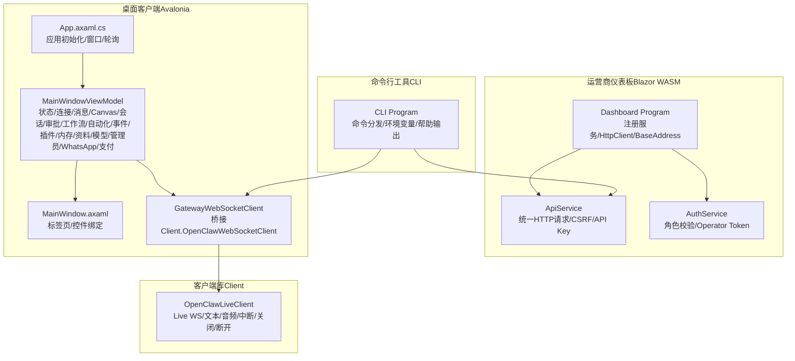
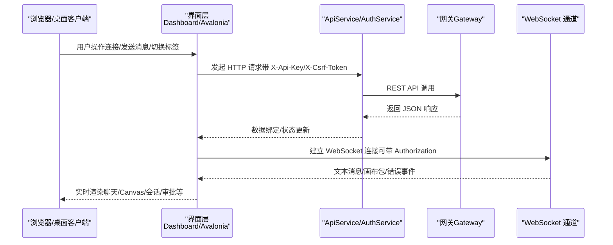
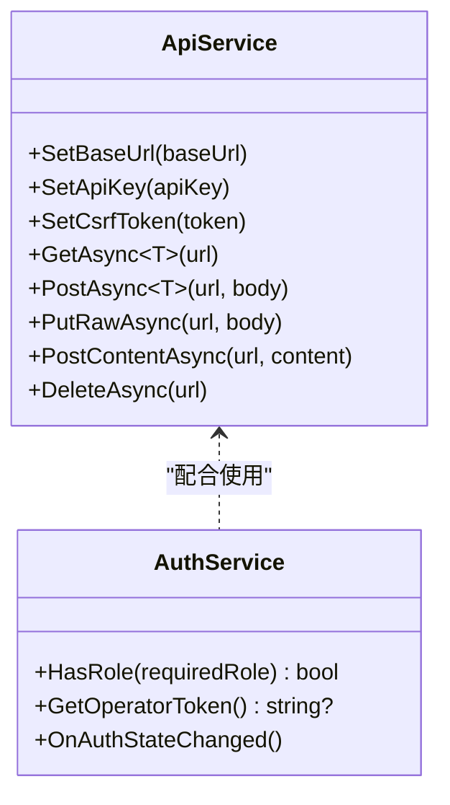
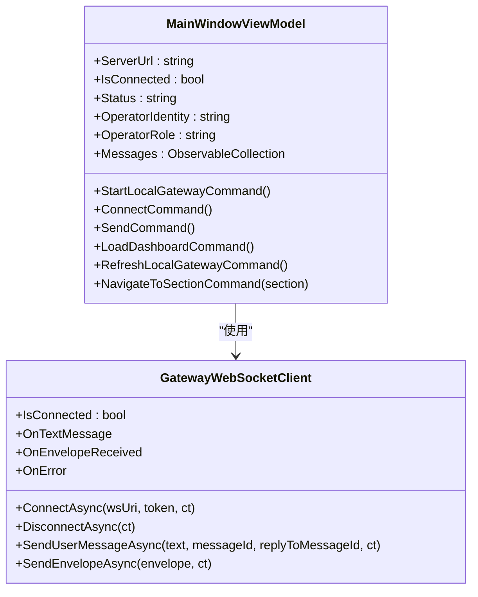
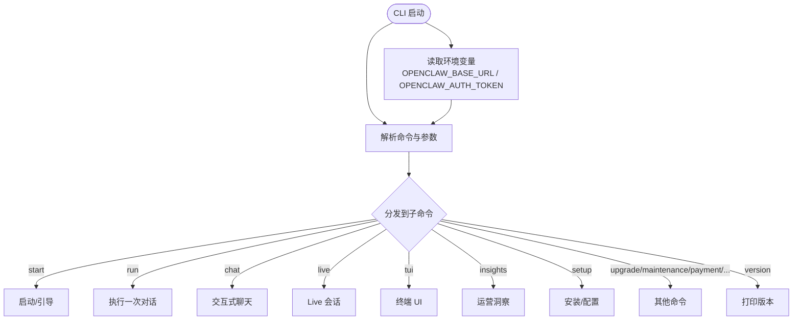
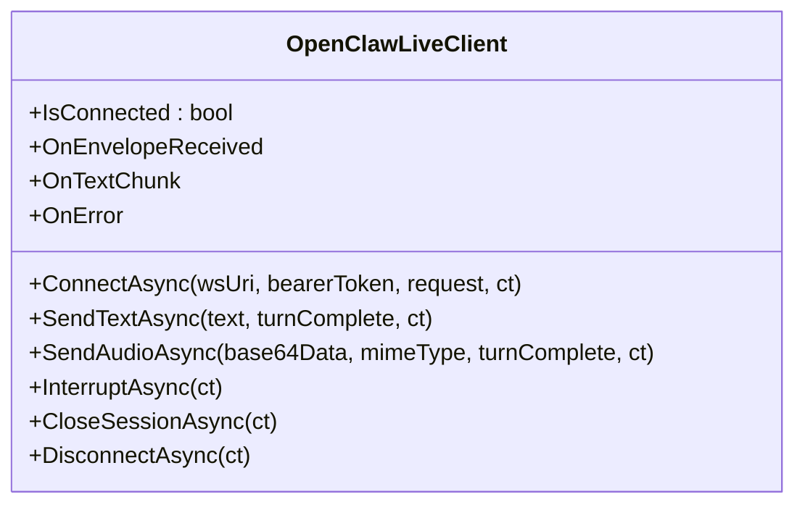
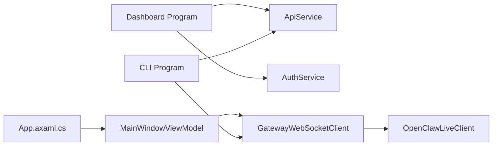

# 管理界面

<cite>
**本文引用的文件**
- [Program.cs](file://src/OpenClaw.Dashboard/Program.cs)
- [ApiService.cs](file://src/OpenClaw.Dashboard/Services/ApiService.cs)
- [AuthService.cs](file://src/OpenClaw.Dashboard/Services/AuthService.cs)
- [launchSettings.json](file://src/OpenClaw.Dashboard/Properties/launchSettings.json)
- [App.axaml.cs](file://src/OpenClaw.Companion/App.axaml.cs)
- [MainWindowViewModel.cs](file://src/OpenClaw.Companion/ViewModels/MainWindowViewModel.cs)
- [GatewayWebSocketClient.cs](file://src/OpenClaw.Companion/Services/GatewayWebSocketClient.cs)
- [MainWindow.axaml](file://src/OpenClaw.Companion/Views/MainWindow.axaml)
- [Program.cs](file://src/OpenClaw.Cli/Program.cs)
- [OpenClawLiveClient.cs](file://src/OpenClaw.Client/OpenClawLiveClient.cs)
</cite>

## 目录
1. [简介](#简介)
2. [项目结构](#项目结构)
3. [核心组件](#核心组件)
4. [架构总览](#架构总览)
5. [详细组件分析](#详细组件分析)
6. [依赖关系分析](#依赖关系分析)
7. [性能考量](#性能考量)
8. [故障排查指南](#故障排查指南)
9. [结论](#结论)
10. [附录](#附录)

## 简介
本文件系统性梳理“管理界面”相关能力，覆盖三大形态：
- 运营商仪表板（Blazor WebAssembly）
- 桌面客户端（Avalonia）
- 命令行工具（CLI）
- 客户端库（Client）

内容包括：功能特性、使用方法、配置选项、界面设计与交互流程、数据展示、操作权限、界面定制、API 使用示例、集成指南与用户体验优化建议。

## 项目结构
- 运营商仪表板（Blazor WASM）
  - 入口与 DI：Program.cs 注册 MudBlazor、本地化拦截器、服务（设置、本地化、API、认证、事件流等），并以 BaseAddress 构造 HttpClient。
  - 认证与权限：AuthService 提供角色等级比较、Operator Token 获取、CSRF 注入。
  - API 封装：ApiService 统一处理请求头（X-Api-Key、X-Csrf-Token）、URL 规范化、JSON 序列化选项。
  - 启动配置：launchSettings.json 指定开发环境与启动浏览器行为。
- 桌面客户端（Avalonia）
  - 应用入口：App.axaml.cs 初始化 Avalonia、禁用重复数据验证插件、构建视图模型与窗口、启动审批轮询与本地网关初始化。
  - 视图模型：MainWindowViewModel 负责状态、连接、消息、Canvas、会话、审批、工作流、自动化、运行时事件、插件通道、内存与资料、模型与提供方、管理员面板、WhatsApp、支付实验室等。
  - 通信封装：GatewayWebSocketClient 对接 OpenClaw.Client.OpenClawWebSocketClient，桥接文本消息、画布包与错误事件。
  - 视图：MainWindow.axaml 定义标签页布局与控件绑定，涵盖 Home、Setup、Chat、Canvas、Sessions、Approvals、Workflows、Automations、Runtime Events、Plugins & Channels、Memory & Profiles、Models & Providers、Admin、WhatsApp、Payment Lab。
- 命令行工具（CLI）
  - 入口：Program.cs 解析命令与参数，分发到各子命令（start、run、chat、live、tui、insights、setup、upgrade、maintenance、payment、external、memory、test、harness、regression、init、migrate、pulse、heartbeat、models、eval、accounts、backends、admin、compatibility、plugins、skill、skills、clawhub、version 等），支持环境变量 OPENCLAW_BASE_URL、OPENCLAW_AUTH_TOKEN。
  - 支持 TUI（终端 UI）运行，若不可用则提示改用非 AOT 构建或管理员 Web UI。
- 客户端库（Client）
  - OpenClawLiveClient 封装 Live WebSocket 会话，支持文本/音频输入、中断、关闭会话、断开连接，内置发送锁与最大消息大小限制，接收循环解析服务端包并触发事件。

图表来源
- [Program.cs:1-32](file://src/OpenClaw.Dashboard/Program.cs#L1-L32)
- [ApiService.cs:1-146](file://src/OpenClaw.Dashboard/Services/ApiService.cs#L1-L146)
- [AuthService.cs:99-153](file://src/OpenClaw.Dashboard/Services/AuthService.cs#L99-L153)
- [App.axaml.cs:1-78](file://src/OpenClaw.Companion/App.axaml.cs#L1-L78)
- [MainWindowViewModel.cs:1-200](file://src/OpenClaw.Companion/ViewModels/MainWindowViewModel.cs#L1-L200)
- [GatewayWebSocketClient.cs:1-49](file://src/OpenClaw.Companion/Services/GatewayWebSocketClient.cs#L1-L49)
- [MainWindow.axaml:1-501](file://src/OpenClaw.Companion/Views/MainWindow.axaml#L1-L501)
- [Program.cs:1-800](file://src/OpenClaw.Cli/Program.cs#L1-L800)
- [OpenClawLiveClient.cs:1-303](file://src/OpenClaw.Client/OpenClawLiveClient.cs#L1-L303)

章节来源
- [Program.cs:1-32](file://src/OpenClaw.Dashboard/Program.cs#L1-L32)
- [launchSettings.json:1-12](file://src/OpenClaw.Dashboard/Properties/launchSettings.json#L1-L12)
- [App.axaml.cs:1-78](file://src/OpenClaw.Companion/App.axaml.cs#L1-L78)
- [MainWindowViewModel.cs:1-200](file://src/OpenClaw.Companion/ViewModels/MainWindowViewModel.cs#L1-L200)
- [GatewayWebSocketClient.cs:1-49](file://src/OpenClaw.Companion/Services/GatewayWebSocketClient.cs#L1-L49)
- [MainWindow.axaml:1-501](file://src/OpenClaw.Companion/Views/MainWindow.axaml#L1-L501)
- [Program.cs:1-800](file://src/OpenClaw.Cli/Program.cs#L1-L800)
- [OpenClawLiveClient.cs:1-303](file://src/OpenClaw.Client/OpenClawLiveClient.cs#L1-L303)

## 核心组件
- 运营商仪表板（Blazor WASM）
  - 服务注册：MudBlazor、本地化拦截器、设置、本地化、API、认证、事件流服务。
  - HttpClient 基地址：基于 builder.HostEnvironment.BaseAddress。
  - API 封装：统一设置 X-Api-Key、X-Csrf-Token；URL 规范化；JSON 选项。
  - 认证服务：角色等级比较、Operator Token 获取、CSRF 注入。
- 桌面客户端（Avalonia）
  - 应用生命周期：初始化 Avalonia、禁用重复数据注解验证、构建视图模型与窗口、启动审批轮询与本地网关初始化、退出时释放资源。
  - 视图模型：集中管理状态（连接、身份、角色、部署、调试模式、通知开关等），承载聊天消息、Canvas 表面与组件、会话列表与时间线、待审批与历史、工作流与自动化、运行时事件、插件与通道、内存与资料、模型与提供方、管理员面板、WhatsApp 配置、支付实验室。
  - 通信封装：桥接 OpenClaw.Client.OpenClawWebSocketClient 的文本消息、画布包与错误事件。
- 命令行工具（CLI）
  - 命令分发：start、run、chat、live、tui、insights、setup、upgrade、maintenance、payment、external、memory、test、harness、regression、init、migrate、pulse、heartbeat、models、eval、accounts、backends、admin、compatibility、plugins、skill、skills、clawhub、version。
  - 环境变量：OPENCLAW_BASE_URL、OPENCLAW_AUTH_TOKEN。
  - TUI：在可用构建中运行终端 UI，否则提示改用非 AOT 或管理员 Web UI。
- 客户端库（Client）
  - Live WebSocket：支持文本/音频输入、中断、关闭会话、断开连接；发送锁、最大消息大小限制；接收循环解析服务端包并触发事件。

章节来源
- [Program.cs:1-32](file://src/OpenClaw.Dashboard/Program.cs#L1-L32)
- [ApiService.cs:1-146](file://src/OpenClaw.Dashboard/Services/ApiService.cs#L1-L146)
- [AuthService.cs:99-153](file://src/OpenClaw.Dashboard/Services/AuthService.cs#L99-L153)
- [App.axaml.cs:1-78](file://src/OpenClaw.Companion/App.axaml.cs#L1-L78)
- [MainWindowViewModel.cs:1-200](file://src/OpenClaw.Companion/ViewModels/MainWindowViewModel.cs#L1-L200)
- [GatewayWebSocketClient.cs:1-49](file://src/OpenClaw.Companion/Services/GatewayWebSocketClient.cs#L1-L49)
- [Program.cs:1-800](file://src/OpenClaw.Cli/Program.cs#L1-L800)
- [OpenClawLiveClient.cs:1-303](file://src/OpenClaw.Client/OpenClawLiveClient.cs#L1-L303)

## 架构总览
下图展示从界面到后端的关键交互路径与职责边界：

图表来源
- [ApiService.cs:1-146](file://src/OpenClaw.Dashboard/Services/ApiService.cs#L1-L146)
- [AuthService.cs:99-153](file://src/OpenClaw.Dashboard/Services/AuthService.cs#L99-L153)
- [GatewayWebSocketClient.cs:1-49](file://src/OpenClaw.Companion/Services/GatewayWebSocketClient.cs#L1-L49)
- [MainWindowViewModel.cs:1-200](file://src/OpenClaw.Companion/ViewModels/MainWindowViewModel.cs#L1-L200)

## 详细组件分析

### 组件A：运营商仪表板（Blazor WASM）
- 入口与服务注册
  - Program.cs 注册 MudBlazor、本地化拦截器、设置、本地化、API、认证、事件流服务，并以 BaseAddress 构造 HttpClient。
- API 封装
  - ApiService 统一处理请求头（X-Api-Key、X-Csrf-Token）、URL 规范化（相对路径自动加前缀斜杠）、JSON 选项（大小写不敏感、驼峰命名）。
- 认证与权限
  - AuthService 提供角色等级比较（admin > operator > viewer > 其他），支持获取 Operator Token 并注入 CSRF。

图表来源
- [ApiService.cs:1-146](file://src/OpenClaw.Dashboard/Services/ApiService.cs#L1-L146)
- [AuthService.cs:99-153](file://src/OpenClaw.Dashboard/Services/AuthService.cs#L99-L153)

章节来源
- [Program.cs:1-32](file://src/OpenClaw.Dashboard/Program.cs#L1-L32)
- [ApiService.cs:1-146](file://src/OpenClaw.Dashboard/Services/ApiService.cs#L1-L146)
- [AuthService.cs:99-153](file://src/OpenClaw.Dashboard/Services/AuthService.cs#L99-L153)
- [launchSettings.json:1-12](file://src/OpenClaw.Dashboard/Properties/launchSettings.json#L1-L12)

### 组件B：桌面客户端（Avalonia）
- 应用入口
  - App.axaml.cs 初始化 Avalonia、禁用重复数据注解验证、构建视图模型与窗口、启动审批轮询与本地网关初始化、退出时释放资源。
- 视图模型
  - MainWindowViewModel 负责状态（连接、身份、角色、部署、调试模式、通知开关等），承载聊天消息、Canvas 表面与组件、会话列表与时间线、待审批与历史、工作流与自动化、运行时事件、插件与通道、内存与资料、模型与提供方、管理员面板、WhatsApp 配置、支付实验室。
- 通信封装
  - GatewayWebSocketClient 对接 OpenClaw.Client.OpenClawWebSocketClient，桥接文本消息、画布包与错误事件。

图表来源
- [MainWindowViewModel.cs:1-200](file://src/OpenClaw.Companion/ViewModels/MainWindowViewModel.cs#L1-L200)
- [GatewayWebSocketClient.cs:1-49](file://src/OpenClaw.Companion/Services/GatewayWebSocketClient.cs#L1-L49)

章节来源
- [App.axaml.cs:1-78](file://src/OpenClaw.Companion/App.axaml.cs#L1-L78)
- [MainWindowViewModel.cs:1-200](file://src/OpenClaw.Companion/ViewModels/MainWindowViewModel.cs#L1-L200)
- [GatewayWebSocketClient.cs:1-49](file://src/OpenClaw.Companion/Services/GatewayWebSocketClient.cs#L1-L49)
- [MainWindow.axaml:1-501](file://src/OpenClaw.Companion/Views/MainWindow.axaml#L1-L501)

### 组件C：命令行工具（CLI）
- 命令分发
  - Program.cs 解析命令与参数，分发到各子命令（start、run、chat、live、tui、insights、setup、upgrade、maintenance、payment、external、memory、test、harness、regression、init、migrate、pulse、heartbeat、models、eval、accounts、backends、admin、compatibility、plugins、skill、skills、clawhub、version）。
- 环境变量
  - OPENCLAW_BASE_URL、OPENCLAW_AUTH_TOKEN。
- TUI
  - 在可用构建中运行终端 UI，否则提示改用非 AOT 或管理员 Web UI。

图表来源
- [Program.cs:1-800](file://src/OpenClaw.Cli/Program.cs#L1-L800)

章节来源
- [Program.cs:1-800](file://src/OpenClaw.Cli/Program.cs#L1-L800)

### 组件D：客户端库（Client）
- Live WebSocket
  - OpenClawLiveClient 封装 Live WebSocket 会话，支持文本/音频输入、中断、关闭会话、断开连接；发送锁、最大消息大小限制；接收循环解析服务端包并触发事件。

图表来源
- [OpenClawLiveClient.cs:1-303](file://src/OpenClaw.Client/OpenClawLiveClient.cs#L1-L303)

章节来源
- [OpenClawLiveClient.cs:1-303](file://src/OpenClaw.Client/OpenClawLiveClient.cs#L1-L303)

## 依赖关系分析
- 运营商仪表板依赖 ApiService/AuthService 进行 REST 通信与认证，依赖 HttpClient BaseAddress 与 MudBlazor UI 组件。
- 桌面客户端通过 GatewayWebSocketClient 与客户端库对接，实现实时消息与 Canvas 渲染。
- CLI 既可调用 REST API（经由 ApiService），也可直接使用客户端库进行 Live 会话。
- 客户端库为桌面客户端与 CLI 提供统一的 WebSocket 通信能力。

图表来源
- [Program.cs:1-32](file://src/OpenClaw.Dashboard/Program.cs#L1-L32)
- [ApiService.cs:1-146](file://src/OpenClaw.Dashboard/Services/ApiService.cs#L1-L146)
- [AuthService.cs:99-153](file://src/OpenClaw.Dashboard/Services/AuthService.cs#L99-L153)
- [App.axaml.cs:1-78](file://src/OpenClaw.Companion/App.axaml.cs#L1-L78)
- [MainWindowViewModel.cs:1-200](file://src/OpenClaw.Companion/ViewModels/MainWindowViewModel.cs#L1-L200)
- [GatewayWebSocketClient.cs:1-49](file://src/OpenClaw.Companion/Services/GatewayWebSocketClient.cs#L1-L49)
- [Program.cs:1-800](file://src/OpenClaw.Cli/Program.cs#L1-L800)
- [OpenClawLiveClient.cs:1-303](file://src/OpenClaw.Client/OpenClawLiveClient.cs#L1-L303)

章节来源
- [Program.cs:1-32](file://src/OpenClaw.Dashboard/Program.cs#L1-L32)
- [ApiService.cs:1-146](file://src/OpenClaw.Dashboard/Services/ApiService.cs#L1-L146)
- [AuthService.cs:99-153](file://src/OpenClaw.Dashboard/Services/AuthService.cs#L99-L153)
- [App.axaml.cs:1-78](file://src/OpenClaw.Companion/App.axaml.cs#L1-L78)
- [MainWindowViewModel.cs:1-200](file://src/OpenClaw.Companion/ViewModels/MainWindowViewModel.cs#L1-L200)
- [GatewayWebSocketClient.cs:1-49](file://src/OpenClaw.Companion/Services/GatewayWebSocketClient.cs#L1-L49)
- [Program.cs:1-800](file://src/OpenClaw.Cli/Program.cs#L1-L800)
- [OpenClawLiveClient.cs:1-303](file://src/OpenClaw.Client/OpenClawLiveClient.cs#L1-L303)

## 性能考量
- WebSocket 消息大小限制：客户端库对入站/出站消息长度进行上限检查，避免超大包导致内存压力。
- 发送锁：确保并发发送安全，减少竞争条件。
- 接收循环缓冲池：使用 ArrayPool 共享缓冲区，降低 GC 压力。
- UI 刷新节流：视图模型通过集合变更通知与属性变更通知驱动 UI 更新，避免频繁重绘。
- HTTP 缓存策略：ApiService 默认 JSON 选项（大小写不敏感、驼峰命名），便于前后端兼容，减少序列化开销。

## 故障排查指南
- 连接问题
  - 检查 BaseAddress 与 WebSocket URL 是否正确（Dashboard 使用 BaseAddress，Avalonia 使用 ws:// 或 wss://）。
  - 确认 Authorization 头是否正确传递（Bearer Token）。
- 权限不足
  - 使用 AuthService.HasRole 进行角色判断；必要时通过 Operator Token 获取更高权限。
- TUI 不可用
  - CLI 中提示 TUI 不可用时，改用非 AOT 构建或管理员 Web UI。
- WebSocket 断开
  - 桌面客户端与 CLI 的客户端库均提供断开与重连逻辑，注意最大消息大小限制与发送锁状态。
- 环境变量
  - 确保 OPENCLAW_BASE_URL 与 OPENCLAW_AUTH_TOKEN 设置正确，CLI 与桌面客户端均可读取。

章节来源
- [Program.cs:1-32](file://src/OpenClaw.Dashboard/Program.cs#L1-L32)
- [AuthService.cs:99-153](file://src/OpenClaw.Dashboard/Services/AuthService.cs#L99-L153)
- [Program.cs:636-662](file://src/OpenClaw.Cli/Program.cs#L636-L662)
- [OpenClawLiveClient.cs:1-303](file://src/OpenClaw.Client/OpenClawLiveClient.cs#L1-L303)

## 结论
该管理界面系统以统一的网关为核心，通过 Blazor WASM 仪表板、Avalonia 桌面客户端与 CLI 提供多形态操作体验。客户端库为实时交互提供稳定 WebSocket 通道，ApiService/AuthService 保障 REST 通信与权限控制。整体架构清晰、职责分离明确，适合在不同场景下灵活选择界面形态。

## 附录
- 使用方法与配置选项
  - 运营商仪表板
    - 启动：通过 launchSettings.json 指定启动浏览器与应用 URL。
    - 认证：通过 AuthService 获取 Operator Token 并注入 CSRF。
    - API：通过 ApiService 设置 X-Api-Key 与 X-Csrf-Token。
  - 桌面客户端
    - 连接：在连接设置中填写 Gateway URL、Operator User、Operator Token、Remember、Plaintext、Debug。
    - 功能：Home、Setup、Chat、Canvas、Sessions、Approvals、Workflows、Automations、Runtime Events、Plugins & Channels、Memory & Profiles、Models & Providers、Admin、WhatsApp、Payment Lab。
  - 命令行工具
    - 常用命令：start、run、chat、live、tui、insights、setup、upgrade、maintenance、payment、external、memory、test、harness、regression、init、migrate、pulse、heartbeat、models、eval、accounts、backends、admin、compatibility、plugins、skill、skills、clawhub、version。
    - 环境变量：OPENCLAW_BASE_URL、OPENCLAW_AUTH_TOKEN。
  - 客户端库
    - Live 会话：ConnectAsync、SendTextAsync、SendAudioAsync、InterruptAsync、CloseSessionAsync、DisconnectAsync。
- 界面定制与用户体验优化
  - MudBlazor 主题与本地化：Dashboard 使用 MudBlazor 与本地化拦截器。
  - Avalonia 样式与通知：支持桌面通知、最小化/激活状态感知、标签页布局。
  - 无障碍与响应式：根据平台特性调整控件尺寸与交互方式。
- API 使用示例（路径参考）
  - 获取 Operator Token：[AuthService.cs:120-139](file://src/OpenClaw.Dashboard/Services/AuthService.cs#L120-L139)
  - 设置 API Key 与 CSRF：[ApiService.cs:38-40](file://src/OpenClaw.Dashboard/Services/ApiService.cs#L38-L40)
  - 发送 Live 文本：[OpenClawLiveClient.cs:89-95](file://src/OpenClaw.Client/OpenClawLiveClient.cs#L89-L95)
  - 连接 Live 会话：[OpenClawLiveClient.cs:60-87](file://src/OpenClaw.Client/OpenClawLiveClient.cs#L60-L87)
- 集成指南
  - 作为桌面客户端：通过 GatewayWebSocketClient 与客户端库集成，实现聊天、Canvas、会话与审批等功能。
  - 作为 CLI：通过 ApiService 与客户端库集成，实现 REST 与 WebSocket 场景。
  - 作为仪表板：通过 ApiService 与 AuthService 集成，实现权限控制与数据展示。