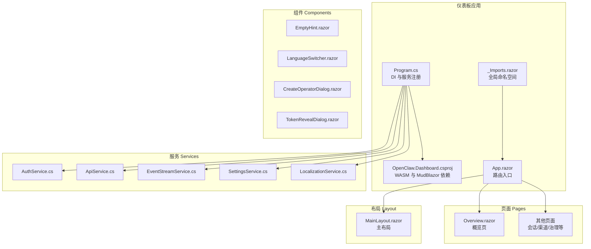
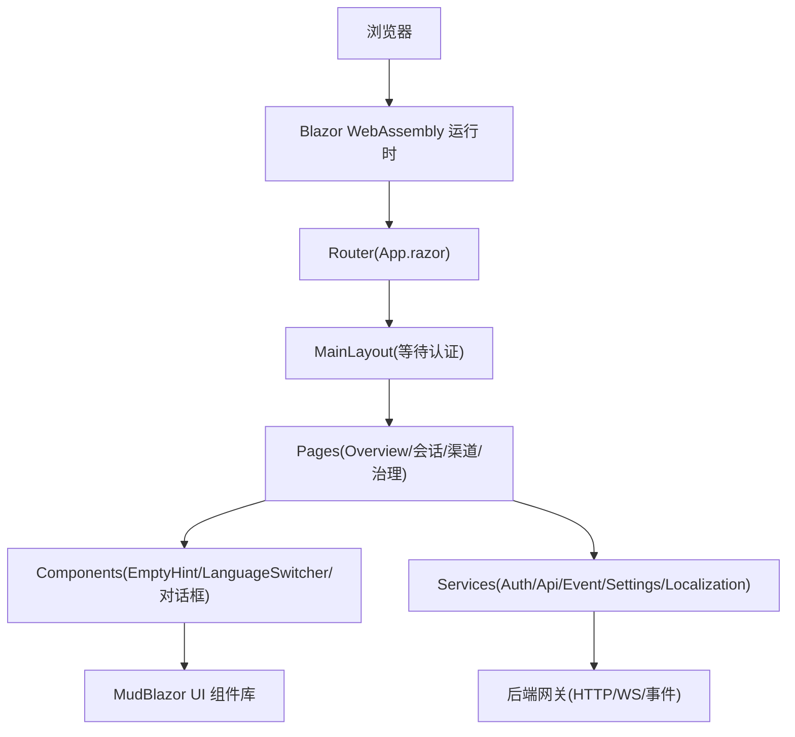
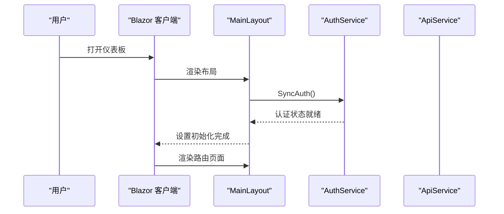
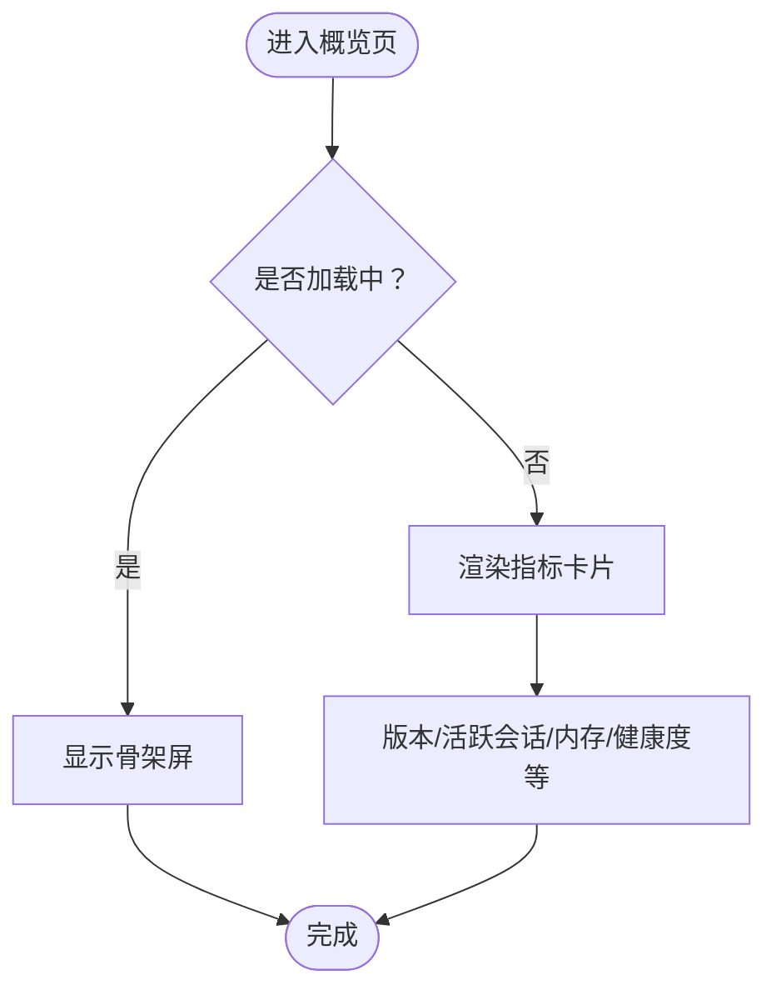
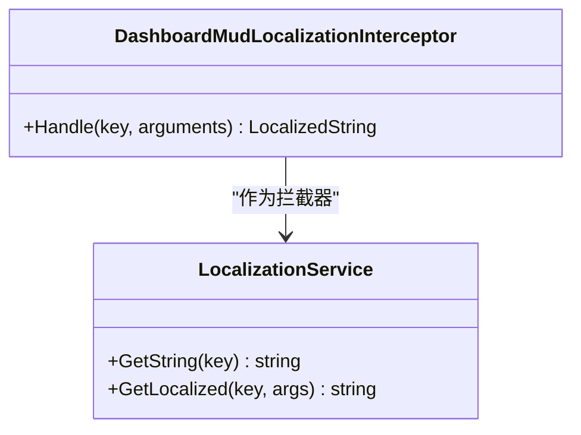
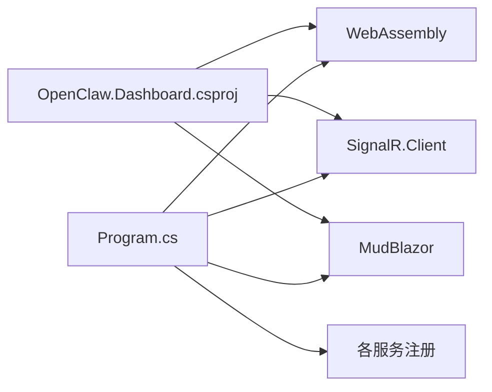

# 运营商仪表板

<cite>
**本文引用的文件**
- [App.razor](file://src/OpenClaw.Dashboard/App.razor)
- [Program.cs](file://src/OpenClaw.Dashboard/Program.cs)
- [_Imports.razor](file://src/OpenClaw.Dashboard/_Imports.razor)
- [OpenClaw.Dashboard.csproj](file://src/OpenClaw.Dashboard/OpenClaw.Dashboard.csproj)
- [Overview.razor](file://src/OpenClaw.Dashboard/Pages/Overview.razor)
- [DashboardStaticAssetTests.cs](file://src/OpenClaw.Tests/DashboardStaticAssetTests.cs)
- [AuthService.cs](file://src/OpenClaw.Dashboard/Services/AuthService.cs)
- [ApiService.cs](file://src/OpenClaw.Dashboard/Services/ApiService.cs)
- [EventStreamService.cs](file://src/OpenClaw.Dashboard/Services/EventStreamService.cs)
- [SettingsService.cs](file://src/OpenClaw.Dashboard/Services/SettingsService.cs)
- [LocalizationService.cs](file://src/OpenClaw.Dashboard/Services/LocalizationService.cs)
- [MainLayout.razor](file://src/OpenClaw.Dashboard/Layout/MainLayout.razor)
- [EmptyHint.razor](file://src/OpenClaw.Dashboard/Components/EmptyHint.razor)
- [LanguageSwitcher.razor](file://src/OpenClaw.Dashboard/Components/LanguageSwitcher.razor)
- [CreateOperatorDialog.razor](file://src/OpenClaw.Dashboard/Components/CreateOperatorDialog.razor)
- [TokenRevealDialog.razor](file://src/OpenClaw.Dashboard/Components/TokenRevealDialog.razor)
- [README.md](file://README.md)
</cite>

## 目录
1. [简介](#简介)
2. [项目结构](#项目结构)
3. [核心组件](#核心组件)
4. [架构总览](#架构总览)
5. [详细组件分析](#详细组件分析)
6. [依赖关系分析](#依赖关系分析)
7. [性能考虑](#性能考虑)
8. [故障排除指南](#故障排除指南)
9. [结论](#结论)
10. [附录](#附录)

## 简介
本文件为基于 Blazor WebAssembly 的运营商仪表板（OpenClaw.Dashboard）的权威技术文档。该仪表板面向运营与管理员用户，提供概览、会话管理、渠道配置、治理设置等功能页面，采用 MudBlazor 组件库构建现代化 UI，并通过本地化拦截器、认证授权、事件流服务等机制保障可用性与可维护性。

根据项目自述，该仓库包含浏览器 UI、CLI、桌面配套应用以及 Blazor WASM 运营商仪表板等多种前端表面。本文档聚焦于 Blazor WASM 仪表板的页面布局、组件架构、状态管理与 API 集成，并给出开发指南、复用模式、性能优化与用户体验最佳实践。

章节来源
- [README.md:31-40](file://README.md#L31-L40)

## 项目结构
OpenClaw.Dashboard 是一个 Blazor WebAssembly 应用，核心入口由 App.razor 路由器与 Program.cs 启动程序构成；页面与组件位于 Pages 与 Components 目录，样式与资源位于 wwwroot；服务层通过 Program.cs 注册到 DI 容器。

图表来源
- [App.razor:1-13](file://src/OpenClaw.Dashboard/App.razor#L1-L13)
- [Program.cs:1-32](file://src/OpenClaw.Dashboard/Program.cs#L1-L32)
- [OpenClaw.Dashboard.csproj:1-15](file://src/OpenClaw.Dashboard/OpenClaw.Dashboard.csproj#L1-L15)
- [MainLayout.razor](file://src/OpenClaw.Dashboard/Layout/MainLayout.razor)
- [Overview.razor:36-69](file://src/OpenClaw.Dashboard/Pages/Overview.razor#L36-L69)
- [EmptyHint.razor](file://src/OpenClaw.Dashboard/Components/EmptyHint.razor)
- [LanguageSwitcher.razor](file://src/OpenClaw.Dashboard/Components/LanguageSwitcher.razor)
- [CreateOperatorDialog.razor](file://src/OpenClaw.Dashboard/Components/CreateOperatorDialog.razor)
- [TokenRevealDialog.razor](file://src/OpenClaw.Dashboard/Components/TokenRevealDialog.razor)

章节来源
- [App.razor:1-13](file://src/OpenClaw.Dashboard/App.razor#L1-L13)
- [Program.cs:1-32](file://src/OpenClaw.Dashboard/Program.cs#L1-L32)
- [_Imports.razor:1-15](file://src/OpenClaw.Dashboard/_Imports.razor#L1-L15)
- [OpenClaw.Dashboard.csproj:1-15](file://src/OpenClaw.Dashboard/OpenClaw.Dashboard.csproj#L1-L15)

## 核心组件
- 路由与入口
  - App.razor 使用 Router 组件进行页面路由，指定默认布局 MainLayout，并在 NotFound 情况下输出提示信息。
  - Program.cs 注册 MudBlazor 服务、本地化拦截器、认证、API、事件流、设置等服务，并注入基础 HttpClient。
- 布局与导航
  - MainLayout 提供统一的头部、侧边栏与内容区域，确保页面在认证完成前不渲染具体路由内容。
- 页面与组件
  - Overview.razor 展示版本、活跃会话等关键指标，使用 MudBlazor 的网格、卡片与骨架屏提升加载体验。
  - Components 提供 EmptyHint、LanguageSwitcher、CreateOperatorDialog、TokenRevealDialog 等通用 UI 组件。
- 服务层
  - AuthService：负责认证状态同步与令牌管理。
  - ApiService：封装 HTTP 请求，对接后端 API。
  - EventStreamService：处理实时事件流（SignalR 或 SSE）。
  - SettingsService：读取与写入仪表板设置。
  - LocalizationService：提供本地化能力与键值解析。

章节来源
- [App.razor:1-13](file://src/OpenClaw.Dashboard/App.razor#L1-L13)
- [Program.cs:13-21](file://src/OpenClaw.Dashboard/Program.cs#L13-L21)
- [MainLayout.razor](file://src/OpenClaw.Dashboard/Layout/MainLayout.razor)
- [Overview.razor:36-69](file://src/OpenClaw.Dashboard/Pages/Overview.razor#L36-L69)
- [EmptyHint.razor](file://src/OpenClaw.Dashboard/Components/EmptyHint.razor)
- [LanguageSwitcher.razor](file://src/OpenClaw.Dashboard/Components/LanguageSwitcher.razor)
- [CreateOperatorDialog.razor](file://src/OpenClaw.Dashboard/Components/CreateOperatorDialog.razor)
- [TokenRevealDialog.razor](file://src/OpenClaw.Dashboard/Components/TokenRevealDialog.razor)
- [AuthService.cs](file://src/OpenClaw.Dashboard/Services/AuthService.cs)
- [ApiService.cs](file://src/OpenClaw.Dashboard/Services/ApiService.cs)
- [EventStreamService.cs](file://src/OpenClaw.Dashboard/Services/EventStreamService.cs)
- [SettingsService.cs](file://src/OpenClaw.Dashboard/Services/SettingsService.cs)
- [LocalizationService.cs](file://src/OpenClaw.Dashboard/Services/LocalizationService.cs)

## 架构总览
仪表板采用客户端单页应用（SPA）架构，Blazor WebAssembly 在浏览器中运行，通过 MudBlazor 提供 Material Design 风格组件，服务层通过 HttpClient 与后端网关通信。认证流程在布局层阻塞路由渲染，确保用户登录后再显示页面内容。

图表来源
- [App.razor:1-13](file://src/OpenClaw.Dashboard/App.razor#L1-L13)
- [Program.cs:13-21](file://src/OpenClaw.Dashboard/Program.cs#L13-L21)
- [MainLayout.razor](file://src/OpenClaw.Dashboard/Layout/MainLayout.razor)
- [Overview.razor:36-69](file://src/OpenClaw.Dashboard/Pages/Overview.razor#L36-L69)
- [AuthService.cs](file://src/OpenClaw.Dashboard/Services/AuthService.cs)
- [ApiService.cs](file://src/OpenClaw.Dashboard/Services/ApiService.cs)
- [EventStreamService.cs](file://src/OpenClaw.Dashboard/Services/EventStreamService.cs)
- [SettingsService.cs](file://src/OpenClaw.Dashboard/Services/SettingsService.cs)
- [LocalizationService.cs](file://src/OpenClaw.Dashboard/Services/LocalizationService.cs)

## 详细组件分析

### 认证与授权流程
认证在 MainLayout 中进行拦截，确保只有已认证用户才能看到路由内容。测试用例验证了布局在渲染前会同步认证状态并等待初始化完成。

图表来源
- [MainLayout.razor](file://src/OpenClaw.Dashboard/Layout/MainLayout.razor)
- [DashboardStaticAssetTests.cs:139-147](file://src/OpenClaw.Tests/DashboardStaticAssetTests.cs#L139-L147)
- [AuthService.cs](file://src/OpenClaw.Dashboard/Services/AuthService.cs)
- [ApiService.cs](file://src/OpenClaw.Dashboard/Services/ApiService.cs)

章节来源
- [DashboardStaticAssetTests.cs:139-147](file://src/OpenClaw.Tests/DashboardStaticAssetTests.cs#L139-L147)

### 概览页（Overview）
Overview.razor 展示关键运行指标，如版本号、活跃会话数等，并在加载阶段使用骨架屏提升感知性能。页面使用 MudBlazor 的网格与卡片组件组织内容。

图表来源
- [Overview.razor:36-69](file://src/OpenClaw.Dashboard/Pages/Overview.razor#L36-L69)

章节来源
- [Overview.razor:36-69](file://src/OpenClaw.Dashboard/Pages/Overview.razor#L36-L69)

### 国际化与本地化
Program.cs 注入了本地化拦截器，用于兜底未匹配的本地化键值。同时，组件中广泛使用 L["键名"] 的形式进行文本本地化，测试用例验证了本地化键的完整性与覆盖范围。

图表来源
- [Program.cs:25-31](file://src/OpenClaw.Dashboard/Program.cs#L25-L31)
- [LocalizationService.cs](file://src/OpenClaw.Dashboard/Services/LocalizationService.cs)
- [DashboardStaticAssetTests.cs:312-321](file://src/OpenClaw.Tests/DashboardStaticAssetTests.cs#L312-L321)

章节来源
- [Program.cs:14-14](file://src/OpenClaw.Dashboard/Program.cs#L14-L14)
- [Program.cs:25-31](file://src/OpenClaw.Dashboard/Program.cs#L25-L31)
- [DashboardStaticAssetTests.cs:312-321](file://src/OpenClaw.Tests/DashboardStaticAssetTests.cs#L312-L321)

### 语言切换组件（LanguageSwitcher）
LanguageSwitcher.razor 提供语言选择器，结合 LocalizationService 实现动态切换语言，保证界面文本与本地化资源一致。

章节来源
- [LanguageSwitcher.razor](file://src/OpenClaw.Dashboard/Components/LanguageSwitcher.razor)
- [LocalizationService.cs](file://src/OpenClaw.Dashboard/Services/LocalizationService.cs)

### 对话框组件
- EmptyHint：用于空状态提示，配合列表/表格等组件提升可读性。
- CreateOperatorDialog：用于创建操作员账户，包含表单校验与提交流程。
- TokenRevealDialog：用于一次性展示敏感令牌，避免重复显示与泄露风险。

章节来源
- [EmptyHint.razor](file://src/OpenClaw.Dashboard/Components/EmptyHint.razor)
- [CreateOperatorDialog.razor](file://src/OpenClaw.Dashboard/Components/CreateOperatorDialog.razor)
- [TokenRevealDialog.razor](file://src/OpenClaw.Dashboard/Components/TokenRevealDialog.razor)

### API 集成与事件流
- ApiService：封装 HTTP 客户端调用，统一错误处理与响应格式。
- EventStreamService：负责订阅后端事件流（如心跳、会话状态变更），在页面中以列表或卡片形式展示。
- SettingsService：读取/写入仪表板配置项，如主题、语言、刷新周期等。

章节来源
- [ApiService.cs](file://src/OpenClaw.Dashboard/Services/ApiService.cs)
- [EventStreamService.cs](file://src/OpenClaw.Dashboard/Services/EventStreamService.cs)
- [SettingsService.cs](file://src/OpenClaw.Dashboard/Services/SettingsService.cs)

## 依赖关系分析
- 外部依赖
  - Microsoft.AspNetCore.Components.WebAssembly：Blazor WASM 运行时。
  - Microsoft.AspNetCore.SignalR.Client：用于实时事件流。
  - MudBlazor：Material Design 组件库。
- 内部依赖
  - 服务层通过 Program.cs 注册到 DI，页面与组件通过 @inject 获取所需服务。
  - 布局层依赖认证服务，确保渲染顺序与安全。

图表来源
- [OpenClaw.Dashboard.csproj:8-13](file://src/OpenClaw.Dashboard/OpenClaw.Dashboard.csproj#L8-L13)
- [Program.cs:13-21](file://src/OpenClaw.Dashboard/Program.cs#L13-L21)

章节来源
- [OpenClaw.Dashboard.csproj:1-15](file://src/OpenClaw.Dashboard/OpenClaw.Dashboard.csproj#L1-L15)
- [Program.cs:1-32](file://src/OpenClaw.Dashboard/Program.cs#L1-L32)

## 性能考虑
- 按需加载与骨架屏：Overview.razor 在加载阶段使用骨架屏减少感知延迟。
- 组件复用：通过通用组件（EmptyHint、LanguageSwitcher、对话框）降低重复开发成本。
- 本地化键集中管理：测试用例验证本地化键完整性，避免运行期缺失导致的回退显示。
- 事件流节流：EventStreamService 应合理控制事件频率与批量处理，避免 UI 卡顿。

章节来源
- [Overview.razor:36-69](file://src/OpenClaw.Dashboard/Pages/Overview.razor#L36-L69)
- [DashboardStaticAssetTests.cs:312-321](file://src/OpenClaw.Tests/DashboardStaticAssetTests.cs#L312-L321)

## 故障排除指南
- 认证未完成导致页面空白
  - 检查 MainLayout 是否正确调用认证同步逻辑，确认认证服务初始化完成再渲染路由。
  - 参考测试用例对布局初始化与认证同步的断言。
- 本地化键缺失或回退显示
  - 使用测试用例中的键扫描逻辑，确保所有 L["键名"] 在本地化资源中存在。
- 事件流不更新
  - 检查 EventStreamService 的连接状态与订阅逻辑，确认后端事件推送正常。
- API 请求失败
  - 检查 ApiService 的错误处理与重试策略，确认 BaseAddress 与 Token 设置正确。

章节来源
- [DashboardStaticAssetTests.cs:139-147](file://src/OpenClaw.Tests/DashboardStaticAssetTests.cs#L139-L147)
- [DashboardStaticAssetTests.cs:312-321](file://src/OpenClaw.Tests/DashboardStaticAssetTests.cs#L312-L321)
- [AuthService.cs](file://src/OpenClaw.Dashboard/Services/AuthService.cs)
- [EventStreamService.cs](file://src/OpenClaw.Dashboard/Services/EventStreamService.cs)
- [ApiService.cs](file://src/OpenClaw.Dashboard/Services/ApiService.cs)

## 结论
OpenClaw.Dashboard 以 Blazor WebAssembly 为基础，结合 MudBlazor 组件库与完善的本地化、认证与事件流机制，构建出现代化、可扩展的运营商仪表板。通过统一的服务层与可复用组件，开发者可以快速迭代功能页面并保持一致的用户体验。建议在后续开发中持续完善本地化覆盖、优化事件流性能与增强错误恢复能力。

## 附录

### 页面开发指南
- 页面命名与路由
  - 将页面放置于 Pages 目录，遵循约定式路由规则，使用 MainLayout 作为默认布局。
- 组件复用
  - 将通用 UI 抽象为 Components，如 EmptyHint、LanguageSwitcher、对话框等，提高代码复用率。
- 状态管理
  - 使用 SettingsService 管理仪表板配置，使用 EventStreamService 接收实时事件，使用 ApiService 统一请求。
- 本地化
  - 使用 L["键名"] 的形式进行本地化，确保测试用例覆盖所有键值。

章节来源
- [MainLayout.razor](file://src/OpenClaw.Dashboard/Layout/MainLayout.razor)
- [EmptyHint.razor](file://src/OpenClaw.Dashboard/Components/EmptyHint.razor)
- [LanguageSwitcher.razor](file://src/OpenClaw.Dashboard/Components/LanguageSwitcher.razor)
- [SettingsService.cs](file://src/OpenClaw.Dashboard/Services/SettingsService.cs)
- [EventStreamService.cs](file://src/OpenClaw.Dashboard/Services/EventStreamService.cs)
- [ApiService.cs](file://src/OpenClaw.Dashboard/Services/ApiService.cs)