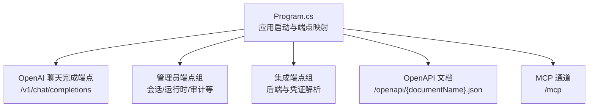
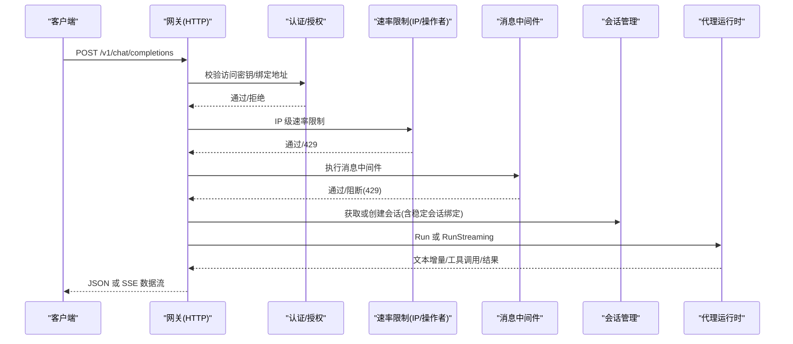
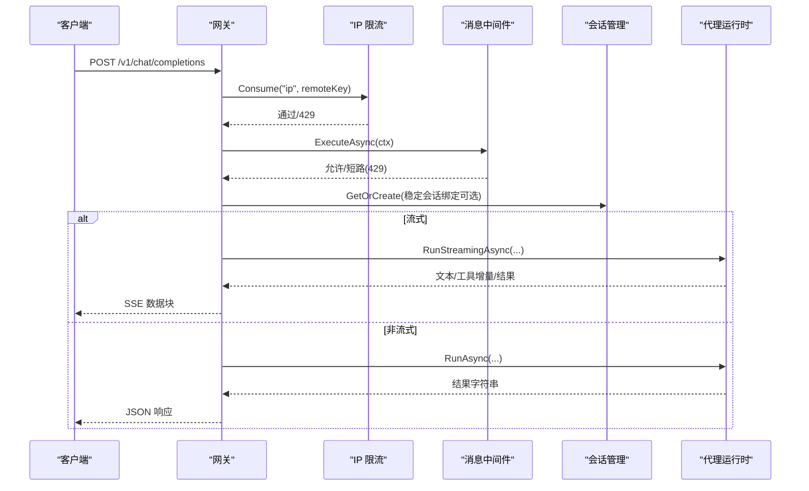
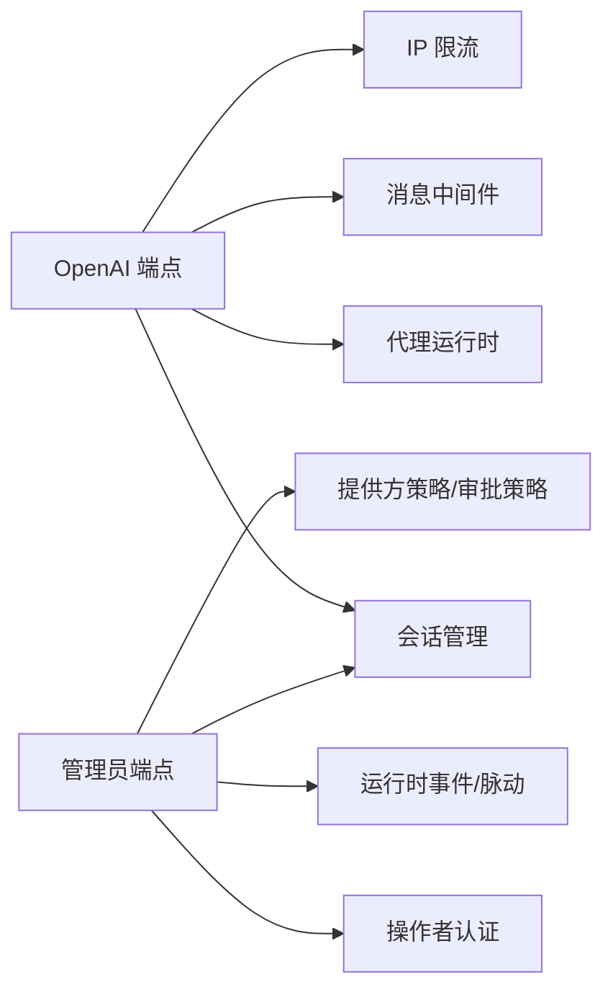

# HTTP API 接口

<cite>
**本文引用的文件**
- [Program.cs](file://src/OpenClaw.Gateway/Program.cs)
- [OpenAiEndpoints.ChatCompletions.cs](file://src/OpenClaw.Gateway/Endpoints/OpenAiEndpoints.ChatCompletions.cs)
- [AdminEndpoints.Auth.cs](file://src/OpenClaw.Gateway/Endpoints/AdminEndpoints.Auth.cs)
- [AdminBackendEndpoints.cs](file://src/OpenClaw.Gateway/Endpoints/AdminBackendEndpoints.cs)
- [AdminEndpoints.Sessions.cs](file://src/OpenClaw.Gateway/Endpoints/AdminEndpoints.Sessions.cs)
- [AdminEndpoints.Runtime.cs](file://src/OpenClaw.Gateway/Endpoints/AdminEndpoints.Runtime.cs)
</cite>

## 目录
1. [简介](#简介)
2. [项目结构](#项目结构)
3. [核心组件](#核心组件)
4. [架构总览](#架构总览)
5. [详细组件分析](#详细组件分析)
6. [依赖关系分析](#依赖关系分析)
7. [性能考量](#性能考量)
8. [故障排查指南](#故障排查指南)
9. [结论](#结论)
10. [附录](#附录)

## 简介
本文件系统化梳理了网关服务对外暴露的 HTTP API，覆盖以下类别：
- OpenAI 兼容接口：聊天完成与流式响应
- 管理员 API：会话管理、运行时治理、审计与策略
- 集成 API：后端连接与凭证解析
- 诊断 API：运行状态、事件与脉动

文档逐项说明端点的请求方法、URL 模式、请求体格式、响应结构、状态码含义，并解释认证机制、权限控制、速率限制与错误处理策略，同时提供使用示例与最佳实践建议。

## 项目结构
网关通过程序入口注册中间件、管道与端点映射，统一对外提供 OpenAPI 文档、MCP 通道与各类 HTTP 端点。

图表来源
- [Program.cs:80-96](file://src/OpenClaw.Gateway/Program.cs#L80-L96)

章节来源
- [Program.cs:14-96](file://src/OpenClaw.Gateway/Program.cs#L14-L96)

## 核心组件
- 网关启动与路由
  - 启动配置加载、可观测性、安全中间件初始化
  - 管道与端点映射：OpenAI 兼容、管理员、A2A、MCP
- 中间件与限流
  - IP 级速率限制、操作者级速率限制、消息中间件短路
- 会话与稳定会话绑定
  - 基于请求者键与可选稳定会话 ID 的会话生命周期管理
- 流式输出
  - SSE 格式的数据块拼接与工具调用状态同步

章节来源
- [Program.cs:47-96](file://src/OpenClaw.Gateway/Program.cs#L47-L96)
- [OpenAiEndpoints.ChatCompletions.cs:17-365](file://src/OpenClaw.Gateway/Endpoints/OpenAiEndpoints.ChatCompletions.cs#L17-L365)

## 架构总览
下图展示从客户端到代理运行时的调用链，以及关键中间件与限流策略的作用位置。

图表来源
- [OpenAiEndpoints.ChatCompletions.cs:17-365](file://src/OpenClaw.Gateway/Endpoints/OpenAiEndpoints.ChatCompletions.cs#L17-L365)

## 详细组件分析

### OpenAI 兼容接口
- 端点：POST /v1/chat/completions
- 功能：支持非流式与流式两种模式；流式采用 Server-Sent Events
- 请求头
  - Content-Type: application/json
  - 可选：X-OpenClaw-Preset（预设标识）
- 请求体字段（节选）
  - model: 字符串（可选，覆盖默认模型或选择模型档案）
  - messages: 数组（至少包含一条用户消息）
  - stream: 布尔（true 表示流式）
  - 其他兼容字段按 OpenAI 规范解析
- 响应
  - 非流式：标准 OpenAI 响应对象，包含 choices、usage
  - 流式：SSE 数据块，包含角色、文本增量、工具调用开始/增量/结果与结束标记
- 状态码
  - 200：成功
  - 400：请求体无效、缺少消息
  - 401：未授权（访问密钥/绑定地址校验失败）
  - 409：稳定会话绑定冲突
  - 413：请求体过大
  - 429：IP 限流或中间件短路
  - 500：内部错误
- 速率限制
  - IP 级速率限制（ActorRateLimitService）
  - 消息中间件短路（可返回 429）
- 错误处理
  - JSON 解析失败返回 400
  - 请求体超限返回 413
  - 会话绑定不一致返回 409
  - 限流命中返回 429
- 最佳实践
  - 流式场景建议设置合理的超时与重试策略
  - 使用 X-OpenClaw-Preset 控制工具策略
  - 对稳定会话 ID 进行一致性校验，避免跨作用域绑定

图表来源
- [OpenAiEndpoints.ChatCompletions.cs:17-365](file://src/OpenClaw.Gateway/Endpoints/OpenAiEndpoints.ChatCompletions.cs#L17-L365)

章节来源
- [OpenAiEndpoints.ChatCompletions.cs:17-365](file://src/OpenClaw.Gateway/Endpoints/OpenAiEndpoints.ChatCompletions.cs#L17-L365)

### 管理员 API（会话管理）
- 列表查询
  - GET /admin/sessions
  - 查询参数：page、pageSize、search、channelId、senderId、state、fromUtc、toUtc、starred、tag
  - 权限：需要 admin.sessions 作用域
  - 响应：分页的活动会话与持久化会话列表
- 详情
  - GET /admin/sessions/{id}
  - 权限：admin.session.detail
  - 响应：会话详情、分支数量、元数据
- 会话推广
  - POST /admin/sessions/{id}/promote
  - 请求体：目标类型（自动化/提供方策略/技能草稿）与相关参数
  - 权限：admin.session.promote
  - 响应：创建的实体 ID 与内容
- 分支列表
  - GET /admin/sessions/{id}/branches
  - 权限：admin.session.branches
- 导出
  - GET /admin/sessions/{id}/export
  - 权限：admin.session.export
  - 响应：纯文本对话记录
- 分支恢复
  - POST /admin/branches/{id}/restore
  - 权限：admin.branch.restore
  - 响应：恢复后的会话信息
- 时间线
  - GET /admin/sessions/{id}/timeline
  - 权限：admin.session.timeline
  - 响应：运行时事件与提供方回合
- 差异对比
  - GET /admin/sessions/{id}/diff
  - 权限：admin.session.diff
- 元数据更新
  - POST /admin/sessions/{id}/metadata
  - 权限：admin.session.metadata
- 批量导出
  - GET /admin/sessions/export
  - 权限：admin.sessions.export

章节来源
- [AdminEndpoints.Sessions.cs:40-434](file://src/OpenClaw.Gateway/Endpoints/AdminEndpoints.Sessions.cs#L40-L434)

### 管理员 API（运行时与审计）
- 待审批工具列表
  - GET /tools/approvals
  - 权限：admin.approvals
- 审批历史
  - GET /tools/approvals/history
  - 权限：admin.approvals.history
- 提供方与模型
  - GET /admin/providers
  - GET /admin/models
  - GET /admin/models/doctor
  - POST /admin/models/evaluations
  - 权限：admin.providers/admin.models/*
- 提供方策略
  - GET /admin/providers/policies
  - POST /admin/providers/policies
  - DELETE /admin/providers/policies/{id}
  - 权限：admin.provider-policies*
- 重置提供方熔断
  - POST /admin/providers/{providerId}/circuit/reset
  - 权限：admin.providers.reset
- 运行时事件
  - GET /admin/events
  - 权限：admin.events
- 脉动（Pulse）
  - GET /admin/pulse/status
  - GET /admin/pulse/events
  - POST /admin/pulse/run
  - POST /admin/pulse/enable
  - POST /admin/pulse/disable
  - 权限：admin.pulse*
- 审批策略
  - GET /tools/approval-policies
  - POST /tools/approval-policies
  - DELETE /tools/approval-policies/{id}
  - 权限：admin.approval-policies*
- 审计日志
  - GET /admin/audit
  - 权限：admin.audit
- Webhook 死信
  - GET /admin/webhooks/dead-letter
  - POST /admin/webhooks/dead-letter/{id}/replay
  - POST /admin/webhooks/dead-letter/{id}/discard
  - 权限：admin.webhooks*

章节来源
- [AdminEndpoints.Runtime.cs:39-493](file://src/OpenClaw.Gateway/Endpoints/AdminEndpoints.Runtime.cs#L39-L493)

### 管理员 API（认证与账户）
- 会话状态
  - GET /auth/session
  - 权限：无需 CSRF
  - 响应：当前会话信息与策略快照
- 登录
  - POST /auth/session
  - 支持凭据登录、账户令牌登录与浏览器会话回退
  - 权限：受组织策略控制（浏览器会话/账户令牌）
  - 响应：会话票据与权限信息
- 操作员令牌交换
  - POST /auth/operator-token
  - 权限：需启用账户令牌模式
  - 响应：生成的操作员令牌与元信息
- 注销
  - DELETE /auth/session
  - 权限：需要 CSRF 校验
  - 响应：操作状态
- 操作员账户管理
  - GET /admin/operator-accounts
  - POST /admin/operator-accounts
  - GET /admin/operator-accounts/{id}
  - PUT /admin/operator-accounts/{id}
  - DELETE /admin/operator-accounts/{id}
  - 权限：admin.operator-accounts.mutate
- 令牌管理
  - POST /admin/operator-accounts/{id}/tokens
  - DELETE /admin/operator-accounts/{id}/tokens/{tokenId}
  - 权限：admin.operator-accounts.mutate
- 组织策略
  - GET /admin/organization-policy
  - PUT /admin/organization-policy
  - 权限：admin.organization-policy.mutate

章节来源
- [AdminEndpoints.Auth.cs:40-396](file://src/OpenClaw.Gateway/Endpoints/AdminEndpoints.Auth.cs#L40-L396)

### 集成 API（后端与凭证）
- 凭证解析测试
  - POST /admin/accounts/test-resolution
  - 权限：admin.backends
  - 响应：解析结果与脱敏凭证摘要
- 后端清单
  - GET /admin/backends
  - 权限：admin.backends
- 单个后端
  - GET /admin/backends/{id}
  - 权限：admin.backends
- 后端探测
  - POST /admin/backends/{id}/probe
  - 权限：admin.backends
  - 响应：连通性与能力探测结果

章节来源
- [AdminBackendEndpoints.cs:22-116](file://src/OpenClaw.Gateway/Endpoints/AdminBackendEndpoints.cs#L22-L116)

## 依赖关系分析
- 端点到运行时
  - OpenAI 端点依赖会话管理、代理运行时、工具审批回调工厂、消息中间件与速率限制器
  - 管理员端点依赖操作者认证、会话存储、运行时事件、提供方策略、脉动服务等
- 中间件与限流
  - IP 级限流与消息中间件短路共同决定请求是否放行
- 安全与权限
  - 操作者认证与作用域检查贯穿管理员端点
  - CSRF 校验用于敏感变更端点

图表来源
- [OpenAiEndpoints.ChatCompletions.cs:17-365](file://src/OpenClaw.Gateway/Endpoints/OpenAiEndpoints.ChatCompletions.cs#L17-L365)
- [AdminEndpoints.Sessions.cs:40-434](file://src/OpenClaw.Gateway/Endpoints/AdminEndpoints.Sessions.cs#L40-L434)
- [AdminEndpoints.Runtime.cs:39-493](file://src/OpenClaw.Gateway/Endpoints/AdminEndpoints.Runtime.cs#L39-L493)

## 性能考量
- 流式输出
  - 使用 SSE 降低单次响应体积，提升交互延迟体验
- 会话复用
  - 稳定会话绑定可减少重复上下文注入成本
- 速率限制
  - IP 限流与消息中间件短路可防止突发流量冲击
- 建议
  - 在高并发场景下为流式端点设置合理的连接与超时上限
  - 对频繁变更的管理员端点开启缓存与批量查询

## 故障排查指南
- 401 未授权
  - 检查访问密钥与绑定地址策略
- 403 禁止
  - 检查组织策略中的认证模式与操作者角色作用域
- 409 冲突
  - 稳定会话绑定与请求者作用域不一致，确认稳定会话 ID 与命名空间
- 413 请求体过大
  - 缩减 messages 长度或拆分请求
- 429 限流
  - 查看 IP 限流策略与消息中间件短路原因
- 500 内部错误
  - 检查代理运行时异常与会话持久化状态

章节来源
- [OpenAiEndpoints.ChatCompletions.cs:19-30](file://src/OpenClaw.Gateway/Endpoints/OpenAiEndpoints.ChatCompletions.cs#L19-L30)
- [AdminEndpoints.Auth.cs:64-94](file://src/OpenClaw.Gateway/Endpoints/AdminEndpoints.Auth.cs#L64-L94)

## 结论
该 HTTP API 以 OpenAI 兼容端点为核心，辅以完善的管理员与集成能力，配合认证、权限、速率限制与审计体系，形成安全可控的运行时治理闭环。建议在生产环境中结合稳定会话、预设策略与流式输出优化用户体验，并通过脉动与事件监控保障系统健康。

## 附录
- 认证与权限
  - 操作者登录与会话保持
  - 作用域与 CSRF 校验
- 速率限制
  - IP 级限流与消息中间件短路
- 会话生命周期
  - 获取/创建、稳定会话绑定、分支与恢复、持久化