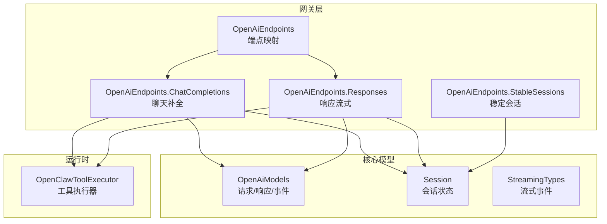
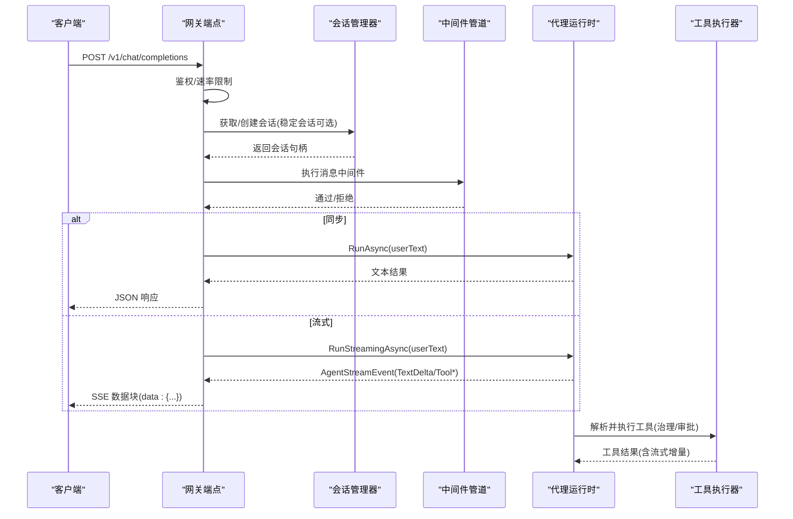
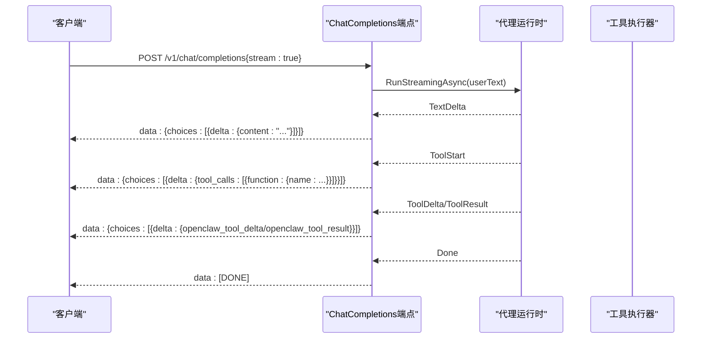
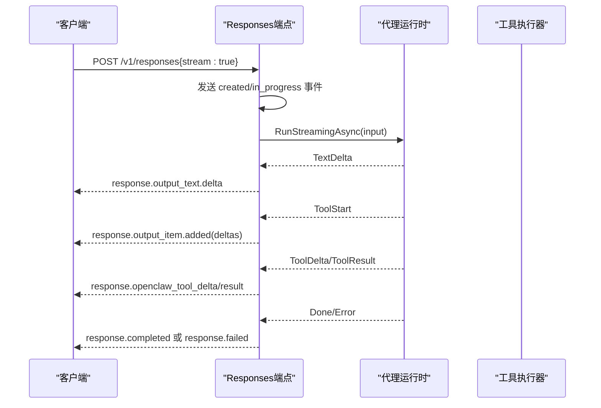
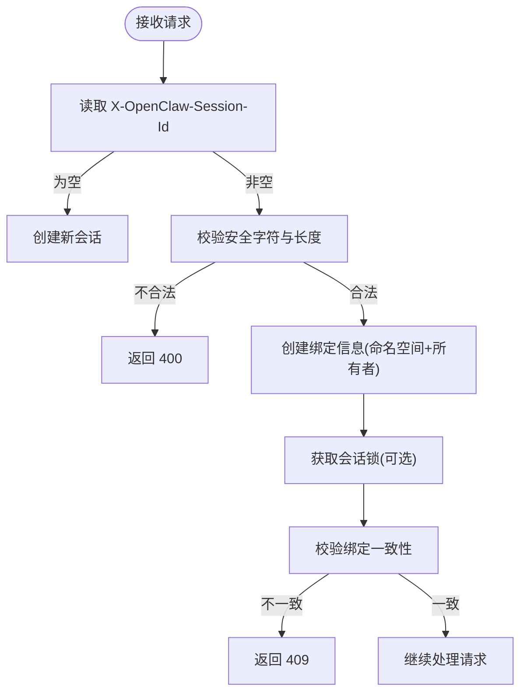
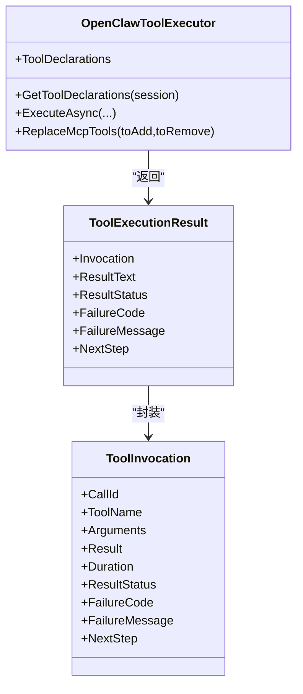
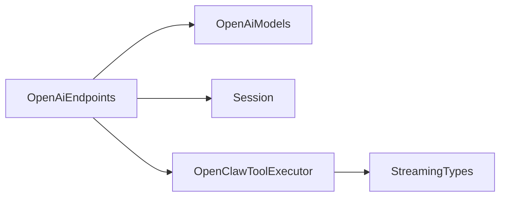

# OpenAI 兼容接口

<cite>
**本文档引用的文件**
- [OpenAiEndpoints.ChatCompletions.cs](file://src/OpenClaw.Gateway/Endpoints/OpenAiEndpoints.ChatCompletions.cs)
- [OpenAiEndpoints.Responses.cs](file://src/OpenClaw.Gateway/Endpoints/OpenAiEndpoints.Responses.cs)
- [OpenAiEndpoints.cs](file://src/OpenClaw.Gateway/Endpoints/OpenAiEndpoints.cs)
- [OpenAiEndpoints.StableSessions.cs](file://src/OpenClaw.Gateway/Endpoints/OpenAiEndpoints.StableSessions.cs)
- [OpenAiModels.cs](file://src/OpenClaw.Core/Models/OpenAiModels.cs)
- [Session.cs](file://src/OpenClaw.Core/Models/Session.cs)
- [StreamingTypes.cs](file://src/OpenClaw.Core/Models/StreamingTypes.cs)
- [OpenClawToolExecutor.cs](file://src/OpenClaw.Agent/OpenClawToolExecutor.cs)
- [README.md](file://README.md)
- [OpenClaw-Session-Management.md](file://docs/OpenClaw-Session-Management.md)
- [TOOLS_GUIDE.md](file://docs/TOOLS_GUIDE.md)
</cite>

## 目录
1. [简介](#简介)
2. [项目结构](#项目结构)
3. [核心组件](#核心组件)
4. [架构总览](#架构总览)
5. [详细组件分析](#详细组件分析)
6. [依赖关系分析](#依赖关系分析)
7. [性能考虑](#性能考虑)
8. [故障排除指南](#故障排除指南)
9. [结论](#结论)
10. [附录](#附录)

## 简介
本文件系统性阐述 OpenAI 兼容接口在本项目中的实现，重点覆盖以下内容：
- /v1/chat/completions 与 /v1/responses 端点的请求格式、响应结构与流式传输机制
- 稳定会话支持（跨请求保持上下文）
- 工具调用集成（含审批与治理）
- 模型配置选项与预设策略
- 完整的 API 使用示例（同步与异步）、流式响应处理与错误场景应对

## 项目结构
OpenAI 兼容接口由网关层端点映射、核心模型定义、会话管理与工具执行器共同组成。关键模块如下：
- 网关端点：映射 /v1/chat/completions 与 /v1/responses，负责鉴权、速率限制、中间件、会话绑定与流式输出
- 核心模型：定义 OpenAI 兼容的请求/响应结构与 SSE 事件类型
- 会话模型：承载历史、令牌用量、稳定会话绑定等状态
- 工具执行器：负责工具解析、治理、审批与执行，支持流式工具输出

图表来源
- [OpenAiEndpoints.cs:13-20](file://src/OpenClaw.Gateway/Endpoints/OpenAiEndpoints.cs#L13-L20)
- [OpenAiEndpoints.ChatCompletions.cs:12-17](file://src/OpenClaw.Gateway/Endpoints/OpenAiEndpoints.ChatCompletions.cs#L12-L17)
- [OpenAiEndpoints.Responses.cs:12-17](file://src/OpenClaw.Gateway/Endpoints/OpenAiEndpoints.Responses.cs#L12-L17)
- [OpenAiEndpoints.StableSessions.cs:73-87](file://src/OpenClaw.Gateway/Endpoints/OpenAiEndpoints.StableSessions.cs#L73-L87)
- [OpenAiModels.cs:19-571](file://src/OpenClaw.Core/Models/OpenAiModels.cs#L19-L571)
- [Session.cs:15-135](file://src/OpenClaw.Core/Models/Session.cs#L15-L135)
- [StreamingTypes.cs:6-25](file://src/OpenClaw.Core/Models/StreamingTypes.cs#L6-L25)
- [OpenClawToolExecutor.cs:30-100](file://src/OpenClaw.Agent/OpenClawToolExecutor.cs#L30-L100)

章节来源
- [OpenAiEndpoints.cs:13-20](file://src/OpenClaw.Gateway/Endpoints/OpenAiEndpoints.cs#L13-L20)

## 核心组件
- 端点映射与鉴权
  - /v1/chat/completions 与 /v1/responses 通过 MapOpenClawOpenAiEndpoints 统一注册
  - 鉴权：非本地绑定需 Authorization: Bearer <token>
  - 速率限制：基于 IP 的速率限制策略
- 请求/响应模型
  - OpenAiChatCompletionRequest/OpenAiChatCompletionResponse：兼容 OpenAI 的聊天补全
  - OpenAiResponseRequest/OpenAiResponseResponse：简化输入的响应流式接口
  - SSE 事件模型：OpenAiStreamChunk、OpenAiResponse*Event 系列
- 会话与稳定会话
  - Session 承载历史、令牌用量、模型配置、路由策略等
  - 稳定会话通过 X-OpenClaw-Session-Id 头部绑定，跨请求保持上下文
- 工具执行与治理
  - OpenClawToolExecutor 负责工具解析、治理决策、审批流程与执行
  - 支持流式工具增量输出，与端点流式响应对接

章节来源
- [OpenAiEndpoints.ChatCompletions.cs:17-52](file://src/OpenClaw.Gateway/Endpoints/OpenAiEndpoints.ChatCompletions.cs#L17-L52)
- [OpenAiEndpoints.Responses.cs:17-52](file://src/OpenClaw.Gateway/Endpoints/OpenAiEndpoints.Responses.cs#L17-L52)
- [OpenAiModels.cs:19-571](file://src/OpenClaw.Core/Models/OpenAiModels.cs#L19-L571)
- [Session.cs:15-135](file://src/OpenClaw.Core/Models/Session.cs#L15-L135)
- [OpenClawToolExecutor.cs:30-100](file://src/OpenClaw.Agent/OpenClawToolExecutor.cs#L30-L100)

## 架构总览
下图展示了从客户端到代理运行时再到工具执行的整体链路，以及稳定会话与工具治理的关键节点。

图表来源
- [OpenAiEndpoints.ChatCompletions.cs:17-368](file://src/OpenClaw.Gateway/Endpoints/OpenAiEndpoints.ChatCompletions.cs#L17-L368)
- [OpenAiEndpoints.Responses.cs:17-614](file://src/OpenClaw.Gateway/Endpoints/OpenAiEndpoints.Responses.cs#L17-L614)
- [OpenClawToolExecutor.cs:134-630](file://src/OpenClaw.Agent/OpenClawToolExecutor.cs#L134-L630)

## 详细组件分析

### /v1/chat/completions 端点
- 请求处理
  - 鉴权与速率限制前置检查
  - 反序列化 OpenAiChatCompletionRequest，校验至少包含一条消息
  - 提取最后一条用户消息作为提示文本
  - 稳定会话绑定：若携带 X-OpenClaw-Session-Id，则按命名空间绑定，确保请求者一致
  - 中间件执行：基于会话令牌用量与渠道信息进行短路控制
  - 模型选择：优先使用请求中的 Model，否则回退到默认配置
  - 预设头 X-OpenClaw-Preset：可动态切换会话预设
- 同步响应
  - 构造 OpenAiChatCompletionResponse，包含 choices 与 usage
- 流式响应
  - 首发 role delta（role=assistant）
  - 文本增量：data: OpenAiStreamChunk（choices[0].delta.content）
  - 工具调用：tool_calls.function.* 与 openclaw_tool_delta/openclaw_tool_result
  - 结束：data: [DONE]

图表来源
- [OpenAiEndpoints.ChatCompletions.cs:175-319](file://src/OpenClaw.Gateway/Endpoints/OpenAiEndpoints.ChatCompletions.cs#L175-L319)
- [OpenAiModels.cs:224-286](file://src/OpenClaw.Core/Models/OpenAiModels.cs#L224-L286)
- [StreamingTypes.cs:6-25](file://src/OpenClaw.Core/Models/StreamingTypes.cs#L6-L25)

章节来源
- [OpenAiEndpoints.ChatCompletions.cs:17-368](file://src/OpenClaw.Gateway/Endpoints/OpenAiEndpoints.ChatCompletions.cs#L17-L368)
- [OpenAiModels.cs:19-221](file://src/OpenClaw.Core/Models/OpenAiModels.cs#L19-L221)

### /v1/responses 端点
- 请求处理
  - 鉴权、速率限制、JSON 反序列化、校验 input 字段
  - 稳定会话绑定与中间件执行
  - 模型选择与预设切换（X-OpenClaw-Preset）
- 同步响应
  - 构造 OpenAiResponseResponse，包含 output 列表与 usage
- 流式响应
  - 生命周期事件：response.created、response.in_progress、response.completed、response.failed
  - 输出项事件：response.output_item.added/done
  - 文本增量：response.output_text.delta/done
  - 工具调用事件：arguments 的 delta/done 与 openclaw_tool_delta/openclaw_tool_result
  - 结束：response.completed 或 response.failed

图表来源
- [OpenAiEndpoints.Responses.cs:17-614](file://src/OpenClaw.Gateway/Endpoints/OpenAiEndpoints.Responses.cs#L17-L614)
- [OpenAiModels.cs:288-571](file://src/OpenClaw.Core/Models/OpenAiModels.cs#L288-L571)

章节来源
- [OpenAiEndpoints.Responses.cs:17-614](file://src/OpenClaw.Gateway/Endpoints/OpenAiEndpoints.Responses.cs#L17-L614)
- [OpenAiModels.cs:288-571](file://src/OpenClaw.Core/Models/OpenAiModels.cs#L288-L571)

### 稳定会话支持
- 头部绑定
  - X-OpenClaw-Session-Id：外部稳定会话标识
  - 内部命名空间：基于请求者标识计算的哈希前缀，避免跨用户冲突
- 绑定一致性
  - 首次绑定后，后续请求必须来自同一请求者，否则返回 409
- 生命周期
  - 会话持久化：稳定会话结束后尝试持久化；失败为尽力而为
  - 无历史且无锁：空会话自动移除

图表来源
- [OpenAiEndpoints.StableSessions.cs:52-122](file://src/OpenClaw.Gateway/Endpoints/OpenAiEndpoints.StableSessions.cs#L52-L122)
- [OpenAiEndpoints.ChatCompletions.cs:66-96](file://src/OpenClaw.Gateway/Endpoints/OpenAiEndpoints.ChatCompletions.cs#L66-L96)
- [OpenAiEndpoints.Responses.cs:55-85](file://src/OpenClaw.Gateway/Endpoints/OpenAiEndpoints.Responses.cs#L55-L85)

章节来源
- [OpenAiEndpoints.StableSessions.cs:52-122](file://src/OpenClaw.Gateway/Endpoints/OpenAiEndpoints.StableSessions.cs#L52-L122)
- [OpenAiEndpoints.ChatCompletions.cs:66-96](file://src/OpenClaw.Gateway/Endpoints/OpenAiEndpoints.ChatCompletions.cs#L66-L96)
- [OpenAiEndpoints.Responses.cs:55-85](file://src/OpenClaw.Gateway/Endpoints/OpenAiEndpoints.Responses.cs#L55-L85)

### 工具调用集成
- 工具解析与治理
  - 工具声明：根据会话预设与路由策略筛选允许的工具
  - 治理决策：基于策略与描述符决定是否需要审批、替换参数或阻断
  - 审批回调：支持交互式审批通道（如浏览器聊天）
- 执行与流式输出
  - 非流式工具：一次性返回结果
  - 流式工具：通过 onDelta 回调增量输出，端点将其转换为 SSE 事件
- 错误与状态
  - 失败码、失败消息、下一步建议与治理记录

图表来源
- [OpenClawToolExecutor.cs:30-100](file://src/OpenClaw.Agent/OpenClawToolExecutor.cs#L30-L100)
- [OpenClawToolExecutor.cs:134-630](file://src/OpenClaw.Agent/OpenClawToolExecutor.cs#L134-L630)
- [Session.cs:160-179](file://src/OpenClaw.Core/Models/Session.cs#L160-L179)

章节来源
- [OpenClawToolExecutor.cs:134-630](file://src/OpenClaw.Agent/OpenClawToolExecutor.cs#L134-L630)
- [Session.cs:160-179](file://src/OpenClaw.Core/Models/Session.cs#L160-L179)

### 模型配置选项
- 请求级 Model
  - 若存在，优先使用；若不在可用配置中则作为模型覆盖
- 默认模型
  - 未指定时使用全局默认模型
- 预设切换
  - X-OpenClaw-Preset 可动态设置会话活动预设，影响工具策略与能力
- 能力感知
  - 通过模型配置文件与能力要求进行匹配与降级

章节来源
- [OpenAiEndpoints.ChatCompletions.cs:114-126](file://src/OpenClaw.Gateway/Endpoints/OpenAiEndpoints.ChatCompletions.cs#L114-L126)
- [OpenAiEndpoints.Responses.cs:103-115](file://src/OpenClaw.Gateway/Endpoints/OpenAiEndpoints.Responses.cs#L103-L115)
- [OpenAiEndpoints.cs:22-87](file://src/OpenClaw.Gateway/Endpoints/OpenAiEndpoints.cs#L22-L87)

## 依赖关系分析
- 端点对模型的依赖
  - 请求/响应模型由 CoreJsonContext 序列化/反序列化
- 端点对会话的依赖
  - 会话状态驱动令牌用量、历史与稳定会话绑定
- 端点对工具的依赖
  - 工具执行器负责实际动作，端点负责治理与审批
- 流式事件依赖
  - AgentStreamEvent 作为统一事件源，映射到 OpenAI/SSE 事件

图表来源
- [OpenAiEndpoints.ChatCompletions.cs:1-7](file://src/OpenClaw.Gateway/Endpoints/OpenAiEndpoints.ChatCompletions.cs#L1-L7)
- [OpenAiEndpoints.Responses.cs:1-7](file://src/OpenClaw.Gateway/Endpoints/OpenAiEndpoints.Responses.cs#L1-L7)
- [OpenAiModels.cs:1-5](file://src/OpenClaw.Core/Models/OpenAiModels.cs#L1-L5)
- [Session.cs:1-9](file://src/OpenClaw.Core/Models/Session.cs#L1-L9)
- [OpenClawToolExecutor.cs:1-15](file://src/OpenClaw.Agent/OpenClawToolExecutor.cs#L1-L15)
- [StreamingTypes.cs:1-2](file://src/OpenClaw.Core/Models/StreamingTypes.cs#L1-L2)

章节来源
- [OpenAiEndpoints.ChatCompletions.cs:1-7](file://src/OpenClaw.Gateway/Endpoints/OpenAiEndpoints.ChatCompletions.cs#L1-L7)
- [OpenAiEndpoints.Responses.cs:1-7](file://src/OpenClaw.Gateway/Endpoints/OpenAiEndpoints.Responses.cs#L1-L7)

## 性能考虑
- 流式传输
  - SSE 分块写入，及时 Flush，降低首字节延迟
- 速率限制
  - 基于 IP 的令牌桶策略，防止滥用
- 会话持久化
  - 稳定会话持久化采用尽力而为策略，避免阻塞响应
- 工具超时与治理
  - 工具执行超时与失败统计，便于容量规划与告警

## 故障排除指南
- 401 未授权
  - 非本地绑定需设置 Authorization: Bearer <token>
- 400 请求无效
  - JSON 解析失败或缺少必要字段（如 messages/input）
- 409 稳定会话冲突
  - 请求者与绑定不一致，检查 X-OpenClaw-Session-Id 与命名空间
- 429 速率限制
  - 超过策略阈值，检查 IP 限流配置
- 工具执行失败
  - 查看失败码与失败消息，结合治理日志定位原因

章节来源
- [README.md:279-291](file://README.md#L279-L291)
- [OpenAiEndpoints.ChatCompletions.cs:19-30](file://src/OpenClaw.Gateway/Endpoints/OpenAiEndpoints.ChatCompletions.cs#L19-L30)
- [OpenAiEndpoints.Responses.cs:19-30](file://src/OpenClaw.Gateway/Endpoints/OpenAiEndpoints.Responses.cs#L19-L30)
- [OpenAiEndpoints.StableSessions.cs:95-119](file://src/OpenClaw.Gateway/Endpoints/OpenAiEndpoints.StableSessions.cs#L95-L119)
- [OpenClawToolExecutor.cs:483-530](file://src/OpenClaw.Agent/OpenClawToolExecutor.cs#L483-L530)

## 结论
本实现以最小侵入方式提供 OpenAI 兼容接口，同时保留了稳定会话、工具治理与流式传输等高级特性。通过清晰的端点职责划分与强类型模型定义，既保证了与主流 SDK 的兼容性，又为生产环境的安全与可观测性提供了坚实基础。

## 附录

### API 使用示例（路径参考）
- 同步聊天补全
  - 请求：POST /v1/chat/completions
  - 示例路径：[示例请求体:23-31](file://src/OpenClaw.Core/Models/OpenAiModels.cs#L23-L31)
  - 响应：OpenAiChatCompletionResponse
- 异步聊天补全（SSE）
  - 请求：POST /v1/chat/completions{stream:true}
  - 流式事件：OpenAiStreamChunk.choices[*].delta.*
  - 示例路径：[流式事件定义:224-286](file://src/OpenClaw.Core/Models/OpenAiModels.cs#L224-L286)
- 同步响应流式
  - 请求：POST /v1/responses
  - 示例路径：[请求体:294-303](file://src/OpenClaw.Core/Models/OpenAiModels.cs#L294-L303)
- 异步响应流式（SSE）
  - 生命周期事件：response.created → response.in_progress → response.completed 或 response.failed
  - 示例路径：[事件定义:371-571](file://src/OpenClaw.Core/Models/OpenAiModels.cs#L371-L571)
- 稳定会话
  - 请求头：X-OpenClaw-Session-Id
  - 示例路径：[稳定会话绑定:73-87](file://src/OpenClaw.Gateway/Endpoints/OpenAiEndpoints.StableSessions.cs#L73-L87)

### 最佳实践
- 使用 X-OpenClaw-Preset 动态切换工具策略
- 对高风险工具启用审批与治理
- 在生产环境启用 TLS 并正确配置反向代理
- 合理设置工具超时与中间件策略

章节来源
- [OpenAiModels.cs:19-571](file://src/OpenClaw.Core/Models/OpenAiModels.cs#L19-L571)
- [OpenAiEndpoints.StableSessions.cs:73-87](file://src/OpenClaw.Gateway/Endpoints/OpenAiEndpoints.StableSessions.cs#L73-L87)
- [README.md:279-291](file://README.md#L279-L291)
- [TOOLS_GUIDE.md:1-206](file://docs/TOOLS_GUIDE.md#L1-L206)
- [OpenClaw-Session-Management.md:114-147](file://docs/OpenClaw-Session-Management.md#L114-L147)