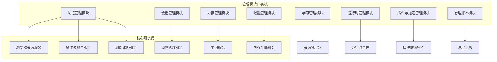
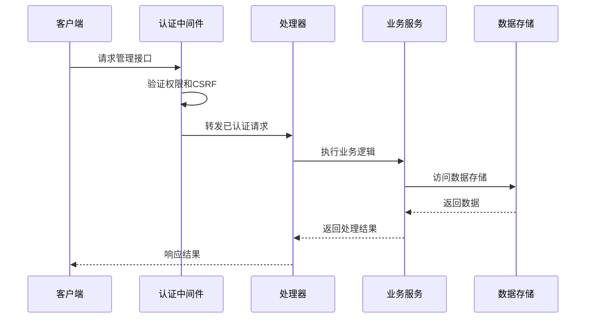
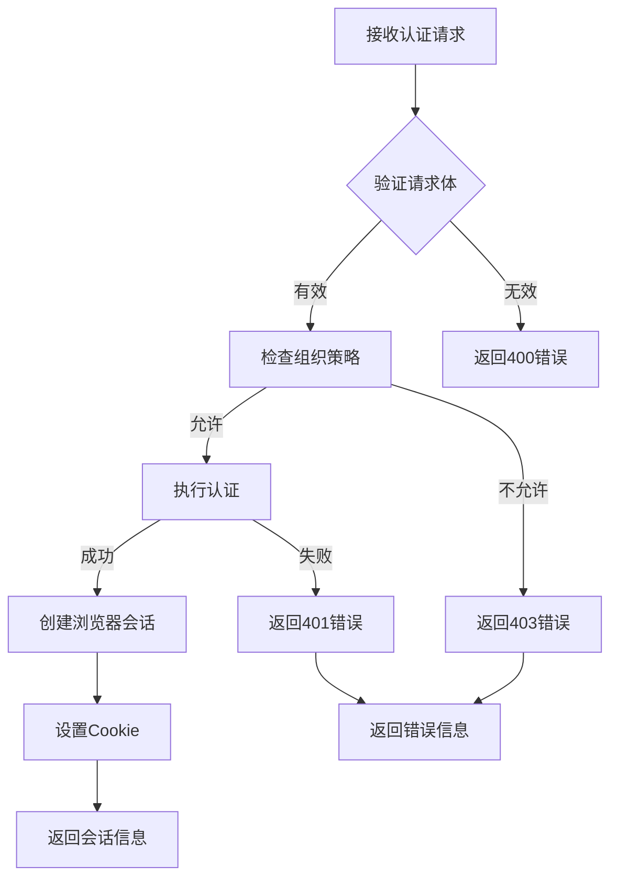
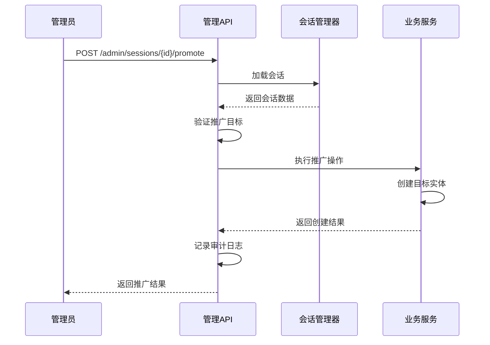
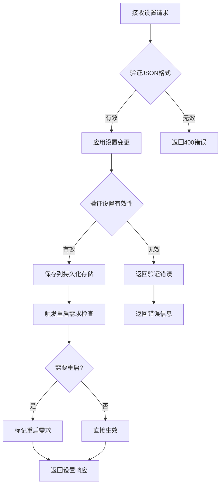
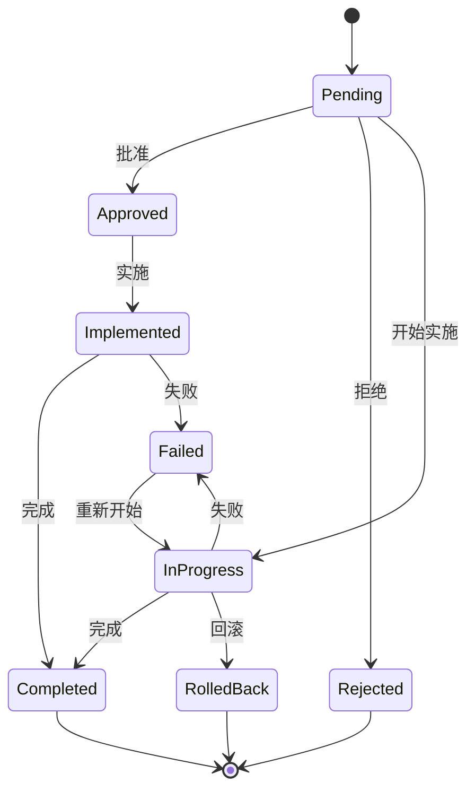
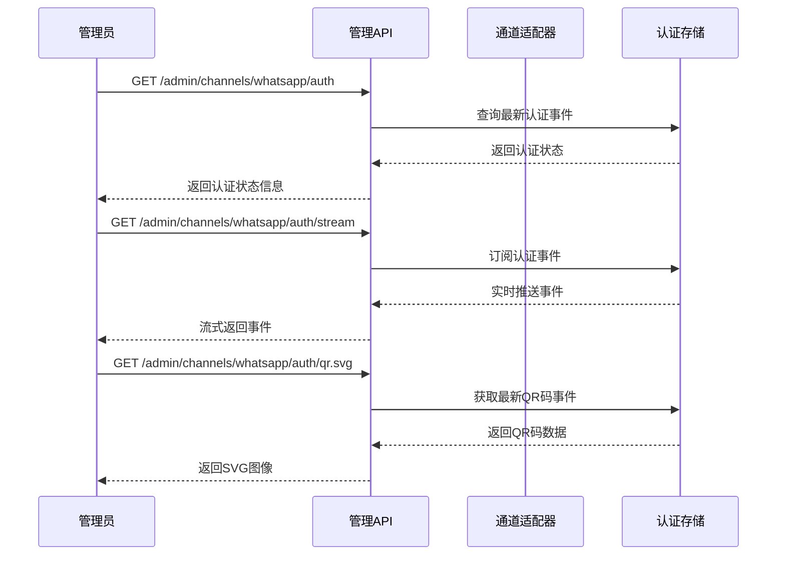
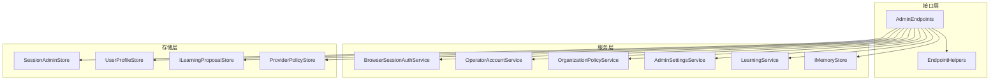

# 管理员管理接口

<cite>
**本文档引用的文件**
- [AdminEndpoints.cs](file://src/OpenClaw.Gateway/Endpoints/AdminEndpoints.cs)
- [AdminEndpoints.Auth.cs](file://src/OpenClaw.Gateway/Endpoints/AdminEndpoints.Auth.cs)
- [AdminEndpoints.Sessions.cs](file://src/OpenClaw.Gateway/Endpoints/AdminEndpoints.Sessions.cs)
- [AdminEndpoints.Memory.cs](file://src/OpenClaw.Gateway/Endpoints/AdminEndpoints.Memory.cs)
- [AdminEndpoints.ProfilesAndLearning.cs](file://src/OpenClaw.Gateway/Endpoints/AdminEndpoints.ProfilesAndLearning.cs)
- [AdminEndpoints.Setup.cs](file://src/OpenClaw.Gateway/Endpoints/AdminEndpoints.Setup.cs)
- [AdminEndpoints.PluginsAndChannels.cs](file://src/OpenClaw.Gateway/Endpoints/AdminEndpoints.PluginsAndChannels.cs)
- [AdminEndpoints.GovernanceLedger.cs](file://src/OpenClaw.Gateway/Endpoints/AdminEndpoints.GovernanceLedger.cs)
- [AdminEndpoints.Runtime.cs](file://src/OpenClaw.Gateway/Endpoints/AdminEndpoints.Runtime.cs)
- [EndpointHelpers.cs](file://src/OpenClaw.Gateway/Endpoints/EndpointHelpers.cs)
- [AdminApiModels.cs](file://src/OpenClaw.Core/Models/AdminApiModels.cs)
</cite>

## 目录
1. [简介](#简介)
2. [项目结构](#项目结构)
3. [核心组件](#核心组件)
4. [架构概览](#架构概览)
5. [详细组件分析](#详细组件分析)
6. [依赖关系分析](#依赖关系分析)
7. [性能考虑](#性能考虑)
8. [故障排除指南](#故障排除指南)
9. [结论](#结论)

## 简介

管理员管理接口是 OpenClaw 系统的核心管理功能模块，为系统管理员提供了全面的运维和管理能力。该接口体系涵盖了认证管理、会话管理、内存管理、配置管理、学习管理等多个关键领域，为系统提供了强大的监控、控制和治理能力。

本系统采用分层架构设计，通过 HTTP RESTful API 提供统一的管理接口，支持多种认证模式和严格的权限控制机制。所有管理操作都经过审计记录，确保系统的可追溯性和安全性。

## 项目结构

管理员管理接口采用模块化设计，按照功能域进行组织：

**图表来源**
- [AdminEndpoints.cs:32-162](file://src/OpenClaw.Gateway/Endpoints/AdminEndpoints.cs#L32-L162)

**章节来源**
- [AdminEndpoints.cs:1-164](file://src/OpenClaw.Gateway/Endpoints/AdminEndpoints.cs#L1-L164)

## 核心组件

管理员管理接口由以下核心组件构成：

### 认证管理组件
- 浏览器会话认证
- 操作员令牌认证
- 组织策略控制
- CSRF 保护机制

### 会话管理组件
- 活跃会话监控
- 会话分支管理
- 会话元数据管理
- 会话导出功能

### 内存管理组件
- 结构化内存管理
- 记忆笔记管理
- 内存导入导出
- Fractal 内存系统

### 配置管理组件
- 系统设置管理
- 插件配置管理
- 运行时状态监控
- 维护任务执行

**章节来源**
- [AdminEndpoints.Auth.cs:30-399](file://src/OpenClaw.Gateway/Endpoints/AdminEndpoints.Auth.cs#L30-L399)
- [AdminEndpoints.Sessions.cs:30-437](file://src/OpenClaw.Gateway/Endpoints/AdminEndpoints.Sessions.cs#L30-L437)
- [AdminEndpoints.Memory.cs:30-856](file://src/OpenClaw.Gateway/Endpoints/AdminEndpoints.Memory.cs#L30-L856)

## 架构概览

管理员管理接口采用分层架构，确保了良好的关注点分离和可维护性：

**图表来源**
- [EndpointHelpers.cs:35-46](file://src/OpenClaw.Gateway/Endpoints/EndpointHelpers.cs#L35-L46)

系统架构特点：
- **多层认证**：支持浏览器会话和操作员令牌双重认证
- **权限隔离**：基于作用域的细粒度权限控制
- **审计追踪**：所有管理操作都记录在案
- **错误处理**：统一的错误响应格式和状态码

**章节来源**
- [AdminEndpoints.cs:106-145](file://src/OpenClaw.Gateway/Endpoints/AdminEndpoints.cs#L106-L145)

## 详细组件分析

### 认证管理接口

#### 接口规范

| 接口 | 方法 | 路径 | 权限要求 |
|------|------|------|----------|
| 获取会话信息 | GET | `/auth/session` | 已认证 |
| 创建会话 | POST | `/auth/session` | 无要求（受策略限制） |
| 操作员令牌交换 | POST | `/auth/operator-token` | 已认证 |
| 清除会话 | DELETE | `/auth/session` | 已认证+CSRF |

#### 请求参数验证

认证接口采用多层次验证机制：

**图表来源**
- [AdminEndpoints.Auth.cs:51-124](file://src/OpenClaw.Gateway/Endpoints/AdminEndpoints.Auth.cs#L51-L124)

#### 响应数据结构

认证响应包含以下关键字段：
- `authMode`: 认证模式
- `csrfToken`: CSRF 令牌
- `expiresAtUtc`: 过期时间
- `persistent`: 是否持久化
- `allowedAuthModes`: 允许的认证模式列表

**章节来源**
- [AdminEndpoints.Auth.cs:40-124](file://src/OpenClaw.Gateway/Endpoints/AdminEndpoints.Auth.cs#L40-L124)
- [AdminApiModels.cs:27-47](file://src/OpenClaw.Core/Models/AdminApiModels.cs#L27-L47)

### 会话管理接口

#### 接口规范

| 接口 | 方法 | 路径 | 权限要求 |
|------|------|------|----------|
| 列出会话 | GET | `/admin/sessions` | admin.sessions |
| 获取会话详情 | GET | `/admin/sessions/{id}` | admin.session.detail |
| 会话推广 | POST | `/admin/sessions/{id}/promote` | admin.session.promote |
| 获取分支列表 | GET | `/admin/sessions/{id}/branches` | admin.session.branches |
| 导出会话 | GET | `/admin/sessions/{id}/export` | admin.session.export |
| 恢复分支 | POST | `/admin/branches/{id}/restore` | admin.branch.restore |
| 获取时间线 | GET | `/admin/sessions/{id}/timeline` | admin.session.timeline |
| 获取差异 | GET | `/admin/sessions/{id}/diff` | admin.session.diff |
| 更新元数据 | POST | `/admin/sessions/{id}/metadata` | admin.session.metadata |
| 导出多个会话 | GET | `/admin/sessions/export` | admin.sessions.export |

#### 会话推广流程

**图表来源**
- [AdminEndpoints.Sessions.cs:115-259](file://src/OpenClaw.Gateway/Endpoints/AdminEndpoints.Sessions.cs#L115-L259)

#### 会话状态管理

系统支持多种会话状态：
- `active`: 活跃会话
- `inactive`: 非活跃会话
- `terminated`: 已终止会话
- `pending`: 待处理会话

**章节来源**
- [AdminEndpoints.Sessions.cs:40-93](file://src/OpenClaw.Gateway/Endpoints/AdminEndpoints.Sessions.cs#L40-L93)
- [AdminEndpoints.Sessions.cs:261-327](file://src/OpenClaw.Gateway/Endpoints/AdminEndpoints.Sessions.cs#L261-L327)

### 内存管理接口

#### 接口规范

| 接口 | 方法 | 路径 | 权限要求 |
|------|------|------|----------|
| 获取Fractal状态 | GET | `/admin/memory/fractal/status` | admin.memory |
| 搜索Fractal内容 | GET | `/admin/memory/fractal/search` | admin.memory |
| 打开Fractal路径 | GET | `/admin/memory/fractal/open` | admin.memory |
| 导出Fractal内容 | GET | `/admin/memory/fractal/export` | admin.memory |
| 获取最近Fractal内容 | GET | `/admin/memory/fractal/recent` | admin.memory |
| 验证Fractal索引 | POST | `/admin/memory/fractal/validate` | admin.memory |
| 刷新Fractal索引 | POST | `/admin/memory/fractal/index/refresh` | admin.memory.mutate |
| 创建Fractal交接 | POST | `/admin/memory/fractal/handoff` | admin.memory.mutate |
| 列举记忆笔记 | GET | `/admin/memory/notes` | admin.memory |
| 搜索记忆笔记 | GET | `/admin/memory/search` | admin.memory |
| 获取记忆笔记详情 | GET | `/admin/memory/notes/{key}` | admin.memory |
| 创建/更新记忆笔记 | POST | `/admin/memory/notes` | admin.memory.mutate |
| 删除记忆笔记 | DELETE | `/admin/memory/notes/{key}` | admin.memory.mutate |
| 导出内存数据 | GET | `/admin/memory/export` | admin.memory.export |
| 导入内存数据 | POST | `/admin/memory/import` | admin.memory.mutate |
| 导出代理包 | GET | `/admin/agent-bundle/export` | admin.agent-bundle.export |
| 导入代理包 | POST | `/admin/agent-bundle/import` | admin.agent-bundle.mutate |

#### 内存键值管理

内存键值采用严格的验证机制：
- 支持字母数字字符
- 支持下划线和连字符
- 限制最大长度为 255 字符
- 自动转义特殊字符

**章节来源**
- [AdminEndpoints.Memory.cs:45-136](file://src/OpenClaw.Gateway/Endpoints/AdminEndpoints.Memory.cs#L45-L136)
- [AdminEndpoints.Memory.cs:313-378](file://src/OpenClaw.Gateway/Endpoints/AdminEndpoints.Memory.cs#L313-L378)

### 配置管理接口

#### 接口规范

| 接口 | 方法 | 路径 | 权限要求 |
|------|------|------|----------|
| 获取系统摘要 | GET | `/admin/summary` | admin.summary |
| 获取设置状态 | GET | `/admin/setup/status` | admin.setup.status |
| 维护扫描 | GET | `/admin/maintenance` | admin.observability |
| 执行修复 | POST | `/admin/maintenance/fix` | admin.observability |
| 设置验证 | GET | `/admin/setup/verify` | admin.setup.status |
| 获取可观测性摘要 | GET | `/admin/observability/summary` | admin.observability |
| 获取洞察报告 | GET | `/admin/insights` | admin.observability |
| 获取时间序列数据 | GET | `/admin/observability/series` | admin.observability |
| 导出审计数据 | GET | `/admin/audit/export` | admin.audit.export |
| 导出轨迹数据 | GET | `/admin/trajectory/export` | admin.trajectory.export |
| 获取安全态势 | GET | `/admin/posture` | admin.posture |
| 模拟审批流程 | POST | `/admin/approvals/simulate` | admin.approvals.simulate |
| 导出事故包 | GET | `/admin/incident/export` | admin.incident.export |
| 获取设置 | GET | `/admin/settings` | admin.settings |
| 更新设置 | POST | `/admin/settings` | admin.settings.mutate |
| 重置设置 | DELETE | `/admin/settings` | admin.settings.mutate |
| 获取心跳预览 | GET | `/admin/heartbeat` | admin.heartbeat |
| 预览心跳配置 | POST | `/admin/heartbeat/preview` | admin.heartbeat.preview |
| 更新心跳配置 | PUT | `/admin/heartbeat` | admin.heartbeat.mutate |
| 获取心跳状态 | GET | `/admin/heartbeat/status` | admin.heartbeat.status |

#### 设置管理流程

**图表来源**
- [AdminEndpoints.Setup.cs:375-432](file://src/OpenClaw.Gateway/Endpoints/AdminEndpoints.Setup.cs#L375-L432)

**章节来源**
- [AdminEndpoints.Setup.cs:47-125](file://src/OpenClaw.Gateway/Endpoints/AdminEndpoints.Setup.cs#L47-L125)
- [AdminEndpoints.Setup.cs:365-432](file://src/OpenClaw.Gateway/Endpoints/AdminEndpoints.Setup.cs#L365-L432)

### 学习管理接口

#### 接口规范

| 接口 | 方法 | 路径 | 权限要求 |
|------|------|------|----------|
| 列举集成配置文件 | GET | `/admin/profiles` | admin.profiles |
| 导出配置文件 | GET | `/admin/profiles/export` | admin.profiles.export |
| 导入配置文件 | POST | `/admin/profiles/import` | admin.profiles.mutate |
| 获取配置文件详情 | GET | `/admin/profiles/{actorId}` | admin.profiles |
| 列举学习提案 | GET | `/admin/learning/proposals` | admin.learning |
| 创建夹具变更提案 | POST | `/admin/learning/proposals/harness-change` | admin.learning.mutate |
| 检测夹具变更提案 | POST | `/admin/learning/proposals/harness-change/detect` | admin.learning.mutate |
| 获取学习提案详情 | GET | `/admin/learning/proposals/{id}` | admin.learning |
| 批准学习提案 | POST | `/admin/learning/proposals/{id}/approve` | admin.learning.mutate |
| 拒绝学习提案 | POST | `/admin/learning/proposals/{id}/reject` | admin.learning.mutate |
| 回滚学习提案 | POST | `/admin/learning/proposals/{id}/rollback` | admin.learning.mutate |

#### 学习提案状态流转

**图表来源**
- [AdminEndpoints.ProfilesAndLearning.cs:299-354](file://src/OpenClaw.Gateway/Endpoints/AdminEndpoints.ProfilesAndLearning.cs#L299-L354)

**章节来源**
- [AdminEndpoints.ProfilesAndLearning.cs:177-191](file://src/OpenClaw.Gateway/Endpoints/AdminEndpoints.ProfilesAndLearning.cs#L177-L191)
- [AdminEndpoints.ProfilesAndLearning.cs:299-455](file://src/OpenClaw.Gateway/Endpoints/AdminEndpoints.ProfilesAndLearning.cs#L299-L455)

### 运行时管理接口

#### 接口规范

| 接口 | 方法 | 路径 | 权限要求 |
|------|------|------|----------|
| 列举待审批工具 | GET | `/tools/approvals` | admin.approvals |
| 查看审批历史 | GET | `/tools/approvals/history` | admin.approvals.history |
| 获取提供商状态 | GET | `/admin/providers` | admin.providers |
| 获取模型配置 | GET | `/admin/models` | admin.models |
| 模型诊断 | GET | `/admin/models/doctor` | admin.models.doctor |
| 运行模型评估 | POST | `/admin/models/evaluations` | admin.models.evaluate |
| 列举提供商策略 | GET | `/admin/providers/policies` | admin.provider-policies |
| 创建提供商策略 | POST | `/admin/providers/policies` | admin.provider-policies.mutate |
| 删除提供商策略 | DELETE | `/admin/providers/policies/{id}` | admin.provider-policies.mutate |
| 重置提供商电路 | POST | `/admin/providers/{providerId}/circuit/reset` | admin.providers.reset |
| 获取运行事件 | GET | `/admin/events` | admin.events |
| 获取脉冲状态 | GET | `/admin/pulse/status` | admin.pulse.status |
| 获取脉冲事件 | GET | `/admin/pulse/events` | admin.pulse.events |
| 运行脉冲 | POST | `/admin/pulse/run` | admin.pulse.run |
| 启用脉冲 | POST | `/admin/pulse/enable` | admin.pulse.mutate |
| 禁用脉冲 | POST | `/admin/pulse/disable` | admin.pulse.mutate |
| 列举审批策略 | GET | `/tools/approval-policies` | admin.approval-policies |
| 创建审批策略 | POST | `/tools/approval-policies` | admin.approval-policies.mutate |
| 删除审批策略 | DELETE | `/tools/approval-policies/{id}` | admin.approval-policies.mutate |
| 获取审计日志 | GET | `/admin/audit` | admin.audit |
| 列举Webhook死信 | GET | `/admin/webhooks/dead-letter` | admin.webhooks |
| 重放Webhook死信 | POST | `/admin/webhooks/dead-letter/{id}/replay` | admin.webhooks.mutate |
| 丢弃Webhook死信 | POST | `/admin/webhooks/dead-letter/{id}/discard` | admin.webhooks.mutate |
| 列举速率限制 | GET | `/admin/rate-limits` | admin.rate-limits |
| 创建速率限制 | POST | `/admin/rate-limits` | admin.rate-limits.mutate |
| 删除速率限制 | DELETE | `/admin/rate-limits/{id}` | admin.rate-limits.mutate |

#### 审批策略管理

系统提供灵活的工具审批机制：
- 基于会话的审批
- 基于通道的审批
- 基于发送者的审批
- 基于工具名称的审批

**章节来源**
- [AdminEndpoints.Runtime.cs:39-51](file://src/OpenClaw.Gateway/Endpoints/AdminEndpoints.Runtime.cs#L39-L51)
- [AdminEndpoints.Runtime.cs:296-303](file://src/OpenClaw.Gateway/Endpoints/AdminEndpoints.Runtime.cs#L296-L303)

### 治理账本接口

#### 接口规范

| 接口 | 方法 | 路径 | 权限要求 |
|------|------|------|----------|
| 列举治理记录 | GET | `/admin/governance/ledger` | admin.governance |
| 获取治理记录详情 | GET | `/admin/governance/ledger/{id}` | admin.governance |
| 创建治理记录 | POST | `/admin/governance/ledger` | admin.governance.mutate |
| 撤销治理记录 | POST | `/admin/governance/ledger/{id}/revoke` | admin.governance.mutate |

#### 治理决策类型

支持的治理决策包括：
- `approved`: 批准
- `rejected`: 拒绝
- `revoked`: 撤销
- `conditional`: 条件批准

**章节来源**
- [AdminEndpoints.GovernanceLedger.cs:15-85](file://src/OpenClaw.Gateway/Endpoints/AdminEndpoints.GovernanceLedger.cs#L15-L85)

### 插件与通道管理接口

#### 接口规范

| 接口 | 方法 | 路径 | 权限要求 |
|------|------|------|----------|
| 列举插件 | GET | `/admin/plugins` | admin.plugins |
| 列举技能 | GET | `/admin/skills` | admin.skills |
| 技能成本估算 | GET | `/admin/skills/cost-estimate` | admin.skills |
| 获取兼容性目录 | GET | `/admin/compatibility/catalog` | admin.compatibility |
| 导出兼容性数据 | GET | `/admin/compatibility/export` | admin.compatibility |
| 获取插件详情 | GET | `/admin/plugins/{id}` | admin.plugins |
| 禁用插件 | POST | `/admin/plugins/{id}/disable` | admin.plugins.mutate |
| 启用插件 | POST | `/admin/plugins/{id}/enable` | admin.plugins.mutate |
| 标记插件已审核 | POST | `/admin/plugins/{id}/review` | admin.plugins.mutate |
| 清除插件审核标记 | POST | `/admin/plugins/{id}/unreview` | admin.plugins.mutate |
| 将插件加入隔离区 | POST | `/admin/plugins/{id}/quarantine` | admin.plugins.mutate |
| 清除插件隔离 | POST | `/admin/plugins/{id}/clear-quarantine` | admin.plugins.mutate |
| 获取通道认证状态 | GET | `/admin/channels/auth` | admin.channels.auth |
| 获取特定通道认证状态 | GET | `/admin/channels/{channelId}/auth` | admin.channels.auth |
| 订阅通道认证事件流 | GET | `/admin/channels/{channelId}/auth/stream` | admin.channels.auth |
| 获取WhatsApp认证状态 | GET | `/admin/channels/whatsapp/auth` | admin.channels.auth |
| 订阅WhatsApp认证事件流 | GET | `/admin/channels/whatsapp/auth/stream` | admin.channels.auth |
| 获取WhatsApp认证二维码 | GET | `/admin/channels/whatsapp/auth/qr.svg` | admin.channels.auth |
| 获取WhatsApp设置 | GET | `/admin/channels/whatsapp/setup` | admin.channels.auth |
| 更新WhatsApp设置 | PUT | `/admin/channels/whatsapp/setup` | admin.channels.auth.mutate |
| 重启WhatsApp通道 | POST | `/admin/channels/whatsapp/restart` | admin.channels.auth.restart |

#### 通道认证流程

**图表来源**
- [AdminEndpoints.PluginsAndChannels.cs:293-358](file://src/OpenClaw.Gateway/Endpoints/AdminEndpoints.PluginsAndChannels.cs#L293-L358)

**章节来源**
- [AdminEndpoints.PluginsAndChannels.cs:40-50](file://src/OpenClaw.Gateway/Endpoints/AdminEndpoints.PluginsAndChannels.cs#L40-L50)
- [AdminEndpoints.PluginsAndChannels.cs:159-259](file://src/OpenClaw.Gateway/Endpoints/AdminEndpoints.PluginsAndChannels.cs#L159-L259)

## 依赖关系分析

管理员管理接口的依赖关系体现了清晰的关注点分离：

**图表来源**
- [AdminEndpoints.cs:37-145](file://src/OpenClaw.Gateway/Endpoints/AdminEndpoints.cs#L37-L145)

### 权限控制机制

系统采用基于作用域的权限控制：
- **基本权限**: 所有管理接口都需要管理员身份
- **细粒度权限**: 按功能域分配具体权限
- **CSRF保护**: 关键操作需要CSRF令牌
- **审计追踪**: 所有操作都有详细日志

**章节来源**
- [EndpointHelpers.cs:12-33](file://src/OpenClaw.Gateway/Endpoints/EndpointHelpers.cs#L12-L33)

## 性能考虑

管理员管理接口在设计时充分考虑了性能优化：

### 缓存策略
- **会话缓存**: 浏览器会话信息缓存
- **配置缓存**: 组织策略和设置缓存
- **统计缓存**: 运行时统计数据缓存

### 分页机制
- **默认分页大小**: 25条记录
- **最大分页大小**: 100条记录
- **查询优化**: 支持多种过滤条件

### 异步处理
- **批量操作**: 支持批量导入导出
- **后台任务**: 维护任务异步执行
- **流式响应**: 大数据量的流式传输

## 故障排除指南

### 常见问题及解决方案

#### 认证相关问题
- **401 未授权**: 检查会话是否过期或被撤销
- **403 禁止访问**: 验证操作员权限和组织策略
- **400 请求错误**: 检查请求格式和必需参数

#### 数据验证错误
- **内存键值无效**: 确保键值符合命名规则
- **设置配置错误**: 检查配置项的有效性
- **学习提案状态错误**: 验证提案状态转换的合法性

#### 系统资源问题
- **内存不足**: 检查Fractal内存配置
- **磁盘空间不足**: 监控内存存储使用情况
- **网络连接超时**: 验证外部服务可达性

**章节来源**
- [AdminEndpoints.Auth.cs:63-98](file://src/OpenClaw.Gateway/Endpoints/AdminEndpoints.Auth.cs#L63-L98)
- [AdminEndpoints.Memory.cs:344-352](file://src/OpenClaw.Gateway/Endpoints/AdminEndpoints.Memory.cs#L344-L352)

## 结论

管理员管理接口为 OpenClaw 系统提供了全面、安全、高效的管理能力。通过模块化的架构设计和严格的权限控制机制，系统能够满足各种复杂的运维管理需求。

关键优势包括：
- **全面的功能覆盖**: 涵盖系统管理的所有关键领域
- **严格的安全控制**: 多层次的认证和授权机制
- **完善的审计追踪**: 所有操作都有详细记录
- **灵活的扩展性**: 模块化设计便于功能扩展
- **优秀的用户体验**: 清晰的API设计和错误处理

建议的最佳实践：
- 始终使用 HTTPS 协议
- 定期审查和更新访问权限
- 建立完善的备份和恢复策略
- 监控系统性能和资源使用情况
- 定期进行安全审计和漏洞扫描