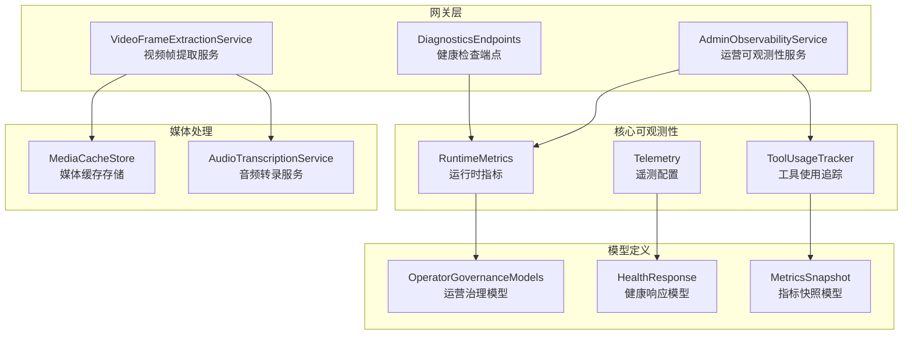
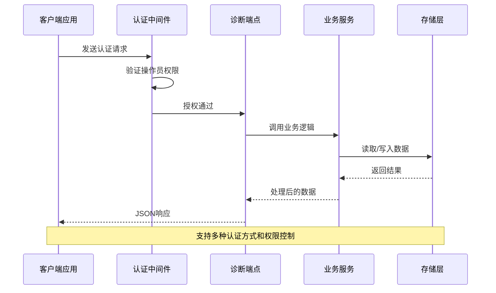
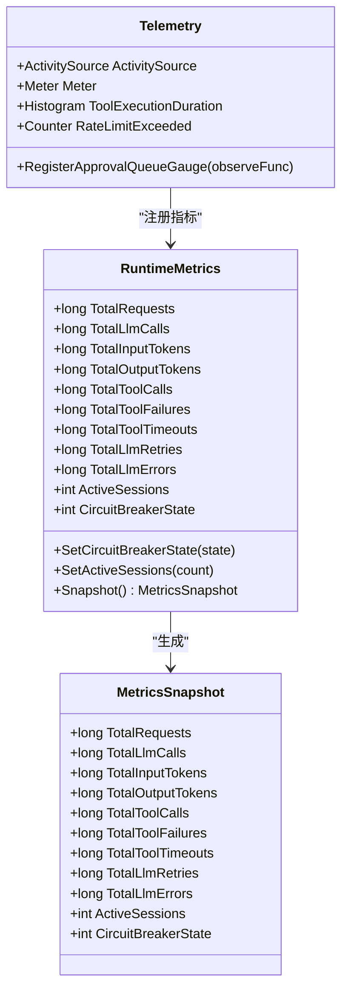
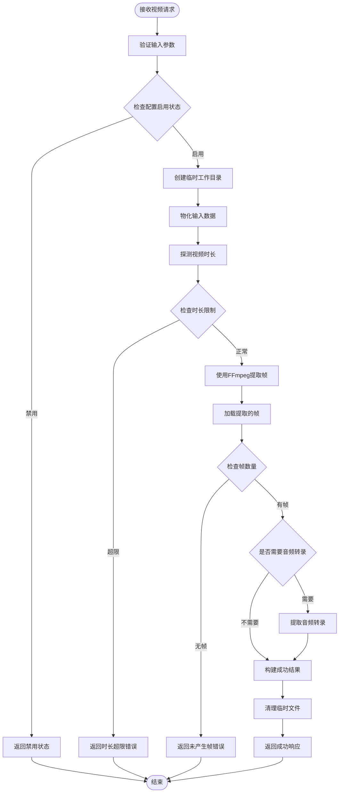
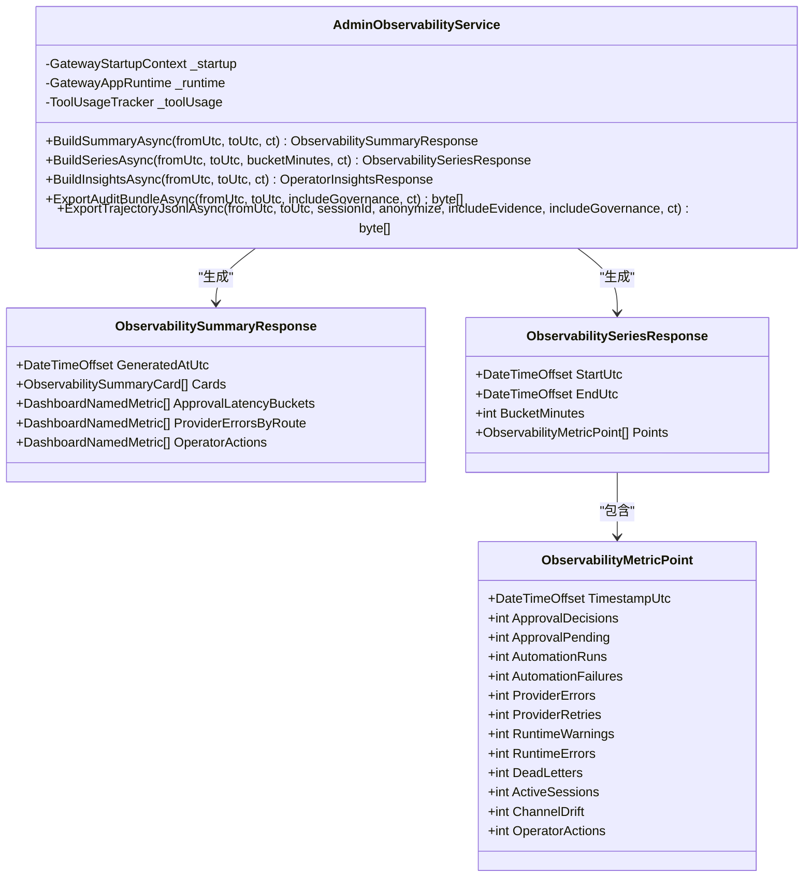
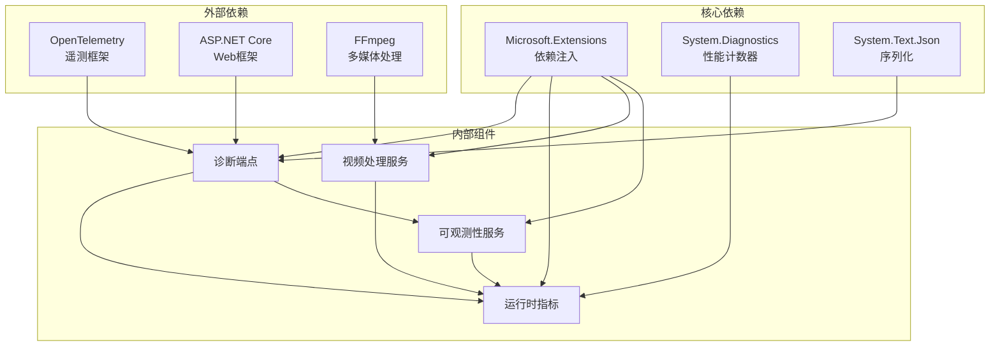

# 诊断监控接口

<cite>
**本文档引用的文件**
- [DiagnosticsEndpoints.cs](file://src/OpenClaw.Gateway/Endpoints/DiagnosticsEndpoints.cs)
- [AdminObservabilityService.cs](file://src/OpenClaw.Gateway/AdminObservabilityService.cs)
- [VideoFrameExtractionService.cs](file://src/OpenClaw.Gateway/VideoFrameExtractionService.cs)
- [MediaCacheStore.cs](file://src/OpenClaw.Gateway/MediaCacheStore.cs)
- [Telemetry.cs](file://src/OpenClaw.Core/Observability/Telemetry.cs)
- [RuntimeMetrics.cs](file://src/OpenClaw.Core/Observability/RuntimeMetrics.cs)
- [GatewayTelemetryExtensions.cs](file://src/OpenClaw.Gateway/Extensions/GatewayTelemetryExtensions.cs)
- [OperatorGovernanceModels.cs](file://src/OpenClaw.Core/Models/OperatorGovernanceModels.cs)
- [Program.cs](file://src/OpenClaw.Gateway/Program.cs)
- [GatewayAdminEndpointTests.cs](file://src/OpenClaw.Tests/GatewayAdminEndpointTests.cs)
</cite>

## 目录
1. [简介](#简介)
2. [项目结构](#项目结构)
3. [核心组件](#核心组件)
4. [架构概览](#架构概览)
5. [详细组件分析](#详细组件分析)
6. [依赖关系分析](#依赖关系分析)
7. [性能考虑](#性能考虑)
8. [故障排除指南](#故障排除指南)
9. [结论](#结论)

## 简介

诊断监控接口是 OpenClaw 系统的核心基础设施组件，负责提供全面的系统健康检查、性能监控和媒体处理能力。该接口体系涵盖了从基础的健康状态检测到复杂的运行时指标收集，从媒体文件处理到审计日志导出的完整监控解决方案。

系统通过多层监控架构实现了对整个平台运行状态的实时观测，包括但不限于：服务健康度、性能指标、资源使用情况、错误统计、会话管理、工具执行跟踪等关键监控维度。这些接口不仅为运维人员提供了强大的诊断工具，也为系统的自动化监控和告警机制奠定了坚实基础。

## 项目结构

诊断监控接口主要分布在以下核心模块中：



**图表来源**
- [DiagnosticsEndpoints.cs:18-66](file://src/OpenClaw.Gateway/Endpoints/DiagnosticsEndpoints.cs#L18-L66)
- [AdminObservabilityService.cs:16-53](file://src/OpenClaw.Gateway/AdminObservabilityService.cs#L16-L53)
- [VideoFrameExtractionService.cs:40-57](file://src/OpenClaw.Gateway/VideoFrameExtractionService.cs#L40-L57)

**章节来源**
- [DiagnosticsEndpoints.cs:18-194](file://src/OpenClaw.Gateway/Endpoints/DiagnosticsEndpoints.cs#L18-L194)
- [AdminObservabilityService.cs:16-115](file://src/OpenClaw.Gateway/AdminObservabilityService.cs#L16-L115)

## 核心组件

### 健康检查接口

健康检查接口提供了多层次的服务状态检测能力：

| 接口路径 | 方法 | 功能描述 | 认证要求 |
|---------|------|----------|----------|
| `/health` | GET | 完整健康检查，返回详细状态信息 | 需要操作员认证 |
| `/health/live` | GET | 进程存活探针，不泄露配置信息 | 无需认证 |
| `/health/ready` | GET | 就绪状态检查，验证会话管理器可用性 | 无需认证 |

### 性能监控接口

性能监控接口提供了丰富的指标收集和分析能力：

| 接口路径 | 方法 | 功能描述 | 认证要求 |
|---------|------|----------|----------|
| `/metrics` | GET | 运行时指标快照，包括请求计数、令牌使用等 | 需要操作员认证 |
| `/metrics/providers` | GET | 提供商使用情况统计 | 需要操作员认证 |
| `/metrics/tools` | GET | 工具调用频率和成功率统计 | 需要操作员认证 |
| `/admin/observability/summary` | GET | 运营可观测性摘要卡片 | 需要 admin.observability 权限 |
| `/admin/insights` | GET | 运营洞察报告 | 需要 admin.observability 权限 |

### 媒体处理接口

媒体处理接口专注于多媒体内容的分析和转换：

| 接口路径 | 方法 | 功能描述 | 认证要求 |
|---------|------|----------|----------|
| `/admin/media/video/extract-frames` | POST | 视频帧提取服务 | 需要 admin.media 权限 |
| `/admin/media/cache/{id}` | GET | 媒体缓存检索 | 需要 admin.media 权限 |

**章节来源**
- [DiagnosticsEndpoints.cs:32-191](file://src/OpenClaw.Gateway/Endpoints/DiagnosticsEndpoints.cs#L32-L191)
- [AdminObservabilityService.cs:224-244](file://src/OpenClaw.Gateway/AdminObservabilityService.cs#L224-L244)

## 架构概览

诊断监控接口采用分层架构设计，确保了高内聚低耦合的系统结构：



**图表来源**
- [DiagnosticsEndpoints.cs:32-66](file://src/OpenClaw.Gateway/Endpoints/DiagnosticsEndpoints.cs#L32-L66)
- [Program.cs:89-96](file://src/OpenClaw.Gateway/Program.cs#L89-L96)

系统架构的关键特点包括：

1. **多层认证机制**：支持操作员认证、CSRF保护和权限范围控制
2. **灵活的数据源**：整合内存状态、文件系统和外部服务
3. **可扩展的监控指标**：支持自定义指标和第三方集成
4. **安全的审计日志**：完整的操作记录和合规性支持

## 详细组件分析

### 运行时指标系统

运行时指标系统是诊断监控的核心组件，提供了细粒度的系统状态观测能力：



**图表来源**
- [RuntimeMetrics.cs:10-251](file://src/OpenClaw.Core/Observability/RuntimeMetrics.cs#L10-L251)
- [Telemetry.cs:9-53](file://src/OpenClaw.Core/Observability/Telemetry.cs#L9-L53)

#### 指标分类与用途

| 指标类别 | 关键指标 | 用途 | 监控阈值建议 |
|---------|----------|------|-------------|
| 请求处理 | TotalRequests, TotalLlmCalls | 系统吞吐量监控 | 根据业务需求设定基线 |
| 令牌使用 | TotalInputTokens, TotalOutputTokens | 成本控制和配额管理 | 设置使用率预警 |
| 工具执行 | TotalToolCalls, TotalToolFailures | 工具性能评估 | 失败率超过1%需关注 |
| 会话管理 | ActiveSessions, SessionEvictions | 资源使用效率 | 会话数峰值预警 |
| 错误统计 | TotalLlmErrors, TotalToolTimeouts | 系统稳定性评估 | 错误率异常波动 |

**章节来源**
- [RuntimeMetrics.cs:129-250](file://src/OpenClaw.Core/Observability/RuntimeMetrics.cs#L129-L250)
- [Telemetry.cs:28-52](file://src/OpenClaw.Core/Observability/Telemetry.cs#L28-L52)

### 视频帧提取服务

视频帧提取服务提供了强大的多媒体处理能力，支持多种输入格式和输出选项：



**图表来源**
- [VideoFrameExtractionService.cs:59-105](file://src/OpenClaw.Gateway/VideoFrameExtractionService.cs#L59-L105)

#### 媒体处理配置

| 配置项 | 默认值 | 描述 | 安全考虑 |
|-------|--------|------|---------|
| MaxFrames | 100 | 最大提取帧数 | 防止资源耗尽 |
| FrameIntervalSeconds | 1.0 | 帧提取间隔（秒） | 平衡质量和性能 |
| FrameWidth | 320 | 输出帧宽度（像素） | 控制存储空间 |
| MaxDurationSeconds | 3600 | 最大视频时长（秒） | 防止长时间处理 |
| FailureMode | strict | 处理失败时的行为模式 | 生产环境建议使用degrade |

**章节来源**
- [VideoFrameExtractionService.cs:107-221](file://src/OpenClaw.Gateway/VideoFrameExtractionService.cs#L107-L221)
- [MediaCacheStore.cs:16-40](file://src/OpenClaw.Gateway/MediaCacheStore.cs#L16-L40)

### 运营可观测性服务

运营可观测性服务提供了高级的监控和分析功能，支持复杂的数据聚合和可视化：



**图表来源**
- [AdminObservabilityService.cs:16-168](file://src/OpenClaw.Gateway/AdminObservabilityService.cs#L16-L168)
- [OperatorGovernanceModels.cs:327-433](file://src/OpenClaw.Core/Models/OperatorGovernanceModels.cs#L327-L433)

#### 数据聚合策略

运营可观测性服务采用多种数据聚合策略来提供全面的系统洞察：

| 聚合类型 | 数据源 | 聚合方法 | 应用场景 |
|---------|--------|----------|----------|
| 实时聚合 | 内存计数器 | 即时快照 | 实时监控面板 |
| 时间序列 | JSONL事件日志 | 分桶统计 | 趋势分析图表 |
| 维度过滤 | 审计日志 | 分组统计 | 用户行为分析 |
| 指标汇总 | 运行时状态 | 聚合计算 | KPI仪表板 |

**章节来源**
- [AdminObservabilityService.cs:170-227](file://src/OpenClaw.Gateway/AdminObservabilityService.cs#L170-L227)
- [OperatorGovernanceModels.cs:344-433](file://src/OpenClaw.Core/Models/OperatorGovernanceModels.cs#L344-L433)

## 依赖关系分析

诊断监控接口的依赖关系体现了清晰的分层架构：



**图表来源**
- [Program.cs:66-75](file://src/OpenClaw.Gateway/Program.cs#L66-L75)
- [GatewayTelemetryExtensions.cs:18-51](file://src/OpenClaw.Gateway/Extensions/GatewayTelemetryExtensions.cs#L18-L51)

### 关键依赖特性

1. **松耦合设计**：各组件通过接口和抽象类实现解耦
2. **可测试性**：支持单元测试和集成测试
3. **可扩展性**：支持插件化扩展和第三方集成
4. **安全性**：内置认证授权和数据脱敏机制

**章节来源**
- [Program.cs:89-96](file://src/OpenClaw.Gateway/Program.cs#L89-L96)
- [GatewayTelemetryExtensions.cs:33-50](file://src/OpenClaw.Gateway/Extensions/GatewayTelemetryExtensions.cs#L33-L50)

## 性能考虑

诊断监控接口在设计时充分考虑了性能优化和资源管理：

### 内存管理优化

- **零分配快照**：使用结构体进行指标快照，避免堆分配
- **异步I/O**：所有文件操作采用异步模式
- **流式处理**：大文件处理采用流式读取

### 并发处理优化

- **无锁数据结构**：使用原子操作保证线程安全
- **批量处理**：支持批量数据聚合和处理
- **连接池管理**：数据库和外部服务连接池优化

### 缓存策略

- **内存缓存**：热点数据缓存在内存中
- **磁盘缓存**：媒体文件和临时数据缓存
- **智能过期**：基于时间的自动清理机制

## 故障排除指南

### 常见问题诊断

| 问题类型 | 症状 | 可能原因 | 解决方案 |
|---------|------|----------|----------|
| 健康检查失败 | /health 返回503 | 会话管理器不可用 | 检查会话存储配置 |
| 指标缺失 | /metrics 返回空数据 | 指标收集器未初始化 | 验证遥测配置 |
| 视频处理失败 | 帧提取异常 | FFmpeg不可用或配置错误 | 检查FFmpeg安装和路径 |
| 权限拒绝 | 401/403错误 | 认证失败或权限不足 | 验证操作员凭据和权限范围 |

### 监控集成示例

#### Prometheus 集成配置

```yaml
# prometheus.yml
scrape_configs:
  - job_name: 'openclaw-gateway'
    static_configs:
      - targets: ['localhost:8080']
    metrics_path: '/metrics'
    scrape_interval: 15s
    bearer_token: 'YOUR_ADMIN_TOKEN'
```

#### 日志聚合配置

```json
{
  "Serilog": {
    "Using": ["Serilog.Sinks.Console", "Serilog.Sinks.File"],
    "MinimumLevel": {
      "Default": "Information",
      "Override": {
        "Microsoft": "Warning",
        "OpenClaw": "Debug"
      }
    },
    "WriteTo": [
      {"Name": "Console"},
      {"Name": "File", "Args": {"path": "/var/log/openclaw/gateway.log"}}
    ]
  }
}
```

#### 告警规则配置

```yaml
# alerting_rules.yml
groups:
  - name: OpenClaw Gateway
    rules:
      - alert: GatewayUnhealthy
        expr: gateway_health_status == 0
        for: 5m
        labels:
          severity: critical
        annotations:
          summary: "网关服务不可用"
          
      - alert: HighErrorRate
        expr: rate(gateway_error_total[5m]) > 0.1
        for: 10m
        labels:
          severity: warning
        annotations:
          summary: "错误率过高"
```

**章节来源**
- [GatewayAdminEndpointTests.cs:1199-1214](file://src/OpenClaw.Tests/GatewayAdminEndpointTests.cs#L1199-L1214)

## 结论

诊断监控接口为 OpenClaw 系统提供了全面、可靠的监控和诊断能力。通过多层次的健康检查、精细化的性能监控、强大的媒体处理能力和完善的审计功能，该接口体系确保了系统的稳定运行和高效运维。

系统的设计充分考虑了现代分布式系统的监控需求，支持与主流监控平台的集成，并提供了灵活的扩展机制。无论是日常运维还是紧急故障排查，诊断监控接口都能提供及时、准确的系统状态信息和深入的分析洞察。

未来的发展方向包括：增强机器学习驱动的异常检测、扩展更多的第三方监控集成、优化大规模部署下的性能表现，以及提供更加直观的可视化界面。这些改进将进一步提升系统的可观测性和可维护性。