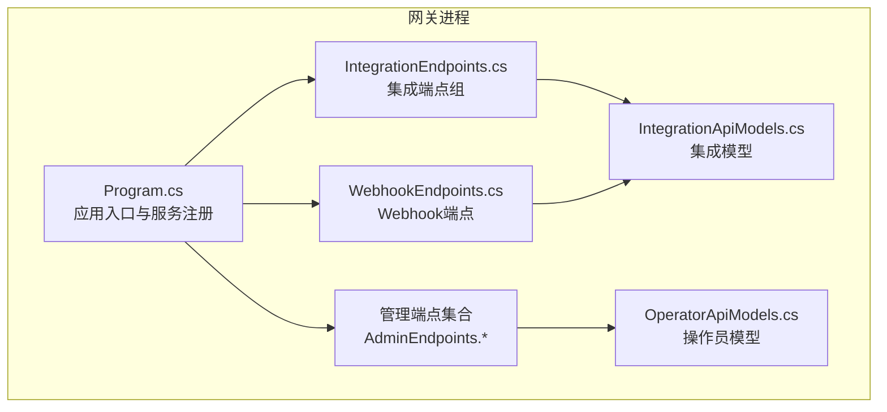
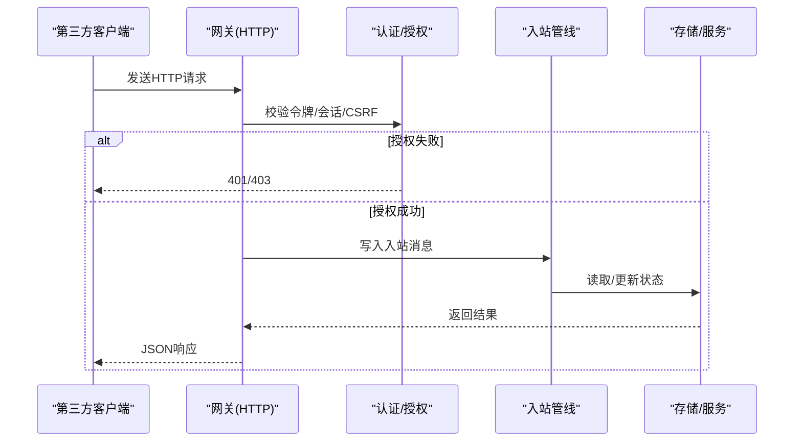
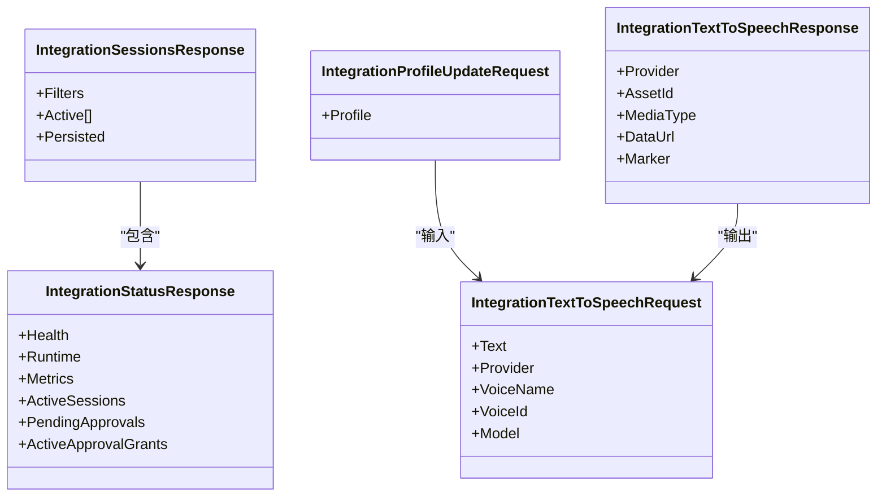
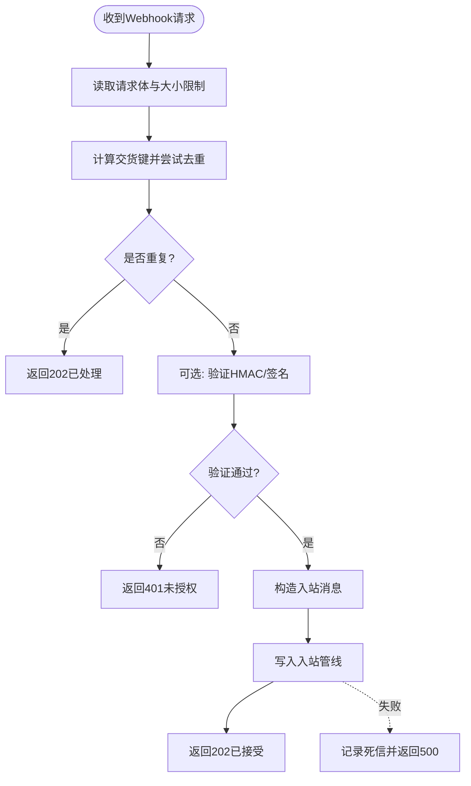
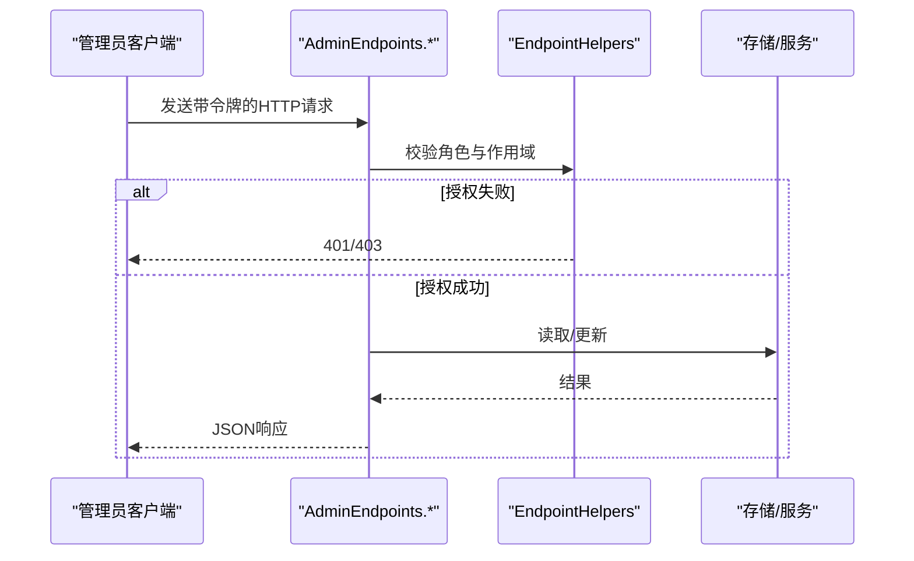
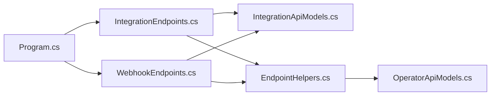

# 集成接口

<cite>
**本文档引用的文件**
- [IntegrationEndpoints.cs](file://src/OpenClaw.Gateway/Endpoints/IntegrationEndpoints.cs)
- [WebhookEndpoints.cs](file://src/OpenClaw.Gateway/Endpoints/WebhookEndpoints.cs)
- [IntegrationApiModels.cs](file://src/OpenClaw.Core/Models/IntegrationApiModels.cs)
- [OperatorApiModels.cs](file://src/OpenClaw.Core/Models/OperatorApiModels.cs)
- [EndpointHelpers.cs](file://src/OpenClaw.Gateway/Endpoints/EndpointHelpers.cs)
- [Program.cs](file://src/OpenClaw.Gateway/Program.cs)
- [AdminEndpoints.Auth.cs](file://src/OpenClaw.Gateway/Endpoints/AdminEndpoints.Auth.cs)
- [AdminEndpoints.ProfilesAndLearning.cs](file://src/OpenClaw.Gateway/Endpoints/AdminEndpoints.ProfilesAndLearning.cs)
- [AdminEndpoints.Memory.cs](file://src/OpenClaw.Gateway/Endpoints/AdminEndpoints.Memory.cs)
- [AdminEndpoints.Runtime.cs](file://src/OpenClaw.Gateway/Endpoints/AdminEndpoints.Runtime.cs)
- [GatewayConfig.cs](file://src/OpenClaw.Core/Models/GatewayConfig.cs)
- [WebhookEndpoints.cs（测试）](file://src/OpenClaw.Tests/GatewayAdminEndpointTests.cs)
</cite>

## 目录
1. [简介](#简介)
2. [项目结构](#项目结构)
3. [核心组件](#核心组件)
4. [架构总览](#架构总览)
5. [详细组件分析](#详细组件分析)
6. [依赖关系分析](#依赖关系分析)
7. [性能考虑](#性能考虑)
8. [故障排除指南](#故障排除指南)
9. [结论](#结论)
10. [附录](#附录)

## 简介
本文件面向需要与系统进行第三方集成的开发者，系统性梳理了集成接口的端点设计、认证授权机制、数据格式规范，并提供常见集成场景（webhook处理、批量数据导入导出、实时数据同步）的实现要点与最佳实践。所有接口均基于统一的HTTP REST风格，采用强类型模型并通过源生成的JSON上下文进行序列化，确保在AOT环境下的兼容性。

## 项目结构
系统通过网关进程对外暴露集成接口，主要由以下模块组成：
- 网关启动与服务注册：负责加载配置、构建服务容器、注册中间件与端点映射。
- 集成端点组：提供面向第三方的只读查询与受控变更接口。
- Webhook端点：接收来自外部渠道的消息推送，完成去重、签名验证与入站消息投递。
- 管理端点：提供配置、认证、学习与内存等后台管理能力，供管理员使用。
- 模型与上下文：定义统一的请求/响应模型及JSON序列化上下文。

**图表来源**
- [Program.cs:1-124](file://src/OpenClaw.Gateway/Program.cs#L1-L124)
- [IntegrationEndpoints.cs:1-955](file://src/OpenClaw.Gateway/Endpoints/IntegrationEndpoints.cs#L1-L955)
- [WebhookEndpoints.cs:1-723](file://src/OpenClaw.Gateway/Endpoints/WebhookEndpoints.cs#L1-L723)
- [IntegrationApiModels.cs:1-203](file://src/OpenClaw.Core/Models/IntegrationApiModels.cs#L1-L203)
- [OperatorApiModels.cs:1-770](file://src/OpenClaw.Core/Models/OperatorApiModels.cs#L1-L770)

**章节来源**
- [Program.cs:1-124](file://src/OpenClaw.Gateway/Program.cs#L1-L124)

## 核心组件
- 集成端点组（/api/integration）
  - 提供仪表盘、状态查询、审批与审批历史、提供商与插件、兼容性目录与导出、操作员审计、会话与时间线、资料档案、文本转语音、工具预设、工作流与自动化等接口。
  - 所有接口均需通过操作员认证与授权，支持CSRF保护与速率限制。
- Webhook端点
  - 支持Twilio短信、Telegram、WhatsApp、Teams、Discord、Slack、通用webhook以及Gmail Pub/Sub等。
  - 具备幂等键/交货键去重、可选HMAC/签名验证、失败死信记录与重放能力。
- 管理端点（/admin）
  - 提供资料档案的导出/导入、学习提案管理、内存结构化访问、运行时事件查询、提供商策略与模型配置等。
  - 严格区分不同作用域的权限，如admin.profiles、admin.learning、admin.memory等。

**章节来源**
- [IntegrationEndpoints.cs:1-955](file://src/OpenClaw.Gateway/Endpoints/IntegrationEndpoints.cs#L1-L955)
- [WebhookEndpoints.cs:1-723](file://src/OpenClaw.Gateway/Endpoints/WebhookEndpoints.cs#L1-L723)
- [AdminEndpoints.ProfilesAndLearning.cs:1-501](file://src/OpenClaw.Gateway/Endpoints/AdminEndpoints.ProfilesAndLearning.cs#L1-L501)
- [AdminEndpoints.Memory.cs:1-856](file://src/OpenClaw.Gateway/Endpoints/AdminEndpoints.Memory.cs#L1-L856)

## 架构总览
系统采用“网关+管道”的架构模式：
- 网关负责HTTP接入、认证授权、请求路由与错误处理。
- 管道负责将入站消息写入内部处理管线，触发后续的工具执行、自动化或工作流处理。
- Webhook层对上游平台的回调进行标准化处理，保证幂等与安全。

**图表来源**
- [IntegrationEndpoints.cs:889-912](file://src/OpenClaw.Gateway/Endpoints/IntegrationEndpoints.cs#L889-L912)
- [EndpointHelpers.cs:74-206](file://src/OpenClaw.Gateway/Endpoints/EndpointHelpers.cs#L74-L206)

## 详细组件分析

### 集成端点组（/api/integration）
- 路由前缀：/api/integration
- 主要功能：
  - 仪表盘与状态：聚合健康、运行时状态、指标、活动会话数、待审批数等。
  - 审批与审批历史：查询当前待审批项与历史记录。
  - 提供商与插件：列出可用的模型提供商路由、使用统计、策略与最近对话。
  - 兼容性目录与导出：查询兼容性目录与导出当前运行态的安全姿态。
  - 操作员审计：按条件查询操作员审计日志。
  - 会话与时间线：分页查询会话列表、获取会话详情与时间线。
  - 资料档案：列出/查询用户档案，支持更新。
  - 文本转语音：将文本合成语音资产。
  - 工具预设与工作流：列出工具预设；运行/查询工作流执行。
  - 自动化：列出/查询自动化定义、运行与重放。
  - 运行时事件：查询系统运行事件。
  - 支付：查询支付设置状态、资金来源，发放虚拟卡与执行机器支付。

- 认证与授权：
  - 使用操作员令牌或浏览器会话认证。
  - 不同端点具有不同的作用域要求，如integration.read、integration.mutate等。
  - 支持CSRF保护与速率限制消费。

- 数据格式：
  - 统一使用JSON，响应模型在IntegrationApiModels.cs中定义。
  - 请求体采用强类型模型，错误响应统一为OperationStatusResponse/MutationResponse。

**图表来源**
- [IntegrationApiModels.cs:3-203](file://src/OpenClaw.Core/Models/IntegrationApiModels.cs#L3-L203)

**章节来源**
- [IntegrationEndpoints.cs:1-955](file://src/OpenClaw.Gateway/Endpoints/IntegrationEndpoints.cs#L1-L955)
- [IntegrationApiModels.cs:1-203](file://src/OpenClaw.Core/Models/IntegrationApiModels.cs#L1-L203)
- [OperatorApiModels.cs:7-13](file://src/OpenClaw.Core/Models/OperatorApiModels.cs#L7-L13)

### Webhook端点
- 通用Webhook（/webhooks/{name}）
  - 支持自定义端点名称与配置，具备HMAC签名验证、请求体长度限制、幂等键去重。
  - 成功返回202 Accepted，重复请求返回“已处理”提示。
- 平台专用Webhook
  - Telegram：支持密钥签名验证，解析交货键，失败进入死信队列。
  - WhatsApp：支持消息ID/状态ID作为交货键，避免重复处理。
  - Teams/Discord/Slack：分别验证平台签名，支持URL验证与命令鉴权。
  - Twilio SMS：表单内容校验与签名验证，支持重复检测。
  - Gmail Pub/Sub：共享密钥验证，支持订阅推送。

**图表来源**
- [WebhookEndpoints.cs:543-632](file://src/OpenClaw.Gateway/Endpoints/WebhookEndpoints.cs#L543-L632)
- [WebhookEndpoints.cs:104-194](file://src/OpenClaw.Gateway/Endpoints/WebhookEndpoints.cs#L104-L194)
- [WebhookEndpoints.cs:196-266](file://src/OpenClaw.Gateway/Endpoints/WebhookEndpoints.cs#L196-L266)
- [WebhookEndpoints.cs:268-318](file://src/OpenClaw.Gateway/Endpoints/WebhookEndpoints.cs#L268-L318)
- [WebhookEndpoints.cs:320-378](file://src/OpenClaw.Gateway/Endpoints/WebhookEndpoints.cs#L320-L378)
- [WebhookEndpoints.cs:380-541](file://src/OpenClaw.Gateway/Endpoints/WebhookEndpoints.cs#L380-L541)
- [WebhookEndpoints.cs:543-632](file://src/OpenClaw.Gateway/Endpoints/WebhookEndpoints.cs#L543-L632)
- [WebhookEndpoints.cs:634-672](file://src/OpenClaw.Gateway/Endpoints/WebhookEndpoints.cs#L634-L672)

**章节来源**
- [WebhookEndpoints.cs:1-723](file://src/OpenClaw.Gateway/Endpoints/WebhookEndpoints.cs#L1-L723)
- [GatewayConfig.cs:719-745](file://src/OpenClaw.Core/Models/GatewayConfig.cs#L719-L745)

### 管理端点（/admin）
- 资料档案
  - 导出/导入：支持按actorId筛选，包含档案与学习提案。
  - 查询/更新：支持按actorId查询与更新。
- 学习提案
  - 列表、详情、批准/拒绝/回滚等治理流程。
- 内存（结构化）
  - 状态查询、搜索、打开、导出、最近条目、校验、索引刷新、手办创建等。
- 运行时与提供商
  - 提供商路由健康、使用统计、策略、模型配置与评估。
- 认证
  - 操作员令牌交换、会话管理、注销等。

**图表来源**
- [AdminEndpoints.ProfilesAndLearning.cs:40-154](file://src/OpenClaw.Gateway/Endpoints/AdminEndpoints.ProfilesAndLearning.cs#L40-L154)
- [AdminEndpoints.Memory.cs:197-200](file://src/OpenClaw.Gateway/Endpoints/AdminEndpoints.Memory.cs#L197-L200)
- [AdminEndpoints.Auth.cs:120-178](file://src/OpenClaw.Gateway/Endpoints/AdminEndpoints.Auth.cs#L120-L178)
- [EndpointHelpers.cs:74-206](file://src/OpenClaw.Gateway/Endpoints/EndpointHelpers.cs#L74-L206)

**章节来源**
- [AdminEndpoints.ProfilesAndLearning.cs:1-501](file://src/OpenClaw.Gateway/Endpoints/AdminEndpoints.ProfilesAndLearning.cs#L1-L501)
- [AdminEndpoints.Memory.cs:1-856](file://src/OpenClaw.Gateway/Endpoints/AdminEndpoints.Memory.cs#L1-L856)
- [AdminEndpoints.Auth.cs:120-178](file://src/OpenClaw.Gateway/Endpoints/AdminEndpoints.Auth.cs#L120-L178)

## 依赖关系分析
- 网关启动与端点映射
  - Program.cs负责服务注册、中间件与端点映射，确保在生产环境启用可观测性与AOT友好配置。
- 认证与授权
  - EndpointHelpers提供统一的认证流程，支持多种认证模式（账户令牌、浏览器会话、引导令牌），并支持IP/会话/账户级速率限制。
- 模型与序列化
  - 所有请求/响应模型通过CoreJsonContext/PaymentJsonContext等源生成上下文进行序列化，确保AOT兼容与属性命名一致性（camelCase）。

**图表来源**
- [Program.cs:1-124](file://src/OpenClaw.Gateway/Program.cs#L1-L124)
- [IntegrationEndpoints.cs:1-955](file://src/OpenClaw.Gateway/Endpoints/IntegrationEndpoints.cs#L1-L955)
- [WebhookEndpoints.cs:1-723](file://src/OpenClaw.Gateway/Endpoints/WebhookEndpoints.cs#L1-L723)
- [EndpointHelpers.cs:74-206](file://src/OpenClaw.Gateway/Endpoints/EndpointHelpers.cs#L74-L206)
- [IntegrationApiModels.cs:1-203](file://src/OpenClaw.Core/Models/IntegrationApiModels.cs#L1-L203)
- [OperatorApiModels.cs:1-770](file://src/OpenClaw.Core/Models/OperatorApiModels.cs#L1-L770)

**章节来源**
- [Program.cs:1-124](file://src/OpenClaw.Gateway/Program.cs#L1-L124)
- [EndpointHelpers.cs:74-206](file://src/OpenClaw.Gateway/Endpoints/EndpointHelpers.cs#L74-L206)

## 性能考虑
- 响应模型采用源生成JSON上下文，减少反射开销，提升序列化/反序列化性能。
- Webhook端点对请求体大小进行限制，避免过大负载影响系统稳定性。
- 会话与自动化查询支持分页与条件过滤，建议合理设置limit与筛选参数以控制响应体积。
- 幂等去重与死信队列降低重复处理与失败重试带来的压力。

## 故障排除指南
- 401 未授权
  - 检查操作员令牌是否正确传递，确认组织策略允许的认证模式。
- 403 禁止访问
  - 确认操作员角色具备相应的作用域权限（如integration.read、integration.mutate）。
- 413 请求体过大
  - 减小请求体或调整通道配置中的MaxRequestBytes。
- 202 已接受/重复
  - 对于Webhook，若返回“已处理”，表示幂等键命中；对于通用webhook，检查Idempotency-Key或X-OpenClaw-Delivery-Id。
- 死信与重放
  - 通过/admin/webhooks/dead-letter查看死信记录，使用/replay接口重放消息。

**章节来源**
- [IntegrationEndpoints.cs:883-887](file://src/OpenClaw.Gateway/Endpoints/IntegrationEndpoints.cs#L883-L887)
- [WebhookEndpoints.cs:566-577](file://src/OpenClaw.Gateway/Endpoints/WebhookEndpoints.cs#L566-L577)
- [AdminEndpoints.Runtime.cs:387-413](file://src/OpenClaw.Gateway/Endpoints/AdminEndpoints.Runtime.cs#L387-L413)

## 结论
系统提供了完整、安全且高性能的集成接口体系，覆盖第三方系统的账户管理、后端服务集成与数据同步需求。通过统一的认证授权、严格的模型约束与AOT友好的序列化方案，确保在复杂生产环境中稳定运行。建议在集成过程中优先采用Webhook的幂等与签名验证机制，并结合死信与重放能力完善异常处理流程。

## 附录

### 认证方式与作用域
- 认证模式
  - 账户令牌：通过/admin/auth/operator-token换取操作员令牌。
  - 浏览器会话：基于Cookie的会话认证。
  - 引导令牌：用于初始配置阶段的临时认证。
- 作用域
  - integration.read/integration.mutate：读写集成接口。
  - admin.profiles/admin.learning/admin.memory等：后台管理接口。

**章节来源**
- [AdminEndpoints.Auth.cs:120-178](file://src/OpenClaw.Gateway/Endpoints/AdminEndpoints.Auth.cs#L120-L178)
- [EndpointHelpers.cs:74-206](file://src/OpenClaw.Gateway/Endpoints/EndpointHelpers.cs#L74-L206)

### 数据格式规范
- 统一使用JSON，属性名采用camelCase。
- 错误响应统一为OperationStatusResponse或MutationResponse。
- 集成模型定义集中在IntegrationApiModels.cs，管理模型定义在OperatorApiModels.cs。

**章节来源**
- [IntegrationApiModels.cs:1-203](file://src/OpenClaw.Core/Models/IntegrationApiModels.cs#L1-L203)
- [OperatorApiModels.cs:1-770](file://src/OpenClaw.Core/Models/OperatorApiModels.cs#L1-L770)

### 常见集成场景实现要点
- Webhook处理
  - 选择对应平台的Webhook路径，配置签名验证与最大请求字节。
  - 使用Idempotency-Key或X-OpenClaw-Delivery-Id实现幂等。
  - 监控/admin/webhooks/dead-letter，定期重放失败消息。
- 批量数据导入导出
  - 使用/admin/profiles/export按actorId导出，再通过/admin/profiles/import导入目标实例。
  - 可扩展至记忆与自动化等资源的导出/导入。
- 实时数据同步
  - 通过/admin/runtime-events查询运行事件，结合会话与自动化接口实现状态同步。

**章节来源**
- [WebhookEndpoints.cs:543-632](file://src/OpenClaw.Gateway/Endpoints/WebhookEndpoints.cs#L543-L632)
- [AdminEndpoints.ProfilesAndLearning.cs:52-154](file://src/OpenClaw.Gateway/Endpoints/AdminEndpoints.ProfilesAndLearning.cs#L52-L154)
- [AdminEndpoints.Runtime.cs:636-664](file://src/OpenClaw.Gateway/Endpoints/AdminEndpoints.Runtime.cs#L636-L664)