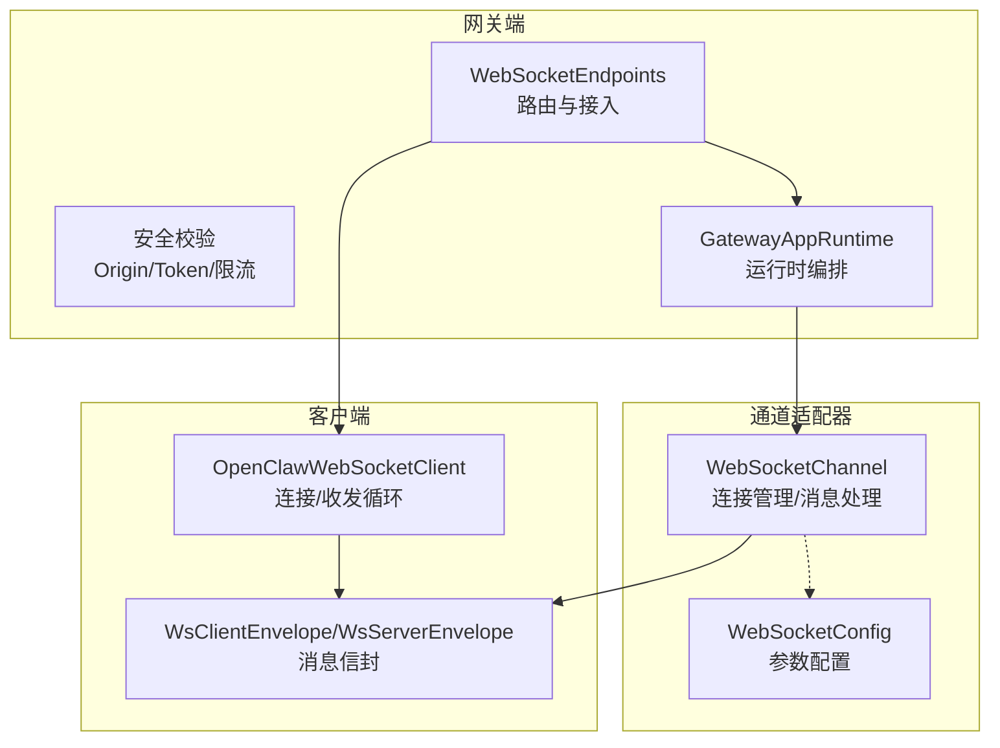
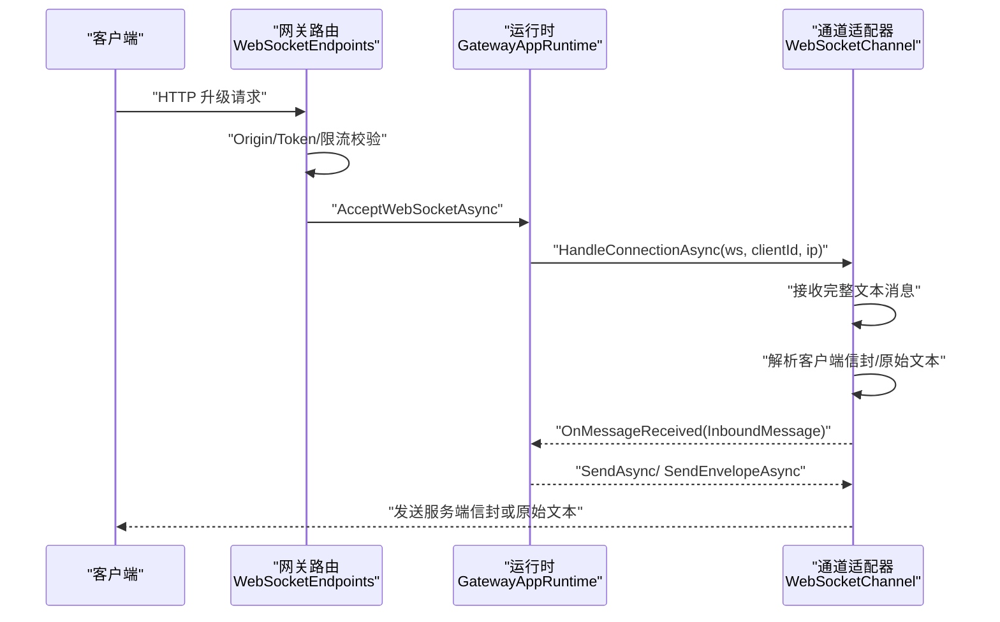
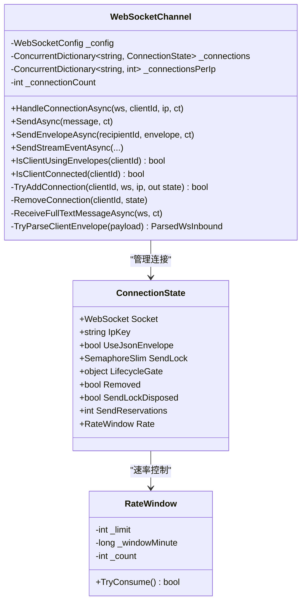
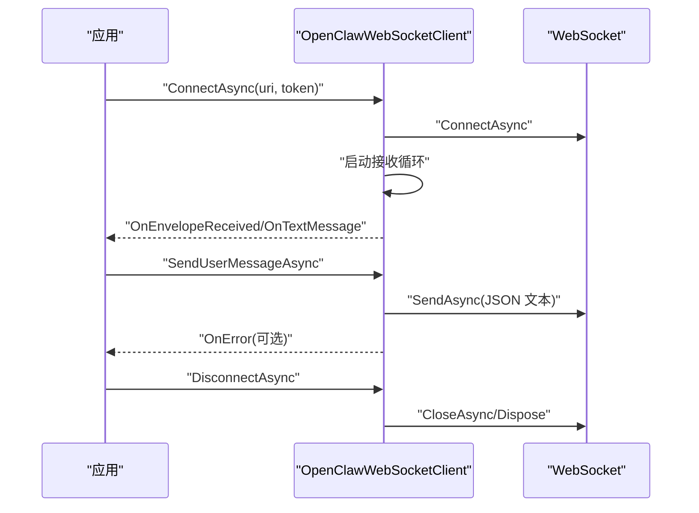
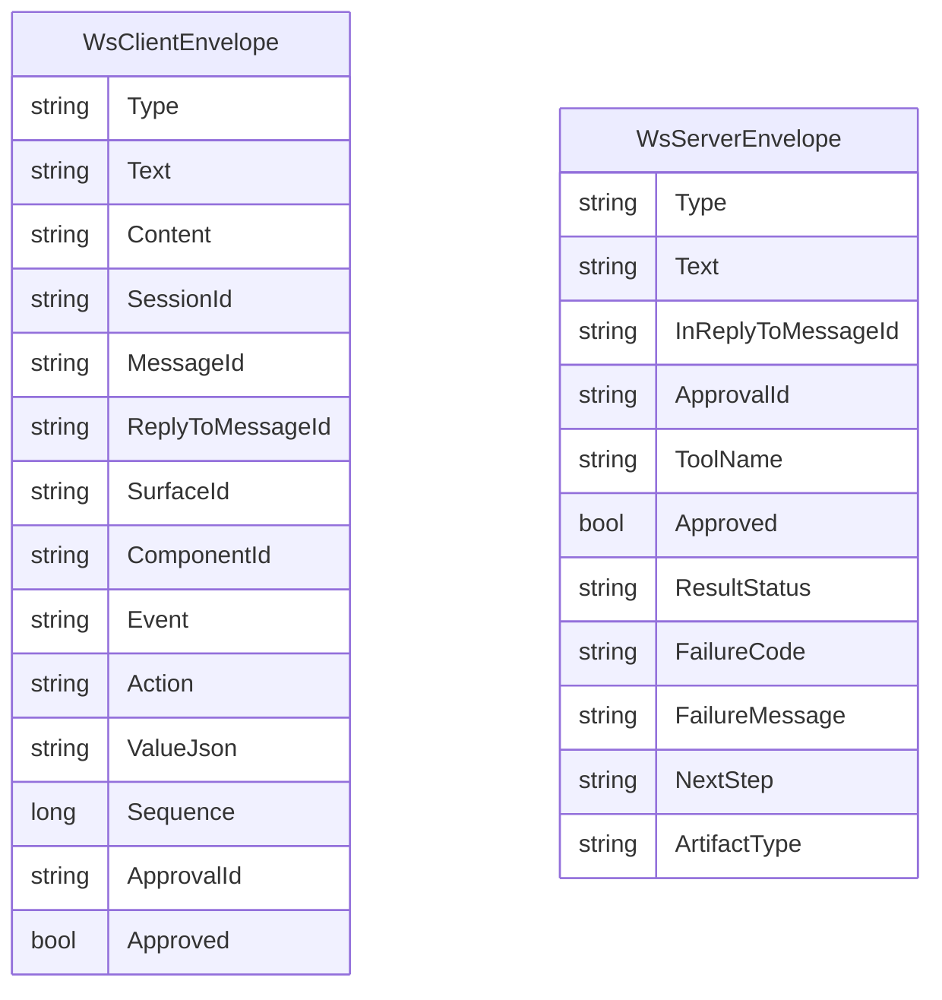
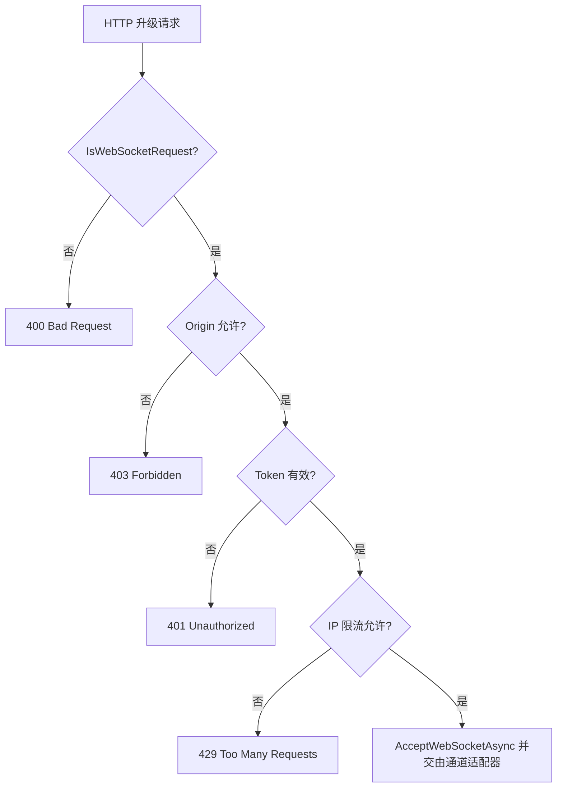
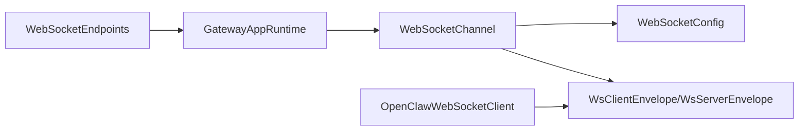

# WebSocket 实时通信

<cite>
**本文档引用的文件**
- [WebSocketChannel.cs](file://src/OpenClaw.Channels/WebSocketChannel.cs)
- [OpenClawWebSocketClient.cs](file://src/OpenClaw.Client/OpenClawWebSocketClient.cs)
- [WebSocketEnvelopes.cs](file://src/OpenClaw.Core/Models/WebSocketEnvelopes.cs)
- [WebSocketEndpoints.cs](file://src/OpenClaw.Gateway/Endpoints/WebSocketEndpoints.cs)
- [GatewayConfig.cs](file://src/OpenClaw.Core/Models/GatewayConfig.cs)
- [GatewayAppRuntime.cs](file://src/OpenClaw.Gateway/Composition/GatewayAppRuntime.cs)
- [WebSocketChannelTests.cs](file://src/OpenClaw.Tests/WebSocketChannelTests.cs)
- [OpenClawWebSocketClientTests.cs](file://src/OpenClaw.Tests/OpenClawWebSocketClientTests.cs)
</cite>

## 目录
1. [简介](#简介)
2. [项目结构](#项目结构)
3. [核心组件](#核心组件)
4. [架构总览](#架构总览)
5. [详细组件分析](#详细组件分析)
6. [依赖关系分析](#依赖关系分析)
7. [性能考虑](#性能考虑)
8. [故障排除指南](#故障排除指南)
9. [结论](#结论)
10. [附录](#附录)

## 简介
本文件系统性阐述本项目的 WebSocket 实时通信实现，覆盖连接建立、消息协议、双向通信机制、入站消息处理工作线程、出站消息投递、消息队列管理、连接状态维护、消息格式规范、事件类型定义、错误处理策略与连接重连机制，并提供客户端连接示例、消息处理代码路径与性能优化建议。

## 项目结构
WebSocket 相关实现分布在以下模块：
- 网关端：HTTP 路由映射、安全校验、连接接入与运行时编排
- 通道适配器：WebSocket 连接生命周期、消息解析与路由、速率限制与并发控制
- 客户端：WebSocket 客户端封装、发送/接收循环、事件回调
- 模型：消息信封（客户端/服务端）数据契约
- 配置：连接上限、速率限制、消息大小、接收超时等参数

**图表来源**
- [WebSocketEndpoints.cs:13-61](file://src/OpenClaw.Gateway/Endpoints/WebSocketEndpoints.cs#L13-L61)
- [GatewayAppRuntime.cs:21-63](file://src/OpenClaw.Gateway/Composition/GatewayAppRuntime.cs#L21-L63)
- [WebSocketChannel.cs:16-74](file://src/OpenClaw.Channels/WebSocketChannel.cs#L16-L74)
- [OpenClawWebSocketClient.cs:9-37](file://src/OpenClaw.Client/OpenClawWebSocketClient.cs#L9-L37)
- [GatewayConfig.cs:386-393](file://src/OpenClaw.Core/Models/GatewayConfig.cs#L386-L393)

**章节来源**
- [WebSocketEndpoints.cs:13-61](file://src/OpenClaw.Gateway/Endpoints/WebSocketEndpoints.cs#L13-L61)
- [GatewayAppRuntime.cs:21-63](file://src/OpenClaw.Gateway/Composition/GatewayAppRuntime.cs#L21-L63)
- [WebSocketChannel.cs:16-74](file://src/OpenClaw.Channels/WebSocketChannel.cs#L16-L74)
- [OpenClawWebSocketClient.cs:9-37](file://src/OpenClaw.Client/OpenClawWebSocketClient.cs#L9-L37)
- [GatewayConfig.cs:386-393](file://src/OpenClaw.Core/Models/GatewayConfig.cs#L386-L393)

## 核心组件
- WebSocketChannel：负责连接接入、入站消息解析与路由、出站消息投递、速率限制、并发发送控制、连接状态维护与清理。
- OpenClawWebSocketClient：负责客户端连接、发送/接收循环、事件回调、断开与资源释放。
- WebSocketEnvelopes：定义客户端与服务端消息信封的数据结构，支持 JSON 包裹模式与原始文本模式。
- WebSocketEndpoints：在 Kestrel 上映射 WebSocket 路由，执行 Origin/Token/限流校验后接入通道适配器。
- GatewayConfig：提供 WebSocket 连接相关配置项（最大消息字节、最大连接数、每 IP 最大连接数、每连接每分钟消息数、接收超时）。

**章节来源**
- [WebSocketChannel.cs:16-74](file://src/OpenClaw.Channels/WebSocketChannel.cs#L16-L74)
- [OpenClawWebSocketClient.cs:9-37](file://src/OpenClaw.Client/OpenClawWebSocketClient.cs#L9-L37)
- [WebSocketEnvelopes.cs:7-108](file://src/OpenClaw.Core/Models/WebSocketEnvelopes.cs#L7-L108)
- [WebSocketEndpoints.cs:13-61](file://src/OpenClaw.Gateway/Endpoints/WebSocketEndpoints.cs#L13-L61)
- [GatewayConfig.cs:386-393](file://src/OpenClaw.Core/Models/GatewayConfig.cs#L386-L393)

## 架构总览
WebSocket 实时通信采用“网关路由 → 运行时编排 → 通道适配器”的分层设计。客户端通过 HTTP 升级为 WebSocket，网关进行安全与限流校验后交由通道适配器处理；通道适配器将入站消息转换为统一的 InboundMessage 并触发事件，出站消息按 RecipientId 投递给对应连接。

**图表来源**
- [WebSocketEndpoints.cs:18-26](file://src/OpenClaw.Gateway/Endpoints/WebSocketEndpoints.cs#L18-L26)
- [GatewayAppRuntime.cs](file://src/OpenClaw.Gateway/Composition/GatewayAppRuntime.cs#L27)
- [WebSocketChannel.cs:76-151](file://src/OpenClaw.Channels/WebSocketChannel.cs#L76-L151)
- [WebSocketEnvelopes.cs:7-108](file://src/OpenClaw.Core/Models/WebSocketEnvelopes.cs#L7-L108)

## 详细组件分析

### 通道适配器：WebSocketChannel
- 连接建立与接入
  - 接受来自 Kestrel 的 WebSocket 连接，分配 clientId 与远端 IP，初始化连接状态。
  - 支持每 IP 连接数限制与全局连接数限制。
- 入站消息处理
  - 循环接收消息，支持分片重组与超时控制。
  - 解析客户端信封（JSON 模式），识别 Canvas/A2UI 交互事件；若非 JSON 则按原始文本处理。
  - 触发 OnMessageReceived 事件，构建 InboundMessage（包含会话、消息 ID、回复关系、Canvas 字段等）。
- 出站消息投递
  - 按 RecipientId 查找连接状态，序列化为服务端信封或原始文本。
  - 使用 SendLock 保证单连接内串行发送，避免交错。
  - 提供 SendStreamEventAsync 支持 JSON 包裹模式下的流式事件推送。
- 速率限制与并发控制
  - 基于时间窗口的每连接每分钟消息计数，超过阈值可返回错误信封并关闭连接。
  - 发送预留与生命周期门控，确保连接移除时不会遗留未完成发送。
- 错误处理与连接清理
  - 对异常（取消、对象已释放、WebSocket 异常、无效操作）进行捕获与降级处理。
  - 正常关闭与异常关闭均进行资源释放与统计更新。

**图表来源**
- [WebSocketChannel.cs:16-74](file://src/OpenClaw.Channels/WebSocketChannel.cs#L16-L74)
- [WebSocketChannel.cs:23-65](file://src/OpenClaw.Channels/WebSocketChannel.cs#L23-L65)

**章节来源**
- [WebSocketChannel.cs:76-151](file://src/OpenClaw.Channels/WebSocketChannel.cs#L76-L151)
- [WebSocketChannel.cs:153-190](file://src/OpenClaw.Channels/WebSocketChannel.cs#L153-L190)
- [WebSocketChannel.cs:247-296](file://src/OpenClaw.Channels/WebSocketChannel.cs#L247-L296)
- [WebSocketChannel.cs:334-381](file://src/OpenClaw.Channels/WebSocketChannel.cs#L334-L381)
- [WebSocketChannel.cs:435-510](file://src/OpenClaw.Channels/WebSocketChannel.cs#L435-L510)
- [WebSocketChannel.cs:523-587](file://src/OpenClaw.Channels/WebSocketChannel.cs#L523-L587)

### 客户端：OpenClawWebSocketClient
- 连接管理
  - 支持设置 Bearer Token 请求头，连接成功后启动接收循环。
  - 断开流程确保发送锁释放、接收任务取消与资源回收。
- 发送与接收
  - 发送前序列化为 JSON 字节，检查最大消息大小。
  - 接收循环聚合分片消息，优先尝试解析为服务端信封，否则以原始文本回调。
- 事件模型
  - OnTextMessage：原始文本回调
  - OnEnvelopeReceived：服务端信封回调
  - OnError：异常回调（不影响接收循环继续）

**图表来源**
- [OpenClawWebSocketClient.cs:38-57](file://src/OpenClaw.Client/OpenClawWebSocketClient.cs#L38-L57)
- [OpenClawWebSocketClient.cs:119-156](file://src/OpenClaw.Client/OpenClawWebSocketClient.cs#L119-L156)
- [OpenClawWebSocketClient.cs:158-227](file://src/OpenClaw.Client/OpenClawWebSocketClient.cs#L158-L227)

**章节来源**
- [OpenClawWebSocketClient.cs:38-117](file://src/OpenClaw.Client/OpenClawWebSocketClient.cs#L38-L117)
- [OpenClawWebSocketClient.cs:119-156](file://src/OpenClaw.Client/OpenClawWebSocketClient.cs#L119-L156)
- [OpenClawWebSocketClient.cs:158-227](file://src/OpenClaw.Client/OpenClawWebSocketClient.cs#L158-L227)

### 消息协议与事件类型
- 客户端信封（WsClientEnvelope）
  - 支持多种类型：用户消息、工具审批决策、Canvas/A2UI 事件与动作等。
  - 关键字段：Type、Text/Content、SessionId、MessageId、ReplyToMessageId、Canvas 相关字段（SurfaceId、ComponentId、Event/Action、ValueJson、Sequence）等。
- 服务端信封（WsServerEnvelope）
  - 支持工具审批请求/状态、流式事件、技能阶段门事件、工件交付等扩展字段。
  - 关键字段：Type、Text、InReplyToMessageId、Approval 相关字段、Artifact/StageGate 等。

**图表来源**
- [WebSocketEnvelopes.cs:7-48](file://src/OpenClaw.Core/Models/WebSocketEnvelopes.cs#L7-L48)
- [WebSocketEnvelopes.cs:53-108](file://src/OpenClaw.Core/Models/WebSocketEnvelopes.cs#L53-L108)

**章节来源**
- [WebSocketEnvelopes.cs:7-108](file://src/OpenClaw.Core/Models/WebSocketEnvelopes.cs#L7-L108)

### 网关路由与安全校验
- 路由映射
  - /ws：标准 WebSocket 控制面
  - /ws/live：直播会话桥接（额外打开请求解析与错误回传）
- 安全校验
  - Origin 白名单校验
  - Token 校验（Bootstrap Token 或 Operator Account Token）
  - IP 级限流桶（websocket/websocket_live）
- 运行时接入
  - 将 WebSocket 交由 GatewayAppRuntime 中的 WebSocketChannel 处理

**图表来源**
- [WebSocketEndpoints.cs:18-61](file://src/OpenClaw.Gateway/Endpoints/WebSocketEndpoints.cs#L18-L61)
- [WebSocketEndpoints.cs:63-149](file://src/OpenClaw.Gateway/Endpoints/WebSocketEndpoints.cs#L63-L149)

**章节来源**
- [WebSocketEndpoints.cs:13-61](file://src/OpenClaw.Gateway/Endpoints/WebSocketEndpoints.cs#L13-L61)
- [WebSocketEndpoints.cs:63-149](file://src/OpenClaw.Gateway/Endpoints/WebSocketEndpoints.cs#L63-L149)

## 依赖关系分析
- 组件耦合
  - WebSocketEndpoints 依赖 GatewayAppRuntime 注入的 WebSocketChannel。
  - WebSocketChannel 依赖 WebSocketConfig 进行参数控制。
  - 客户端与服务端共享消息信封模型（WsClientEnvelope/WsServerEnvelope）。
- 外部依赖
  - System.Net.WebSockets（.NET 内置）
  - System.Text.Json（序列化/反序列化）
  - System.Buffers（缓冲池复用）

**图表来源**
- [GatewayAppRuntime.cs](file://src/OpenClaw.Gateway/Composition/GatewayAppRuntime.cs#L27)
- [WebSocketChannel.cs:18-67](file://src/OpenClaw.Channels/WebSocketChannel.cs#L18-L67)
- [GatewayConfig.cs:386-393](file://src/OpenClaw.Core/Models/GatewayConfig.cs#L386-L393)
- [WebSocketEnvelopes.cs:7-108](file://src/OpenClaw.Core/Models/WebSocketEnvelopes.cs#L7-L108)
- [OpenClawWebSocketClient.cs:11-5](file://src/OpenClaw.Client/OpenClawWebSocketClient.cs#L11-L5)

**章节来源**
- [GatewayAppRuntime.cs:21-63](file://src/OpenClaw.Gateway/Composition/GatewayAppRuntime.cs#L21-L63)
- [WebSocketChannel.cs:16-74](file://src/OpenClaw.Channels/WebSocketChannel.cs#L16-L74)
- [GatewayConfig.cs:386-393](file://src/OpenClaw.Core/Models/GatewayConfig.cs#L386-L393)
- [WebSocketEnvelopes.cs:7-108](file://src/OpenClaw.Core/Models/WebSocketEnvelopes.cs#L7-L108)
- [OpenClawWebSocketClient.cs:9-37](file://src/OpenClaw.Client/OpenClawWebSocketClient.cs#L9-L37)

## 性能考虑
- 缓冲与内存复用
  - 使用 ArrayPool<byte> 与 ArrayBufferWriter<byte> 降低 GC 压力。
- 发送并发控制
  - 每连接使用 SemaphoreSlim 串行发送，避免竞争与交错。
  - 发送预留与生命周期门控，防止连接移除时悬挂发送。
- 速率限制
  - 基于时间窗口的每连接每分钟计数，防止过载。
- 消息大小与超时
  - 可配置最大消息字节数与接收超时，避免内存膨胀与阻塞。
- 连接数量控制
  - 全局连接数与每 IP 连接数限制，防止资源耗尽。

**章节来源**
- [WebSocketChannel.cs:192-232](file://src/OpenClaw.Channels/WebSocketChannel.cs#L192-L232)
- [WebSocketChannel.cs:383-412](file://src/OpenClaw.Channels/WebSocketChannel.cs#L383-L412)
- [WebSocketChannel.cs:435-510](file://src/OpenClaw.Channels/WebSocketChannel.cs#L435-L510)
- [GatewayConfig.cs:386-393](file://src/OpenClaw.Core/Models/GatewayConfig.cs#L386-L393)

## 故障排除指南
- 常见错误与处理
  - 连接被拒绝（策略违规/速率超限/消息过大/接收超时）：通道适配器会发送错误信封并关闭连接。
  - 客户端断开：捕获异常并优雅退出接收循环，释放资源。
  - 回调异常：客户端接收循环中对回调异常进行捕获并上报 OnError，同时继续处理后续消息。
- 测试验证点
  - 连接数与每 IP 连接数限制生效。
  - 速率限制触发时返回错误信封并关闭连接。
  - 接收超时导致连接关闭。
  - Canvas/A2UI 事件正确路由到 Canvas 回调。
  - 发送循环中断开等待在发中的发送完成。

**章节来源**
- [WebSocketChannel.cs:96-112](file://src/OpenClaw.Channels/WebSocketChannel.cs#L96-L112)
- [WebSocketChannel.cs:470-482](file://src/OpenClaw.Channels/WebSocketChannel.cs#L470-L482)
- [OpenClawWebSocketClient.cs:214-226](file://src/OpenClaw.Client/OpenClawWebSocketClient.cs#L214-L226)
- [WebSocketChannelTests.cs:408-433](file://src/OpenClaw.Tests/WebSocketChannelTests.cs#L408-L433)
- [OpenClawWebSocketClientTests.cs:28-56](file://src/OpenClaw.Tests/OpenClawWebSocketClientTests.cs#L28-L56)

## 结论
本实现通过清晰的分层与严格的边界控制，提供了高可用、可扩展的 WebSocket 实时通信能力。通道适配器承担了连接管理、消息解析与路由、速率限制与并发控制的核心职责；客户端提供简洁的事件模型与健壮的错误处理；网关端负责安全与限流校验。配合完善的测试用例，确保了功能正确性与鲁棒性。

## 附录

### 客户端连接示例（代码路径）
- 连接与断开
  - [ConnectAsync:38-57](file://src/OpenClaw.Client/OpenClawWebSocketClient.cs#L38-L57)
  - [DisconnectAsync:59-117](file://src/OpenClaw.Client/OpenClawWebSocketClient.cs#L59-L117)
- 发送用户消息
  - [SendUserMessageAsync:119-128](file://src/OpenClaw.Client/OpenClawWebSocketClient.cs#L119-L128)
- 发送任意信封
  - [SendEnvelopeAsync:130-156](file://src/OpenClaw.Client/OpenClawWebSocketClient.cs#L130-L156)
- 接收循环与事件
  - [ReceiveLoopAsync:158-227](file://src/OpenClaw.Client/OpenClawWebSocketClient.cs#L158-L227)

**章节来源**
- [OpenClawWebSocketClient.cs:38-227](file://src/OpenClaw.Client/OpenClawWebSocketClient.cs#L38-L227)

### 消息处理代码路径
- 入站消息处理
  - [HandleConnectionAsync:76-151](file://src/OpenClaw.Channels/WebSocketChannel.cs#L76-L151)
  - [ReceiveFullTextMessageAsync:435-510](file://src/OpenClaw.Channels/WebSocketChannel.cs#L435-L510)
  - [TryParseClientEnvelope:523-587](file://src/OpenClaw.Channels/WebSocketChannel.cs#L523-L587)
- 出站消息投递
  - [SendAsync:153-170](file://src/OpenClaw.Channels/WebSocketChannel.cs#L153-L170)
  - [SendEnvelopeAsync:172-183](file://src/OpenClaw.Channels/WebSocketChannel.cs#L172-L183)
  - [SendPayloadAsync:192-232](file://src/OpenClaw.Channels/WebSocketChannel.cs#L192-L232)
- 流式事件
  - [SendStreamEventAsync(EnvelopeType):247-267](file://src/OpenClaw.Channels/WebSocketChannel.cs#L247-L267)
  - [SendStreamEventAsync(AgentStreamEvent):269-296](file://src/OpenClaw.Channels/WebSocketChannel.cs#L269-L296)

**章节来源**
- [WebSocketChannel.cs:76-296](file://src/OpenClaw.Channels/WebSocketChannel.cs#L76-L296)

### 配置项说明
- WebSocketConfig
  - MaxMessageBytes：最大消息字节数
  - MaxConnections：最大连接数
  - MaxConnectionsPerIp：每 IP 最大连接数
  - MessagesPerMinutePerConnection：每连接每分钟消息数
  - ReceiveTimeoutSeconds：接收超时秒数

**章节来源**
- [GatewayConfig.cs:386-393](file://src/OpenClaw.Core/Models/GatewayConfig.cs#L386-L393)

### 事件类型定义（摘要）
- 客户端事件类型（WsClientEnvelope.Type）
  - 用户消息：user_message
  - 工具审批决策：tool_approval_decision
  - Canvas/A2UI 事件：canvas_ready/canvas_ack/canvas_snapshot_result/canvas_eval_result/a2ui_event/a2ui_action/a2ui_error/a2ui_sync_result
- 服务端事件类型（WsServerEnvelope.Type）
  - 错误：error
  - 流式事件：assistant_message 等（可扩展）
  - 工具审批：包含 ApprovalId/ToolName/Approved/ResultStatus/FailureCode/FailureMessage/NextStep
  - 技能阶段门：skill_stage_gate（附加 StageGate）

**章节来源**
- [WebSocketEnvelopes.cs:7-108](file://src/OpenClaw.Core/Models/WebSocketEnvelopes.cs#L7-L108)
- [WebSocketChannel.cs:92-118](file://src/OpenClaw.Channels/WebSocketChannel.cs#L92-L118)

### 错误处理策略
- 入站
  - 速率超限：发送错误信封并关闭连接
  - 接收超时：关闭连接
  - 非文本消息：忽略
- 出站
  - 发送异常：捕获并释放锁，不抛出影响上层
  - 连接移除：通过生命周期门控避免悬挂发送
- 客户端
  - 回调异常：捕获并上报 OnError，继续接收循环

**章节来源**
- [WebSocketChannel.cs:96-112](file://src/OpenClaw.Channels/WebSocketChannel.cs#L96-L112)
- [WebSocketChannel.cs:214-232](file://src/OpenClaw.Channels/WebSocketChannel.cs#L214-L232)
- [OpenClawWebSocketClient.cs:191-226](file://src/OpenClaw.Client/OpenClawWebSocketClient.cs#L191-L226)

### 连接重连机制
- 客户端侧
  - 在断开后可重新调用 ConnectAsync 重建连接；建议在应用层实现指数退避与最大重试次数。
  - 断开流程确保发送锁释放与接收任务退出，避免资源泄漏。
- 服务端侧
  - 通道适配器在连接结束时清理连接表与统计，允许新连接接入。
  - 网关端对 Origin/Token/限流进行再次校验，保障安全性。

**章节来源**
- [OpenClawWebSocketClient.cs:59-117](file://src/OpenClaw.Client/OpenClawWebSocketClient.cs#L59-L117)
- [WebSocketChannel.cs:298-317](file://src/OpenClaw.Channels/WebSocketChannel.cs#L298-L317)
- [WebSocketEndpoints.cs:63-149](file://src/OpenClaw.Gateway/Endpoints/WebSocketEndpoints.cs#L63-L149)