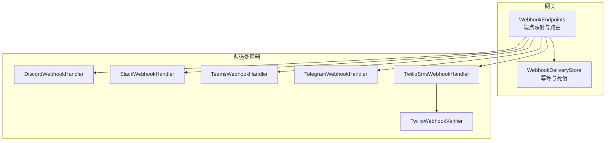
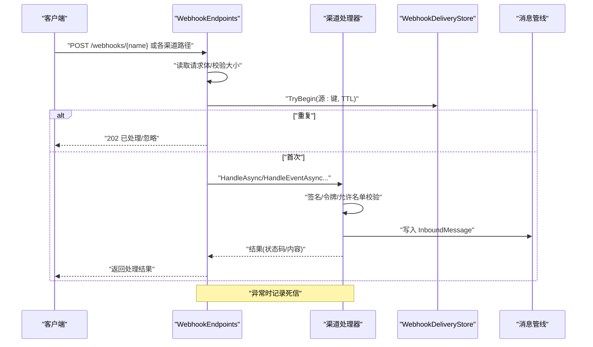
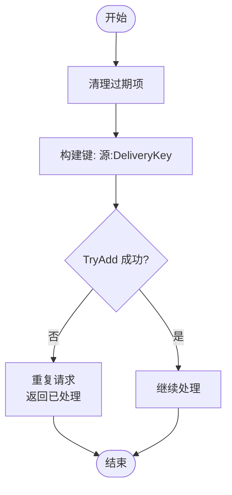
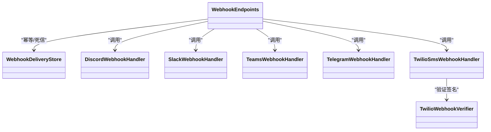

# Webhook 处理

<cite>
**本文引用的文件**
- [WebhookEndpoints.cs](file://src/OpenClaw.Gateway/Endpoints/WebhookEndpoints.cs)
- [WebhookDeliveryStore.cs](file://src/OpenClaw.Gateway/WebhookDeliveryStore.cs)
- [TwilioWebhookVerifier.cs](file://src/OpenClaw.Gateway/TwilioWebhookVerifier.cs)
- [DiscordWebhookHandler.cs](file://src/OpenClaw.Gateway/DiscordWebhookHandler.cs)
- [SlackWebhookHandler.cs](file://src/OpenClaw.Gateway/SlackWebhookHandler.cs)
- [TeamsWebhookHandler.cs](file://src/OpenClaw.Gateway/TeamsWebhookHandler.cs)
- [TelegramWebhookHandler.cs](file://src/OpenClaw.Gateway/TelegramWebhookHandler.cs)
- [TwilioSmsWebhookHandler.cs](file://src/OpenClaw.Gateway/TwilioSmsWebhookHandler.cs)
</cite>

## 目录
1. [简介](#简介)
2. [项目结构](#项目结构)
3. [核心组件](#核心组件)
4. [架构总览](#架构总览)
5. [详细组件分析](#详细组件分析)
6. [依赖关系分析](#依赖关系分析)
7. [性能考量](#性能考量)
8. [故障排除指南](#故障排除指南)
9. [结论](#结论)
10. [附录](#附录)

## 简介
本文件系统化阐述本仓库中的 Webhook 处理体系，覆盖接收机制、验证流程、消息投递、幂等性与死信记录、交付状态跟踪、事件类型与消息格式、错误处理与超时管理，并提供端点配置要点、验证算法说明与排障建议。目标是帮助开发者快速理解并正确配置各渠道 Webhook，确保安全、稳定、可追踪的消息流转。

## 项目结构
Webhook 相关代码集中在网关层（OpenClaw.Gateway），主要由以下部分组成：
- 网关端点映射：将不同渠道的 Webhook 路径注册为 HTTP 入口，统一进行请求体读取、限流、去重、校验与转发。
- 渠道处理器：针对 Discord、Slack、Teams、Telegram、Twilio SMS 等渠道实现专用解析与鉴权逻辑。
- 幂等与死信：基于内存去重表与本地磁盘死信目录，保障幂等与可观测性。
- 辅助工具：Twilio 签名计算与验证工具。

图表来源
- [WebhookEndpoints.cs:14-673](file://src/OpenClaw.Gateway/Endpoints/WebhookEndpoints.cs#L14-L673)
- [WebhookDeliveryStore.cs:9-183](file://src/OpenClaw.Gateway/WebhookDeliveryStore.cs#L9-L183)
- [DiscordWebhookHandler.cs:16-198](file://src/OpenClaw.Gateway/DiscordWebhookHandler.cs#L16-L198)
- [SlackWebhookHandler.cs:12-276](file://src/OpenClaw.Gateway/SlackWebhookHandler.cs#L12-L276)
- [TeamsWebhookHandler.cs:15-272](file://src/OpenClaw.Gateway/TeamsWebhookHandler.cs#L15-L272)
- [TelegramWebhookHandler.cs:10-252](file://src/OpenClaw.Gateway/TelegramWebhookHandler.cs#L10-L252)
- [TwilioSmsWebhookHandler.cs:9-246](file://src/OpenClaw.Gateway/TwilioSmsWebhookHandler.cs#L9-L246)
- [TwilioWebhookVerifier.cs:6-40](file://src/OpenClaw.Gateway/TwilioWebhookVerifier.cs#L6-L40)

章节来源
- [WebhookEndpoints.cs:14-673](file://src/OpenClaw.Gateway/Endpoints/WebhookEndpoints.cs#L14-L673)

## 核心组件
- 网关端点映射（WebhookEndpoints）：集中注册各渠道 Webhook 路由，统一执行请求体大小限制、去重、鉴权与转发到消息管线。
- 幂等与死信（WebhookDeliveryStore）：维护内存去重表与磁盘死信目录，支持查询、标记重放与丢弃。
- 渠道处理器：按渠道特性实现签名验证、允许名单过滤、会话标识生成、消息入队。
- Twilio 验证工具：提供签名计算与固定时间比较，用于 Twilio SMS 回调校验。

章节来源
- [WebhookEndpoints.cs:14-673](file://src/OpenClaw.Gateway/Endpoints/WebhookEndpoints.cs#L14-L673)
- [WebhookDeliveryStore.cs:9-183](file://src/OpenClaw.Gateway/WebhookDeliveryStore.cs#L9-L183)
- [TwilioWebhookVerifier.cs:6-40](file://src/OpenClaw.Gateway/TwilioWebhookVerifier.cs#L6-L40)

## 架构总览
下图展示从 HTTP 请求进入，到鉴权、去重、解析、入队与响应的整体流程。

图表来源
- [WebhookEndpoints.cs:543-632](file://src/OpenClaw.Gateway/Endpoints/WebhookEndpoints.cs#L543-L632)
- [WebhookDeliveryStore.cs:27-48](file://src/OpenClaw.Gateway/WebhookDeliveryStore.cs#L27-L48)

## 详细组件分析

### 网关端点映射（WebhookEndpoints）
- 统一入口：根据配置启用各渠道 Webhook，注册对应路由。
- 请求体读取与大小限制：使用通用辅助方法读取文本，结合配置的 MaxRequestBytes 进行限制。
- 去重（幂等）：以“源:键”为维度在内存表中记录，TTL 默认 6 小时；重复请求直接返回。
- 死信记录：异常时构造死信条目，写入磁盘目录，便于后续重放或丢弃。
- 特定渠道处理：
  - Twilio SMS：校验表单内容类型，读取 X-Twilio-Signature，使用 TwilioWebhookVerifier 验证；支持按 MessageSid 或哈希键去重。
  - Telegram：校验 X-Telegram-Bot-Api-Secret-Token；按 update_id 去重。
  - WhatsApp：支持 GET/POST；POST 时按消息 id/status id 去重，否则回退哈希键。
  - Teams：解析 Bot Framework Activity，可选 JWT 令牌校验，存储对话引用，按群组策略与允许名单过滤。
  - Discord：校验 Ed25519 签名（含时间戳窗口），处理交互类型（Ping/Command），支持允许服务器/频道白名单。
  - Slack：校验 HMAC-SHA256 签名（v0），区分 Events API 与 Slash Commands；支持 event_id 去重。
  - 通用 Webhook：支持 Idempotency-Key 或 X-OpenClaw-Delivery-Id 幂等头，或基于 body 哈希；可选 HMAC-SHA256 校验；将 body 注入模板后入队。

章节来源
- [WebhookEndpoints.cs:16-673](file://src/OpenClaw.Gateway/Endpoints/WebhookEndpoints.cs#L16-L673)

### 幂等与死信（WebhookDeliveryStore）
- 内存去重：并发字典保存“源:键 -> 到期时间”，定期清理过期项。
- 死信记录：序列化为 JSON 写入 admin/webhook-dead-letter 目录，支持列表、查询、标记重放/丢弃。
- 哈希键：对任意字符串做 SHA-256 十六进制大写表示，作为兜底去重键。

图表来源
- [WebhookDeliveryStore.cs:27-33](file://src/OpenClaw.Gateway/WebhookDeliveryStore.cs#L27-L33)
- [WebhookEndpoints.cs:52-57](file://src/OpenClaw.Gateway/Endpoints/WebhookEndpoints.cs#L52-L57)

章节来源
- [WebhookDeliveryStore.cs:9-183](file://src/OpenClaw.Gateway/WebhookDeliveryStore.cs#L9-L183)

### Discord Webhook（DiscordWebhookHandler）
- 签名验证：Ed25519，消息体为“时间戳+原始请求体”，拒绝超过 5 分钟的时间戳。
- 交互类型：Ping（1）直接回显；Application Command（2）解析命令参数，支持允许服务器/频道白名单与用户白名单。
- 入队消息：提取用户、频道、群组信息，生成 SessionId，发送“deferred”响应（type 5）以提示“正在输入”。

章节来源
- [DiscordWebhookHandler.cs:16-198](file://src/OpenClaw.Gateway/DiscordWebhookHandler.cs#L16-L198)
- [WebhookEndpoints.cs:320-378](file://src/OpenClaw.Gateway/Endpoints/WebhookEndpoints.cs#L320-L378)

### Slack Webhook（SlackWebhookHandler）
- 签名验证：HMAC-SHA256，v0=HMAC-SHA256(签名密钥, "v0:{timestamp}:{body}")，拒绝过期时间戳。
- 事件过滤：仅处理 event_callback，忽略 bot_message；支持 thread 场景的会话标识。
- Slash 命令：表单参数校验签名，组装命令文本，支持允许工作区/频道与用户白名单。

章节来源
- [SlackWebhookHandler.cs:12-276](file://src/OpenClaw.Gateway/SlackWebhookHandler.cs#L12-L276)
- [WebhookEndpoints.cs:380-541](file://src/OpenClaw.Gateway/Endpoints/WebhookEndpoints.cs#L380-L541)

### Teams Webhook（TeamsWebhookHandler）
- 令牌校验：可选 Bot Framework JWT 校验；解析 Activity，存储对话引用以便主动消息。
- 群组策略：支持 RequireMention、允许列表（conversation/team）与用户白名单。
- 文本处理：去除 @mention 标签，按最大长度截断。

章节来源
- [TeamsWebhookHandler.cs:15-272](file://src/OpenClaw.Gateway/TeamsWebhookHandler.cs#L15-L272)
- [WebhookEndpoints.cs:268-318](file://src/OpenClaw.Gateway/Endpoints/WebhookEndpoints.cs#L268-L318)

### Telegram Webhook（TelegramWebhookHandler）
- 去重键：优先使用 update_id，失败则回退到 body 哈希。
- 入队消息：支持多种消息类型（文本、媒体、编辑），自动识别媒体标记与回复消息。

章节来源
- [TelegramWebhookHandler.cs:10-252](file://src/OpenClaw.Gateway/TelegramWebhookHandler.cs#L10-L252)
- [WebhookEndpoints.cs:104-194](file://src/OpenClaw.Gateway/Endpoints/WebhookEndpoints.cs#L104-L194)

### Twilio SMS Webhook（TwilioSmsWebhookHandler）
- 签名验证：使用 TwilioWebhookVerifier 计算期望签名，固定时间比较。
- 允许名单：支持动态/静态号码白名单，严格模式与兼容模式两种策略。
- 关键词处理：STOP/UNSUBSCRIBE 等停止关键词自动设置联系人状态；HELP 显示帮助短信。
- 速率限制：按来源号码的每分钟配额进行限流，超限返回 429。
- 响应：成功返回 200，帮助/状态变更返回 TwiML XML。

章节来源
- [TwilioSmsWebhookHandler.cs:9-246](file://src/OpenClaw.Gateway/TwilioSmsWebhookHandler.cs#L9-L246)
- [TwilioWebhookVerifier.cs:6-40](file://src/OpenClaw.Gateway/TwilioWebhookVerifier.cs#L6-L40)
- [WebhookEndpoints.cs:23-102](file://src/OpenClaw.Gateway/Endpoints/WebhookEndpoints.cs#L23-L102)

## 依赖关系分析
- WebhookEndpoints 依赖各渠道处理器与 WebhookDeliveryStore；TwilioSmsWebhookHandler 依赖 TwilioWebhookVerifier。
- 各处理器依赖允许名单管理器、最近发送者存储、日志记录器等基础设施。
- 死信记录通过 JSON 序列化落盘，避免内存压力。

图表来源
- [WebhookEndpoints.cs:14-673](file://src/OpenClaw.Gateway/Endpoints/WebhookEndpoints.cs#L14-L673)
- [WebhookDeliveryStore.cs:9-183](file://src/OpenClaw.Gateway/WebhookDeliveryStore.cs#L9-L183)
- [TwilioSmsWebhookHandler.cs:9-246](file://src/OpenClaw.Gateway/TwilioSmsWebhookHandler.cs#L9-L246)
- [TwilioWebhookVerifier.cs:6-40](file://src/OpenClaw.Gateway/TwilioWebhookVerifier.cs#L6-L40)

## 性能考量
- 去重表清理：后台清理过期项，避免无限增长；TTL 默认 6 小时，可根据流量调整。
- 请求体读取：按 MaxRequestBytes 限制，防止内存占用过高；超限直接返回 413。
- 并发控制：TwilioSms 处理器按来源号码维护滑动窗口限流，避免突发洪峰。
- 死信落盘：异常时写入磁盘，不阻塞主流程；列表/查询接口支持后台运维。

章节来源
- [WebhookDeliveryStore.cs:158-166](file://src/OpenClaw.Gateway/WebhookDeliveryStore.cs#L158-L166)
- [WebhookEndpoints.cs:27-42](file://src/OpenClaw.Gateway/Endpoints/WebhookEndpoints.cs#L27-L42)
- [TwilioSmsWebhookHandler.cs:22-56](file://src/OpenClaw.Gateway/TwilioSmsWebhookHandler.cs#L22-L56)

## 故障排除指南
- 401 未授权
  - Slack：检查 X-Slack-Request-Timestamp 与 X-Slack-Signature 是否存在且未过期；确认签名密钥配置正确。
  - Discord：检查 X-Signature-Ed25519 与 X-Signature-Timestamp；平台是否支持 Ed25519。
  - Telegram：检查 X-Telegram-Bot-Api-Secret-Token 与配置一致。
  - Twilio SMS：检查 X-Twilio-Signature 与计算结果；确认 Public Base URL 与签名计算一致。
  - Teams：检查 Authorization JWT 令牌有效性与 serviceUrl/channelId 匹配。
- 413 请求体过大：增大对应渠道的 MaxRequestBytes 配置。
- 429 速率限制：调整 TwilioSms 的每分钟限额或等待冷却。
- 重复消息：确认幂等键（如 event_id/update_id/MessageSid）是否正确；若无可用键，系统会回退到哈希键。
- 死信排查：通过死信列表定位错误条目，标记重放或丢弃；核对错误信息与负载预览。

章节来源
- [WebhookEndpoints.cs:29-101](file://src/OpenClaw.Gateway/Endpoints/WebhookEndpoints.cs#L29-L101)
- [SlackWebhookHandler.cs:244-274](file://src/OpenClaw.Gateway/SlackWebhookHandler.cs#L244-L274)
- [DiscordWebhookHandler.cs:165-196](file://src/OpenClaw.Gateway/DiscordWebhookHandler.cs#L165-L196)
- [TelegramWebhookHandler.cs:32-45](file://src/OpenClaw.Gateway/TelegramWebhookHandler.cs#L32-L45)
- [TwilioSmsWebhookHandler.cs:107-128](file://src/OpenClaw.Gateway/TwilioSmsWebhookHandler.cs#L107-L128)
- [TeamsWebhookHandler.cs:64-72](file://src/OpenClaw.Gateway/TeamsWebhookHandler.cs#L64-L72)

## 结论
本系统通过统一的端点映射与渠道专用处理器，实现了多渠道 Webhook 的标准化接入。借助内存去重与死信机制，保障了幂等性与可观测性；通过严格的签名与令牌校验、允许名单与群组策略，提升了安全性。配合合理的超时与限流策略，可在高并发场景下保持稳定运行。

## 附录

### Webhook 端点与事件类型概览
- 通用 Webhook：/webhooks/{name}，支持幂等头与 HMAC 校验。
- Telegram：POST {Telegram.WebhookPath}，支持签名密钥校验。
- Twilio SMS：POST {Twilio.WebhookPath}，校验 X-Twilio-Signature。
- WhatsApp：GET/POST {WhatsApp.WebhookPath}，POST 时按消息/状态 id 去重。
- Teams：POST {Teams.WebhookPath}，可选 JWT 校验。
- Discord：POST {Discord.WebhookPath}，校验 Ed25519。
- Slack：Events API 与 Slash Commands 两条路径，均校验 HMAC-SHA256。

章节来源
- [WebhookEndpoints.cs:16-673](file://src/OpenClaw.Gateway/Endpoints/WebhookEndpoints.cs#L16-L673)

### 验证算法与要点
- Slack：v0=HMAC-SHA256(签名密钥, "v0:{timestamp}:{body}")，拒绝过期时间戳。
- Discord：Ed25519，消息体为“timestamp + body”，拒绝超过 5 分钟的时间戳。
- Telegram：X-Telegram-Bot-Api-Secret-Token 字符串精确比较。
- Twilio SMS：HMAC-SHA1 计算签名，固定时间比较；签名 URL 为 Public Base URL + Path。
- Teams：Bot Framework JWT 校验，需匹配 serviceUrl 与 channel。

章节来源
- [SlackWebhookHandler.cs:244-274](file://src/OpenClaw.Gateway/SlackWebhookHandler.cs#L244-L274)
- [DiscordWebhookHandler.cs:165-196](file://src/OpenClaw.Gateway/DiscordWebhookHandler.cs#L165-L196)
- [TelegramWebhookHandler.cs:122-134](file://src/OpenClaw.Gateway/TelegramWebhookHandler.cs#L122-L134)
- [TwilioWebhookVerifier.cs:8-37](file://src/OpenClaw.Gateway/TwilioWebhookVerifier.cs#L8-L37)
- [TeamsWebhookHandler.cs:64-72](file://src/OpenClaw.Gateway/TeamsWebhookHandler.cs#L64-L72)

### 错误处理与超时管理
- 请求体大小限制：按 MaxRequestBytes 返回 413。
- 签名/令牌校验失败：返回 401。
- 业务逻辑异常：记录死信并返回 500。
- 重复请求：直接返回“已处理/忽略”。
- 超时：HTTP 层由 ASP.NET Core 控制，建议在上游网关/反向代理设置合理超时与重试。

章节来源
- [WebhookEndpoints.cs:27-42](file://src/OpenClaw.Gateway/Endpoints/WebhookEndpoints.cs#L27-L42)
- [SlackWebhookHandler.cs:49-56](file://src/OpenClaw.Gateway/SlackWebhookHandler.cs#L49-L56)
- [DiscordWebhookHandler.cs:60-67](file://src/OpenClaw.Gateway/DiscordWebhookHandler.cs#L60-L67)
- [TelegramWebhookHandler.cs:122-134](file://src/OpenClaw.Gateway/TelegramWebhookHandler.cs#L122-L134)
- [TwilioSmsWebhookHandler.cs:107-114](file://src/OpenClaw.Gateway/TwilioSmsWebhookHandler.cs#L107-L114)
- [TeamsWebhookHandler.cs:64-72](file://src/OpenClaw.Gateway/TeamsWebhookHandler.cs#L64-L72)